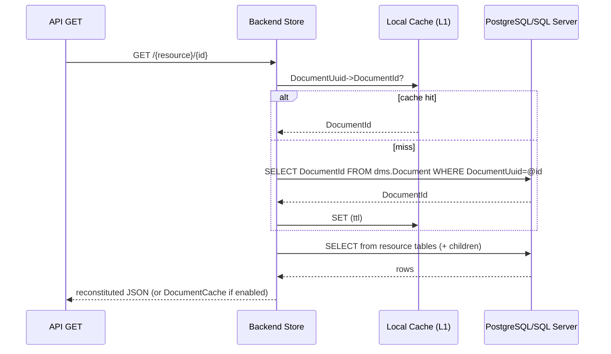

# Backend Redesign 1: Relational Primary Store (Tables per Resource)

## Status

Draft. This is an initial design proposal for replacing the current three-table document store (`Document`/`Alias`/`Reference`) with a relational model using tables per resource, while keeping DMS behavior metadata-driven via `ApiSchema.json`.

## Goals and Constraints

### Goals

1. **Relational-first storage**: Store resources in traditional relational tables (one root table per resource, plus child tables for collections).
2. **Metadata-driven behavior**: Continue to drive validation, identity/reference extraction, and query semantics using `ApiSchema.json` (no handwritten per-resource code).
3. **Low coupling to document shape**: Avoid hard-coding resource shapes in C#; schema awareness comes from metadata + conventions.
4. **Eliminate reference-cascade updates**: References should not require rewriting referencing documents when a natural key changes.
5. **SQL Server + PostgreSQL parity**: The design must be implementable (DDL + CRUD + query) on both engines.

### Constraints / Explicit Decisions

- **Cached JSON is optional**: The relational representation is the canonical source of truth. A JSON cache may exist only as an optimization/integration aid.
- **Schema updates require migration + restart**: Applying a new `ApiSchema.json` requires migrating the relational schema and restarting DMS; in-process schema reload/hot-reload is out of scope for this design.
- **Authorization is out of scope**: Ignore existing authorization-related tables/columns/scripts; authorization storage will be redesigned separately.
- **No code generation**: No generated per-resource C# or “checked-in generated SQL per resource”. SQL may still be *produced and executed* by a migrator from metadata, but should not require generated source artifacts to compile/run DMS.

## Related Changes Implied by This Redesign

- **Remove schema reload/hot-reload**: The current reload behavior exists primarily for testing convenience. With relational-first storage, schema changes are operational events (migration + restart), not runtime toggles.
- **E2E testing approach changes**: Instead of switching schemas in-place, E2E tests should provision separate databases/containers (or separate DMS instances) per schema/version under test.
- **Fail-fast on schema mismatch**: DMS should verify on startup that the database schema matches the configured effective `ApiSchema.json` set (core + extensions) fingerprint (see `dms.EffectiveSchema`) and refuse to start/serve if it does not.

## Glossary (Current DMS Terms)

- **DocumentUuid**: The API “id” (UUID) exposed in URLs and stored as `id` in documents.
- **DocumentId**: A database surrogate key (BIGINT) for internal relationships and FKs.
- **DocumentIdentity**: Ordered natural-key elements extracted from the document (from `identityJsonPaths`).
- **ReferentialId**: Deterministic UUIDv5 hash of `(ProjectName, ResourceName, DocumentIdentity)` used for identity-based lookups and references.
- **ProjectName / ResourceName**: As used in `ApiSchema.json` and current DMS.

## High-Level Architecture

Keep DMS Core (pipeline, validators, extractors) intact:

- Core continues to produce `DocumentInfo` (identity + `ReferentialId` + extracted references/descriptors) and operates on JSON bodies.
- Backend repositories (`IDocumentStoreRepository`, `IQueryHandler`) become responsible for:
  1. **Flattening** incoming JSON into relational tables
  2. **Reference resolution** (natural keys → `DocumentId`)
  3. **Reconstitution** (relational → JSON) for GET/query responses

This preserves the Core/Backend boundary and avoids leaking relational concerns into Core.

## Proposed Database Model

### Core tables (schema: `dms`)

#### 1) `dms.Document`

Canonical metadata per persisted resource instance. One row per document, regardless of resource type.

**PostgreSQL**

```sql
CREATE TABLE dms.Document (
    DocumentId bigint GENERATED ALWAYS AS IDENTITY PRIMARY KEY,
    DocumentUuid uuid NOT NULL,
    ProjectName varchar(256) NOT NULL,
    ResourceName varchar(256) NOT NULL,
    ResourceVersion varchar(64) NOT NULL,
    Etag varchar(128) NOT NULL,
    CreatedAt timestamp without time zone NOT NULL DEFAULT now(),
    LastModifiedAt timestamp without time zone NOT NULL DEFAULT now(),
    CONSTRAINT UX_Document_DocumentUuid UNIQUE (DocumentUuid)
);

CREATE INDEX IX_Document_ProjectName_ResourceName_CreatedAt
    ON dms.Document (ProjectName, ResourceName, CreatedAt, DocumentId);
```

Notes:
- `DocumentUuid` remains stable across identity updates; identity-based upserts map to it via `dms.ReferentialIdentity`.
- Authorization-related columns are intentionally omitted here.

#### 2) `dms.ReferentialIdentity`

Maps `ReferentialId` → `DocumentId` (replaces/absorbs today’s `dms.Alias`), including superclass aliases used for polymorphic references.

**PostgreSQL**

```sql
CREATE TABLE dms.ReferentialIdentity (
    ReferentialId uuid NOT NULL,
    DocumentId bigint NOT NULL,
    IdentityRole smallint NOT NULL,
    ProjectName varchar(256) NULL,
    ResourceName varchar(256) NULL,
    CONSTRAINT PK_ReferentialIdentity PRIMARY KEY (ReferentialId),
    CONSTRAINT FK_ReferentialIdentity_Document FOREIGN KEY (DocumentId)
        REFERENCES dms.Document (DocumentId) ON DELETE CASCADE,
    CONSTRAINT UX_ReferentialIdentity_DocumentId_IdentityRole UNIQUE (DocumentId, IdentityRole)
);

CREATE INDEX IX_ReferentialIdentity_DocumentId ON dms.ReferentialIdentity (DocumentId);
```

Database Specific Differences:
- The logical shape is identical across engines (UUID `ReferentialId` → BIGINT `DocumentId`).
- The physical DDL will differ slightly for performance: SQL Server should not cluster on a randomly-distributed UUID.

**SQL Server**

```sql
CREATE TABLE dms.ReferentialIdentity (
    ReferentialId uniqueidentifier NOT NULL,
    DocumentId bigint NOT NULL,
    IdentityRole smallint NOT NULL,
    ProjectName nvarchar(256) NULL,
    ResourceName nvarchar(256) NULL,
    CONSTRAINT PK_ReferentialIdentity PRIMARY KEY NONCLUSTERED (ReferentialId),
    CONSTRAINT FK_ReferentialIdentity_Document FOREIGN KEY (DocumentId)
        REFERENCES dms.Document (DocumentId) ON DELETE CASCADE,
    CONSTRAINT UX_ReferentialIdentity_DocumentId_IdentityRole UNIQUE CLUSTERED (DocumentId, IdentityRole)
);
```

Critical invariants:
- **Uniqueness** of `ReferentialId` enforces “one natural identity maps to one document”.
- Subclass writes insert both:
  - primary `ReferentialId` (subclass resource name)
  - superclass alias `ReferentialId` (superclass resource name)

This preserves current polymorphic reference behavior without a separate Alias table.

#### 3) `dms.Descriptor` (unified)

Descriptors are still documents, but we maintain a unified descriptor table keyed by the descriptor document’s `DocumentId`. This makes descriptor FK enforcement possible without per-descriptor tables.

**PostgreSQL**

```sql
CREATE TABLE dms.Descriptor (
    DocumentId bigint NOT NULL,
    Namespace varchar(255) NOT NULL,
    CodeValue varchar(50) NOT NULL,
    ShortDescription varchar(75) NOT NULL,
    Description varchar(1024) NULL,
    Discriminator varchar(128) NOT NULL,
    Uri varchar(306) NOT NULL,
    CONSTRAINT PK_Descriptor PRIMARY KEY (DocumentId),
    CONSTRAINT FK_Descriptor_Document FOREIGN KEY (DocumentId)
        REFERENCES dms.Document (DocumentId) ON DELETE CASCADE,
    CONSTRAINT UX_Descriptor_Uri_Discriminator UNIQUE (Uri, Discriminator)
);

CREATE INDEX IX_Descriptor_Uri_Discriminator ON dms.Descriptor (Uri, Discriminator);
```

Descriptor references (recommended base design):
- Use an FK directly to `dms.Descriptor(DocumentId)` to guarantee “this is a descriptor” at the DB level.
- Use `dms.Descriptor.Discriminator` as the descriptor type (e.g., `GradeLevelDescriptor`) for lookups (`Uri + Discriminator`) and application-level type validation.

If DB-level enforcement of “descriptor must be of type X” becomes necessary later we can add checks that the referenced `dms.Descriptor.Discriminator` is the expected type for that FK column (derived from `ApiSchema`).

#### 4) `dms.EffectiveSchema` + `dms.SchemaComponent`

Tracks which **effective schema** (core `ApiSchema.json` + extension `ApiSchema.json` files) the database is migrated to, and records the **exact project versions** present in that effective schema. At startup, DMS will use this to validate consistency between the loaded ApiSchema.json files and the database (see **EffectiveSchemaHash Calculation** below).

**PostgreSQL**

```sql
CREATE TABLE dms.EffectiveSchema (
    EffectiveSchemaId bigint GENERATED ALWAYS AS IDENTITY PRIMARY KEY,
    ApiSchemaFormatVersion varchar(64) NOT NULL,
    EffectiveSchemaHash varchar(64) NOT NULL,
    AppliedAt timestamp without time zone NOT NULL DEFAULT now()
);

CREATE UNIQUE INDEX UX_EffectiveSchema_EffectiveSchemaHash
    ON dms.EffectiveSchema (EffectiveSchemaHash);

CREATE TABLE dms.SchemaComponent (
    EffectiveSchemaId bigint NOT NULL
        REFERENCES dms.EffectiveSchema (EffectiveSchemaId) ON DELETE CASCADE,
    ProjectNamespace varchar(128) NOT NULL,
    ProjectName varchar(256) NOT NULL,
    ProjectVersion varchar(64) NOT NULL,
    IsExtensionProject boolean NOT NULL,
    CONSTRAINT PK_SchemaComponent PRIMARY KEY (EffectiveSchemaId, ProjectNamespace)
);
```

##### EffectiveSchemaHash Calculation

`EffectiveSchemaHash` is a deterministic fingerprint of the configured schema set (core + extensions) as it affects relational mapping. It must be stable across file ordering, whitespace, and JSON property ordering.

Recommendations:
- Use `SHA-256` and store as lowercase hex (64 chars).
- Require a single `ApiSchemaFormatVersion` across core + extensions (fail fast if they differ).
- Validate that each configured `ApiSchema.json` file contributes exactly one `projectSchemas[ProjectNamespace]` entry.
- Exclude OpenAPI payloads from hashing to avoid churn and reduce input size:
  - `projectSchemas[*].openApiBaseDocuments`
  - `projectSchemas[*].resourceSchemas[*].openApiFragments`
- Keep arrays in-order (many arrays are semantically ordered), but sort objects by property name recursively.
- Include a DMS-controlled constant “relational mapping version” so that a breaking change in mapping conventions forces a mismatch even if ApiSchema content is unchanged.

Algorithm (suggested):
1. Parse the configured core + extension ApiSchema files.
2. For each file, extract:
   - `ApiSchemaFormatVersion` (`apiSchemaVersion`)
   - the single `projectSchemas[ProjectNamespace]` entry (after removing OpenAPI payloads)
3. Sort projects by `ProjectNamespace`.
4. Compute `ProjectHash = SHA-256(canonicalJson(projectSchema))` for each project.
5. Compute `EffectiveSchemaHash = SHA-256(manifestString)` where `manifestString` is:
   - a constant header (e.g., `dms-effective-schema-hash:v1`)
   - a constant mapping version (e.g., `relational-mapping:v1`)
   - `ApiSchemaFormatVersion`
   - one line per project: `ProjectNamespace|ProjectName|ProjectVersion|IsExtensionProject|ProjectHash`

Pseudocode:

```text
const HashVersion = "dms-effective-schema-hash:v1"
const RelationalMappingVersion = "relational-mapping:v1"

projects = []
apiSchemaFormatVersion = null
for file in configuredApiSchemaFiles:
  json = parse(file)
  apiSchemaFormatVersion = apiSchemaFormatVersion ?? json.apiSchemaVersion
  assert(apiSchemaFormatVersion == json.apiSchemaVersion)
  (projectNamespace, projectSchema) = extractSingleProjectSchema(json.projectSchemas)
  projectSchema = removeOpenApiPayloads(projectSchema)
  projectHash = sha256hex(canonicalizeJson(projectSchema))
  projects.add({
    projectNamespace,
    projectName: projectSchema.projectName,
    projectVersion: projectSchema.projectVersion,
    isExtensionProject: projectSchema.isExtensionProject,
    projectHash
  })

projects = sortBy(projects, p => p.projectNamespace)

manifest =
  HashVersion + "\n" +
  RelationalMappingVersion + "\n" +
  "apiSchemaFormatVersion=" + apiSchemaFormatVersion + "\n" +
  join(projects, "\n",
    p.projectNamespace + "|" +
    p.projectName + "|" +
    p.projectVersion + "|" +
    p.isExtensionProject + "|" +
    p.projectHash)

effectiveSchemaHash = sha256hex(utf8(manifest))
```

#### 5) Optional: `dms.DocumentCache`

Full JSON cache of the reconstituted document. **Not required for correctness**.

**PostgreSQL**

```sql
CREATE TABLE dms.DocumentCache (
    DocumentId bigint PRIMARY KEY
        REFERENCES dms.Document (DocumentId) ON DELETE CASCADE,
    DocumentJson jsonb NOT NULL,
    ComputedAt timestamp without time zone NOT NULL DEFAULT now(),
    CONSTRAINT CK_DocumentCache_JsonObject CHECK (jsonb_typeof(DocumentJson) = 'object')
);
```

Uses:
- Faster GET/query responses (skip reconstitution)
- Easier CDC / OpenSearch indexing / external integrations

When disabled, DMS must reconstitute JSON from relational tables.

### Resource tables (schema per project)

Each project gets a schema derived from `ProjectNamespace` (e.g., `ed-fi` → `edfi`, `tpdm` → `tpdm`). Core `dms.*` tables remain in `dms`.

For each resource `R`:

#### Root table: `{schema}.{R}`

One row per document; PK is `DocumentId` (shared surrogate key).

Typical structure:
- `DocumentId BIGINT` **PK/FK** → `dms.Document(DocumentId)` ON DELETE CASCADE
- Natural key columns (from `identityJsonPaths`) → unique constraint
- Scalar columns for top-level non-collection properties
- Reference FK columns:
  - Non-descriptor references (concrete target): `..._DocumentId BIGINT` FK → `{schema}.{TargetResource}(DocumentId)` to enforce existence *and* resource type
  - Non-descriptor references (polymorphic/abstract target): `..._DocumentId BIGINT` FK → `dms.Document(DocumentId)` plus optional discriminator/membership enforcement (see Reference Validation)
  - Descriptor references: `..._DescriptorId BIGINT` FK → `dms.Descriptor(DocumentId)`

#### Child tables for collections

For each JSON array of objects/scalars under the resource:

`{schema}.{R}_{CollectionPath}` (name derived deterministically; see Naming Rules)
- `Id BIGINT` identity **PK** (needed for deeper nesting)
- `ParentDocumentId BIGINT` FK → `{schema}.{R}(DocumentId)` ON DELETE CASCADE
- `Ordinal INT NOT NULL` (preserve array order for reconstitution)
- Scalar columns for the element object
- Reference/descriptor FK columns as above
- Unique constraints derived from `arrayUniquenessConstraints` when available

Nested collections create additional tables referencing the parent child table’s `Id`.

#### PostgreSQL examples (Student, School, StudentSchoolAssociation)

```sql
CREATE SCHEMA IF NOT EXISTS edfi;

CREATE TABLE IF NOT EXISTS edfi.Student (
    DocumentId       bigint PRIMARY KEY
                     REFERENCES dms.Document(DocumentId) ON DELETE CASCADE,

    StudentUniqueId  varchar(32)  NOT NULL,
    FirstName        varchar(75)  NOT NULL,
    LastSurname      varchar(75)  NOT NULL,
    BirthDate        date         NULL,

    CONSTRAINT UX_Student_StudentUniqueId UNIQUE (StudentUniqueId)
);

-- Descriptor references are stored as FKs directly to dms.Descriptor.
-- The expected descriptor type is validated via dms.Descriptor.Discriminator (application-level, or triggers if desired).

CREATE TABLE IF NOT EXISTS edfi.School (
    DocumentId             bigint PRIMARY KEY
                           REFERENCES dms.Document(DocumentId) ON DELETE CASCADE,

    SchoolId               int          NOT NULL,
    NameOfInstitution      varchar(255) NOT NULL,
    ShortNameOfInstitution varchar(75)  NULL,
    SchoolTypeDescriptor_DescriptorId bigint NULL
                           REFERENCES dms.Descriptor(DocumentId),

    CONSTRAINT UX_School_SchoolId UNIQUE (SchoolId)
);

-- Example collection table: School has a collection of GradeLevelDescriptor values
-- (e.g., 1st, 2nd, 3rd, ...) stored as rows. Ordinal preserves client order.
CREATE TABLE IF NOT EXISTS edfi.SchoolGradeLevel (
    Id bigint GENERATED ALWAYS AS IDENTITY PRIMARY KEY,

    School_DocumentId bigint NOT NULL
                      REFERENCES edfi.School(DocumentId) ON DELETE CASCADE,

    Ordinal int NOT NULL,

    GradeLevelDescriptor_DescriptorId bigint NOT NULL
                      REFERENCES dms.Descriptor(DocumentId),

    CONSTRAINT UX_SchoolGradeLevel UNIQUE (School_DocumentId, GradeLevelDescriptor_DescriptorId)
);

CREATE INDEX IF NOT EXISTS IX_SchoolGradeLevel_SchoolDocumentId
    ON edfi.SchoolGradeLevel(School_DocumentId);

CREATE TABLE IF NOT EXISTS edfi.StudentSchoolAssociation (
    DocumentId         bigint PRIMARY KEY
                       REFERENCES dms.Document(DocumentId) ON DELETE CASCADE,

    Student_DocumentId bigint NOT NULL
                       REFERENCES edfi.Student(DocumentId),

    School_DocumentId  bigint NOT NULL
                       REFERENCES edfi.School(DocumentId),

    EntryDate          date   NOT NULL,
    ExitWithdrawDate   date   NULL,

    CONSTRAINT UX_StudentSchoolAssociation UNIQUE (Student_DocumentId, School_DocumentId, EntryDate)
);

CREATE INDEX IF NOT EXISTS IX_SSA_StudentDocumentId ON edfi.StudentSchoolAssociation(Student_DocumentId);
CREATE INDEX IF NOT EXISTS IX_SSA_SchoolDocumentId  ON edfi.StudentSchoolAssociation(School_DocumentId);
```

### Extensions

Extension projects and resource extensions should follow a consistent 1:1 and 1:N pattern without merging extension columns into the core resource table:

- For `isResourceExtension: true` resources, create `{schema}.{BaseResource}Extension_{Project}` tables keyed by `DocumentId` (1:1) and child tables for extension collections.
- This prevents core schema churn and keeps SQL Server row width/column count manageable.

## Reference Validation

Reference validation is provided by **two layers** (mirroring what the current `Reference` table + FK does, but in a relational way):

### 1) Write-time validation (application-level)

During POST/PUT processing, the backend:
- Resolves each extracted reference (`DocumentReference` / `DescriptorReference`) from `ReferentialId` → `DocumentId` using `dms.ReferentialIdentity`.
- Fails the request if any referenced identity does not exist (same semantics as today: descriptor failures vs resource reference failures).

This is required because the relational tables store **`DocumentId` foreign keys**, and we cannot write those without resolving them.

### 2) Database enforcement (FKs)

Relational tables store references as FKs so the database enforces referential integrity:

- **Concrete non-descriptor references**: FK to the **target resource table**, e.g. `FK(StudentSchoolAssociation.School_DocumentId → edfi.School.DocumentId)`. This validates both existence and type.
- **Descriptor references**: FK directly to `dms.Descriptor`. This validates existence (“is a descriptor”); `Discriminator` supports type validation in the application (or via optional triggers).
- **Polymorphic references** (e.g., `EducationOrganization`): a single FK to a concrete table is not possible. Baseline enforcement is:
  - FK to `dms.Document(DocumentId)` (existence)
  - Application validation ensures the referenced `DocumentId` is one of the allowed concrete types

If DB-level enforcement of polymorphic membership is required, add one of:
- A `...Discriminator` column + trigger that checks `dms.Document.ResourceName` for the referenced `DocumentId`
- A small membership table per abstract type (e.g., `edfi.EducationOrganizationMembership(DocumentId)`), maintained by triggers on the concrete resource tables, and FK to the membership table

### Delete conflicts

Deletes rely on the same FK graph:
- If a document is referenced, `DELETE` fails with an FK violation; DMS maps that to a `409` conflict.
- Because FK names are deterministic, DMS can map the violated constraint back to a resource/table to report “what is referencing me” without a separate `Reference` edge table.

## Naming Rules (Deterministic, Cross-DB Safe)

To keep migrations tractable and avoid rename cascades, physical names must be deterministic:

- Schema name: derived from `ProjectNamespace` (`ed-fi` → `edfi`, non-alphanumerics removed/normalized).
- Table names: PascalCase resource names (MetaEd `resourceName`), plus deterministic suffixes for collections.
- Column names: PascalCase of JSON property names, with suffixes:
  - `..._DocumentId` for non-descriptor references
  - `..._DescriptorId` for descriptor references
- Max identifier length handling:
  - PostgreSQL: 63 bytes; SQL Server: 128 chars
  - When exceeding, apply deterministic truncation + short hash suffix.

## How `ApiSchema.json` Drives This Design

The design uses existing metadata and adds minimal new hints to avoid embedding full “flattening metadata” if we can derive it.

### Existing ApiSchema inputs (already present)

- `jsonSchemaForInsert`: authoritative shape, types, formats, maxLength, required
- `identityJsonPaths`: natural key extraction and uniqueness
- `documentPathsMapping`: identifies references vs scalars vs descriptor paths, plus reference identity mapping
- `decimalPropertyValidationInfos`: precision/scale for `decimal`
- `arrayUniquenessConstraints`: relational unique constraints for collection tables
- `isSubclass` + superclass metadata: drives alias identity insertion
- `queryFieldMapping`: defines queryable fields and their JSON paths/types

### Proposed ApiSchema additions (small, optional)

Add an optional `relational` section to each `resourceSchema` to keep the mapping stable without enumerating every column:

```json
{
  "relational": {
    "mappingVersion": "1",
    "schemaNameOverride": "edfi",
    "nameOverrides": {
      "$.someVeryLongPropertyName...": "ShortColumnName"
    },
    "collectionNaming": {
      "$.addresses[*]": "Address",
      "$.addresses[*].periods[*]": "AddressPeriod"
    },
    "splitObjects": [
      "$.someLargeNestedObject"
    ]
  }
}
```

Intent:
- Default behavior is convention-based derivation from JSON Schema.
- Overrides are used only to handle name collisions/length limits and rare modeling edge cases.
- This avoids “flattening metadata” duplication while staying metadata-driven and non-generated.

## Write Path (POST Upsert / PUT by id)

### Common steps

1. Core validates JSON and extracts:
   - `DocumentIdentity` + `ReferentialId`
   - Document references (with `ReferentialId`s)
   - Descriptor references (with `ReferentialId`s, normalized URI)
2. Backend resolves references in bulk:
   - `dms.ReferentialIdentity` lookup for document refs → `DocumentId[]`
   - `dms.ReferentialIdentity` + `dms.Descriptor` existence check for descriptor refs
3. Backend writes within a single transaction:
   - `dms.Document` insert/update (sets `Etag`, `LastModifiedAt`, etc.)
   - `dms.ReferentialIdentity` upsert (primary + superclass aliases)
   - Resource root + child tables (replace strategy for collections)
   - `dms.Descriptor` upsert if the resource is a descriptor
   - Optional: refresh `dms.DocumentCache`

### Insert vs update detection

- **Upsert (POST)**: detect by `ReferentialId`:
  - Find `DocumentId` from `dms.ReferentialIdentity` where `IdentityRole=Primary` for that referential id.
- **Update by id (PUT)**: detect by `DocumentUuid`:
  - Find `DocumentId` from `dms.Document` by `DocumentUuid`.

### Identity updates (AllowIdentityUpdates)

If identity changes on update:
- Update `dms.ReferentialIdentity` by removing/replacing the primary `ReferentialId` mapping.
- References stored as FKs (`DocumentId`) remain valid; no cascading rewrite needed.

### Concurrency (ETag)

- Compare `If-Match` header to `dms.Document.Etag`.
- Implement row-level locking per engine (UPDLOCK/HOLDLOCK in SQL Server, `FOR UPDATE` in PostgreSQL) when needed.

## Read Path (GET by id / GET query)

### GET by id

1. Resolve `DocumentUuid` → `DocumentId` via `dms.Document`.
2. If `dms.DocumentCache` enabled and present, return cached JSON (with correct `_etag`, `_lastModifiedDate`, and `id`).
3. Otherwise, reconstitute:
   - Load resource root row + child rows (batched) and assemble JSON in C# using the relational mapping derived from `ApiSchema`.
   - For descriptor properties: join to `dms.Descriptor` to output `namespace#codeValue` URI (or stored `Uri`).
   - For document references: join to referenced resource root tables to output reference identity objects (natural key values).

Reconstitution must preserve:
- Array order (via `Ordinal`)
- Required vs optional properties
- The API surface properties (`id`, `_etag`, `_lastModifiedDate`)

### Query

Filter directly on **resource root table columns** and (when needed) resolve reference/descriptor query terms to `DocumentId`s.

1. Translate query parameters to typed filters using Core’s canonicalization rules (`ValidateQueryMiddleware` → `QueryElement[]`).
2. Build a SQL predicate plan from `ApiSchema`:
   - **Scalar query fields**: `queryFieldMapping` JSON path → derived root-table column → `r.Column = @value`
   - **Descriptor query fields** (e.g., `schoolTypeDescriptor`): resolve `Uri` → `DescriptorId` via `dms.Descriptor(Uri, Discriminator)` → `r.DescriptorIdColumn = @descriptorId`
   - **Document reference query fields** (e.g., `studentUniqueId` on `StudentSchoolAssociation`): resolve the referenced resource identity → referenced `DocumentId` (or set of `DocumentId`s) → `r.Student_DocumentId = @documentId` (or `IN (...)`)
3. Execute a `DocumentId` page query:
   - `SELECT r.DocumentId FROM {schema}.{Resource} r`
   - Apply compiled predicates (intersection/AND across query terms; OR within a single query field if it maps to multiple JSON paths/columns)
   - Apply stable ordering and paging (`ORDER BY r.DocumentId OFFSET @offset LIMIT @limit`)

Example (PostgreSQL) - filter Students by `lastSurname`, return the page starting at offset 50:

```sql
SELECT r.DocumentId
FROM edfi.Student AS r
WHERE r.LastSurname = @LastSurname
ORDER BY r.DocumentId
OFFSET 50
LIMIT @Limit;
```

Join to `dms.Document` only when you need cross-cutting metadata (e.g., `CreatedAt`/`LastModifiedAt` ordering, `DocumentUuid`/ETag selection) or filters that live in `dms.Document`.

4. Fetch documents:
   - If cache enabled, return cached JSON for the page
   - Else, reconstitute for each `DocumentId` (batching table reads per resource)

Reference/descriptor resolution is metadata-driven (no per-resource code):
- For **descriptor** query params: the descriptor URI string is directly resolvable via `dms.Descriptor`.
- For **document reference** query params: use `documentPathsMapping.referenceJsonPaths` to group query terms by reference, and:
  - If all referenced identity components are present, compute the referenced `ReferentialId` and resolve a single `DocumentId` via `dms.ReferentialIdentity`.
  - If only a subset is present, resolve a *set* of referenced `DocumentId`s by querying the referenced root table’s identity columns, then filter the FK column with `IN (subquery)` (or an equivalent join).

Indexing:
- Create B-tree indexes on the resource root columns used by `queryFieldMapping` (scalar columns and FK columns).
- Rely on existing unique/identity indexes on referenced resource natural-key columns (and on `dms.ReferentialIdentity.ReferentialId`) to make reference resolution fast.

## Caching (Low-Complexity Options)

This design is intentionally relational-first and correct without caching. Caches are optional optimizations; keep them small, bounded, and easy to invalidate.

### Recommended cache targets

1. **Derived relational mapping (from `ApiSchema`)**
   - Cache the derived mapping per `(EffectiveSchemaHash, ProjectName, ResourceName)`.
   - Includes: JsonPath→(table,column), collection table names, query param→column/type plan, and prepared SQL templates.
   - Invalidation: schema migration + restart (natural).

2. **`dms.ReferentialIdentity` lookups**
   - Cache `ReferentialId → DocumentId` for:
     - identity-based upsert detection
     - resolving references on writes
     - resolving reference-based query filters
   - Invalidation:
     - on insert: add cache entry after commit
     - on identity update: remove old `ReferentialId` entry and add new entry after commit
     - on delete: remove relevant entries (or rely on short TTL)

3. **`dms.Descriptor` lookups**
   - Cache `(Uri, Discriminator) → DescriptorDocumentId` for descriptor resolution/validation and query filters.
   - Descriptors are typically append-mostly; short TTL is usually sufficient even without explicit invalidation.

4. **`DocumentUuid → DocumentId`**
   - Cache GET/PUT/DELETE resolution.
   - Invalidation: add on insert, remove on delete (or rely on TTL).

Avoid initially:
- Query-result caching (authorization filters and paging make invalidation/keying complex).
- Negative caching for missing identities/descriptors (can cause “false not found” after recent inserts unless TTL is tiny).

### Cache keying strategy

Prefer **versioned keys** so schema changes do not require distributed invalidation:

- Always include `(DmsInstanceId, EffectiveSchemaHash)` in cache keys.
- For local caches, treat `EffectiveSchemaHash` as part of the cache namespace.
- For Redis, prefix keys with `dms:{DmsInstanceId}:{EffectiveSchemaHash}:...`.

### Local-only (per-node) option

Use an in-process `MemoryCache`:
- Lowest complexity; no network hop.
- Good for: derived mapping, `ReferentialId → DocumentId`, descriptor resolution.
- Multi-node correctness: use TTL and commit-time updates; accept brief staleness windows unless identity updates are frequent.

Suggested defaults:
- derived mapping: no TTL (bounded by schema count; cleared on restart)
- `ReferentialId → DocumentId`: sliding TTL (e.g., 5–30 minutes)
- descriptor resolution: longer TTL (e.g., 30–120 minutes)
- `DocumentUuid → DocumentId`: short TTL (e.g., 5–30 minutes)

### Redis (distributed) option

Add Redis as an optional L2 cache:
- Reduces DB round-trips across nodes for hot lookups.
- Keep it simple:
  - cache-aside reads
  - write-through updates after successful commit
  - TTL everywhere
  - versioned keys via `EffectiveSchemaHash` (no “flush all keys” needed on migration)

Invalidation approaches (choose one):
- **TTL-only** (simplest): accept brief staleness; mitigate with short TTL for identity-related keys if identity updates are enabled.
- **Best-effort delete on writes**: on identity updates/deletes, delete affected Redis keys after commit.
- Optional later: pub/sub “invalidate key” messages to reduce staleness for local L1 caches.

### Invalidation rules (recommended)

- **Schema migration**:
  - migration writes a new `dms.EffectiveSchema` row (and `dms.SchemaComponent` rows)
  - DMS restart is required; local caches are naturally cleared
  - Redis keys are automatically isolated by new `EffectiveSchemaHash` prefix
- **Successful write transaction commit**:
  - update local/Redis caches for the touched identity/descriptor/uuid keys
  - do not populate caches before commit
- **Identity updates** (`AllowIdentityUpdates=true`):
  - explicitly evict old `ReferentialId` keys and write the new mapping after commit
  - if caching “reference identity fragments” (`DocumentId → natural key values`), evict those for the updated resource after commit or keep TTL short and skip explicit eviction

### Pseudocode (cache-aside, versioned keys)

```csharp
// Cache key namespace: dms:{dmsInstanceId}:{effectiveSchemaHash}:{kind}:{key}
string CacheKey(string kind, string key) =>
    $"dms:{dmsInstanceId}:{effectiveSchemaHash}:{kind}:{key}";

async Task<long?> ResolveReferentialIdAsync(Guid referentialId, CancellationToken ct)
{
    var cacheKey = CacheKey("refid", referentialId.ToString("N"));

    if (localCache.TryGetValue<long>(cacheKey, out var documentId))
        return documentId;

    if (redis is not null && await redis.TryGetAsync<long>(cacheKey, ct) is { } redisDocId)
    {
        localCache.Set(cacheKey, redisDocId, ttl: TimeSpan.FromMinutes(10));
        return redisDocId;
    }

    var dbDocId = await db.QuerySingleOrDefaultAsync<long?>(
        "select DocumentId from dms.ReferentialIdentity where ReferentialId = @ReferentialId",
        new { ReferentialId = referentialId },
        ct);

    if (dbDocId is null)
        return null;

    localCache.Set(cacheKey, dbDocId.Value, ttl: TimeSpan.FromMinutes(10));
    if (redis is not null)
        await redis.SetAsync(cacheKey, dbDocId.Value, ttl: TimeSpan.FromMinutes(10), ct);

    return dbDocId.Value;
}

// After a successful commit:
Task OnIdentityUpsertCommitted(Guid referentialId, long documentId) =>
    CacheWriteThroughAsync(CacheKey("refid", referentialId.ToString("N")), documentId, ttl: TimeSpan.FromMinutes(10));

Task OnIdentityUpdateCommitted(Guid oldReferentialId, Guid newReferentialId, long documentId) =>
    Task.WhenAll(
        CacheDeleteAsync(CacheKey("refid", oldReferentialId.ToString("N"))),
        CacheWriteThroughAsync(CacheKey("refid", newReferentialId.ToString("N")), documentId, ttl: TimeSpan.FromMinutes(10))
    );
```

### Mermaid diagrams

**Write (Upsert) with reference + descriptor caches**

```mermaid
sequenceDiagram
  participant Core as DMS Core
  participant Backend as Backend Store
  participant L1 as Local Cache (L1)
  participant Redis as Redis (L2, optional)
  participant DB as PostgreSQL/SQL Server

  Core->>Backend: Upsert(resourceJson, extracted Referentials)
  Backend->>L1: Resolve Referentials/Descriptors?
  alt L1 hit
    L1-->>Backend: DocumentId/DescriptorId
  else L1 miss
    Backend->>Redis: GET refid/descriptor (optional)
    alt Redis hit
      Redis-->>Backend: value
      Backend->>L1: SET (ttl)
    else Redis miss / disabled
      Backend->>DB: SELECT dms.ReferentialIdentity / dms.Descriptor
      DB-->>Backend: ids
      Backend->>L1: SET (ttl)
      Backend->>Redis: SET (ttl) (optional)
    end
  end
  Backend->>DB: BEGIN; write dms.Document + resource tables; COMMIT
  Backend->>L1: write-through identity/uuid/descriptor keys
  Backend->>Redis: write-through keys (optional)
  Backend-->>Core: success
```

**Read (GET by id) with minimal caches**



## Delete Path (DELETE by id)

1. Resolve `DocumentUuid` → `DocumentId`.
2. Attempt delete from `dms.Document` (which cascades to resource tables and identities).
3. Rely on FK constraints from referencing resource tables to `dms.Document` / `dms.Descriptor` to prevent deleting referenced records.

Error reporting:
- SQL Server and PostgreSQL will report FK constraint violations. DMS should map the violated constraint name back to the referencing resource (deterministic FK naming) to produce a conflict response comparable to today’s `DeleteFailureReference`.

## Migration Strategy (Schema Changes)

Because schema changes require migration, the contract becomes:

- DMS loads `ApiSchema.json` at startup; **there is no in-process schema reload** for relational storage.
- When `ApiSchema.json` changes, the database must be migrated and DMS must be restarted before the new schema is active.
- A migrator tool (or admin endpoint) performs:
  1. Load ApiSchema
  2. Derive required relational model (tables/columns/indexes/FKs)
  3. Diff against current DB
  4. Apply DDL changes (or emit a script to be applied)
  5. Record success in `dms.EffectiveSchema` and `dms.SchemaComponent`

Migration scope:
- Additive changes (new properties/collections) are straightforward.
- Renames/removals should require explicit operator intent (drop/rename hints) to avoid destructive surprises.

## SQL Server Parity Notes (Design Guardrails)

- Avoid PostgreSQL-only features in the **core** design (e.g., jsonb GIN as the only query strategy).
- Use standard types:
  - `BIGINT`, `INT`, `BIT/BOOLEAN`, `DATE`, `DATETIME2/TIMESTAMP`, `DECIMAL(p,s)`, `NVARCHAR/VARCHAR`
- Preserve array order with explicit `Ordinal INT`, not implicit ordering.
- Plan for identifier length limits and reserved words.
- Watch SQL Server limits:
  - max columns per table (1024)
  - row size constraints; prefer extension tables and 1:1 split tables for very wide objects

## Key Implications vs the Current Three-Table Design

- `dms.Reference` is no longer required for referential integrity; the database enforces integrity via FKs.
- `UpdateCascadeHandler` becomes unnecessary for identity updates because references are stored as `DocumentId` FKs and reconstituted from current referenced identities.
- Identity uniqueness is enforced in `dms.ReferentialIdentity` (and optionally in resource root unique constraints for direct human-debuggable keys).

## Risks / Open Questions

1. **Reconstitution cost** without JSON cache, especially for query responses returning many documents.
   - Mitigation: aggressive batching, optional cache, and/or DB-side JSON assembly in later iterations.
2. **CDC / OpenSearch / downstream integrations** that currently depend on a single “document table with JSON”.
   - Mitigation: require cache for those deployments, or introduce a materializer that emits JSON from relational changes.
3. **Delete conflict details**: replacing reverse-reference enumeration (`dms.Reference`) with FK-based detection may change which referencing resources can be reported.
4. **Schema evolution**: handling renames and destructive changes safely and predictably.

## Suggested Implementation Phases

1. **Foundational tables**: `dms.Document`, `dms.ReferentialIdentity`, `dms.Descriptor`, `dms.EffectiveSchema`, `dms.SchemaComponent`.
2. **One resource end-to-end**: implement relational mapping + CRUD + reconstitution for a small resource (and descriptors).
3. **Column-based query**: build SQL query predicates from `ApiSchema` and execute paging queries directly on the resource root table (with reference/descriptor resolution).
4. **Generalize mapping**: make mapping derivation generic from ApiSchema + conventions; add minimal `relational` overrides.
5. **Migration tool**: derive/apply DDL and record the effective schema/version set.
6. **Optional cache + integration**: `dms.DocumentCache` and any required event/materialization paths.

## Operational Considerations

### Random UUID index behavior (`dms.ReferentialIdentity.ReferentialId`)

`ReferentialId` is a UUID (deterministic UUIDv5) and is effectively randomly distributed for index insertion. The primary concern is **write amplification** (page splits, fragmentation/bloat), not point-lookup speed.

**SQL Server guidance**
- Use a sequential clustered key (recommended above: cluster on `(DocumentId, IdentityRole)`), and keep the UUID key as a **NONCLUSTERED** PK/unique index.
- Consider a lower `FILLFACTOR` on the UUID index (e.g., 80–90) to reduce page splits; monitor fragmentation and rebuild/reorganize as needed.

**PostgreSQL guidance**
- B-tree point lookups on UUID are fine; manage bloat under high write rates with:
  - index/table `fillfactor` (e.g., 80–90) if insert churn is high
  - healthy autovacuum settings and monitoring
  - periodic `REINDEX` when bloat warrants it
- If sustained ingest is extreme, consider hash partitioning `dms.ReferentialIdentity` by `ReferentialId` (e.g., 8–32 partitions) to reduce contention and make maintenance cheaper.
