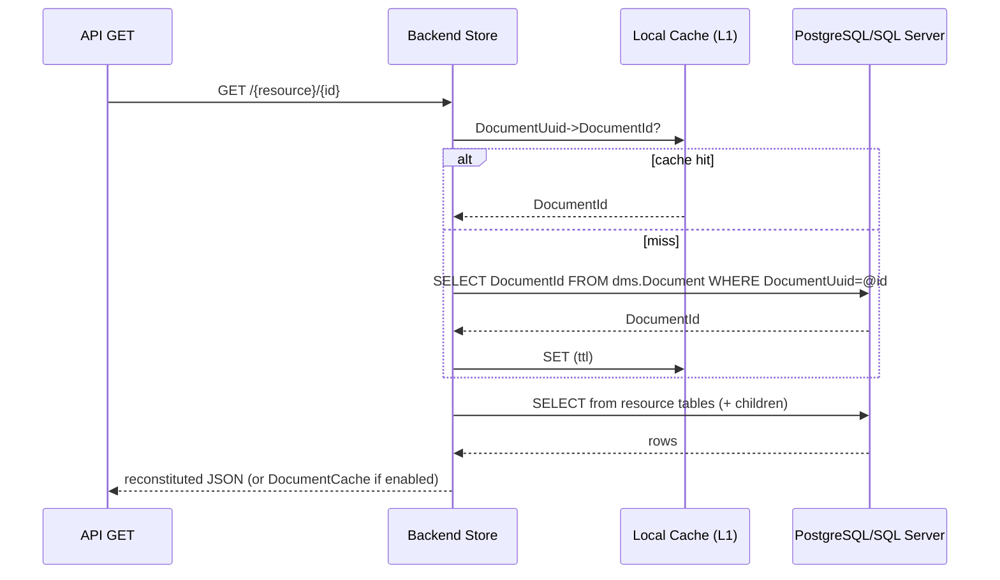

# Backend Redesign 1: Relational Primary Store (Tables per Resource)

## Status

Draft. This is an initial design proposal for replacing the current three-table document store (`Document`/`Alias`/`Reference`) with a relational model using tables per resource, while keeping DMS behavior metadata-driven via `ApiSchema.json`.

## Goals and Constraints

### Goals

1. **Relational-first storage**: Store resources in traditional relational tables (one root table per resource, plus child tables for collections).
2. **Metadata-driven behavior**: Continue to drive validation, identity/reference extraction, and query semantics using `ApiSchema.json` (no handwritten per-resource code).
3. **Low coupling to document shape**: Avoid hard-coding resource shapes in C#; schema awareness comes from metadata + conventions.
4. **Eliminate reference-cascade updates**: References should not require rewriting referencing documents when a natural key changes.
5. **SQL Server + PostgreSQL parity**: The design must be implementable (DDL + CRUD + query) on both engines.

### Constraints / Explicit Decisions

- **Cached JSON is optional**: The relational representation is the canonical source of truth. A JSON cache may exist only as an optimization/integration aid.
- **Schema updates require migration + restart**: Applying a new `ApiSchema.json` requires migrating the relational schema and restarting DMS; in-process schema reload/hot-reload is out of scope for this design.
- **Authorization is out of scope**: Ignore existing authorization-related tables/columns/scripts; authorization storage will be redesigned separately.
- **No code generation**: No generated per-resource C# or “checked-in generated SQL per resource”. SQL may still be *produced and executed* by a migrator from metadata, but should not require generated source artifacts to compile/run DMS.

## Related Changes Implied by This Redesign

- **Remove schema reload/hot-reload**: The current reload behavior exists primarily for testing convenience. With relational-first storage, schema changes are operational events (migration + restart), not runtime toggles.
- **E2E testing approach changes**: Instead of switching schemas in-place, E2E tests should provision separate databases/containers (or separate DMS instances) per schema/version under test.
- **Fail-fast on schema mismatch**: DMS should verify on startup that the database schema matches the configured effective `ApiSchema.json` set (core + extensions) fingerprint (see `dms.EffectiveSchema`) and refuse to start/serve if it does not.

## Glossary (Current DMS Terms)

- **DocumentUuid**: The API “id” (UUID) exposed in URLs and stored as `id` in documents.
- **DocumentId**: A database surrogate key (BIGINT) for internal relationships and FKs.
- **DocumentIdentity**: Ordered natural-key elements extracted from the document (from `identityJsonPaths`).
- **ReferentialId**: Deterministic UUIDv5 hash of `(ProjectName, ResourceName, DocumentIdentity)` used for identity-based lookups and references.
- **ProjectName / ResourceName**: As used in `ApiSchema.json` and current DMS.

## High-Level Architecture

Keep DMS Core (pipeline, validators, extractors) intact:

- Core continues to produce `DocumentInfo` (identity + `ReferentialId` + extracted references/descriptors) and operates on JSON bodies.
- Backend repositories (`IDocumentStoreRepository`, `IQueryHandler`) become responsible for:
  1. **Flattening** incoming JSON into relational tables
  2. **Reference resolution** (natural keys → `DocumentId`)
  3. **Reconstitution** (relational → JSON) for GET/query responses

This preserves the Core/Backend boundary and avoids leaking relational concerns into Core.

## Proposed Database Model

### Core tables (schema: `dms`)

#### 1) `dms.Document`

Canonical metadata per persisted resource instance. One row per document, regardless of resource type.

**PostgreSQL**

```sql
CREATE TABLE dms.Document (
    DocumentId bigint GENERATED ALWAYS AS IDENTITY PRIMARY KEY,
    DocumentUuid uuid NOT NULL,
    ProjectName varchar(256) NOT NULL,
    ResourceName varchar(256) NOT NULL,
    ResourceVersion varchar(64) NOT NULL,
    Etag varchar(128) NOT NULL,
    CreatedAt timestamp without time zone NOT NULL DEFAULT now(),
    LastModifiedAt timestamp without time zone NOT NULL DEFAULT now(),
    CONSTRAINT UX_Document_DocumentUuid UNIQUE (DocumentUuid)
);

CREATE INDEX IX_Document_ProjectName_ResourceName_CreatedAt
    ON dms.Document (ProjectName, ResourceName, CreatedAt, DocumentId);
```

Notes:
- `DocumentUuid` remains stable across identity updates; identity-based upserts map to it either via `dms.ReferentialIdentity` (self-contained identities) or via the resource root table’s natural-key unique constraint on resolved `..._DocumentId` FK columns + scalar identity parts (reference-bearing identities).
- Authorization-related columns are intentionally omitted here.

#### 2) `dms.ReferentialIdentity`

Maps `ReferentialId` → `DocumentId` (replaces/absorbs today’s `dms.Alias`), including superclass aliases used for polymorphic references.

**PostgreSQL**

```sql
CREATE TABLE dms.ReferentialIdentity (
    ReferentialId uuid NOT NULL,
    DocumentId bigint NOT NULL,
    IdentityRole smallint NOT NULL,
    ProjectName varchar(256) NULL,
    ResourceName varchar(256) NULL,
    CONSTRAINT PK_ReferentialIdentity PRIMARY KEY (ReferentialId),
    CONSTRAINT FK_ReferentialIdentity_Document FOREIGN KEY (DocumentId)
        REFERENCES dms.Document (DocumentId) ON DELETE CASCADE,
    CONSTRAINT UX_ReferentialIdentity_DocumentId_IdentityRole UNIQUE (DocumentId, IdentityRole)
);

CREATE INDEX IX_ReferentialIdentity_DocumentId ON dms.ReferentialIdentity (DocumentId);
```

Database Specific Differences:
- The logical shape is identical across engines (UUID `ReferentialId` → BIGINT `DocumentId`).
- The physical DDL will differ slightly for performance: SQL Server should not cluster on a randomly-distributed UUID.

**SQL Server**

```sql
CREATE TABLE dms.ReferentialIdentity (
    ReferentialId uniqueidentifier NOT NULL,
    DocumentId bigint NOT NULL,
    IdentityRole smallint NOT NULL,
    ProjectName nvarchar(256) NULL,
    ResourceName nvarchar(256) NULL,
    CONSTRAINT PK_ReferentialIdentity PRIMARY KEY NONCLUSTERED (ReferentialId),
    CONSTRAINT FK_ReferentialIdentity_Document FOREIGN KEY (DocumentId)
        REFERENCES dms.Document (DocumentId) ON DELETE CASCADE,
    CONSTRAINT UX_ReferentialIdentity_DocumentId_IdentityRole UNIQUE CLUSTERED (DocumentId, IdentityRole)
);
```

Critical invariants:
- **Uniqueness** of `ReferentialId` enforces “one natural identity maps to one document” for identities that can be computed from the document itself (self-contained identities and descriptor URIs). For identities that include other resources’ identities (reference-bearing identities), the authoritative uniqueness check is the resource root table’s natural-key unique constraint on resolved `..._DocumentId` FK columns + scalar identity parts (see Write Path).
- Subclass writes insert both:
  - primary `ReferentialId` (subclass resource name)
  - superclass alias `ReferentialId` (superclass resource name)

This preserves current polymorphic reference behavior without a separate Alias table.

#### 3) `dms.Descriptor` (unified)

Descriptors are still documents, but we maintain a unified descriptor table keyed by the descriptor document’s `DocumentId`. This makes descriptor FK enforcement possible without per-descriptor tables.

**PostgreSQL**

```sql
CREATE TABLE dms.Descriptor (
    DocumentId bigint NOT NULL,
    Namespace varchar(255) NOT NULL,
    CodeValue varchar(50) NOT NULL,
    ShortDescription varchar(75) NOT NULL,
    Description varchar(1024) NULL,
    Discriminator varchar(128) NOT NULL,
    Uri varchar(306) NOT NULL,
    CONSTRAINT PK_Descriptor PRIMARY KEY (DocumentId),
    CONSTRAINT FK_Descriptor_Document FOREIGN KEY (DocumentId)
        REFERENCES dms.Document (DocumentId) ON DELETE CASCADE,
    CONSTRAINT UX_Descriptor_Uri_Discriminator UNIQUE (Uri, Discriminator)
);

CREATE INDEX IX_Descriptor_Uri_Discriminator ON dms.Descriptor (Uri, Discriminator);
```

Descriptor references (recommended base design):
- Use an FK directly to `dms.Descriptor(DocumentId)` to guarantee “this is a descriptor” at the DB level.
- Resolve descriptor URI strings by computing the descriptor `ReferentialId` (descriptor resource type from `ApiSchema` + normalized URI, per Core) and looking up `DocumentId` via `dms.ReferentialIdentity` (use `dms.Descriptor` for expansion/type diagnostics, not for resolution).

If DB-level enforcement of “descriptor must be of type X” becomes necessary later we can add checks that the referenced `dms.Descriptor.Discriminator` is the expected type for that FK column (derived from `ApiSchema`).

#### 4) `dms.EffectiveSchema` + `dms.SchemaComponent`

Tracks which **effective schema** (core `ApiSchema.json` + extension `ApiSchema.json` files) the database is migrated to, and records the **exact project versions** present in that effective schema. At startup, DMS will use this to validate consistency between the loaded ApiSchema.json files and the database (see **EffectiveSchemaHash Calculation** below).

**PostgreSQL**

```sql
CREATE TABLE dms.EffectiveSchema (
    EffectiveSchemaId bigint GENERATED ALWAYS AS IDENTITY PRIMARY KEY,
    ApiSchemaFormatVersion varchar(64) NOT NULL,
    EffectiveSchemaHash varchar(64) NOT NULL,
    AppliedAt timestamp without time zone NOT NULL DEFAULT now()
);

CREATE UNIQUE INDEX UX_EffectiveSchema_EffectiveSchemaHash
    ON dms.EffectiveSchema (EffectiveSchemaHash);

CREATE TABLE dms.SchemaComponent (
    EffectiveSchemaId bigint NOT NULL
        REFERENCES dms.EffectiveSchema (EffectiveSchemaId) ON DELETE CASCADE,
    ProjectNamespace varchar(128) NOT NULL,
    ProjectName varchar(256) NOT NULL,
    ProjectVersion varchar(64) NOT NULL,
    IsExtensionProject boolean NOT NULL,
    CONSTRAINT PK_SchemaComponent PRIMARY KEY (EffectiveSchemaId, ProjectNamespace)
);
```

##### EffectiveSchemaHash Calculation

`EffectiveSchemaHash` is a deterministic fingerprint of the configured schema set (core + extensions) as it affects relational mapping. It must be stable across file ordering, whitespace, and JSON property ordering.

Recommendations:
- Use `SHA-256` and store as lowercase hex (64 chars).
- Require a single `ApiSchemaFormatVersion` across core + extensions (fail fast if they differ).
- Validate that each configured `ApiSchema.json` file contributes exactly one `projectSchemas[ProjectNamespace]` entry.
- Exclude OpenAPI payloads from hashing to avoid churn and reduce input size:
  - `projectSchemas[*].openApiBaseDocuments`
  - `projectSchemas[*].resourceSchemas[*].openApiFragments`
- Keep arrays in-order (many arrays are semantically ordered), but sort objects by property name recursively.
- Include a DMS-controlled constant “relational mapping version” so that a breaking change in mapping conventions forces a mismatch even if ApiSchema content is unchanged.

Algorithm (suggested):
1. Parse the configured core + extension ApiSchema files.
2. For each file, extract:
   - `ApiSchemaFormatVersion` (`apiSchemaVersion`)
   - the single `projectSchemas[ProjectNamespace]` entry (after removing OpenAPI payloads)
3. Sort projects by `ProjectNamespace`.
4. Compute `ProjectHash = SHA-256(canonicalJson(projectSchema))` for each project.
5. Compute `EffectiveSchemaHash = SHA-256(manifestString)` where `manifestString` is:
   - a constant header (e.g., `dms-effective-schema-hash:v1`)
   - a constant mapping version (e.g., `relational-mapping:v1`)
   - `ApiSchemaFormatVersion`
   - one line per project: `ProjectNamespace|ProjectName|ProjectVersion|IsExtensionProject|ProjectHash`

Pseudocode:

```text
const HashVersion = "dms-effective-schema-hash:v1"
const RelationalMappingVersion = "relational-mapping:v1"

projects = []
apiSchemaFormatVersion = null
for file in configuredApiSchemaFiles:
  json = parse(file)
  apiSchemaFormatVersion = apiSchemaFormatVersion ?? json.apiSchemaVersion
  assert(apiSchemaFormatVersion == json.apiSchemaVersion)
  (projectNamespace, projectSchema) = extractSingleProjectSchema(json.projectSchemas)
  projectSchema = removeOpenApiPayloads(projectSchema)
  projectHash = sha256hex(canonicalizeJson(projectSchema))
  projects.add({
    projectNamespace,
    projectName: projectSchema.projectName,
    projectVersion: projectSchema.projectVersion,
    isExtensionProject: projectSchema.isExtensionProject,
    projectHash
  })

projects = sortBy(projects, p => p.projectNamespace)

manifest =
  HashVersion + "\n" +
  RelationalMappingVersion + "\n" +
  "apiSchemaFormatVersion=" + apiSchemaFormatVersion + "\n" +
  join(projects, "\n",
    p.projectNamespace + "|" +
    p.projectName + "|" +
    p.projectVersion + "|" +
    p.isExtensionProject + "|" +
    p.projectHash)

effectiveSchemaHash = sha256hex(utf8(manifest))
```

#### 5) Optional: `dms.DocumentCache`

Full JSON cache of the reconstituted document. **Not required for correctness**.

**PostgreSQL**

```sql
CREATE TABLE dms.DocumentCache (
    DocumentId bigint PRIMARY KEY
        REFERENCES dms.Document (DocumentId) ON DELETE CASCADE,
    DocumentJson jsonb NOT NULL,
    ComputedAt timestamp without time zone NOT NULL DEFAULT now(),
    CONSTRAINT CK_DocumentCache_JsonObject CHECK (jsonb_typeof(DocumentJson) = 'object')
);
```

Uses:
- Faster GET/query responses (skip reconstitution)
- Easier CDC / OpenSearch indexing / external integrations

When disabled, DMS must reconstitute JSON from relational tables.

#### 6) Optional: `dms.ReferenceEdge` (reverse reference index)

A small, relational reverse index of **“this document references that document”**, maintained on writes.

Important properties:
- **Not required for correctness**: relational FKs enforce integrity. This table exists for *reverse lookups* (cache invalidation/diagnostics), not enforcement.
- **Stores resolved `DocumentId`s only**: no `ReferentialId` resolution, no partition keys, no alias joins.
- **Can be disabled**: if you do not enable `dms.DocumentCache` (or you accept TTL-only staleness), you can omit this table entirely.

Primary uses:
- **`dms.DocumentCache` dependency invalidation**: when a referenced document’s identity/descriptor URI changes, invalidate cached JSON for documents that embed that identity/URI.
- **Delete conflict diagnostics**: answer “who references me?” without scanning all tables or relying solely on constraint-name mapping.
- Optional future use: identity-propagation tooling if DMS chooses to preserve referential-id-based upsert semantics across identity updates.

##### DDL (PostgreSQL)

```sql
CREATE TABLE dms.ReferenceEdge (
    ParentDocumentId bigint NOT NULL
        REFERENCES dms.Document (DocumentId) ON DELETE CASCADE,
    ChildDocumentId  bigint NOT NULL
        REFERENCES dms.Document (DocumentId) ON DELETE CASCADE,

    -- Stable identifier of *where* the reference came from in the parent document.
    -- Derived from ApiSchema bindings (see BindingKey below).
    BindingKey varchar(256) NOT NULL,

    CreatedAt timestamp without time zone NOT NULL DEFAULT now(),

    CONSTRAINT PK_ReferenceEdge PRIMARY KEY (ParentDocumentId, BindingKey, ChildDocumentId)
);

-- Reverse lookup: "who references Child X?"
CREATE INDEX IX_ReferenceEdge_ChildDocumentId
    ON dms.ReferenceEdge (ChildDocumentId)
    INCLUDE (ParentDocumentId, BindingKey);

-- Optional: fast enumeration of a parent’s outgoing references (diagnostics/debug)
CREATE INDEX IX_ReferenceEdge_ParentDocumentId
    ON dms.ReferenceEdge (ParentDocumentId)
    INCLUDE (ChildDocumentId, BindingKey);
```

##### DDL (SQL Server)

```sql
CREATE TABLE dms.ReferenceEdge (
    ParentDocumentId bigint NOT NULL,
    ChildDocumentId  bigint NOT NULL,
    BindingKey nvarchar(256) NOT NULL,
    CreatedAt datetime2(7) NOT NULL CONSTRAINT DF_ReferenceEdge_CreatedAt DEFAULT (sysutcdatetime()),
    CONSTRAINT PK_ReferenceEdge PRIMARY KEY CLUSTERED (ParentDocumentId, BindingKey, ChildDocumentId),
    CONSTRAINT FK_ReferenceEdge_Parent FOREIGN KEY (ParentDocumentId)
        REFERENCES dms.Document (DocumentId) ON DELETE CASCADE,
    CONSTRAINT FK_ReferenceEdge_Child FOREIGN KEY (ChildDocumentId)
        REFERENCES dms.Document (DocumentId) ON DELETE CASCADE
);

CREATE INDEX IX_ReferenceEdge_ChildDocumentId
    ON dms.ReferenceEdge (ChildDocumentId)
    INCLUDE (ParentDocumentId, BindingKey);
```

##### BindingKey (stable, non-generated, cross-engine)

`BindingKey` is a deterministic identifier of the reference binding derived from ApiSchema:

- For **document references**: `{ParentProject}.{ParentResource}:{ReferenceObjectPath}`
  - Example: `EdFi.StudentSchoolAssociation:$.studentReference`
- For **descriptor references**: `{ParentProject}.{ParentResource}:{DescriptorValuePath}`
  - Example: `EdFi.School:$.schoolTypeDescriptor`

`ReferenceObjectPath`/`DescriptorValuePath` are the canonical/wildcard JSON paths from the derived `ReferenceBinding`/`DescriptorBinding` (no numeric indices).

Purpose:
- Distinguish multiple reference sites that may point to the same `ChildDocumentId` (do not collapse to just `(ParentDocumentId, ChildDocumentId)`).
- Support low-churn edge maintenance by treating the “current reference set” for a parent as unique `(ChildDocumentId, BindingKey)` pairs.
- Provide actionable diagnostics/debugging (“who references me, and via which field/path?”) and enables future selective invalidation policies if needed.

Length handling:
- If the computed string exceeds 256 chars, apply deterministic truncation + short hash suffix (same rule family as Naming Rules).

Example C# helper (used during model compilation):

```csharp
static string BuildBindingKey(QualifiedResourceName parent, JsonPathExpression path)
{
    var raw = $"{parent.ProjectName}.{parent.ResourceName}:{path.Canonical}";
    if (raw.Length <= 256) return raw;

    var hash8 = Sha256Hex(raw).Substring(0, 8);
    return raw.Substring(0, 256 - 1 - 8) + "|" + hash8;
}
```

##### Addressing common concerns (explicit)

**Concern: “We’re moving away from the three-table design because `dms.Reference` is slow/high churn. Won’t this be the same?”**

No, unless we implement it naively and enable it everywhere. Key differences:
- `dms.ReferenceEdge` is **optional** and can be enabled only when needed (e.g., `dms.DocumentCache` correctness across identity changes).
- It stores **resolved `DocumentId` pairs**, so there is no `ReferentialId → DocumentId` join (no Alias-equivalent lookup), and no partition keys.
- It can be maintained with a **low-churn diff** so “update that does not change references” performs **0 row writes** to this table.
- It must not be used for referential integrity, so it can be operated in **eventual-consistency** mode (async maintenance + TTL cache) if desired.

**Concern: “Doesn’t this require the same InsertReferences pattern?”**

We can use a similar *concept* (stage + diff) to avoid churn, but it is far simpler than today’s `InsertReferences` because:
- inputs are already-resolved `DocumentId`s (no Alias joins, no invalid `ReferentialId` reporting),
- there is no partition-routing logic,
- the table is keyed by the parent `DocumentId` (single delete scope), and
- the diff is between two small sets of `(ChildDocumentId, BindingKey)`.

**Concern: “Why does `dms.DocumentCache` need invalidation? Is this cascading updates?”**

`dms.DocumentCache` stores **fully reconstituted JSON**, including:
- reference objects expanded from the *current* identity values of referenced resources, and
- descriptor URI strings (often derived from current descriptor fields).

If a referenced document’s identity/URI changes, the cached JSON of documents that reference it becomes stale. This is a *cache invalidation cascade*, not a relational data cascade:
- relational FK columns remain stable (`..._DocumentId` still points to the same row),
- only cached JSON is invalidated/recomputed.

Sample invalidation is shown in the Caching section.

### Resource tables (schema per project)

Each project gets a schema derived from `ProjectNamespace` (e.g., `ed-fi` → `edfi`, `tpdm` → `tpdm`). Core `dms.*` tables remain in `dms`.

For each resource `R`:

#### Root table: `{schema}.{R}`

One row per document; PK is `DocumentId` (shared surrogate key).

Typical structure:
- `DocumentId BIGINT` **PK/FK** → `dms.Document(DocumentId)` ON DELETE CASCADE
- Natural key columns (from `identityJsonPaths`) → unique constraint. For identity elements that come from a document reference object, the unique constraint uses the corresponding `..._DocumentId` FK column rather than duplicating the referenced natural-key fields.
- Scalar columns for top-level non-collection properties
- Reference FK columns:
  - Non-descriptor references (concrete target): `..._DocumentId BIGINT` FK → `{schema}.{TargetResource}(DocumentId)` to enforce existence *and* resource type
  - Non-descriptor references (polymorphic/abstract target): `..._DocumentId BIGINT` FK → `dms.Document(DocumentId)` plus optional discriminator/membership enforcement (see Reference Validation)
  - Descriptor references: `..._DescriptorId BIGINT` FK → `dms.Descriptor(DocumentId)`

#### Child tables for collections

For each JSON array of objects/scalars under the resource:

`{schema}.{R}_{CollectionPath}` (name derived deterministically; see Naming Rules)
- Parent key columns (for root-level arrays this is typically `<RootResource>_DocumentId BIGINT` FK → `{schema}.{R}(DocumentId)` ON DELETE CASCADE)
- `Ordinal INT NOT NULL` (preserve array order for reconstitution)
- Primary key is **composite** on parent key + ordinal (e.g., `PRIMARY KEY (School_DocumentId, Ordinal)`)
- Scalar columns for the element object
- Reference/descriptor FK columns as above
- Unique constraints derived from `arrayUniquenessConstraints` when available (often separate from the PK)

Nested collections add the parent’s ordinal(s) into the key and FK, avoiding generated IDs and `RETURNING`/`OUTPUT` key-capture round trips.

#### Abstract identity views for polymorphic references (union view approach)

Some Ed-Fi references target **abstract resources** (polymorphic references), notably:
- `EducationOrganization` (e.g., `educationOrganizationReference`)
- `GeneralStudentProgramAssociation` (e.g., `generalStudentProgramAssociationReference`)

Abstract resources have **no physical root table**, but DMS must still:
- validate membership/type for abstract-target references (application-level), and
- **reconstitute reference identity objects** on reads (e.g., output `educationOrganizationId`, not `schoolId`).

This design uses a narrow **union view per abstract resource**:

- View name: `{schema}.{AbstractResource}_View` (deterministic; participates in migration like tables)
- Columns:
  - `DocumentId` (the referenced document)
  - `Discriminator` (concrete resource name; optional but recommended for diagnostics)
  - one column per abstract identity element (typed), using the abstract identity field names
- Rows:
  - `UNION ALL` over each concrete resource table that participates in the hierarchy, projecting:
    - `DocumentId`
    - abstract identity columns (including identity renames, e.g. `School.SchoolId AS EducationOrganizationId`)
    - discriminator constant (e.g., `'School'`)

**Why a view**
- Works well for small, stable hierarchies (your stated case).
- Requires no triggers and no additional write-path maintenance.
- Provides a single join target for identity projection during reconstitution.

**How DMS derives the view definition (metadata-driven)**
- Source of truth is `ApiSchema.json`:
  - `projectSchema.abstractResources[A].identityPathOrder` defines the abstract identity field names and order.
  - `resourceSchema.isSubclass` + `superclass*` fields define which concrete resources belong to `A` and how identity renames map.
- DMS chooses a canonical SQL type for each abstract identity field (from `abstractResources[A].openApiFragment` when present, otherwise from the participating concrete resources) and casts each `SELECT` accordingly to keep the union portable across engines.
- For each concrete resource `R` in the hierarchy, DMS derives, per abstract identity field:
  - If `R.identityJsonPaths` contains `$.{fieldName}`, use the corresponding root-table column directly.
  - Else, if `R.isSubclass=true` and `R.superclassIdentityJsonPath == $.{fieldName}`, use the concrete identity column(s) from `R.identityJsonPaths` (identity rename case; e.g., `$.schoolId` → `EducationOrganizationId`).
- If a concrete type cannot supply all abstract identity fields, migration/startup fails fast (schema mismatch).

**PostgreSQL example: `EducationOrganization_View`**

```sql
CREATE OR REPLACE VIEW edfi.EducationOrganization_View AS
SELECT
    s.DocumentId,
    s.SchoolId AS EducationOrganizationId,
    'School'::varchar(256) AS Discriminator
FROM edfi.School s
UNION ALL
SELECT
    lea.DocumentId,
    lea.LocalEducationAgencyId AS EducationOrganizationId,
    'LocalEducationAgency'::varchar(256) AS Discriminator
FROM edfi.LocalEducationAgency lea
UNION ALL
SELECT
    sea.DocumentId,
    sea.StateEducationAgencyId AS EducationOrganizationId,
    'StateEducationAgency'::varchar(256) AS Discriminator
FROM edfi.StateEducationAgency sea;
```

**SQL Server example: `EducationOrganization_View`**

```sql
CREATE OR ALTER VIEW edfi.EducationOrganization_View AS
SELECT
    s.DocumentId,
    s.SchoolId AS EducationOrganizationId,
    CAST('School' AS nvarchar(256)) AS Discriminator
FROM edfi.School s
UNION ALL
SELECT
    lea.DocumentId,
    lea.LocalEducationAgencyId AS EducationOrganizationId,
    CAST('LocalEducationAgency' AS nvarchar(256)) AS Discriminator
FROM edfi.LocalEducationAgency lea
UNION ALL
SELECT
    sea.DocumentId,
    sea.StateEducationAgencyId AS EducationOrganizationId,
    CAST('StateEducationAgency' AS nvarchar(256)) AS Discriminator
FROM edfi.StateEducationAgency sea;
```

**How the view is used**
- **Write-time resolution**: abstract references resolve via `dms.ReferentialIdentity` (superclass aliases) and do not depend on the view.
- **Read-time identity projection**: when reconstituting an abstract-target reference object, join to `{AbstractResource}_View` by `DocumentId` to fetch the abstract identity fields.
- **Optional membership/type validation**: to ensure a `..._DocumentId` FK to `dms.Document` actually belongs to the allowed hierarchy, application code can validate `EXISTS (SELECT 1 FROM {AbstractResource}_View WHERE DocumentId=@id)`.

Operational note:
- Adding a new concrete subtype requires a migration that updates the view definition (same operational contract as table changes).
- If view performance ever becomes a bottleneck, consider materialization (PostgreSQL materialized view; SQL Server indexed view) as a later, measured optimization.

#### PostgreSQL examples (Student, School, StudentSchoolAssociation)

```sql
CREATE SCHEMA IF NOT EXISTS edfi;

CREATE TABLE IF NOT EXISTS edfi.Student (
    DocumentId       bigint PRIMARY KEY
                     REFERENCES dms.Document(DocumentId) ON DELETE CASCADE,

    StudentUniqueId  varchar(32)  NOT NULL,
    FirstName        varchar(75)  NOT NULL,
    LastSurname      varchar(75)  NOT NULL,
    BirthDate        date         NULL,

    CONSTRAINT UX_Student_StudentUniqueId UNIQUE (StudentUniqueId)
);

-- Descriptor references are stored as FKs directly to dms.Descriptor.
-- The expected descriptor type is validated via dms.Descriptor.Discriminator (application-level, or triggers if desired).

CREATE TABLE IF NOT EXISTS edfi.School (
    DocumentId             bigint PRIMARY KEY
                           REFERENCES dms.Document(DocumentId) ON DELETE CASCADE,

    SchoolId               int          NOT NULL,
    NameOfInstitution      varchar(255) NOT NULL,
    ShortNameOfInstitution varchar(75)  NULL,
    SchoolTypeDescriptor_DescriptorId bigint NULL
                           REFERENCES dms.Descriptor(DocumentId),

    CONSTRAINT UX_School_SchoolId UNIQUE (SchoolId)
);

-- Example collection table: School has a collection of GradeLevelDescriptor values
-- (e.g., 1st, 2nd, 3rd, ...) stored as rows. Ordinal preserves client order.
CREATE TABLE IF NOT EXISTS edfi.SchoolGradeLevel (
    School_DocumentId bigint NOT NULL
                      REFERENCES edfi.School(DocumentId) ON DELETE CASCADE,

    Ordinal int NOT NULL,

    GradeLevelDescriptor_DescriptorId bigint NOT NULL
                      REFERENCES dms.Descriptor(DocumentId),

    CONSTRAINT PK_SchoolGradeLevel PRIMARY KEY (School_DocumentId, Ordinal),
    CONSTRAINT UX_SchoolGradeLevel UNIQUE (School_DocumentId, GradeLevelDescriptor_DescriptorId)
);

-- Example nested collection with composite keys:
-- School -> addresses[*] -> periods[*]
CREATE TABLE IF NOT EXISTS edfi.SchoolAddress (
    School_DocumentId bigint NOT NULL
                      REFERENCES edfi.School(DocumentId) ON DELETE CASCADE,

    Ordinal int NOT NULL,

    AddressTypeDescriptor_DescriptorId bigint NOT NULL
                      REFERENCES dms.Descriptor(DocumentId),

    StreetNumberName varchar(150) NULL,
    City varchar(30) NULL,

    CONSTRAINT PK_SchoolAddress PRIMARY KEY (School_DocumentId, Ordinal),
    CONSTRAINT UX_SchoolAddress UNIQUE (School_DocumentId, AddressTypeDescriptor_DescriptorId)
);

CREATE TABLE IF NOT EXISTS edfi.SchoolAddressPeriod (
    School_DocumentId bigint NOT NULL,
    AddressOrdinal int NOT NULL,
    Ordinal int NOT NULL,

    BeginDate date NOT NULL,
    EndDate date NULL,

    CONSTRAINT PK_SchoolAddressPeriod PRIMARY KEY (School_DocumentId, AddressOrdinal, Ordinal),
    CONSTRAINT FK_SchoolAddressPeriod_SchoolAddress FOREIGN KEY (School_DocumentId, AddressOrdinal)
        REFERENCES edfi.SchoolAddress (School_DocumentId, Ordinal) ON DELETE CASCADE,
    CONSTRAINT UX_SchoolAddressPeriod UNIQUE (School_DocumentId, AddressOrdinal, BeginDate)
);

CREATE TABLE IF NOT EXISTS edfi.StudentSchoolAssociation (
    DocumentId         bigint PRIMARY KEY
                       REFERENCES dms.Document(DocumentId) ON DELETE CASCADE,

    Student_DocumentId bigint NOT NULL
                       REFERENCES edfi.Student(DocumentId),

    School_DocumentId  bigint NOT NULL
                       REFERENCES edfi.School(DocumentId),

    EntryDate          date   NOT NULL,
    ExitWithdrawDate   date   NULL,

    CONSTRAINT UX_StudentSchoolAssociation UNIQUE (Student_DocumentId, School_DocumentId, EntryDate)
);

CREATE INDEX IF NOT EXISTS IX_SSA_StudentDocumentId ON edfi.StudentSchoolAssociation(Student_DocumentId);
CREATE INDEX IF NOT EXISTS IX_SSA_SchoolDocumentId  ON edfi.StudentSchoolAssociation(School_DocumentId);
```

### Extensions

Extension projects and resource extensions should follow a consistent 1:1 and 1:N pattern without merging extension columns into the core resource table:

- For `isResourceExtension: true` resources, create `{schema}.{BaseResource}Extension_{Project}` tables keyed by `DocumentId` (1:1) and child tables for extension collections.
- This prevents core schema churn and keeps SQL Server row width/column count manageable.

## Reference Validation

Reference validation is provided by **two layers** (mirroring what the current `Reference` table + FK does, but in a relational way):

### 1) Write-time validation (application-level)

During POST/PUT processing, the backend:
- Resolves each extracted reference (`DocumentReference` / `DescriptorReference`) to a target `DocumentId` using an ApiSchema-derived “natural-key resolver”:
  - **Self-contained identities**: resolve by `dms.ReferentialIdentity` (`ReferentialId → DocumentId`).
  - **Reference-bearing identities**: resolve by first resolving the identity’s component references to `DocumentId`s, then looking up the target row by the resource root table’s natural-key unique constraint (FK `..._DocumentId` columns + scalar identity parts). This avoids requiring propagation when upstream natural keys change.
- Fails the request if any referenced identity does not exist (same semantics as today: descriptor failures vs resource reference failures).

This is required because the relational tables store **`DocumentId` foreign keys**, and we cannot write those without resolving them.

#### ApiSchema-derived natural-key resolver (design)

The **natural-key resolver** is the backend service that converts a `{Project, Resource, DocumentIdentity}` into a persisted `DocumentId` **without per-resource code**.

It is used for:
- resolving extracted `DocumentReference` / `DescriptorReference` instances during writes
- POST upsert existence detection for resources whose identities include references
- query-time resolution when a filter targets a referenced identity

**Inputs**
- `QualifiedResourceName` of the target (from `DocumentReference.ResourceInfo` / `DescriptorReference.ResourceInfo`)
- `DocumentIdentity` (ordered `IdentityJsonPath → string value` pairs)
- the request-local `ReferentialId` (already computed by Core for writes; optional for query-time and computable deterministically using the same UUIDv5 algorithm as Core)
- optional “location” info for error reporting (e.g., concrete JSON path instance from Core extraction)

**Outputs**
- `DocumentId` when found
- “not found” when no matching row exists (write-time: validation failure; query-time: empty-match behavior)

##### Plan compilation (per resource, per `EffectiveSchemaHash`)

The backend compiles and caches a `NaturalKeyResolverPlan` for each resource using **only ApiSchema metadata**:
- `identityJsonPaths` (identity components and ordering)
- `documentPathsMapping` (reference bindings and how referenced identity fields map into the current document)
- the derived relational model (root table name + root column names/types for identity fields and `..._DocumentId` FK columns)

**Classify identity shape**
- **Self-contained identity**: none of the resource’s `identityJsonPaths` are sourced from a document reference (i.e., they do not appear as a `referenceJsonPaths[*].referenceJsonPath` in `documentPathsMapping` for non-descriptor references).
- **Reference-bearing identity**: one or more `identityJsonPaths` are sourced from a document reference object.
- **Abstract identity target**: if the referenced resource is an `abstractResources` entry (e.g., `EducationOrganization`), treat it as self-contained for resolution purposes and resolve via `dms.ReferentialIdentity` using superclass aliases.

**Build identity decomposition**
- For each non-descriptor `DocumentPath` in `documentPathsMapping`:
  - compute the set intersection between `identityJsonPaths` and the path’s `referenceJsonPaths[*].referenceJsonPath`
  - if non-empty, this reference binding is an **identity component reference** (it contributes a `..._DocumentId` to the target’s natural key)
  - record a mapping from **referenced identity field** → **local identity field** using the `referenceJsonPaths[*]` pairs

**Build lookup SQL**
- For self-contained identities: no resource-specific SQL is required; resolution is via `dms.ReferentialIdentity`.
- For reference-bearing identities: compile a parameterized lookup on the root table’s natural key:
  - `SELECT r.DocumentId FROM {schema}.{Resource} r WHERE r.<IdCol1>=@p1 AND r.<IdCol2>=@p2 ...`
  - reference-sourced identity elements map to `..._DocumentId` FK columns; scalar identity elements map to scalar columns
  - parse identity strings into typed parameter values using the derived model’s column type info (avoid implicit casts)

##### Resolution algorithm (bulk, request-scoped)

The resolver runs as a small, request-scoped dependency evaluator with memoization:

1. **Seed work items**: all `DocumentReference` + `DescriptorReference` instances to resolve.
2. **Resolve self-contained identities** in bulk via `dms.ReferentialIdentity`:
   - dedupe referential ids
   - query once per batch and populate a request-local cache
3. **Resolve reference-bearing identities** by natural key:
   - for each identity component reference binding, construct the referenced resource’s `DocumentIdentity` by applying the ApiSchema mapping (referenced `identityJsonPath` ← local identity value)
   - resolve those component identities first (recursively, using the same resolver)
   - when all component `..._DocumentId` values are available, execute the compiled root-table natural-key lookup
4. **Cycle detection**: if identity dependencies form a cycle (no progress possible), treat it as a schema/config error and fail fast.

**Bulk lookup pattern**
- Prefer set-based resolution for multiple natural keys of the same resource:
  - PostgreSQL: `(VALUES ...)` key staging + join on all natural-key columns
  - SQL Server: same `(VALUES ...)` join pattern, chunked to stay under the 2100-parameter limit; optionally upgrade to temp-table + bulk copy if needed

##### Caching

The resolver uses layered caching:
- **Per-request memoization** (always): avoids duplicate recursive work within one request.
- Optional L1/L2 caches (after-commit population only):
  - `ReferentialId → DocumentId` (safe for self-contained identities + descriptor URIs)
  - `{Resource, NaturalKeyTuple} → DocumentId` where `NaturalKeyTuple` is `(…_DocumentId FKs + scalar identity parts)` (safe across upstream identity changes; keys are stable because they use referenced `DocumentId`s).

### 2) Database enforcement (FKs)

Relational tables store references as FKs so the database enforces referential integrity:

- **Concrete non-descriptor references**: FK to the **target resource table**, e.g. `FK(StudentSchoolAssociation.School_DocumentId → edfi.School.DocumentId)`. This validates both existence and type.
- **Descriptor references**: FK directly to `dms.Descriptor`. This validates existence (“is a descriptor”); `Discriminator` supports type validation in the application (or via optional triggers).
- **Polymorphic references** (e.g., `EducationOrganization`): a single FK to a concrete table is not possible. Baseline enforcement is:
  - FK to `dms.Document(DocumentId)` (existence)
  - Application validation ensures the referenced `DocumentId` is one of the allowed concrete types

If DB-level enforcement of polymorphic membership is required, add one of:
- A `...Discriminator` column + trigger that checks `dms.Document.ResourceName` for the referenced `DocumentId`
- A small membership table per abstract type (e.g., `edfi.EducationOrganizationMembership(DocumentId)`), maintained by triggers on the concrete resource tables, and FK to the membership table

### Delete conflicts

Deletes rely on the same FK graph:
- If a document is referenced, `DELETE` fails with an FK violation; DMS maps that to a `409` conflict.
- Baseline: because FK names are deterministic, DMS can map the violated constraint back to a referencing resource/table to produce a conflict response.
- Optional (recommended when `dms.ReferenceEdge` is enabled): use `dms.ReferenceEdge` for diagnostics:
  - `SELECT ParentDocumentId FROM dms.ReferenceEdge WHERE ChildDocumentId = @deletedDocumentId`
  - join `dms.Document` to report referencing resource types and (optionally) binding keys/paths
  - this avoids scanning all resource tables and produces more consistent diagnostics across engines.

## Naming Rules (Deterministic, Cross-DB Safe)

To keep migrations tractable and avoid rename cascades, physical names must be deterministic:

- Schema name: derived from `ProjectNamespace` (`ed-fi` → `edfi`, non-alphanumerics removed/normalized).
- Table names: PascalCase resource names (MetaEd `resourceName`), plus deterministic suffixes for collections.
- Column names: PascalCase of JSON property names, with suffixes:
  - `..._DocumentId` for non-descriptor references
  - `..._DescriptorId` for descriptor references
  - `Ordinal` for the current collection level, and `<ParentCollectionBaseName>Ordinal` for ancestor ordinals in nested collections (e.g., `AddressOrdinal`)
- Max identifier length handling:
  - PostgreSQL: 63 bytes; SQL Server: 128 chars
  - When exceeding, apply deterministic truncation + short hash suffix.

## How `ApiSchema.json` Drives This Design

The design uses existing metadata and adds minimal new hints to avoid embedding full “flattening metadata” if we can derive it.

### Existing ApiSchema inputs (already present)

- `jsonSchemaForInsert`: authoritative shape, types, formats, maxLength, required
- `identityJsonPaths`: natural key extraction and uniqueness
- `documentPathsMapping`: identifies references vs scalars vs descriptor paths, plus reference identity mapping
- `decimalPropertyValidationInfos`: precision/scale for `decimal`
- `arrayUniquenessConstraints`: relational unique constraints for collection tables
- `abstractResources`: abstract identity metadata for polymorphic reference targets (used for union-view identity projection on reads)
- `isSubclass` + superclass metadata: drives alias identity insertion
- `queryFieldMapping`: defines queryable fields and their JSON paths/types, and is already constrained in ApiSchema to paths that map to root-table columns (no array/child-table predicates)

### Proposed ApiSchema additions (small, optional)

Add an optional `relational` section to each `resourceSchema` to keep the mapping stable without enumerating every column:

```json
{
  "relational": {
    "rootTableNameOverride": "Student",
    "nameOverrides": {
      "$.someVeryLongPropertyName...": "ShortColumnName"
    }
  }
}
```

Intent:
- Default behavior is convention-based derivation from JSON Schema.
- Overrides are used only to handle name collisions/length limits and rare modeling edge cases.
- Physical schema name is derived from `ProjectNamespace` and is not overridden here.
- This avoids “flattening metadata” duplication while staying metadata-driven and non-generated.

## Write Path (POST Upsert / PUT by id)

### Common steps

1. Core validates JSON and extracts:
   - `DocumentIdentity` + `ReferentialId`
   - Document references (with `ReferentialId`s)
   - Descriptor references (with `ReferentialId`s, normalized URI)
2. Backend resolves references in bulk:
   - Use an ApiSchema-derived natural-key resolver to turn references into `DocumentId`s:
     - self-contained identities: `dms.ReferentialIdentity` lookup
     - reference-bearing identities: resolve component refs → `DocumentId`s, then unique-constraint lookup on the target root table
   - Descriptor refs additionally require a `dms.Descriptor` existence/type check (for “is a descriptor” enforcement)
3. Backend writes within a single transaction:
   - `dms.Document` insert/update (sets `Etag`, `LastModifiedAt`, etc.)
   - `dms.ReferentialIdentity` upsert (primary + superclass aliases) when the identity is self-contained or a descriptor URI (not required for reference-bearing identities)
   - Resource root + child tables (replace strategy for collections)
   - `dms.Descriptor` upsert if the resource is a descriptor
   - Optional: upsert `dms.ReferenceEdge` rows for this document (outgoing references and descriptor references), if enabled
   - Optional: refresh `dms.DocumentCache`

#### Maintaining `dms.ReferenceEdge` (optional; low-churn)

If enabled, `dms.ReferenceEdge` is maintained as a **reverse lookup index** for:
- `dms.DocumentCache` dependent invalidation (cache “cascade”)
- delete conflict diagnostics (“who references me?”)

It is intentionally **not** used for referential integrity.

**Inputs for one write**
- `ParentDocumentId` = the `DocumentId` being inserted/updated
- a deduplicated set of `(ChildDocumentId, BindingKey)` derived from the FK columns written for this document:
  - `..._DocumentId` columns (document references)
  - `..._DescriptorId` columns (descriptor references; these are also `DocumentId`s)

**Extraction approach (no per-resource codegen)**
- During flattening/materialization, whenever a `DocumentFk` or `DescriptorFk` value is produced (non-null), add it to a per-request `HashSet<(long childDocumentId, string bindingKey)>`.
- `bindingKey` is derived from the `ReferenceBinding` / `DescriptorBinding` (see `dms.ReferenceEdge.BindingKey`).

**Write strategy**

Two correct approaches:

1) **Simple replace** (higher churn; simplest implementation)
   - `DELETE FROM dms.ReferenceEdge WHERE ParentDocumentId=@parent`
   - bulk insert the current edges

2) **Diff-based upsert** (recommended to address churn concerns)
   - Stage the current edges into a temp table
   - Insert missing edges
   - Delete stale edges
   - If the reference set did not change, this performs **zero** writes to `dms.ReferenceEdge`

**PostgreSQL example (diff-based)**

```sql
-- Per-session staging table
CREATE TEMP TABLE IF NOT EXISTS reference_edge_stage (
  ChildDocumentId bigint NOT NULL,
  BindingKey varchar(256) NOT NULL,
  PRIMARY KEY (ChildDocumentId, BindingKey)
) ON COMMIT DELETE ROWS;

-- For each invocation (within the same transaction as the resource write):
DELETE FROM reference_edge_stage;

-- Stage current edges (multi-row INSERT generated by C#)
INSERT INTO reference_edge_stage (ChildDocumentId, BindingKey)
VALUES
  (@ChildDocumentId1, @BindingKey1),
  (@ChildDocumentId2, @BindingKey2);

-- Insert missing edges
INSERT INTO dms.ReferenceEdge (ParentDocumentId, ChildDocumentId, BindingKey)
SELECT @ParentDocumentId, s.ChildDocumentId, s.BindingKey
FROM reference_edge_stage s
LEFT JOIN dms.ReferenceEdge e
  ON e.ParentDocumentId = @ParentDocumentId
 AND e.ChildDocumentId = s.ChildDocumentId
 AND e.BindingKey = s.BindingKey
WHERE e.ParentDocumentId IS NULL;

-- Delete stale edges
DELETE FROM dms.ReferenceEdge e
WHERE e.ParentDocumentId = @ParentDocumentId
  AND NOT EXISTS (
    SELECT 1
    FROM reference_edge_stage s
    WHERE s.ChildDocumentId = e.ChildDocumentId
      AND s.BindingKey = e.BindingKey
  );
```

**SQL Server sketch (diff-based)**
- Use a `#reference_edge_stage` temp table or a table-valued parameter.
- Use `INSERT ... WHERE NOT EXISTS` + `DELETE ... WHERE NOT EXISTS` (avoid `MERGE` unless you have strong operational confidence in its behavior under concurrency).

### Insert vs update detection

- **Upsert (POST)**: detect existing row by the resource’s natural key using one of two strategies (derived from `ApiSchema.json`):
  - **Self-contained identity** (identity elements live on the resource itself): find `DocumentId` via `dms.ReferentialIdentity` where `IdentityRole=Primary` for the request’s `ReferentialId`.
  - **Reference-bearing identity** (identity includes one or more document references): resolve referenced identities to `DocumentId`s first, then find `DocumentId` via the resource root table’s natural-key unique constraint (e.g., `Student_DocumentId + School_DocumentId + EntryDate`).
    - This avoids requiring propagation/rewrite of dependent resources when upstream natural keys change.
- **Update by id (PUT)**: detect by `DocumentUuid`:
  - Find `DocumentId` from `dms.Document` by `DocumentUuid`.

### Identity updates (AllowIdentityUpdates)

If identity changes on update:
- Update `dms.ReferentialIdentity` by removing/replacing the primary `ReferentialId` mapping.
- References stored as FKs (`DocumentId`) remain valid; no cascading rewrite needed.
  - If `dms.DocumentCache` is enabled and cached JSON expands reference identities/descriptors, then identity changes of *this* document may make cached JSON of *other* documents stale (they embed this document’s identity/URI). If `dms.ReferenceEdge` is enabled, invalidate dependent caches by reverse lookup:
    - `DELETE FROM dms.DocumentCache WHERE DocumentId IN (SELECT ParentDocumentId FROM dms.ReferenceEdge WHERE ChildDocumentId = @thisDocumentId)`
    - This is a cache invalidation cascade (recompute-on-read), not a relational data rewrite.

### Cascade scenarios (tables-per-resource)

Tables-per-resource storage removes the need for **relational** cascade rewrites when upstream natural keys change, because relationships are stored as stable `DocumentId` FKs. Cascades still exist for **derived artifacts** (identity keys, caches, diagnostics), and should be handled explicitly:

- **Identity/URI change on the document itself** (e.g., `StudentUniqueId` update, descriptor `namespace#codeValue` update)
  - Update this document’s `dms.ReferentialIdentity` mapping (delete old `ReferentialId`, insert new) as part of the transaction.
  - If `dms.DocumentCache` is enabled: invalidate this document’s cache entry after commit.
  - If `dms.ReferenceEdge` is enabled: invalidate dependent cached JSON after commit by reverse lookup (`ChildDocumentId = @thisDocumentId`), because other cached documents embed this identity/URI.
  - No rewrite of `dms.ReferenceEdge` rows is required for identity/URI changes: edges store `DocumentId`s and only change when outgoing references change.
  - Update/evict any in-memory/Redis keys after commit (e.g., `ReferentialId → DocumentId`, `DocumentUuid → DocumentId`, descriptor expansion).

- **Upstream identity changes affecting other documents’ effective identities** (reference-bearing identities)
  - Do not rewrite referencing rows: FKs remain correct.
  - Do not rely on `ReferentialId` lookups for correctness when the target identity includes references; resolve by:
    - resolving component references to `DocumentId`s, then
    - unique-constraint lookup on the target root table (the same mechanism used for POST upsert detection above).
  - If `dms.DocumentCache` is enabled: use `dms.ReferenceEdge` to invalidate dependent caches when referenced identities/URIs change.
  - Recommendation: do not require `dms.ReferentialIdentity` entries for reference-bearing identities (and avoid using them for lookups) to prevent stale referential ids from blocking natural-key reuse after identity updates.

- **Outgoing reference set changes on a document** (FK values change)
  - Relational writes update the FK columns as usual.
  - If `dms.ReferenceEdge` is enabled: maintain edges for the parent with a diff-based upsert (avoid churn on no-op updates).
  - If `dms.DocumentCache` is enabled: invalidate the parent cache entry (and invalidate dependents only if the parent’s own identity/URI changed).

- **ETag / LastModified semantics under derived reference identities**
  - Recommended baseline: update `dms.Document.Etag` / `LastModifiedAt` only when the document itself is written; referenced identity/URI changes trigger cache invalidation (and therefore representation changes) without metadata cascades.
  - If strict “representation changed” semantics are required, implement an explicit (likely asynchronous) cascade using `dms.ReferenceEdge` that recomputes dependent representations and updates their `dms.Document` metadata.

- **Deletes**
  - Correctness is enforced by the FK graph (delete cascades or fails with FK violation).
  - For richer “who references me?” diagnostics, prefer `dms.ReferenceEdge` when enabled (and fall back to deterministic FK-name mapping when disabled).

- **Schema migration**
  - Migration + restart remains the operational contract.
  - Clear/rebuild `dms.DocumentCache` and (if enabled) `dms.ReferenceEdge` when the effective schema changes (bindings/paths and therefore `BindingKey`s may change).

### Concurrency (ETag)

- Compare `If-Match` header to `dms.Document.Etag`.
- Implement row-level locking per engine (UPDLOCK/HOLDLOCK in SQL Server, `FOR UPDATE` in PostgreSQL) when needed.

## Read Path (GET by id / GET query)

### GET by id

1. Resolve `DocumentUuid` → `DocumentId` via `dms.Document`.
2. If `dms.DocumentCache` enabled and present, return cached JSON (with correct `_etag`, `_lastModifiedDate`, and `id`).
3. Otherwise, reconstitute:
   - Load resource root row + child rows (batched) and assemble JSON in C# using the relational mapping derived from `ApiSchema`.
   - For descriptor properties: join to `dms.Descriptor` to output `namespace#codeValue` URI (or stored `Uri`).
   - For document references: join to referenced resource root tables to output reference identity objects (natural key values); for abstract/polymorphic targets, join to `{AbstractResource}_View` to project the abstract identity fields.

Reconstitution must preserve:
- Array order (via `Ordinal`)
- Required vs optional properties
- The API surface properties (`id`, `_etag`, `_lastModifiedDate`)

### Query

Filter directly on **resource root table columns** and (when needed) resolve reference/descriptor query terms to `DocumentId`s.

Contract/clarification:
- `queryFieldMapping` is already constrained in ApiSchema to **root-table** paths (no JSON paths that cross an array boundary like `[*]`), so query compilation does not need child-table `EXISTS (...)` / join predicate support.
- Backend model compilation should still fail fast if any `queryFieldMapping` path cannot be mapped to a root-table column.

1. Translate query parameters to typed filters using Core’s canonicalization rules (`ValidateQueryMiddleware` → `QueryElement[]`).
2. Build a SQL predicate plan from `ApiSchema`:
   - **Scalar query fields**: `queryFieldMapping` JSON path → derived root-table column → `r.Column = @value`
   - **Descriptor query fields** (e.g., `schoolTypeDescriptor`): normalize URI, compute descriptor `ReferentialId` (descriptor resource type from `ApiSchema` + normalized URI) → resolve `DocumentId` via `dms.ReferentialIdentity` → `r.DescriptorIdColumn = @descriptorDocumentId`
   - **Document reference query fields** (e.g., `studentUniqueId` on `StudentSchoolAssociation`): resolve the referenced resource identity → referenced `DocumentId` (or set of `DocumentId`s) → `r.Student_DocumentId = @documentId` (or `IN (...)`)
3. Execute a `DocumentId` page query:
   - `SELECT r.DocumentId FROM {schema}.{Resource} r`
   - Apply compiled predicates (intersection/AND across query terms; OR within a single query field if it maps to multiple JSON paths/columns)
   - Apply stable ordering and paging (`ORDER BY r.DocumentId OFFSET @offset LIMIT @limit`)

Example (PostgreSQL) - filter Students by `lastSurname`, return the page starting at offset 50:

```sql
SELECT r.DocumentId
FROM edfi.Student AS r
WHERE r.LastSurname = @LastSurname
ORDER BY r.DocumentId
OFFSET 50
LIMIT @Limit;
```

Join to `dms.Document` only when you need cross-cutting metadata (e.g., `CreatedAt`/`LastModifiedAt` ordering, `DocumentUuid`/ETag selection) or filters that live in `dms.Document`.

4. Fetch documents:
   - If cache enabled, return cached JSON for the page
   - Else, reconstitute for each `DocumentId` (batching table reads per resource)

Reference/descriptor resolution is metadata-driven (no per-resource code):
- For **descriptor** query params: compute the descriptor `ReferentialId` (descriptor resource type from `ApiSchema` + normalized URI) and resolve `DocumentId` via `dms.ReferentialIdentity`.
- For **document reference** query params: use `documentPathsMapping.referenceJsonPaths` to group query terms by reference, and:
  - If all referenced identity components are present, resolve a single referenced `DocumentId` using the natural-key resolver (self-contained identities: `dms.ReferentialIdentity`; reference-bearing identities: resolve component refs then unique-constraint lookup on the referenced root table).
  - If only a subset is present, resolve a *set* of referenced `DocumentId`s by filtering the referenced root table using the available identity components (including resolving any referenced identity components that are present), then filter the FK column with `IN (subquery)` (or an equivalent join).

Indexing:
- Create B-tree indexes on the resource root columns used by `queryFieldMapping` (scalar columns and FK columns).
- Rely on existing unique/identity indexes on referenced resource natural-key columns (and on `dms.ReferentialIdentity.ReferentialId`) to make reference resolution fast.

## Caching (Low-Complexity Options)

This design is intentionally relational-first and correct without caching. Caches are optional optimizations; keep them small, bounded, and easy to invalidate.

### Recommended cache targets

1. **Derived relational mapping (from `ApiSchema`)**
   - Cache the derived mapping per `(EffectiveSchemaHash, ProjectName, ResourceName)`.
   - Includes: JsonPath→(table,column), collection table names, query param→column/type plan, and prepared SQL templates.
   - Invalidation: schema migration + restart (natural).

2. **`dms.ReferentialIdentity` lookups**
   - Cache `ReferentialId → DocumentId` for self-contained identities and descriptor URIs. This is also the “leaf” lookup used when resolving reference-bearing identities (after resolving component references).
   - Invalidation:
     - on insert: add cache entry after commit
     - on identity update: remove old `ReferentialId` entry and add new entry after commit
     - on delete: remove relevant entries (or rely on short TTL)

3. **Descriptor expansion lookups** (optional)
   - Cache `DescriptorDocumentId → Uri` (and optionally `Discriminator`) to reconstitute descriptor strings without repeated joins.
   - Descriptor resolution/validation itself is via `dms.ReferentialIdentity` and is covered by cache #2 (descriptor referential ids are regular referential ids).

4. **`DocumentUuid → DocumentId`**
   - Cache GET/PUT/DELETE resolution.
   - Invalidation: add on insert, remove on delete (or rely on TTL).

5. **`dms.DocumentCache` (optional)**
   - Cache `DocumentId → DocumentJson` (full API response JSON).
   - Invalidation:
     - on successful write to the document: refresh cache after commit (or delete to force recompute on next read)
     - on delete: cascades from `dms.Document`
     - on identity/URI-affecting updates of a *referenced* document: invalidate dependent caches (see “DocumentCache invalidation via dms.ReferenceEdge” below)

Avoid initially:
- Query-result caching (authorization filters and paging make invalidation/keying complex).
- Negative caching for missing identities/descriptors (can cause “false not found” after recent inserts unless TTL is tiny).

### Cache keying strategy

Prefer **versioned keys** so schema changes do not require distributed invalidation:

- Always include `(DmsInstanceId, EffectiveSchemaHash)` in cache keys.
- For local caches, treat `EffectiveSchemaHash` as part of the cache namespace.
- For Redis, prefix keys with `dms:{DmsInstanceId}:{EffectiveSchemaHash}:...`.

### Local-only (per-node) option

Use an in-process `MemoryCache`:
- Lowest complexity; no network hop.
- Good for: derived mapping, `ReferentialId → DocumentId` (including descriptor referential ids), descriptor expansion.
- Multi-node correctness: use TTL and commit-time updates; accept brief staleness windows unless identity updates are frequent.

Suggested defaults:
- derived mapping: no TTL (bounded by schema count; cleared on restart)
- `ReferentialId → DocumentId`: sliding TTL (e.g., 5–30 minutes)
- descriptor expansion (`DescriptorDocumentId → Uri`): longer TTL (e.g., 30–120 minutes)
- `DocumentUuid → DocumentId`: short TTL (e.g., 5–30 minutes)

### Redis (distributed) option

Add Redis as an optional L2 cache:
- Reduces DB round-trips across nodes for hot lookups.
- Keep it simple:
  - cache-aside reads
  - write-through updates after successful commit
  - TTL everywhere
  - versioned keys via `EffectiveSchemaHash` (no “flush all keys” needed on migration)

Invalidation approaches (choose one):
- **TTL-only** (simplest): accept brief staleness; mitigate with short TTL for identity-related keys if identity updates are enabled.
- **Best-effort delete on writes**: on identity updates/deletes, delete affected Redis keys after commit.
- Optional later: pub/sub “invalidate key” messages to reduce staleness for local L1 caches.

### Invalidation rules (recommended)

- **Schema migration**:
  - migration writes a new `dms.EffectiveSchema` row (and `dms.SchemaComponent` rows)
  - DMS restart is required; local caches are naturally cleared
  - Redis keys are automatically isolated by new `EffectiveSchemaHash` prefix
- **Successful write transaction commit**:
  - update local/Redis caches for the touched identity/descriptor/uuid keys
  - do not populate caches before commit
- **Identity updates** (`AllowIdentityUpdates=true`):
  - explicitly evict old `ReferentialId` keys and write the new mapping after commit
  - if caching “reference identity fragments” (`DocumentId → natural key values`), evict those for the updated resource after commit or keep TTL short and skip explicit eviction

### DocumentCache invalidation via `dms.ReferenceEdge` (dependency “cascade”)

If `dms.DocumentCache` stores fully reconstituted JSON, then a write to a referenced document can change the JSON that *other* documents should return:
- reference objects embed the referenced document’s identity values
- descriptor strings embed the descriptor’s URI

Relational FKs do not change in these cases (they still point to the same `DocumentId`), so this is **not a relational cascade**. It is a **cache invalidation cascade**: delete dependent cache entries and let them be recomputed on next read.

**SQL (shape)**

```sql
DELETE FROM dms.DocumentCache
WHERE DocumentId IN (
    SELECT DISTINCT ParentDocumentId
    FROM dms.ReferenceEdge
    WHERE ChildDocumentId = @ChangedDocumentId
);
```

**C# (after commit; Dapper shown for brevity)**

```csharp
public static async Task InvalidateDependentDocumentCachesAsync(
    DbConnection connection,
    DbTransaction transaction,
    long changedDocumentId,
    CancellationToken ct)
{
    const string sql = @"
        DELETE FROM dms.DocumentCache
        WHERE DocumentId IN (
            SELECT DISTINCT ParentDocumentId
            FROM dms.ReferenceEdge
            WHERE ChildDocumentId = @ChangedDocumentId
        );";

    await connection.ExecuteAsync(
        new CommandDefinition(
            sql,
            new { ChangedDocumentId = changedDocumentId },
            transaction,
            cancellationToken: ct));
}
```

Operational knobs to address churn concerns:
- Enable `dms.ReferenceEdge` only when `dms.DocumentCache` strictness is required (or when you want richer delete diagnostics).
- Maintain `dms.ReferenceEdge` with a diff (see Write Path) so unchanged reference sets do not rewrite rows.
- If you accept brief staleness, run dependent invalidation asynchronously (outbox/background worker) and use TTL on cache entries as a safety net.

### Pseudocode (cache-aside, versioned keys)

```csharp
// Cache key namespace: dms:{dmsInstanceId}:{effectiveSchemaHash}:{kind}:{key}
string CacheKey(string kind, string key) =>
    $"dms:{dmsInstanceId}:{effectiveSchemaHash}:{kind}:{key}";

async Task<long?> ResolveReferentialIdAsync(Guid referentialId, CancellationToken ct)
{
    var cacheKey = CacheKey("refid", referentialId.ToString("N"));

    if (localCache.TryGetValue<long>(cacheKey, out var documentId))
        return documentId;

    if (redis is not null && await redis.TryGetAsync<long>(cacheKey, ct) is { } redisDocId)
    {
        localCache.Set(cacheKey, redisDocId, ttl: TimeSpan.FromMinutes(10));
        return redisDocId;
    }

    var dbDocId = await db.QuerySingleOrDefaultAsync<long?>(
        "select DocumentId from dms.ReferentialIdentity where ReferentialId = @ReferentialId",
        new { ReferentialId = referentialId },
        ct);

    if (dbDocId is null)
        return null;

    localCache.Set(cacheKey, dbDocId.Value, ttl: TimeSpan.FromMinutes(10));
    if (redis is not null)
        await redis.SetAsync(cacheKey, dbDocId.Value, ttl: TimeSpan.FromMinutes(10), ct);

    return dbDocId.Value;
}

// After a successful commit:
Task OnIdentityUpsertCommitted(Guid referentialId, long documentId) =>
    CacheWriteThroughAsync(CacheKey("refid", referentialId.ToString("N")), documentId, ttl: TimeSpan.FromMinutes(10));

Task OnIdentityUpdateCommitted(Guid oldReferentialId, Guid newReferentialId, long documentId) =>
    Task.WhenAll(
        CacheDeleteAsync(CacheKey("refid", oldReferentialId.ToString("N"))),
        CacheWriteThroughAsync(CacheKey("refid", newReferentialId.ToString("N")), documentId, ttl: TimeSpan.FromMinutes(10))
    );
```

### Mermaid diagrams

**Write (Upsert) with reference + descriptor caches**

```mermaid
sequenceDiagram
  participant Core as DMS Core
  participant Backend as Backend Store
  participant L1 as Local Cache (L1)
  participant Redis as Redis (L2, optional)
  participant DB as PostgreSQL/SQL Server

  Core->>Backend: Upsert(resourceJson, extracted Referentials)
  Backend->>L1: Resolve Referentials/Descriptors?
  alt L1 hit
    L1-->>Backend: DocumentId/DescriptorId
  else L1 miss
    Backend->>Redis: GET refid/descriptor (optional)
    alt Redis hit
      Redis-->>Backend: value
      Backend->>L1: SET (ttl)
    else Redis miss / disabled
      Backend->>DB: SELECT dms.ReferentialIdentity / dms.Descriptor
      DB-->>Backend: ids
      Backend->>L1: SET (ttl)
      Backend->>Redis: SET (ttl) (optional)
    end
  end
  Backend->>DB: BEGIN; write dms.Document + resource tables; COMMIT
  Backend->>L1: write-through identity/uuid/descriptor keys
  Backend->>Redis: write-through keys (optional)
  Backend-->>Core: success
```

**Read (GET by id) with minimal caches**



## Delete Path (DELETE by id)

1. Resolve `DocumentUuid` → `DocumentId`.
2. Attempt delete from `dms.Document` (which cascades to resource tables and identities).
3. Rely on FK constraints from referencing resource tables to `dms.Document` / `dms.Descriptor` to prevent deleting referenced records.

Error reporting:
- SQL Server and PostgreSQL will report FK constraint violations. DMS should map the violated constraint name back to the referencing resource (deterministic FK naming) to produce a conflict response comparable to today’s `DeleteFailureReference`.
- If `dms.ReferenceEdge` is enabled, prefer it for diagnostics (and to address “what references me?” consistently across engines):
  - query `dms.ReferenceEdge` by `ChildDocumentId` to find referencing `ParentDocumentId`s
  - join to `dms.Document` to report referencing resource types (and optionally `BindingKey`s)

Example (PostgreSQL) conflict diagnostic query:

```sql
SELECT
  p.DocumentUuid         AS ReferencingDocumentUuid,
  p.ProjectName          AS ReferencingProjectName,
  p.ResourceName         AS ReferencingResourceName,
  e.BindingKey           AS ReferenceBindingKey
FROM dms.ReferenceEdge e
JOIN dms.Document p
  ON p.DocumentId = e.ParentDocumentId
WHERE e.ChildDocumentId = @DeletedDocumentId
ORDER BY p.ProjectName, p.ResourceName, p.DocumentUuid;
```

Example (C#) mapping to today’s `DeleteFailureReference` shape:

```csharp
catch (DbException ex) when (IsForeignKeyViolation(ex))
{
    if (_referenceEdgeEnabled)
    {
        const string sql = @"
            SELECT DISTINCT p.ResourceName
            FROM dms.ReferenceEdge e
            JOIN dms.Document p
              ON p.DocumentId = e.ParentDocumentId
            WHERE e.ChildDocumentId = @DeletedDocumentId;";

        var resourceNames = (await connection.QueryAsync<string>(
                new CommandDefinition(
                    sql,
                    new { DeletedDocumentId = documentId },
                    transaction: tx,
                    cancellationToken: ct)))
            .ToArray();

        return new DeleteResult.DeleteFailureReference(resourceNames);
    }

    // Fallback: map constraint name to a referencing resource if ReferenceEdge is disabled.
    return MapFkConstraintToDeleteFailure(ex);
}
```

## Migration Strategy (Schema Changes)

Because schema changes require migration, the contract becomes:

- DMS loads `ApiSchema.json` at startup; **there is no in-process schema reload** for relational storage.
- When `ApiSchema.json` changes, the database must be migrated and DMS must be restarted before the new schema is active.
- A migrator tool (or admin endpoint) performs:
  1. Load ApiSchema
  2. Derive required relational model (tables/columns/indexes/FKs)
  3. Diff against current DB
  4. Apply DDL changes (or emit a script to be applied)
  5. Record success in `dms.EffectiveSchema` and `dms.SchemaComponent`

Migration scope:
- Additive changes (new properties/collections) are straightforward.
- Renames/removals should require explicit operator intent (drop/rename hints) to avoid destructive surprises.

## SQL Server Parity Notes (Design Guardrails)

- Avoid PostgreSQL-only features in the **core** design (e.g., jsonb GIN as the only query strategy).
- Use standard types:
  - `BIGINT`, `INT`, `BIT/BOOLEAN`, `DATE`, `DATETIME2/TIMESTAMP`, `DECIMAL(p,s)`, `NVARCHAR/VARCHAR`
- Preserve array order with explicit `Ordinal INT`, not implicit ordering.
- Plan for identifier length limits and reserved words.
- Watch SQL Server limits:
  - max columns per table (1024)
  - row size constraints; prefer extension tables and 1:1 split tables for very wide objects

## Key Implications vs the Current Three-Table Design

- `dms.Reference` is no longer required for referential integrity; the database enforces integrity via FKs.
- `UpdateCascadeHandler` is not required for persistence correctness because references are stored as `DocumentId` FKs and reconstituted from current referenced identities (no rewrite of referencing rows).
  - If `dms.DocumentCache` is enabled, identity/URI changes can still require a **cache invalidation cascade**; `dms.ReferenceEdge` enables this without rewriting relational data.
- Identity uniqueness is enforced by:
  - `dms.ReferentialIdentity` for self-contained identities and descriptor URIs, and
  - the resource root table’s natural-key unique constraint (including FK `..._DocumentId` columns) for reference-bearing identities.

## Risks / Open Questions

1. **Reconstitution cost** without JSON cache, especially for query responses returning many documents.
   - Mitigation: aggressive batching, optional cache, and/or DB-side JSON assembly in later iterations.
2. **CDC / OpenSearch / downstream integrations** that currently depend on a single “document table with JSON”.
   - Mitigation: require cache for those deployments, or introduce a materializer that emits JSON from relational changes.
3. **Delete conflict details**: without a reverse index, FK-based detection may reduce the fidelity of “what references me?” reporting compared to `dms.Reference`.
   - Mitigation: enable `dms.ReferenceEdge` for richer diagnostics.
4. **ReferenceEdge operational load** (if enabled): naive “delete-all then insert-all” maintenance can add churn for high-write resources.
   - Mitigation: use a diff-based upsert (stage + insert missing + delete stale), and/or only enable when cache correctness/diagnostics require it.
5. **Schema evolution**: handling renames and destructive changes safely and predictably.

## Suggested Implementation Phases

1. **Foundational tables**: `dms.Document`, `dms.ReferentialIdentity`, `dms.Descriptor`, `dms.EffectiveSchema`, `dms.SchemaComponent`.
2. **One resource end-to-end**: implement relational mapping + CRUD + reconstitution for a small resource (and descriptors).
3. **Column-based query**: build SQL query predicates from `ApiSchema` and execute paging queries directly on the resource root table (with reference/descriptor resolution).
4. **Generalize mapping**: make mapping derivation generic from ApiSchema + conventions; add minimal `relational` overrides.
5. **Migration tool**: derive/apply DDL and record the effective schema/version set.
6. **Optional cache + integration**: `dms.DocumentCache` and any required event/materialization paths.
   - If strict cache correctness across identity/URI changes is required: add `dms.ReferenceEdge` + dependent invalidation.

## Operational Considerations

### Random UUID index behavior (`dms.ReferentialIdentity.ReferentialId`)

`ReferentialId` is a UUID (deterministic UUIDv5) and is effectively randomly distributed for index insertion. The primary concern is **write amplification** (page splits, fragmentation/bloat), not point-lookup speed.

**SQL Server guidance**
- Use a sequential clustered key (recommended above: cluster on `(DocumentId, IdentityRole)`), and keep the UUID key as a **NONCLUSTERED** PK/unique index.
- Consider a lower `FILLFACTOR` on the UUID index (e.g., 80–90) to reduce page splits; monitor fragmentation and rebuild/reorganize as needed.

**PostgreSQL guidance**
- B-tree point lookups on UUID are fine; manage bloat under high write rates with:
  - index/table `fillfactor` (e.g., 80–90) if insert churn is high
  - healthy autovacuum settings and monitoring
  - periodic `REINDEX` when bloat warrants it
- If sustained ingest is extreme, consider hash partitioning `dms.ReferentialIdentity` by `ReferentialId` (e.g., 8–32 partitions) to reduce contention and make maintenance cheaper.

---

## Flattening & Reconstitution: Metadata-Driven Relational Mapping (Merged from `BACKEND-REDESIGN-1-FLATTEN.md`)

This section fills the largest design gap in this document: **how DMS flattens JSON documents into relational tables on POST/PUT**, and **how it reconstitutes JSON from those tables on GET/query**, **without code-generating per-resource code**.

It also defines the minimal `ApiSchema.json` metadata needed (beyond what already exists) and proposes concrete C# shapes for implementing a high-performance, schema-driven flattener/reconstituter with good batching characteristics (no N+1 insert/query patterns).

---

## 1. Requirements & Constraints (Restated)

- Canonical storage is relational; cached JSON is optional.
- Schema changes are operational events (migration + restart); runtime hot reload is out of scope.
- No code generation of per-resource classes or per-resource SQL artifacts checked into source.
- Must be driven by `ApiSchema.json` metadata; avoid hard-coding resource shapes in C#.
- Must support nested collections and preserve array ordering.
- Must avoid N+1 inserts/queries and minimize DB round-trips/network traffic.
- Must remain implementable for both PostgreSQL and SQL Server (dialect differences isolated).

---

## 2. Why “Derived Mapping” Can Be Enough (vs Full Flattening Metadata)

The “full flattening metadata” design (see `reference/design/flattening-metadata-design.md`) explicitly enumerates every table and column. That is maximally explicit, but it has costs:

- It’s large and duplicative of information already present in `jsonSchemaForInsert` and `documentPathsMapping`.
- It couples DMS behavior to a concrete pre-flattening that is harder to evolve without regenerating metadata.

For Ed-Fi resource documents, DMS can derive a complete relational mapping *deterministically* because:

1. **Shape and types** are in `jsonSchemaForInsert` (properties, arrays, item schemas, required-ness, string lengths, formats, numeric precision rules).
2. **References vs scalars** are in `documentPathsMapping`:
   - document reference identities and their JSON paths (`referenceJsonPaths`)
   - descriptor paths (`path`)
3. **Identity + uniqueness** is in `identityJsonPaths` and `arrayUniquenessConstraints`.

So the only metadata that truly must be added is:
- deterministic naming overrides (collisions/length/reserved words)
- optional naming tweaks for deeply nested collections/objects

Everything else can be derived and compiled once at startup into a resource-specific plan.

---

## 3. Minimal `ApiSchema.json` Additions (Relational Block)

### 3.1 Goals of the block

- Keep `ApiSchema.json` authoritative but not bloated.
- Provide *stable* physical naming and a small escape hatch for “bad cases”.
- Avoid enumerating tables/columns explicitly.

### 3.2 Proposed shape

Add an optional `relational` section to each `resourceSchema`:

```json
{
  "relational": {
    "rootTableNameOverride": "Student",

    "nameOverrides": {
      "$.someVeryLongPropertyName...": "ShortColumnName",
      "$.addresses[*]": "Address",
      "$.addresses[*].periods[*]": "AddressPeriod"
    }
  }
}
```

Semantics:
- `rootTableNameOverride`: optional physical root table name override.
- `nameOverrides`: maps a **JSONPath** (property/array path) to a stable physical base name (column or table suffix).
  - `$.x.y` targets a column base name (before suffixes like `_DocumentId`/`_DescriptorId`).
  - `$.arr[*]` targets a child-table base name.

Schema name is not configurable here: it is always derived from `ProjectNamespace` (e.g., `ed-fi` → `edfi`).

### 3.3 Strict rules for `nameOverrides`

To keep the mapping deterministic, portable, and validateable, `nameOverrides` must follow these rules:

1. **JSONPath grammar is restricted**:
   - Must start at `$`
   - Only property segments (`.propertyName`) and array wildcards (`[*]`) are allowed
   - No numeric indexes (`[0]`), no filters (`[?()]`), no recursive descent (`..`), and no bracket property quoting

2. **Keys must match a derived mapping element**:
   - The key must match a derived column path or collection path for the resource.
   - Unknown keys are an error (migration/startup fails fast) to prevent “silent typos”.

3. **Meaning depends on whether the key ends with `[*]`**:
   - If the key **ends with `[*]`**, it overrides the **collection table base name** for that array path (e.g., `$.addresses[*].periods[*]` → `SchoolAddressPeriod`).
   - Otherwise, it overrides the **column base name** at that JSONPath (before suffixes like `_DocumentId` / `_DescriptorId`).
     - For **document references**, the relevant path is the **reference object path** (e.g., `$.schoolReference`), not the identity field paths inside it (e.g., `$.schoolReference.schoolId`).

4. **Overrides cannot create collisions**:
   - After applying overrides and the standard identifier normalization/truncation rules, table/column names must still be unique.
   - Collisions are a compile-time error (migration/startup fails) and must be resolved by adjusting overrides.

### 3.4 What we intentionally do *not* add

- We do **not** add a list of columns or childTables (that’s the full flattening metadata approach).
- We do **not** add per-resource code hooks.

---

## 4. Derived Relational Resource Model (What We Compile at Startup)

At startup (or at migrator time), DMS builds a fully explicit internal model:

- Root table name + full column list (scalars + FK columns)
- Child tables for each array path (and nested arrays)
- Column types/nullability/constraints
- Reference binding plan: JSON reference paths → FK columns → referenced resource
- Descriptor binding plan: descriptor JSON paths → FK columns (descriptor `DocumentId`, resolved via `dms.ReferentialIdentity`) and expected descriptor resource type
- JSON reconstitution plan: table+column → JSON property path writer instructions
- Identity projection plans (for references in responses)
- Abstract identity projection plans for abstract targets (via `{AbstractResource}_View` union views derived from `abstractResources`)

This is not code generation; it is compiled metadata cached by `(DmsInstanceId, EffectiveSchemaHash, ProjectName, ResourceName)`.

### 4.1 Derivation algorithm (high-level)

Inputs:
- `resourceSchema.jsonSchemaForInsert` (and update variant if needed)
- `resourceSchema.documentPathsMapping` (references/descriptors)
- `resourceSchema.identityJsonPaths`
- `resourceSchema.decimalPropertyValidationInfos`
- `resourceSchema.arrayUniquenessConstraints`
- `projectSchema.abstractResources` (abstract identity fields for polymorphic targets)
- optional `resourceSchema.relational` overrides

Algorithm sketch:
1. **Resolve `$ref`** in the JSON schema into an in-memory schema graph (or a resolver that can answer “what is the schema at path X?”).
2. Walk the schema tree starting at `$`:
   - Each **array** node creates a **child table** with:
     - parent key columns
     - `Ordinal` (order preservation)
     - derived element columns
   - Each **object** node is **inlined**: its scalar descendant properties become columns on the current table (with a deterministic prefix).
   - Each **scalar** node becomes a typed column on the current table.

3. Apply `documentPathsMapping`:
   - For each reference object path (`referenceJsonPaths`):
     - create a `..._DocumentId` FK column at the table scope that owns that path
     - record a `ReferenceBinding` (used for write-time FK population, `dms.ReferenceEdge` maintenance, and read-time reference reconstitution)
       - compute and persist `ReferenceBinding.BindingKey` deterministically from (parent resource type + canonical reference-object path)
   - For each descriptor path:
     - create a `..._DescriptorId` FK column at the table scope that owns that path
     - record a `DescriptorBinding` (expected descriptor resource type, used for resolution/validation and `dms.ReferenceEdge` maintenance)
       - compute and persist `DescriptorBinding.BindingKey` deterministically from (parent resource type + canonical descriptor-value path)

4. Apply `identityJsonPaths`:
   - derive a deterministic natural-key UNIQUE constraint on the root table:
     - scalar identity elements map to scalar columns
     - identity elements that come from document references map to the corresponding `..._DocumentId` FK columns
   - `dms.ReferentialIdentity` remains the primary resolver for self-contained identities and descriptors; for reference-bearing identities the root-table unique constraint is authoritative (and `dms.ReferentialIdentity` must not be required for correctness)

5. Apply `arrayUniquenessConstraints`:
   - create UNIQUE constraints on child tables based on the specified JSONPaths (mapped to columns)

6. Apply naming rules + `nameOverrides`:
   - resolve all table and column names deterministically
   - validate no collisions and fail fast if any occur

7. Apply `abstractResources` (polymorphic identity views):
   - For each abstract resource `A`, create/replace `{schema}.{A}_View` as a narrow `UNION ALL` projection over all concrete resource root tables that participate in `A`’s hierarchy.
   - Project `DocumentId`, an optional `Discriminator`, and the abstract identity fields (from `abstractResources[A].identityPathOrder`) using identity renames where needed.
   - Use these views to compile abstract identity projection plans for read-time reference reconstitution.

### 4.2 Recommended child-table keys (composite parent+ordinal)

To avoid `INSERT ... RETURNING` identity capture and to batch nested collections efficiently, use:

- Root table PK: `(DocumentId)`
- Child table PK: `(ParentKeyPart..., Ordinal)`
- Nested child PK: `(DocumentId, ParentOrdinal(s)..., Ordinal)`

Example:

```sql
CREATE TABLE IF NOT EXISTS edfi.SchoolAddress (
    School_DocumentId bigint NOT NULL,
    Ordinal int NOT NULL,

    AddressTypeDescriptor_DescriptorId bigint NOT NULL
                      REFERENCES dms.Descriptor(DocumentId),

    StreetNumberName varchar(150) NULL,

    CONSTRAINT PK_SchoolAddress PRIMARY KEY (School_DocumentId, Ordinal),
    CONSTRAINT UX_SchoolAddress UNIQUE (School_DocumentId, AddressTypeDescriptor_DescriptorId)
);

CREATE TABLE IF NOT EXISTS edfi.SchoolAddressPeriod (
    School_DocumentId bigint NOT NULL,
    AddressOrdinal int NOT NULL,
    Ordinal int NOT NULL,

    BeginDate date NOT NULL,
    EndDate date NULL,

    CONSTRAINT PK_SchoolAddressPeriod PRIMARY KEY (School_DocumentId, AddressOrdinal, Ordinal),
    CONSTRAINT FK_SchoolAddressPeriod_SchoolAddress FOREIGN KEY (School_DocumentId, AddressOrdinal)
        REFERENCES edfi.SchoolAddress (School_DocumentId, Ordinal) ON DELETE CASCADE,
    CONSTRAINT UX_SchoolAddressPeriod UNIQUE (School_DocumentId, AddressOrdinal, BeginDate)
);
```

If a surrogate key is still desired (for operational/debuggability), it can be added later, but the composite key should remain the one used for parent/child FKs to preserve the batching benefits.

---

## 5. Flattening (POST/PUT) Design

### 5.1 Inputs

For a given request, backend already has:
- `ResourceInfo` (project/resource/version)
- validated/coerced JSON body (`JsonNode` / `JsonElement`)
- `DocumentInfo`:
  - resource referential id
  - descriptor references (with concrete JSON paths, including indices)
  - document references (referential ids + concrete reference-object JSON paths, including indices; grouped by wildcard path)

### 5.2 Reference & descriptor resolution (bulk)

Before writing resource tables:

- Resolve all **document references**:
  - resolve to `DocumentId` using the ApiSchema-derived natural-key resolver:
    - self-contained identities: `dms.ReferentialIdentity` (`ReferentialId → DocumentId`)
    - reference-bearing identities: resolve component refs → `DocumentId`s, then unique-constraint lookup on the target root table
- Resolve all **descriptor references**:
  - `dms.ReferentialIdentity`: `ReferentialId → DocumentId` (descriptor referential ids are computed by Core from descriptor resource name + normalized URI)

Cache these lookups aggressively (L1/L2 optional), but only populate caches after commit.

### 5.2.1 Document references inside nested collections

When a document reference appears inside a collection (or nested collection), its FK is stored in a **child table row** whose key includes one or more **ordinals**. To set the correct FK column without per-row JSONPath evaluation and per-row referential id hashing, we need a stable way to answer:

> For this `ReferenceBinding`, and for this row’s **ordinal path**, what is the referenced `DocumentId`?

DMS uses a single required approach: Core emits each reference instance *with its concrete JSON location (indices)* so the backend can address it by ordinal path.

- Keeps referential id computation centralized in Core; flattening becomes pure lookup; nested collections work naturally with composite parent+ordinal keys.
- Requires enhancing Core’s extracted reference model to carry location; backend builds a small per-request index.

**What Core must provide (minimal enhancement)**

For each reference object instance, Core must provide:
- the **wildcard reference-object path** (already present as `DocumentReferenceArray.arrayPath`), e.g. `$.addresses[*].periods[*].calendarReference`
- the **concrete reference-object path including indices**, e.g. `$.addresses[2].periods[0].calendarReference`
- the computed `ReferentialId` (already present on `DocumentReference`)

This is the same pattern already used for descriptor extraction (`DescriptorReference.Path`).

**How backend uses it**

Backend turns extracted references + bulk DB resolution into a per-request index:

`(ReferenceObjectPath, OrdinalPath[]) → ReferencedDocumentId`

Where `OrdinalPath[]` is the vector of array ordinals along the wildcard path:
- Root scope: `[]`
- `$.addresses[*]`: `[addressOrdinal]`
- `$.addresses[*].periods[*]`: `[addressOrdinal, periodOrdinal]`

During row materialization, the flattener already knows the current row’s `OrdinalPath` because it is enumerating the arrays. It performs an O(1) lookup to populate each FK column (no per-row hashing).

### 5.3 Row materialization (in-memory)

Using the compiled `ResourceWritePlan`, materialize:

- one root row buffer
- N child row buffers per child table

Important: materialization traverses each JSON array exactly once and does not perform any DB calls.

Pseudocode sketch:

```text
Flatten(documentJson, resolvedRefs):
  edges = new HashSet<(ChildDocumentId, BindingKey)>()

  rootRow = plan.Root.CreateRow(documentId)
  rootRow.SetScalarsFromJson(documentJson)
  rootRow.SetFkColumnsFromResolvedRefs(documentJson, resolvedRefs, edges)

  for each childPlan in plan.ChildrenDepthFirst:
    rows = []
    for each element in EnumerateArray(documentJson, childPlan.ArrayPath):
      row = childPlan.CreateRow(parentKey, ordinal)
      row.SetScalarsFromElement(element)
      row.SetFkColumnsFromResolvedRefs(element, resolvedRefs, edges)
      rows.add(row)
    plan.TableRows[childPlan.Table] = rows

  return (plan.TableRows, edges)
```

### 5.4 Write execution (single transaction, no N+1)

Within a single transaction:

1. Write `dms.Document` and `dms.ReferentialIdentity`
2. Write resource root row (`INSERT` or `UPDATE`)
3. For each child table (depth-first):
   - `DELETE FROM Child WHERE ParentKey = @documentId` (or rely on cascade from the parent resource root row if you do “delete then insert root” in some flows)
   - bulk insert all rows for that child table in batches
4. Optional: maintain `dms.ReferenceEdge` for this document (diff-based upsert recommended; see Write Path) so cache invalidation/diagnostics are available without scanning.

Bulk insert options (non-codegen):
- **Multi-row INSERT** with parameters (good default)
- **PostgreSQL**: `COPY` via `NpgsqlBinaryImporter` for large collections
- **SQL Server**: `SqlBulkCopy` for large collections

### 5.5 Update behavior for collections (replace strategy)

Initial implementation should use **replace** semantics for arrays:
- delete existing child rows for that parent
- insert current payload rows

This avoids diff logic and is consistent with how document databases treat “replace document”.
Optimizations (delta updates) can be added later if needed, but require stable element keys and careful semantics.

### 5.6 Parameter limits and batching

Avoid huge single commands:
- SQL Server parameter limit (~2100) means multi-row INSERT must be chunked.
- PostgreSQL also benefits from chunking to reduce packet sizes.

WritePlan should expose a `BatchSizer` that, given the table’s column count, yields safe batch sizes.

---

## 6. Reconstitution (GET by id / GET by query) Design

Reconstitution should be written to support both:
- **single document** (GET by id)
- **page of documents** (query results)

The page case must not become “GET by id repeated N times”.

### 6.1 Fetch strategy (keyset-first, batched hydration)

The API never supplies a “list of `DocumentId`s”. Reconstitution starts from a **page keyset**:

- **GET by id**: resolve `DocumentUuid → DocumentId`, then the keyset is a single `DocumentId`.
- **GET by query**: compile a parameterized SQL that selects the `DocumentId`s in the requested page (filters + stable ordering + paging).

All subsequent reads “hydrate” root + child tables by joining to that keyset.

#### Single round-trip (required): materialize a `page` keyset, then hydrate by join

Build one command that:
1) materializes the page keyset server-side, then
2) returns multiple result sets by joining each table to that keyset.

```sql
-- Materialize the page keyset (engine-specific DDL, same logical outcome):
-- PostgreSQL: CREATE TEMP TABLE page (DocumentId bigint PRIMARY KEY) ON COMMIT DROP;
-- SQL Server: DECLARE @page TABLE (DocumentId bigint PRIMARY KEY);  (or #page temp table, then DROP)

WITH page_ids AS (
  -- Provided by DMS query compilation (ApiSchema-driven):
  -- GET by id:    SELECT @DocumentId AS DocumentId
  -- GET by query: SELECT r.DocumentId FROM ... WHERE ... ORDER BY ... OFFSET/FETCH ...
  <PageDocumentIdSql>
)
INSERT INTO page (DocumentId)
SELECT DocumentId FROM page_ids;

-- Optional (if totalCount=true): add a result set that uses the same filters without paging.
-- SELECT COUNT(*) AS TotalCount FROM ... WHERE ...;

SELECT d.DocumentId, d.DocumentUuid, d.Etag, d.LastModifiedAt
FROM dms.Document d
JOIN page p ON p.DocumentId = d.DocumentId;

-- Root table rows
SELECT r.*
FROM <schema>.<ResourceRoot> r
JOIN page p ON p.DocumentId = r.DocumentId
ORDER BY r.DocumentId;

-- Child table rows (one result set per child table)
SELECT c.*
FROM <schema>.<ChildTable> c
JOIN page p ON p.DocumentId = c.<RootDocumentIdColumn>
ORDER BY c.<RootDocumentIdColumn>, c.<ParentOrdinalColumns...>, c.Ordinal;
```

This avoids N+1 queries and keeps network round-trips minimal (one command, multiple result sets).

### 6.2 Assembly strategy (in-memory)

Reconstitution walks the derived table/tree model:

1. Read the root rows into a dictionary `DocumentId → RootRow`.
2. For each child table in dependency order:
   - group child rows by their parent key `(DocumentId, parentOrdinal...)`
   - attach to the parent as a list, ordered by `Ordinal`
3. Once all rows are attached, write JSON using a streaming writer.

### 6.3 Reference expansion (identity projection, batched)

To reconstitute reference objects, DMS must output the referenced resource’s identity values (natural keys), not the referenced `DocumentId`.

Identity projection is planned from `ApiSchema`:
- For each `ReferenceBinding`, identify the referenced resource type and which identity fields are required.
- Compile one `IdentityProjectionPlan` per target resource type (for abstract/polymorphic targets, the plan queries `{AbstractResource}_View`).

Execution strategy:
- For the page, collect all FK `DocumentId`s per target resource type across all results.
- For each target resource type, run one batched identity projection query (chunk if needed).
- Populate a dictionary `(targetType, targetDocumentId) → identity value bag`.

### 6.4 JSON assembly (fast, shape-safe)

Use `Utf8JsonWriter` to avoid building large intermediate `JsonNode` graphs:
- write scalars from root/child rows using the compiled column→jsonPath writers
- write arrays in `Ordinal` order
- write references by looking up identity value bags
- write descriptor strings by looking up `dms.Descriptor.Uri`
- inject DMS envelope fields (`id`, `_etag`, `_lastModifiedDate`) from `dms.Document`

Array presence rule (recommended):
- If the array has rows, write it.
- If the array has no rows:
  - write `[]` only if the JSON schema marks the property as required
  - otherwise omit the property (canonical “minimal JSON”)

---

## 7. Concrete C# Shapes (No Per-Resource Codegen)

This section defines the **concrete model and plan objects** that allow DMS to:

- derive a relational mapping from `ApiSchema.json` once (per schema version)
- compile SQL + bindings once (per schema version)
- execute POST/PUT/GET with **no per-resource code generation** and without N+1 inserts/queries

Think of these objects in **three layers**:

1. **Shape layer** (`RelationalResourceModel`): what tables/columns/keys exist for a resource and how they correspond to JSON paths.
2. **Plan layer** (`ResourceWritePlan`, `ResourceReadPlan`, `IdentityProjectionPlan`): compiled SQL plus precomputed details needed for efficient execution.
3. **Execution layer** (`IResourceFlattener`, `IBulkInserter`, `IResourceReconstituter`): runtime services that consume the plans.

All three layers are cached by `(DmsInstanceId, EffectiveSchemaHash, ProjectName, ResourceName)` so the per-request cost is only: reference resolution + row materialization + SQL execution + JSON writing.

### 7.1 Value and naming primitives

```csharp
/// <summary>
/// Identifies an API resource type in a way that matches ApiSchema.json semantics.
/// This is NOT a physical table name. It is used as the key for caching compiled models and plans.
/// </summary>
public readonly record struct QualifiedResourceName(string ProjectName, string ResourceName);

/// <summary>
/// Physical database schema name (e.g. "edfi", "tpdm", "dms").
/// </summary>
public readonly record struct DbSchemaName(string Value);

/// <summary>
/// Physical database table name (schema + local name).
/// </summary>
public readonly record struct DbTableName(DbSchemaName Schema, string Name)
{
    public override string ToString() => $"{Schema.Value}.{Name}";
}

/// <summary>
/// Physical database column name.
/// </summary>
public readonly record struct DbColumnName(string Value);

/// <summary>
/// The semantic role of a column within the relational mapping.
/// </summary>
public enum ColumnKind
{
    /// <summary>
    /// A scalar value copied from JSON into a typed relational column.
    /// </summary>
    Scalar,

    /// <summary>
    /// A foreign key to a concrete resource row (stored as BIGINT DocumentId).
    /// Column naming convention: ..._DocumentId
    /// </summary>
    DocumentFk,

    /// <summary>
    /// A foreign key to a descriptor document row (stored as BIGINT DocumentId).
    /// The referenced DocumentId is resolved from a descriptor URI via dms.ReferentialIdentity.
    /// Column naming convention: ..._DescriptorId
    /// </summary>
    DescriptorFk,

    /// <summary>
    /// Array order value for the current collection level.
    /// Ordinal is required to preserve array ordering during reconstitution.
    /// </summary>
    Ordinal,

    /// <summary>
    /// A key column that comes from the parent table’s key (e.g. ParentDocumentId and parent ordinals).
    /// With composite parent+ordinal keys, the child table’s key begins with one or more ParentKeyPart columns.
    /// </summary>
    ParentKeyPart
}

/// <summary>
/// Abstract scalar kinds supported by DMS relational mapping. These map to engine-specific SQL types.
/// </summary>
public enum ScalarKind
{
    String,
    Int32,
    Int64,
    Decimal,
    Boolean,
    Date,
    DateTime,
    Time
}

/// <summary>
/// The relational scalar type, including constraints that affect DDL and parameter binding.
/// </summary>
public sealed record RelationalScalarType(
    ScalarKind Kind,
    int? MaxLength = null,
    (int Precision, int Scale)? Decimal = null
);
```

### 7.2 JSON path compilation (avoid parsing JSONPath per value)

ApiSchema JSONPath strings used by DMS are structurally simple:

- property navigation (e.g. `$.nameOfInstitution`)
- array wildcard selection (e.g. `$.addresses[*].streetNumberName`)

For flatten/reconstitution we should treat JSONPath as a **restricted DSL**, compile it once, and avoid calling a general JSONPath engine for each value.

Rules for the compiled path representation:
- The canonical form is **absolute** (starts with `$`) to match ApiSchema content.
- `[*]` indicates “for each element”; the *table* determines the element context (via `JsonScope`), so per-column access can be compiled to a relative path at plan compile time.

```csharp
/// <summary>
/// A restricted JSON path segment used by the relational mapper.
/// Only property navigation and the "any array element" wildcard are required.
/// </summary>
public abstract record JsonPathSegment
{
    public sealed record Property(string Name) : JsonPathSegment;
    public sealed record AnyArrayElement : JsonPathSegment; // [*]
}

/// <summary>
/// A compiled representation of a JSON path used for:
/// - describing the scope (the JSON object/element represented by a table row)
/// - describing the source or destination location for a scalar/reference/descriptor value
///
/// Invariants:
/// - Canonical always starts with "$"
/// - Segments are normalized (no bracket quoting, no numeric indices)
/// </summary>
public readonly record struct JsonPathExpression(
    string Canonical,                  // canonical/normalized string form (no numeric indices)
    IReadOnlyList<JsonPathSegment> Segments
);
```

### 7.3 Relational resource model (shape layer)

The shape model is the output of the “derive from ApiSchema” step. It is:
- **resource-specific** (one per resource type)
- **fully explicit** (tables/columns/keys enumerated)
- **dialect-neutral** (no SQL strings inside)

```csharp
/// <summary>
/// Fully derived relational mapping for a single API resource type.
/// This is the canonical shape model used by:
/// - the migrator (DDL generation)
/// - runtime plan compilation (SQL generation + bindings)
/// - runtime validation helpers (e.g. expected descriptor resource type)
/// </summary>
/// <param name="Resource">Logical resource identity (ApiSchema project/resource).</param>
/// <param name="PhysicalSchema">Physical DB schema where resource tables live (e.g. "edfi").</param>
/// <param name="Root">The root table model (one row per document; key includes DocumentId).</param>
/// <param name="TablesInReadDependencyOrder">
/// Tables ordered for hydration (root first, then child tables, then nested child tables).
/// This order is used to emit SELECT result sets and to reconstitute efficiently without N+1 queries.
/// </param>
/// <param name="TablesInWriteDependencyOrder">
/// Tables ordered for writing (root first, then child tables in depth-first order).
/// This order is used to delete/insert child rows in a stable way (replace semantics).
/// </param>
/// <param name="ReferenceBindings">
/// The set of document-reference bindings derived from documentPathsMapping.referenceJsonPaths.
/// Each binding declares: which JSON reference object it came from, which table stores the FK, and how to reconstitute the identity object.
/// </param>
/// <param name="DescriptorBindings">
/// The set of descriptor-reference bindings derived from documentPathsMapping (descriptor paths).
/// Each binding declares: which JSON descriptor string path it came from, which table stores the FK, and which descriptor resource type is expected.
/// </param>
public sealed record RelationalResourceModel(
    QualifiedResourceName Resource,
    DbSchemaName PhysicalSchema,
    DbTableModel Root,
    IReadOnlyList<DbTableModel> TablesInReadDependencyOrder,
    IReadOnlyList<DbTableModel> TablesInWriteDependencyOrder,
    IReadOnlyList<ReferenceBinding> ReferenceBindings,
    IReadOnlyList<DescriptorBinding> DescriptorBindings
);

/// <summary>
/// Shape model for a single relational table (root or child).
/// </summary>
/// <param name="Table">Physical table name.</param>
/// <param name="JsonScope">
/// The JSON scope represented by a single row:
/// - Root: "$"
/// - Child collection: "$.addresses[*]"
/// - Nested collection: "$.addresses[*].periods[*]"
/// The parent table is the table whose JsonScope is the longest proper prefix scope of this scope.
/// </param>
/// <param name="Key">
/// The primary key for the table.
/// Recommended scheme (composite parent+ordinal keys):
/// - Root: (DocumentId)
/// - Child: (ParentKeyPart..., Ordinal)
/// Invariant: for any child table, the sequence of ParentKeyPart columns must match the parent table’s Key columns (by position).
/// </param>
/// <param name="Columns">
/// All columns in the table, including:
/// - key columns (DocumentId / parent key parts / ordinal)
/// - scalar columns (typed)
/// - document reference FK columns (..._DocumentId)
/// - descriptor FK columns (..._DescriptorId)
/// Column order is significant: plan compilation uses it to define parameter ordering and row buffers.
/// </param>
/// <param name="Constraints">
/// Logical constraints derived from ApiSchema, used by DDL generation and for diagnostics:
/// - unique constraints (identityJsonPaths, arrayUniquenessConstraints)
/// - foreign keys (resource refs, descriptor refs, parent-child joins)
/// </param>
public sealed record DbTableModel(
    DbTableName Table,
    JsonPathExpression JsonScope,                 // "$" for root, "$.addresses[*]" for child, etc.
    TableKey Key,
    IReadOnlyList<DbColumnModel> Columns,
    IReadOnlyList<TableConstraint> Constraints
);

/// <summary>
/// A primary key description. Key column kinds should be:
/// - Root: a single ParentKeyPart column holding DocumentId
/// - Child: ParentKeyPart columns followed by Ordinal
/// </summary>
public sealed record TableKey(IReadOnlyList<DbKeyColumn> Columns);

/// <summary>
/// A single key column. The ColumnKind describes its semantic meaning.
/// </summary>
public sealed record DbKeyColumn(DbColumnName ColumnName, ColumnKind Kind);

/// <summary>
/// A table column description used for both DDL and runtime binding.
/// </summary>
/// <param name="ColumnName">Physical column name.</param>
/// <param name="Kind">Semantic kind (Scalar, DocumentFk, DescriptorFk, Ordinal, ParentKeyPart).</param>
/// <param name="ScalarType">Scalar type definition for Kind=Scalar; otherwise null.</param>
/// <param name="IsNullable">Whether the column can be null (DDL + parameter binding).</param>
/// <param name="SourceJsonPath">
/// The absolute JSON path to the value in the API document.
/// For columns in a collection table, this path is still absolute (e.g. "$.addresses[*].streetNumberName").
/// Plan compilation will turn this into a relative accessor for the per-row scope to avoid wildcard evaluation per value.
/// </param>
/// <param name="TargetResource">
/// For Kind=DocumentFk: the referenced resource type.
/// For Kind=DescriptorFk: the descriptor resource type (used to compute/validate descriptor referential identity).
/// Null for scalar/ordinal/parent-key columns.
/// </param>
public sealed record DbColumnModel(
    DbColumnName ColumnName,
    ColumnKind Kind,
    RelationalScalarType? ScalarType,
    bool IsNullable,
    JsonPathExpression? SourceJsonPath,            // null for derived columns (ParentKey/Ordinal)
    QualifiedResourceName? TargetResource          // for DocumentFk / DescriptorFk
);

/// <summary>
/// Logical constraints that the migrator can translate into physical DDL.
/// Names are deterministic so that constraint-violation errors can be mapped back to API concepts.
/// </summary>
public abstract record TableConstraint
{
    public sealed record Unique(string Name, IReadOnlyList<DbColumnName> Columns) : TableConstraint;
    public sealed record ForeignKey(
        string Name,
        IReadOnlyList<DbColumnName> Columns,
        DbTableName TargetTable,
        IReadOnlyList<DbColumnName> TargetColumns
    ) : TableConstraint;
}

/// <summary>
/// Declares how a document reference object is stored and later reconstituted.
/// </summary>
/// <param name="ReferenceObjectPath">
/// Path to the reference object itself in the JSON document (not to the individual identity fields).
/// Examples: "$.schoolReference", "$.students[*].studentReference".
/// This path is used to:
/// - locate the correct table scope (root vs a child table)
/// - reconstitute the nested reference object at the right location
/// </param>
/// <param name="Table">The table where the FK column is stored (root or child).</param>
/// <param name="FkColumn">The FK column holding the referenced DocumentId.</param>
/// <param name="TargetResource">The referenced resource type (project + resource).</param>
/// <param name="FieldMappings">
/// The ordered identity field mappings derived from ApiSchema documentPathsMapping.referenceJsonPaths.
/// These mappings are used for:
/// - write-time identity hash computation (already done by Core)
/// - read-time identity projection: which values must be selected from the referenced resource to reconstitute the reference object
/// </param>
/// <param name="BindingKey">
/// Stable identifier for this binding used by <c>dms.ReferenceEdge</c> (reverse lookups and cache invalidation).
/// Deterministically derived from (parent resource type + canonical JSON path). See <c>dms.ReferenceEdge.BindingKey</c>.
/// </param>
public sealed record ReferenceBinding(
    string BindingKey,
    JsonPathExpression ReferenceObjectPath,        // e.g. "$.schoolReference" or "$.students[*].studentReference"
    DbTableName Table,
    DbColumnName FkColumn,                         // e.g. "School_DocumentId"
    QualifiedResourceName TargetResource,
    IReadOnlyList<ReferenceFieldMapping> FieldMappings
);

/// <summary>
/// Maps one identity field in the referencing document’s reference object to the corresponding identity JSONPath in the referenced resource.
/// </summary>
/// <param name="ReferenceJsonPath">Absolute path to the identity field inside the reference object in the referencing document.</param>
/// <param name="TargetIdentityJsonPath">Absolute path to the corresponding identity field in the referenced document.</param>
public sealed record ReferenceFieldMapping(
    JsonPathExpression ReferenceJsonPath,          // where to write in the referencing document
    JsonPathExpression TargetIdentityJsonPath      // where to read from the referenced document identity
);

/// <summary>
/// Declares how a descriptor string (URI) is stored and later reconstituted.
/// </summary>
/// <param name="DescriptorValuePath">Absolute path to the descriptor URI string in the JSON document.</param>
/// <param name="Table">The table where the FK column is stored (root or child).</param>
/// <param name="FkColumn">The FK column holding the descriptor DocumentId (BIGINT).</param>
/// <param name="DescriptorResource">
/// The descriptor resource type expected at this path (e.g. ("EdFi","GradeLevelDescriptor")).
/// This is used for:
/// - write-time validation (descriptor referential id must exist in dms.ReferentialIdentity)
/// - query-time resolution (descriptor URI → descriptor DocumentId, via referential id)
/// - optional DB-level enforcement via triggers (later)
/// </param>
/// <param name="BindingKey">
/// Stable identifier for this binding used by <c>dms.ReferenceEdge</c> (reverse lookups and cache invalidation).
/// Deterministically derived from (parent resource type + canonical JSON path). See <c>dms.ReferenceEdge.BindingKey</c>.
/// </param>
public sealed record DescriptorBinding(
    string BindingKey,
    JsonPathExpression DescriptorValuePath,        // path of the string descriptor URI in JSON
    DbTableName Table,
    DbColumnName FkColumn,                         // ..._DescriptorId
    QualifiedResourceName DescriptorResource        // e.g. ("EdFi","GradeLevelDescriptor")
);
```

Notes:
- `ReferenceBinding.FieldMappings` is derived from existing `documentPathsMapping.referenceJsonPaths`.
- `TargetIdentityJsonPath` is used to drive identity projection join planning (section 7.5).

### 7.4 Write and read plans (plan layer)

The plan layer is compiled from the shape model + SQL dialect + runtime conventions.

Plans contain:
- SQL strings (parameterized)
- binding rules (column order, batching limits, expected keyset shape)
- *no* per-resource code; only metadata + generic executors

```csharp
/// <summary>
/// Compiled write plan for a single resource type.
/// Used by POST and PUT to perform inserts/updates with replace-semantics for collections.
/// </summary>
public sealed record ResourceWritePlan(
    RelationalResourceModel Model,
    IReadOnlyDictionary<DbTableName, TableWritePlan> TablePlans
);

/// <summary>
/// Compiled write plan for one table.
/// </summary>
/// <param name="TableModel">The shape model for the table.</param>
/// <param name="InsertSql">Parameterized insert SQL (multi-row insert is handled by IBulkInserter).</param>
/// <param name="UpdateSql">Optional update SQL (for root tables).</param>
/// <param name="DeleteByParentSql">Delete SQL that removes all child rows for a parent key (replace semantics).</param>
/// <param name="ColumnBindings">The ordered list of columns and their write-time value sources.</param>
public sealed record TableWritePlan(
    DbTableModel TableModel,
    string InsertSql,
    string? UpdateSql,
    string? DeleteByParentSql,
    IReadOnlyList<WriteColumnBinding> ColumnBindings
);

/// <summary>
/// Binds a physical column to a write-time value source.
/// </summary>
/// <param name="Column">The column model being written.</param>
/// <param name="Source">Where the value comes from (parent key, ordinal, scalar json value, reference resolution, ...).</param>
public sealed record WriteColumnBinding(DbColumnModel Column, WriteValueSource Source);

/// <summary>
/// The source for a write-time column value.
/// Note: the plan compiler is free to further compile these into delegates for maximum performance.
/// </summary>
public abstract record WriteValueSource
{
    /// <summary>
    /// The root DocumentId for the resource being written.
    /// </summary>
    public sealed record DocumentId() : WriteValueSource;

    /// <summary>
    /// One component of the parent table key, by index in the parent key.
    /// For nested collections this includes parent ordinals as well as the parent DocumentId.
    /// </summary>
    public sealed record ParentKeyPart(int Index) : WriteValueSource;

    /// <summary>
    /// The ordinal of the current array element at this table’s JsonScope.
    /// </summary>
    public sealed record Ordinal() : WriteValueSource;

    /// <summary>
    /// A scalar value read from JSON, relative to the table scope node.
    /// The compiled plan should prefer relative paths here to avoid wildcard evaluation.
    /// </summary>
    public sealed record Scalar(JsonPathExpression RelativePath, RelationalScalarType Type) : WriteValueSource;

    /// <summary>
    /// A document reference FK value.
    ///
    /// With the concrete-path approach (section 5.2.1), the referential id is computed by Core and emitted with concrete JSON location.
    /// The backend uses a per-request index keyed by:
    /// - this binding (which identifies the wildcard reference-object path and the FK column)
    /// - the current row's OrdinalPath (array indices from root to the current scope)
    /// to return the referenced DocumentId without per-row hashing.
    /// </summary>
    public sealed record DocumentReference(ReferenceBinding Binding) : WriteValueSource;

    /// <summary>
    /// A descriptor FK value.
    /// The flattener reads the descriptor URI string, normalizes it, and uses (normalizedUri, descriptor resource type)
    /// to look up the descriptor DocumentId in ResolvedReferenceSet.DescriptorIdByKey (populated via dms.ReferentialIdentity resolution).
    /// </summary>
    public sealed record DescriptorReference(DescriptorBinding Binding, JsonPathExpression RelativePath)
        : WriteValueSource;
}

/// <summary>
/// Compiled read/reconstitution plan for a single resource type.
/// </summary>
public sealed record ResourceReadPlan(
    RelationalResourceModel Model,
    IReadOnlyDictionary<DbTableName, TableReadPlan> TablePlans,
    IReadOnlyDictionary<QualifiedResourceName, IdentityProjectionPlan> IdentityProjectionPlans
);

/// <summary>
/// Compiled hydration SQL for a single table based on a materialized keyset named "page".
/// </summary>
/// <param name="SelectByKeysetSql">
/// A SELECT statement that returns all rows needed for the page, by joining to a keyset named "page"
/// containing a BIGINT column named "DocumentId".
/// The reconstituter is responsible for materializing this keyset (temp table / table variable) before running table SELECTs.
/// </param>
public sealed record TableReadPlan(
    DbTableModel TableModel,
    string SelectByKeysetSql            // expects a keyset named `page` with a `DocumentId` column
);
```

### 7.5 Identity projection (reference reconstitution)

```csharp
/// <summary>
/// A compiled SQL plan that projects the identity fields for a referenced resource type.
/// Given a set of referenced DocumentIds, this returns the values needed to reconstitute reference objects.
/// </summary>
/// <param name="Resource">The referenced resource type being projected.</param>
/// <param name="Sql">
/// Parameterized SQL that returns:
/// - DocumentId
/// - one column per identity field (with stable aliases)
/// The plan compiler may include joins to other resource tables if the identity contains reference identities.
/// </param>
/// <param name="Fields">
/// The identity fields (in ApiSchema identity order) and their SQL aliases.
/// Used to populate JSON reference objects deterministically.
/// </param>
public sealed record IdentityProjectionPlan(
    QualifiedResourceName Resource,
    string Sql,
    IReadOnlyList<IdentityField> Fields
);

/// <summary>
/// One identity field returned by an IdentityProjectionPlan.
/// </summary>
public sealed record IdentityField(
    JsonPathExpression IdentityJsonPath,    // e.g. "$.schoolId" or "$.schoolReference.schoolId"
    string SqlAlias                         // column alias in the projection result set
);
```

The `IdentityProjectionPlan` builder:
- takes either:
  - a concrete resource’s `identityJsonPaths`, or
  - an abstract resource’s `abstractResources[...].identityPathOrder` (treated as `$.{fieldName}` JSON paths)
- maps each identity field to one of:
  - a scalar column on the target’s root table,
  - a join chain through FK columns to other resources’ identity columns (for reference-bearing identities), or
  - for abstract/polymorphic targets, a scalar column projected from `{AbstractResource}_View`
- emits a single SQL query that returns all identity values for the requested `DocumentId`s

### 7.6 Execution interfaces (execution layer)

These are the runtime services that use the compiled plans.

```csharp
public interface IRelationalModelCache
{
    RelationalResourceModel GetOrAdd(string effectiveSchemaHash, QualifiedResourceName resource, Func<RelationalResourceModel> build);
}

public interface IResourcePlanProvider
{
    ResourceWritePlan GetWritePlan(string effectiveSchemaHash, QualifiedResourceName resource);
    ResourceReadPlan GetReadPlan(string effectiveSchemaHash, QualifiedResourceName resource);
}

public interface IResourceFlattener
{
    FlattenedWriteSet Flatten(
        ResourceWritePlan plan,
        long documentId,
        System.Text.Json.Nodes.JsonNode document,
        IDocumentReferenceInstanceIndex documentReferences,
        ResolvedReferenceSet resolved);
}

/// <summary>
/// Per-request resolved lookups used during flattening to populate FK columns without per-row DB queries.
/// </summary>
/// <param name="DocumentIdByReferentialId">
/// Maps a referenced resource’s referential id (UUIDv5) to its DocumentId.
/// Produced by the ApiSchema-derived natural-key resolver (which may use `dms.ReferentialIdentity` and/or root-table natural-key lookups) and used for document references.
/// </param>
/// <param name="DescriptorIdByKey">
/// Maps (normalized URI, descriptor resource type) to a descriptor DocumentId.
/// This is a convenience map derived from Core-extracted descriptor references after referential-id resolution.
/// Used to populate descriptor FK columns without per-row referential-id hashing.
/// </param>
public sealed record ResolvedReferenceSet(
    IReadOnlyDictionary<Guid, long> DocumentIdByReferentialId,
    IReadOnlyDictionary<DescriptorKey, long> DescriptorIdByKey);

/// <summary>
/// Key used for resolving descriptor URI strings to descriptor DocumentIds without per-row referential-id hashing.
/// The URI must be normalized (lowercase) to match DMS canonicalization behavior.
/// </summary>
public readonly record struct DescriptorKey(string NormalizedUri, QualifiedResourceName DescriptorResource);

/// <summary>
/// Resolves extracted document-reference instances to referenced DocumentIds for a single write request.
///
/// Key idea:
/// - Core extraction emits each reference instance with a concrete JSONPath including indices.
/// - Backend resolves ReferentialId → DocumentId in bulk once.
/// - This index maps the current row's OrdinalPath to the referenced DocumentId without per-row hashing or DB I/O.
///
/// OrdinalPath definition:
/// - The sequence of array indices from the root to the current table scope.
/// - Root scope: empty.
/// - Child scope "$.addresses[*]": [addressOrdinal]
/// - Nested "$.addresses[*].periods[*]": [addressOrdinal, periodOrdinal]
/// </summary>
public interface IDocumentReferenceInstanceIndex
{
    /// <summary>
    /// Returns the referenced DocumentId for the given binding at the given ordinal path, or null if the reference
    /// object is not present at that location (optional reference).
    /// </summary>
    long? GetReferencedDocumentId(ReferenceBinding binding, ReadOnlySpan<int> ordinalPath);
}

/// <summary>
/// Default implementation of <see cref="IDocumentReferenceInstanceIndex"/> that builds a fast per-request lookup
/// from Core-extracted reference instances.
///
/// Implementation notes:
/// - This is intentionally independent of any ORM and does not require per-resource CLR types.
/// - Lookups must not allocate in the row materialization hot loop, so this uses:
///   hash(ordinalPath) → small bucket → ordinalPath sequence compare.
/// - Build cost is proportional to the number of references in the input document (not the number of rows written).
/// </summary>
public sealed class DocumentReferenceInstanceIndex : IDocumentReferenceInstanceIndex
{
    private readonly IReadOnlyDictionary<ReferenceBinding, OrdinalPathMap<long>> _mapByBinding;

    private DocumentReferenceInstanceIndex(IReadOnlyDictionary<ReferenceBinding, OrdinalPathMap<long>> mapByBinding)
    {
        _mapByBinding = mapByBinding;
    }

    public long? GetReferencedDocumentId(ReferenceBinding binding, ReadOnlySpan<int> ordinalPath)
    {
        if (!_mapByBinding.TryGetValue(binding, out var map))
        {
            return null;
        }

        return map.TryGet(ordinalPath, out var documentId) ? documentId : null;
    }

    /// <summary>
    /// Builds the per-request index by combining:
    /// - the resource model bindings (to know which FK columns exist)
    /// - the Core-extracted reference instances (to know which reference occurs at which location)
    /// - the bulk-resolved mapping ReferentialId → DocumentId (to avoid any DB work here)
    ///
    /// Required Core enhancement:
    /// - each <c>DocumentReference</c> must carry a concrete JSONPath to the reference object instance (including indices),
    ///   e.g. <c>"$.addresses[2].periods[0].calendarReference"</c>.
    /// </summary>
    public static DocumentReferenceInstanceIndex Build(
        IReadOnlyList<ReferenceBinding> bindings,
        EdFi.DataManagementService.Core.External.Model.DocumentReferenceArray[] extractedReferenceArrays,
        IReadOnlyDictionary<Guid, long> documentIdByReferentialId)
    {
        // Map wildcard reference-object path → binding for fast association.
        // The wildcard path is the ReferenceBinding.ReferenceObjectPath (e.g. "$.addresses[*].periods[*].calendarReference").
        var bindingByPath = bindings.ToDictionary(b => b.ReferenceObjectPath.Canonical, b => b);

        var mapsByBinding = new Dictionary<ReferenceBinding, OrdinalPathMap<long>>();

        foreach (var array in extractedReferenceArrays)
        {
            if (!bindingByPath.TryGetValue(array.arrayPath.Value, out var binding))
            {
                // If this happens, ApiSchema and extraction disagree. Treat as a startup/schema error.
                throw new InvalidOperationException($"No ReferenceBinding found for extracted path '{array.arrayPath.Value}'.");
            }

            if (!mapsByBinding.TryGetValue(binding, out var map))
            {
                map = new OrdinalPathMap<long>();
                mapsByBinding.Add(binding, map);
            }

            foreach (var reference in array.DocumentReferences)
            {
                var ordinalPath = OrdinalPathParser.Parse(reference.Path.Value);
                var documentId = documentIdByReferentialId[reference.ReferentialId.Value];
                map.Add(ordinalPath, documentId);
            }
        }

        return new(mapsByBinding);
    }

    /// <summary>
    /// A small per-binding map from ordinal paths to values that supports allocation-free lookups using ReadOnlySpan.
    /// </summary>
    private sealed class OrdinalPathMap<TValue>
    {
        private readonly Dictionary<int, List<Entry>> _buckets = new();

        public void Add(int[] ordinalPath, TValue value)
        {
            var hash = OrdinalPathHash.Hash(ordinalPath);
            if (!_buckets.TryGetValue(hash, out var bucket))
            {
                bucket = [];
                _buckets.Add(hash, bucket);
            }
            bucket.Add(new Entry(ordinalPath, value));
        }

        public bool TryGet(ReadOnlySpan<int> ordinalPath, out TValue value)
        {
            var hash = OrdinalPathHash.Hash(ordinalPath);
            if (!_buckets.TryGetValue(hash, out var bucket))
            {
                value = default!;
                return false;
            }

            foreach (var entry in bucket)
            {
                if (ordinalPath.SequenceEqual(entry.OrdinalPath))
                {
                    value = entry.Value;
                    return true;
                }
            }

            value = default!;
            return false;
        }

        private readonly record struct Entry(int[] OrdinalPath, TValue Value);
    }

    private static class OrdinalPathHash
    {
        public static int Hash(ReadOnlySpan<int> ordinalPath)
        {
            var hc = new HashCode();
            hc.Add(ordinalPath.Length);
            for (var i = 0; i < ordinalPath.Length; i++)
            {
                hc.Add(ordinalPath[i]);
            }
            return hc.ToHashCode();
        }

        public static int Hash(int[] ordinalPath) => Hash(ordinalPath.AsSpan());
    }

    /// <summary>
    /// Parses a canonical JSONPath that contains numeric indices (e.g. "$.a[2].b[0].c") into an ordinal path [2,0].
    ///
    /// This is used only during index build (once per reference instance), not during the row materialization hot loop.
    /// </summary>
    private static class OrdinalPathParser
    {
        public static int[] Parse(string jsonPathWithIndices)
        {
            // Minimal parser: scan for [digits] segments.
            // Assumes paths have already been canonicalized by Core (JsonHelpers.ConvertPath → JsonPath.Parse → ToString()).
            var ordinals = new List<int>(capacity: 2);

            for (var i = 0; i < jsonPathWithIndices.Length; i++)
            {
                if (jsonPathWithIndices[i] != '[') continue;

                var value = 0;
                var j = i + 1;
                while (j < jsonPathWithIndices.Length && char.IsDigit(jsonPathWithIndices[j]))
                {
                    value = (value * 10) + (jsonPathWithIndices[j] - '0');
                    j++;
                }

                if (j < jsonPathWithIndices.Length && jsonPathWithIndices[j] == ']')
                {
                    ordinals.Add(value);
                    i = j;
                }
            }

            return ordinals.ToArray();
        }
    }
}

public sealed record FlattenedWriteSet(
    DbTableName RootTable,
    RowBuffer RootRow,
    IReadOnlyDictionary<DbTableName, IReadOnlyList<RowBuffer>> ChildRows,
    IReadOnlyList<ReferenceEdgeRow> ReferenceEdges
);

/// <summary>
/// One outgoing reference edge from the document being written.
/// ChildDocumentId can refer to either a resource document or a descriptor document (both live in dms.Document).
/// </summary>
public sealed record ReferenceEdgeRow(long ChildDocumentId, string BindingKey);

public sealed record RowBuffer(IReadOnlyList<object?> Values);

public interface IResourceReconstituter
{
    Task<ReconstitutedPage> ReconstituteAsync(ResourceReadPlan plan, PageKeysetSpec keyset, CancellationToken ct);
}

public abstract record PageKeysetSpec
{
    public sealed record Single(long DocumentId) : PageKeysetSpec;

    public sealed record Query(
        string PageDocumentIdSql,
        IReadOnlyDictionary<string, object?> Parameters,
        string? TotalCountSql = null)
        : PageKeysetSpec;
}

public sealed record ReconstitutedDocument(long DocumentId, byte[] Json);

public sealed record ReconstitutedPage(IReadOnlyList<ReconstitutedDocument> Items, long? TotalCount = null);
```

Database-specific execution (dialect + bulk):

```csharp
public interface ISqlDialect
{
    string Parameter(string name);               // "@x"
    string QuoteIdent(string ident);             // "\"Foo\"" or "[Foo]"
    string Paging(string orderBy, int offset, int limit);
}

public interface IBulkInserter
{
    Task InsertAsync(DbConnection connection, DbTransaction tx, DbTableModel table, IReadOnlyList<RowBuffer> rows, CancellationToken ct);
}

/// <summary>
/// Optional writer for dms.ReferenceEdge maintenance (reverse reference index).
/// This must not be required for correctness: failures should not corrupt relational data.
/// </summary>
public interface IReferenceEdgeWriter
{
    Task UpsertEdgesAsync(
        DbConnection connection,
        DbTransaction tx,
        long parentDocumentId,
        IReadOnlyList<ReferenceEdgeRow> edges,
        CancellationToken ct);
}
```

Dapper is optional:
- use it for `QueryMultiple` and basic row reads if desired
- avoid mapping to per-resource CLR types; materialize into `RowBuffer`/`DbDataReader`-backed structures

Example: PostgreSQL `IReferenceEdgeWriter` (diff-based, low-churn)

```csharp
public sealed class PostgresqlReferenceEdgeWriter : IReferenceEdgeWriter
{
    public async Task UpsertEdgesAsync(
        DbConnection connection,
        DbTransaction tx,
        long parentDocumentId,
        IReadOnlyList<ReferenceEdgeRow> edges,
        CancellationToken ct)
    {
        const string createStage = @"
            CREATE TEMP TABLE IF NOT EXISTS reference_edge_stage (
                ChildDocumentId bigint NOT NULL,
                BindingKey varchar(256) NOT NULL,
                PRIMARY KEY (ChildDocumentId, BindingKey)
            ) ON COMMIT DELETE ROWS;";

        await connection.ExecuteAsync(new CommandDefinition(createStage, transaction: tx, cancellationToken: ct));
        await connection.ExecuteAsync(new CommandDefinition("DELETE FROM reference_edge_stage;", transaction: tx, cancellationToken: ct));

        if (edges.Count != 0)
        {
            var childIds = edges.Select(e => e.ChildDocumentId).ToArray();
            var keys = edges.Select(e => e.BindingKey).ToArray();

            const string stageInsert = @"
                INSERT INTO reference_edge_stage (ChildDocumentId, BindingKey)
                SELECT * FROM unnest(@ChildIds::bigint[], @Keys::varchar(256)[]);";

            await connection.ExecuteAsync(
                new CommandDefinition(
                    stageInsert,
                    new { ChildIds = childIds, Keys = keys },
                    transaction: tx,
                    cancellationToken: ct));
        }

        const string insertMissing = @"
            INSERT INTO dms.ReferenceEdge (ParentDocumentId, ChildDocumentId, BindingKey)
            SELECT @ParentDocumentId, s.ChildDocumentId, s.BindingKey
            FROM reference_edge_stage s
            LEFT JOIN dms.ReferenceEdge e
              ON e.ParentDocumentId = @ParentDocumentId
             AND e.ChildDocumentId  = s.ChildDocumentId
             AND e.BindingKey       = s.BindingKey
            WHERE e.ParentDocumentId IS NULL;";

        const string deleteStale = @"
            DELETE FROM dms.ReferenceEdge e
            WHERE e.ParentDocumentId = @ParentDocumentId
              AND NOT EXISTS (
                SELECT 1
                FROM reference_edge_stage s
                WHERE s.ChildDocumentId = e.ChildDocumentId
                  AND s.BindingKey      = e.BindingKey
              );";

        await connection.ExecuteAsync(new CommandDefinition(insertMissing, new { ParentDocumentId = parentDocumentId }, tx, cancellationToken: ct));
        await connection.ExecuteAsync(new CommandDefinition(deleteStale, new { ParentDocumentId = parentDocumentId }, tx, cancellationToken: ct));
    }
}
```

SQL Server analog:
- stage into `#reference_edge_stage` (or a table-valued parameter)
- run “insert missing” + “delete stale” with the same shape (avoid `MERGE` unless you have strong operational confidence in it).

### 7.7 Example: Pre-compilation (startup or migrator)

This shows how the shape model and plans are compiled and cached. The same builder can be used by:
- the migrator (DDL generation)
- runtime (plan compilation + caching)

```csharp
public sealed class RelationalPlanProvider(
    IRelationalModelCache modelCache,
    ISqlDialect dialect,
    IApiSchemaProvider apiSchemaProvider)
    : IResourcePlanProvider
{
    public ResourceWritePlan GetWritePlan(string effectiveSchemaHash, QualifiedResourceName resource)
    {
        var model = modelCache.GetOrAdd(
            effectiveSchemaHash,
            resource,
            build: () =>
            {
                var resourceSchema = apiSchemaProvider.GetResourceSchema(resource.ProjectName, resource.ResourceName);
                return RelationalResourceModelBuilder.Build(resourceSchema);
            });

        return RelationalPlanCompiler.CompileWritePlan(model, dialect);
    }

    public ResourceReadPlan GetReadPlan(string effectiveSchemaHash, QualifiedResourceName resource)
    {
        var model = modelCache.GetOrAdd(
            effectiveSchemaHash,
            resource,
            build: () =>
            {
                var resourceSchema = apiSchemaProvider.GetResourceSchema(resource.ProjectName, resource.ResourceName);
                return RelationalResourceModelBuilder.Build(resourceSchema);
            });

        return RelationalPlanCompiler.CompileReadPlan(model, dialect, apiSchemaProvider);
    }
}
```

Key points:
- `RelationalResourceModelBuilder.Build(...)` is where `jsonSchemaForInsert` + `documentPathsMapping` + `identityJsonPaths` are turned into explicit tables/columns/keys.
- `RelationalPlanCompiler` is where physical names are quoted, parameter styles are applied, batching limits are chosen, and identity projection SQL is derived.

### 7.8 Example: POST/PUT execution (flatten + write)

```csharp
public async Task UpsertAsync(IUpsertRequest request, CancellationToken ct)
{
    var effectiveSchemaHash = _effectiveSchemaProvider.EffectiveSchemaHash;
    var resource = new QualifiedResourceName(request.ResourceInfo.ProjectName.Value, request.ResourceInfo.ResourceName.Value);

    // 1) Compile-or-get the write plan for this resource.
    var writePlan = _planProvider.GetWritePlan(effectiveSchemaHash, resource);

    await using var connection = await _dataSource.OpenConnectionAsync(ct);
    await using var tx = await connection.BeginTransactionAsync(ct);

    // 2) Resolve identity (insert vs update) and obtain DocumentId.
    //    (dms.ReferentialIdentity and dms.Document writes are not shown here.)
    var documentId = await _documentIdAllocator.GetOrCreateDocumentIdAsync(request, connection, tx, ct);

    // 3) Resolve all FK ids in bulk.
    var resolved = await _referenceResolver.ResolveAsync(request.DocumentInfo, connection, tx, ct);

    // 3b) Build a per-request index that maps (binding + ordinalPath) → referenced DocumentId.
    //     This depends on Core emitting concrete JSON paths (including indices) for reference instances.
    var documentReferences = DocumentReferenceInstanceIndex.Build(
        writePlan.Model.ReferenceBindings,
        request.DocumentInfo.DocumentReferenceArrays,
        resolved.DocumentIdByReferentialId);

    // 4) Flatten: materialize all table rows in memory with FK columns filled.
    var writeSet = _flattener.Flatten(
        writePlan,
        documentId,
        request.EdfiDoc /* JsonNode */,
        documentReferences,
        resolved);

    // 5) Execute root + child table writes in plan order (set-based).
    await _writer.ExecuteAsync(writePlan, documentId, writeSet, connection, tx, ct);

    // 6) Optional: maintain reverse reference index for cache invalidation/diagnostics.
    if (_referenceEdgeWriter is not null)
    {
        await _referenceEdgeWriter.UpsertEdgesAsync(connection, tx, documentId, writeSet.ReferenceEdges, ct);
    }

    await tx.CommitAsync(ct);
}
```

Notes:
- `_referenceResolver.ResolveAsync(...)` resolves document and descriptor references to `DocumentId` using the ApiSchema-derived natural-key resolver (self-contained identities via `dms.ReferentialIdentity`; reference-bearing identities via component-reference resolution + root-table unique-constraint lookup), and may validate descriptor existence/type via `dms.Descriptor`.
- `_writer.ExecuteAsync(...)` uses `TableWritePlan.DeleteByParentSql` + `IBulkInserter` to avoid N+1 inserts.

Flattening inner loop sketch (how `TableWritePlan.ColumnBindings` gets used):

```csharp
private static RowBuffer MaterializeRow(
    TableWritePlan tablePlan,
    long documentId,
    JsonNode scopeNode,
    IReadOnlyList<long> parentKeyParts, // e.g. [DocumentId] or [DocumentId, parentOrdinal]
    int ordinal,
    ReadOnlySpan<int> ordinalPath,      // e.g. [] (root), [2] (child), [2,0] (nested)
    IDocumentReferenceInstanceIndex documentReferences,
    ResolvedReferenceSet resolved,
    HashSet<ReferenceEdgeRow> edges)
{
    var values = new object?[tablePlan.ColumnBindings.Count];

    for (var i = 0; i < tablePlan.ColumnBindings.Count; i++)
    {
        values[i] = tablePlan.ColumnBindings[i].Source switch
        {
            WriteValueSource.DocumentId => documentId,
            WriteValueSource.ParentKeyPart(var index) => parentKeyParts[index],
            WriteValueSource.Ordinal => ordinal,
            WriteValueSource.Scalar(var relPath, var type) => JsonValueReader.Read(scopeNode, relPath, type),

            WriteValueSource.DescriptorReference(var binding, var relPath)
                => ResolveDescriptorId(scopeNode, binding, relPath, resolved, edges),

            WriteValueSource.DocumentReference(var binding)
                => ResolveReferencedDocumentId(binding, ordinalPath, documentReferences, edges),

            _ => throw new InvalidOperationException("Unsupported write value source")
        };
    }

    return new(values);
}

private static long ResolveDescriptorId(
    JsonNode scopeNode,
    DescriptorBinding binding,
    JsonPathExpression relPath,
    ResolvedReferenceSet resolved,
    HashSet<ReferenceEdgeRow> edges)
{
    var normalizedUri = JsonValueReader.ReadString(scopeNode, relPath).ToLowerInvariant();
    var id = resolved.DescriptorIdByKey[new DescriptorKey(normalizedUri, binding.DescriptorResource)];
    edges.Add(new ReferenceEdgeRow(id, binding.BindingKey));
    return id;
}

private static long? ResolveReferencedDocumentId(
    ReferenceBinding binding,
    ReadOnlySpan<int> ordinalPath,
    IDocumentReferenceInstanceIndex documentReferences,
    HashSet<ReferenceEdgeRow> edges)
{
    var id = documentReferences.GetReferencedDocumentId(binding, ordinalPath);
    if (id is not null)
    {
        edges.Add(new ReferenceEdgeRow(id.Value, binding.BindingKey));
    }
    return id;
}
```

### 7.9 Example: GET by id execution (keyset spec)

```csharp
public async Task<byte[]?> GetByIdAsync(Guid documentUuid, CancellationToken ct)
{
    var effectiveSchemaHash = _effectiveSchemaProvider.EffectiveSchemaHash;
    var resource = new QualifiedResourceName("EdFi", "Student");
    var readPlan = _planProvider.GetReadPlan(effectiveSchemaHash, resource);

    // Resolve UUID → DocumentId (dms.Document)
    var documentId = await _documentLookup.ResolveDocumentIdAsync(documentUuid, ct);
    if (documentId is null) return null;

    var page = await _reconstituter.ReconstituteAsync(readPlan, new PageKeysetSpec.Single(documentId.Value), ct);
    return page.Items.Single().Json;
}
```

### 7.10 Example: GET by query execution (keyset spec + totalCount)

```csharp
public async Task<ReconstitutedPage> QueryAsync(IQueryRequest request, CancellationToken ct)
{
    var effectiveSchemaHash = _effectiveSchemaProvider.EffectiveSchemaHash;
    var resource = new QualifiedResourceName(request.ResourceInfo.ProjectName.Value, request.ResourceInfo.ResourceName.Value);
    var readPlan = _planProvider.GetReadPlan(effectiveSchemaHash, resource);

    // Compile the page DocumentId SQL using ApiSchema queryFieldMapping → columns.
    var compiled = _querySqlCompiler.CompilePageDocumentIdSql(request);

    var keyset = new PageKeysetSpec.Query(
        PageDocumentIdSql: compiled.PageDocumentIdSql,
        Parameters: compiled.Parameters,
        TotalCountSql: request.PaginationParameters.TotalCount ? compiled.TotalCountSql : null);

    return await _reconstituter.ReconstituteAsync(readPlan, keyset, ct);
}
```

Notes:
- The query compiler is responsible for emitting *stable ordering*.
- The reconstituter is responsible for:
  1) materializing the `page` keyset from `PageDocumentIdSql`
  2) running all `TableReadPlan.SelectByKeysetSql` statements (multi-resultset)
  3) performing descriptor expansion and identity projection in batched follow-ups (or as additional result sets)

Reconstitution inner loop sketch (single round-trip hydration with `NextResult()`):

```csharp
public async Task<ReconstitutedPage> ReconstituteAsync(
    ResourceReadPlan plan,
    PageKeysetSpec keyset,
    CancellationToken ct)
{
    await using var connection = await _dataSource.OpenConnectionAsync(ct);
    await using var cmd = connection.CreateCommand();

    // One command text contains:
    // - "materialize page keyset" SQL (from keyset spec)
    // - a SELECT for dms.Document joined to page
    // - one SELECT per TableReadPlan.SelectByKeysetSql
    cmd.CommandText = SqlBatchBuilder.Build(plan, keyset);
    SqlBatchBuilder.AddParameters(cmd, keyset);

    await using var reader = await cmd.ExecuteReaderAsync(ct);

    var documentMetadata = ReadDocumentRows(reader); // dms.Document JOIN page

    foreach (var table in plan.Model.TablesInReadDependencyOrder)
    {
        await reader.NextResultAsync(ct);
        ReadTableRows(reader, table); // grouped by (parent key parts..., ordinal)
    }

    // Optional: descriptor + identity projection follow-ups can either be:
    // - additional result sets in this same command, or
    // - a second command (still batched, page-sized)
    return AssembleJson(plan, documentMetadata /* + tables + lookups */);
}
```

---

## 8. Performance Notes / Failure Modes

- **N+1 writes**: prevented by per-table batched inserts; nested collections avoid identity capture via composite keys.
- **N+1 reads**: prevented by per-table batched selects; reference identity projection is grouped per target resource type.
- **Network traffic**: minimized by multi-resultset reads and batching, plus optional L1/L2 caches for identity/descriptor lookups.
- **Schema complexity**: the model builder must validate supported JSON schema constructs and fail migration/startup for unsupported patterns (e.g., uncontrolled `additionalProperties`).

---

## 9. Next Steps (Design → Implementation)

1. Use composite parent+ordinal keys for child tables (as described above) and reflect this in the migrator DDL rules.
2. Define exact `relational` block JSON schema and add it to `JsonSchemaForApiSchema.json`.
3. Implement a shared `RelationalResourceModelBuilder` (used by both migrator and runtime).
4. Implement Postgres + SQL Server dialects for paging and bulk insert paths.
5. Prototype end-to-end on one resource with nested collections (e.g., `School` addresses → periods).
