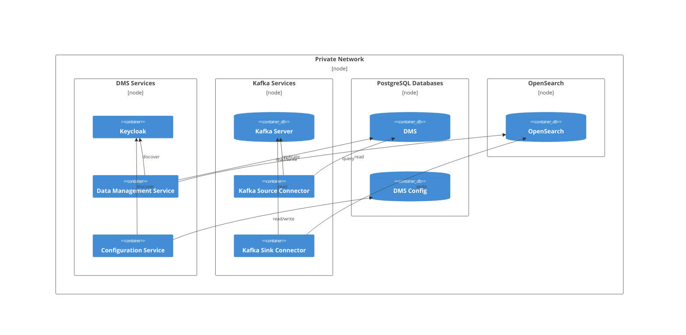

# Getting Started Using the Ed-Fi Data Management Service Platform

This file is a lab walkthrough on using the Ed-Fi Data Management (DMS)
Platform. These instructions rely on a compatible `docker compose` command, for
example coming from Docker Desktop or Podman. See the [docs/](./docs/) for
additional developer information.

There are two parts to the lab:

* This markdown file provides context and instructions on running the DMS
  Platform.
* File `getting-started.http` provides annotated HTTP commands demonstrating how
  to interact with the DMS and the DMS Configuration Service.

## Pre-Requisites

These instructions have been tested in Windows with current (April, 2025)
versions of both Docker Desktop and Podman. This repository uses PowerShell for
scripting, which _should_ work on any OS where PowerShell Core 7+ is installed.

> [!TIP] If using Podman without Docker in Windows, you can create either
>
> 1. Find and replace "docker compose" with "podman compose" in the
>    `eng/docker-compose` directory, or
> 2. In Windows, create a `docker.cmd` file containing the following command:
>    `podman %*` and add the location of this file into your Path environment
>    variables.

The companion file [getting-started.http] can be executed in VS Code with the
`humao.rest-client` or similar extension. Visual Studio and Rider also have
support for this file format. This file contains all of the HTTP commands found
this lab exercise. In VS Code with Rest Client, you can generate Curl commands
from the `.http` file or generate code snippets in over a dozen languages.

We use the `bierner.markdown-mermaid` extension in VS Code for viewing Mermaid
diagrams in Code's built-in Markdown preview tool.

## Context

Elasticsearch is also available, as an alternative to OpenSearch shown in the C4
deployment diagram below. In summary:

1. There are two custom .NET applications in this repository:
   1. The Data Management Service (DMS), which is an "Ed-Fi API" application. It
      supports the following API definitions: Ed-Fi Resources API, Ed-Fi
      Descriptors API, and Ed-Fi Discovery API. It includes Ed-Fi Data Standard
      5.2 out of the box. It will be capable of supporting other Data Standard
      versions at a future date.
   2. The DMS Configuration Service, which implements a form of the Ed-Fi
      Management API, whose specification is derived from the legacy Ed-Fi Admin
      API 2 application.
2. Both systems rely on the open-source Keycloak identity provider for
   authentication and OAuth 2.0 compatible token management.
3. Both systems use PostgreSQL for online transaction processing (OLTP) data
   storage. All Ed-Fi Resources and Descriptors are stored together in a single
   table, called `dms.document`.
4. The DMS's database is replicated to OpenSearch via:
   1. Change data capture (CDC) using Debezium, which reads the transaction log
      to copy data from `dms.document`...
   2. and pushes these records into a Kafka topic called `edfi.dms.document`.
   3. A connector reads from the Kafka topic and writes the data into either
      OpenSearch or Elasticsearch (OpenSearch is the default).
5. The DMS uses the search database to support the "GET all" and "GET by query"
   HTTP requests.
6. There are also optional user interfaces for viewing data in Kafka or
   OpenSearch (not shown below).



## Start the Containers

In a terminal, switch to the `eng/docker-compose` directory. Create a new file
`.env` as a copy of `.env.example`. There is no need to modify the file for
local execution. However, please change the passwords if using for anything
other than firewalled local development.

```powershell
cd Data-Management-Service/eng/docker-compose
cp .env.example .env
```

Now, start all of the required services, building from source code, with the
following command. The .NET SDK is not required, as the build will occur inside
a container.

```powershell
./start-local-dms.ps1 -EnableConfig -EnableSearchEngineUI
```

This may take around a minute to startup. This script not only starts the
containers, it also calls an additional script for configuring Keycloak.

> [!TIP] Add `-SearchEngine ElasticSearch` to run Elasticsearch instead of
> OpenSearch. Review the Docker Compose [README](./eng/docker-compose/README.md)
> for available deployment options.

Once started, try the following HTTP request, which will load the Ed-Fi
Discovery API endpoint from the DMS.

```shell
curl http://localhost:8080
```

## Interacting with the Two Services

Please open [getting-started.http](./getting-started.http) for detailed
instructions and sample HTTP commands. If using the Rest Client extension, you
can right-click on any command to generate a Curl command. Alternatively, you
can create a code snippet in one of more than a dozen supported languages,
including C# and Python.

For the most part, interacting with the Data Management Service is the same as
interacting with the Ed-Fi ODS/API. The following ODS/API documentation pertains
to the Data Management Service and will provide additional background
information on developing client integrations:

* [Basics](https://docs.ed-fi.org/reference/ods-api/client-developers-guide/basics)
* [Authentication](https://docs.ed-fi.org/reference/ods-api/client-developers-guide/authentication)
* [Date and Datetime
  Elements](https://docs.ed-fi.org/reference/ods-api/client-developers-guide/date-datetime-elements)
* [Descriptor
  References](https://docs.ed-fi.org/reference/ods-api/client-developers-guide/descriptor-references)
* [Error Handling and Best
  Practices](https://docs.ed-fi.org/reference/ods-api/client-developers-guide/error-handling-best-practices)
* [Error Response Knowledge
  Base](https://docs.ed-fi.org/reference/ods-api/client-developers-guide/error-response-knowledge-base)
* [Resource Dependency
  Order](https://docs.ed-fi.org/reference/ods-api/client-developers-guide/resource-dependency-order)
* [Using Code Generation to Create an
  SDK](https://docs.ed-fi.org/reference/ods-api/client-developers-guide/using-code-generation-to-create-an-sdk)

In the DMS we have not included the `v3/` segment that is present in the
ODS/API. This segment was never part of a formal standard, and we felt that it
was a leftover vestige from the change between ODS/API 2.x and ODS/API 3.x.

## Modifying the Configuration

Explore the `.env` file you just created to see what configuration options are
available; however, most of them should not be altered. After editing the
`.env`, stop and then restart the containers.

## Load Seed Data Using Database Template Package

To load initial seed data into the database, set the appropriate database
template package name using the .env variable:

**Example:**

```env
DATABASE_TEMPLATE_PACKAGE=EdFi.Dms.Minimal.Template.PostgreSql.5.2.0
```

Then, run the following command in PowerShell to start the local DMS instance
and load the seed data:

```powershell
./start-local-dms.ps1 -EnableConfig -EnableSearchEngineUI -LoadSeedData
```

This will ensure your environment is initialized with the required schema and
data from the specified template package.

## Stopping the Containers

When you are ready to stop the containers, append the `-d` ("down") flag to the
command:

```powershell
./start-local-dms.ps1 -EnableConfig -EnableSearchEngineUI -d
```

And to shut down and delete all data, add the `-v` ("volumes") flag. This is
useful when you need to start over with a clean slate.

```powershell
./start-local-dms.ps1 -EnableConfig -EnableSearchEngineUI -d -v
```
