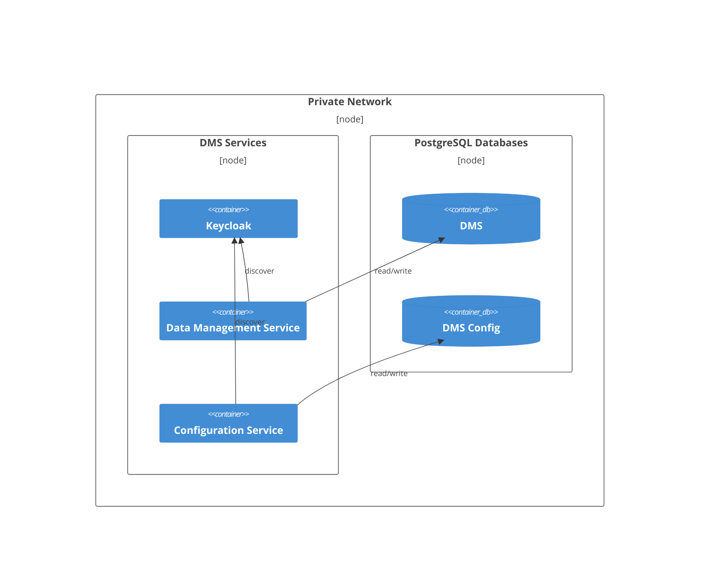

# Getting Started Using the Ed-Fi API

This file is a lab walkthrough on using the Ed-Fi API (DMS). These instructions
rely on a compatible `docker compose` command, for
example coming from Docker Engine with the Compose plugin, Docker Desktop, or
Podman. See the [docs/](./docs/) for additional developer information.

There are two parts to the lab:

* This markdown file provides context and instructions on running the Ed-Fi API.
* File `getting-started.http` provides annotated HTTP commands demonstrating how
  to interact with the DMS and the DMS Configuration Service.

## Pre-Requisites

These instructions have been tested in Windows with current (April, 2025)
versions of both Docker Desktop and Podman. This repository uses PowerShell for
scripting, which _should_ work on any OS where PowerShell Core 7+ is installed.

On Linux, Docker Engine with the Compose plugin is sufficient. Verify `docker ps`
and `docker compose version` succeed before starting the stack. If the Engine is
stopped, start it with `sudo systemctl start docker`.

> [!TIP]
> If using Podman without Docker in Windows, you can create either
>
> 1. Find and replace "docker compose" with "podman compose" in the
>    `eng/docker-compose` directory, or
> 2. In Windows, create a `docker.cmd` file containing the following command:
>    `podman %*` and add the location of this file into your Path environment
>    variables.

The companion file [getting-started.http] can be executed in VS Code with the
`humao.rest-client` or similar extension. Visual Studio and Rider also have
support for this file format. This file contains all of the HTTP commands found
this lab exercise. In VS Code with Rest Client, you can generate Curl commands
from the `.http` file or generate code snippets in over a dozen languages.

We use the `bierner.markdown-mermaid` extension in VS Code for viewing Mermaid
diagrams in Code's built-in Markdown preview tool.

## Context

1. There are two custom .NET applications in this repository:
   1. The Data Management Service (DMS), which is an "Ed-Fi API" application. It
      supports the following API definitions: Ed-Fi Resources API, Ed-Fi
      Descriptors API, and Ed-Fi Discovery API. It includes Ed-Fi Data Standard
      5.2 out of the box. It will be capable of supporting other Data Standard
      versions at a future date.
   2. The DMS Configuration Service, which implements a form of the Ed-Fi
      Management API, whose specification is derived from the legacy Ed-Fi Admin
      API 2 application.
2. Both systems use PostgreSQL for online transaction processing (OLTP) data
   storage. DMS stores each Ed-Fi Resource in its own set of relational tables
   derived from the effective schema, while Descriptors are stored in the
   shared `dms.Descriptor` table; see the [Relational Backend Developer
   Guide](./docs/RELATIONAL-BACKEND.md).
3. Relational DMS CDC/Kafka support is pending a separate implementation.


```mermaid
C4Deployment
    Deployment_Node(network, "Private Network") {
        Deployment_Node(dms, "DMS Services") {
            Container(keycloak, "Keycloak")
            Container(dms, "Data Management Service")
            Container(config, "Configuration Service")
        }
        Deployment_Node(db, "PostgreSQL Databases") {
            ContainerDb(dmsdb, "DMS")
            ContainerDb(configdb, "DMS Config")
        }
    }
    Rel(dms, dmsdb, "read/write")
    Rel(config, configdb, "read/write")
    Rel(dms, keycloak, "discover")
    Rel(config, keycloak, "discover")
    UpdateLayoutConfig($c4ShapeInRow="2", $c4BoundaryInRow="4")
```

## Start the Containers

In a terminal, switch to the `eng/docker-compose` directory. Create a new file
`.env` as a copy of `.env.example`. There is no need to modify the file for
local execution. However, please change the passwords if using for anything
other than firewalled local development.

```powershell
cd Data-Management-Service/eng/docker-compose
cp .env.example .env
```

Start the complete local environment with the bootstrap wrapper:

```powershell
./bootstrap-local-dms.ps1
```

The wrapper stages the schema and claims workspaces, starts the infrastructure,
configures the data store, provisions its schema, and then starts DMS. The .NET
SDK is not required because build work occurs inside containers. Startup may
take around a minute.

Existing local images are reused by default. To rebuild them before startup,
explicitly pass `-Rebuild` (or its shorter `-r` alias):

```powershell
./bootstrap-local-dms.ps1 -Rebuild
```

For advanced workflows that need phase-level control, the individual commands
remain available. For example, `start-local-dms.ps1 -InfraOnly` starts the
infrastructure without DMS, and `configure-local-data-store.ps1` registers or
selects the data store. Their help and terminal guidance describe the inputs for
the subsequent provisioning and DMS-start phases.

Once started, try the following HTTP request, which will load the Ed-Fi
Discovery API endpoint from the DMS.

```shell
curl http://localhost:8080
```

## Interacting with the Two Services

Please open [getting-started.http](./getting-started.http) for detailed
instructions and sample HTTP commands. If using the Rest Client extension, you
can right-click on any command to generate a Curl command. Alternatively, you
can create a code snippet in one of more than a dozen supported languages,
including C# and Python.

To authenticate with DMS, first call the Discovery endpoint and read the DMS
token-proxy URL from `urls.oauth`. POST the client-credentials grant to that URL
using HTTP Basic credentials:

```http
# @name discovery
GET http://localhost:8080

@tokenUrl={{discovery.response.body.urls.oauth}}

POST {{tokenUrl}}
Authorization: Basic <client-id>:<client-secret>
Content-Type: application/x-www-form-urlencoded

grant_type=client_credentials
```

The DMS token proxy accepts the client credentials through the `Authorization`
header, not as form fields. Calling the Configuration Service `/connect/token`
endpoint directly is a separate endpoint contract; see the working examples in
[getting-started.http](./getting-started.http).

For the most part, interacting with the Data Management Service is the same as
interacting with the Ed-Fi ODS/API. The following ODS/API documentation pertains
to the Data Management Service and will provide additional background
information on developing client integrations:

* [Basics](https://docs.ed-fi.org/reference/ods-api/client-developers-guide/basics)
* [Authentication](https://docs.ed-fi.org/reference/ods-api/client-developers-guide/authentication)
* [Date and Datetime
  Elements](https://docs.ed-fi.org/reference/ods-api/client-developers-guide/date-datetime-elements)
* [Descriptor
  References](https://docs.ed-fi.org/reference/ods-api/client-developers-guide/descriptor-references)
* [Error Handling and Best
  Practices](https://docs.ed-fi.org/reference/ods-api/client-developers-guide/error-handling-best-practices)
* [Error Response Knowledge
  Base](https://docs.ed-fi.org/reference/ods-api/client-developers-guide/error-response-knowledge-base)
* [Resource Dependency
  Order](https://docs.ed-fi.org/reference/ods-api/client-developers-guide/resource-dependency-order)
* [Using Code Generation to Create an
  SDK](https://docs.ed-fi.org/reference/ods-api/client-developers-guide/using-code-generation-to-create-an-sdk)

In the DMS we have not included the `v3/` segment that is present in the
ODS/API. This segment was never part of a formal standard, and we felt that it
was a leftover vestige from the change between ODS/API 2.x and ODS/API 3.x.

## Modifying the Configuration

Explore the `.env` file you just created to see what configuration options are
available; however, most of them should not be altered. After editing the
`.env`, stop and then restart the containers.

## Load Seed Data Using Database Template Package

To load initial seed data into the database, set the appropriate database
template package name using the .env variable:

**Example:**

```env
DATABASE_TEMPLATE_PACKAGE=EdFi.Api.Minimal.Template.PostgreSql.5.2.0
```

Then, run the following commands in PowerShell to start the local DMS instance,
create the data store, and load the seed data. As of DMS-1153,
`start-local-dms.ps1` no longer accepts `-LoadSeedData`; the database-template
load is invoked directly from `setup-database-template.psm1`:

```powershell
./start-local-dms.ps1 -EnableConfig
./configure-local-data-store.ps1
Import-Module ./setup-database-template.psm1
LoadSeedData -EnvironmentFile ./.env
```

This will ensure your environment is initialized with the required schema and
data from the specified template package.

## Stopping the Containers

When you are ready to stop the containers, append the `-d` ("down") flag to the
command:

```powershell
./start-local-dms.ps1 -EnableConfig -d
```

And to shut down and delete all data, add the `-v` ("volumes") flag. This is
useful when you need to start over with a clean slate.

```powershell
./start-local-dms.ps1 -EnableConfig -d -v
```
