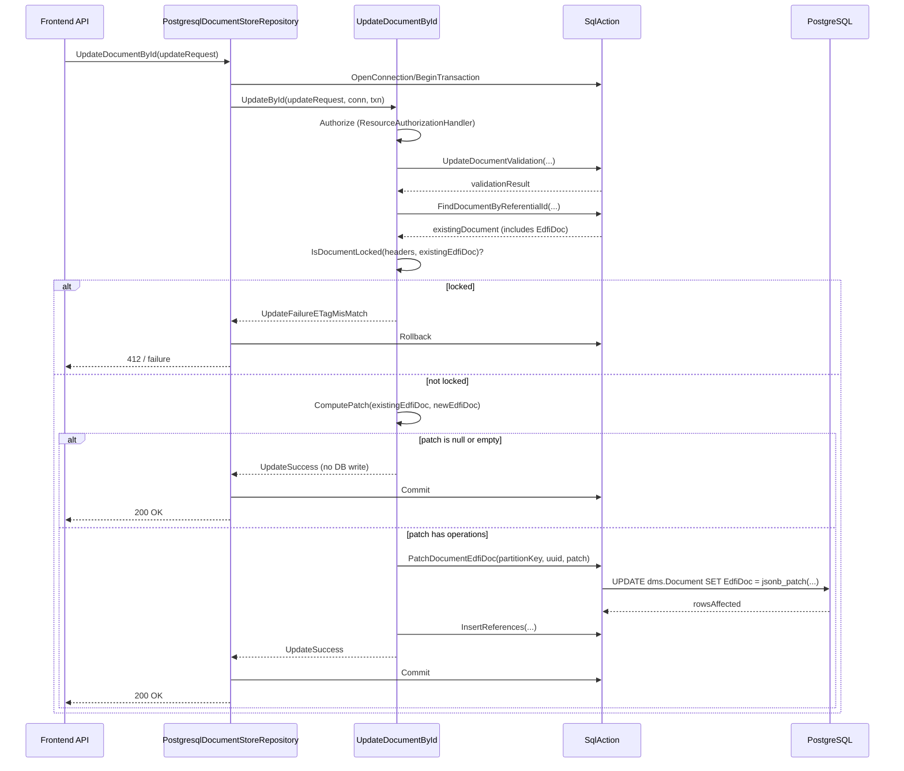
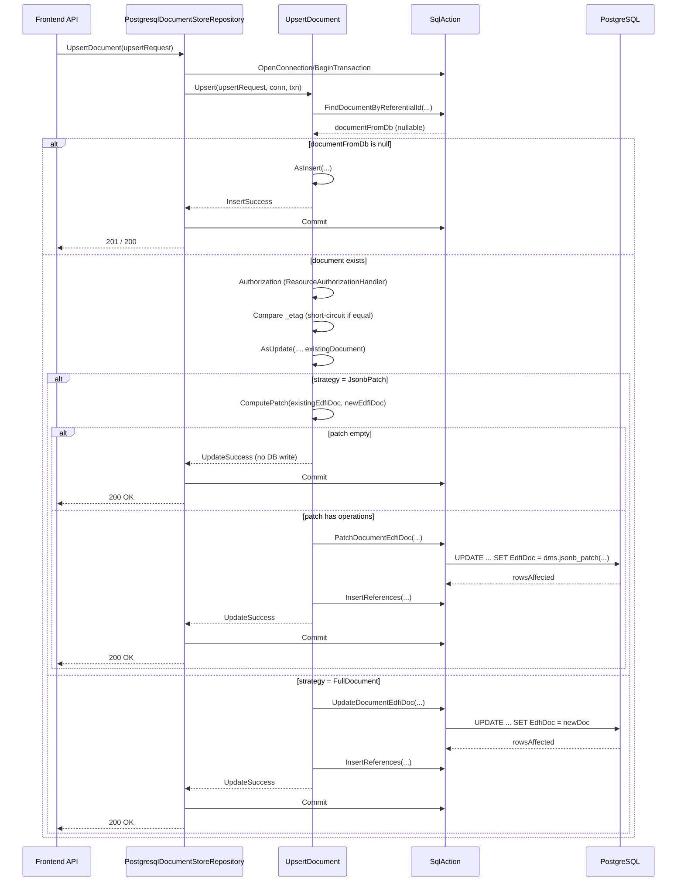

# Design: JSONB Partial Update Support in the DMS PostgreSQL Backend

## 1. Overview

This document describes how to add **partial JSONB updates** to the PostgreSQL backend used by the Ed-Fi Data Management Service (DMS).

Today, both:

- `UpdateDocumentById` (HTTP `PUT`/update), and
- `UpsertDocument` when it executes as **update** (upsert-as-update)

send a **full JSON document** to PostgreSQL. The `dms.Document.EdfiDoc` column is replaced entirely:

```sql
UPDATE dms.Document
SET EdfiDoc = $1, LastModifiedAt = clock_timestamp(), LastModifiedTraceId = $4
WHERE DocumentPartitionKey = $2 AND DocumentUuid = $3;
```

This causes unnecessary write amplification (TOAST + WAL), even when only a small part of the document changes.

We will introduce a **diff-and-patch** flow:

- The backend will compute a **JSON Patch** (RFC 6902-style) describing the differences between:
  - the existing document (from `dms.Document.EdfiDoc`) and
  - the new document sent by the client (via the frontend).
- PostgreSQL will apply that patch using a new `jsonb_patch` function.

The change will be **internal to the PostgreSQL backend**:

- The public DMS API remains unchanged (clients send full documents).
- Only the **backend ↔ PostgreSQL** interaction changes to use patches.

The design supports:

- `UpdateDocumentById` (ID-based updates).
- `UpsertDocument` when it takes the **update** path.
- Future extension to cascade updates.

---

## 2. Goals and Non-goals

### 2.1 Goals

- Reduce WAL and TOAST write volume by avoiding full JSONB replacements.
- Implement partial updates for:
  - `UpdateDocumentById.UpdateById`
  - `UpsertDocument.AsUpdate` (upsert-as-update)
- Preserve existing semantics:
  - Authorization behavior.
  - Referential integrity checks.
  - Identity update behavior and cascade updates.
  - ETag / optimistic locking semantics.
- Make the change **configurable**, so we can:
  - Enable partial updates in performance environments.
  - Fall back to full updates if needed.

### 2.2 Non-goals

- No changes to the public HTTP API contract.
- No new "patch" endpoints; clients still send full documents.
- No change to table schemas or JSON document shapes.
- No change to identity resolution or alias/reference models.

---

## 3. Current Behavior (Baseline)

This section summarizes the current PostgreSQL backend behavior relevant to updates, with pointers to the existing code. Understanding this is critical before introducing partial updates.

### 3.1 Key Types and Interfaces

**External contracts (Core layer):**

- `IUpdateRequest`  
  - `ResourceInfo ResourceInfo`  
  - `DocumentInfo DocumentInfo`  
  - `JsonNode EdfiDoc`  
  - `Dictionary<string, string> Headers`  
  - `DocumentSecurityElements DocumentSecurityElements`  
  - `TraceId TraceId`  
  - `DocumentUuid DocumentUuid`  
  - `IUpdateCascadeHandler UpdateCascadeHandler`  
  - `IResourceAuthorizationHandler ResourceAuthorizationHandler`

- `IUpsertRequest`  
  - Same general shape as `IUpdateRequest`, but `DocumentUuid` is a **candidate** used when upsert acts as insert.

**PostgreSQL backend contracts:**

- `PostgresqlDocumentStoreRepository`  
  - `Task<UpdateResult> UpdateDocumentById(IUpdateRequest updateRequest)`  
  - `Task<UpsertResult> UpsertDocument(IUpsertRequest upsertRequest)`

- `ISqlAction` (`Operation/ISqlAction.cs`)  
  - `Task<int> UpdateDocumentEdfiDoc(...)` – currently performs **full document replacement**.
  - Many other methods (validation, references, education org hierarchy, etc.).

### 3.2 Update-by-Id Flow (Today)

Code: `Operation/UpdateDocumentById.cs`

High-level steps:

1. **Authorization**
   - Uses `updateRequest.ResourceAuthorizationHandler.Authorize(...)` with `OperationType.Update`.

2. **Validation**
   - Calls `_sqlAction.UpdateDocumentValidation(...)`:
     - Ensures the document exists.
     - Checks whether the referential identity is unchanged or allowed to change.
   - Possibly updates alias identity via `_sqlAction.UpdateAliasReferentialIdByDocumentUuid(...)`.

3. **Load existing document**
   - Calls `_sqlAction.FindDocumentByReferentialId(...)` to get:
     - `Document` including `EdfiDoc` (`JsonElement`), `Id`, `DocumentPartitionKey`, `DocumentUuid`, etc.

4. **Optimistic locking (`If-Match` ETag)**
   - Uses `OptimisticLockHelper.IsDocumentLocked(headers, existingEdfiDoc)` to enforce ETag.

5. **Short-circuit if unchanged**
   - Compares `_etag` in `updateRequest.EdfiDoc` vs. persisted `_etag` in `existingEdfiDoc`.
   - If equal, returns `UpdateResult.UpdateSuccess` **without writing**.

6. **Reference validation**
   - Computes `DocumentReferenceIds` and `DescriptorReferenceIds`.
   - If any invalid references, returns a reference failure result.

7. **Authorization EdOrg IDs**
   - Calls `DocumentAuthorizationHelper.GetAuthorizationEducationOrganizationIds(...)` to get:
     - `schoolAuthorizationEdOrgIds`
     - `studentEdOrgResponsibilityAuthorizationIds`
     - `contactStudentSchoolAuthorizationEdOrgIds`
     - `staffEducationOrganizationAuthorizationEdOrgIds`

8. **Update document**
   - Calls:

     ```csharp
     int rowsAffected = await _sqlAction.UpdateDocumentEdfiDoc(
         PartitionKeyFor(updateRequest.DocumentUuid).Value,
         updateRequest.DocumentUuid.Value,
         JsonSerializer.Deserialize<JsonElement>(updateRequest.EdfiDoc),
         updateRequest.DocumentSecurityElements.ToJsonElement(),
         schoolAuthorizationEdOrgIds,
         studentEdOrgResponsibilityAuthorizationIds,
         contactStudentSchoolAuthorizationEdOrgIds,
         staffEducationOrganizationAuthorizationEdOrgIds,
         connection,
         transaction,
         updateRequest.TraceId
     );
     ```

   - This is a full replacement of `EdfiDoc`.

9. **Update references**
   - If the resource has references, calls `_sqlAction.InsertReferences(...)`.

10. **Cascade updates (when identity changes and is allowed)**
    - If identities changed and `AllowIdentityUpdates` is true:
      - Finds referencing documents.
      - For each referencing document, uses `IUpdateCascadeHandler.Cascade(...)` to compute a **new full document**.
      - Calls `_sqlAction.UpdateDocumentEdfiDoc(...)` again with the new full document.

11. **Return result**
    - `UpdateResult.UpdateSuccess` if exactly one row was updated.
    - Several specialized failure results otherwise.

### 3.3 Upsert-as-Update Flow (Today)

Code: `Operation/UpsertDocument.cs`

High-level steps (simplified):

1. **Determine insert vs update**
   - Calls `_sqlAction.FindDocumentByReferentialId(...)` to get `Document? documentFromDb`.
   - Catches serialization failures and deadlocks and maps them to `UpsertFailureWriteConflict`.

2. **Authorization**
   - Uses `upsertRequest.ResourceAuthorizationHandler.Authorize(...)` with `OperationType.Upsert`.

3. **If no existing document → insert path**
   - Calls `AsInsert(...)`:
     - Validates references.
     - Inserts into `dms.Document` via `_sqlAction.InsertDocumentAndAlias(...)`.
     - Inserts references, securable document, etc.

4. **If existing document → update path**
   - Checks if `_etag` in request equals `_etag` in `documentFromDb.EdfiDoc`; if same:
     - Treats as "no change" and returns `UpdateSuccess` without writing.
   - Otherwise calls `AsUpdate(...)` with:
     - `documentId`, `documentPartitionKey`, `documentUuid`.
     - The `IUpsertRequest` and reference information.
     - Authorization EdOrg IDs.

5. **`AsUpdate` (current behavior)**
   - Validates references (pre-flight).
   - Sets `upsertRequest.EdfiDoc["id"] = documentUuid`.
   - Calls `_sqlAction.UpdateDocumentEdfiDoc(...)` with **full `EdfiDoc`**.
   - Calls `_sqlAction.InsertReferences(...)`.
   - Calls `UpdateEducationOrganizationHierarchy(...)` if applicable.
   - Updates securable document.
   - Returns `UpsertResult.UpdateSuccess`.

### 3.4 Current SQL for Updates

Code: `Operation/SqlAction.cs`

```csharp
public async Task<int> UpdateDocumentEdfiDoc(
    int documentPartitionKey,
    Guid documentUuid,
    JsonElement edfiDoc,
    JsonElement securityElements,
    JsonElement? studentSchoolAuthorizationEdOrgIds,
    JsonElement? studentEdOrgResponsibilityAuthorizationIds,
    JsonElement? contactStudentSchoolAuthorizationEdOrgIds,
    JsonElement? staffEducationOrganizationAuthorizationEdOrgIds,
    NpgsqlConnection connection,
    NpgsqlTransaction transaction,
    TraceId traceId
)
{
    await using var command = new NpgsqlCommand(
        @"UPDATE dms.Document
          SET EdfiDoc = $1,
              LastModifiedAt = clock_timestamp(),
              LastModifiedTraceId = $4
          WHERE DocumentPartitionKey = $2 AND DocumentUuid = $3
          RETURNING Id;",
        connection,
        transaction
    )
    {
        Parameters =
        {
            new() { Value = edfiDoc },
            new() { Value = documentPartitionKey },
            new() { Value = documentUuid },
            new() { Value = traceId.Value },
        },
    };

    return await command.ExecuteNonQueryAsync();
}
```

This uses **full JSONB replacement**, which is what we want to improve.

---

## 4. High-Level Partial Update Design

We will implement the **"Diff-and-Patch"** pattern as described in `Suite-3-Performance-Testing/JSONB-PARTIAL-UPDATE-INITIAL-DESIGN.md`, specialized for the DMS backend.

### 4.1 Conceptual Flow

**Step 1 – Read existing JSON:**

- On both `UpdateDocumentById` and upsert-as-update, we already read the existing document from `dms.Document.EdfiDoc` via:
  - `FindDocumentByReferentialId(...)`.

**Step 2 – Compute JSON Patch in C# (backend):**

- Use a .NET library to compute a JSON Patch ("diff") between:
  - `existingEdfiDoc` (current document, `JsonElement`).
  - `incomingEdfiDoc` (new document from request, `JsonNode`).
- The patch is represented as a JSON array of operations, e.g.:

  ```json
  [
    { "op": "replace", "path": "/level", "value": 11 },
    { "op": "add", "path": "/tags/1", "value": "b" }
  ]
  ```

- If the computed patch is empty (no differences), we can skip the database update.

**Step 3 – Apply JSON Patch in PostgreSQL:**

- Introduce a PL/pgSQL function:

  ```sql
  jsonb_patch(target jsonb, patch jsonb) returns jsonb
  ```

  which:

  - Iterates over each patch operation.
  - Applies the operation using:
    - `jsonb_set` (for object replacement),
    - `jsonb_insert` (for array insertion),
    - `#-` (for removal).

- Integrate this into the document update operation:

  ```sql
  UPDATE dms.Document
  SET EdfiDoc = jsonb_patch(EdfiDoc, $1::jsonb),
      LastModifiedAt = clock_timestamp(),
      LastModifiedTraceId = $4
  WHERE DocumentPartitionKey = $2 AND DocumentUuid = $3;
  ```

### 4.2 New Configuration: Update Strategy

We want to be able to **enable/disable** partial updates per environment.

Introduce an enum in `EdFi.DataManagementService.Backend`:

```csharp
public enum DocumentUpdateStrategy
{
    FullDocument = 0,   // current behavior
    JsonbPatch  = 1     // new partial update behavior
}
```

Extend `DatabaseOptions`:

```csharp
public class DatabaseOptions
{
    public IsolationLevel IsolationLevel { get; set; }

    // New: controls how Document.EdfiDoc updates are sent to PostgreSQL.
    public DocumentUpdateStrategy DocumentUpdateStrategy { get; set; } = DocumentUpdateStrategy.FullDocument;
}
```

Example `appsettings.json` override for partial updates:

```json
{
  "Database": {
    "IsolationLevel": "ReadCommitted",
    "DocumentUpdateStrategy": "JsonbPatch"
  }
}
```

The backend will:

- Default to `FullDocument`.
- When configured for `JsonbPatch`, it will:
  - Compute patches for updates.
  - Call a new patch-based SQL path.

### 4.3 .NET JSON Diff Library

We will use `SystemTextJson.JsonDiffPatch` (as in the existing design document).

Add to `EdFi.DataManagementService.Backend.Postgresql.csproj`:

```xml
<ItemGroup>
  <!-- existing references -->
  <PackageReference Include="SystemTextJson.JsonDiffPatch" />
</ItemGroup>
```

Usage pattern for **RFC 6902 JSON Patch**:

```csharp
using System.Text.Json;
using System.Text.Json.Nodes;
using System.Text.Json.JsonDiffPatch;
using System.Text.Json.JsonDiffPatch.Diffs.Formatters;

public static class JsonPatchUtility
{
    public static JsonNode? ComputePatch(JsonElement existing, JsonNode incoming)
    {
        // Convert existing JsonElement to JsonNode
        var existingNode = JsonNode.Parse(existing.GetRawText());

        // Use the JsonPatchDeltaFormatter so that the result is a
        // standard RFC 6902 JSON Patch (array of operations).
        var options   = new JsonDiffOptions();
        var formatter = new JsonPatchDeltaFormatter();

        JsonNode patch = JsonDiffPatcher.Diff(existingNode!, incoming, formatter, options);

        // JsonDiffPatcher.Diff always returns a JsonNode; if there are no changes,
        // the patch will be an empty array: [].
        return patch;
    }
}
```

**Important:**

- `JsonNode.Diff(other)` (the extension method) produces the **internal JSON diff format** (like benjamine/jsondiffpatch), *not* JSON Patch.
- To get **RFC 6902 JSON Patch**, we must call `JsonDiffPatcher.Diff(left, right, new JsonPatchDeltaFormatter(), options)`, as shown above.

The resulting patch is a JSON array of operations like:

```json
[
  { "op": "add", "path": "/tags/1", "value": "b" },
  { "op": "replace", "path": "/level", "value": 11 }
]
```

We will ensure our `jsonb_patch` function in PostgreSQL matches the operations this formatter produces (at minimum `add`, `remove`, `replace`) and the **JSON Pointer** path format described in the next section.

### 4.4 JSON Patch Path Format (What the Library Emits)

`JsonPatchDeltaFormatter` emits `path` values that follow **RFC 6901 JSON Pointer** rules:

- `path` is a **string**, not an array.
- It always starts with `/` (except for the special root path `""`).
- Segments are separated by `/`.
- Within each segment:
  - `~1` encodes `/`
  - `~0` encodes `~`

Examples:

- Property under root:
  - Path: `/level`
  - Segments: `["level"]`
- Nested property:
  - Path: `/student/name`
  - Segments: `["student", "name"]`
- Array element:
  - Path: `/tags/1`
  - Segments: `["tags", "1"]` (index 1)
- Append to array:
  - Path: `/tags/-`
  - Segments: `["tags", "-"]` (`-` means "append at end" for `add` ops)
- Property name containing `/`:
  - Logical segments: `["a/b"]`
  - Path: `/a~1b`
- Property name containing `~`:
  - Logical segments: `["a~b"]`
  - Path: `/a~0b`

`jsonb_patch` must:

- Take the raw `path` string (e.g., `"/tags/1"`).
- Strip the leading `/`.
- `split` on `/` to get raw segments.
- Decode each segment:
  - Replace `~1` with `/`
  - Replace `~0` with `~`
- Use the decoded segments as the `text[]` path for `jsonb_set`, `jsonb_insert`, and `#-`.

---

## 5. Backend Changes (C#)

This section describes the concrete backend code changes. The goal is that a junior developer can follow this and implement the feature step by step.

### 5.1 Helper: `JsonPatchUtility`

Create a new helper in the PostgreSQL backend, e.g. `JsonPatchUtility.cs`:

```csharp
// SPDX-License-Identifier: Apache-2.0
// ...

using System.Text.Json;
using System.Text.Json.Nodes;
using System.Text.Json.JsonDiffPatch;
using System.Text.Json.JsonDiffPatch.Diffs.Formatters;

namespace EdFi.DataManagementService.Backend.Postgresql;

internal static class JsonPatchUtility
{
    /// <summary>
    /// Computes a JSON Patch (RFC 6902) that transforms existingDocument into newDocument.
    /// Returns a JsonNode representing an array of operations; the array may be empty if there are no changes.
    /// </summary>
    public static JsonNode? ComputePatch(JsonElement existingDocument, JsonNode newDocument)
    {
        var existingNode = JsonNode.Parse(existingDocument.GetRawText());

        var options   = new JsonDiffOptions();
        var formatter = new JsonPatchDeltaFormatter();

        // This returns a JSON Patch document (array of { op, path, value? }).
        return JsonDiffPatcher.Diff(existingNode!, newDocument, formatter, options);
    }
}
```

Later we can extend this helper to:

- Filter out operations we do not support (e.g., if the library emits `move` or `copy`).
- Potentially fall back to full updates if the patch grows too large.

### 5.2 Extending `ISqlAction` for Patch-Based Updates

Add a new method to `ISqlAction`:

```csharp
public interface ISqlAction
{
    // existing members...

    /// <summary>
    /// Applies a JSON Patch to the EdfiDoc of a Document and returns the number of rows affected.
    /// </summary>
    Task<int> PatchDocumentEdfiDoc(
        int documentPartitionKey,
        Guid documentUuid,
        JsonElement patch,
        NpgsqlConnection connection,
        NpgsqlTransaction transaction,
        TraceId traceId
    );
}
```

Implement it in `SqlAction`:

```csharp
public partial class SqlAction : ISqlAction
{
    // ...

    public async Task<int> PatchDocumentEdfiDoc(
        int documentPartitionKey,
        Guid documentUuid,
        JsonElement patch,
        NpgsqlConnection connection,
        NpgsqlTransaction transaction,
        TraceId traceId
    )
    {
        await using var command = new NpgsqlCommand(
            @"UPDATE dms.Document
              SET EdfiDoc = jsonb_patch(EdfiDoc, $1::jsonb),
                  LastModifiedAt = clock_timestamp(),
                  LastModifiedTraceId = $4
              WHERE DocumentPartitionKey = $2 AND DocumentUuid = $3
              RETURNING Id;",
            connection,
            transaction
        )
        {
            Parameters =
            {
                new() { Value = patch },
                new() { Value = documentPartitionKey },
                new() { Value = documentUuid },
                new() { Value = traceId.Value },
            },
        };

        return await command.ExecuteNonQueryAsync();
    }
}
```

**Note:** This assumes the `jsonb_patch` function is created in the database (see section 6).

We **keep** the existing `UpdateDocumentEdfiDoc` method for full updates so we can switch strategies via configuration.

### 5.3 Strategy Selection Helpers

We want a simple helper to pick the correct update method based on `DatabaseOptions.DocumentUpdateStrategy`.

Add a small internal helper to the PostgreSQL backend, for example in `SqlAction` or as a separate static class:

```csharp
internal static class DocumentUpdateStrategyExtensions
{
    public static bool UseJsonbPatch(this DocumentUpdateStrategy strategy)
        => strategy == DocumentUpdateStrategy.JsonbPatch;
}
```

In classes that need to know the strategy (`UpdateDocumentById`, `UpsertDocument`), inject `IOptions<DatabaseOptions>` and store the `DocumentUpdateStrategy` value in a private field.

Example (for `UpdateDocumentById` constructor):

```csharp
public class UpdateDocumentById : IUpdateDocumentById
{
    private readonly ISqlAction _sqlAction;
    private readonly ILogger<UpdateDocumentById> _logger;
    private readonly DocumentUpdateStrategy _updateStrategy;

    public UpdateDocumentById(
        ISqlAction sqlAction,
        ILogger<UpdateDocumentById> logger,
        IOptions<DatabaseOptions> databaseOptions
    )
    {
        _sqlAction = sqlAction;
        _logger = logger;
        _updateStrategy = databaseOptions.Value.DocumentUpdateStrategy;
    }

    // ...
}
```

Do the same for `UpsertDocument`.

### 5.4 Updating `UpdateDocumentById` to Use Patches

In `UpdateDocumentById.UpdateById`, we already:

1. Load `Document existingDocument` (including `existingEdfiDoc`).
2. Perform ETag checks and short-circuit if unchanged.
3. Validate references.
4. Compute authorization EdOrg IDs.

We will change the **core update step** to:

1. If the strategy is `FullDocument`:
   - Keep calling `_sqlAction.UpdateDocumentEdfiDoc(...)`.
2. If the strategy is `JsonbPatch`:
   - Compute the patch.
   - If no patch (documents identical), return success.
   - Call `_sqlAction.PatchDocumentEdfiDoc(...)`.

Pseudo-code (simplified for clarity):

```csharp
// After existing validation and authorization logic...

JsonElement existingEdfiDoc = documentFromDb.EdfiDoc;

// Optimistic locking check remains unchanged...
if (IsDocumentLocked(updateRequest.Headers, existingEdfiDoc))
{
    // return UpdateFailureETagMisMatch
}

// Short-circuit if _etag matches (no change)
// (this logic already exists; keep it)

int rowsAffected;

if (_updateStrategy.UseJsonbPatch())
{
    // Compute patch between existing and new EdFiDoc
    JsonNode? patchNode = JsonPatchUtility.ComputePatch(
        existingEdfiDoc,
        updateRequest.EdfiDoc
    );

    if (patchNode is null)
    {
        _logger.LogInformation(
            "Persisted document is equivalent to Request document (patch empty), no changes were made - {TraceId}",
            updateRequest.TraceId.Value
        );
        return new UpdateResult.UpdateSuccess(updateRequest.DocumentUuid);
    }

    JsonElement patchElement = JsonSerializer.Deserialize<JsonElement>(patchNode.ToJsonString());

    rowsAffected = await _sqlAction.PatchDocumentEdfiDoc(
        PartitionKeyFor(updateRequest.DocumentUuid).Value,
        updateRequest.DocumentUuid.Value,
        patchElement,
        connection,
        transaction,
        updateRequest.TraceId
    );
}
else
{
    // Existing full update behavior
    rowsAffected = await _sqlAction.UpdateDocumentEdfiDoc(
        PartitionKeyFor(updateRequest.DocumentUuid).Value,
        updateRequest.DocumentUuid.Value,
        JsonSerializer.Deserialize<JsonElement>(updateRequest.EdfiDoc),
        updateRequest.DocumentSecurityElements.ToJsonElement(),
        schoolAuthorizationEdOrgIds,
        studentEdOrgResponsibilityAuthorizationIds,
        contactStudentSchoolAuthorizationEdOrgIds,
        staffEducationOrganizationAuthorizationEdOrgIds,
        connection,
        transaction,
        updateRequest.TraceId
    );
}
```

Everything after `rowsAffected` (reference insertion, cascade logic, result mapping) remains the same.

#### 5.4.1 Cascade Updates and Partial Updates

Cascade logic currently calls `_sqlAction.UpdateDocumentEdfiDoc` with a **full** `ModifiedEdFiDoc` for referencing documents.

We have two options:

1. **Phase 1 (recommended for initial implementation):**
   - Keep cascade updates as full document updates, even when `JsonbPatch` is enabled.
   - This already reduces WAL significantly for the main updated document.

2. **Phase 2 (optional extension):**
   - Also compute patches for referencing documents using:
     - `referencingDocument.EdfiDoc` as the "existing" document.
     - `cascadeResult.ModifiedEdFiDoc` as the "new" document (`JsonNode`).
   - Call `PatchDocumentEdfiDoc` instead of `UpdateDocumentEdfiDoc` in the cascade loop.

For Phase 1, note in comments that cascade paths still use full updates to keep the initial change small and focused.

### 5.5 Updating `UpsertDocument.AsUpdate` to Use Patches

`UpsertDocument.Upsert` already reads `documentFromDb` (including `EdfiDoc`) to decide insert vs update.

We will:

1. Pass `documentFromDb` (or its `EdfiDoc`) into `AsUpdate`, so `AsUpdate` can use the existing document for patch computation.
2. In `AsUpdate`, choose between:
   - `_sqlAction.PatchDocumentEdfiDoc` (when configured for `JsonbPatch`).
   - `_sqlAction.UpdateDocumentEdfiDoc` (when configured for `FullDocument`).

**Signature change idea:**

```csharp
public async Task<UpsertResult> AsUpdate(
    long documentId,
    short documentPartitionKey,
    Guid documentUuid,
    Document existingDocument,                  // NEW: full existing document
    IUpsertRequest upsertRequest,
    DocumentReferenceIds documentReferenceIds,
    DocumentReferenceIds descriptorReferenceIds,
    JsonElement? studentSchoolAuthorizationEducationOrganizationIds,
    JsonElement? studentEdOrgResponsibilityAuthorizationIds,
    JsonElement? contactStudentSchoolAuthorizationEducationOrganizationIds,
    JsonElement? staffEducationOrganizationAuthorizationEdOrgIds,
    NpgsqlConnection connection,
    NpgsqlTransaction transaction,
    TraceId traceId
)
```

Inside `Upsert`, when calling `AsUpdate`, pass `documentFromDb` as `existingDocument`.

**Update logic in `AsUpdate`:**

```csharp
// existingDocument.EdfiDoc is the current JSON in the database
JsonElement existingEdfiDoc = existingDocument.EdfiDoc;

// Ensure the incoming document has the correct "id"
upsertRequest.EdfiDoc["id"] = documentUuid;

if (_updateStrategy.UseJsonbPatch())
{
    JsonNode? patchNode = JsonPatchUtility.ComputePatch(
        existingEdfiDoc,
        upsertRequest.EdfiDoc
    );

    if (patchNode is null)
    {
        _logger.LogInformation(
            "Persisted document is equivalent to Upsert request document (patch empty), no changes were made - {TraceId}",
            upsertRequest.TraceId.Value
        );
        return new UpsertResult.UpdateSuccess(new(documentUuid));
    }

    JsonElement patchElement = JsonSerializer.Deserialize<JsonElement>(patchNode.ToJsonString());

    await _sqlAction.PatchDocumentEdfiDoc(
        documentPartitionKey,
        documentUuid,
        patchElement,
        connection,
        transaction,
        traceId
    );
}
else
{
    await _sqlAction.UpdateDocumentEdfiDoc(
        documentPartitionKey,
        documentUuid,
        JsonSerializer.Deserialize<JsonElement>(upsertRequest.EdfiDoc),
        upsertRequest.DocumentSecurityElements.ToJsonElement(),
        studentSchoolAuthorizationEducationOrganizationIds,
        studentEdOrgResponsibilityAuthorizationIds,
        contactStudentSchoolAuthorizationEducationOrganizationIds,
        staffEducationOrganizationAuthorizationEdOrgIds,
        connection,
        transaction,
        traceId
    );
}
```

The rest of `AsUpdate` (reference insert, hierarchy updates, securable document updates, logging, result) remains unchanged.

### 5.6 Error Handling and Logging

Important cases to handle:

- **Patch computation failure:**  
  If `JsonPatchUtility.ComputePatch` throws (malformed JSON, unexpected types), log with context and:
  - Either surface as `UnknownFailure` or
  - Fall back to full update (clearly logged).

- **Unsupported patch operations:**  
  Initially, restrict ourselves to operations we know `jsonb_patch` supports (`add`, `remove`, `replace`). If the diff library emits `move` or `copy`, we should:
  - Either transform them to a sequence of supported operations, or
  - Throw/log a clear error and fall back to full update.

For a first implementation, it is acceptable (and simpler) to:

- Configure the diff library (if possible) to emit only `add`, `remove`, `replace`, or
- Validate the patch on the C# side and fail clearly if unsupported operations exist.

---

## 6. Database Changes (SQL)

### 6.1 `jsonb_patch` Function

Create a new deployment script in `src/dms/backend/EdFi.DataManagementService.Backend.Postgresql/Deploy/Scripts`, e.g.:

- `0027_Create_JsonbPatch_Function.sql`

Content:

```sql
-- SPDX-License-Identifier: Apache-2.0
-- Licensed to the Ed-Fi Alliance under one or more agreements.
-- The Ed-Fi Alliance licenses this file to you under the Apache License, Version 2.0.

-- Applies a JSON Patch (RFC 6902-style) to a JSONB target.
-- Supports 'add', 'remove', and 'replace' operations.

CREATE OR REPLACE FUNCTION dms.jsonb_patch(
    target JSONB,
    patch  JSONB
)
RETURNS JSONB
LANGUAGE plpgsql
AS $$
DECLARE
    patch_element  JSONB;
    op             TEXT;
    path_text      TEXT;
    path_parts     TEXT[];
    parent_path    TEXT[];
    parent_element JSONB;
    value          JSONB;
    last_part      TEXT;
    append_index   INT;
BEGIN
    IF jsonb_typeof(patch) != 'array' THEN
        RAISE EXCEPTION 'Patch must be a JSON array';
    END IF;

    FOR patch_element IN SELECT * FROM jsonb_array_elements(patch)
    LOOP
        op := patch_element->>'op';
        path_text := patch_element->>'path';

        -- Convert RFC 6901 JSON Pointer string into text[] path:
        --   ""           -> {}              (root)
        --   "/a/b"       -> {"a","b"}
        --   "/tags/1"    -> {"tags","1"}
        --   "/a~1b"      -> {"a/b"}
        --   "/a~0b"      -> {"a~b"}
        IF path_text IS NULL THEN
            RAISE EXCEPTION 'Patch operation is missing path';
        END IF;

        IF path_text = '' THEN
            -- Root path (special case).
            path_parts := ARRAY[]::TEXT[];
        ELSE
            -- Drop leading '/' and split on remaining '/'; decode ~0 and ~1 sequences.
            SELECT array_agg(
                       replace(
                         replace(part, '~1', '/'),
                         '~0', '~'
                       )
                   )
            INTO path_parts
            FROM regexp_split_to_table(ltrim(path_text, '/'), '/') AS part;
        END IF;

        IF patch_element ? 'value' THEN
            value := patch_element->'value';
        END IF;

        CASE op
            WHEN 'replace' THEN
                IF array_length(path_parts, 1) IS NULL OR array_length(path_parts, 1) = 0 THEN
                    -- Replace whole document
                    target := value;
                ELSE
                    target := jsonb_set(target, path_parts, value, TRUE);
                END IF;

            WHEN 'remove' THEN
                IF array_length(path_parts, 1) IS NULL OR array_length(path_parts, 1) = 0 THEN
                    -- Remove whole document; set to null JSON.
                    target := 'null'::jsonb;
                ELSE
                    target := target #- path_parts;
                END IF;

            WHEN 'add' THEN
                -- If path is root (""), treat as full replacement.
                IF array_length(path_parts, 1) IS NULL OR array_length(path_parts, 1) = 0 THEN
                    target := value;
                ELSE
                    parent_path := path_parts[1:array_length(path_parts, 1) - 1];

                    IF array_length(parent_path, 1) = 0 THEN
                        parent_element := target; -- Parent is the root
                    ELSE
                        parent_element := target #> parent_path;
                    END IF;

                    last_part := path_parts[array_length(path_parts, 1)];

                    -- If parent is an array, we MUST use jsonb_insert
                    IF jsonb_typeof(parent_element) = 'array' THEN
                        -- Check for the special 'append' syntax (e.g., /tags/-)
                        IF last_part = '-' THEN
                            append_index := jsonb_array_length(parent_element);
                            path_parts[array_length(path_parts, 1)] := append_index::text;
                        END IF;

                        target := jsonb_insert(target, path_parts, value);
                    ELSE
                        -- Parent is an object. For objects, 'add' acts like 'replace'.
                        target := jsonb_set(target, path_parts, value, TRUE);
                    END IF;
                END IF;

            ELSE
                RAISE EXCEPTION 'Unsupported patch operation: %', op;
        END CASE;
    END LOOP;

    RETURN target;
END;
$$;
```

### 6.2 Using `jsonb_patch` in Updates

The `PatchDocumentEdfiDoc` method uses this function directly:

```sql
UPDATE dms.Document
SET EdfiDoc = dms.jsonb_patch(EdfiDoc, $1::jsonb),
    LastModifiedAt = clock_timestamp(),
    LastModifiedTraceId = $4
WHERE DocumentPartitionKey = $2 AND DocumentUuid = $3;
```

There are no schema changes to `dms.Document`.

### 6.3 Deployment Considerations

- Ensure the new script runs **after** the `dms` schema and `dms.Document` table are created.
- Verify that DbUp is configured to pick up new script files automatically based on their numeric prefix.
- Backward compatibility:
  - If `DocumentUpdateStrategy` is left at `FullDocument`, the new function is unused but harmless.

---

## 7. Sequence Diagrams

This section provides diagrams to clarify the new flows.

### 7.1 Update-by-Id with Partial Update



### 7.2 Upsert-as-Update with Partial Update



---

## 8. Edge Cases and Considerations

### 8.1 Patch Size vs Full Document

It is possible (especially for small documents) that the patch is not significantly smaller than the full document.

Options:

- **Simple initial behavior (recommended):**
  - Always use patch when `DocumentUpdateStrategy == JsonbPatch`.
  - Rely on environment-level enabling/disabling based on performance measurements.

- **Optional optimization (future):**
  - Measure serialized patch length vs serialized document length.
  - If patch > document (plus some threshold), fall back to full update.

### 8.2 JSON Patch Operation Support

Ensure that the combination of:

- `SystemTextJson.JsonDiffPatch` output, and
- `dms.jsonb_patch` implementation

supports at least:

- `add`
- `remove`
- `replace`

If the library ever emits:

- `move`
- `copy`
- `test` (usually for verification),

we should either:

- Configure it to not emit those operations, or
- Map them to supported operations, or
- Fail fast with a clear error and, if desired, fall back to full update.

### 8.3 ETag Handling

We are **not** changing ETag semantics:

- `UpdateDocumentById` continues to use `If-Match` header and `_etag` inside JSON for optimistic locking.
- Upsert-as-update continues to compare `_etag` values to short-circuit when there is no change.

The patch is computed between the **existing JSON** (which includes the old `_etag`) and the **new JSON** (which includes the new `_etag`). Therefore:

- A change in `_etag` will naturally produce a `replace` operation for the `_etag` field.

### 8.4 Transactions and Locks

We are reusing the existing:

- `LockOption.BlockUpdateDelete` logic (applied in the `FindDocument*` queries).
- Transaction boundaries managed by `PostgresqlDocumentStoreRepository`.

The partial update still runs inside the same transaction and uses a regular `UPDATE` statement, so:

- No new deadlock risks beyond those from the existing full updates.
- The upcoming partial updates may **reduce** deadlock frequency due to smaller write footprints.

---

## 9. Implementation Checklist (for a Junior Developer)

This is a step-by-step checklist that you can follow to implement the design.

1. **Add configuration support**
   - Add `DocumentUpdateStrategy` enum in `EdFi.DataManagementService.Backend`.
   - Extend `DatabaseOptions` with `DocumentUpdateStrategy` (default `FullDocument`).
   - Ensure options binding reads this from configuration (`appsettings.json` or environment).

2. **Add JSON diff NuGet package**
   - Edit `EdFi.DataManagementService.Backend.Postgresql.csproj`:
     - Add `<PackageReference Include="SystemTextJson.JsonDiffPatch" />`.
   - Restore packages and build to confirm compilation.

3. **Implement `JsonPatchUtility`**
   - Add `JsonPatchUtility.cs` in the PostgreSQL backend project.
   - Implement `ComputePatch(JsonElement existingDocument, JsonNode newDocument)`.

4. **Extend `ISqlAction` and `SqlAction`**
   - Add `Task<int> PatchDocumentEdfiDoc(...)` to `ISqlAction`.
   - Implement `PatchDocumentEdfiDoc` in `SqlAction` with `UPDATE ... SET EdfiDoc = dms.jsonb_patch(...)`.

5. **Inject `DatabaseOptions` into update components**
   - Update `UpdateDocumentById` constructor to take `IOptions<DatabaseOptions>`.
   - Update `UpsertDocument` constructor similarly.
   - Store `DocumentUpdateStrategy` in a private field.

6. **Modify `UpdateDocumentById.UpdateById`**
   - After obtaining `existingEdfiDoc` and before calling `_sqlAction.UpdateDocumentEdfiDoc`:
     - If strategy is `JsonbPatch`, call `JsonPatchUtility.ComputePatch(...)`.
     - If patch is null ⇒ return success (no DB write).
     - If patch exists ⇒ serialize to `JsonElement` and call `_sqlAction.PatchDocumentEdfiDoc(...)`.
   - Keep the existing full update path when strategy is `FullDocument`.
   - Leave cascade updates *initially* using full updates; optionally mark with a TODO for Phase 2.

7. **Modify `UpsertDocument.AsUpdate`**
   - Change `AsUpdate` signature to accept an `existingDocument` (or at least `existingEdfiDoc`).
   - From `Upsert.Upsert`, pass `documentFromDb` into `AsUpdate`.
   - Inside `AsUpdate`:
     - Set `upsertRequest.EdfiDoc["id"] = documentUuid` as today.
     - If strategy is `JsonbPatch`, compute patch and call `_sqlAction.PatchDocumentEdfiDoc(...)`.
     - Else, keep calling `_sqlAction.UpdateDocumentEdfiDoc(...)`.

8. **Add SQL script for `dms.jsonb_patch`**
   - Create `0027_Create_JsonbPatch_Function.sql` with the function definition.
   - Ensure DbUp runs it (check ordering and naming conventions).

9. **Run and adjust**
   - Run migrations against a local PostgreSQL instance.
   - Run existing unit/integration tests, especially:
     - `EdFi.DataManagementService.Backend.Postgresql.Tests.Integration`.
   - Create new tests:
     - Validate that when `DocumentUpdateStrategy = JsonbPatch`, updates still succeed and `EdfiDoc` matches the expected final JSON.
     - Verify that when there is no diff, `PatchDocumentEdfiDoc` is not called (or that `rowsAffected` is 0 and logic returns success appropriately).

---

## 10. Testing Strategy

### 10.1 Unit Tests

1. **JsonPatchUtility Tests**
   - Given two JSON documents with simple field changes:
     - Ensure `ComputePatch` returns a patch with `replace` operations.
   - Given documents differing by array changes:
     - Ensure patch includes appropriate `add` operations with correct indexes.
   - When documents are identical:
     - Ensure `ComputePatch` returns `null`.

2. **UpdateDocumentById Tests**
   - When strategy is `FullDocument`, ensure the existing SQL path is used.
   - When strategy is `JsonbPatch`:
     - Verify `PatchDocumentEdfiDoc` is called with a non-empty patch when documents differ.
     - Verify no call to `PatchDocumentEdfiDoc` and early success when documents are equal.

3. **UpsertDocument Tests**
   - Upsert-as-update with `JsonbPatch`:
     - Confirm patch is computed and `PatchDocumentEdfiDoc` is used.
   - Upsert-as-update with `_etag` unchanged:
     - Confirm no call to patch or full update methods.

### 10.2 Integration Tests

Add or extend tests in `EdFi.DataManagementService.Backend.Postgresql.Tests.Integration` to:

- Create a document with a known JSON structure.
- Perform an update that changes only a small part of `EdfiDoc` with `DocumentUpdateStrategy = JsonbPatch`.
- Read back the document and verify:
  - The updated fields are correct.
  - Unchanged fields remain unchanged.

For WAL/TOAST impact, use the separate performance testing suite (`Suite-3-Performance-Testing`) and compare:

- Baseline (full updates).
- Partial updates with `JsonbPatch`.

---

## 11. Summary

This design introduces **internal partial JSONB updates** for the DMS PostgreSQL backend without changing the external API:

- Compute JSON Patch in C# between the existing and new documents.
- Apply patch in PostgreSQL with a new `dms.jsonb_patch` function.
- Wire this into both:
  - `UpdateDocumentById` (update-by-id), and
  - `UpsertDocument` when executing as update (upsert-as-update).
- Keep a configuration-based switch to toggle between:
  - `FullDocument` (current behavior).
  - `JsonbPatch` (new behavior).

The result should significantly reduce WAL and TOAST write volume for large documents while preserving all existing authorization, identity, and concurrency semantics.
