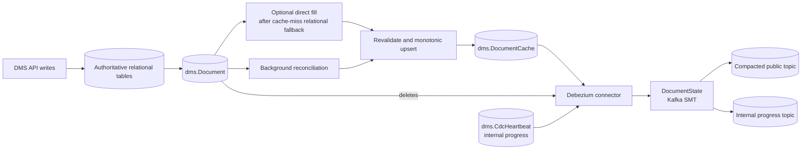
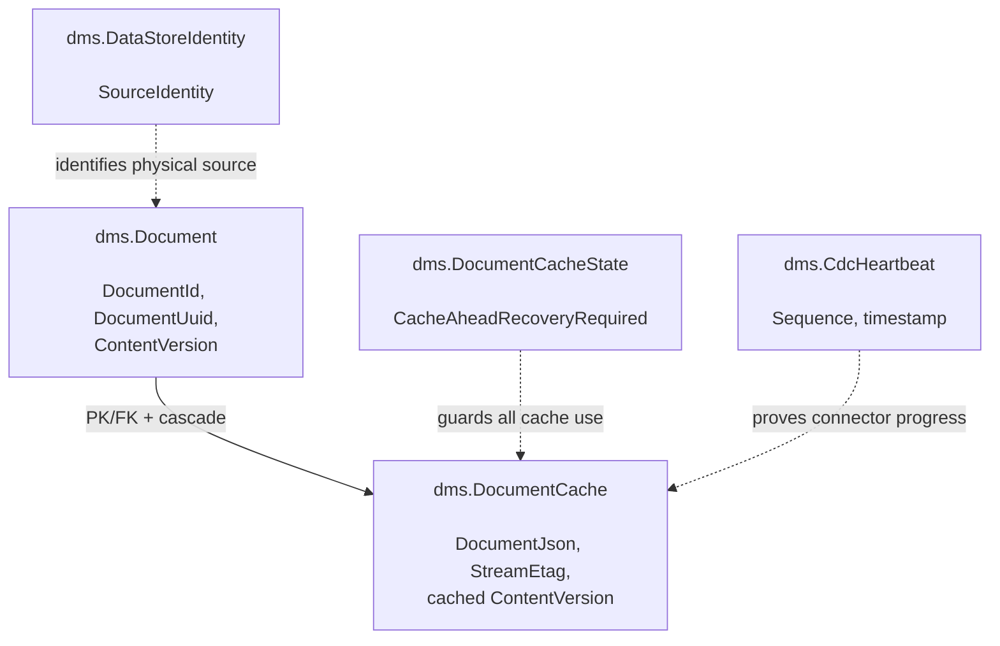
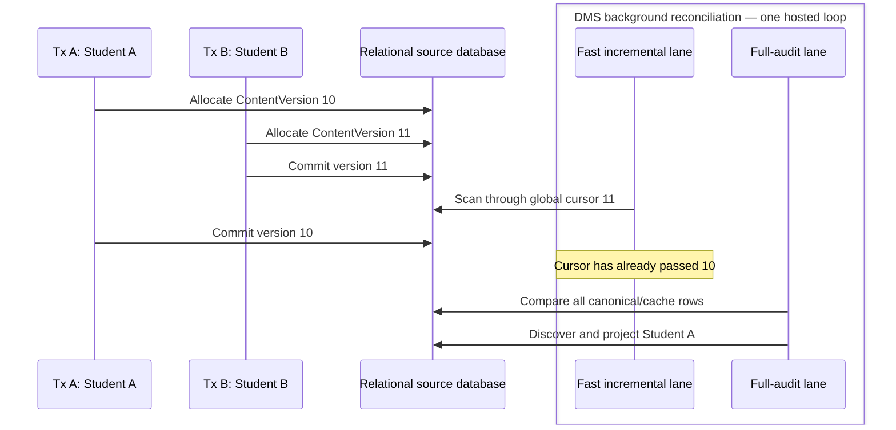
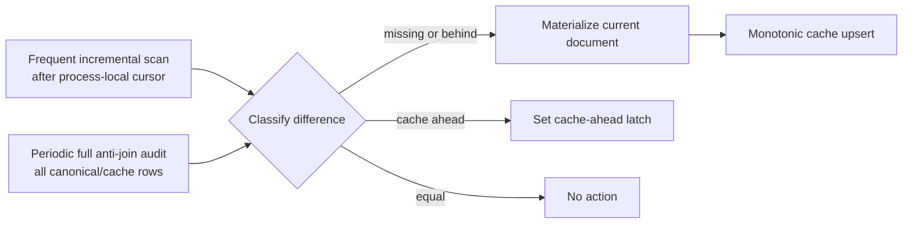
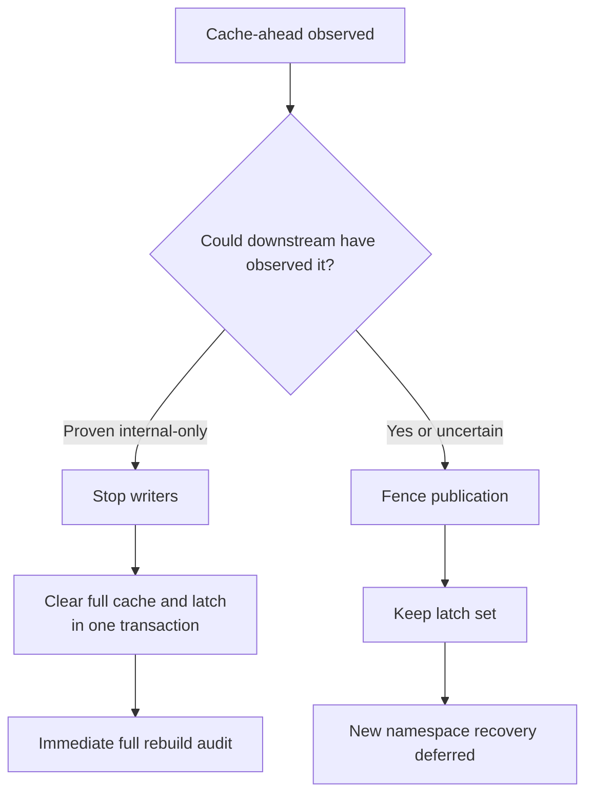
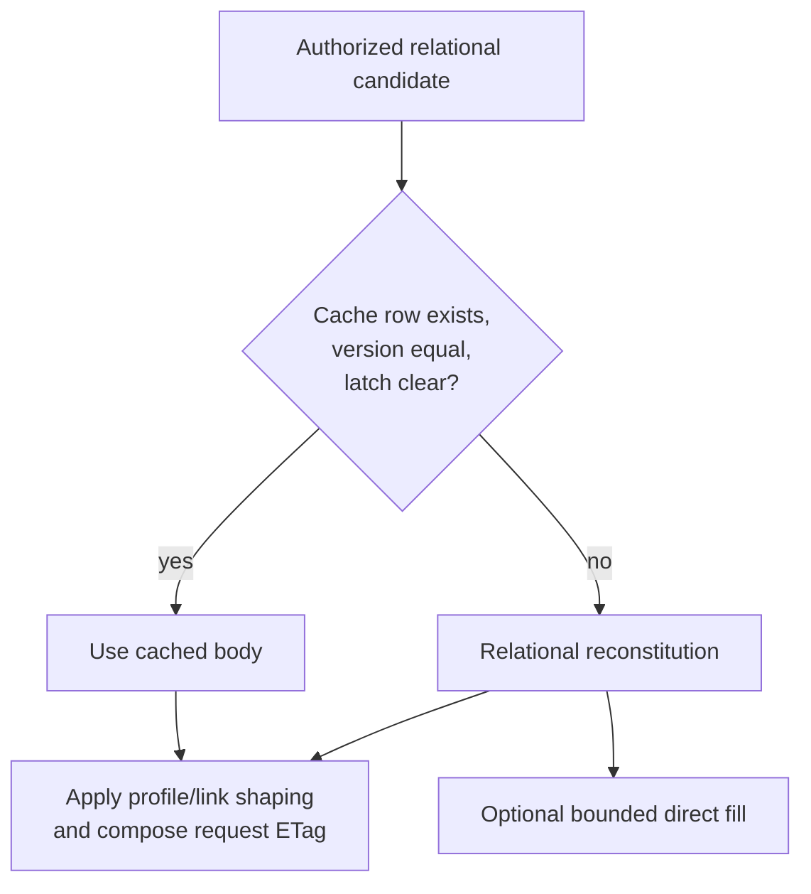
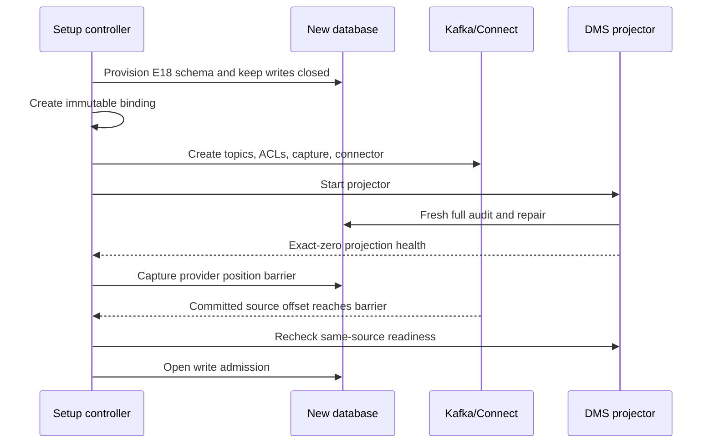
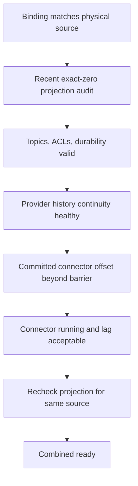
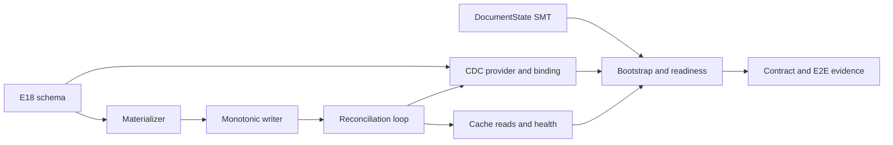

# Relational Document Projection (Cache) and CDC/Kafka

## DMS-1245 and DMS-1246 design

Ed-Fi Data Management Service — API 8.1

---

# Decisions

- Relational tables remain authoritative.
- DMS maintains a rebuildable API-shaped projection (cache) independently of the API write path.
- CDC (Debezium) reads database logs; DMS never dual-writes to Kafka.
- Cache upserts publish document state to Kafka.
- `dms.Document` deletes publish tombstones to Kafka.
- Normal API correctness never depends on projection or Kafka.

---

# Design ownership

- Physical schema: `data-model.md`
- Projection semantics - projector/source: `0001-relational-cdc-projector-and-sources.md`
- Kafka contract - topic/message: `0002-kafka-topic-and-message-contract.md`
- Deployment and readiness: `cdc-streaming.md`

---

# Goals

- Publish complete, caller-agnostic document state.
- Preserve API write availability.
- Support PostgreSQL and SQL Server.
- Make projection rebuildable and observable.
- Give consumers deterministic upsert/delete semantics.
- Fail closed when completeness or continuity cannot be proved.

---

# Non-goals

- An immutable domain-event log
- Exactly-once delivery
- Linearizable projection at every cache commit
- CDC retrofit for an existing database

---

# Invariants

1. Relational state is authoritative.
2. Authorization never trusts `DocumentCache`.
3. Cache writes are monotonic by `ContentVersion`.
4. Deleting cached projection state does not change the resource.
5. Public identity is stable `DocumentUuid`.
6. Readiness requires positive, current evidence.

---

# Architecture at a glance



---

# Why projection is asynchronous

“Asynchronous” means independent of the API write path, not background-only.

`DocumentCache` can be populated by:

- an optional, time-bounded cache fill after a cache miss falls back to a relational read.
- background reconciliation for convergence and readiness, or

Both revalidate the canonical version and use the same monotonic cache upsert.

Neither makes cache availability part of API correctness.

---

# Projection placement: options and decision

| Candidate approach | Decision and rationale |
| --- | --- |
| Same API write transaction | **Rejected** — longer transactions and greater lock contention |
| Separate transaction before response | **Rejected** — failure coupling without atomicity |
| Request-path Kafka publish | **Rejected** — database/Kafka dual-write ambiguity |
| Decoupled projection | **Selected** — API write independence with bounded projection lag |

Direct fill may accelerate one document; only a full audit provides completeness evidence.

---

# `DocumentCache` contract

One caller-agnostic, pre-profile representation per current resource.

**Contains:** API-shaped JSON, stable `id`, `_lastModifiedDate`, reference links,
fixed stream ETag, and resource type/version metadata.

**Excludes:** authorization decisions and caller-specific projection.

---

# Two document sources, one public state stream

`DocumentCache` supplies the payload; `dms.Document` supplies stable identity and
authoritative deletion.

| Source change | Result |
| --- | --- |
| Cache create, update, or Debezium restart scan | Kafka document upsert |
| `dms.Document` delete | Kafka tombstone |
| Cache delete/truncate or other document operation | Ignore |
| `dms.CdcHeartbeat` change or Debezium heartbeat | Internal Kafka progress record |

---

# Physical projection model



- **`dms.DataStoreIdentity`** — Stable source UUID used with the provider to bind CDC
  infrastructure to the correct physical database; clones and replacements receive a new identity.
- **`dms.DocumentCacheState`** — Durable cache-ahead safety latch that disables cache use,
  writes, and readiness until operator recovery; API reads fall back to relational reconstitution.
- **`dms.CdcHeartbeat`** — Debezium-updated singleton that advances offsets while the
  database is idle; contains no document data and routes only to the internal progress topic.

---

# Leverage the existing `ContentVersion`

DMS already stamps every representation change with a `ContentVersion`
from one database-wide sequence.

`DocumentCache` carries that same value, making freshness a direct comparison:

```text
DocumentCache.ContentVersion == Document.ContentVersion
```

- No cache-specific version or timestamp heuristic is introduced.
- `LastModifiedAt`, `ComputedAt`, and `StreamEtag` retain their existing purposes.
- Values are unique and monotonic when allocated.
- Freshness and ordering remain per `DocumentId`.
- Allocation order is not commit order.

That last property creates the late-commit case.

---

# Late commit example



---

# Incremental scans find recent work; full audits prove completeness

```text
Student A current version = 10
Student B current version = 11
```

Both must be projected and published. Version 11 does not supersede version 10
because versions are compared only within the same `DocumentId`.

If Student A commits after the cursor passes 11, an incremental scan will not
revisit version 10. Without repair, Student A could remain absent or stale in
the cache—and therefore absent or stale in Kafka indefinitely.

Other below-cursor gaps can result from failed projection, restart timing, or
cache loss and rebuild.

- Incremental scans discover recent candidates efficiently.
- Full audits find gaps anywhere; an exact-zero finishing observation proves
  completeness at that instant.
- Both lanes use the same repair path for missing or behind cache rows.
- Relational reads remain correct while repair converges the derived cache.

---

# Two reconciliation lanes



---

# What “exact-zero” means

After repair, a full audit finishes with one database-wide aggregate:

- missing cache rows = 0,
- cache-behind rows = 0,
- cache-ahead rows = 0, and
- total unresolved differences = 0.

“Exact” means a statement-level observation of the complete relationship—not a cursor, watermark, or lag estimate.

It proves completeness at that instant only. The durable cache-ahead latch is a separate safety condition.

---

# Why asynchronous repair is acceptable for CDC

The public topic is a current-state stream, not a commit-order event log.

- A late document may publish after a higher global version.
- Kafka ordering is per document key, not global version.
- Consumers compare `contentVersion` only within one key.
- Reconciliation eventually publishes every current document.
- Initial CDC readiness closes the baseline gap before writes open.

---

# Eventual, not linearizable

Allowed race for one document:

1. Projector materializes version 10.
2. API writer commits version 11.
3. Cache version 10 commits.
4. Fresh reads reject it as behind.
5. Reconciliation publishes version 11.

This avoids write-conflicting source-row locks.

---

# Why no commit-order fence

A source-row fence would make optional projection contend with API writes.

Instead the design combines:

- optimistic current-version validation,
- monotonic cache upserts,
- relational read fallback,
- periodic reconciliation, and
- consumer-side per-key version ordering.

---

# Candidate processing

For each candidate:

1. Capture `(DocumentId, ContentVersion)`.
2. Reconstitute the full document.
3. Re-read current canonical version.
4. Skip if missing or changed.
5. Validate representation invariants.
6. Conditionally write only if cache is lower or absent.

---

# Monotonic cache write

| Cache state | Action |
| --- | --- |
| Missing | Insert |
| Lower version | Replace |
| Same version | No-op |
| Higher than candidate | No-op |

The database decision is atomic; no read-then-unconditional-write race.

---

# Delete fencing

- Cache row references `dms.Document` with `ON DELETE CASCADE`.
- Materialization rechecks that the `dms.Document` row still exists.
- FK enforcement prevents a post-delete cache insert.
- API deletion never waits for projection.

`dms.Document` lifecycle remains authoritative.

---

# Cache-ahead latch

A durable, one-bit safety state for each physical database:

```text
CacheAheadRecoveryRequired = true
```

It is set when reconciliation observes:

```text
cache.ContentVersion > canonical.ContentVersion
```

The latch flags that cache correctness can no longer be proven.

- Shared across replicas and preserved across restarts
- Not work inventory or a measure of projection lag
- Fail closed if missing, malformed, or unreadable
- Never cleared by version equality or an exact-zero audit

---

# Cache-ahead is not ordinary lag

```text
cache.ContentVersion > canonical.ContentVersion
```

Supported concurrency cannot create this state.

It indicates likely:

- corruption,
- in-place restore/reset, or
- projection reused against another source.

---

# Cache-ahead response

- Atomically set a durable per-database latch.
- Disable all cache reads.
- Stop further projection/direct-fill writes.
- Mark projection and CDC readiness false.
- Never clear merely because versions later become equal.

Fail closed: equality cannot prove payload identity.

---

# Cache-ahead recovery ops workflow



---

# What is a projection target?

A projection target is one deployment-selected logical DMS data store:

`(TenantKey, DataStoreId)`

It tells a DMS process which data store’s canonical documents and
`dms.DocumentCache` it should reconcile.

- Each process may handle multiple targets.
- Each target gets one serialized reconciliation loop.
- `MaxConcurrentTargets` bounds concurrent work within the process.
- An empty target list means no projection work.
- Multiple processes may safely share the same target.
- Targets are not inferred from API traffic or CMS inventory.

---

# Bounded in-process projector

- One serialized loop per selected target
- Process-wide `MaxConcurrentTargets` gate
- Bounded pages and one candidate transaction at a time
- Coalesced audit requests
- Cancellation between pages/candidates
- Fair permits across targets

No unbounded document or retry queue.

---

# Failure and retry model

- The source/cache difference is durable work inventory.
- Failures retain only target-scoped repair state and backoff.
- Failed identities are not accumulated in memory.
- Full audits rediscover failed work.
- Exact-zero audit clears repair-required state.

Why: bounded memory and restart-safe rediscovery.

---

# Multiple DMS replicas

- Duplicate scans are safe.
- Candidate discovery is read-only.
- Cache writes are idempotent and monotonic.
- Correctness does not require a distributed lease.
- Deployments may designate projector hosts to reduce duplicate work.

---

# Optional cache-backed reads



---

# Why cache reads remain optional

- Missing/stale cache rows are expected during lag.
- Projection failures must not fail API reads.
- Authorization and query selection stay relational.
- Direct fill is an optimization, not correctness.
- A short fill timeout never fails the relational response.

---

# Delete semantics

The API transaction:

1. Deletes the concrete resource/descriptor row.
2. Records Change Query tombstone data.
3. Deletes `dms.Document`.
4. Cascades cache cleanup.

Debezium publishes the `dms.Document` delete—not the cache cascade.

---

# Tombstone without an upsert is valid

A document may be created and deleted before projection.

The stream may therefore contain only:

```text
key = document UUID
value = Kafka null
```

Consumers must treat this as valid idempotent deletion.

---

# Public topic contract

- One compacted document-state topic per DMS instance
- All resource types in one topic
- One binding generation per physical source namespace
- Contract suffix: `documents.v1`
- State reconstruction, not immutable history

---

# Topic naming

```text
<topic-prefix>.instance.<instance-key>-g<generation>.documents.v1
```

- `instance-key` is stable, opaque, and Kafka-safe.
- Production prefix uniquely identifies the deployment.
- No district, tenant, or school-year display names.
- A new source or partitioning contract requires a new generation.

---

# Why topic per instance

- It is the Kafka authorization boundary.
- Tombstones contain no value to filter by tenant.
- One topic bounds topic and ACL proliferation.
- Resource metadata supports downstream routing.

Rejected: shared cross-instance topic and topic-per-resource.

---

# Public key and partitioning

- Key: lowercase `D`-format `DocumentUuid` UTF-8 text
- Converter: Kafka `StringConverter`
- Fixed partition count per binding generation
- Fixed behavior token: `kafka-murmur2-v1`
- Same key always maps to the same partition

Why: compaction and upsert/tombstone ordering are per partition.

---

# Public upsert value

```json
{
  "contractVersion": 1,
  "documentUuid": "...",
  "projectName": "EdFi",
  "resourceName": "Student",
  "resourceVersion": "5.2.0",
  "contentVersion": 123456,
  "lastModifiedAt": "2026-07-06T15:30:45Z",
  "document": { "id": "...", "_etag": "..." }
}
```

---

# Consumer application rule

For one document key:

| Incoming state | Consumer action |
| --- | --- |
| First non-null value | Apply |
| Higher `contentVersion` | Replace |
| Lower `contentVersion` | Ignore as stale |
| Equal `contentVersion` | Ignore as duplicate |
| Null value | Delete |

---

# Delivery-order implications

- Kafka delivery is at least once.
- Duplicate and lower-version replay is expected.
- Per-key `contentVersion` protects non-null state.
- Tombstones have no version.
- Replay may temporarily restore an upsert after a tombstone.
- Catch-up replays the tombstone and converges again.

---

# `DocumentState` SMT

One Ed-Fi transform owns:

- source/operation classification,
- key normalization,
- cache JSON parsing,
- timestamp normalization,
- public envelope construction,
- ETag injection,
- tombstone synthesis, and
- public/progress routing.

---

# Why one custom transform

Stock-SMT chains expose ordering-sensitive intermediate states.

The single transform:

- validates the final contract atomically,
- rejects partial or ambiguous records,
- keeps DMS representation rules out of connector configuration, and
- makes serialized output directly testable.

`errors.tolerance=none` stops on malformed retained input.

---

# Compaction and bootstrap

Public topic configuration:

```text
cleanup.policy=compact
delete.retention.ms >= 7 days
```

- No segment time/size deletion in v1.
- A conforming consumer scans earliest offsets through captured barriers.
- Complete bootstrap must finish within 24 hours.

---

# Consumer continuity

After bootstrap, each consumer must:

- renew durable per-partition progress proof every 24 hours,
- stop advertising state if proof becomes uncertain,
- discard uncertain local state, and
- restart from earliest available offsets.

Why: a compacted-away tombstone can otherwise leave stale state.

---

# Record-size contract

One mutable `maxRecordBytes` policy aligns:

- producer request and buffer limits,
- public topic limit,
- broker/replica limits, and
- consumer fetch/deserialization limits.

Oversize retained records fail the connector; no partial record publishes.

---

# Projection target configuration

```text
DocumentCache:Targets = [{ TenantKey, DataStoreId }, ...]
ReadAcceleration:Enabled = false | true
Projector:IncrementalScanInterval
Projector:FullAuditInterval
Projector:PageSize
Projector:MaxConcurrentTargets
Readiness:MaximumAuditAge
```

Empty targets means no projection work.

---

# Why targets are explicit

- Request traffic must not implicitly create background work.
- CMS inventory may be large or dynamic.
- Deployments choose projector hosts and capacity.
- CDC, indexing, and read acceleration share one projection target contract.
- Membership changes require a configuration rollout.

---

# Physical source binding

Deployment automation binds:

```text
(deployment, tenant, DataStoreId, generation)
```

to an opaque fingerprint derived from:

```text
provider + database-owned SourceIdentity UUID
```

Connection strings and hostnames do not define identity.

---

# Why binding state is immutable

- Prevents accidental topic reuse for another database.
- Survives connection aliases and HA endpoint changes.
- Makes retries exact-match and idempotent.
- Forces explicit adoption or cleanup around orphan artifacts.
- Gives destructive retirement a governed artifact inventory.

---

# Connector topology

- One connector per instance database and binding generation
- `tasks.max=1`
- One source partition and failure boundary
- Public topic for document state
- Derived compacted progress topic
- SQL Server also has a dedicated schema-history topic

No multi-database connector in v1.

---

# PostgreSQL specifics

- `pgoutput` logical replication
- One narrow publication and slot per instance
- Capture `dms.DocumentCache`, `dms.Document`, and `dms.CdcHeartbeat` only
- `REPLICA IDENTITY FULL` on `dms.Document`
- Least-privilege replication/login principal
- Readiness compares committed `lsn_proc` with a WAL barrier

---

# SQL Server specifics

- CDC enabled only for selected instance tables
- Projection targets require `READ_COMMITTED_SNAPSHOT ON`
- Runtime validates RCSI; it never changes the option
- Debezium 3.6 `time.precision.mode=isostring`
- Dedicated infinite-retention schema-history topic
- Readiness compares commit/change LSN plus event serial number

---

# Why SQL Server projection requires RCSI

Source/cache classification must observe one statement-level snapshot.

Locking `READ COMMITTED` could combine values from different moments and falsely classify cache-ahead state.

RCSI is required only for selected projection targets—not ordinary relational-only databases.

---

# Initial enablement is offline

V1 supports an exact baseline only for a newly provisioned database before any writer is admitted.

Why:

- no cross-replica mutation fence exists,
- no transaction-drain capability exists,
- a live audit is only exact at its observation, and
- late commits can appear immediately afterward.

---

# Initial enablement sequence



---

# Why connector `RUNNING` is insufficient

A running task does not prove:

- every document was projected,
- the connector published the audit repairs,
- offsets belong to the intended physical source,
- retained source history has no gap, or
- topics and ACLs still match the binding.

Readiness is evidence, not liveness alone.

---

# Composite CDC readiness



---

# Provider source-position barrier

After an exact-zero audit:

1. Capture a database-native position.
2. Route a heartbeat through the normal producer acknowledgement path.
3. Read committed connector source offsets.
4. Require the connector position to reach the barrier.

This proves audit repairs passed through publication.

---

# Why heartbeat records are retained internally

A transform-dropped record may not enter Kafka Connect’s submitted-record acknowledgement path.

Therefore heartbeats:

- receive a fixed non-null `cdc-progress` key,
- route to a connector-only progress topic, and
- advance committed source offsets only after Kafka acknowledgement.

---

# Source-history continuity

Before start/resume and during status checks:

- PostgreSQL verifies slot/publication identity and retained WAL coverage.
- SQL Server verifies capture instances/jobs and retained LSN coverage.
- `unknown` is temporarily fail-closed.
- `lost` durably terminates that v1 binding generation.

---

# Why resnapshot is not recovery

A current-state snapshot cannot emit tombstones for documents deleted before the snapshot.

Reusing the same compacted topic could preserve stale consumer state.

After source-history loss, safe recovery needs a new binding generation, topic, and consumer namespace—deferred from v1.

---

# Readiness after writes open

After initial admission:

- projection and CDC status are observational,
- exact-zero means exact only at the audit finish,
- ordinary lag is expected and bounded,
- normal API traffic is never gated, and
- no later observation claims a replacement exact baseline.

---

# Compatible representation correction

If public bytes must change without changing the v1 contract:

- take the data store explicitly offline,
- stop every writer,
- restamp affected documents with higher `ContentVersion` values,
- let ordinary reconciliation republish them, and
- retain the same binding/topic when old bytes need not be purged.

---

# Why equal-version correction is prohibited

Consumers treat equal versions as duplicates.

Publishing different bytes at the same version would require consumers to retain Kafka offsets per document and would weaken the sole ordering rule.

Every byte-changing correction therefore advances `ContentVersion`.

---

# Sensitive-data correction

A higher-version record or tombstone does not prove old Kafka bytes were destroyed.

Required response:

- fence connector,
- revoke consumer access,
- destructively retire the binding generation,
- obtain platform purge evidence, and
- leave CDC unavailable pending new-generation bootstrap support.

---

# Security model

- Public topic contains sensitive student data.
- Topic-per-instance ACLs are the isolation boundary.
- Progress, offsets, and schema-history topics are connector/control-plane only.
- Connector database principals cannot write document tables.
- Diagnostics exclude bodies, credentials, tenant names, and physical identifiers.

---

# Durability model

Production profile:

- replication factor at least 3,
- per-topic `min.insync.replicas` at least 2,
- producer idempotence enabled,
- `acks=all`, unlimited retries,
- at most five in-flight requests, and
- validated shared Connect offset store.

---

# Observability

Projection reports:

- incremental and audit work,
- exact difference counts and oldest age,
- audit age and readiness,
- repair-required/backoff state,
- cache-ahead latch,
- cache hit/fallback results, and
- target/provider prerequisite failures.

No “last processed version” is completeness proof.

---

# E18 delivery: DocumentCache projection

- DMS-1310 — schema and provider DDL
- DMS-1311 — target configuration
- DMS-1312 — reusable materializer
- DMS-1313 — monotonic writer and delete fencing
- DMS-1314 — reconciliation worker
- DMS-1315 — cache-backed reads
- DMS-1316 — health and telemetry
- DMS-1317 — integration evidence/runbooks
- DMS-1318 — offline restamp utility

---

# E19 delivery: CDC/Kafka

- DMS-1319 — binding and readiness state
- DMS-1320 — provider CDC DDL/setup
- DMS-1321 — connector templates
- DMS-1322 — `DocumentState` transform
- DMS-1323 — bootstrap/controller workflow
- DMS-1324 — contract tests
- DMS-1325 — API-driven Kafka E2E
- DMS-1326 — operational/security runbooks

---

# Delivery dependency shape



---

# Evidence strategy

Fifteen stable `CDC-INV-*` contract groups map design to:

- unit and serialized-record tests,
- PostgreSQL and SQL Server integration tests,
- concurrency and performance qualification,
- pinned-image connector tests,
- broker-backed failure scenarios,
- consumer conformance tests, and
- API-driven E2E tests.

---

# Key tradeoff

The design chooses:

```text
API write independence + eventual convergence
```

over:

```text
linearizable projection + source-row write contention
```

The cost is bounded, observable projection lag.

---

# Important rejected alternatives

- Capture normalized resource tables directly
- Capture only cache or only `dms.Document` metadata
- Request-path Kafka publishing
- Database-trigger JSON construction
- Synchronous read-through as correctness
- Durable per-document projection queue in v1
- Connector status as readiness proof
- Same-topic resnapshot after history loss

---

# Explicit v1 limitations

- New physical databases only; no CDC retrofit
- Exact baseline only before first write admission
- No live-writer baseline replacement
- No incompatible-contract cutover
- No automatic recovery from published cache-ahead state
- No recovery from source-history loss
- No exactly-once or monotonic delete-boundary replay guarantee

---

# Principal risks and mitigations

| Risk | Mitigation |
| --- | --- |
| Late/missed projection | Periodic full audit |
| Stale cache read | Version equality + fallback |
| Corrupt/ahead cache | Durable fail-closed latch |
| Cross-instance exposure | Topic-per-instance ACLs |
| Connector false readiness | Audit + source barrier + continuity proof |
| Replay/out-of-order upsert | Per-key `contentVersion` rule |
| Oversize document | Aligned enforced byte ceiling |

---

# Normative sources

- `reference/design/backend-redesign/design-docs/cdc/0001-relational-cdc-projector-and-sources.md`
- `reference/design/backend-redesign/design-docs/cdc/0002-kafka-topic-and-message-contract.md`
- `reference/design/cdc-streaming.md`
- `reference/design/backend-redesign/design-docs/data-model.md`
- `reference/design/backend-redesign/design-docs/update-tracking.md`
- `reference/design/backend-redesign/epics/18-document-cache/`
- `reference/design/backend-redesign/epics/19-cdc-kafka/`
