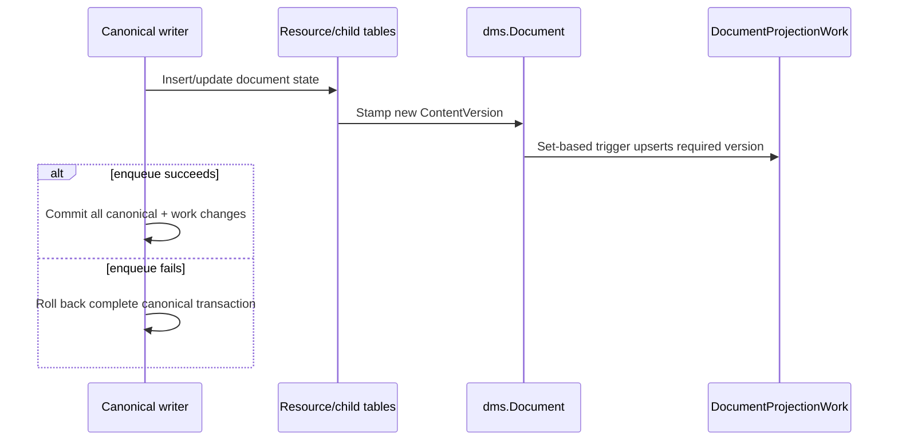
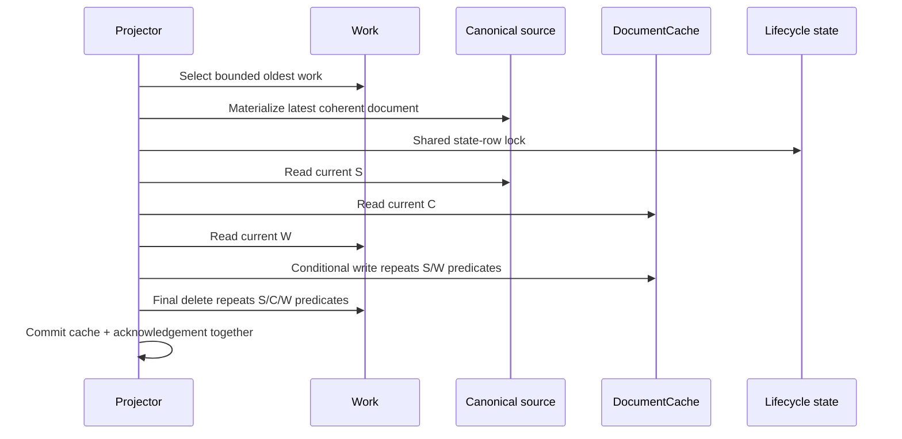
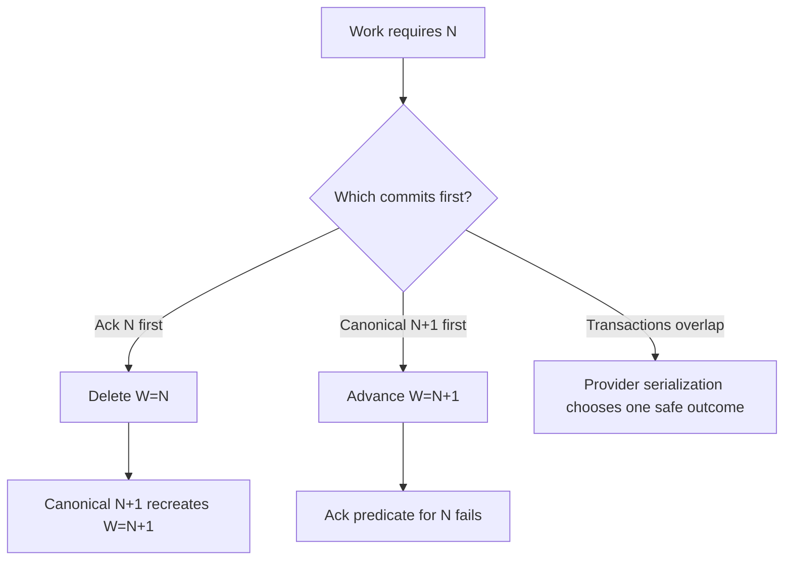
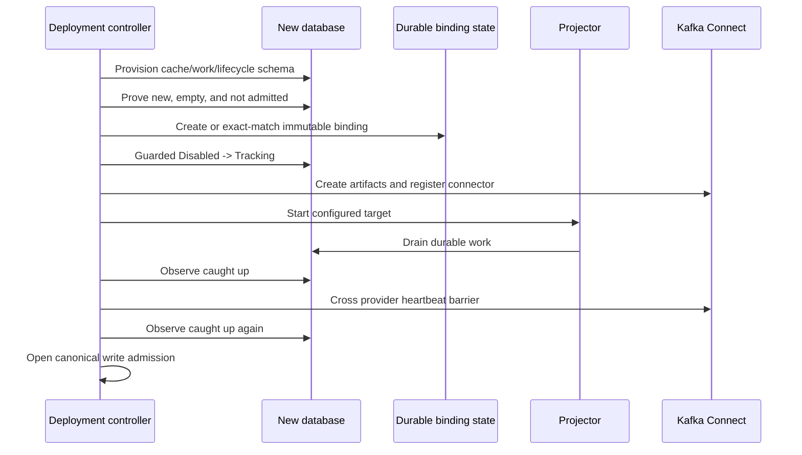

# Relational Document Projection and CDC/Kafka

## DMS-1245 and DMS-1246 design pivot

---

# Decisions

- Canonical state remains normalized relational data.
- `dms.DocumentCache` is optional, rebuildable projected state.
- Projection completeness comes from transactionally recorded
  `dms.DocumentProjectionWork`.
- Cache write and matching work acknowledgement commit together.
- Routine startup, restart, health, and caught-up paths do not scan all documents.
- Public CDC still publishes cache upserts and canonical document-delete tombstones.

---

# Why the design changed

The former approach used recent-version discovery plus periodic comparison of the complete
canonical/cache relationship.

That made restart, completeness, and readiness qualification proportional to total
document count. The accepted contingency is now active: make required projection work a
small durable consequence of each canonical mutation.

O(N) scans remain only for explicit activation baseline, cache rebuild, or integrity
scrub.

---

# Core invariant

While lifecycle is `Tracking`, `Resetting`, or `Rebuilding`:

```text
canonical ContentVersion change
        and
current required projection work
```

commit or roll back in the same transaction.

Projector downtime does not reject canonical writes. Enqueue-schema failure does.

---

# Physical projection model

```text
dms.DocumentCache
  DocumentId PK/FK -> dms.Document
  DocumentUuid
  resource metadata
  ContentVersion
  StreamEtag
  LastModifiedAt
  DocumentJson
  ComputedAt

dms.DocumentProjectionWork
  DocumentId PK/FK -> dms.Document ON DELETE CASCADE
  RequiredContentVersion
  FirstEnqueuedAt
  LastEnqueuedAt

dms.DocumentCacheState
  StateId = 1
  ProjectionLifecycleState
  CacheAheadRecoveryRequired
```

Oldest-first work paging uses `(FirstEnqueuedAt, DocumentId)`.

---

# Transactional enqueue


```mermaid
sequenceDiagram
    participant API as Canonical writer
    participant R as Resource/child tables
    participant D as dms.Document
    participant W as DocumentProjectionWork

    API->>R: Insert/update document state
    R->>D: Stamp new ContentVersion
    D->>W: Set-based trigger upserts required version
    alt enqueue succeeds
        API->>API: Commit all canonical + work changes
    else enqueue fails
        API->>API: Roll back complete canonical transaction
    end
```

PostgreSQL uses separate statement triggers for INSERT and UPDATE transition tables.
SQL Server uses one `AFTER INSERT, UPDATE` trigger and requires server-level nested
triggers for indirect `*_Stamp` updates. In an enqueue-enabled lifecycle, a generated
`*_Stamp` trigger rejects the complete canonical transaction before an indirect
`dms.Document` stamp if that prerequisite is disabled; runtime validation alone is not
completeness.

The enqueue trigger must read exactly the `StateId = 1` lifecycle row. A missing or
unreadable/invalid lifecycle fails the canonical transaction; it is never treated as
`Disabled`.

---

# Coalesced, not an event log

Repeated changes to one document update one work row:

```text
version 10 -> W=10
version 11 -> W=11
version 12 -> W=12
```

Ordinary maximum backlog is the number of distinct changed documents while projection is
behind, not the number of mutations.

V1 adds no claim, lease, attempt, dead-letter, worker-owner, epoch, or baseline-cursor
columns.

---

# Projection and acknowledgement


```mermaid
sequenceDiagram
    participant P as Projector
    participant W as Work
    participant S as Canonical source
    participant C as DocumentCache
    participant L as Lifecycle state

    P->>W: Select bounded oldest work
    P->>S: Materialize latest coherent document
    P->>L: Shared state-row lock
    P->>S: Read current S
    P->>C: Read current C
    P->>W: Read current W
    P->>C: Conditional write repeats S/W predicates
    P->>W: Final delete repeats S/C/W predicates
    P->>P: Commit cache + acknowledgement together
```

No work-row lock is held during materialization, failure backoff, cancellation, or
external I/O.

---

# Current durable classification

| Source `S` | Cache `C` | Work `W` | Result |
| ---: | ---: | ---: | --- |
| 11 | 10 | 11 | Write 11 and acknowledge |
| 11 | 11 | 11 | Already projected; acknowledge |
| 11 | 11 | absent | Document current; no action |
| 11 | 12 | any | Cache ahead; set safety latch after recheck |
| 11 | absent/≤11 | 10 or 12 | Work mismatch; leave pending for scrub |
| 11 | 10 | absent | Missing work; explicit scrub inserts 11 |

Classification uses one provider-consistent statement snapshot. A worker-local stale
candidate is not evidence that cache is ahead.

---

# Stale candidates are safe

A worker may hold candidate 10 after another worker has projected 11.

- Candidate 10 is never written over 11.
- Current `S = C = W = 11` authorizes redundant acknowledgement even though the local
  candidate is older.
- Current `W = S = 11` with missing/behind cache keeps work pending when the local
  candidate is stale.

Only current `C > S` sets the durable cache-ahead latch.

---

# Enqueue versus acknowledge races


```mermaid
flowchart TD
    A[Work requires N] --> B{Which commits first?}
    B -->|Ack N first| C[Delete W=N]
    C --> D[Canonical N+1 recreates W=N+1]
    B -->|Canonical N+1 first| E[Advance W=N+1]
    E --> F[Ack predicate for N fails]
    B -->|Transactions overlap| G[Provider serialization chooses one safe outcome]
```

The work row is a short per-document serialization point, not a write-conflicting source
row commit-order fence.

---

# Fair bounded processing

- Page durable work oldest first.
- Advance past failures and wrap to revisit them.
- Poison work remains durable and cannot starve all later admitted work.
- A process-wide fair gate bounds simultaneous target work.
- Duplicate projector replicas remain correct through monotonic writes and conditional
  acknowledgement.
- Restart resumes from work without scanning `dms.Document`.

---

# Durable lifecycle

```text
Disabled   enqueue off; cache writes/reads off
Resetting  enqueue on; cache writes/acks/reads off
Rebuilding enqueue and projector writes on; cache reads/status success off
Tracking   enqueue and ordinary processing on
```

Supported transitions:

```text
new empty:             Disabled -> Tracking
activation:            Disabled -> Rebuilding -> Tracking
rebuild (latch clear): Tracking|Rebuilding -> Resetting -> Rebuilding -> Tracking
recovery (latch set):  Tracking|Rebuilding -> Resetting -> Rebuilding -> Tracking
deactivate:            Tracking|Rebuilding -> Resetting -> Disabled
```

Recovery follows the rebuild lifecycle path, but `CacheAheadRecoveryRequired` remains set
through `Resetting` and clears only at the verified transition to `Rebuilding`.
Ordinary rebuild requires the latch to be clear before it enters `Resetting`.

The simple offline activation/deactivation toggle is internal-only. Any active or
historical CDC binding/downstream consumer makes the database ineligible; stopping a
connector or removing a runtime target does not erase that history.

---

# Administrative serialization

Lifecycle-changing, clearing, baseline, rebuild, recovery, scrub, and
representation-restamp workflows use one deterministic
session-owned mutex per physical database.

- PostgreSQL: fixed namespace `811646948` plus current database OID in one 64-bit advisory
  key.
- SQL Server: fixed `EdFi.DMS.DocumentProjection.Administration.v1` resource, session owner,
  and explicit `public` database-principal scope.
- Every command uses one shared provider adapter; connection aliases for the same database
  contend, while different databases can be administered concurrently.
- Dedicated open connection for the complete multi-transaction workflow.
- Ordinary writers, workers, reads, and health checks do not take it.
- Session loss releases the mutex and aborts the coordinator.
- A replacement revalidates durable state and repeats/resumes the explicitly requested
  operation.
- `Resetting` alone never tells a replacement which operation to run.

---

# Shared/exclusive state-row fence

Cache-write/acknowledgement transactions hold a shared lock on the singleton state row
through commit.

Transitions into `Resetting` take the row exclusively:

1. wait for prior cache transactions;
2. commit the durable fence;
3. release the exclusive lock;
4. clear the state applicable to the requested operation in bounded transactions.

Later cache transactions see `Resetting` and do nothing. Canonical enqueue continues.
Online cache rebuild may enter only with a clear cache-ahead latch, then clears only cache
and preserves pending work. A set latch rejects rebuild without mutation and routes to
cache-ahead recovery or containment. Offline deactivation and internal-only cache-ahead
recovery clear both cache and work.

---

# Guarded new-empty activation

Before first canonical write:

1. close write admission and drain writers;
2. acquire administrative mutex;
3. take the provider writer-blocking `dms.Document` lock;
4. exclusively lock state;
5. prove lifecycle `Disabled`, latch clear, and canonical/cache/work tables empty;
6. transition to `Tracking` and commit before any canonical write is admitted.

A racing insert either commits first and makes activation reject the nonempty database, or
commits after activation and enqueues work.

A read-acceleration-only deployment may open write admission after this transition.
Initial CDC enablement keeps admission closed through connector setup, the first caught-up
observation, the provider barrier, and the second caught-up observation.

---

# Baseline and rebuild

Existing-database activation enters `Rebuilding` after its offline empty-cache/work check.
Online cache rebuild first atomically proves lifecycle `Tracking` or `Rebuilding` and a
clear cache-ahead latch, enters `Resetting`, clears only cache while preserving pending
work and continuing transactional enqueue, then enters `Rebuilding`. A set latch leaves
lifecycle, cache, work, and latch unchanged for the applicable recovery or containment
workflow.

Both workflows then:

- capture maximum `DocumentId`;
- keyset-page through that boundary;
- seed bounded work windows;
- pause seeding at a high-water mark while workers drain;
- retry a page invalidated by concurrent delete;
- conditionally repair mismatched existing work only inside the current page;
- enter `Tracking` only after seeding finishes and work is empty.

V1 restart begins the baseline again. Scale qualification decides whether a durable cursor
becomes required.

---

# Explicit integrity scrub

Scrub is an operator-requested O(N) operation under the administrative mutex.
Admission requires lifecycle `Tracking` and a clear cache-ahead latch. Any other lifecycle
or a latch already set rejects before the scan or mutation.

It finds:

- missing work for behind cache;
- work requirements different from canonical;
- missing/behind cache;
- genuine cache-ahead state.

It conditionally repairs only work anomalies and sets the safety latch only for current
cache-ahead state. It may set that latch but never clears it. Scrub recency is not
operational-health or caught-up evidence.

---

# Cache-ahead remains a safety incident

`DocumentCache.ContentVersion > Document.ContentVersion` cannot result from supported
same-source monotonic projection.

- Set the durable latch only after current source/cache/work reclassification.
- Block all cache reads and cache/direct-fill writes.
- Never clear because versions later match or work is empty.
- Proven-internal-only recovery uses offline
  `Resetting -> Rebuilding`, clearing cache and work.
- Possibly published state remains fenced; safe recovery needs a new downstream
  namespace and is deferred.

---

# Three different signals

```text
Projection operational health
  process eligible
  lifecycle = Tracking
  latch clear

Projection caught up
  operational
  NOT EXISTS projection work

Initial CDC admission
  caught up
  + provider heartbeat barrier crossed
  + second caught-up observation
  while canonical write admission is closed
```

Queue presence affects caught-up status, not operational health.

---

# Normal API routing is independent

- Projection unavailable or behind does not remove a healthy DMS replica from routing.
- Cache-backed reads fall back to canonical relational reconstruction.
- A projector failure leaves durable work for retry.
- An enqueue failure rejects only its canonical transaction because completeness could
  not be recorded.

---

# Two document sources, one public state stream

| Database source | Operation | Public result |
| --- | --- | --- |
| `dms.DocumentCache` | create/update/snapshot | upsert |
| `dms.Document` | delete | tombstone |
| `dms.DocumentCache` | delete/truncate | ignore |
| `dms.Document` | create/update/snapshot | ignore |
| `dms.CdcHeartbeat` / Debezium heartbeat | any | internal progress only |
| `dms.DocumentProjectionWork` | any | excluded from capture; no record |

Cache maintenance is not domain deletion.

---

# Public topic and key remain unchanged

```text
<topic-prefix>.instance.<instance-key>-g<generation>.documents.v1
```

- `cleanup.policy=compact`
- explicit `delete.retention.ms >= 604800000`
- fixed partition count and `kafka-murmur2-v1`
- key = lowercase D-format `DocumentUuid`
- delete = Kafka record-level null tombstone

---

# Public upsert remains unchanged

```json
{
  "contractVersion": 1,
  "documentUuid": "f81d4fae-7dec-11d0-a765-00a0c91e6bf6",
  "projectName": "EdFi",
  "resourceName": "Student",
  "resourceVersion": "5.2.0",
  "contentVersion": 123456,
  "lastModifiedAt": "2026-07-06T15:30:45Z",
  "document": {
    "id": "f81d4fae-7dec-11d0-a765-00a0c91e6bf6",
    "_etag": "123456-a1b2c3d4.j._.l.i",
    "_lastModifiedDate": "2026-07-06T15:30:45Z"
  }
}
```

No projection-work field enters the public contract.

---

# Initial CDC enablement


```mermaid
sequenceDiagram
    participant D as Deployment controller
    participant DB as New database
    participant S as Durable binding state
    participant P as Projector
    participant K as Kafka Connect

    D->>DB: Provision cache/work/lifecycle schema
    D->>DB: Prove new, empty, and not admitted
    D->>S: Create or exact-match immutable binding
    D->>DB: Guarded Disabled -> Tracking
    D->>K: Create artifacts and register connector
    D->>P: Start configured target
    P->>DB: Drain durable work
    D->>DB: Observe caught up
    D->>K: Cross provider heartbeat barrier
    D->>DB: Observe caught up again
    D->>D: Open canonical write admission
```

Nonempty databases are rejected for v1 CDC retrofit.
An unused exact binding safely resumes activation; `Tracking` without a binding is rejected.

---

# Settings pivot

Keep queue-oriented settings:

```text
Projector:PollInterval
Projector:PageSize
Projector:MaxConcurrentTargets
Projector:FailureBackoff
Projector:BaselineHighWaterMark
ReadAcceleration:DirectFillTimeout
```

Runtime target configuration never changes durable lifecycle state.

---

# Telemetry pivot

Observe:

- lifecycle and cache-ahead latch;
- operational health and caught-up status;
- queue presence and oldest-work age;
- bounded/provider-estimated backlog;
- page/drain throughput, failures, poison traversal, and backoff;
- enqueue failures separately from processing failures;
- activation, reset, rebuild, scrub, and mutex outcomes;
- RCSI and nested-trigger prerequisite validation.

Health polling performs no full source/cache scan or routine exact backlog count.

---

# Performance qualification

Measure both providers:

- write throughput/latency in `Disabled`, `Resetting`, and `Tracking`;
- indirect propagation and bulk-restamp enqueue amplification;
- same-document writer/acknowledgement contention and deadlocks;
- queue growth/drain after outage;
- poison/backpressure behavior;
- interrupted baseline restart from the beginning;
- large-cache bounded clear and crash recovery;
- state-row shared/exclusive lock behavior;
- PostgreSQL WAL/vacuum/bloat;
- SQL Server log/ghost/index behavior;
- empty/small/large work status plans with a 100-million-document source.

---

# Story impact

E18 owns:

- schema/enqueue/lifecycle;
- materializer;
- atomic cache-write/acknowledgement;
- queue processing and administration;
- cache reads/fallback;
- health/caught-up telemetry;
- qualification/runbooks;
- lifecycle-aware, administratively serialized restamp.

E19 owns:

- binding/readiness composition;
- capture exclusion of work;
- connector templates/transform validation;
- guarded bootstrap and provider barrier;
- public contract/E2E/runbooks.

---

# Final invariant

```text
No supported canonical mutation can commit in an enqueue-enabled lifecycle state
without durable current projection work.

No projection work can be acknowledged unless the current canonical and cache versions
both satisfy that requirement in the same short transaction.
```
