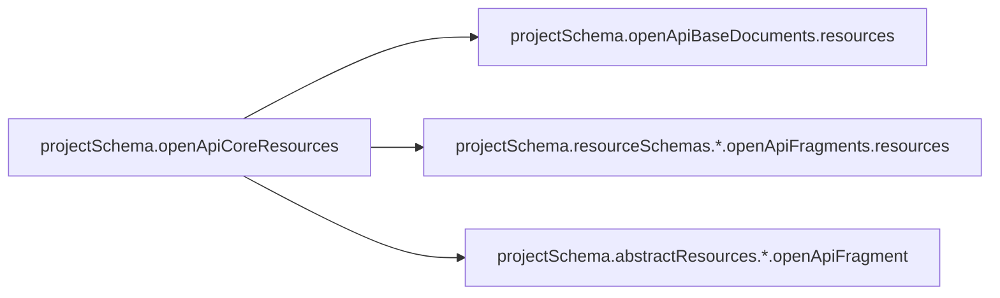
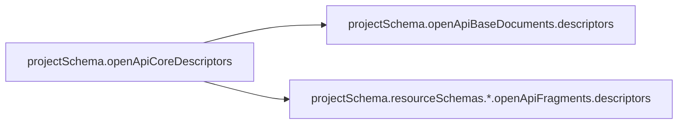
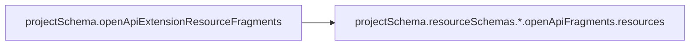
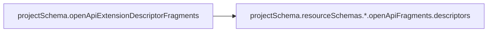

# OpenAPI Schema Structure Mapping

## Old Structure → New Structure Transformations

### Core Project Transformations

#### 1. Resources Document

**Mapping Details:**
- `projectSchema.openApiCoreResources` → Split into:
  - `projectSchema.openApiBaseDocuments.resources` (base document structure)
  - `projectSchema.resourceSchemas.{resourceName}.openApiFragments.resources` (per-resource fragments)
  - `projectSchema.abstractResources.{resourceName}.openApiFragment` (abstract resource schemas only)

#### 2. Descriptors Document

**Mapping Details:**
- `projectSchema.openApiCoreDescriptors` → Split into:
  - `projectSchema.openApiBaseDocuments.descriptors` (base document structure)
  - `projectSchema.resourceSchemas.{descriptorName}.openApiFragments.descriptors` (per-descriptor fragments)

### Extension Project Transformations

#### 3. Extension Resource Fragments

**Mapping Details:**
- `projectSchema.openApiExtensionResourceFragments.exts` → `projectSchema.resourceSchemas.{resourceName}.openApiFragments.resources.exts`
- `projectSchema.openApiExtensionResourceFragments.newPaths` → `projectSchema.resourceSchemas.{resourceName}.openApiFragments.resources.paths`
- `projectSchema.openApiExtensionResourceFragments.newSchemas` → `projectSchema.resourceSchemas.{resourceName}.openApiFragments.resources.components.schemas`
- `projectSchema.openApiExtensionResourceFragments.newTags` → `projectSchema.resourceSchemas.{resourceName}.openApiFragments.resources.tags`

#### 4. Extension Descriptor Fragments

**Mapping Details:**
- `projectSchema.openApiExtensionDescriptorFragments.exts` → `projectSchema.resourceSchemas.{descriptorName}.openApiFragments.descriptors.exts`
- `projectSchema.openApiExtensionDescriptorFragments.newPaths` → `projectSchema.resourceSchemas.{descriptorName}.openApiFragments.descriptors.paths`
- `projectSchema.openApiExtensionDescriptorFragments.newSchemas` → `projectSchema.resourceSchemas.{descriptorName}.openApiFragments.descriptors.components.schemas`
- `projectSchema.openApiExtensionDescriptorFragments.newTags` → `projectSchema.resourceSchemas.{descriptorName}.openApiFragments.descriptors.tags`

## Key Structural Changes

### Fragment Distribution
- **Old**: Monolithic OpenAPI documents containing all resources/descriptors
- **New**: Fragments distributed to individual resource schemas

### Resource Schema Properties
Each resource schema now contains:
- `isDescriptor`: Boolean indicating if this is a descriptor resource
- `isResourceExtension`: Boolean indicating if this is an extension to a core resource
- `openApiFragments`: Object containing OpenAPI fragments keyed by document type

### Abstract Resources
- **Old**: Embedded within `openApiCoreResources`
- **New**: Separate `abstractResources` section with `openApiFragment` property

## Reconstruction Process

### Core Documents
1. Start with `openApiBaseDocuments.{documentType}`
2. Iterate through `resourceSchemas`
3. For each resource where `isResourceExtension === false`:
   - Merge `openApiFragments.{documentType}.paths` into document paths
   - Merge `openApiFragments.{documentType}.components.schemas` into document schemas
   - Merge `openApiFragments.{documentType}.tags` into document tags
4. For resources document only: merge `abstractResources.*.openApiFragment.components.schemas`

### Extension Documents
1. Initialize empty fragment structure
2. Iterate through `resourceSchemas`
3. For extension resources (`isResourceExtension === true`):
   - Collect `openApiFragments.resources.exts` into `exts`
   - Collect `openApiFragments.resources.paths` into `newPaths`
   - Collect `openApiFragments.resources.components.schemas` into `newSchemas`
   - Collect `openApiFragments.resources.tags` into `newTags`
4. For regular resources in extension projects:
   - Collect paths, schemas, and tags into `newPaths`, `newSchemas`, `newTags`