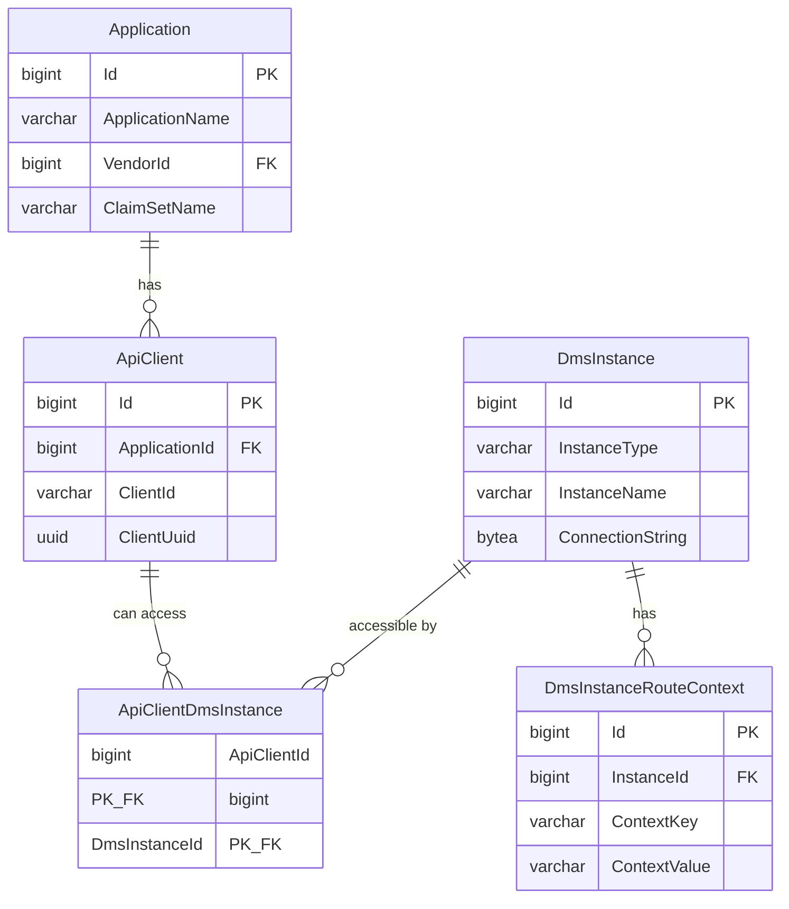

# API Client and DMS Instance Configuration

## Overview

The Ed-Fi Data Management Service (DMS) Configuration Service manages API client
credentials and DMS instance routing through a dedicated configuration database.
This database stores vendor and application information, API client credentials,
DMS instance connection strings, and route context mappings for multi-tenant
deployments.

All configuration data resides in the `dmscs` (DMS Configuration Service) schema
within the configuration database.

## Ed-Fi DMS "Instances"

### Instance Storage and Security

The connection strings for DMS instances are configured in the DMS Configuration
Service database and stored in the `DmsInstance` table. For security purposes,
connection strings are encrypted using AES encryption to protect database
credentials from unauthorized access.

### API Client to Instance Association

Each API client can be associated with one or more DMS instances. In the
simplest case, each API client has access to a single instance, providing a
streamlined experience where the client uses a fixed API base URL (e.g.,
`http://localhost:8080/data/ed-fi/students`).

### Context-Based Routing

Alternatively, the DMS supports **context-based routing**, which allows a
single API client to access multiple DMS instances by including route
qualifiers in the request URL. This approach combines API client/instance
associations with route context values to determine which database should
handle each request.

When context-based routing is enabled, route qualifiers are included in the
API path (e.g., `http://localhost:8080/255901/2024/data/ed-fi/students`),
where `255901` and `2024` represent contextual values such as district ID and
school year.

The `DmsInstanceRouteContext` table stores the context key-value pairs for
each instance, enabling the DMS API to match incoming route qualifiers
against configured instances.

### Related Tables

#### DmsInstance

Stores DMS instance definitions and encrypted connection strings.

| Column | Type | Description |
|--------|------|-------------|
| Id | BIGINT | Primary key |
| InstanceType | VARCHAR(50) | Instance classification |
| InstanceName | VARCHAR(256) | Human-readable instance name |
| ConnectionString | BYTEA | Encrypted database connection string |

#### DmsInstanceRouteContext

Stores context key-value pairs for route-based instance resolution.

| Column | Type | Description |
|--------|------|-------------|
| Id | BIGINT | Primary key |
| InstanceId | BIGINT | Foreign key to DmsInstance |
| ContextKey | VARCHAR(256) | Context dimension name |
| ContextValue | VARCHAR(256) | Context value |

**Constraint:** `UNIQUE (InstanceId, ContextKey)` ensures each instance has
only one value per context key.

#### ApiClient

Stores OAuth client credentials for applications.

| Column | Type | Description |
|--------|------|-------------|
| Id | BIGINT | Primary key |
| ApplicationId | BIGINT | Foreign key to Application |
| ClientId | VARCHAR(36) | OAuth client identifier |
| ClientUuid | UUID | Globally unique client identifier |

#### ApiClientDmsInstance

Maps API clients to DMS instances they can access (many-to-many).

| Column | Type | Description |
|--------|------|-------------|
| ApiClientId | BIGINT | Foreign key to ApiClient |
| DmsInstanceId | BIGINT | Foreign key to DmsInstance |

### Configuration

DMS instance and route context configuration is managed through the DMS
Configuration Service REST API. See the
[Context-Based Routing documentation](CONTEXT-BASED-ROUTING.md) for detailed
configuration examples and usage patterns.
