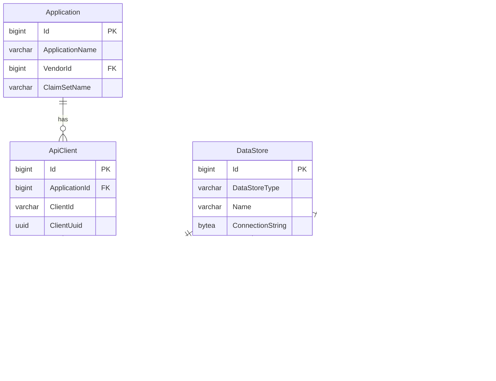

# API Client and Data Store Configuration

## Overview

The Ed-Fi Data Management Service (DMS) Configuration Service manages API client
credentials and data store routing through a dedicated configuration database.
This database stores vendor and application information, API client credentials,
data store connection strings, and route context mappings for multi-tenant
deployments.

All configuration data resides in the `dmscs` (DMS Configuration Service) schema
within the configuration database.

## Ed-Fi DMS Data Stores

### Data Store Storage and Security

The connection strings for data stores are configured in the DMS Configuration
Service database and stored in the `DataStore` table. For security purposes,
connection strings are encrypted using AES encryption to protect database
credentials from unauthorized access.

### API Client to Data Store Association

Each API client can be associated with one or more data stores. In the
simplest case, each API client has access to a single instance, providing a
streamlined experience where the client uses a fixed API base URL (e.g.,
`http://localhost:8080/data/ed-fi/students`).

### Context-Based Routing

Alternatively, the DMS supports **context-based routing**, which allows a
single API client to access multiple data stores by including route
qualifiers in the request URL. This approach combines API client/data store
associations with route context values to determine which database should
handle each request.

When context-based routing is enabled, route qualifiers are included in the
API path (e.g., `http://localhost:8080/255901/2024/data/ed-fi/students`),
where `255901` and `2024` represent contextual values such as district ID and
school year.

The `DataStoreContext` table stores the context key-value pairs for
each data store, enabling the DMS API to match incoming route qualifiers
against configured data stores.

### Related Tables

```mermaid
erDiagram
    Application ||--o{ ApiClient : "has"
    ApiClient ||--o{ ApiClientDataStore : "can access"
    DataStore ||--o{ ApiClientDataStore : "accessible by"
    DataStore ||--o{ DataStoreContext : "has"
    DataStore ||--o{ DataStoreDerivative : "has"

    Application {
        bigint Id PK
        varchar ApplicationName
        bigint VendorId FK
        varchar ClaimSetName
    }

    ApiClient {
        bigint Id PK
        bigint ApplicationId FK
        varchar ClientId
        uuid ClientUuid
    }

    ApiClientDataStore {
        bigint ApiClientId PK_FK
        bigint DataStoreId PK_FK
    }

    DataStore {
        bigint Id PK
        varchar DataStoreType
        varchar Name
        bytea ConnectionString
    }

    DataStoreContext {
        bigint Id PK
        bigint DataStoreId FK
        varchar ContextKey
        varchar ContextValue
    }

    DataStoreDerivative {
        bigint Id PK
        bigint DataStoreId FK
        varchar DerivativeType
        bytea ConnectionString
    }
```

#### DataStore

Stores data store definitions and encrypted connection strings.

| Column | Type | Description |
|--------|------|-------------|
| Id | BIGINT | Primary key |
| DataStoreType | VARCHAR(50) | Data store classification |
| Name | VARCHAR(256) | Human-readable data store name |
| ConnectionString | BYTEA | Encrypted database connection string |

#### DataStoreContext

Stores context key-value pairs for route-based data store resolution.

| Column | Type | Description |
|--------|------|-------------|
| Id | BIGINT | Primary key |
| DataStoreId | BIGINT | Foreign key to DataStore |
| ContextKey | VARCHAR(256) | Context dimension name |
| ContextValue | VARCHAR(256) | Context value |

**Constraint:** `UNIQUE (DataStoreId, ContextKey)` ensures each data store has
only one value per context key.

#### DataStoreDerivative

Stores derivative data stores (read replicas and snapshots) associated with a parent data store.

| Column | Type | Description |
|--------|------|-------------|
| Id | BIGINT | Primary key |
| DataStoreId | BIGINT | Foreign key to parent DataStore |
| DerivativeType | VARCHAR(50) | Type of derivative: "ReadReplica" or "Snapshot" |
| ConnectionString | BYTEA | Encrypted database connection string |

**Foreign Key:** CASCADE DELETE on `DataStoreId` - when a parent DataStore is
deleted, all its derivative data stores are automatically deleted.

**Index:** `idx_datastorederivative_datastoreid` on DataStoreId for efficient
queries.

#### ApiClient

Stores OAuth client credentials for applications.

| Column | Type | Description |
|--------|------|-------------|
| Id | BIGINT | Primary key |
| ApplicationId | BIGINT | Foreign key to Application |
| ClientId | VARCHAR(36) | OAuth client identifier |
| ClientUuid | UUID | Globally unique client identifier |

#### ApiClientDataStore

Maps API clients to data stores they can access (many-to-many).

| Column | Type | Description |
|--------|------|-------------|
| ApiClientId | BIGINT | Foreign key to ApiClient |
| DataStoreId | BIGINT | Foreign key to DataStore |

## Data Store Derivatives

Data Store Derivatives are alternate database instances associated with a parent
data store, such as read replicas or snapshots. Read replicas distribute query
load, while snapshots preserve point-in-time data for backup, testing, or analysis.

Each derivative type is stored with its own encrypted connection string and is
automatically deleted when its parent data store is removed (CASCADE DELETE).

### Configuration

Data store and route context configuration is managed through the DMS
Configuration Service REST API. See the
[Database segmentation documentation](DATABASE-SEGMENTATION-STRATEGY.md) for detailed
configuration examples and usage patterns.
