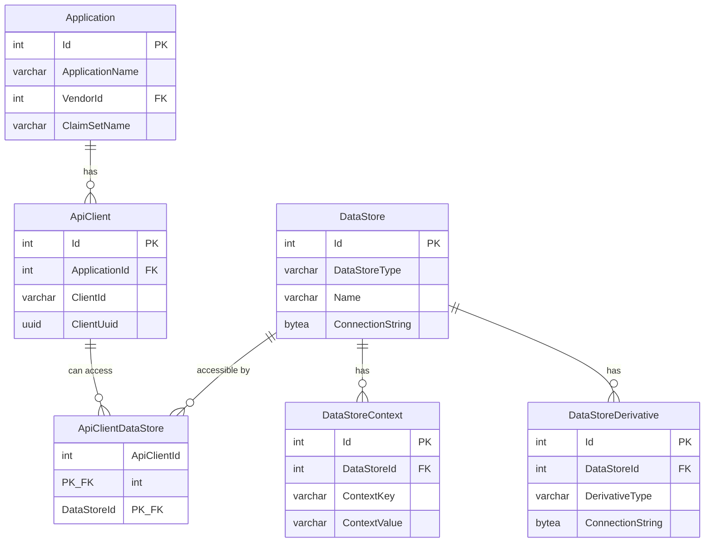

# API Client and Data Store Configuration

## Overview

The Ed-Fi API Configuration Service manages API client
credentials and data store routing through a dedicated configuration database.
This database stores vendor and application information, API client credentials,
data store connection strings, and route context mappings for multi-tenant
deployments.

All configuration data resides in the `dmscs` (DMS Configuration Service) schema
within the configuration database.

## Prerelease Rename Note

DMS-1198 renames the prerelease CMS management contract and database objects
from DMS instance terminology to data store terminology. Deployments upgrading
from alpha builds that already created `DmsInstance*` CMS tables should recreate
the CMS configuration database, or run an operator-managed migration that copies
the old `DmsInstance*` rows into the new `DataStore*` tables before using the
new CMS API routes. The DMS-1198 branch does not provide an in-place migration
from the old prerelease CMS table names.

External CMS callers must update from the old DMS instance route and JSON field
names to the `dataStore*` routes and `dataStore*` payload fields.

## Ed-Fi DMS Data Stores

### Data Store Storage and Security

The connection strings for data stores are configured in the DMS Configuration
Service database and stored in the `DataStore` table. For security purposes,
connection strings are encrypted using AES encryption to protect database
credentials from unauthorized access.

### API Client to Data Store Association

Each API client can be associated with zero, one, or many data stores. In the
simplest case, each API client has access to a single instance, providing a
streamlined experience where the client uses a fixed API base URL (e.g.,
`http://localhost:8080/data/ed-fi/students`).

#### Clients With No Data Store Assignment

A client may be created and administered with no data store assignment at all.
Such a client authenticates normally and is issued a token, but the token
conveys no data store, so the client reaches no data store and no resource data.
It exists so an operator can provision a client for operations that are not
scoped to a data store, and it is provisioned through the ordinary API-client
lifecycle rather than through any special route.

`dataStoreIds` behaves as follows on both `POST /v3/applications` and the
`/v3/apiClients` endpoints:

| Request value | Behavior |
| --- | --- |
| `[]` | Accepted. The client is created, or updated, with no data store assignment. |
| omitted | Accepted, and identical to `[]`. |
| `null` | Rejected with `400` and a `DataStoreIds` validation error. |
| `[1, 2]` | Accepted when every id exists **in the caller's tenant**. |
| ids that are absent, or belong to another tenant | Rejected with `409` unresolved reference; nothing is created, and on update the client's existing assignment is left unchanged. |

Two properties of this contract are easy to get wrong:

- **`PUT` replaces the whole list.** An empty *or omitted* `dataStoreIds` on
  `PUT /v3/apiClients/{id}` removes every assignment the client currently has.
  There is no partial update, so a caller that omits the field to "leave it
  alone" will instead clear it.
- **An empty list is not a wildcard.** It grants nothing, and it does not widen
  visibility across tenants: a client with no assignment is exactly as invisible
  to another tenant as one with an assignment.

Removing a client's last data store assignment does not relax anything else.
The client still requires approval to obtain a token: `isApproved` is
unchanged by this contract, and an unapproved client is refused a token whether
or not it has a data store. Ownership configuration, credential handling and
tenant isolation are likewise unaffected.

The `dataStoreIds` **token claim** for such a client differs between the two
supported identity providers, and consumers must treat the two as the same
outcome:

- **self-contained (OpenIddict)** issues the claim with an empty value.
- **Keycloak** omits the claim entirely, because it registers no protocol
  mapper for an empty assignment.

So "no data stores" is represented as either an empty `dataStoreIds` claim or
an absent one, depending on the deployment's identity provider.

#### Provisioning a Client With No Data Store Assignment

The sequence below is the whole lifecycle, using only endpoints that exist
today. Two different identifiers are involved and they are not interchangeable:

- the **numeric `id`** returned in the API-client response body is the
  management identifier used in `PUT`, `DELETE` and `reset-credential` routes;
- the **`clientId`** (returned as `key` when credentials are issued) is the
  OAuth client identifier, and it is what `GET /v3/apiClients/{clientId}` takes.

`POST /v3/applications` returns the **application's** id in `id`, not the
initial client's. To act on that client, read it with
`GET /v3/apiClients/{key}` and take the numeric `id` from that response.

1. **Create a vendor** — `POST /v3/vendors`.
2. **Create an application with no data store** —
   `POST /v3/applications` with `"dataStoreIds": []`. The response carries the
   application `id` plus the `key` and `secret` of an initial client that has no
   data store assignment.
3. **Read the initial client** — `GET /v3/apiClients/{key}`. The response shows
   `"dataStoreIds": []` and supplies that client's numeric `id`.
4. **Add another client, if needed** — `POST /v3/apiClients` with
   `"dataStoreIds": []` (or with the property omitted). The response carries the
   new client's numeric `id`, `key` and `secret`.
5. **Update a client** — `PUT /v3/apiClients/{numeric id}`. Sending
   `"dataStoreIds": []` keeps the client unassigned. The response is `204` and
   returns no credentials, so the current key and secret remain valid.
6. **Reset credentials** — `PUT /v3/apiClients/{numeric id}/reset-credential`
   with an empty body `{}`. The response returns the client's **new** secret
   alongside its unchanged key; use the returned pair from then on. The data
   store assignment is untouched.
7. **Exchange the current credentials for a token** — `POST /connect/token` with
   `grant_type=client_credentials`, the client's current `key`/`secret`, and
   `scope` set to the application's **claim set name**. Supply the scope
   explicitly: the token endpoint always forwards a `scope` parameter, so
   omitting it sends an empty scope, which the self-contained provider ignores
   but Keycloak rejects with `invalid_scope`.
8. **Delete a client** — `DELETE /v3/apiClients/{numeric id}`, after which
   `GET /v3/apiClients/{key}` reports `404`.

What the resulting token can *do* with a DMS identity API is out of scope here:
**the DMS identity routes do not exist yet.** This section documents only how to
provision such a client in the Configuration Service and confirm its credentials
work. The end-to-end proof from these credentials through to identity operations,
and the guarantee that they grant no resource access, belong to the story that
introduces the identity API surface.

### Context-Based Routing

Alternatively, the DMS supports **context-based routing**, which allows a
single API client to access multiple data stores by including route
qualifiers in the request URL. This approach combines API client/data store
associations with route context values to determine which database should
handle each request.

When context-based routing is enabled, route qualifiers are included in the
API path (e.g., `http://localhost:8080/255901/2024/data/ed-fi/students`),
where `255901` and `2024` represent contextual values such as district ID and
school year.

The `DataStoreContext` table stores the context key-value pairs for
each data store, enabling the DMS API to match incoming route qualifiers
against configured data stores.

### Related Tables

```mermaid
erDiagram
    Application ||--o{ ApiClient : "has"
    ApiClient ||--o{ ApiClientDataStore : "can access"
    DataStore ||--o{ ApiClientDataStore : "accessible by"
    DataStore ||--o{ DataStoreContext : "has"
    DataStore ||--o{ DataStoreDerivative : "has"

    Application {
        int Id PK
        varchar ApplicationName
        int VendorId FK
        varchar ClaimSetName
    }

    ApiClient {
        int Id PK
        int ApplicationId FK
        varchar ClientId
        uuid ClientUuid
    }

    ApiClientDataStore {
        int ApiClientId PK_FK
        int DataStoreId PK_FK
    }

    DataStore {
        int Id PK
        varchar DataStoreType
        varchar Name
        bytea ConnectionString
    }

    DataStoreContext {
        int Id PK
        int DataStoreId FK
        varchar ContextKey
        varchar ContextValue
    }

    DataStoreDerivative {
        int Id PK
        int DataStoreId FK
        varchar DerivativeType
        bytea ConnectionString
    }
```

#### DataStore

Stores data store definitions and encrypted connection strings.

| Column | Type | Description |
|--------|------|-------------|
| Id | INT | Primary key |
| DataStoreType | VARCHAR(50) | Data store classification |
| Name | VARCHAR(256) | Human-readable data store name |
| ConnectionString | BYTEA | Encrypted database connection string |

#### DataStoreContext

Stores context key-value pairs for route-based data store resolution.

| Column | Type | Description |
|--------|------|-------------|
| Id | INT | Primary key |
| DataStoreId | INT | Foreign key to DataStore |
| ContextKey | VARCHAR(256) | Context dimension name |
| ContextValue | VARCHAR(256) | Context value |

**Constraint:** `UNIQUE (DataStoreId, ContextKey)` ensures each data store has
only one value per context key.

#### DataStoreDerivative

Stores derivative data stores (read replicas and snapshots) associated with a parent data store.

| Column | Type | Description |
|--------|------|-------------|
| Id | INT | Primary key |
| DataStoreId | INT | Foreign key to parent DataStore |
| DerivativeType | VARCHAR(50) | Type of derivative: "ReadReplica" or "Snapshot" |
| ConnectionString | BYTEA | Encrypted database connection string |

**Foreign Key:** CASCADE DELETE on `DataStoreId` - when a parent DataStore is
deleted, all its derivative data stores are automatically deleted.

**Constraint:** `UNIQUE (DataStoreId, DerivativeType)` ensures each data store
has at most one ReadReplica and at most one Snapshot. Its backing index leads
with DataStoreId, so it also serves lookups by parent data store and the
child-side foreign-key maintenance.

**Constraint:** a check constraint restricts `DerivativeType` to exactly
"ReadReplica" or "Snapshot", compared ordinally including length, so case and
whitespace variants are rejected in both engines.

#### ApiClient

Stores OAuth client credentials for applications.

| Column | Type | Description |
|--------|------|-------------|
| Id | INT | Primary key |
| ApplicationId | INT | Foreign key to Application |
| ClientId | VARCHAR(36) | OAuth client identifier |
| ClientUuid | UUID | Globally unique client identifier |

#### ApiClientDataStore

Maps API clients to data stores they can access (many-to-many).

| Column | Type | Description |
|--------|------|-------------|
| ApiClientId | INT | Foreign key to ApiClient |
| DataStoreId | INT | Foreign key to DataStore |

## Data Store Derivatives

Data Store Derivatives are alternate database instances associated with a parent
data store, such as read replicas or snapshots. Read replicas distribute query
load, while snapshots preserve point-in-time data for backup, testing, or analysis.

A `Snapshot` derivative must reference a database that is frozen for the duration
of a client's paging session. Change-version-filtered collection reads served
from a snapshot are paged in change-version order, and that ordering is only safe
over data that cannot change while it is being walked. Configuring a source that
continues to apply changes — a live secondary, or a standby still shipping logs —
as a `Snapshot` rather than a `ReadReplica` can silently return one document
twice and skip another within a single walk, with no error reported. A
`ReadReplica` carries no such requirement: reads served from one keep the live
paging rule. See [Cursor Paging](./CURSOR-PAGING.md).

The requirement covers the derivative's identity as well as the database behind
it. While reads against a snapshot are in progress, do not re-point the
derivative at a different connection string, and do not re-create the database
behind an unchanged one. Where the replacement is provisioned to the same
effective schema, neither is reported: the pages already returned are not
re-read, and the reads finish normally with their pages drawn from two different
points in time. Re-creating the database at an unchanged connection string is the
more severe of the two, because no configuration changed and nothing keyed on the
connection string can observe the substitution. A replacement provisioned to a
*different* effective schema is reported, as `503` with an effective-schema-hash
mismatch, because that much the fingerprint check can see.

Two changes do interrupt the reads rather than silently answering them from a
different copy, and the two are answered differently. Removing the derivative row
leaves nothing to select: the request is answered `404` with
`Snapshot not found.`, decided during target selection before any database is
opened. Dropping the snapshot database, or otherwise making a still-configured
derivative unreachable, is invisible to selection — the connection string is
still there and still non-blank — so the request travels on and fails when the
connection is acquired, and is answered `503` with a service-configuration error
describing a transient fault.

The distinction matters to a client that retries. The `503` is transient: the
next request at the same unchanged connection string succeeds once the database
is reachable again, and no cached verdict has to be cleared first. The `404` is
not transient — it says the deployment no longer offers a snapshot at all, and
retrying will keep returning it until a derivative is configured again.

Each derivative type is stored with its own encrypted connection string and is
automatically deleted when its parent data store is removed (CASCADE DELETE).

### Configuration

Data store and route context configuration is managed through the DMS
Configuration Service REST API. See the
[Database segmentation documentation](DATABASE-SEGMENTATION-STRATEGY.md) for detailed
configuration examples and usage patterns.
