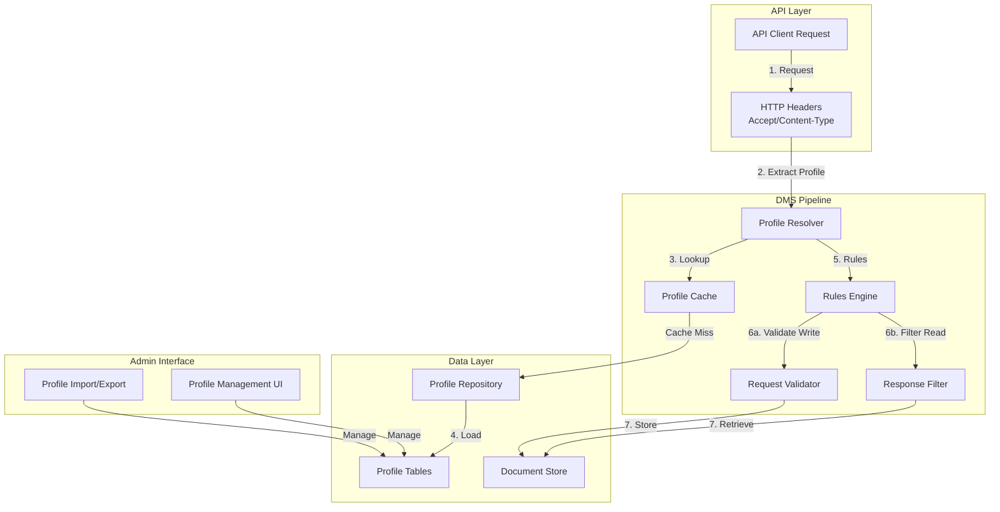
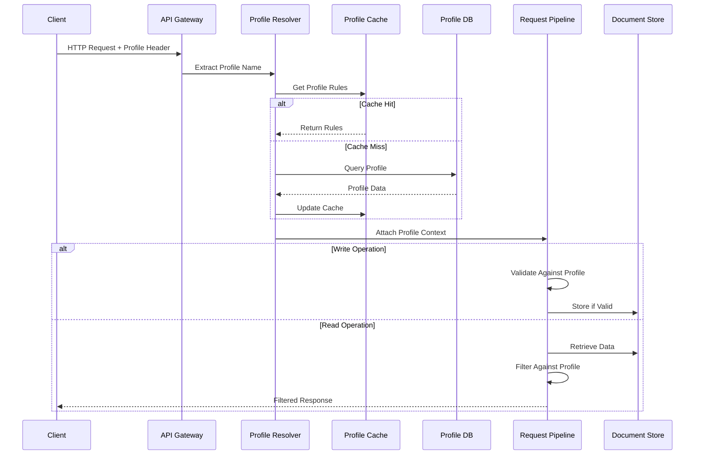
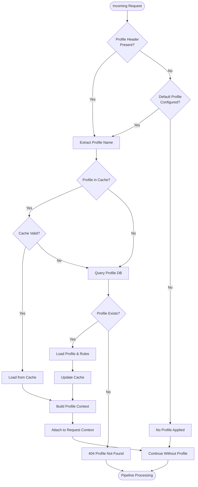
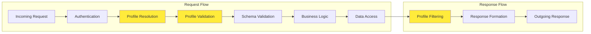

# API Profiles Feature Design - Ed-Fi Data Management Service

## Executive Summary

This document describes the architecture and implementation strategy for adapting the Ed-Fi API Profiles feature from AdminAPI-2.x to the Data Management Service (DMS). API Profiles enable fine-grained data policy enforcement on API resources, controlling which properties, references, and collections are visible or modifiable based on specific operational or regulatory scenarios.

## Table of Contents

1. [Problem Definition](#problem-definition)
2. [Conceptual Design](#conceptual-design)
3. [Integration Strategy](#integration-strategy)
4. [Database Schema Design](#database-schema-design)
5. [Profile Resolution Flow](#profile-resolution-flow)
6. [Enforcement Pipeline Architecture](#enforcement-pipeline-architecture)
7. [Implementation Tickets](#implementation-tickets)
8. [Migration Strategy](#migration-strategy)
9. [API Specifications](#api-specifications)
10. [Example Profiles](#example-profiles)

## Problem Definition

### Background

The Ed-Fi API Profiles feature is a critical capability that enables educational organizations to:

- **Enforce data policies** on API resources based on operational or regulatory requirements
- **Control visibility** of sensitive data elements to different API consumers
- **Restrict update paths** to prevent unauthorized modifications
- **Support multi-tenant scenarios** where different clients have different data access rights

### Current State

The Profiles feature currently exists in the AdminAPI-2.x codebase where:
- Profiles are defined in XML format
- Rules are evaluated at the API layer during request processing
- Profile enforcement is tightly coupled with the API implementation
- Profile management is manual and file-based

### Target State

Moving this capability into DMS will provide:
- **Centralized policy enforcement** - consistent rules across all API operations
- **Dynamic profile management** - database-backed profiles with runtime updates
- **Scalability** - better performance with cached profile rules
- **Maintainability** - separation of concerns between policy and business logic
- **Consistency** - unified approach across the Ed-Fi ecosystem

## Conceptual Design

### Main Principles

1. **Profile-Based Access Control**
   - Profiles act as named policy documents that define resource access patterns
   - Each profile specifies inclusion/exclusion rules for properties, references, and collections
   - Multiple profiles can exist, supporting different consumer roles or scenarios

2. **Database-Backed Storage**
   - Profiles are imported from XML and stored in database tables
   - Rules are normalized and indexed for efficient runtime evaluation
   - Profile metadata (name, description, version) is maintained separately from rules

3. **Runtime Enforcement**
   - Profile resolution happens early in the request pipeline
   - Rules are applied dynamically to filter request/response data
   - Both read and write operations are subject to profile enforcement

4. **Header-Based Selection**
   - Clients specify profiles via HTTP headers
   - `Accept` header for GET operations (response filtering)
   - `Content-Type` header for POST/PUT operations (request validation)
   - Default profile assignment when header is not specified

5. **Legacy Compatibility**
   - XML remains the canonical format for profile definition
   - Import/export maintains format compatibility with AdminAPI-2.x
   - Existing profile documents can be migrated without modification

### Key Components



## Integration Strategy

### Architecture Overview

The Profiles feature integrates into DMS through several layers:

1. **Storage Layer** - PostgreSQL/MSSQL tables for profile data
2. **Repository Layer** - Data access abstractions for profile CRUD
3. **Service Layer** - Business logic for profile resolution and enforcement
4. **Middleware Layer** - Pipeline integration for request/response processing
5. **Admin Layer** - Management API for profile lifecycle operations

### Request Processing Flow



### Pipeline Integration Points

The profile enforcement integrates into the existing DMS pipeline at specific stages:

1. **Early Pipeline** - Profile resolution (after authentication)
2. **Validation Stage** - Write operation validation (before schema validation)
3. **Processing Stage** - Data filtering (before/after backend operations)
4. **Response Stage** - Response filtering (before serialization)

## Database Schema Design

### Profile Metadata Table

```sql
CREATE TABLE dms.Profile (
    ProfileId BIGINT GENERATED ALWAYS AS IDENTITY PRIMARY KEY,
    ProfileName VARCHAR(255) NOT NULL UNIQUE,
    Description TEXT NULL,
    ResourceName VARCHAR(255) NOT NULL,
    ContentType VARCHAR(255) NOT NULL,
    ReadContentType VARCHAR(255) NULL,
    WriteContentType VARCHAR(255) NULL,
    IsActive BOOLEAN NOT NULL DEFAULT TRUE,
    CreatedAt TIMESTAMP NOT NULL DEFAULT NOW(),
    LastModifiedAt TIMESTAMP NOT NULL DEFAULT NOW(),
    CONSTRAINT UK_Profile_Name_Resource UNIQUE (ProfileName, ResourceName)
);

CREATE INDEX IX_Profile_Name ON dms.Profile (ProfileName);
CREATE INDEX IX_Profile_Resource ON dms.Profile (ResourceName);
CREATE INDEX IX_Profile_Active ON dms.Profile (IsActive) WHERE IsActive = TRUE;
```

### Profile Property Rules Table

```sql
CREATE TABLE dms.ProfilePropertyRule (
    ProfilePropertyRuleId BIGINT GENERATED ALWAYS AS IDENTITY PRIMARY KEY,
    ProfileId BIGINT NOT NULL,
    PropertyPath VARCHAR(1024) NOT NULL,
    RuleType VARCHAR(50) NOT NULL, -- 'Include', 'Exclude'
    ChildPolicy VARCHAR(50) NULL,   -- 'IncludeAll', 'IncludeOnly', 'ExcludeAll', 'ExcludeOnly'
    CONSTRAINT FK_ProfilePropertyRule_Profile 
        FOREIGN KEY (ProfileId) REFERENCES dms.Profile(ProfileId) 
        ON DELETE CASCADE
);

CREATE INDEX IX_ProfilePropertyRule_ProfileId ON dms.ProfilePropertyRule (ProfileId);
CREATE INDEX IX_ProfilePropertyRule_PropertyPath ON dms.ProfilePropertyRule (PropertyPath);
```

### Profile Collection Rules Table

```sql
CREATE TABLE dms.ProfileCollectionRule (
    ProfileCollectionRuleId BIGINT GENERATED ALWAYS AS IDENTITY PRIMARY KEY,
    ProfileId BIGINT NOT NULL,
    CollectionPath VARCHAR(1024) NOT NULL,
    RuleType VARCHAR(50) NOT NULL, -- 'Include', 'Exclude'
    ChildPolicy VARCHAR(50) NULL,
    CONSTRAINT FK_ProfileCollectionRule_Profile 
        FOREIGN KEY (ProfileId) REFERENCES dms.Profile(ProfileId) 
        ON DELETE CASCADE
);

CREATE INDEX IX_ProfileCollectionRule_ProfileId ON dms.ProfileCollectionRule (ProfileId);
CREATE INDEX IX_ProfileCollectionRule_CollectionPath ON dms.ProfileCollectionRule (CollectionPath);
```

### Profile Reference Rules Table

```sql
CREATE TABLE dms.ProfileReferenceRule (
    ProfileReferenceRuleId BIGINT GENERATED ALWAYS AS IDENTITY PRIMARY KEY,
    ProfileId BIGINT NOT NULL,
    ReferencePath VARCHAR(1024) NOT NULL,
    RuleType VARCHAR(50) NOT NULL, -- 'Include', 'Exclude'
    CONSTRAINT FK_ProfileReferenceRule_Profile 
        FOREIGN KEY (ProfileId) REFERENCES dms.Profile(ProfileId) 
        ON DELETE CASCADE
);

CREATE INDEX IX_ProfileReferenceRule_ProfileId ON dms.ProfileReferenceRule (ProfileId);
CREATE INDEX IX_ProfileReferenceRule_ReferencePath ON dms.ProfileReferenceRule (ReferencePath);
```

### Schema Rationale

- **Normalized Structure**: Separate tables for properties, collections, and references allow efficient querying
- **Indexing Strategy**: Indexes on ProfileId and paths support fast rule lookup
- **Cascade Deletes**: Simplifies profile removal by automatically cleaning up rules
- **Path Storage**: VARCHAR(1024) accommodates deeply nested property paths
- **Extensibility**: Schema supports future rule types without structural changes

## Profile Resolution Flow

### Resolution Algorithm



### Cache Strategy

- **Cache Key**: `profile:{profileName}:{resourceName}`
- **Cache Duration**: Configurable (default: 15 minutes)
- **Invalidation**: Manual or automatic on profile updates
- **Size Limits**: LRU eviction when memory threshold reached
- **Warming**: Pre-load frequently used profiles on startup

## Enforcement Pipeline Architecture

### Middleware Stack



### Write Operation Enforcement

For POST/PUT/PATCH operations:

1. **Profile Resolution**: Extract profile from `Content-Type` header
2. **Rule Evaluation**: Load property/collection/reference rules
3. **Input Validation**: 
   - Check for excluded properties in request body
   - Validate included properties are not missing (if required)
   - Verify collection items conform to profile rules
   - Ensure references are allowed
4. **Rejection**: Return 400 Bad Request if validation fails
5. **Processing**: Continue to backend if validation passes

### Read Operation Enforcement

For GET operations:

1. **Profile Resolution**: Extract profile from `Accept` header
2. **Rule Loading**: Retrieve filtering rules for resource
3. **Data Retrieval**: Fetch data from backend (unfiltered)
4. **Response Filtering**:
   - Remove excluded properties from response
   - Filter collections based on collection rules
   - Apply reference filtering
   - Maintain data structure integrity
5. **Serialization**: Return filtered response

### Error Handling

- **Profile Not Found**: HTTP 404 with descriptive error message
- **Invalid Profile Rules**: HTTP 500 with error details logged
- **Validation Failures**: HTTP 400 with specific rule violations
- **Ambiguous Profile**: HTTP 400 when multiple profiles match

## Implementation Tickets

### Ticket 1: DMS Profile Table and XML Import

**Epic**: Profile Management Infrastructure

**User Story**: As a DMS administrator, I can import API Profile XML documents, and have them stored as dynamic profiles in the DMS database, so that I can centrally manage data access policies.

**Acceptance Criteria**:
- [ ] Database schema created for profiles and rules (all tables with indexes)
- [ ] XML parser implemented for profile document deserialization
- [ ] Profile import API endpoint created (`POST /management/profiles/import`)
- [ ] XML validation enforced (schema compliance)
- [ ] Profile rules correctly parsed and stored in normalized tables
- [ ] Support for all rule types: properties, collections, references, descriptors
- [ ] Profile listing endpoint available (`GET /management/profiles`)
- [ ] Profile detail view endpoint available (`GET /management/profiles/{id}`)
- [ ] Error handling for malformed XML
- [ ] Transaction support for atomic import operations
- [ ] Unit tests for XML parsing (90%+ coverage)
- [ ] Integration tests for import API

**Technical Implementation Details**:

1. **Database Migration Script** (0026_Create_Profile_Tables.sql):
   - Create all profile-related tables
   - Add appropriate indexes and constraints
   - Support both PostgreSQL and MSSQL

2. **XML Parser Implementation** (ProfileXmlParser.cs):
   - Leverage System.Xml.Serialization
   - Define DTOs matching XML structure
   - Handle nested elements for properties/collections/references
   - Validate against expected schema

3. **Repository Layer** (IProfileRepository.cs, ProfileRepository.cs):
   - CRUD operations for profiles
   - Batch insert for rules (performance)
   - Query methods for efficient rule retrieval

4. **Service Layer** (ProfileImportService.cs):
   - Orchestrate XML parsing and database insertion
   - Transaction management
   - Validation and error handling
   - Duplicate profile checking

5. **API Controller** (ProfileManagementController.cs):
   - File upload endpoint
   - List/detail endpoints
   - Authorization (admin only)
   - Request/response DTOs

**Dependencies**:
- Database access framework (Npgsql/Dapper)
- XML parsing libraries (System.Xml)
- File upload handling (ASP.NET Core)

**Estimated Effort**: 8-10 story points (2 weeks)

---

### Ticket 2: DMS Profiles Enforcement Pipeline

**Epic**: Profile Enforcement

**User Story**: When a user performs data operations through the DMS, the system enforces the rules defined in the associated Profile, restricting properties, references, and collections as defined, ensuring data governance policies are maintained.

**Acceptance Criteria**:
- [ ] Profile resolver middleware implemented and integrated
- [ ] Profile resolution from HTTP headers (Accept/Content-Type)
- [ ] Write operation validation enforces profile rules
- [ ] Read operation filtering enforces profile rules
- [ ] Profile caching implemented for performance
- [ ] Support for default profile assignment
- [ ] Error responses for profile violations
- [ ] All resource types supported (resources, descriptors)
- [ ] Nested property filtering works correctly
- [ ] Collection filtering preserves data integrity
- [ ] Reference filtering applied correctly
- [ ] Pipeline performance impact <10ms per request
- [ ] Unit tests for all enforcement logic (90%+ coverage)
- [ ] Integration tests for read/write operations with profiles
- [ ] Performance tests validate caching effectiveness

**Technical Implementation Details**:

1. **Profile Resolution Middleware** (ProfileResolutionMiddleware.cs):
   - Extract profile name from headers
   - Cache lookup with fallback to database
   - Attach profile context to HttpContext
   - Handle missing/invalid profiles

2. **Profile Cache Service** (ProfileCacheService.cs):
   - In-memory cache using IMemoryCache
   - Cache key generation
   - Invalidation strategies
   - Preloading mechanism

3. **Write Enforcement Middleware** (ProfileWriteValidationMiddleware.cs):
   - Integrate after ParseBodyMiddleware
   - Traverse JSON document against profile rules
   - Check for excluded properties
   - Validate collection items
   - Verify reference compliance

4. **Read Enforcement Middleware** (ProfileReadFilteringMiddleware.cs):
   - Integrate before response serialization
   - Filter response JSON based on rules
   - Remove excluded properties
   - Filter collections
   - Apply reference filters

5. **Rule Evaluation Engine** (ProfileRuleEvaluator.cs):
   - Recursive property path matching
   - Include/exclude logic resolution
   - Collection item filtering
   - Reference filtering
   - Performance optimizations (compiled expressions)

6. **Profile Context** (ProfileContext.cs):
   - Container for profile metadata and rules
   - Efficient rule lookup structures (dictionaries/sets)
   - Serializable for caching

**Pipeline Integration**:
```
Existing Pipeline:
[Auth] -> [ParsePath] -> [BuildResourceInfo] -> [ParseBody] -> [Validation] -> [Handler]

With Profiles:
[Auth] -> [ProfileResolution] -> [ParsePath] -> [BuildResourceInfo] -> [ParseBody] 
       -> [ProfileWriteValidation] -> [Validation] -> [Handler] -> [ProfileReadFiltering]
```

**Dependencies**:
- Profile repository (Ticket 1)
- Request pipeline infrastructure
- JSON manipulation libraries (System.Text.Json)

**Estimated Effort**: 13-15 story points (3 weeks)

---

### Ticket 3: Admin API - Profile Export and Management

**Epic**: Profile Management

**User Story**: As an administrator, I can export profiles from the DMS database back into XML files, and manage their lifecycle through an easy-to-use UI, enabling profile portability and version control.

**Acceptance Criteria**:
- [ ] Profile export endpoint implemented (`GET /management/profiles/{id}/export`)
- [ ] XML generation produces valid, well-formed documents
- [ ] Exported XML is compatible with AdminAPI-2.x format
- [ ] Profile update endpoint available (`PUT /management/profiles/{id}`)
- [ ] Profile delete endpoint available (`DELETE /management/profiles/{id}`)
- [ ] Profile activation/deactivation supported
- [ ] Profile duplication endpoint (`POST /management/profiles/{id}/duplicate`)
- [ ] XML format is human-readable with proper indentation
- [ ] Management UI allows profile CRUD operations
- [ ] UI supports XML preview before export
- [ ] Bulk export capability (multiple profiles)
- [ ] Export includes profile metadata (name, description, dates)
- [ ] Unit tests for XML serialization (90%+ coverage)
- [ ] Integration tests for all management endpoints
- [ ] UI/UX tests for management interface

**Technical Implementation Details**:

1. **XML Serializer** (ProfileXmlSerializer.cs):
   - Convert database entities to XML DTOs
   - Generate well-formed XML with proper namespaces
   - Handle nested structures correctly
   - Format output for readability

2. **Export Service** (ProfileExportService.cs):
   - Load profile with all rules from database
   - Transform to XML DTO structure
   - Serialize to XML string
   - Validate exported XML against schema

3. **Management API Extensions** (ProfileManagementController.cs):
   - Export endpoint with file download
   - Update/delete endpoints with authorization
   - Activation toggle endpoint
   - Duplication endpoint

4. **Management UI** (ProfileManagementPage.razor):
   - Profile list view with search/filter
   - Profile detail/edit view
   - XML preview modal
   - Export/import buttons
   - Delete confirmation dialogs

5. **Validation Service** (ProfileValidationService.cs):
   - Validate profile consistency before export
   - Check for circular dependencies
   - Ensure rule completeness

**Admin UI Mockup**:
```
+----------------------------------------------------------+
| Profile Management                        [+ New Profile] |
+----------------------------------------------------------+
| Search: [____________]  Filter: [All ▼]                  |
+----------------------------------------------------------+
| Name              | Resource      | Status | Actions      |
+----------------------------------------------------------+
| Test-Read-Only    | Student       | Active | [Export] ... |
| Assessment-Limited| Assessment    | Active | [Export] ... |
| Minimal-Access    | School        | Inactive| [Export] ... |
+----------------------------------------------------------+
```

**Dependencies**:
- Profile repository (Ticket 1)
- XML serialization libraries
- Admin UI framework (Blazor/React)

**Estimated Effort**: 8-10 story points (2 weeks)

---

### Ticket 4: API Profile Selection Mechanism

**Epic**: Profile Runtime Features

**User Story**: As an API client, I can specify which Profile to use for data requests using HTTP headers, or rely on default profile assignment, giving me control over data access patterns.

**Acceptance Criteria**:
- [ ] `Accept` header parsing for GET operations
- [ ] `Content-Type` header parsing for POST/PUT operations
- [ ] Profile name extraction from media type parameters
- [ ] Default profile resolution when header absent
- [ ] Support for multiple profiles per consumer (future)
- [ ] Profile precedence rules documented
- [ ] Error handling for ambiguous profiles
- [ ] Profile selection works for all HTTP methods
- [ ] Selection logic handles edge cases (OPTIONS, HEAD)
- [ ] Documentation includes header format examples
- [ ] Client libraries updated with profile support
- [ ] Unit tests for header parsing (95%+ coverage)
- [ ] Integration tests for all selection scenarios
- [ ] Performance tests validate selection overhead

**Technical Implementation Details**:

1. **Header Parser** (ProfileHeaderParser.cs):
   - Parse `Accept` header: `application/json;profile=student-read-only`
   - Parse `Content-Type` header: `application/json;profile=student-write-limited`
   - Extract profile name from media type parameters
   - Handle multiple profiles (priority order)
   - Validate profile name format

2. **Profile Selection Service** (ProfileSelectionService.cs):
   - Determine effective profile for request
   - Apply default profile rules
   - Handle profile conflicts
   - Support profile hierarchy (future)

3. **Configuration** (appsettings.json):
   ```json
   {
     "Profiles": {
       "DefaultProfile": "standard",
       "EnableMultipleProfiles": false,
       "RequireProfileForWrites": true
     }
   }
   ```

4. **Client Examples**:
   ```http
   GET /data/v5/ed-fi/students
   Accept: application/json;profile=read-only
   
   POST /data/v5/ed-fi/students
   Content-Type: application/json;profile=write-limited
   ```

5. **Documentation Updates**:
   - Profile selection guide
   - Header format specification
   - Example requests with profiles
   - Profile naming conventions

**Error Scenarios**:
- Profile not found: 404 with message "Profile 'xyz' not found"
- Ambiguous profile: 400 with message "Multiple profiles match, specify one"
- Invalid profile name: 400 with message "Profile name 'xyz' is invalid"

**Dependencies**:
- Profile resolution middleware (Ticket 2)
- HTTP header parsing utilities

**Estimated Effort**: 5-8 story points (1-2 weeks)

---

### Ticket 5: Enhanced Documentation & Example Profiles

**Epic**: Documentation and Examples

**User Story**: As a developer, I can review sample profile XMLs and clear documentation, enabling rapid onboarding and accurate implementation of profile-based data governance.

**Acceptance Criteria**:
- [ ] Profile feature documentation completed
- [ ] Architecture diagrams included (Mermaid format)
- [ ] Profile XML schema documented
- [ ] 5+ example profiles provided with descriptions
- [ ] Migration guide from AdminAPI-2.x created
- [ ] API reference documentation updated
- [ ] Tutorial: Creating your first profile
- [ ] Tutorial: Migrating existing profiles
- [ ] Best practices guide for profile design
- [ ] Performance tuning guide
- [ ] Troubleshooting guide
- [ ] All examples tested and validated
- [ ] Documentation reviewed by technical writers
- [ ] Published to Ed-Fi documentation site

**Technical Implementation Details**:

1. **Core Documentation** (docs/API-PROFILES.md):
   - Feature overview
   - Use cases and scenarios
   - Architecture and integration
   - Configuration options
   - Performance considerations

2. **Tutorial Series**:
   - Getting started with profiles
   - Creating custom profiles
   - Testing profile rules
   - Deploying profiles to production
   - Monitoring profile usage

3. **Example Profiles** (examples/profiles/*.xml):
   - student-read-only.xml
   - student-write-limited.xml
   - assessment-limited.xml
   - school-minimal.xml
   - descriptor-full-access.xml

4. **Migration Guide** (docs/PROFILES-MIGRATION.md):
   - Differences from AdminAPI-2.x
   - Migration steps
   - Common pitfalls
   - Validation checklist

5. **API Reference** (OpenAPI specification):
   - Profile management endpoints
   - Request/response schemas
   - Example requests
   - Error responses

6. **Mermaid Diagrams**:
   - Integration architecture
   - Profile resolution flow
   - Database schema
   - Request pipeline

**Documentation Structure**:
```
docs/
├── API-PROFILES.md (This document)
├── API-PROFILES-QUICKSTART.md
├── API-PROFILES-MIGRATION.md
├── API-PROFILES-REFERENCE.md
└── examples/
    └── profiles/
        ├── README.md
        ├── student-read-only.xml
        ├── student-write-limited.xml
        └── assessment-limited.xml
```

**Dependencies**:
- All previous tickets (for accurate documentation)
- Example profile testing infrastructure

**Estimated Effort**: 5-8 story points (1-2 weeks)

## Migration Strategy

### Migration from AdminAPI-2.x

#### Phase 1: Assessment (Week 1-2)

1. **Inventory Existing Profiles**:
   - Identify all profile XML files in current deployment
   - Document profile usage patterns
   - Map profiles to API consumers

2. **Compatibility Analysis**:
   - Compare XML schema differences
   - Identify deprecated features
   - Note new capabilities

3. **Test Environment Setup**:
   - Deploy DMS in parallel with existing system
   - Configure profile import pipeline
   - Set up validation infrastructure

#### Phase 2: Import and Validation (Week 3-4)

1. **Batch Import**:
   - Use profile import API to load existing XMLs
   - Validate successful parsing and storage
   - Compare rule counts and structure

2. **Functional Testing**:
   - Execute test cases with each profile
   - Verify identical behavior between old and new systems
   - Document any discrepancies

3. **Performance Testing**:
   - Benchmark profile resolution overhead
   - Measure enforcement impact on throughput
   - Optimize as needed

#### Phase 3: Cutover (Week 5-6)

1. **Gradual Rollout**:
   - Start with non-production environments
   - Enable profiles for specific API consumers
   - Monitor for issues

2. **Production Migration**:
   - Schedule maintenance window
   - Import all profiles to production DMS
   - Activate profile enforcement
   - Verify functionality

3. **Decommission Old System**:
   - Run systems in parallel for 1-2 weeks
   - Gradually shift traffic to DMS
   - Retire AdminAPI-2.x profile enforcement

### Backward Compatibility

- **XML Format**: Maintain 100% compatibility with AdminAPI-2.x format
- **Profile Names**: No naming changes required
- **Rule Semantics**: Identical enforcement behavior
- **API Headers**: Same header format supported

### Breaking Changes

None expected. All existing profiles should work without modification.

## API Specifications

### Profile Management API

#### Import Profile

```http
POST /management/v1/profiles/import
Content-Type: multipart/form-data
Authorization: Bearer {token}

{profile-xml-file}
```

**Response**:
```json
{
  "id": "12345",
  "name": "Student-Read-Only",
  "resourceName": "Student",
  "status": "imported",
  "ruleCount": {
    "properties": 15,
    "collections": 3,
    "references": 2
  }
}
```

#### List Profiles

```http
GET /management/v1/profiles?resource={resourceName}&status={active|inactive}
Authorization: Bearer {token}
```

**Response**:
```json
{
  "profiles": [
    {
      "id": "12345",
      "name": "Student-Read-Only",
      "resourceName": "Student",
      "isActive": true,
      "createdAt": "2025-01-15T10:00:00Z"
    }
  ],
  "total": 1
}
```

#### Get Profile Details

```http
GET /management/v1/profiles/{id}
Authorization: Bearer {token}
```

**Response**:
```json
{
  "id": "12345",
  "name": "Student-Read-Only",
  "description": "Restricts student data to read-only fields",
  "resourceName": "Student",
  "contentType": "application/vnd.ed-fi.student.read-only+json",
  "isActive": true,
  "rules": {
    "properties": [
      {"path": "studentUniqueId", "type": "Include"},
      {"path": "firstName", "type": "Include"}
    ],
    "collections": [
      {"path": "addresses", "type": "Exclude"}
    ],
    "references": [
      {"path": "schoolReference", "type": "Include"}
    ]
  }
}
```

#### Export Profile

```http
GET /management/v1/profiles/{id}/export
Authorization: Bearer {token}
```

**Response**: XML file download

#### Update Profile

```http
PUT /management/v1/profiles/{id}
Content-Type: application/json
Authorization: Bearer {token}

{
  "description": "Updated description",
  "isActive": false
}
```

#### Delete Profile

```http
DELETE /management/v1/profiles/{id}
Authorization: Bearer {token}
```

### Data API with Profiles

#### Read with Profile

```http
GET /data/v5/ed-fi/students/{id}
Accept: application/json;profile=student-read-only
Authorization: Bearer {token}
```

#### Write with Profile

```http
POST /data/v5/ed-fi/students
Content-Type: application/json;profile=student-write-limited
Authorization: Bearer {token}

{student-data}
```

## Example Profiles

### Example 1: Student Read-Only Profile

```xml
<?xml version="1.0" encoding="utf-8"?>
<Profile name="Student-Read-Only">
  <Resource name="Student">
    <ReadContentType memberSelection="IncludeOnly">
      <Property name="StudentUniqueId" />
      <Property name="FirstName" />
      <Property name="LastSurname" />
      <Property name="BirthDate" />
      <Reference name="SchoolReference">
        <Property name="SchoolId" />
      </Reference>
      <Collection name="StudentEducationOrganizationAssociations" memberSelection="IncludeOnly">
        <Property name="EducationOrganizationId" />
        <Property name="GradeLevel" />
      </Collection>
    </ReadContentType>
  </Resource>
</Profile>
```

**Use Case**: External reporting system that only needs basic student demographics and school associations.

### Example 2: Student Write-Limited Profile

```xml
<?xml version="1.0" encoding="utf-8"?>
<Profile name="Student-Write-Limited">
  <Resource name="Student">
    <WriteContentType memberSelection="IncludeOnly">
      <Property name="StudentUniqueId" />
      <Property name="FirstName" />
      <Property name="MiddleName" />
      <Property name="LastSurname" />
      <Property name="BirthDate" />
      <Property name="BirthCity" />
      <Property name="BirthStateAbbreviation" />
      <Reference name="SchoolReference">
        <Property name="SchoolId" />
      </Reference>
      <Collection name="Addresses" memberSelection="IncludeOnly">
        <Property name="AddressType" />
        <Property name="StreetNumberName" />
        <Property name="City" />
        <Property name="StateAbbreviation" />
        <Property name="PostalCode" />
      </Collection>
    </WriteContentType>
  </Resource>
</Profile>
```

**Use Case**: Student information system integration that can update basic demographics and addresses, but not assessment or program data.

### Example 3: Assessment Limited Profile

```xml
<?xml version="1.0" encoding="utf-8"?>
<Profile name="Assessment-Limited">
  <Resource name="StudentAssessment">
    <ReadContentType memberSelection="ExcludeOnly">
      <Collection name="StudentAssessmentAccommodations" memberSelection="ExcludeAll" />
      <Collection name="StudentAssessmentStudentObjectiveAssessments" memberSelection="ExcludeAll" />
    </ReadContentType>
  </Resource>
</Profile>
```

**Use Case**: Assessment vendor that can read basic assessment results but not accommodations or detailed objectives.

### Example 4: School Minimal Profile

```xml
<?xml version="1.0" encoding="utf-8"?>
<Profile name="School-Minimal">
  <Resource name="School">
    <ReadContentType memberSelection="IncludeOnly">
      <Property name="SchoolId" />
      <Property name="NameOfInstitution" />
      <Property name="OperationalStatus" />
      <Property name="SchoolType" />
      <Reference name="LocalEducationAgencyReference">
        <Property name="LocalEducationAgencyId" />
      </Reference>
    </ReadContentType>
  </Resource>
</Profile>
```

**Use Case**: Public-facing school directory that only shows basic information.

### Example 5: Descriptor Full Access Profile

```xml
<?xml version="1.0" encoding="utf-8"?>
<Profile name="Descriptor-Full">
  <Resource name="Descriptor">
    <ReadContentType memberSelection="IncludeAll" />
    <WriteContentType memberSelection="IncludeAll" />
  </Resource>
</Profile>
```

**Use Case**: Administrator with full access to manage descriptors.

## Security Considerations

### Authentication and Authorization

- Profile management APIs require admin-level authorization
- Profile selection does not bypass authentication requirements
- Profiles enforce data filtering but do not replace authorization

### Data Privacy

- Profiles support FERPA/GDPR compliance by restricting PII
- Sensitive fields can be excluded from specific profiles
- Audit logging tracks which profiles are used for data access

### Performance and DoS Protection

- Profile cache prevents excessive database queries
- Rate limiting applied to profile management APIs
- Large profiles validated for complexity before import

### Validation

- XML schema validation prevents malformed profiles
- Rule conflict detection before activation
- Profile testing framework for pre-production validation

## Performance Considerations

### Expected Impact

- **Profile Resolution**: <5ms overhead per request (cached)
- **Write Validation**: 5-15ms depending on document size
- **Read Filtering**: 10-20ms depending on document complexity
- **Cache Hit Rate**: Target >95% for production workloads

### Optimization Strategies

1. **Caching**: Aggressive caching of profile rules
2. **Compilation**: Compile filter expressions for reuse
3. **Lazy Loading**: Load rules only when needed
4. **Indexing**: Optimize database queries with proper indexes
5. **Parallel Processing**: Filter collections in parallel

### Monitoring

- Track profile cache hit/miss rates
- Measure enforcement overhead per profile
- Alert on slow profile operations (>100ms)
- Dashboard for profile usage statistics

## Testing Strategy

### Unit Tests

- XML parsing and serialization
- Rule evaluation logic
- Header parsing
- Cache operations
- Individual middleware components

### Integration Tests

- End-to-end profile import/export
- Request pipeline with profiles
- Multi-resource profile scenarios
- Error handling paths

### Performance Tests

- Profile resolution throughput
- Enforcement overhead measurement
- Cache effectiveness validation
- Large document handling

### Compatibility Tests

- AdminAPI-2.x profile import
- XML format validation
- Identical behavior verification

## Future Enhancements

### Phase 2 Features (Post-1.0)

1. **Profile Inheritance**: Parent/child profile relationships
2. **Dynamic Rules**: Database-driven rule modifications without XML
3. **Profile Versioning**: Track and rollback profile changes
4. **Profile Analytics**: Usage metrics and optimization recommendations
5. **GUI Profile Editor**: Visual profile builder in Admin UI
6. **Profile Testing Framework**: Automated validation before deployment
7. **Multi-Profile Support**: Apply multiple profiles simultaneously
8. **Conditional Rules**: Rules based on data values or user attributes

## References

- [AdminAPI-2.x Repository](https://github.com/Ed-Fi-Alliance-OSS/AdminAPI-2.x)
- [Data Management Service Repository](https://github.com/Ed-Fi-Alliance-OSS/Data-Management-Service)
- [Project Tanager Documentation](https://github.com/Ed-Fi-Alliance-OSS/Project-Tanager)
- [Ed-Fi Documentation](https://docs.ed-fi.org/)
- [Ed-Fi API Profiles Specification](https://edfi.atlassian.net/wiki/spaces/EDFICERT/pages/20874540/Profiles)

## Glossary

- **Profile**: Named set of rules that control resource visibility and modification
- **Content Type**: Media type identifier including profile designation
- **Rule**: Specific directive to include/exclude resource elements
- **Property**: Simple scalar field on a resource
- **Collection**: Array of child objects on a resource
- **Reference**: Link to another resource
- **Member Selection**: Strategy for including/excluding elements (IncludeOnly, ExcludeOnly, IncludeAll, ExcludeAll)

## Appendix A: XML Schema Definition

```xml
<?xml version="1.0" encoding="UTF-8"?>
<xs:schema xmlns:xs="http://www.w3.org/2001/XMLSchema">
  <xs:element name="Profile">
    <xs:complexType>
      <xs:sequence>
        <xs:element name="Resource" maxOccurs="unbounded">
          <xs:complexType>
            <xs:sequence>
              <xs:element name="ReadContentType" minOccurs="0">
                <xs:complexType>
                  <xs:sequence>
                    <xs:element name="Property" maxOccurs="unbounded" minOccurs="0"/>
                    <xs:element name="Collection" maxOccurs="unbounded" minOccurs="0"/>
                    <xs:element name="Reference" maxOccurs="unbounded" minOccurs="0"/>
                  </xs:sequence>
                  <xs:attribute name="memberSelection" type="xs:string"/>
                </xs:complexType>
              </xs:element>
              <xs:element name="WriteContentType" minOccurs="0">
                <xs:complexType>
                  <xs:sequence>
                    <xs:element name="Property" maxOccurs="unbounded" minOccurs="0"/>
                    <xs:element name="Collection" maxOccurs="unbounded" minOccurs="0"/>
                    <xs:element name="Reference" maxOccurs="unbounded" minOccurs="0"/>
                  </xs:sequence>
                  <xs:attribute name="memberSelection" type="xs:string"/>
                </xs:complexType>
              </xs:element>
            </xs:sequence>
            <xs:attribute name="name" type="xs:string" use="required"/>
          </xs:complexType>
        </xs:element>
      </xs:sequence>
      <xs:attribute name="name" type="xs:string" use="required"/>
    </xs:complexType>
  </xs:element>
</xs:schema>
```

## Appendix B: Configuration Reference

```json
{
  "Profiles": {
    "Enabled": true,
    "DefaultProfile": null,
    "RequireProfileForWrites": false,
    "CacheSettings": {
      "Enabled": true,
      "ExpirationMinutes": 15,
      "MaxCacheSize": 1000,
      "PreloadProfiles": []
    },
    "ValidationSettings": {
      "StrictMode": true,
      "AllowEmptyProfiles": false,
      "ValidateOnImport": true
    },
    "PerformanceSettings": {
      "MaxDocumentSizeKB": 1024,
      "MaxNestedDepth": 10,
      "ParallelFilteringEnabled": true
    }
  }
}
```

---

**Document Version**: 1.0  
**Last Updated**: 2025-12-09  
**Status**: Draft for Review  
**Authors**: DMS Architecture Team  
**Reviewers**: Ed-Fi Technical Steering Committee
