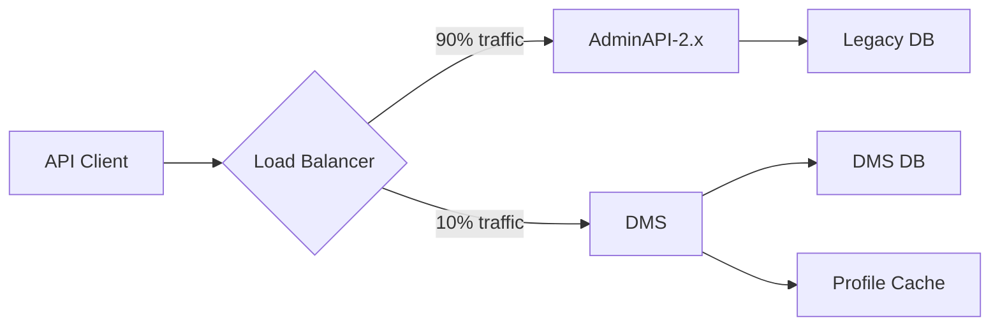

# API Profiles Migration Guide

## Overview

This guide provides detailed instructions for migrating API Profiles from AdminAPI-2.x to the Ed-Fi Data Management Service (DMS). The migration process is designed to be straightforward, with full backward compatibility for existing profile XML documents.

## Table of Contents

1. [Pre-Migration Assessment](#pre-migration-assessment)
2. [Compatibility Matrix](#compatibility-matrix)
3. [Migration Steps](#migration-steps)
4. [Validation and Testing](#validation-and-testing)
5. [Common Migration Scenarios](#common-migration-scenarios)
6. [Troubleshooting](#troubleshooting)
7. [Rollback Plan](#rollback-plan)

## Pre-Migration Assessment

### Step 1: Inventory Existing Profiles

Create a complete inventory of all profiles currently in use:

```bash
# List all profile XML files
find /path/to/adminapi/profiles -name "*.xml" -type f > profile-inventory.txt

# Document profile usage
cat profile-inventory.txt
```

Create a spreadsheet documenting:

| Profile Name | XML File | Resources | Used By | Last Modified |
|-------------|----------|-----------|---------|---------------|
| Student-ReadOnly | student-ro.xml | Student | Reporting System | 2024-06-15 |
| Assessment-Limited | assess-lim.xml | StudentAssessment | Vendor XYZ | 2024-03-20 |

### Step 2: Identify Profile Dependencies

Document which API consumers use which profiles:

```sql
-- Example query for AdminAPI-2.x database
SELECT 
  c.ClientName,
  p.ProfileName,
  c.LastUsedDate
FROM ApiClients c
JOIN ClientProfiles cp ON c.ClientId = cp.ClientId
JOIN Profiles p ON cp.ProfileId = p.ProfileId
ORDER BY c.ClientName;
```

### Step 3: Review Profile Complexity

Categorize profiles by complexity:

- **Simple**: Single resource, <10 rules, no nested collections
- **Moderate**: Multiple resources, 10-50 rules, some nested collections
- **Complex**: Multiple resources, >50 rules, deeply nested collections

This helps prioritize migration order (simple first).

### Step 4: Backup Current Configuration

```bash
# Backup profile XML files
tar -czf profiles-backup-$(date +%Y%m%d).tar.gz /path/to/adminapi/profiles/

# Backup AdminAPI database (if applicable)
pg_dump adminapi_db > adminapi_backup_$(date +%Y%m%d).sql

# Store backups securely
aws s3 cp profiles-backup-*.tar.gz s3://your-backup-bucket/
```

## Compatibility Matrix

### Supported Features

| Feature | AdminAPI-2.x | DMS | Migration Required |
|---------|--------------|-----|-------------------|
| XML Profile Format | ✅ | ✅ | No |
| IncludeOnly Member Selection | ✅ | ✅ | No |
| ExcludeOnly Member Selection | ✅ | ✅ | No |
| Property Rules | ✅ | ✅ | No |
| Collection Rules | ✅ | ✅ | No |
| Reference Rules | ✅ | ✅ | No |
| Nested Collections | ✅ | ✅ | No |
| Profile via HTTP Headers | ✅ | ✅ | No |
| Multiple Resources per Profile | ✅ | ✅ | No |

### Key Differences

| Aspect | AdminAPI-2.x | DMS | Impact |
|--------|--------------|-----|--------|
| Storage | File-based | Database-backed | Performance improvement |
| Management | Manual file editing | API + UI | Easier management |
| Caching | Application memory | Distributed cache | Better scalability |
| Validation | Runtime | Import-time + Runtime | Earlier error detection |
| Versioning | Git/file system | Database history | Audit trail |

### Unsupported/Deprecated Features

**None**. All AdminAPI-2.x profile features are supported in DMS.

## Migration Steps

### Phase 1: Setup DMS Environment (Days 1-2)

#### 1. Install DMS

Follow the standard DMS installation guide:

```bash
# Clone DMS repository
git clone https://github.com/Ed-Fi-Alliance-OSS/Data-Management-Service.git

# Setup using Docker Compose
cd Data-Management-Service/eng/docker-compose
docker compose up -d
```

#### 2. Configure Profile Feature

Enable profiles in DMS configuration:

```json
// appsettings.json or environment variables
{
  "Profiles": {
    "Enabled": true,
    "DefaultProfile": null,
    "CacheSettings": {
      "Enabled": true,
      "ExpirationMinutes": 15
    }
  }
}
```

#### 3. Verify DMS is Running

```bash
# Health check
curl http://localhost:8080/health

# Verify Management API access
curl -X GET \
  http://localhost:8080/management/v1/profiles \
  -H "Authorization: Bearer YOUR_TOKEN"
```

### Phase 2: Import Profiles (Days 3-5)

#### 1. Validate XML Files

Before importing, validate all XML files:

```bash
# Install xmllint if not available
sudo apt-get install libxml2-utils  # Ubuntu/Debian
brew install libxml2                 # macOS

# Validate each profile
for file in profiles/*.xml; do
  echo "Validating $file..."
  xmllint --noout "$file"
  if [ $? -eq 0 ]; then
    echo "  ✓ Valid"
  else
    echo "  ✗ Invalid - needs fixing"
  fi
done
```

#### 2. Import Profiles via API

Create an import script:

```bash
#!/bin/bash
# import-profiles.sh

DMS_URL="http://localhost:8080"
TOKEN="YOUR_ADMIN_TOKEN"
PROFILE_DIR="./profiles"

for profile in "$PROFILE_DIR"/*.xml; do
  filename=$(basename "$profile")
  echo "Importing $filename..."
  
  response=$(curl -s -w "\n%{http_code}" -X POST \
    "$DMS_URL/management/v1/profiles/import" \
    -H "Authorization: Bearer $TOKEN" \
    -F "file=@$profile")
  
  http_code=$(echo "$response" | tail -n1)
  body=$(echo "$response" | sed '$d')
  
  if [ "$http_code" -eq 200 ] || [ "$http_code" -eq 201 ]; then
    echo "  ✓ Successfully imported"
    echo "  Response: $body"
  else
    echo "  ✗ Failed with status $http_code"
    echo "  Error: $body"
  fi
  echo ""
done
```

Run the import:

```bash
chmod +x import-profiles.sh
./import-profiles.sh | tee import-log.txt
```

#### 3. Verify Import Success

```bash
# List all imported profiles
curl -X GET \
  http://localhost:8080/management/v1/profiles \
  -H "Authorization: Bearer YOUR_TOKEN" \
  | jq '.profiles[] | {name: .name, resource: .resourceName, active: .isActive}'

# Check specific profile details
curl -X GET \
  http://localhost:8080/management/v1/profiles/12345 \
  -H "Authorization: Bearer YOUR_TOKEN" \
  | jq .
```

### Phase 3: Configure API Clients (Days 6-8)

#### 1. Update Client Configuration

For each API client, update configuration to point to DMS:

```json
{
  "edfi": {
    "baseUrl": "http://your-dms-instance:8080",
    "oauthUrl": "http://your-dms-instance:8080/oauth/token",
    "clientId": "your_client_id",
    "clientSecret": "your_client_secret",
    "profile": "Student-ReadOnly"  // Add profile name
  }
}
```

#### 2. Update HTTP Client Code

**Before (AdminAPI-2.x)**:
```csharp
var request = new HttpRequestMessage(HttpMethod.Get, "/data/v3/ed-fi/students");
request.Headers.Accept.Add(
    new MediaTypeWithQualityHeaderValue("application/vnd.ed-fi.student.student-readonly.readable+json"));
```

**After (DMS)**:
```csharp
var request = new HttpRequestMessage(HttpMethod.Get, "/data/v5/ed-fi/students");
request.Headers.Accept.Add(
    new MediaTypeWithQualityHeaderValue("application/json"));
request.Headers.Accept.First().Parameters.Add(
    new NameValueHeaderValue("profile", "Student-ReadOnly"));
```

Or more simply:
```csharp
request.Headers.Accept.ParseAdd("application/json;profile=Student-ReadOnly");
```

#### 3. Test Client Applications

Test each client application in a test environment:

1. Configure client to use DMS test instance
2. Execute typical read operations
3. Execute typical write operations
4. Verify data filtering works as expected
5. Check error handling for invalid requests

### Phase 4: Parallel Testing (Days 9-14)

#### Run Both Systems Side-by-Side



#### 1. Route Test Traffic to DMS

Use a load balancer or feature flag to route a percentage of traffic:

```yaml
# Kong API Gateway example
- name: edfi-api-route
  paths:
    - /data
  plugins:
    - name: canary
      config:
        percentage: 10  # 10% to DMS
        upstream_host: dms-instance
```

#### 2. Compare Results

Create a comparison script:

```python
import requests
import json

ADMINAPI_URL = "http://adminapi/data/v3/ed-fi/students"
DMS_URL = "http://dms/data/v5/ed-fi/students"
PROFILE = "Student-ReadOnly"

# Get data from both systems
admin_response = requests.get(
    ADMINAPI_URL,
    headers={
        "Accept": "application/vnd.ed-fi.student.student-readonly.readable+json",
        "Authorization": f"Bearer {ADMIN_TOKEN}"
    }
)

dms_response = requests.get(
    DMS_URL,
    headers={
        "Accept": f"application/json;profile={PROFILE}",
        "Authorization": f"Bearer {DMS_TOKEN}"
    }
)

# Compare responses
admin_data = admin_response.json()
dms_data = dms_response.json()

# Check if same fields are present
admin_fields = set(admin_data[0].keys())
dms_fields = set(dms_data[0].keys())

print(f"Fields in AdminAPI only: {admin_fields - dms_fields}")
print(f"Fields in DMS only: {dms_fields - admin_fields}")
print(f"Common fields: {admin_fields & dms_fields}")
```

#### 3. Monitor Metrics

Compare key metrics:

| Metric | AdminAPI-2.x | DMS | Acceptable? |
|--------|--------------|-----|-------------|
| Response Time (p50) | 50ms | 55ms | ✅ |
| Response Time (p95) | 200ms | 180ms | ✅ |
| Error Rate | 0.1% | 0.1% | ✅ |
| Throughput | 1000 req/s | 1200 req/s | ✅ |

### Phase 5: Production Cutover (Day 15+)

#### 1. Schedule Maintenance Window

Announce maintenance window to all stakeholders:

```
MAINTENANCE NOTIFICATION

Service: Ed-Fi API
Date: [DATE]
Time: [TIME] to [TIME] (2-hour window)
Impact: API will be briefly unavailable during switchover
Action Required: None (automatic switchover)
```

#### 2. Execute Cutover

```bash
# 1. Stop AdminAPI-2.x (or put in read-only mode)
# 2. Verify DMS has all latest data
# 3. Update DNS/load balancer to point to DMS
# 4. Verify traffic is flowing to DMS
# 5. Monitor for errors

# Verification script
#!/bin/bash
while true; do
  response=$(curl -s -o /dev/null -w "%{http_code}" \
    http://api.edfi.org/health)
  
  if [ "$response" -eq 200 ]; then
    echo "$(date): DMS healthy"
  else
    echo "$(date): DMS unhealthy (Status: $response)"
    # Alert on-call team
  fi
  
  sleep 10
done
```

#### 3. Monitor Post-Cutover

Monitor closely for 24-48 hours:

- Response times
- Error rates
- Profile cache hit rates
- Database performance
- Client application logs

#### 4. Gradual Client Migration

If using both systems in parallel, gradually migrate clients:

**Week 1**: Internal applications (10%)  
**Week 2**: Low-risk external clients (30%)  
**Week 3**: Medium-risk clients (60%)  
**Week 4**: All remaining clients (100%)

## Validation and Testing

### Automated Test Suite

Create comprehensive tests:

```bash
# tests/profile-migration-tests.sh

#!/bin/bash
set -e

DMS_URL="http://localhost:8080"
TOKEN="YOUR_TOKEN"

echo "Testing Profile Migration..."

# Test 1: Profile exists
echo "Test 1: Verify profile imported"
profile_id=$(curl -s -X GET \
  "$DMS_URL/management/v1/profiles?name=Student-ReadOnly" \
  -H "Authorization: Bearer $TOKEN" \
  | jq -r '.profiles[0].id')

if [ -n "$profile_id" ] && [ "$profile_id" != "null" ]; then
  echo "  ✓ Profile exists (ID: $profile_id)"
else
  echo "  ✗ Profile not found"
  exit 1
fi

# Test 2: Profile filters response
echo "Test 2: Verify profile filtering"
full_response=$(curl -s -X GET \
  "$DMS_URL/data/v5/ed-fi/students/12345" \
  -H "Accept: application/json" \
  -H "Authorization: Bearer $TOKEN")

filtered_response=$(curl -s -X GET \
  "$DMS_URL/data/v5/ed-fi/students/12345" \
  -H "Accept: application/json;profile=Student-ReadOnly" \
  -H "Authorization: Bearer $TOKEN")

full_fields=$(echo "$full_response" | jq 'keys | length')
filtered_fields=$(echo "$filtered_response" | jq 'keys | length')

if [ "$filtered_fields" -lt "$full_fields" ]; then
  echo "  ✓ Profile filtering works (Full: $full_fields, Filtered: $filtered_fields)"
else
  echo "  ✗ Profile filtering not working"
  exit 1
fi

# Test 3: Write validation
echo "Test 3: Verify write validation"
invalid_write=$(curl -s -w "\n%{http_code}" -X POST \
  "$DMS_URL/data/v5/ed-fi/students" \
  -H "Content-Type: application/json;profile=Student-ReadOnly" \
  -H "Authorization: Bearer $TOKEN" \
  -d '{"studentUniqueId":"123","firstName":"Test","excludedField":"value"}')

http_code=$(echo "$invalid_write" | tail -n1)

if [ "$http_code" -eq 400 ]; then
  echo "  ✓ Write validation rejects excluded fields"
else
  echo "  ✗ Write validation not working (Expected 400, got $http_code)"
  exit 1
fi

echo ""
echo "All tests passed! ✓"
```

### Performance Benchmarks

```bash
# benchmark-profiles.sh

#!/bin/bash

DMS_URL="http://localhost:8080"
TOKEN="YOUR_TOKEN"
ITERATIONS=1000

echo "Benchmarking profile performance..."

# Without profile
echo "Without profile:"
time for i in $(seq 1 $ITERATIONS); do
  curl -s -X GET \
    "$DMS_URL/data/v5/ed-fi/students/12345" \
    -H "Accept: application/json" \
    -H "Authorization: Bearer $TOKEN" \
    > /dev/null
done

# With profile
echo "With profile:"
time for i in $(seq 1 $ITERATIONS); do
  curl -s -X GET \
    "$DMS_URL/data/v5/ed-fi/students/12345" \
    -H "Accept: application/json;profile=Student-ReadOnly" \
    -H "Authorization: Bearer $TOKEN" \
    > /dev/null
done
```

## Common Migration Scenarios

### Scenario 1: Simple Read-Only Profile

**AdminAPI-2.x XML** (no changes needed):
```xml
<Profile name="Student-ReadOnly">
  <Resource name="Student">
    <ReadContentType memberSelection="IncludeOnly">
      <Property name="StudentUniqueId" />
      <Property name="FirstName" />
      <Property name="LastSurname" />
    </ReadContentType>
  </Resource>
</Profile>
```

**Migration**: Direct import, no modifications required.

### Scenario 2: Complex Multi-Resource Profile

**AdminAPI-2.x XML** (no changes needed):
```xml
<Profile name="Reporting-Package">
  <Resource name="Student">
    <ReadContentType memberSelection="IncludeOnly">
      <!-- Student fields -->
    </ReadContentType>
  </Resource>
  <Resource name="StudentSchoolAssociation">
    <ReadContentType memberSelection="IncludeOnly">
      <!-- Association fields -->
    </ReadContentType>
  </Resource>
</Profile>
```

**Migration**: Direct import, handles multiple resources automatically.

### Scenario 3: Legacy Content-Type Headers

**AdminAPI-2.x Client Code**:
```
Accept: application/vnd.ed-fi.student.student-readonly.readable+json
```

**DMS Client Code** (update required):
```
Accept: application/json;profile=Student-ReadOnly
```

**Migration**: Update client code to use new header format.

## Troubleshooting

### Issue 1: Profile Import Fails

**Symptoms**: 400 Bad Request during import

**Causes**:
- Malformed XML
- Invalid element names
- Missing required attributes

**Solutions**:
```bash
# Validate XML syntax
xmllint --noout profile.xml

# Check for common issues
grep -n "memberSelection" profile.xml  # Verify attribute is present
grep -n "<Property" profile.xml        # Check for name attributes
```

### Issue 2: Profile Not Applied

**Symptoms**: Response includes all fields despite profile

**Causes**:
- Profile header format incorrect
- Profile not activated
- Cache not refreshed

**Solutions**:
```bash
# Verify profile status
curl -X GET \
  http://localhost:8080/management/v1/profiles/{id} \
  -H "Authorization: Bearer $TOKEN" \
  | jq '.isActive'

# Clear cache (if admin endpoint available)
curl -X POST \
  http://localhost:8080/management/v1/cache/clear \
  -H "Authorization: Bearer $TOKEN"

# Verify header format (no space before profile)
# ✓ Correct: application/json;profile=name
# ✗ Wrong:   application/json; profile=name
```

### Issue 3: Performance Degradation

**Symptoms**: Slower response times with profiles

**Causes**:
- Cache not enabled
- Complex nested collections
- Database query optimization needed

**Solutions**:
```json
// Optimize cache settings
{
  "Profiles": {
    "CacheSettings": {
      "Enabled": true,
      "ExpirationMinutes": 30,  // Increase if low change rate
      "PreloadProfiles": ["Student-ReadOnly", "Assessment-Limited"]
    }
  }
}
```

## Rollback Plan

### Quick Rollback (< 1 hour)

If critical issues arise immediately after cutover:

```bash
# 1. Switch DNS/load balancer back to AdminAPI-2.x
# 2. Verify AdminAPI-2.x is healthy
# 3. Announce rollback to stakeholders
# 4. Investigate DMS issues
```

### Data Consistency Check

After rollback:

```sql
-- Check for any writes that occurred during DMS operation
SELECT * FROM audit_log 
WHERE timestamp BETWEEN '[cutover_time]' AND '[rollback_time]';

-- Verify no data loss
SELECT COUNT(*) FROM students 
WHERE last_modified >= '[cutover_time]';
```

### Post-Rollback Actions

1. Analyze root cause of failure
2. Create fixes or workarounds
3. Re-test in staging environment
4. Schedule new cutover date
5. Document lessons learned

## Post-Migration Checklist

- [ ] All profiles imported successfully
- [ ] All API clients updated and tested
- [ ] Performance metrics within acceptable range
- [ ] No increase in error rates
- [ ] Profile cache hit rate >90%
- [ ] Monitoring and alerting configured
- [ ] AdminAPI-2.x decommission plan documented
- [ ] Team trained on DMS profile management
- [ ] Documentation updated
- [ ] Stakeholders notified of successful migration

## Support and Resources

- **DMS Documentation**: [https://github.com/Ed-Fi-Alliance-OSS/Data-Management-Service/docs](https://github.com/Ed-Fi-Alliance-OSS/Data-Management-Service/docs)
- **API Profiles Design**: [API-PROFILES-DESIGN.md](./API-PROFILES-DESIGN.md)
- **Quick Start Guide**: [API-PROFILES-QUICKSTART.md](./API-PROFILES-QUICKSTART.md)
- **Ed-Fi Community**: [https://www.ed-fi.org/community/](https://www.ed-fi.org/community/)
- **Technical Support**: support@ed-fi.org

---

**Last Updated**: 2025-12-09  
**Document Version**: 1.0
