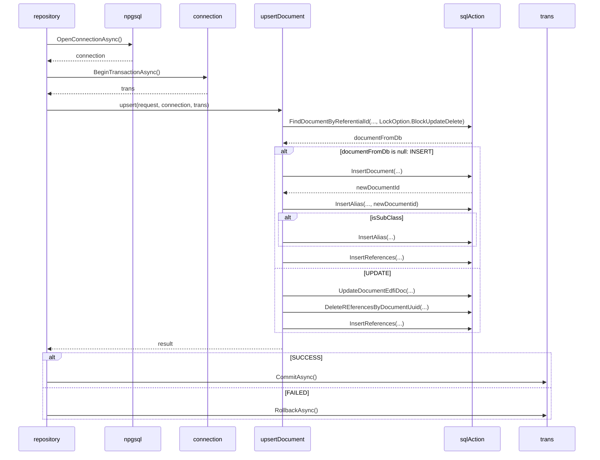

# September 2024 Deadlock Analysis

Bulk upload of a large set of sample XML files has been consistently failing
with deadlocks when it hits the `StudentSectionAttendanceEvent` files. What can
we do to reduce these deadlocks? The following sequence diagram is for the
Upsert process.

After we have locked the existing record, we have up to three different SQL
statements. All of these statements take some time, and each one is separately
issued from the DMS. That means there is a small amount of overhead with
multiple calls to the database. We may be able to tune this through batching
some commands (that is, send multiple SQL statements to the server at the same
time) or by switching to a stored procedure.

Furthermore, there may be a problem with the way we are handling database
retries: that is, we might not be properly retrying the transaction after the
initial deadlock.
