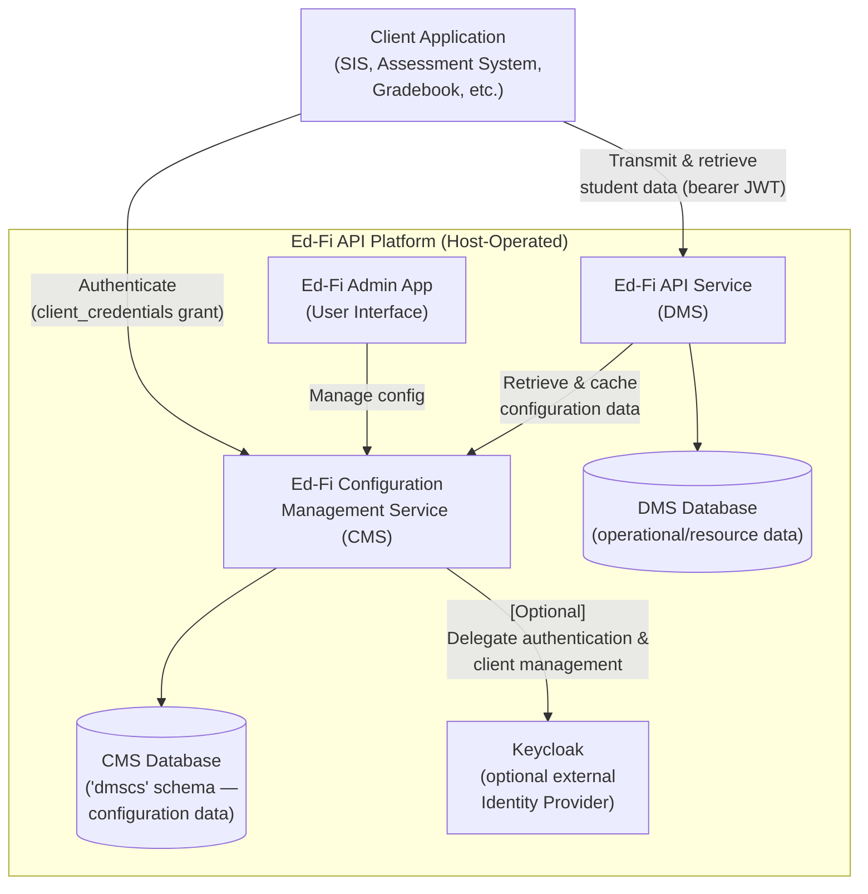

# Product Requirements Document: Ed-Fi Configuration Management Service (CMS) v8.0

> **Status**: Published - describes platform capabilities as implemented in Ed-Fi
> API v8.0 \
> **Owner**: Stephen Fuqua \
> **Product**: Ed-Fi Configuration Management Service (CMS) \
> **Repository**: `Ed-Fi-Alliance-OSS/Data-Management-Service` (`src/config`) \
> **Jira Project**: `DMS`

## 1. Product Overview

The Ed-Fi Configuration Management Service (CMS) is the administrative control
plane for the Ed-Fi API v8 platform. It exists so platform hosts can
administer vendors, applications, API client credentials, claim sets,
Profiles, and data store (database instance) routing for the Ed-Fi API
service ("DMS") programmatically and without direct database access to
the CMS configuration database —
continuing the role the ODS Admin API played for the prior-generation ODS/API
platform, but as a purpose-built companion service for DMS rather than a
retrofit.

CMS exposes **only version 3 routes of the Ed-Fi Management API specification**.
Unlike the ODS Admin API, which supports three specification generations
(v1/v2/v3, corresponding to ODS/API 6.x and 7.x compatibility modes), CMS has
no legacy compatibility burden: DMS is a ground-up rewrite, so CMS ships a
single, current API surface from the start. The `AppSettings:SpecificationVersion`
value is reported in discovery metadata, but v8.0 does not use it to map
alternate v1 or v2 route sets. This PRD — in combination with the
Ed-Fi Alliance API Design Guidelines — implicitly serves as the requirements
for the v3 Ed-Fi Management API as CMS implements it.

The most significant architectural difference from the ODS Admin API is that
**CMS is also the OAuth 2.0 identity provider for the platform**, not only for
its own administrative clients. A single CMS deployment issues, validates, and
revokes access tokens both for administrative/automation clients that manage
CMS itself and for the vendor/integrator API clients that call the DMS
resource API to read and write student data. CMS supports this either through
a bundled, self-contained OAuth 2.0 server (OpenIddict) or by delegating to an
external Keycloak realm — making the identity-provider role itself an optional,
host-configurable capability rather than a fixed dependency.

CMS owns a dedicated configuration database (the `dmscs` schema), entirely
separate from the DMS operational/resource database. DMS is a client of CMS:
it retrieves and caches configuration data (credentials, tenant/environment
routing, Profile assignments, and authorization metadata) needed to authorize
and route incoming resource-API requests, and it validates bearer tokens
statelessly (via JWKS) rather than calling back to CMS on every request.

### 1.1 Strategic Alignment

- **Separation of concerns.** Splitting administrative/configuration data from
  operational/resource data — codified as NFR-ARCH-1/NFR-ARCH-2 in the DMS
  v8.0 companion PRD — lets each service scale, deploy, and evolve
  independently, and keeps DMS free of an external cache dependency
  (NFR-ARCH-3).
- **A clean v3-only surface.** Because DMS has no installed base running
  ODS/API 6.x or 7.x, CMS does not need to carry forward the ODS Admin API's
  v1/v2 compatibility modes or their API-mode switching logic. This keeps the
  API surface, request/response contracts, and error handling internally
  consistent from day one, at the cost of not being a drop-in replacement for
  Admin API clients (see §6).
- **Identity provider flexibility.** Hosts vary in their identity
  infrastructure maturity: some want a working OAuth server with zero external
  dependencies (self-contained/OpenIddict), while others need to integrate
  with an existing enterprise identity stack for single sign-on and
  centralized credential governance (Keycloak). Making CMS's identity-provider
  role itself swappable serves both without forking the product.
- **Ecosystem continuity.** CMS's data model and endpoint shapes are
  deliberately close to the ODS Admin API's (vendors, applications, API
  clients, claim sets, Profiles, data stores) so that administrative tooling
  and operational know-how built around the Ed-Fi Management API concept
  carries forward, even though the two implementations are not
  wire-compatible (see the CMS/Admin API gap analysis referenced in §6).

### 1.2 Target Users and Personas

Reused from the ODS Admin API PRD, since CMS serves the same administrative
audience for the DMS platform:

#### Platform Host System Administrator

Deploys CMS into Docker or hosted environments; configures the database
engine, identity-provider mode (self-contained vs. Keycloak), connection
strings, encryption keys, logging, and multi-tenancy settings. Configures
vendors, applications, API clients, claim sets, Profiles, and data stores
needed to operate a DMS deployment.

#### Security Administrator

Reviews and modifies claim sets and claim-set resource-claim-action
associations through CMS, directly or through an administrative UI backed by
CMS.

#### Developer / Integration Engineer

Uses CMS's OpenAPI metadata, `.http` request examples, and integration tests
to validate API behavior. Registers automation clients against CMS to script
environment setup (vendors, applications, data stores, tenants).

#### API Client Developer (Vendor/Integrator)

Does not call CMS's administrative endpoints directly, but depends on it
indirectly: the `client_id`/`client_secret` used to call the DMS resource API
is issued by CMS, and the access token used against DMS is obtained from
CMS's token endpoint.

### 1.3 Jobs to Be Done

#### JTBD 1: Issue Credentials

**Personas**: Platform Host System Administrator, Developer

**When** supporting a new application integration to a DMS deployment, \
**I want** to perform CRUD operations for Vendors, Applications, and one or
more API Client credential sets per Application, \
**so that** I can distribute OAuth credentials ("key and secret") to the
vendor without treating the Application record itself as a credential.

**How CMS Helps**: Exposes REST endpoints for the full CRUD lifecycle of
vendors, applications, and API clients. An Application may have more than one
associated ApiClient/credential set, so a vendor's key/secret can be rotated,
deactivated, or reissued without disturbing the parent Application record
(FR-VENDOR-1, FR-APP-1, FR-APP-5, FR-CLIENT-1).

#### JTBD 2: Bootstrap and Register Administrative Automation Clients

**Personas**: Platform Host System Administrator, Developer

**When** standing up a new CMS deployment, \
**I want** to choose an identity-provider mode and register an initial
administrative API client, \
**so that** automation — including an administrative UI — can obtain tokens
and call protected CMS endpoints.

**How CMS Helps**: Supports OAuth 2.0 client-credentials token issuance
(`POST /connect/token`) and, in self-contained mode, self-registration
(`POST /connect/register`), gated by a configurable allow-registration flag so
open registration can be disabled after initial bootstrap (FR-AUTH-2,
FR-AUTH-4).

#### JTBD 3: Configure Data Stores

**Personas**: Platform Host System Administrator, Developer

**When** launching a database instance ("data store") for a DMS deployment, \
**I want** to create and manage data store, data store context, and data
store derivative (read replica / snapshot) records, \
**so that** DMS can route requests to the correct database and API clients
can be associated with the data store(s) they are permitted to reach.

**How CMS Helps**: Provides CRUD endpoints for data stores, data store
contexts (route-qualifier key/value pairs used for context-based routing),
and data store derivatives, with connection strings encrypted at rest and
returned as encrypted ciphertext rather than plaintext (FR-DATASTORE-1 through
FR-DATASTORE-9).

#### JTBD 4: Manage Authorization

**Personas**: Security Administrator, Platform Host System Administrator

**When** I manage authorization for a deployment, \
**I want** to view and edit claim sets and their resource-claim-action
associations, and to browse the resource-claim hierarchy and its default
authorization strategies, \
**so that** access rules are visible and editable without direct database
access.

**How CMS Helps**: Exposes read/write endpoints for claim sets and read-only
endpoints for the resource-claim hierarchy, resource claim actions, and
default authorization-strategy assignments (FR-CLAIM-1 through FR-CLAIM-9).

#### JTBD 5: Transfer Claim Sets Between Environments

**Personas**: Platform Host System Administrator

**When** I have a claim set configured correctly in one environment, \
**I want** to export it and import it into another environment, \
**so that** I can avoid manually reconfiguring authorization and reduce the
risk of transcription errors.

**How CMS Helps**: `GET /v3/claimSets/{id}/export` and
`POST /v3/claimSets/import` use a flat, claim-URI-addressed payload — rather
than the ODS Admin API's nested, database-ID-addressed shape — so that import
is a linear, additive operation that does not depend on matching internal IDs
between environments (FR-CLAIM-8, FR-CLAIM-9).

#### JTBD 6: Isolate Multi-Tenant Administration

**Personas**: Platform Host System Administrator

**When** I operate a multi-tenant deployment, \
**I want** tenant-aware requests to resolve the correct partition of
configuration data, \
**so that** each tenant's vendors, applications, data stores, and claim sets
stay organized per tenant.

**How CMS Helps**: Resolves tenant context from the `Tenant` request header
and partitions configuration data accordingly (FR-TENANT-1 through
FR-TENANT-5). This is a **data-routing mechanism, not a security boundary** —
see FR-TENANT-4 and NFR-SEC-6.

#### JTBD 7: Troubleshoot Operational Issues

**Personas**: Platform Host System Administrator, Developer

**When** I troubleshoot the service, \
**I want** health checks, structured error responses, and enough log context
to correlate a failure with a request, \
**so that** operational failures can be diagnosed quickly.

**How CMS Helps**: Exposes a health endpoint, correlates Ed-Fi-style errors with
`HttpContext.TraceIdentifier`, and returns business-endpoint and global-exception
failures in an Ed-Fi Problem Details shape, with the known exceptions documented
in FR-ERROR-1 (FR-ERROR-1 through FR-ERROR-5).

#### JTBD 8: Upgrade Between CMS Versions

**Personas**: Platform Host System Administrator, Developer

**When** I upgrade a CMS deployment, \
**I want** predictable container image replacement and documented migration
steps, \
**so that** upgrades do not require undocumented manual data-migration steps.

**How CMS Helps**: Ships as an OCI-compliant container image with documented
schema-rename/migration notes for pre-release breaking changes (see
NFR-COMPAT-4).

#### JTBD 9: Authenticate DMS API Clients (New — no ODS Admin API equivalent)

**Personas**: API Client Developer (Vendor/Integrator), Platform Host System
Administrator

**When** a vendor or integrator application needs to call the DMS resource
API, \
**I want** to obtain an access token from CMS using the `client_id` and
`client_secret` CMS issued when its Application/ApiClient was created, \
**so that** a single identity provider governs both administrative access to
CMS and resource-API access to DMS, without a separate credential system.

**How CMS Helps**: CMS's token endpoint (`POST /connect/token`) is the sole
source of access tokens for DMS resource-API clients as well as for CMS's own
administrative clients. DMS never calls CMS synchronously to validate a
token — it validates the bearer JWT statelessly via JWKS and retrieves the
associated authorization context (claim set, education organizations,
namespaces, data store access) from cached configuration it previously
fetched from CMS (see FR-AUTH-7 and FR-INTEGRATION-3). This job has no
counterpart in the ODS Admin API, which issued tokens only for its own
administrative endpoints.

#### JTBD 10: Discover Tenant and Version Information

**Personas**: Platform Host System Administrator, Developer

**When** integrating with or operating a CMS deployment, \
**I want** to discover whether the deployment runs in multi-tenant mode and
which Management API specification version is active, \
**so that** I can configure my tooling correctly.

**How CMS Helps**: The discovery endpoint reports application name, version,
build metadata, the discovery/OpenAPI metadata URL, and the configured
Management API specification version (FR-VERSION-2). Multi-tenancy status
reporting is deferred to v8.1.

#### Deferred Jobs

Database instance provisioning, education organization synchronization,
asynchronous job tracking, rate limiting, dependency-aware health checks,
full non-success error-response conformance, application-profile lookup by
application, and OpenAPI disablement are deferred to the v8.1 planning
document: [CMS v8.1 Deferred Requirements](./PRD-CMS-v8.1.md).

## 2. Enterprise Architecture

CMS sits between administrators, automation clients, optional administrative
UI clients, DMS, and its own configuration database. Unlike the ODS Admin
API — which read and wrote the ODS/API's own `EdFi_Admin` and `EdFi_Security`
databases — CMS owns a dedicated configuration database and schema (`dmscs`)
that DMS never writes to directly.

External systems and dependencies:

- **Ed-Fi API service (DMS)**: the downstream consumer of CMS's
  configuration. DMS retrieves and caches vendor/application/API-client
  data-store associations, tenant/route-context configuration, Profile
  definitions, and authorization metadata (claim sets, resource claims,
  default authorization strategies) via the Ed-Fi Management API v3
  specification. DMS validates bearer tokens statelessly (via JWKS); it does
  not call CMS synchronously per resource-API request.
- **CMS database (`dmscs` schema)**: stores Vendor, Application, ApiClient,
  DataStore, DataStoreContext, DataStoreDerivative, ClaimSet, Profile,
  ResourceClaim, ClaimsHierarchy, and (in self-contained identity-provider
  mode) OpenIddict token/client tables. Supports PostgreSQL and Microsoft SQL
  Server.
- **Keycloak (optional)**: an external OAuth 2.0/OIDC provider. When
  configured, CMS validates tokens against Keycloak instead of issuing them
  itself, and client credential management is delegated to Keycloak's admin
  API.
- **Administrative UI (e.g., Ed-Fi Admin App)**: manages configuration
  (credentials, claim sets, Profiles, tenants, data stores) through CMS's
  Management API v3 surface.

## 3. Functional Requirements

### 3.1 API Versioning and Discovery

- **FR-VERSION-1**: CMS SHALL implement only the v3 Ed-Fi Management API
  specification. It SHALL NOT expose v1 or v2 routes, and SHALL NOT implement
  ODS/API 6.x- or 7.x-specific compatibility behavior.
- **FR-VERSION-2**: CMS SHALL expose an anonymous `GET /` discovery endpoint
  returning, at minimum, the application name, semantic version, an
  informational/release-candidate label, and the discoverable OpenAPI
  metadata URL.
- **FR-VERSION-3**: CMS SHALL generate an OpenAPI/Swagger description of its
  API surface, served at `/metadata/specifications`, with the generated raw
  OpenAPI document also available at `/openapi/v1.json`.

### 3.2 Identity Provider and Authentication

- **FR-AUTH-1**: CMS SHALL support two configurable identity-provider modes,
  selected at deployment time: **self-contained** (a bundled OAuth 2.0 server
  implemented with OpenIddict) and **keycloak** (token validation and client
  management delegated to an externally hosted Keycloak realm).
- **FR-AUTH-2**: CMS SHALL expose OAuth 2.0 client-credentials token issuance
  through `POST /connect/token`. In self-contained mode, this endpoint SHALL
  additionally accept client credentials via HTTP Basic authentication, not
  only in the form body.
- **FR-AUTH-3**: CMS SHALL expose a token introspection endpoint
  (`POST /connect/introspect`, RFC 7662) and a token revocation endpoint
  (`POST /connect/revoke`, RFC 7009).
- **FR-AUTH-4**: CMS SHALL expose self-contained client registration through
  `POST /connect/register`, gated by a configurable allow-registration
  setting; when registration is disabled, the endpoint SHALL return `403
  Forbidden`.
- **FR-AUTH-5**: A client registered through `POST /connect/register` SHALL
  be assigned the `edfi_admin_api/full_access` scope and the deployment's
  configured administrative role by default.
- **FR-AUTH-6**: CMS SHALL support at least three scopes: full read/write
  access to all endpoints (`edfi_admin_api/full_access`), read-only access to
  all `GET` endpoints (`edfi_admin_api/readonly_access`), and limited read-only
  access for DMS/internal metadata lookups
  (`edfi_admin_api/authMetadata_readonly_access`). The read-only
  scope SHALL be accepted by the authorization-metadata endpoint, claim-set list
  endpoint, and API-client list/lookup endpoints.
- **FR-AUTH-7**: CMS SHALL serve as the OAuth 2.0 identity provider for both
  (a) its own administrative/automation clients and (b) the vendor/API
  clients that call the DMS resource API. A DMS API client's `client_id` and
  `client_secret` SHALL be generated by CMS at the time its Application and
  ApiClient records are created, and the same `POST /connect/token` endpoint
  SHALL issue access tokens for both categories of client.
- **FR-AUTH-8**: When operating in `keycloak` mode, CMS SHALL delegate
  authentication and client-credential management to the configured Keycloak
  realm rather than persisting credential or token state itself.
- **FR-AUTH-9**: Client secrets SHALL NOT be retrievable in plaintext after
  initial issuance or after a reset: in self-contained mode secrets are
  hashed at rest, and in Keycloak mode secret storage and retrieval are
  governed entirely by Keycloak.
- **FR-AUTH-10**: Endpoint authorization SHALL be enforced per HTTP method:
  `GET` endpoints SHALL accept either `full_access` or `readonly_access`;
  `POST`, `PUT`, and `DELETE` endpoints SHALL require `full_access`; the
  authorization-metadata endpoint, claim-set list endpoint, and API-client
  list/lookup endpoints SHALL accept any of the three defined scopes; and
  health, discovery, metadata, OAuth `/connect/*`, and self-contained OIDC
  discovery/JWKS endpoints SHALL remain anonymous.

### 3.3 Vendor Management

- **FR-VENDOR-1**: CMS SHALL allow authorized clients to list, retrieve,
  create, update, and delete vendors.
- **FR-VENDOR-2**: Vendor records SHALL include company name, namespace
  prefixes, contact name, and contact email address.
- **FR-VENDOR-3**: Vendor namespace prefixes SHALL support multiple
  comma-separated values, with whitespace trimmed and empty prefixes ignored.
- **FR-VENDOR-4**: Deleting a vendor SHALL remove its associated applications
  and their API clients.

### 3.4 Application Management

- **FR-APP-1**: CMS SHALL allow authorized clients to list, retrieve, create,
  update, and delete applications. An Application SHALL be a distinct record
  from its associated credentials: an Application MAY have one or more
  ApiClient credential sets, rather than treating the Application itself as a
  single credential.
- **FR-APP-2**: Creating an application SHALL require an application name,
  vendor ID, and claim set name. Education organization IDs, Profile IDs,
  and data store IDs MAY be supplied.
- **FR-APP-3**: Creating an application SHALL validate that the referenced
  vendor ID exists and that any supplied Profile IDs and data store IDs exist.
- **FR-APP-4**: Creating an application SHALL create an associated ApiClient
  and return the generated `client_id`/`client_secret` pair in the creation
  response.
- **FR-APP-5**: Updating an application SHALL support changes to name, claim
  set, vendor, Profile IDs, education organization IDs, and data store IDs.
  Credential approval is managed on ApiClient records.
- **FR-APP-6**: Deleting an application SHALL remove its associated API
  clients and data-store associations while preserving referenced Profile
  records.

### 3.5 API Client (Credential) Management

- **FR-CLIENT-1**: CMS SHALL allow authorized clients to list, retrieve by
  `client_id`, create, update, delete, and reset credentials for individual
  ApiClient records, independent of the parent Application, so that
  credential rotation does not require recreating the Application.
- **FR-CLIENT-2**: Creating an API client SHALL require a name, approval
  state, application ID, and at least one associated data store ID.
- **FR-CLIENT-3**: Creating or updating an API client SHALL validate that the
  referenced application ID and data store IDs exist.
- **FR-CLIENT-4**: Resetting an API client's credentials SHALL preserve the
  existing `client_id` and generate a new secret.
- **FR-CLIENT-5**: Each ApiClient SHALL carry a globally unique client
  identifier (`ClientUuid`) in addition to its administrative primary key, so
  API clients can be referenced independently of the CMS database's internal
  IDs.

### 3.6 Data Store, Context, and Derivative Management

- **FR-DATASTORE-1**: CMS SHALL allow authorized clients to list, retrieve,
  create, update, and delete data store records (the CMS v3 term for what the
  ODS Admin API calls an "ODS instance").
- **FR-DATASTORE-2**: Data store records SHALL include a name, a required
  data store type, and an optional connection string.
- **FR-DATASTORE-3**: Data store connection strings SHALL be encrypted at
  rest (AES). A `GET` of a data store SHALL return the connection string as
  base64-encoded encrypted ciphertext, not the plaintext value submitted. A
  `PUT` writes the request body's `connectionString` value; omitting
  or sending `null` does not preserve the previous value.
- **FR-DATASTORE-4**: CMS SHALL allow authorized clients to manage data store
  contexts — key/value pairs (for example, school year or district ID) used
  by DMS for context-based routing.
- **FR-DATASTORE-5**: A data store context SHALL require a data store ID, a
  context key, and a context value, and uniqueness SHALL be enforced on the
  combination of data store ID and context key.
- **FR-DATASTORE-6**: CMS SHALL allow authorized clients to manage data store
  derivatives — alternate connections associated with a parent data store,
  such as read replicas or point-in-time snapshots.
- **FR-DATASTORE-7**: A data store derivative's type SHALL be restricted to a
  fixed set of supported values (at minimum, "ReadReplica" and "Snapshot"),
  and uniqueness SHALL be enforced on the combination of data store ID and
  derivative type, so a data store has at most one derivative of each type.
- **FR-DATASTORE-8**: Deleting a data store SHALL cascade-delete its
  associated data store contexts and derivatives.
- **FR-DATASTORE-9**: An API client SHALL be associable with one or more data
  stores, so a client may be scoped to a single fixed data store or to
  several (for context-based routing scenarios).

### 3.7 Profiles

- **FR-PROFILE-1**: CMS SHALL allow authorized clients to list, retrieve,
  create, update, and delete Profiles.
- **FR-PROFILE-2**: Profile records SHALL include a name and an XML profile
  definition compatible with the Ed-Fi Profiles content-filter format.
- **FR-PROFILE-3**: CMS SHALL validate a submitted Profile definition (e.g.,
  that the definition's declared name matches the record name) at
  create/update time.
- **FR-PROFILE-4**: Deleting an application SHALL NOT delete Profile records
  it references. Profile assignment is represented by the Application
  `profileIds` field.

### 3.8 Claim Sets and Authorization Metadata

- **FR-CLAIM-1**: CMS SHALL allow authorized clients to list, retrieve,
  create, update, delete, copy, export, and import claim sets.
- **FR-CLAIM-2**: Claim set creation SHALL store the claim set name and a
  system-reserved flag distinguishing Ed-Fi-provided default claim sets from
  host-defined ones.
- **FR-CLAIM-3**: CMS SHALL reject requests to create, copy, edit, or import
  a claim set whose name contains whitespace.
- **FR-CLAIM-4**: CMS SHALL allow authorized clients to add, update, and
  delete resource-claim-action associations (including per-action
  authorization-strategy overrides) on a claim set.
- **FR-CLAIM-5**: `GET /v3/claimSets/{id}` and `GET
  /v3/claimSets/{id}/export` SHALL return the same payload: a flat list of
  configured resource-claim nodes (not the full expanded leaf hierarchy),
  each identified by its full claim URI and, where applicable, a
  `parentClaimName`, together with its enabled actions, its default
  authorization strategies (read-only context), and any claim-set-specific
  authorization-strategy overrides.
- **FR-CLAIM-6**: `POST /v3/claimSets/import` SHALL accept the same flat
  payload shape as export. For each entry, CMS SHALL upsert the claim set's
  action and authorization-strategy-override configuration at the matching
  hierarchy node (matched by claim URI); a claim URI not found in the stored
  hierarchy SHALL be reported as a non-fatal warning rather than aborting the
  entire import, and import SHALL be additive — it SHALL NOT remove
  configuration for other claim sets at the same node.
- **FR-CLAIM-7**: CMS SHALL expose read-only endpoints for the resource-claim
  hierarchy (`GET /v3/resourceClaims`, `GET /v3/resourceClaims/{id}`), for
  the actions available on each resource claim (`GET
  /v3/resourceClaimActions`), and for each resource claim's default
  authorization strategies per action (`GET
  /v3/resourceClaimActionAuthStrategies`). These endpoints SHALL be read-only
  projections over the stored claims hierarchy and resource-claim metadata;
  no write endpoints SHALL be added for this data.
- **FR-CLAIM-8**: The resource-claim read endpoints SHALL support the same
  general query parameters (`limit`, `offset`, `orderBy`, `direction`) and
  endpoint-specific filters used elsewhere in CMS's query pattern, rather
  than introducing feature-specific paging or filtering logic.
- **FR-CLAIM-9**: CMS SHALL expose an authorization-metadata endpoint (`GET
  /v3/authorizationMetadata`) that DMS retrieves and caches to resolve, for a
  given claim set, the resource claims, actions, and default/overridden
  authorization strategies it grants — accessible via any of the three
  defined scopes, including the metadata-only scope
  (`edfi_admin_api/authMetadata_readonly_access`).

### 3.9 Tenants and Multi-Tenancy

- **FR-TENANT-1**: CMS SHALL support both single-tenant mode (default) and
  multi-tenant mode.
- **FR-TENANT-2**: In multi-tenant mode, CMS SHALL resolve which tenant's
  configuration data a request operates on from the `Tenant` request header.
- **FR-TENANT-3**: Tenant identifiers SHALL be restricted to alphanumeric
  characters, hyphens, and underscores, up to a configured maximum length.
- **FR-TENANT-4**: The `Tenant` header SHALL be treated strictly as a data
  routing mechanism, not an access-control mechanism: CMS access tokens SHALL
  carry no tenant claim, and CMS SHALL NOT validate the header's value
  against the caller's identity. A client holding `full_access` or
  `readonly_access` therefore has that level of access to every tenant's
  configuration in the deployment.
- **FR-TENANT-5**: CMS SHALL allow authorized clients to list, retrieve, and
  create tenants when multi-tenancy is enabled. Tenant records contain an ID
  and name; the application partitions rows by tenant in the configured CMS
  database rather than storing per-tenant configuration-database connection
  details.
- **FR-TENANT-6**: In multi-tenant mode, CMS-issued API-client credentials
  used against the DMS resource API SHALL remain scoped to the data store(s)
  associated with the tenant/application under which they were created, even
  though the CMS management credential that created them is not itself
  tenant-restricted (see NFR-SEC-6 for the resulting host guidance).

### 3.10 Sorting, Filtering, and Pagination

- **FR-QUERY-1**: Collection endpoints that support paging SHALL accept
  `offset` and `limit` query parameters.
- **FR-QUERY-2**: Collection endpoints that support sorting SHALL accept
  `orderBy` (restricted to a documented allow-list of fields per endpoint)
  and `direction` (`asc`/`ascending` or `desc`/`descending`) query
  parameters.
- **FR-QUERY-3**: An unsupported `orderBy` value SHALL result in a `400 Bad
  Request` validation error rather than being silently ignored.
- **FR-QUERY-4**: Not every CMS collection endpoint supports the full
  sort/filter/paging parameter set that the ODS Admin API exposes; where
  unsupported, this SHALL be a documented, intentional gap rather than a
  silent inconsistency (see the known-limitations list in §6).

### 3.11 Error Handling and Responses

- **FR-ERROR-1**: CMS business endpoints and the global exception handler SHALL
  return Ed-Fi-style JSON error responses with `detail`, `type`, `title`,
  `status`, `correlationId`, `validationErrors` (an object, empty `{}` when
  there are none), and `errors` (an array, empty `[]` when there are none).
  OAuth/OIDC protocol errors, tenant-resolution middleware failures, dynamic
  claims-management endpoints, and some authorization failures are known
  exceptions and may return OAuth-standard or ad hoc shapes.
- **FR-ERROR-2**: For endpoints using the Ed-Fi-style error helpers, the
  body's `status` field SHALL equal the response's HTTP status code, and
  `correlationId` SHALL equal `HttpContext.TraceIdentifier`.
- **FR-ERROR-3**: Ed-Fi-style responses SHALL use the implemented
  `urn:ed-fi:api:*` taxonomy URI matching the failure category (for example,
  `urn:ed-fi:api:bad-request:data` for data validation,
  `urn:ed-fi:api:security:authentication` for 401,
  `urn:ed-fi:api:security:authorization` for 403,
  `urn:ed-fi:api:not-found` for 404, `urn:ed-fi:api:conflict:*` for 409,
  `urn:ed-fi:api:bad-gateway` for 502, and
  `urn:ed-fi:api:internal-server-error` for 500).
- **FR-ERROR-4**: CMS SHALL avoid leaking secrets or raw upstream identity
  provider internals from the main credential-management flows; identity
  provider errors during application/API-client creation and token exchange
  SHALL be mapped to safe client-facing responses.
- **FR-ERROR-5**: Duplicate identifying values SHALL return `409 Conflict`.

### 3.12 DMS Integration

- **FR-INTEGRATION-1**: DMS SHALL retrieve and cache, from CMS, the
  configuration information it needs to authorize and route resource-API
  requests: API client-to-data-store associations, tenant and route-context
  configuration, Profile assignments and definitions, and claim-set
  authorization metadata.
- **FR-INTEGRATION-2**: CMS SHALL NOT be a synchronous dependency of every
  DMS resource-API request; DMS's caching layer SHALL allow it to continue
  serving requests using previously fetched configuration if CMS is
  temporarily unavailable, subject to the cache's configured refresh
  interval.
- **FR-INTEGRATION-3**: DMS SHALL validate bearer access tokens statelessly
  (via JWKS published by whichever identity provider issued them — CMS's
  self-contained server or the configured Keycloak realm) rather than
  calling CMS synchronously to validate each token.
- **FR-INTEGRATION-4**: A credential revoked through CMS SHALL take effect
  against the DMS resource API only once the token's own expiration (or the
  data-API's configured validation clock skew) elapses; DMS's stateless
  validation model does not check revocation status on every request. Hosts
  requiring faster revocation SHOULD configure a shorter access-token
  lifetime.

### 3.13 Deferred Functional Requirements

Database instance provisioning, education organization synchronization,
asynchronous job tracking, and rate limiting are deferred to
[CMS v8.1 Deferred Requirements](./PRD-CMS-v8.1.md).

## 4. Non-Functional Requirements

### 4.1 Compatibility and Upgradeability

- **NFR-COMPAT-1**: CMS SHALL support both PostgreSQL and Microsoft SQL
  Server as its configuration-database engine.
- **NFR-COMPAT-2**: A given CMS feature MAY be supported on one database
  engine ahead of the other during incremental rollout; such gaps SHALL be
  documented rather than silently routed to the wrong backend.
- **NFR-COMPAT-3**: CMS SHALL be deployable via standard container tooling
  (OCI-compliant images), with reference Docker Compose configurations
  provided.
- **NFR-COMPAT-4**: Breaking changes to CMS's persisted schema or public
  contract during pre-release development SHALL be documented with explicit
  migration or recreation guidance for deployments upgrading from an earlier
  build.

### 4.2 Security and Privacy

- **NFR-SEC-1**: Protected CMS endpoints SHALL require a valid bearer access
  token, issued by whichever identity provider is configured (self-contained
  or Keycloak).
- **NFR-SEC-2**: Data-store connection strings SHALL be encrypted at rest
  (AES) in the CMS database.
- **NFR-SEC-3**: Client secrets SHALL be hashed at rest in self-contained
  mode; in Keycloak mode, secret storage is governed by Keycloak. In neither
  mode SHALL the original secret be retrievable from storage.
- **NFR-SEC-4**: OpenAPI metadata is exposed through the
  generated `/openapi/v1.json` document and the transformed
  `/metadata/specifications` endpoint. Independent production disablement is
  deferred to v8.1.
- **NFR-SEC-5**: Self-registration (`POST /connect/register`) SHALL be
  disabled after initial bootstrap in deployments that do not require open
  client self-registration.
- **NFR-SEC-6**: Because CMS scopes are not tenant-scoped (FR-TENANT-4),
  every CMS credential SHALL be treated as a platform-wide administrative
  credential. Hosts requiring a hard security boundary between tenants SHALL
  run a separate CMS deployment — with its own database and its own
  credentials — per boundary, rather than relying on the `Tenant` header for
  isolation. This is a documented host responsibility, not a gap CMS itself
  closes.
- **NFR-SEC-7**: This tenant-header caveat applies only to CMS's own
  administrative credentials. Vendor credentials that CMS issues *for the DMS
  resource API* are separately constrained at the DMS layer by claim set,
  education organization, namespace prefix, and data-store authorization —
  a CMS management credential's platform-wide reach does not itself grant a
  DMS API client platform-wide data access.

### 4.3 Reliability and Operations

- **NFR-REL-1**: CMS SHALL expose an anonymous `/health` liveness endpoint.
- **NFR-REL-2**: Invalid or missing required configuration (e.g., an
  unsupported database engine, an invalid identity-provider mode, or
  incomplete required settings) SHALL cause CMS to fail explicitly at startup
  or report invalid configuration through startup validation rather than
  exhibiting undefined behavior at request time.
- **NFR-REL-3**: CMS SHALL use a database schema (`dmscs`) dedicated to its
  own configuration objects, distinct from any schema used by DMS's
  operational data, even when a host chooses to colocate both databases in a
  single physical database instance.

### 4.4 Observability

- **NFR-OBS-1**: Ed-Fi-style non-success responses SHALL be traceable to a
  specific log entry via `correlationId` (`HttpContext.TraceIdentifier`).
- **NFR-OBS-2**: CMS SHALL produce structured, machine-readable operational
  logs.
- **NFR-OBS-3**: Logs related to failure classification SHALL avoid emitting
  sensitive values (secrets, tokens, raw database or configuration error
  text); such detail SHALL be logged server-side only when needed for
  diagnosis and never included in the client-facing response body.
- **NFR-OBS-4**: Unlike the DMS resource API, CMS's endpoints do not
  currently support a client-supplied Correlation ID; this is a known,
  documented asymmetry between the two services rather than an oversight.

### 4.5 Performance and Scalability

- **NFR-PERF-1**: Collection endpoints that support pagination SHALL avoid
  returning unbounded result sets when `limit`/`offset` are supplied.
- **NFR-PERF-2**: DMS's caching of CMS-sourced configuration (data-store
  routing, Profile definitions, authorization metadata) SHALL have a
  host-configurable refresh interval, so hosts can tune how quickly a CMS-side
  configuration change takes effect on DMS without needing to restart DMS.

### 4.6 Accessibility and Usability

- **NFR-UX-1**: CMS SHALL provide Swagger/OpenAPI metadata for its full API
  surface through `/openapi/v1.json` and `/metadata/specifications`.
- **NFR-UX-2**: Error responses SHALL be actionable: validation failures
  SHALL identify the offending field(s) via `validationErrors`, and
  not-found/conflict responses SHALL identify the resource or constraint
  involved via `detail`, without leaking implementation detail.
- **NFR-UX-3**: `.http` request-example files and OpenAPI documentation
  SHALL remain aligned with current endpoint routes, payload shapes, and
  authentication requirements as the API evolves (see the naming-migration
  note in §6 regarding the `dataStore*` rename).

### 4.7 Software Development Lifecycle

- **NFR-SDLC-1**: CMS SHALL maintain consistent code formatting and linting
  (CSharpier and equivalent tooling).
- **NFR-SDLC-2**: CMS SHALL maintain automated unit and integration test
  coverage for its business logic, including both database engines where a
  feature supports both.
- **NFR-SDLC-3**: CMS SHALL be shipped in OCI-compliant container images as
  part of the DMS platform's build and release pipeline.
- **NFR-SDLC-4**: Design and specification documents for non-trivial CMS
  changes (error-response conformance, claim-set export/import format,
  resource-claim endpoint parity, etc.) SHALL be recorded under
  `reference/design/configuration-service/` so implementation intent remains
  traceable independent of this PRD.

## 5. System Architecture

- **CMS frontend** (`EdFi.DmsConfigurationService.Frontend.AspNetCore`):
  hosts the Management API v3 REST surface, OAuth/OIDC endpoints, and request
  pipeline (tenant resolution, authentication, authorization, error shaping).
  It is an ASP.NET Core minimal-API application.
- **CMS backend (PostgreSQL / SQL Server providers)**: implements the
  `dmscs`-schema repositories for Vendor, Application, ApiClient, DataStore,
  DataStoreContext, DataStoreDerivative, ClaimSet, Profile, and ResourceClaim
  data behind a shared repository interface.
- **Self-contained identity provider (OpenIddict)**: issues, validates,
  introspects, and revokes OAuth 2.0 tokens; stores hashed client secrets and
  token records.
- **Keycloak (optional, external)**: alternative identity provider that owns
  client credential storage, token issuance, and token/session housekeeping.
  CMS proxies authentication and client-management calls to Keycloak in this
  mode.
- **CMS configuration database (`dmscs` schema)**: system of record for all
  CMS-managed configuration. It may be colocated in the same physical database
  instance as DMS's operational data, but remains a logically distinct schema.
- **Ed-Fi API service (DMS)**: consumes CMS's Management API v3 to retrieve
  and cache configuration; validates bearer tokens statelessly via JWKS. DMS is
  not part of this PRD's scope beyond the integration points in §3.12.
- **Administrative UI (e.g., Ed-Fi Admin App)**: human-facing client of CMS's
  Management API v3 for configuration management. This is out of scope for this
  PRD; documented as a consumer only.

## 6. Out of Scope and Known Limitations

- **OUT-1**: CMS does not implement Management API v1 or v2, and has no
  ODS/API 6.x- or 7.x-specific compatibility behavior. It is not a drop-in
  replacement for ODS Admin API clients; a documented gap analysis
  (`reference/DMS-1039/AdminApi-CMS GAP Analysis.md`) enumerates the
  route-naming (`odsInstance*` → `dataStore*`), payload-shape, status-code,
  and error-format differences between the two implementations as of this
  writing.
- **OUT-2**: CMS does not provision or mutate DMS operational/resource data;
  it manages administrative and security configuration only.
- **OUT-3**: Resource claims, resource claim actions, and default
  authorization-strategy assignments are exposed read-only (FR-CLAIM-7). CMS
  does not provide endpoints to create, seed, or maintain this metadata;
  seeding is a deployment/bootstrap concern outside this API surface.
- **OUT-4**: A richer, database-instance-provisioning workflow with
  templates and asynchronous job tracking, an education-organization
  synchronization cache, request rate limiting, dependency-aware health
  checks, full non-success error-response conformance, an
  application-profile lookup endpoint, token cleanup, and OpenAPI
  disablement are deferred to
  [CMS v8.1 Deferred Requirements](./PRD-CMS-v8.1.md).
- **OUT-5**: Client-secret expiration and scheduled rotation were researched
  in a design spike but are not implemented; today, secret rotation is a
  manual reset (`FR-CLIENT-4`) with no expiration date tracked or enforced.
- **OUT-6**: Tenant `/details` and other tenant-summary projections available
  in the ODS Admin API are not implemented in CMS; only tenant list/create
  are current CMS behavior (FR-TENANT-5).
- **OUT-7**: Client-supplied Correlation IDs, supported on the DMS resource
  API, are not supported on CMS (NFR-OBS-4).
- **OUT-8**: A built-in administrative UI is not part of CMS; CMS is
  consumed by a separate administrative application (e.g., Ed-Fi Admin App).
- **OUT-9**: Support for third-party OAuth / OpenID Connect (OIDC) identity
  providers *other than* Keycloak.

## 7. Glossary

- **CMS**: Ed-Fi Configuration Management Service — the administrative
  control plane and OAuth identity provider for the Ed-Fi API v8 (DMS)
  platform.
- **DMS**: Ed-Fi API service ("Data Management Service") — the platform's
  resource/data-management API, and CMS's primary internal client.
- **`dmscs` schema**: The CMS configuration database schema (short for "DMS
  Configuration Service"), distinct from any schema used by DMS's operational
  data.
- **Application**: An administrative representation of a client application,
  associated with a vendor, claim set, education organizations, data stores,
  Profiles, and one or more ApiClient credential sets.
- **API Client (ApiClient)**: A credentialed record — `client_id`,
  `client_secret`, and `ClientUuid` — used to obtain an access token from
  CMS's identity provider and access either CMS or (more commonly) the DMS
  resource API.
- **Claim Set**: A named collection of resource-claim/action grants,
  optionally including per-action authorization-strategy overrides.
- **Data Store**: The CMS v3 term for an administratively managed database
  instance (called "ODS instance" in the ODS Admin API), including its
  connection string, contexts, and derivatives.
- **Data Store Context**: A key/value pair (e.g., `schoolYear` = `2024`) used
  by DMS to resolve context-based routing to a specific data store.
- **Data Store Derivative**: An alternate connection associated with a parent
  data store — a read replica or a point-in-time snapshot.
- **Identity Provider Mode**: CMS's configurable choice of `self-contained`
  (bundled OpenIddict OAuth server) or `keycloak` (delegated to an external
  Keycloak realm).
- **Keycloak**: An open-source identity and access management system CMS can
  optionally delegate authentication and client-credential management to.
- **OpenIddict**: The .NET library CMS uses to implement its self-contained
  OAuth 2.0/OIDC server.
- **Profile**: A named data policy restricting which properties, references,
  and collection items of a resource a client may read and/or write on the
  DMS resource API; authored and stored in CMS, enforced by DMS.
- **Resource Claim**: A node in the authorization claims hierarchy that a
  claim set can grant access to, together with its allowed actions and
  default authorization strategy.
- **Tenant**: A named partition of CMS configuration data, selected by the
  `Tenant` request header. A routing mechanism, not a security boundary — see
  FR-TENANT-4.
- **Vendor**: The organization associated with one or more Applications,
  identified by company name, contact information, and namespace prefixes.
