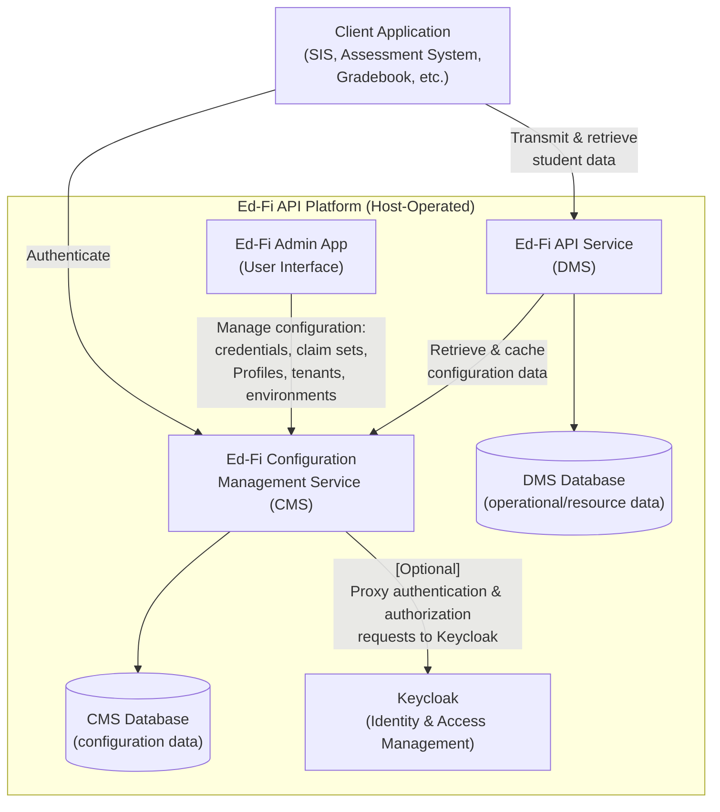

# Product Requirements Document (PRD): Ed-Fi API v8.0 Platform Capabilities

> **Status:** Draft — describes platform capabilities as implemented in Ed-Fi
> API v8.0 \
> **Owner:** Vinaya Mayya \
> **Product**: Ed-Fi API ("DMS") \
> **Repository:** Ed-Fi-Alliance-OSS/Data-Management-Service \
> **Jira Project:** DMS

## 1. Product Overview

The Ed-Fi API is a platform product — a configurable, extensible REST API server
and its supporting datastore — that sits between K-12 source systems (SIS,
assessment systems, gradebooks, etc.) and downstream consumers (state/local
analytics, specialty applications, reporting tools). "Platform hosts" (state
education agencies, districts, or their vendors/integrators) deploy, configure,
and operate their own environments; the Ed-Fi Alliance does not host production
systems on behalf of education organizations. The Ed-Fi API (version 8) is a
ground-up rewrite of functionality previously delivered via the Ed-Fi ODS/API
Platform.

This PRD covers the **platform capabilities that are implemented and available
today in Ed-Fi API v8.0** — the configuration surface, cross-cutting features,
and operational mechanisms that platform hosts use to run the product at scale
and adapt it to local needs. It intentionally excludes the core Data Management
surface (Descriptors, Resources, Discovery), which is covered by the [Ed-Fi API
Design and Implementation
Guidelines](https://docs.ed-fi.org/reference/data-exchange/api-guidelines/design-and-implementation-guidelines/).
Capabilities that existed in the prior-generation platform but have not yet been
carried forward into v8.0 will be covered separately in a v8.1 companion PRD.

## 1.1 Strategic Alignment

- The Ed-Fi Alliance's mission depends on **ecosystem interoperability**:
  vendors build once against a standard API surface across many platform hosts.
  Platform-level capabilities in this PRD (Profiles, Change Queries,
  multi-tenant routing) exist to let hosts adapt operational and security
  posture _without_ fragmenting the API contract that vendors code against.
- Security and data-governance capabilities (Profiles, client-secret hashing,
  token-based authentication) reflect an ongoing strategic shift toward more
  granular, host-configurable data governance beyond a one-size-fits-all
  authorization model.
- Multi-tenancy and context-based routing reflect the reality that many hosts
  (especially state-level SEAs and multi-district SIS vendors) must serve many
  isolated customer populations, or multiple school years, from a shared
  deployment.
- v8.0 establishes the foundation — a rewritten core, a dedicated administrative
  service, and container-based deployment — that subsequent releases (see the
  v8.1 companion PRD) will build on to restore full parity with the
  prior-generation platform.

## 1.2 Target Users and Personas

- **Platform Host Operations/DevOps Engineer** — deploys and configures the
  Ed-Fi API (credentials, optional capabilities, caching, logging, scaling
  topology). Motivated by uptime, cost control, and minimizing custom code.
  Typically has relational-database and modern web-application operations
  experience.
- **Platform Host Security/Systems Architect** — designs authorization, tenancy,
  and data-segmentation strategy (claim sets, Profiles,
  multi-tenant/multi-environment routing). Motivated by compliance,
  least-privilege access, and defensible security posture for sensitive student
  data.
- **API Client Developer (Vendor/Integrator)** — builds SIS, gradebook,
  assessment, or analytics integrations against the API. Cares about Change
  Queries for sync, Profiles they must honor, and stable Correlation IDs for
  support/troubleshooting. (Largely out of scope for this PRD except where
  platform behavior directly shapes the client contract.)
- **Ed-Fi Alliance Core Platform Engineering** — maintains the open-source core
  and defines the supported extension points available today (data-model
  extensions) as well as those planned but not yet available (see the v8.1
  companion PRD).

## 1.3 Jobs to Be Done

- When a downstream system needs to stay in sync without re-pulling the full
  dataset nightly, the Vendor wants to query only records that changed since a
  point they specify **so that** sync jobs are fast and reliable (see
  [[FR-CQ]]).
- When a specialty vendor (e.g., a nutrition or special-education app) should
  only see or write a narrow slice of a resource, the Security Architect wants
  to define a Profile restricting which properties and collections it can access
  **so that** the vendor cannot see or persist data outside its intended scope
  (see [[FR-PROF]]).
- When a platform host must serve multiple independent customer populations from
  one deployment, the Ops Engineer wants multi-tenant and/or multi-environment
  routing **so that** each tenant's, district's, or year's data stays properly
  isolated (see [[FR-INST]], [[FR-TENANT]]).
- When a support engineer is troubleshooting a client-reported failure, the
  engineer wants a Correlation ID tying the client's error response to the
  corresponding log entry **so that** root cause can be found quickly (see
  [[FR-LOG]]).

## 2. Enterprise / System Context

The diagram below shows the Ed-Fi API platform's system context: the two
host-operated services (DMS and CMS), their respective databases, and the
external actors that connect to them.

- **Client applications** (vendor/integrator systems such as SIS, assessment, or
  gradebook products) connect to the **Ed-Fi API service (DMS)** to transmit and
  retrieve student data.
- The **Ed-Fi Admin App** user interface connects to the **Ed-Fi Configuration
  Management Service (CMS)** for managing configuration data (client
  credentials, claim sets, Profiles, tenant and environment routing).
- **DMS** connects to **CMS** to retrieve and cache configuration information
  (e.g., credentials, tenant/environment routing, Profile assignments) needed to
  authorize and route incoming requests.
- **DMS** and **CMS** each have their own database instance. Hosts MAY
  optionally colocate the DMS and CMS tables within a single physical database
  instance, though they remain logically distinct.

### Architectural Requirements

- **FR-ARCH-1**: Configuration management SHALL be implemented in a separate
  application ("Configuration Management Service").
- **FR-ARCH-2**: The Ed-Fi API service SHALL retrieve configuration information
  from the Configuration Management Service using the Ed-Fi Management API
  specification.
- **FR-ARCH-3**: The Ed-Fi API service SHALL support both current versions of
  PostgreSQL and Microsoft SQL Server interchangeably.
- **FR-ARCH-4**: The Ed-Fi API service SHALL NOT utilize an external cache
  provider (e.g. Redis, Memcached).
- **FR-ARCH-5**: The Ed-Fi API service SHALL be capable of operating on either
  Windows or Linux machines.

## 3. Functional Requirements

### 3.1 Environment Segmentation & Routing (FR-INST)

- **FR-INST-1.** The system SHALL support a simple default mode in which each
  API client is associated with exactly one backing data environment, so clients
  can use one fixed base URL with no special routing information required in the
  request path.
- **FR-INST-2.** The system SHALL support an alternative mode in which a single
  client credential can reach multiple backing data environments, by including
  contextual values (such as school year, district, or another host-defined
  identifier) directly in the request path.
- **FR-INST-3.** When this contextual routing mode is enabled, every request
  SHALL be required to include the configured contextual value(s); a request
  that omits them, or supplies values the host doesn't recognize, SHALL receive
  a "not found" response.
- **FR-INST-4.** Credentials and connection details for each backing data
  environment SHALL be stored encrypted at rest and SHALL be managed through the
  platform's own administrative service.
- **FR-INST-5.** The system SHALL cache environment-routing information for
  performance, with administrators able to control how quickly changes to that
  information take effect.

> Sourcing connection details from an external secret-management system, as an
> alternative to the platform's own administrative service, is not yet available
> — see the v8.1 companion PRD.

### 3.2 Multi-Tenant Configuration (FR-TENANT)

- **FR-TENANT-1.** The system SHALL support a single-tenant mode (default) in
  which one shared administrative context serves all API clients.
- **FR-TENANT-2.** The system SHALL support a multi-tenant mode in which the
  platform serves multiple independent customer organizations ("tenants") from a
  single deployment; every client request SHALL identify its tenant, and each
  tenant's administrative data and access rules SHALL be fully isolated from
  every other tenant's.
- **FR-TENANT-3.** In multi-tenant mode, connection details and environment
  overrides SHALL be independently configurable per tenant.
- **FR-TENANT-4.** The system SHALL cache tenant information for performance,
  using the same host-configurable cache-expiration setting that governs
  environment-routing information ([[FR-INST-5]]).
- **FR-TENANT-5.** The platform's documentation/metadata tooling SHALL require a
  valid tenant identifier before it can display API metadata when operating in
  multi-tenant mode.

### 3.3 Change Queries (FR-CQ)

- **FR-CQ-1.** Clients SHALL be able to request only the resource records that
  have been created or updated since a point they specify, rather than needing
  to retrieve the entire dataset to detect changes.
- **FR-CQ-2.** Clients SHALL also be able to discover which records have been
  deleted since a point they specify, not just creates and updates.
- **FR-CQ-3.** For resources that permit changes to identifying values, clients
  SHALL also be able to discover which records have had an identifying value
  corrected since a point they specify, receiving both the old and new
  identifying values, so a downstream consumer can re-key its own copy of the
  record rather than treating the correction as a delete followed by an
  unrelated create.
- **FR-CQ-4.** This capability SHALL be provisioned as a standard part of
  environment setup and SHALL extend automatically to any resources added
  through the platform's supported extension mechanism, so hosts get consistent
  change-detection behavior across both core and extended resources with no
  extra work.
- **FR-CQ-5.** A record of deleted items SHALL be retained so clients can detect
  deletions after the fact; if that history grows very large over time,
  truncating older deletion history SHALL be an operational decision made by the
  host, not something the system does automatically.

> Change Queries is always enabled and is not independently togglable in v8.0;
> in the prior-generation platform it was an optional capability that hosts
> enabled per environment.

### 3.4 API Profiles (FR-PROF)

- **FR-PROF-1.** Hosts SHALL be able to define a named data policy ("Profile")
  for a given resource that limits which properties, references, and collection
  items a client using that Profile may read and/or write.
- **FR-PROF-2.** A Profile SHALL be able to grant read-only, write-only, or full
  access to a resource, and SHALL be able to include or exclude specific
  properties and nested collections, including rules that apply several levels
  deep.
- **FR-PROF-3.** A Profile SHALL be able to further narrow a collection to only
  items matching (or excluding) a specific type or category value — for example,
  limiting an address collection to only certain kinds of addresses.
- **FR-PROF-4.** Identifying information for a resource SHALL always be visible
  to a client reading it, and SHALL always be required when a client creates or
  updates it under a Profile, regardless of the Profile's other rules. If a
  Profile excludes other information that would otherwise be required to create
  a new resource, that Profile SHALL still support updating existing resources,
  just not creating new ones.
- **FR-PROF-5.** Hosts SHALL be able to define and update Profiles without
  requiring a new deployment of the software, so that data-policy changes can
  take effect on their own schedule.
- **FR-PROF-6.** Hosts SHALL be able to assign one or more Profiles to a given
  client application.
- **FR-PROF-7.** When a client has exactly one Profile assigned for a resource,
  the system SHALL apply it automatically. When a client has more than one
  Profile assigned, the client SHALL indicate which Profile to use for that
  particular request.
- **FR-PROF-8.** Profile-specific access details SHALL be discoverable through
  the platform's standard API documentation.

### 3.5 Authentication (FR-AUTHN)

- **FR-AUTHN-1.** The system SHALL authenticate API clients (not individual end
  users) using the OAuth 2.0 Client Credentials Grant Flow, reflecting that
  end-user access control is the responsibility of the client application, not
  the platform.
- **FR-AUTHN-2.** A client SHALL obtain an access token by submitting its
  `client_id` and `client_secret` to a token endpoint using the
  `client_credentials` grant type; a successful request SHALL return a bearer
  access token and its expiration period.
- **FR-AUTHN-3.** The system SHALL expose a backward-compatible token endpoint
  that forwards requests to the current token-issuing service, so that clients
  built against a prior version's token endpoint continue to function without
  modification.
- **FR-AUTHN-4.** Every API request for a protected resource SHALL require the
  access token to be presented as an HTTP `Authorization: Bearer` header;
  requests without a valid, unexpired token SHALL be rejected.
- **FR-AUTHN-5.** In every environment, including local development, the system
  SHALL store client secrets using an industry-standard one-way hashing approach
  (with a per-secret random salt and a host-configurable iteration count), such
  that the original secret cannot be retrieved from storage — even by someone
  with direct access to the underlying data.
- **FR-AUTHN-6.** The system SHALL support issuing token-based (JWT) access
  tokens, so hosts can adopt a token format their broader security
  infrastructure can validate independently.
- **FR-AUTHN-7.** The system SHALL support a token introspection endpoint that
  lets a client presenting its own bearer token retrieve "the current validity
  and full authorization context of that token," including its active/expired
  status, the namespace prefixes, education organization hierarchy, assigned
  profiles, and claim set the token is scoped to, and the per-resource
  operations it is authorized to perform.
- **FR-AUTHN-8.** The system SHALL support Keycloak as an alternative,
  externally-hosted identity provider for organizations that require enterprise
  identity management or single sign-on, in addition to a built-in,
  self-contained default.

### 3.6 Authorization (FR-AUTHZ)

- **FR-AUTHZ-1.** The system SHALL read authorization information - including
  claim set name, assigned education organization(s), and assigned namespace(s)
  - from the bearer token, as a JSON Web token (JWT).
- **FR-AUTHZ-2.** The system SHALL authorize every API request in two sequential
  phases: (1) a check that the caller's claim set grants the requested resource
  claim and action, and (2) if granted, evaluation of the authorization strategy
  associated with that resource claim and action against the specific data being
  accessed. A request SHALL be denied unless both phases pass.
- **FR-AUTHZ-3.** When a request is denied because no relationship path could be
  established between the caller and the requested data, the system SHALL return
  a response identifying which relationship is missing, to support self-service
  troubleshooting.
- **FR-AUTHZ-4.** The system SHALL support at least the following authorization
  strategies, selectable per resource claim and action:
  - **No further authorization required** — the resource/action check alone is
    sufficient (used where no relationship can or should be checked, such as
    first-time creation of a record).
  - **Namespace-based** — access is granted when the target data's namespace
    matches at least one namespace prefix assigned to the API client.
  - **Relationship-based** (a family of strategies; see below) — access is
    granted based on a path between the caller's associated education
    organization(s) and the education organization and/or person referenced by
    the target data.
- **FR-AUTHZ-5.** When more than one relationship-based strategy variant is
  configured for the same resource claim and action, the system SHALL grant
  access if any one of them succeeds (OR logic). Non-relationship strategies
  (e.g., namespace-based) configured alongside relationship-based strategies
  SHALL be combined with AND logic and evaluated first.
- **FR-AUTHZ-6.** The system SHALL support overriding the default authorization
  strategy for a specific resource claim and action on a per-claim-set basis, so
  that a given claim set can be granted a different authorization posture (e.g.,
  a trusted administrative claim set bypassing a relationship check that
  otherwise applies) without affecting other claim sets.
- **FR-AUTHZ-7.** When a resource claim has no directly configured authorization
  strategy for a given action, the system SHALL resolve one by walking up the
  claims taxonomy to the nearest ancestor domain claim that defines one, so that
  new or extension resource claims inherit correct authorization behavior by
  virtue of their placement in the taxonomy, without requiring explicit
  per-resource configuration.

### 3.7 Relationship-Based Authorization (FR-RELATIONSHIP)

- **FR-RELATIONSHIP-1.** The system SHALL maintain the transitive closure of the
  education organization hierarchy, such that a caller associated with a parent
  education organization (e.g., a district) is automatically authorized for all
  of its subordinate education organizations (e.g., its schools), without
  per-school configuration.
- **FR-RELATIONSHIP-2.** The system SHALL determine a caller's relationship to a
  student, staff member, or contact through a defined set of primary
  relationship associations (at minimum: student-school enrollment,
  student-education-organization responsibility, student-contact association,
  and staff assignment/employment associations), rather than through ad hoc
  inspection of arbitrary resource data.
- **FR-RELATIONSHIP-3.** For list (collection) requests, the system SHALL filter
  returned records to only those reachable through the caller's education
  organization associations and the primary relationship tables. For
  single-record read, update, and delete requests, the system SHALL perform an
  equivalent existence check before allowing the operation to proceed.
- **FR-RELATIONSHIP-4.** The system SHALL support authorizing creation of a
  relationship-defining record (such as an enrollment record) based solely on
  the caller's education organization association, without first requiring the
  person-level relationship that record itself is establishing — since requiring
  that relationship in advance would make it impossible to create it in the
  first place.
- **FR-RELATIONSHIP-5.** The system SHALL support relationship-based
  authorization variants that check education organization identifiers only,
  person identifiers only, or both, so that resources can be authorized using
  whichever combination of identifiers is relevant to that resource.
- **FR-RELATIONSHIP-6.** The system SHALL support an inverted relationship
  direction, in which a caller associated with a child education organization
  (e.g., a district) is authorized for resources owned by its parent education
  organization (e.g., a state education agency), for state-level reference data
  that district-level callers need to access. Whether the inverted direction is
  available for read-only actions or also for write actions on a given resource
  is a matter of host/claim-set configuration, not an inherent restriction of
  the inverted direction itself. This SHALL be combinable with the standard
  (non-inverted) direction for the same resource so a caller can both manage its
  own data and access parent-owned reference data.

### 3.8 Ownership-Based Auhorization (FR-OWNAUTH)

> [!TIP]
> Ownership-based authorization (assigning a record to the client that created
> it) is not yet implemented for any resource type in v8.0; the general
> capability is planned for a future release. This section covers how the system
> behaves today, for Descriptors specifically, when a host nonetheless
> configures a claim set to require it.

- **FR-OWNAUTH-1**: Hosts can configure the Ownership-based authorization
  strategy — or any other recognized-but-unimplemented strategy — for any
  resource claim and action, since the system doesn't restrict which strategy
  names may be assigned in claim-set configuration.
- **FR-OWNAUTH-2**. Because Ownership-based authorization isn't yet implemented,
  the system SHALL fail closed with an HTTP 501 response rather than silently
  granting or denying the request, preventing false enforcement assumptions.
- **FR-OWNAUTH-3**. This fail-closed 501 behavior SHALL apply uniformly across
  all resource types — including Descriptors and standard Ed-Fi resources — and
  across all operations (GET-by-id, GET-many, POST, PUT, DELETE).
- **FR-OWNAUTH-4**. The 501 response must identify which authorization
  strategies are currently supported for the resource in question, helping hosts
  diagnose and correct claim-set configuration.
- **FR-OWNAUTH-5**. When Ownership-based authorization is configured alongside
  supported strategies (e.g., Namespace-based, Relationship-based), the system
  evaluates and reports all supported strategies before surfacing the 501,
  preventing masking of other failure reasons.

### 3.9 Configuration & Extensibility (FR-CONFIG)

- **FR-CONFIG-1.** The system's configuration SHALL follow standard,
  well-documented conventions for its runtime environment, so hosts can apply
  their organization's usual deployment and secrets practices rather than
  learning a proprietary mechanism.
- **FR-CONFIG-2.** Hosts SHALL be able to turn optional platform capabilities on
  or off independently of one another.
- **FR-CONFIG-3.** Hosts SHALL be able to control which parts of the resource
  catalog are advertised in the platform's public API documentation.
- **FR-CONFIG-4.** Hosts SHALL be able to extend the platform's data model with
  additional resources, properties, or associations, with supporting API
  documentation and database structures generated automatically to stay
  consistent with the extended model. Applying such an extension SHALL require
  both re-provisioning the database against the extension's effective schema and
  a restart of the affected service; the platform's database provisioning is
  create-only, with no in-place migration path from one effective schema to
  another.
- **FR-CONFIG-5.** The system SHALL implement rate limiting: it SHALL cap the
  number of requests it will accept for a given request Host within a
  host-configured time window (a shared cap across all callers of that host)
  reject requests beyond that cap once any configured queue capacity is also
  exhausted, and tell the rejected caller using the standard HTTP response for
  the condition that it has been rate limited. Hosts SHALL be able to configure
  the cap, the window, and an optional queue depth for excess requests, and
  SHALL be able to disable rate limiting entirely by omitting its configuration.

> [!NOTE]
> This capability has no counterpart in the prior-generation platform,
> which provided no request-volume protection of any kind.

### 3.10 Logging & Correlation ID (FR-LOG)

- **FR-LOG-1.** The system SHALL produce structured, machine-readable
  operational logs, independently configurable in verbosity for each major
  service of the platform, with sensible defaults appropriate for production
  versus local-development use.
- **FR-LOG-2.** Every request SHALL be assigned a Correlation ID, included in
  both the response returned to the client (when the request fails) and the
  corresponding log entries, so a specific failed request can be traced
  end-to-end.
- **FR-LOG-3.** For the Ed-Fi API service, clients SHALL be able to supply their
  own Correlation ID for a request rather than relying on one generated by the
  system; hosts SHALL be able to configure how a client supplies it (including
  disabling the option), and clients supplying their own ID are responsible for
  making sure it is unique per request.

> [!WARNING]
> The separate Configuration/administrative service does not
> currently support a client-supplied Correlation ID.

- **FR-LOG-4.** Hosts SHOULD be able to optionally enable more detailed
  request/response logging for troubleshooting, and SHOULD be able to turn
  detailed logging off just as easily.
- **FR-LOG-5.** When detailed request/response logging is enabled, dictionary
  key values SHALL be masked before being written to the log.
- **FR-LOG-6.** Every failed request SHALL produce a corresponding log entry
  carrying the same Correlation ID as the error response.

### 3.11 Schema & Dependency Publishing (FR-SCHEMA)

- **FR-SCHEMA-1.** The system SHALL publish the data model's schema as
  downloadable documents (XSD schema files and OpenAPI/JSON Schema
  specifications) that a client can retrieve and use for offline validation and
  tooling, independent of the platform's interactive API documentation.
- **FR-SCHEMA-2.** The system SHALL publish the ordering dependencies among
  resources, indicating the sequence in which resources must be created, so a
  client loading a full dataset can do so without violating reference
  constraints (for example, creating a referenced resource before the resource
  that references it).
- **FR-SCHEMA-3.** Published resource-dependency information SHALL indicate
  which operations (such as create/update versus delete) a given ordering
  applies to, so a client can also determine a valid sequence for removing a
  dataset.
- **FR-SCHEMA-4.** This capability SHALL be available in more than one
  machine-readable format, so different tooling ecosystems can consume it.
- **FR-SCHEMA-5.** Schema documents and dependency-ordering information SHALL
  cover the full deployed data model, including resources added through the
  platform's supported extension mechanism, not just the core Ed-Fi resources,
  so hosts get consistent tooling support for both core and extended data.

## 4. Non-Functional Requirements

### 4.1 Compatibility (NFR-COMPAT)

- **NFR-COMPAT-1.** The system's supporting data stores SHALL run on
  currently-supported versions of the host's chosen database platform; hosts on
  an older, unsupported version SHALL upgrade before adopting a new platform
  release.
- **NFR-COMPAT-2.** The system's configuration approach SHALL remain compatible
  with standard, widely-used configuration and secrets-management practices for
  its runtime environment.
- **NFR-COMPAT-3.** The system SHALL be deployable via standard container
  tooling, with reference deployment configurations provided.
- **NFR-COMPAT-4.** The system SHALL support operating a given deployment
  against any one of several supported Ed-Fi Data Standard versions, selected by
  the host, rather than being permanently fixed to a single version.
- **NFR-COMPAT-5.** Switching a deployment to a non-default supported Data
  Standard version SHALL be achievable through the platform's configuration and
  schema-loading mechanism, without requiring the host to build custom software
  artifacts.

### 4.2 Security (NFR-SEC)

- **NFR-SEC-1.** Client secrets SHALL be hashed at rest, unconditionally, in
  every environment including local development; there is no plain-text storage
  opt-out.
- **NFR-SEC-2.** Access-governance changes (claim set permissions, education
  organization / namespace / profile assignments) SHALL be configurable by hosts
  without requiring a new software release, via an external service.
- **NFR-SEC-3.** The system SHALL document, but not itself remediate, the
  accepted business-process risks in NFR-SEC-3a through NFR-SEC-3d, which are
  inherent to how the ecosystem operates. Each SHOULD be mitigated by the host
  through external controls rather than by the platform itself.
  - **NFR-SEC-3a.** A client authorized to register a person's enrollment can
    thereby gain read access to that person's basic information. _Host
    mitigation:_ network and usage monitoring.
  - **NFR-SEC-3b.** Sequentially-issued identifiers are easier to guess than
    randomly-issued ones. _Host mitigation:_ a non-sequential identifier policy.
  - **NFR-SEC-3c.** The platform relies on upstream and downstream systems, not
    itself, to sanitize data against injection/XSS risk when that data is later
    displayed or processed. _Host mitigation:_ downstream sanitization.
  - **NFR-SEC-3d.** The platform does not, on its own, lock out a client after
    repeated failed authentication attempts. _Host mitigation:_ external
    brute-force protection. Note that rate limiting ([[FR-CONFIG-5]]) does not
    satisfy this; it caps request volume for authenticated clients and is not a
    defense against credential guessing.

### 4.3 Observability (NFR-OBS)

- **NFR-OBS-1.** Every request SHALL be traceable end-to-end via a Correlation
  ID present in both the client-facing error response and the corresponding log
  entry.
- **NFR-OBS-2.** Hosts SHOULD be able to temporarily increase log detail for
  production troubleshooting without a code change, and SHOULD return to normal
  verbosity once the issue is resolved.
- **NFR-OBS-3.** Because the most detailed logging level captures request and
  response bodies — which for this product means student data — elevated
  verbosity is masked by default ([[FR-LOG-5]]).

> [!WARNING]
> Because there is no mechanism that automatically reverts elevated
> verbosity on its own, hosts SHOULD treat it as a temporary, supervised state
> and rely on operational process to turn it back off.

### 4.4 Operations (NFR-OPS)

- **NFR-OPS-1.** Hosts operating multiple backing environments SHALL be able to
  tune how quickly changes to cached environment-routing information take
  effect.
- **NFR-OPS-2.** Data-model extensions SHALL require both database
  re-provisioning (to match the extension's effective schema hash) and a service
  restart to take effect; the platform does not hot-reload extended schemas, nor
  does it support in-place migration of an already-provisioned database to a new
  effective schema — provisioning is create-only.

### 4.5 Reverse Proxy / Load Balancer Deployment (NFR-PROXY)

- **NFR-PROXY-1.** The system SHALL support running behind a reverse proxy or
  load balancer, honoring standard forwarded-request headers (protocol and host,
  at minimum) supplied by the proxy, so the API can determine the scheme and
  host the client actually used even though the request arrives from the proxy.
- **NFR-PROXY-2.** Honoring forwarded headers SHALL be off by default and SHALL
  require explicit host configuration to enable, and SHALL only take effect for
  requests arriving from a host-configured allow-list of trusted proxy addresses
  (individual IPs and/or address ranges), so an untrusted caller cannot spoof
  its own origin by supplying forwarded headers directly.
- **NFR-PROXY-3.** The system SHALL fail to start, rather than silently ignore
  the setting, if the trusted-proxy allow-list is configured with a malformed
  address or address range.
- **NFR-PROXY-4.** The system SHALL support hosting the API under a
  host-configured base path (a URL path prefix), so a host can publish it
  beneath a shared domain (for example, `api.example.org/edfi`) instead of
  requiring it to occupy the domain root.
- **NFR-PROXY-5.** Every absolute URL the system generates in a response
  (including the discovery document, resource/collection metadata, and other
  self-referencing links) SHALL reflect the scheme, host, and base path of the
  request as the client actually made it — honoring forwarded headers and the
  configured base path where applicable — so a generated URL always matches what
  the client called rather than the API's internal host or port.
- **NFR-PROXY-6.** This capability SHALL be independently configurable, and
  available, on both the Ed-Fi API service and the administrative/configuration
  service.

## 5. System Architecture

| Component | Responsibility | Notes |
| --- | --- | --- |
| Ed-Fi API service | Serves the core Data Management API surface (resources, descriptors, discovery) plus the platform capabilities described in this PRD | Subject to the optional-capability toggles described in Section 3 |
| Documentation / metadata service | Serves interactive, browsable API documentation | Requires a valid tenant identifier when operating in multi-tenant mode |
| Administrative / configuration service | Manages client credentials, access rules, Profile definitions, and environment/tenant routing; hosts the platform's identity provider | System of record for the settings referenced throughout Section 3 |
| Operational data store(s) | Holds the actual resource data; may be segmented across multiple environments by year, district, or another strategy | Read replica and snapshot copies are not yet supported — see the v8.1 companion PRD |
| Data model extensions (optional) | Host-supplied additions to the resource/data model | Loaded from a configured location at startup; requires a service restart to take effect |

## 6. Out of Scope and Known Limitations

- **Descriptors, Resources, and Discovery capabilities** are explicitly out of
  scope for this PRD; they are covered by the Ed-Fi API Design and
  Implementation Guidelines.
- **Composites are permanently out of scope.** This is a settled decision, not a
  deferral: the capability is retired and will not be reproduced in v8.0 or any
  later release.
- **Storing multiple years of data in a single operational environment** is a
  discouraged pattern; the Alliance recommends single-school-year environments,
  with multi-year consolidation handled downstream (e.g., in a data warehouse).
  This PRD does not define requirements for multi-year data handling.
- **Internal build and test tooling** (code generation, integration-test
  harnesses) is an engineering concern, not a client- or host-facing capability,
  and is out of scope.
- **Brute-force/account-lockout protection, sanitizing stored data against
  injection/XSS, and network-level anomaly detection** are explicitly NOT
  provided by the platform and are documented host responsibilities.
- **Capabilities not yet implemented in v8.0**: (read replicas, snapshot
  isolation, high-performance cursor-based paging, ownership-based
  authorization, custom access rules, unique-ID integration, the Identities
  capability, cross-instance cache-refresh signaling, rostering integration,
  identifier-change support without delete-and-recreate, and several
  configuration/extensibility and token-management sub-capabilities) are out of
  scope for this PRD.
- **Access governance data management** including creation of API clients and
  assignment of permissions via claim sets, Education Organizations, namespaces,
  and profiles, will be handled by a separate application: the Ed-Fi
  Configuration Management Service (CMS).
- **Duplicate-checking of client-supplied Correlation IDs is out of scope.** Per
  [[FR-LOG-3]], uniqueness of a client-supplied Correlation ID is the client's
  responsibility, not something the system validates or enforces. The system
  does not use Correlation ID for access control, caching, or idempotency, so a
  collision cannot grant access to or affect another client's data. The residual
  risk is to traceability rather than security: a client could deliberately
  reuse another client's Correlation ID to interleave its own activity into that
  client's log trail, degrading the fidelity of an investigation that searches
  logs by Correlation ID (an anti-forensics concern, not a
  confidentiality/integrity control). Hosts who need to rule this out can
  disable client-supplied Correlation IDs entirely (see [[FR-LOG-3]]).
- **Deployment automation** is not prescribed in this requirements document; any
  automation tooling / scripts provided by the Ed-Fi Alliance will be documented
  elsewhere.

## 7. Open Questions

None

## 8. Glossary

- **Tenant:** In multi-tenant mode, an isolated customer organization served by
  a shared deployment, with its own administrative data and access rules kept
  separate from other tenants.
- **Context-Based Routing:** Directing a request to the correct backing data
  environment using values (such as school year or district) included directly
  in the request path, as an alternative to a client being tied to a single
  fixed environment.
- **Claim Set:** A named collection of access grants (what a client may create,
  read, update, or delete) assignable to a client application; the core unit of
  the platform's access-control model.
- **Profile:** A named data policy restricting which properties, references, and
  collection items of specified resources a client may read and/or write.
- **Correlation ID:** A per-request identifier, client-supplied or
  system-generated, linking a client-facing error response to its corresponding
  operational log entries.
- **Rate Limiting:** Capping how many requests an individual API client may make
  within a configured time window, and rejecting requests beyond that cap with a
  retryable response, so that a runaway or misconfigured client cannot degrade
  service for others. A self-protection mechanism, not a security control.
