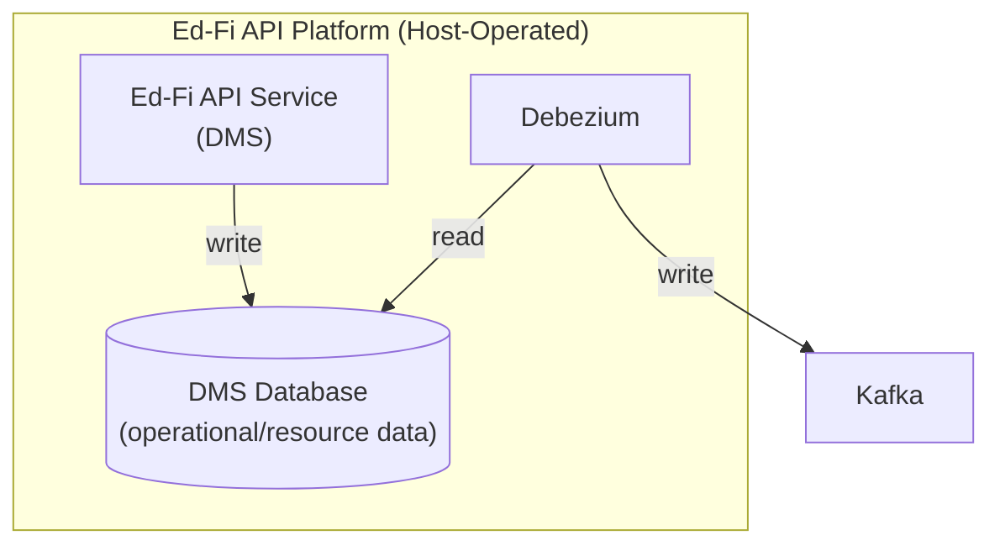

# Product Requirements Document (PRD): Ed-Fi API v8.1 Platform Capabilities (Planned)

> **Status:** Draft — proposed backlog for a future release, derived from a gap analysis against the prior-generation platform (Ed-Fi ODS/API); none of the capabilities below are implemented in Ed-Fi API v8.0
> **Owner:** Vinaya Mayya
> **Product**: Ed-Fi API ("DMS")
> **Repository:** Ed-Fi-Alliance-OSS/Data-Management-Service
> **Jira Project:** DMS
> **Companion document:** [Ed-Fi API v8.0 Platform Capabilities (Implemented)](./PRD-v8.0.md) — covers what is available today

## 1. Product Overview

Ed-Fi API v8.0 is a ground-up rewrite of the platform's prior generation (the
Ed-Fi Data Store/API Platform), not an incremental upgrade. As a result, a
number of platform capabilities that hosts and vendors relied on in the prior
generation are not yet available in v8.0. This PRD describes those capabilities
as candidate requirements for a subsequent release — referred to here as "v8.1"
as a placeholder for whichever release ultimately restores them — so that
engineering, product, and the community can prioritize closing the gap.

This is a **gap-driven, forward-looking PRD**: unlike the [v8.0 companion
PRD](./ods-api-platform-prd-v8.0.md), which documents implemented behavior, the
requirements below describe capabilities the platform SHOULD or SHALL eventually
provide, based on what the prior-generation platform already proved out. Some
items are firm carryover requirements; others are flagged as open questions
where it's unclear whether the original problem still applies under v8.0's new
architecture (see Section 7).

This PRD excludes the core Data Management surface (Descriptors, Resources,
Discovery), which is unaffected by this gap analysis, and excludes anything
already covered in the v8.0 companion PRD.

## 1.1 Strategic Alignment

- Several of these capabilities were purpose-built for **operational cost and
  scale** at hosts running production instances serving many districts/vendors:
  read replicas, optimized resource storage/retrieval, high-performance paging,
  and cross-instance cache-refresh signaling all reduce backend load or improve
  responsiveness under heavy read/write volume. Their absence in v8.0 is a real
  scaling risk for the largest hosts. Read replicas and high-performance paging
  in particular were complete, operating capabilities in the prior generation —
  hosts running at scale were actively relying on them — so their absence is a
  concrete regression for those hosts rather than the loss of an aspiration.
- Several are **security and data-governance** capabilities (ownership-based
  authorization, custom access rules, configurable token limits) that let hosts
  implement more granular access control than the base claims model alone
  provides. Hosts who depended on these in the prior generation cannot yet
  replicate that posture in v8.0.
- **Rostering integration (OneRoster)** and **unique-ID/Identities integration**
  are ecosystem-interoperability capabilities: vendors and hosts who built
  workflows around them in the prior generation have no migration path until
  these are restored.
- **Event streaming (Kafka/CDC)** is a data-integration capability: hosts and
  vendors who built downstream systems around a near-real-time change feed in
  the prior generation have no equivalent way to consume data changes from
  v8.0 without polling the API.
- Closing this gap is a prerequisite for hosts currently on the prior-generation
  platform to migrate to v8.0 without a regression in capability.

## 1.2 Target Users and Personas

- **Platform Host Operations/DevOps Engineer** — currently blocked from
  replicating prior-generation scaling patterns (read replicas, high-performance
  paging, cache-refresh signaling) on v8.0.
- **Platform Host Security/Systems Architect** — currently blocked from
  replicating prior-generation fine-grained authorization patterns
  (ownership-based access, custom access rules) on v8.0.
- **Platform Host Extension Developer** — currently has no supported way to add
  wholly new custom capabilities or integrate an external identity/unique-ID
  system on v8.0, beyond the data-model extension mechanism already covered in
  the v8.0 companion PRD.
- **API Client Developer (Vendor/Integrator)** — currently cannot rely on
  high-performance paging, rostering integration, or identity-management
  endpoints when integrating against v8.0.
- **Ed-Fi Alliance Core Platform Engineering** — owns prioritizing and designing
  how each of these capabilities is rebuilt (or intentionally retired) under the
  v8.0 architecture.

## 1.3 Jobs to Be Done

- When our API experiences heavy read traffic alongside write traffic, the Ops
  Engineer wants to route reads to a separate copy of the data **so that** write
  throughput is not degraded (see [[FR-REPLICA]]).
- When a downstream system needs a stable view of the data for a synchronization
  run, the Vendor wants an isolated, point-in-time snapshot **so that** the sync
  isn't disrupted by concurrent writes (see [[FR-CQ-SNAPSHOT]]).
- When a Vendor needs to bulk-export a large resource collection, the Vendor
  wants paging that stays fast no matter how deep they page **so that** exports
  complete in reasonable time without skipped or duplicated records (see
  [[FR-PAGE]]).
- When a host needs to grant a client access only to the records it created
  (rather than by organizational hierarchy), the Security Architect wants to
  enable ownership-based access **so that** record-level access control is
  possible without a software change (see [[FR-OWN]]).
- When a host needs an access rule that doesn't fit the built-in
  organizational/relationship-based rules (e.g., "only students enrolled in CTE
  courses"), the Security Architect wants to define a new custom rule **so
  that** it can be added without a code change or service restart (see
  [[FR-AUTHVIEW]]).
- When the host already has an authoritative enterprise identity system, the
  Extension Developer wants to connect the platform to it for validation and/or
  identity search/creation **so that** client systems get one canonical ID per
  person across roles (see [[FR-UID]], [[FR-IDN]]).
- When a security or configuration change is made centrally, the Ops Engineer
  wants a way to make all running API instances pick it up immediately **so
  that** the change takes effect without a full restart (see [[FR-NOTIFY]]).
- When a host wants to expose rostering data to LMS/instructional-tool vendors
  using an industry standard, the Ops Engineer wants to enable that capability
  using the same data and credentials **so that** no second data pipeline or
  credential system is needed (see [[FR-ONEROSTER]]).
- When a source system needs to correct a previously reported identifying value,
  the Vendor wants to update the existing record **so that** it and its related
  data don't need to be deleted and recreated from scratch (see [[FR-KEY]]).
- When a downstream system needs near-real-time notice of data changes rather
  than polling the API, the Vendor wants the platform to publish those changes
  as a stream of events **so that** integrations can react to changes as they
  happen (see [[FR-STREAM]]).

## 2. Enterprise / System Context

There are no changes to the enterprise context relative to the prior product
requirements document, aside from the addition of the event streaming data
flow introduced by [[FR-STREAM]]:

## 3. Functional Requirements

### 3.1 Read Replicas (FR-REPLICA)

- **FR-REPLICA-1.** Hosts SHALL be able to designate a separate, read-only copy
  of the operational data to serve all read (`GET`) traffic, so read load can be
  offloaded from the primary read/write environment.
- **FR-REPLICA-2.** This capability SHALL be transparent to API clients — the
  same endpoints and the same request/response contract — requiring no
  client-side changes.
- **FR-REPLICA-3.** The system SHALL always source data used to populate its
  internal caches from the primary (read/write) environment, never from a read
  replica, so cached information is never built from data that could be lagging
  behind the primary.
- **FR-REPLICA-4.** Where a host has designated a read replica, the platform
  SHALL decide which copy to use per request on its own, based on whether the
  request reads or writes. A host SHALL NOT have to configure this routing per
  resource or per endpoint, and a client SHALL NOT be able to influence it.
- **FR-REPLICA-5.** Designating a read replica SHALL be optional per backing
  data environment, and an environment with no replica designated SHALL serve
  all traffic from the primary with no configuration change required.

### 3.2 Change Query Snapshot Isolation (FR-CQ-SNAPSHOT)

- **FR-CQ-SNAPSHOT-1.** Hosts SHOULD be able to offer clients a consistent,
  point-in-time view of the data that is isolated from concurrent writes and
  selectable on a per-request basis, so a client's synchronization run isn't
  disrupted by data changing while it's in progress.

_Note:_ this extends the Change Queries capability already implemented in v8.0
(see the v8.0 companion PRD); the operational process for creating and
refreshing these point-in-time views SHALL remain a host responsibility, not
something the platform schedules or orchestrates itself.

### 3.3 High-Performance (Keyset) Paging (FR-PAGE)

- **FR-PAGE-1.** The system SHALL support a high-performance paging mode for
  retrieving large result sets, so that performance does not degrade as a client
  pages deeper into a large dataset, unlike simple position-based paging.
- **FR-PAGE-2.** Paging state SHALL be carried via an opaque token returned with
  each page, rather than requiring the client to calculate and manage paging
  position itself.
- **FR-PAGE-3.** The system SHALL support dividing a large, client-authorized
  dataset into independent partitions so a client can process multiple
  partitions in parallel — a capability high-performance paging does not
  otherwise provide, since pages within it must otherwise be retrieved strictly
  in sequence.
- **FR-PAGE-4.** High-performance paging SHALL NOT apply to change-detection
  endpoints, since those already perform well at scale using their own
  version-based filtering.
- **FR-PAGE-5.** Adopting high-performance paging SHOULD also modestly improve
  performance for clients that continue using traditional position-based paging,
  without requiring those clients to change anything.

### 3.4 Ownership-Based Authorization (FR-OWN)

- **FR-OWN-1.** Hosts SHALL be able to opt into an additional,
  disabled-by-default access model in which each record is associated with the
  client that created it.
- **FR-OWN-2.** A client SHALL be able to be granted access to more than one
  such ownership grouping, not only the records it personally created.
- **FR-OWN-3.** Ownership-based access SHALL be usable in combination with the
  platform's other (organization-hierarchy-based) access rules for the same
  resource and action, expanding rather than replacing what a client can access.
- **FR-OWN-4.** Enabling this capability SHALL require a one-time setup step for
  the affected environment.
- **FR-OWN-5.** When a host enables this capability on an environment that
  already contains data, the host SHALL be responsible for retroactively
  assigning ownership to that existing data, since the system only assigns
  ownership automatically at the time a record is created going forward.

### 3.5 Custom Access Rules (FR-AUTHVIEW)

- **FR-AUTHVIEW-1.** Hosts SHALL be able to define new, custom access rules
  without requiring a software change, recompilation, or a restart of the
  running service.
- **FR-AUTHVIEW-2.** A custom access rule SHALL be able to be based on any
  entity in the data model, core or extended — not only the built-in set of
  person- and organization-based rules.
- **FR-AUTHVIEW-3.** When an access rule denies a request, the system SHALL be
  able to give the client a human-readable hint about what related data they may
  be missing, to aid self-service troubleshooting.
- **FR-AUTHVIEW-4.** When more than one custom access rule applies to the same
  resource and action, all of them SHALL be required to pass — each acts as an
  additional filter. This is different from how the platform's built-in
  relationship-based rules combine, where satisfying any one of several
  applicable rules is sufficient.
- **FR-AUTHVIEW-5.** Newly defined custom access rules SHALL take effect within
  the platform's normal access-rule refresh cycle, without requiring a service
  restart.

### 3.6 Unique ID System Integration (FR-UID)

- **FR-UID-1.** Out of the box, the system SHALL NOT require integration with
  any external unique-ID system; standard use of the platform SHALL NOT depend
  on this capability being configured.
- **FR-UID-2.** Hosts SHALL be able to integrate the platform with an external,
  authoritative unique-ID system, such that the external system is the source of
  truth for a person's unique identifier.
- **FR-UID-3.** When this integration is enabled, the system SHALL confirm that
  a supplied unique ID actually exists in the external system before allowing a
  new person record to be created, and SHALL reject the request if it does not.
- **FR-UID-4.** When this integration is enabled, a person's unique ID SHALL be
  treated as immutable — the system SHALL reject any attempt by a client to
  change it on an existing record.
- **FR-UID-5.** Hosts SHALL be able to instead operate without any external
  unique-ID system, in which case the platform SHALL treat supplied unique IDs
  as ordinary data (enforcing only that they are unique), and hosts SHALL be
  responsible for instructing their clients on how to obtain or assign them.
- **FR-UID-6.** What the platform SHALL provide is the integration point and the
  enforcement behavior around it (FR-UID-3, FR-UID-4), not a connector to any
  particular external system. Each host supplies the connector for its own
  unique-ID system.

### 3.7 Identities API (FR-IDN)

- **FR-IDN-1.** The platform SHALL optionally expose a capability for clients to
  create a new unique ID, retrieve a person record by unique ID, retrieve
  multiple person records by unique ID, and search for or suggest matching
  identities.
- **FR-IDN-2.** If a host has not implemented one of these capabilities, a
  client's request for it SHALL receive a clear, well-defined "not implemented"
  response, distinguishable from an error that could be mistaken for a data
  problem.
- **FR-IDN-3.** Find and search requests SHALL support both an immediate
  response and a deferred ("processing — check back") response pattern, so that
  computationally expensive identity-matching operations don't force clients
  into long-held-open connections. When deferred, clients SHALL be able to poll
  for completion.
- **FR-IDN-4.** A host's identity-system integration SHALL declare which of
  these capabilities (create, find, search) it supports, so the platform can
  respond appropriately for the ones it doesn't. Bulk or asynchronous identity
  creation SHALL NOT be required of an integration.
- **FR-IDN-5.** Matches returned from a search SHALL include a confidence
  indicator, and hosts SHOULD limit results to statistically plausible matches
  rather than returning a long tail of low-confidence guesses.
- **FR-IDN-6.** The platform SHALL define a standard, minimal set of identifying
  attributes (such as name, sex, birth date, birth order, and birthplace) that
  any identity integration is expected to support. Attributes an integration
  doesn't support SHALL be represented as empty/unknown rather than omitted, so
  client code can rely on a consistent response shape.
- **FR-IDN-7.** The platform SHALL allow additional, host- or
  integration-specific identifying information beyond this standard set to be
  included and passed through, without requiring the platform's core model to be
  modified.
- **FR-IDN-8.** Hosts SHALL be able to enable this capability independently of
  unique-ID validation, since a host may want one without the other.

### 3.8 Optimized Resource Storage & Retrieval (FR-SERIAL)

- **FR-SERIAL-1.** The system SHALL be capable of serving read requests for a
  resource using a serialized representation of a document.
- **FR-SERIAL-2.** The system SHALL enable platform hosts to disable the
  serialization feature, to reduce database storage.
- **FR-SERIAL-3.** The system's SHALL provide self-contained metadata alongside
  the serialized representation, suitable for change data capture replication to
  secondary data stores.

### 3.9 Cross-Instance Cache-Refresh Signaling (FR-NOTIFY)

- **FR-NOTIFY-1.** Hosts running multiple instances of the API service SHALL be
  able to trigger an immediate refresh of specific cached administrative
  information across all running instances, rather than waiting for that
  information's normal refresh interval to elapse.
- **FR-NOTIFY-2.** At minimum, hosts SHALL be able to trigger an immediate
  refresh of security/access rules, client credential details, Profile
  definitions, environment-routing details, and reference-value (descriptor)
  mappings.
- **FR-NOTIFY-3.** The system SHALL guard against this capability being
  triggered so rapidly or repeatedly that it degrades performance, whether
  through attack or misconfiguration.
- **FR-NOTIFY-4.** Hosts SHALL be able to extend this capability with additional
  custom message types and handling, and to use a messaging technology of their
  choosing.
- **FR-NOTIFY-5.** The platform SHALL NOT itself provide a way to send these
  refresh signals (for example, no built-in admin screen); triggering them is
  the host's own operational responsibility.

### 3.10 Rostering Integration — OneRoster (FR-ONEROSTER)

- **FR-ONEROSTER-1.** Hosts SHALL be able to enable a separately-deployed
  rostering service that implements a widely-adopted industry rostering
  standard, reading from the same underlying operational data, so a second data
  pipeline or duplicate dataset is not required.
- **FR-ONEROSTER-2.** Clients SHALL be able to use the same credentials for both
  the core API and the rostering service, so no separate credential management
  is required for clients needing both.
- **FR-ONEROSTER-3.** Access to rostering data SHALL be governed by the same
  access-rules model used for the core API, so rostering access follows the same
  governance clients and hosts already use.
- **FR-ONEROSTER-4.** Supported rostering data SHALL include, at minimum,
  organizations/schools, academic terms/sessions, courses and classes, users
  (students and teachers), and enrollment/demographic information.
- **FR-ONEROSTER-5.** Hosts SHALL be able to turn this capability on or off for
  their deployment (default: off).

### 3.11 Identifier Changes Without Delete-and-Recreate (FR-KEY)

The prior-generation platform identified most resources using real-world
business identifiers rather than internally generated ones, since the platform
is typically not the authoritative source system for the data it holds. This
meant correcting an identifying value could otherwise require deleting and
recreating a record and everything that depends on it. The requirements below
describe where the prior-generation platform avoided that burden — and are
proposed here pending confirmation of whether they still apply under v8.0's new
resource-identification design (see Section 7).

- **FR-KEY-1.** For a defined set of resources, the system SHALL allow a client
  to correct an identifying value on an existing record via an update, without
  requiring the record and its related data to be deleted and recreated; related
  data SHALL remain correctly linked after such a change.
- **FR-KEY-2.** For resources not covered by this capability by default, a
  client attempting to change an identifying value SHALL be clearly informed
  that the change is not supported, so the client can instead delete and
  recreate the record.
- **FR-KEY-3.** Hosts extending the data model SHALL be able to enable this
  identifier-change support for their own added resource types.
- **FR-KEY-4.** Certain person-type resources (for example, students and staff)
  SHALL support correcting their identifying value via update without requiring
  related data to be recreated, specifically because these identifiers are more
  prone to needing correction after initial entry.

### 3.12 Environment Segmentation & Routing — Secrets Sourcing (extends FR-INST)

The following sub-capability extends [[FR-INST]] (Environment Segmentation &
Routing, v8.0 companion PRD §3.1), which already implements environment routing
but only sources connection details from the platform's own administrative
service.

- **FR-INST-6.** Administrators SHOULD be able to source backing data
  environment connection details from an external secret-management system, as
  an alternative to the platform's own administrative service, so hosts can
  integrate with whatever secret-management approach they already use.

### 3.13 Configuration & Extensibility Extensions (extends FR-CONFIG)

The following sub-capabilities extend [[FR-CONFIG]] (Configuration &
Extensibility, v8.0 companion PRD §3.9), which already covers basic
optional-capability toggling and data-model extension but not these
host-extensibility and performance-tuning needs.

- **FR-CONFIG-6.** Hosts SHALL be able to inject custom startup and
  configuration behavior without modifying the platform's own source code.
- **FR-CONFIG-7.** The platform SHALL define a supported, documented pattern for
  adding wholly new, independently-toggled custom capabilities, so host-specific
  additions don't require changes to unrelated parts of the system.
- **FR-CONFIG-8.** Hosts SHALL be able to use an external caching layer, instead
  of in-process memory, for frequently-read platform information, configurable
  independently for each category of information.
- **FR-CONFIG-9.** Hosts SHALL be able to trade off a minor compatibility risk
  for reduced backend load in how resource cross-references are represented in
  responses.

### 3.14 Authentication — Token Management (extends FR-AUTHN)

The following sub-capability extends [[FR-AUTHN]] (Authentication, v8.0
companion PRD §3.5), which already covers token issuance and validation but not
host-configurable limits on token lifetime or concurrency.

- **FR-AUTHN-9.** Hosts SHALL be able to limit how long an access token remains
  active.
- **FR-AUTHN-10.** Hosts SHALL be able to limit how many active tokens a single
  client may hold at once.

### 3.15 Event Streaming (FR-STREAM)

- **FR-STREAM-1.** The system SHALL support streaming data changes to
  downstream consumers using Apache Kafka, so vendors and hosts can react to
  changes without polling the API.
- **FR-STREAM-2.** This streaming capability SHALL use Debezium for change
  data capture (CDC), reading the database's change/transaction log from
  either PostgreSQL or Microsoft SQL Server, depending on which database
  engine the host has deployed as its operational data store.
- **FR-STREAM-3.** The CDC configuration SHALL be set up to capture the
  serialized resource representation defined in [[FR-SERIAL]] (FR-SERIAL-1)
  along with its associated self-contained metadata (FR-SERIAL-3), so a
  downstream consumer receives a complete, self-describing record of each
  change without needing to query the API for additional context.
- **FR-STREAM-4.** Because this capability depends on the serialized
  representation and metadata produced under FR-SERIAL, a host that disables
  serialization (FR-SERIAL-2) SHALL NOT be able to use this CDC-based
  streaming capability in its current form.
- **FR-STREAM-5.** Each event on the stream SHALL be keyed by the affected
  resource's document identifier, and that key SHALL remain the same across
  every event concerning that document (create, update, and delete), so a
  consumer can correlate a document's full history by key.
- **FR-STREAM-6.** A deleted resource SHALL be represented on the stream as a
  single tombstone (null-valued) message keyed by its document identifier,
  rather than as a message carrying delete metadata; no more than one
  tombstone SHALL be published per deletion.
- **FR-STREAM-7.** A created or updated resource SHALL be represented on the
  stream as a message whose value is a plain JSON object — not wrapped in any
  serialization-framework envelope — containing, at minimum: an explicit
  contract/schema version; the resource's document identifier; the identity of
  the Ed-Fi resource type and version (project name, resource name, resource
  version); an incrementing content-version number for the document; a
  normalized last-modified timestamp; and the full resource document (per
  [[FR-SERIAL]]) including its ETag. This message SHALL NOT include internal
  source-system metadata unrelated to the resource itself, so a consumer can
  read and interpret it using only standard JSON tooling.
- **FR-STREAM-8.** Regardless of which supported database engine produced the
  change, timestamps and document identifiers on the stream SHALL be presented
  in a single normalized format (UTC timestamps; lowercase canonical UUIDs),
  so consuming code does not need to special-case the source database.
- **FR-STREAM-9.** The stream SHALL preserve the numeric and structural
  fidelity of the resource document: decimal/numeric values SHALL appear as
  exact JSON numbers, never as strings or lossy floating point, and properties
  absent from the source SHALL be omitted rather than represented as null.
- **FR-STREAM-10.** The stream SHALL preserve the relative order of events for
  any single document, so a consumer never observes that document's changes
  out of the order they actually occurred.
- **FR-STREAM-11.** Bulk administrative operations that are not themselves a
  meaningful create, update, or delete of a specific resource (e.g., table
  truncation) SHALL NOT produce document events on the stream.
- **FR-STREAM-12.** When a consumer begins reading the stream from the
  beginning, it SHALL receive an upsert event for every resource that
  currently exists, so a new consumer can build a complete view of current
  data without a separate bulk-export mechanism.
- **FR-STREAM-13.** A progress/heartbeat signal SHALL be available to
  consumers separately from document events, so it is possible to distinguish
  "no data has changed" from "the stream has stopped delivering," without that
  signal ever being mistaken for an actual document change.

## 4. Non-Functional Requirements

### Compatibility

- **NFR-COMPAT-1.** Read-replica support SHALL work with whatever standard
  high-availability/replication technology the host's database platform and
  hosting environment provide; the platform SHALL NOT assume a specific
  replication technology.

### Security

- **NFR-SEC-1.** Fine-grained authorization capabilities (ownership-based access
  and custom access rules) SHALL exist specifically so hosts can implement
  need-to-know access beyond broad organizational-hierarchy access, supporting
  data-minimization for sensitive information.
- **NFR-SEC-2.** Custom access rules SHALL take effect through the platform's
  normal access-rule refresh cycle, without requiring privileged access to
  restart the service.

### Privacy

- **NFR-PRIVACY-1.** Identity-matching capabilities SHALL be limited to a
  documented, minimal set of attributes by default; the platform SHALL NOT
  bundle additional sensitive identity-matching attributes (e.g., government ID
  numbers, ethnicity/race) unless a specific host integration requires them.

### Reliability / Performance

- **NFR-PERF-1.** Read-heavy and write-heavy workloads SHALL be separable via
  read-replica support, with no changes required on the client side.
- **NFR-PERF-2.** Retrieving large result sets SHALL remain performant as
  clients page deeper into them; paging near the end of a large collection
  SHOULD NOT perform meaningfully worse than paging near the beginning.
- **NFR-PERF-3.** The system SHALL be optimized to minimize the backend work
  required to serve both read and write requests, particularly for resources
  with many nested child records (pending the open question in Section 7).
- **NFR-PERF-4.** Identity/unique-ID lookups SHALL be cached for performance,
  with hosts able to tune how aggressively, and able to disable caching
  selectively where strictly up-to-date results matter more than speed.
- **NFR-PERF-5.** Any capability that lets a host trigger an immediate,
  system-wide cache refresh SHALL include safeguards preventing that capability
  from being used — intentionally or accidentally — to degrade system
  performance.

### Operations

- **NFR-OPS-1.** Enabling or disabling certain optional capabilities (e.g.,
  ownership-based authorization) SHALL require a corresponding one-time setup or
  removal step for the affected environment(s); the platform SHALL provide a
  supported way to perform both directions of that step.
- **NFR-OPS-2.** A host offering isolated, point-in-time data views for
  synchronization SHALL be responsible for the operational process of creating
  and refreshing those views; the platform does not schedule or orchestrate this
  itself.

## 5. System Architecture

| Component | Responsibility | Notes |
| --- | --- | --- |
| Rostering service (optional) | Serves industry-standard rostering data derived from the same operational data | Would share credentials and access-governance with the core API; deployed and scaled independently |
| External cache (optional) | Improves performance and enables cross-instance cache-refresh signaling | Only required if a host enables external caching or the cache-refresh-signaling capability |
| Custom extensions (optional) | Host-supplied configuration/secret sources, custom access rules, identity-system integrations, or wholly new capabilities | Would be the platform's primary supported way for hosts to extend behavior without forking core code |
| External secret-management system (optional) | Alternative source for sensitive configuration such as data-store credentials | Alternative/supplement to the administrative service's own encrypted storage |
| Operational data store derivative(s) | Read-only replica and/or point-in-time snapshot copies of the primary operational data store | Would extend the operational data store described in the v8.0 companion PRD |
| Event streaming pipeline (Kafka + Debezium CDC connector) | Publishes data changes captured via CDC as a Kafka event stream for downstream consumers | Reads directly from the database's change log (PostgreSQL or SQL Server); depends on the serialized resource representation and metadata from FR-SERIAL |

## 6. Out of Scope and Known Limitations

- **Descriptors, Resources, and Discovery capabilities** are explicitly out of
  scope for this PRD; they are covered by the Ed-Fi API Design and
  Implementation Guidelines.
- **Everything already covered by the v8.0 companion PRD** is out of scope here,
  to avoid duplicating requirements across both documents.
- **Bulk/batch identity creation** is not proposed as part of this gap-closing
  effort; identities would continue to be created one at a time, consistent with
  the prior-generation platform.
- **A built-in way to trigger the cache-refresh-signaling capability** (e.g., an
  admin screen or CLI) is not proposed; triggering it would remain a host
  operational responsibility, consistent with the prior-generation platform.
- **The underlying data-modeling rationale** for why business identifiers were
  used instead of internally generated ones in the prior-generation platform is
  background context only; only the client- and host-observable behaviors in
  Section 3.11 are treated as testable requirements here.
- **Sandbox/demo administration portal and the legacy administrative UI**, both
  discontinued in v8.0, are not proposed for revival as part of this PRD; they
  are noted here only for completeness.
- **Kafka topic schema/versioning design, broker/cluster operational tuning,
  and consumer-side integration patterns** are not specified by this PRD; only
  the platform's requirement to produce a CDC-based event stream ([[FR-STREAM]])
  is in scope.

## 7. Open Questions and Decision Log

- **Rostering feature boundary:** the rostering service is delivered and
  deployed separately from the core API, sharing only credentials and access
  governance. It's unclear whether rostering should ultimately have its own
  dedicated PRD rather than being folded into this platform-capabilities PRD —
  flagged here for a scoping decision, not resolved by this document.
- **Is optimized resource storage still needed?** ([[FR-SERIAL]]) v8.0's new
  underlying storage design is fundamentally different from the prior
  generation's, and it's plausible the original performance problem this
  capability addressed no longer exists in the same form. Needs confirmation
  with engineering before committing to rebuild it as designed previously.
- **Is identifier-change support still needed in its prior form?** ([[FR-KEY]])
  v8.0 gives every resource its own internally generated identifier as the
  actual database key, with the business identifier enforced only as a
  uniqueness rule — a departure from the prior design, where most resources'
  relationships chained directly through business identifiers. The specific
  problem this capability solved may not exist in the same form under the new
  design. Needs confirmation with engineering, not assumed from documentation
  silence.
- **Ownership-based authorization backfill:** the prior-generation platform
  required hosts to retroactively assign ownership on pre-existing data when
  enabling this capability, but didn't specify a supported way to do so. Confirm
  whether a supported backfill mechanism should be designed this time.
- **Cache-refresh-signaling publication:** the prior-generation platform
  provided no tooling for actually triggering a refresh signal. Confirm whether
  that should remain an intentional design decision (leave it to host-chosen
  messaging tooling) for the rebuilt capability.
- **Snapshot orchestration:** confirm whether any tooling should be built to
  automate the creation/refresh cycle for point-in-time data views, versus this
  remaining a fully host-authored operational process as it was previously.
- **Prioritization:** given the breadth of this gap list, which capabilities are
  must-have for the next release versus longer-term backlog? This PRD
  intentionally does not sequence or prioritize — that decision belongs to
  product/engineering leadership informed by host and vendor migration pressure.
- **Event streaming non-functional requirements:** this PRD defines the
  functional requirement to stream changes via Kafka/Debezium CDC
  ([[FR-STREAM]]), including per-document delivery ordering, but has not yet
  defined message retention or topic-level access control. Needs follow-up
  before this capability is build-ready.

## 8. Glossary

- **Read Replica:** A read-only copy of the operational data used to serve read
  requests separately from the primary read/write environment.
- **Snapshot:** A point-in-time, isolated copy of the operational data used to
  give a client a stable view of the data for the duration of a synchronization
  run.
- **Natural Key:** An identifying value drawn from real-world business
  identifiers, rather than an internally generated one, used because the
  platform is typically not the authoritative system of record for the data it
  holds.
- **Ownership:** An access-control concept where a record is associated with the
  client that created it, used by ownership-based authorization to grant access
  based on who created a record rather than organizational hierarchy.
- **Change Data Capture (CDC):** A technique for capturing row-level insert,
  update, and delete events directly from a database's change/transaction log,
  used here to detect changes to serialized resource data for downstream
  streaming.
- **Kafka:** An open-source distributed event-streaming platform used by the
  system to publish captured data changes to downstream consumers.
- **Debezium:** An open-source CDC connector platform used to read database
  change logs (from PostgreSQL or Microsoft SQL Server) and publish the
  resulting change events to Kafka.
- **Tombstone:** A Kafka message with a null value, used on the event stream
  to signal that a previously published resource has been deleted.
- **Content Version:** An incrementing, per-document version number included
  in each stream event, letting a consumer detect duplicate or out-of-order
  delivery of the same document state.
