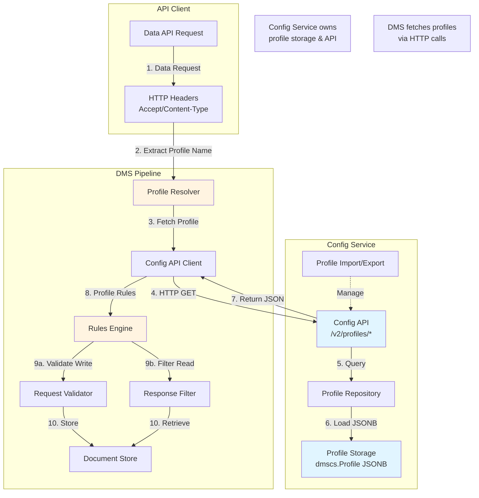
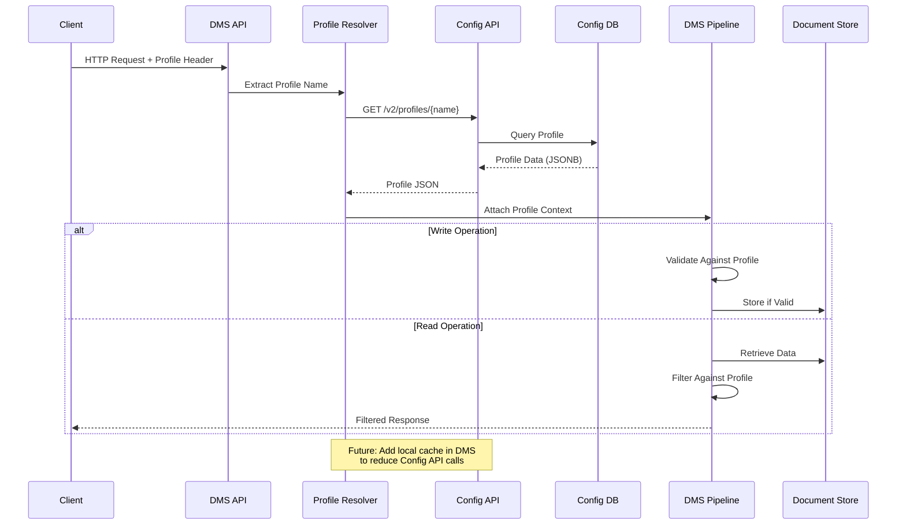
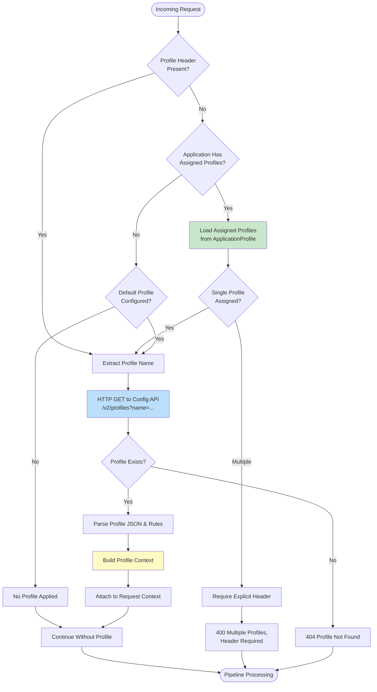
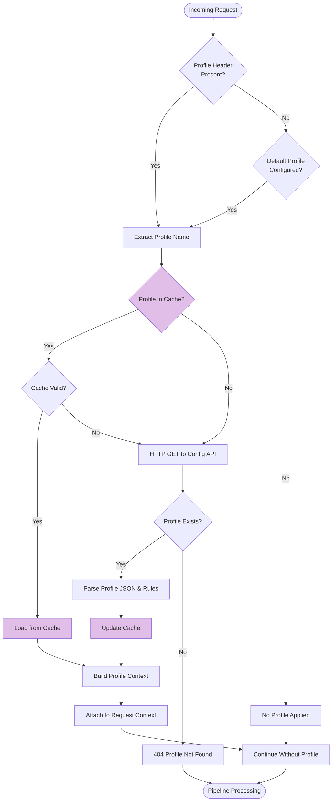
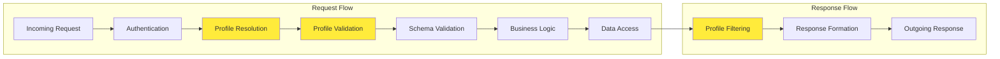

# API Profiles Feature Design - Ed-Fi Data Management Service

## Executive Summary

This document describes the architecture and implementation strategy for adapting the Ed-Fi API Profiles feature from AdminAPI-2.x to the Data Management Service (DMS). API Profiles enable fine-grained data policy enforcement on API resources, controlling which properties, references, and collections are visible or modifiable based on specific operational or regulatory scenarios.

### Architectural Overview

The API Profiles feature is split across two services:

**Config Service** (Profile Management):

- Owns profile storage in `dmscs` schema
- Provides profile management API (`/v2/profiles/*` endpoints)
- Handles XML import/export and JSON storage (JSONB)
- Manages profile lifecycle (create, update, delete, export)

**DMS** (Profile Enforcement):

- Consumes profiles via Config API (HTTP calls)
- Enforces profile rules in request/response pipeline
- No direct database access to profiles
- Validates writes and filters reads based on profile rules

**Key Design Decision**: DMS fetches profiles from Config API on every request (Phase 1). Local caching in DMS is recommended for Phase 2 to improve performance.

## Table of Contents

1. [Problem Definition](#problem-definition)
2. [Conceptual Design](#conceptual-design)
3. [Integration Strategy](#integration-strategy)
4. [Database Schema Design](#database-schema-design)
5. [Profile Resolution Flow](#profile-resolution-flow)
6. [Enforcement Pipeline Architecture](#enforcement-pipeline-architecture)
7. [XML to JSON Conversion Strategy](#xml-to-json-conversion-strategy)
8. [API Specifications](#api-specifications)
9. [Example Profiles](#example-profiles)
10. [Security Considerations](#security-considerations)
11. [Testing Strategy](#testing-strategy)
12. [Appendix A: Implementation Tickets](#appendix-a-implementation-tickets)
13. [Appendix B: XML Schema Definition](#appendix-b-xml-schema-definition)

## Problem Definition

### Background

The Ed-Fi API Profiles feature is a critical capability that enables educational organizations to:

- **Enforce data policies** on API resources based on operational or regulatory requirements
- **Control visibility** of sensitive data elements to different API consumers
- **Restrict update paths** to prevent unauthorized modifications
- **Support multi-tenant scenarios** where different clients have different data access rights

### Current State

The Profiles feature currently exists in the AdminAPI-2.x codebase where:

- Profiles are defined in XML format
- Rules are evaluated at the API layer during request processing
- Profile enforcement is tightly coupled with the API implementation
- Profile management is manual and file-based

### Target State

Moving this capability into DMS will provide:

- **Centralized policy enforcement** - consistent rules across all API operations
- **Dynamic profile management** - database-backed profiles with runtime updates
- **Scalability** - better performance with cached profile rules
- **Maintainability** - separation of concerns between policy and business logic
- **Consistency** - unified approach across the Ed-Fi ecosystem

## Conceptual Design

### Main Principles

1. **Profile-Based Access Control**
   - Profiles act as named policy documents that define resource access patterns
   - Each profile specifies inclusion/exclusion rules for properties, references, and collections
   - Multiple profiles can exist, supporting different consumer roles or scenarios

2. **Database-Backed Storage**
   - Profiles are imported from XML and stored in database tables

3. **Runtime Enforcement**
   - Profile resolution happens early in the request pipeline
   - Rules are applied dynamically to filter request/response data
   - Both read and write operations are subject to profile enforcement

4. **Header-Based Selection**
   - Clients specify profiles via HTTP headers
   - `Accept` header for GET operations (response filtering)
   - `Content-Type` header for POST/PUT operations (request validation)
   - Default profile assignment when header is not specified

5. **Legacy Compatibility**
   - XML remains the canonical format for profile definition
   - Import/export maintains format compatibility with AdminAPI-2.x
   - Existing profile documents can be migrated without modification

### Key Components



## Integration Strategy

### Architecture Overview

The Profiles feature is split across **Config Service** and **DMS**:

**Config Service Responsibilities:**

1. **Storage Layer** - PostgreSQL/MSSQL tables in `dmscs` schema
2. **Repository Layer** - Data access abstractions for profile CRUD
3. **API Layer** - Config API endpoints for profile management (`/v2/profiles/*`)

**DMS Responsibilities:**

1. **Client Layer** - HTTP client to fetch profiles from Config API
2. **Service Layer** - Profile resolution and enforcement logic
3. **Middleware Layer** - Pipeline integration for request/response processing

**Key Architectural Points:**

- **Config Service owns profiles** - All profile storage and management happens in Config Service
- **DMS consumes via API** - DMS has no direct database access; fetches profiles via Config API
- **Separation of concerns** - Config manages metadata, DMS enforces policies

### Request Processing Flow



### Pipeline Integration Points

The profile enforcement integrates into the existing DMS pipeline at specific stages:

1. **Early Pipeline** - Profile resolution (after authentication)
2. **Validation Stage** - Write operation validation (before schema validation)
3. **Processing Stage** - Data filtering (before/after backend operations)
4. **Response Stage** - Response filtering (before serialization)

## Database Schema Design

### Design Philosophy

The profile storage design prioritizes **simplicity and performance** for the primary use case: loading entire profiles for enforcement. Profiles are stored as JSONB documents in PostgreSQL, combining:

- **Simple schema** - Single table (like AdminAPI-2.x)
- **Fast retrieval** - One query loads complete profile
- **Native JSON support** - PostgreSQL JSONB for efficient storage and parsing
- **Easy caching** - Atomic profile documents

### Profile Table

**Location**: Config Service database (`dmscs` schema)

```sql
CREATE TABLE IF NOT EXISTS dmscs.Profile (
    ProfileId BIGINT GENERATED ALWAYS AS IDENTITY (START WITH 1 INCREMENT BY 1) PRIMARY KEY,
    ProfileName VARCHAR(255) NOT NULL,
    ProfileDefinition JSONB NOT NULL,
    CreatedAt TIMESTAMP NOT NULL DEFAULT NOW(),
    CreatedBy VARCHAR(256),
    LastModifiedAt TIMESTAMP,
    ModifiedBy VARCHAR(256),
    
    -- Ensure ProfileDefinition is a valid JSON object
    CONSTRAINT chk_profile_definition_valid 
        CHECK (jsonb_typeof(ProfileDefinition) = 'object')
);

-- Index for profile name lookups (primary use case)
CREATE UNIQUE INDEX IF NOT EXISTS idx_profile_name ON dmscs.Profile (ProfileName);

COMMENT ON COLUMN dmscs.Profile.ProfileId IS 'Profile unique identifier';
COMMENT ON COLUMN dmscs.Profile.ProfileName IS 'Profile name';
COMMENT ON COLUMN dmscs.Profile.ProfileDefinition IS 'Profile definition stored as JSONB';
COMMENT ON COLUMN dmscs.Profile.CreatedAt IS 'Timestamp when the record was created (UTC)';
COMMENT ON COLUMN dmscs.Profile.CreatedBy IS 'User or client ID who created the record';
COMMENT ON COLUMN dmscs.Profile.LastModifiedAt IS 'Timestamp when the record was last modified (UTC)';
COMMENT ON COLUMN dmscs.Profile.ModifiedBy IS 'User or client ID who last modified the record';
```

### Application-Profile Assignment Table

**Purpose**: Links API clients/applications to profiles, enabling automatic profile assignment without explicit header specification.

**Location**: Config Service database (`dmscs` schema)

```sql
CREATE TABLE IF NOT EXISTS dmscs.ApplicationProfile (
    ApplicationId BIGINT NOT NULL,
    ProfileId BIGINT NOT NULL,
    CreatedAt TIMESTAMP NOT NULL DEFAULT NOW(),
    CreatedBy VARCHAR(255),
    LastModifiedAt TIMESTAMP,
    ModifiedBy VARCHAR(255),
    
    -- Composite primary key ensures unique application-profile relationships
    PRIMARY KEY (ApplicationId, ProfileId),
    
    -- Foreign key to Profile table
    CONSTRAINT fk_applicationprofile_profile 
        FOREIGN KEY (ProfileId) 
        REFERENCES dmscs.Profile(ProfileId) 
        ON DELETE CASCADE
    
    -- Foreign key to Application/Client table (assumes existence in auth system)
    -- Note: ApplicationId references the client/application in the auth/admin system
    -- CONSTRAINT fk_applicationprofile_application 
    --     FOREIGN KEY (ApplicationId) 
    --     REFERENCES auth.Application(ApplicationId) 
    --     ON DELETE CASCADE
);

-- Index for profile lookups (reverse lookup: find apps using a profile)
-- Note: ApplicationId is already indexed as part of the primary key
CREATE INDEX IF NOT EXISTS idx_applicationprofile_profileid 
    ON dmscs.ApplicationProfile (ProfileId);

COMMENT ON TABLE dmscs.ApplicationProfile IS 'Junction table linking applications to profiles for automatic profile assignment';
COMMENT ON COLUMN dmscs.ApplicationProfile.ApplicationId IS 'Reference to the API client/application in the auth system';
COMMENT ON COLUMN dmscs.ApplicationProfile.ProfileId IS 'Reference to the profile being assigned';
COMMENT ON COLUMN dmscs.ApplicationProfile.CreatedAt IS 'Timestamp when the assignment was created (UTC)';
COMMENT ON COLUMN dmscs.ApplicationProfile.CreatedBy IS 'User or client ID who created the assignment';
COMMENT ON COLUMN dmscs.ApplicationProfile.LastModifiedAt IS 'Timestamp when the assignment was last modified (UTC)';
COMMENT ON COLUMN dmscs.ApplicationProfile.ModifiedBy IS 'User or client ID who last modified the assignment';
```

**Note**: The `ApplicationId` should reference the client/application table in your authentication/authorization system (e.g., OAuth clients, API keys table). The exact foreign key constraint depends on your auth implementation. The composite primary key `(ApplicationId, ProfileId)` ensures each application-profile relationship is unique and eliminates the need for a surrogate key.

### JSONB Structure

Profile rules are stored in JSONB format, converted from the canonical XML format:

```json
{
  "profileName": "Student-Read-Only",
  "description": "Read-only access to basic student information",
  "resources": [
    {
      "resourceName": "Student",
      "readContentType": {
        "memberSelection": "IncludeOnly",
        "properties": [
          {"name": "studentUniqueId"},
          {"name": "firstName"},
          {"name": "lastSurname"},
          {"name": "birthDate"}
        ],
        "collections": [
          {
            "name": "addresses",
            "memberSelection": "Exclude"
          }
        ],
        "references": [
          {
            "name": "schoolReference",
            "properties": [
              {"name": "schoolId"}
            ]
          }
        ]
      },
      "writeContentType": null
    }
  ]
}
```

**Example with Collection Filters:**

```json
{
  "profileName": "School-Filtered-Addresses",
  "resources": [
    {
      "resourceName": "School",
      "readContentType": {
        "memberSelection": "IncludeOnly",
        "properties": [
          {"name": "schoolId"},
          {"name": "nameOfInstitution"}
        ],
        "collections": [
          {
            "name": "educationOrganizationAddresses",
            "memberSelection": "IncludeOnly",
            "properties": [
              {"name": "addressTypeDescriptor"},
              {"name": "streetNumberName"},
              {"name": "city"},
              {"name": "stateAbbreviationDescriptor"},
              {"name": "postalCode"}
            ],
            "filters": [
              {
                "propertyName": "addressTypeDescriptor",
                "filterMode": "IncludeOnly",
                "values": ["Physical", "Mailing"]
              }
            ]
          }
        ]
      }
    }
  ]
}
```

### Schema Rationale

**Why JSONB over Normalized Tables:**

- **Primary Access Pattern**: Profiles are always loaded in full for enforcement
- **No Complex Queries**: Don't need to query "which profiles affect property X"
- **Atomic Operations**: Single-row updates prevent partial corruption
- **Caching**: Entire profile fits in one cache entry
- **Simplicity**: One table vs. 4+ normalized tables
- **Performance**: Single query vs. multiple joins
- **Compatibility**: Matches AdminAPI-2.x simplicity while improving storage

**Why JSONB over XML Text:**

- **Faster Parsing**: Native JSON support in C# (System.Text.Json)
- **More Compact**: JSONB stores binary format (30-50% smaller than XML)
- **Validation**: Built-in JSON constraint checking
- **PostgreSQL Native**: Efficient storage and retrieval
- **Modern Standard**: JSON is standard for REST APIs

**Why Not GIN Indexing:**

- Profiles are retrieved by name/ID, not by internal content
- Full profile is always needed for enforcement
- Index overhead not justified for this use case
- Simpler = faster for the common case

### SQL Server Compatibility

For SQL Server deployments, the schema uses `NVARCHAR(MAX)` with JSON validation:

```sql
CREATE TABLE dmscs.Profile (
    ProfileId BIGINT IDENTITY(1,1) PRIMARY KEY,
    ProfileName NVARCHAR(255) NOT NULL,
    ProfileDefinition NVARCHAR(MAX) NOT NULL,
    CreatedAt DATETIME2 NOT NULL DEFAULT GETUTCDATE(),
    CreatedBy NVARCHAR(256),
    LastModifiedAt DATETIME2,
    ModifiedBy NVARCHAR(256),
    
    -- Ensure ProfileDefinition is valid JSON
    CONSTRAINT chk_profile_definition_valid 
        CHECK (ISJSON(ProfileDefinition) = 1)
);

CREATE UNIQUE INDEX idx_profile_name 
    ON dmscs.Profile (ProfileName);
```

## Profile Resolution Flow

### Resolution Algorithm

**Phase 1 (Current Implementation - No Cache):**



**Phase 2 (Future with Cache):**



### DMS Profile Resolution Strategy

**Profile Selection Priority** (evaluated in order):

1. **Explicit Header** - Profile specified in HTTP header (Accept/Content-Type)
2. **Application Assignment** - Profile(s) assigned to the authenticated client/application
3. **Default Profile** - System-wide default profile from configuration
4. **No Profile** - Request proceeds without profile enforcement

**Application-Based Profile Assignment:**

When no explicit profile header is provided, DMS:

1. Identifies the authenticated application/client from the auth token
2. Queries assigned profiles from `ApplicationProfile` table via Config API
3. If single profile assigned: automatically applies that profile
4. If multiple profiles assigned: returns 400 error requiring explicit header
5. If no profiles assigned: falls back to default profile or no profile

This matches Ed-Fi ODS API behavior where profiles can be pre-assigned to API consumers.

**Current Approach (Phase 1):**

- DMS fetches profiles from Config API on every request
- Profile name extracted from HTTP headers OR application assignments
- Direct HTTP call to Config API: `GET /v2/profiles?name={profileName}` or `GET /v2/applications/{id}` (with profile data)
- Config API returns profile JSON from `dmscs.Profile` table
- DMS parses and applies rules immediately

**Future Enhancement (Phase 2 - Recommended):**

- Add local caching in DMS to reduce Config API calls
- **Cache Key**: `profile:{profileName}` or `app:{applicationId}:profiles`
- **Cache Value**: Complete parsed profile object(s)
- **Cache Duration**: Configurable (default: 5-15 minutes)
- **Invalidation**: Time-based expiration (eventual consistency acceptable)
- **Benefits**: Reduce latency, decrease load on Config API, improve throughput
- **Consideration**: Profile updates will have propagation delay to DMS instances

## Enforcement Pipeline Architecture

### Middleware Stack



### Write Operation Enforcement

For POST/PUT operations:

1. **Profile Resolution**: Extract profile from `Content-Type` header
2. **Rule Evaluation**: Load property/collection/reference/filter rules
3. **Input Validation**:
   - Check for excluded properties in request body
   - Validate included properties are not missing (if required)
   - Verify collection items conform to profile rules
   - Apply collection item filters (validate descriptor/type values)
   - Ensure references are allowed
4. **Rejection**: Return 400 Bad Request if validation fails
5. **Processing**: Continue to backend if validation passes

**Collection Filter Validation Example:**

If a profile specifies a filter on `AddressTypeDescriptor` with `filterMode="IncludeOnly"` and values `["Physical", "Mailing"]`, then a POST request containing an address with `AddressTypeDescriptor="Temporary"` will be rejected with a 400 Bad Request error.

### Read Operation Enforcement

For GET operations:

1. **Profile Resolution**: Extract profile from `Accept` header
2. **Rule Loading**: Retrieve filtering rules for resource
3. **Data Retrieval**: Fetch data from backend (unfiltered)
4. **Response Filtering**:
   - Remove excluded properties from response
   - Filter collections based on collection rules
   - Apply collection item filters (remove items not matching filter criteria)
   - Apply reference filtering
   - Maintain data structure integrity
5. **Serialization**: Return filtered response

**Collection Filter Processing Example:**

If a profile specifies a filter on `AddressTypeDescriptor` with `filterMode="IncludeOnly"` and values `["Physical", "Mailing"]`, then a GET response will only include addresses where `AddressTypeDescriptor` is either "Physical" or "Mailing". All other address items are removed from the response.

### Error Handling

- **Profile Not Found**: HTTP 404 with descriptive error message
- **Invalid Profile Rules**: HTTP 500 with error details logged
- **Validation Failures**: HTTP 400 with specific rule violations
- **Ambiguous Profile**: HTTP 400 when multiple profiles match

## XML to JSON Conversion Strategy

### Conversion Philosophy

The profile storage uses **JSON as the internal format** while maintaining **XML as the external format** for compatibility with AdminAPI-2.x. This provides the best of both worlds:

- **XML Compatibility**: Import/export maintains AdminAPI-2.x format
- **JSON Efficiency**: Internal storage and processing uses modern JSON
- **Transparent**: Users work with XML, system works with JSON

### Conversion Process

```
Import Flow:
XML File → XML Parser → XML Validator → JSON Converter → JSONB Storage

Export Flow:
JSONB Storage → JSON Loader → XML Converter → XML Validator → XML File
```

### Mapping Example

**XML Input:**

```xml
<Profile name="Student-Read-Only">
  <Resource name="Student">
    <ReadContentType memberSelection="IncludeOnly">
      <Property name="studentUniqueId" />
      <Property name="firstName" />
      <Collection name="addresses" memberSelection="Exclude" />
    </ReadContentType>
  </Resource>
</Profile>
```

**JSONB Storage:**

```json
{
  "profileName": "Student-Read-Only",
  "resources": [
    {
      "resourceName": "Student",
      "readContentType": {
        "memberSelection": "IncludeOnly",
        "properties": [
          { "name": "studentUniqueId" },
          { "name": "firstName" }
        ],
        "collections": [
          { "name": "addresses", "memberSelection": "Exclude" }
        ]
      }
    }
  ]
}
```

**XML Input with Filters:**

```xml
<Profile name="School-Filtered">
  <Resource name="School">
    <ReadContentType memberSelection="IncludeOnly">
      <Property name="schoolId" />
      <Collection name="educationOrganizationAddresses" memberSelection="IncludeOnly">
        <Property name="streetNumberName" />
        <Property name="city" />
        <Filter propertyName="AddressTypeDescriptor" filterMode="IncludeOnly">
          <Value>Physical</Value>
          <Value>Mailing</Value>
        </Filter>
      </Collection>
    </ReadContentType>
  </Resource>
</Profile>
```

**JSONB Storage with Filters:**

```json
{
  "profileName": "School-Filtered",
  "resources": [
    {
      "resourceName": "School",
      "readContentType": {
        "memberSelection": "IncludeOnly",
        "properties": [
          { "name": "schoolId" }
        ],
        "collections": [
          {
            "name": "educationOrganizationAddresses",
            "memberSelection": "IncludeOnly",
            "properties": [
              { "name": "streetNumberName" },
              { "name": "city" }
            ],
            "filters": [
              {
                "propertyName": "addressTypeDescriptor",
                "filterMode": "IncludeOnly",
                "values": ["Physical", "Mailing"]
              }
            ]
          }
        ]
      }
    }
  ]
}
```

### Conversion Rules

1. **Element to Object**: XML elements become JSON objects
2. **Attributes to Properties**: XML attributes become JSON properties
3. **Repeated Elements to Arrays**: Multiple same-named elements become arrays
4. **Case Normalization**: XML PascalCase → JSON camelCase (internally)
5. **Null Handling**: Empty XML elements → null in JSON (or omitted)
6. **Filter Elements**: `<Filter>` elements with `<Value>` children convert to filter objects with values arrays

### Validation Strategy

- **Import**: Validate XML first, then validate converted JSON
- **Export**: Validate JSON structure, then validate generated XML
- **Round-Trip Testing**: Ensure XML → JSON → XML preserves semantics

## API Specifications

### Profile Management API (Config Service)

The profile management endpoints are hosted by the **Config API** (not DMS API) and follow the Config API pattern with AdminAPI-2.x compatibility.

**Base URL**: Config API service (e.g., `https://config-api.example.com`)

**Implementation Note for Tickets**: Each endpoint specification below includes:

- HTTP method and route
- Request headers and body (with examples)
- Success response (with HTTP status and body)
- Error responses (with HTTP status codes)

These specifications should be used as the contract definition when implementing Tickets 2 and 7.

### Profile Endpoints Overview

**Core Profile Endpoints** (modern JSON-based):

| Endpoint | Method | Format | Description |
|----------|--------|--------|-------------|
| `/v2/profiles` | POST | JSON body: `{name, definition: {JSON object}}` | Create profile with JSON definition |
| `/v2/profiles/{id}` | GET | Returns: `{id, name, definition: {JSON object}}` | Get profile with JSON definition |
| `/v2/profiles/{id}` | PUT | JSON body: `{name, definition: {JSON object}}` | Update profile with JSON definition |
| `/v2/profiles/{id}` | DELETE | No body | Delete profile |
| `/v2/profiles` | GET | Query params: offset, limit, orderBy, direction, id, name | List profiles |

**AdminAPI-2.x Compatible Endpoints** (XML-based for backward compatibility):

| Endpoint | Method | Purpose | Format |
|----------|--------|---------|--------|
| `/v2/profiles/xml` | POST | **AdminAPI-2.x compatible creation** | Plain XML in request body |
| `/v2/profiles/import` | POST | **File upload** for bulk migration | Multipart form-data with XML file |
| `/v2/profiles/{id}/export` | GET | **Download as XML file** | Returns XML file |

**Key Points:**

- **Modern API**: Core endpoints (`POST`, `GET`, `PUT`, `DELETE` on `/v2/profiles` and `/v2/profiles/{id}`) use **JSON objects** for profile definitions
- **AdminAPI-2.x Compatibility**: Use `/v2/profiles/xml` and `/v2/profiles/import` for XML-based profile management (backward compatibility)
- **Internal Storage**: All profiles are stored as JSONB internally
- **Transparent Conversion**: XML ↔ JSONB conversion happens automatically for XML endpoints
- **Export**: Use `/v2/profiles/{id}/export` to download profiles as XML files

**Which endpoint should you use?**

- Use standard `POST /v2/profiles` for modern JSON-based profile creation
- Use `POST /v2/profiles/xml` for AdminAPI-2.x compatibility (XML format)
- Use `POST /v2/profiles/import` if you're migrating existing XML files
- Use `GET /v2/profiles/{id}/export` to download profiles as XML files

#### Create Profile

```http
POST /v2/profiles
Content-Type: application/json
Authorization: Bearer {token}
```

**Request Body** (JSON format):

```json
{
  "name": "Student-Read-Only",
  "definition": {
    "profileName": "Student-Read-Only",
    "resources": [
      {
        "resourceName": "Student",
        "readContentType": {
          "memberSelection": "IncludeOnly",
          "properties": [
            {"name": "studentUniqueId"},
            {"name": "firstName"},
            {"name": "lastSurname"},
            {"name": "birthDate"}
          ],
          "collections": [
            {
              "name": "studentEducationOrganizationAssociations",
              "memberSelection": "IncludeOnly",
              "properties": [
                {"name": "educationOrganizationId"},
                {"name": "gradeLevel"}
              ]
            }
          ]
        }
      }
    ]
  }
}
```

**Description**: Creates a profile with a JSON definition. The definition is stored as JSONB internally. Returns 201 Created with the Location header pointing to the newly created profile.

**Important**: The `name` field must match the `profileName` in the `definition` object. If they don't match, the request will be rejected with a 400 Bad Request error.

**Response**:

```http
201 Created
Location: /v2/profiles/12345
```

**Error Responses**:

- `400 Bad Request` - Invalid JSON structure, missing required fields, or invalid profile definition
- `401 Unauthorized` - Missing or invalid authorization token
- `409 Conflict` - Profile with same name already exists

#### List Profiles

```http
GET /v2/profiles?offset={offset}&limit={limit}&orderBy={property}&direction={Ascending|Descending}&id={id}&name={name}
Authorization: Bearer {token}
```

**Description**: Retrieves all profiles using the "Get" search pattern with optional filtering and pagination.

**Query Parameters**:

- `offset` (optional): Number of items to skip before returning results
- `limit` (optional): Maximum number of items to return
- `orderBy` (optional): Property name for sorting (e.g., "name", "id")
- `direction` (optional): Sort direction ("Ascending" or "Descending")
- `id` (optional): Filter by profile ID
- `name` (optional): Filter by profile name

**Response**:

```http
200 OK
Content-Type: application/json
```

```json
[
  {
    "id": 12345,
    "name": "Student-Read-Only"
  },
  {
    "id": 12346,
    "name": "Student-Write-Limited"
  }
]
```

**Error Responses**:

- `401 Unauthorized` - Missing or invalid authorization token
- `400 Bad Request` - Invalid query parameters

#### Get Profile Details

```http
GET /v2/profiles/{id}
Authorization: Bearer {token}
```

**Description**: Retrieves a specific profile based on the identifier, including the full profile definition as a JSON object.

**Response**:

```http
200 OK
Content-Type: application/json
```

```json
{
  "id": 12345,
  "name": "Student-Read-Only",
  "definition": {
    "profileName": "Student-Read-Only",
    "resources": [
      {
        "resourceName": "Student",
        "readContentType": {
          "memberSelection": "IncludeOnly",
          "properties": [
            {"name": "studentUniqueId"},
            {"name": "firstName"},
            {"name": "lastSurname"},
            {"name": "birthDate"}
          ],
          "collections": [
            {
              "name": "studentEducationOrganizationAssociations",
              "memberSelection": "IncludeOnly",
              "properties": [
                {"name": "educationOrganizationId"},
                {"name": "gradeLevel"}
              ]
            }
          ],
          "references": [
            {
              "name": "schoolReference",
              "properties": [
                {"name": "schoolId"}
              ]
            }
          ]
        }
      }
    ]
  }
}
```

**Error Responses**:

- `404 Not Found` - Profile with specified ID does not exist
- `401 Unauthorized` - Missing or invalid authorization token

#### Update Profile

```http
PUT /v2/profiles/{id}
Content-Type: application/json
Authorization: Bearer {token}
```

**Request Body** (JSON format):

```json
{
  "name": "Student-Read-Only-Updated",
  "definition": {
    "profileName": "Student-Read-Only-Updated",
    "resources": [
      {
        "resourceName": "Student",
        "readContentType": {
          "memberSelection": "IncludeOnly",
          "properties": [
            {"name": "studentUniqueId"},
            {"name": "firstName"},
            {"name": "lastSurname"}
          ]
        }
      }
    ]
  }
}
```

**Description**: Updates a profile based on the resource identifier. The ID in the JSON body is ignored if provided. The definition is validated and stored as JSONB.

**Important**: The `name` field must match the `profileName` in the `definition` object. If they don't match, the request will be rejected with a 400 Bad Request error.

**Response**:

```http
200 OK
```

**Error Responses**:

- `404 Not Found` - Profile with specified ID does not exist
- `400 Bad Request` - Invalid JSON structure, missing required fields, or invalid profile definition
- `401 Unauthorized` - Missing or invalid authorization token

#### Delete Profile

```http
DELETE /v2/profiles/{id}
Authorization: Bearer {token}
```

**Description**: Deletes an existing profile using the resource identifier. Returns an error if the resource doesn't exist.

**Response**:

```http
200 OK
```

**Error Responses**:

- `404 Not Found` - Profile with specified ID does not exist
- `401 Unauthorized` - Missing or invalid authorization token

#### Import Profile from XML File (Extended Endpoint)

```http
POST /v2/profiles/import
Content-Type: multipart/form-data
Authorization: Bearer {token}
```

**Request**: Multipart form with XML file

```
------WebKitFormBoundary
Content-Disposition: form-data; name="file"; filename="Student-Read-Only.xml"
Content-Type: application/xml

<?xml version="1.0" encoding="utf-8"?>
<Profile name="Student-Read-Only">
  <Resource name="Student">
    <ReadContentType memberSelection="IncludeOnly">
      <Property name="StudentUniqueId" />
      <Property name="FirstName" />
    </ReadContentType>
  </Resource>
</Profile>
------WebKitFormBoundary--
```

**Description**: Imports a profile from an AdminAPI-2.x compatible XML file upload. Validates XML structure, converts to internal JSONB format, and stores in the database. This endpoint provides backward compatibility for existing profile definitions. Returns 201 Created with the Location header pointing to the newly created profile.

**Response**:

```http
201 Created
Location: /v2/profiles/12345
```

**Error Responses**:

- `400 Bad Request` - Invalid XML format or schema validation failed
- `401 Unauthorized` - Missing or invalid authorization token
- `409 Conflict` - Profile with same name already exists
- `413 Payload Too Large` - File size exceeds maximum allowed

#### Create Profile from XML (Extended Endpoint)

```http
POST /v2/profiles/xml
Content-Type: application/xml
Authorization: Bearer {token}
```

**Request Body** (XML format - AdminAPI-2.x compatible):

```
{
  "name": "Student-Read-Only",
  "definition": "<?xml version=\"1.0\" encoding=\"utf-8\"?><Profile name=\"Student-Read-Only\"><Resource name=\"Student\"><ReadContentType memberSelection=\"IncludeOnly\"><Property name=\"StudentUniqueId\" /><Property name=\"FirstName\" /><Property name=\"LastSurname\" /><Property name=\"BirthDate\" /><Reference name=\"SchoolReference\"><Property name=\"SchoolId\" /></Reference><Collection name=\"StudentEducationOrganizationAssociations\" memberSelection=\"IncludeOnly\"><Property name=\"EducationOrganizationId\" /><Property name=\"GradeLevel\" /></Collection></ReadContentType></Resource></Profile>"
}
```

For XML:

```xml
<?xml version="1.0" encoding="utf-8"?>
<Profile name="Student-Read-Only">
  <Resource name="Student">
    <ReadContentType memberSelection="IncludeOnly">
      <Property name="StudentUniqueId" />
      <Property name="FirstName" />
      <Property name="LastSurname" />
      <Property name="BirthDate" />
      <Reference name="SchoolReference">
        <Property name="SchoolId" />
      </Reference>
      <Collection name="StudentEducationOrganizationAssociations" memberSelection="IncludeOnly">
        <Property name="EducationOrganizationId" />
        <Property name="GradeLevel" />
      </Collection>
    </ReadContentType>
  </Resource>
</Profile>
```

**Description**: Creates or updates a profile using AdminAPI-2.x XML format. The XML is validated and converted to internal JSONB format for storage. This endpoint provides backward compatibility for clients that generate profiles programmatically in XML format. Returns 201 Created with the Location header pointing to the newly created profile.

**Response**:

```http
201 Created
Location: /v2/profiles/12345
```

**Error Responses**:

- `400 Bad Request` - Invalid XML format or schema validation failed
- `401 Unauthorized` - Missing or invalid authorization token
- `409 Conflict` - Profile with same name already exists

#### Export Profile (Extended Endpoint)

```http
GET /v2/profiles/{id}/export
Authorization: Bearer {token}
```

**Description**: Exports a profile as an XML file download. Converts from internal JSON to AdminAPI-2.x compatible XML.

**Response**:

```http
200 OK
Content-Type: application/xml
Content-Disposition: attachment; filename="Student-Read-Only.xml"
```

```xml
<?xml version="1.0" encoding="utf-8"?>
<Profile name="Student-Read-Only">
  <Resource name="Student">
    <ReadContentType memberSelection="IncludeOnly">
      <Property name="StudentUniqueId" />
      <Property name="FirstName" />
      <Property name="LastSurname" />
      <Property name="BirthDate" />
      <Reference name="SchoolReference">
        <Property name="SchoolId" />
      </Reference>
      <Collection name="StudentEducationOrganizationAssociations" memberSelection="IncludeOnly">
        <Property name="EducationOrganizationId" />
        <Property name="GradeLevel" />
      </Collection>
    </ReadContentType>
  </Resource>
</Profile>
```

**Error Responses**:

- `404 Not Found` - Profile with specified ID does not exist
- `401 Unauthorized` - Missing or invalid authorization token
- `500 Internal Server Error` - XML generation failed

### Application Profile Assignment (Config Service)

Profile assignment to applications is managed through the existing **Applications API** with an enhanced request body that includes profile assignments.

#### Create/Update Application with Profile Assignment

```http
POST /v2/applications
Content-Type: application/json
Authorization: Bearer {token}
```

**Request Body** (Enhanced with Profile Assignment):

```json
{
  "applicationName": "Student Information System",
  "claimSetName": "SIS Vendor",
  "educationOrganizationIds": [255901],
  "vendorId": 1,
  "profileIds": [67890, 67891]
}
```

**Description**: Creates or updates an application/client. The `profileIds` array assigns profiles to the application. When this application makes API requests without explicit profile headers, the assigned profiles will be considered for automatic application. The endpoint manages the `ApplicationProfile` table entries automatically.

- If `profileIds` is empty or omitted: No profiles assigned (removes all existing assignments on update)
- If `profileIds` has one profile: That profile is automatically applied to requests
- If `profileIds` has multiple profiles: API client must specify which one to use via HTTP headers

**Response**:

```http
201 Created
Location: /v2/applications/12345
```

```json
{
  "id": 12345,
  "applicationName": "Student Information System",
  "claimSetName": "SIS Vendor",
  "profileIds": [67890, 67891]
}
```

**Error Responses**:

- `400 Bad Request` - Invalid request body or profile IDs don't exist
- `401 Unauthorized` - Missing or invalid authorization token
- `404 Not Found` - Vendor or ClaimSet does not exist
- `409 Conflict` - Application name already exists

**Implementation Notes**:

- On create/update, the endpoint automatically manages `ApplicationProfile` table entries
- Previous profile assignments are replaced with the new `profileIds` array
- Profile ID validation ensures all referenced profiles exist
- Transaction ensures atomic updates (application + profile assignments)

#### Get Application with Assigned Profiles

```http
GET /v2/applications/{id}
Authorization: Bearer {token}
```

**Description**: Retrieves application details including assigned profiles.

**Response**:

```http
200 OK
Content-Type: application/json
```

```json
{
  "id": 12345,
  "applicationName": "Student Information System",
  "claimSetName": "SIS Vendor",
  "educationOrganizationIds": [255901],
  "vendorId": 1,
  "profileIds": [67890, 67891],
  "profiles": [
    {
      "profileId": 67890,
      "profileName": "Student-Read-Only"
    },
    {
      "profileId": 67891,
      "profileName": "Assessment-Limited"
    }
  ]
}
```

**Note**: The `profiles` array includes profile names for convenience. This is the endpoint DMS calls during profile resolution to get the application's assigned profiles.

#### List Applications with Profile Filter

```http
GET /v2/applications?profileId={id}
Authorization: Bearer {token}
```

**Query Parameters**:

- `profileId` (optional): Filter applications that have this profile assigned
- Standard pagination parameters (offset, limit, orderBy, direction)

**Description**: Retrieves all applications, optionally filtered by assigned profile. Useful for determining which applications use a specific profile.

**Response**:

```http
200 OK
Content-Type: application/json
```

```json
[
  {
    "id": 12345,
    "applicationName": "Student Information System",
    "claimSetName": "SIS Vendor",
    "profileIds": [67890, 67891]
  }
]
```

### Data API with Profiles

#### Read with Profile

```http
GET /data/v3/ed-fi/students/{id}
Accept: application/json;profile=student-read-only
Authorization: Bearer {token}
```

#### Write with Profile

```http
POST /data/v3/ed-fi/students
Content-Type: application/json;profile=student-write-limited
Authorization: Bearer {token}

{student-data}
```

## Example Profiles

### Example 1: Student Read-Only Profile

```xml
<?xml version="1.0" encoding="utf-8"?>
<Profile name="Student-Read-Only">
  <Resource name="Student">
    <ReadContentType memberSelection="IncludeOnly">
      <Property name="StudentUniqueId" />
      <Property name="FirstName" />
      <Property name="LastSurname" />
      <Property name="BirthDate" />
      <Reference name="SchoolReference">
        <Property name="SchoolId" />
      </Reference>
      <Collection name="StudentEducationOrganizationAssociations" memberSelection="IncludeOnly">
        <Property name="EducationOrganizationId" />
        <Property name="GradeLevel" />
      </Collection>
    </ReadContentType>
  </Resource>
</Profile>
```

**Use Case**: External reporting system that only needs basic student demographics and school associations.

### Example 2: Student Write-Limited Profile

```xml
<?xml version="1.0" encoding="utf-8"?>
<Profile name="Student-Write-Limited">
  <Resource name="Student">
    <WriteContentType memberSelection="IncludeOnly">
      <Property name="StudentUniqueId" />
      <Property name="FirstName" />
      <Property name="MiddleName" />
      <Property name="LastSurname" />
      <Property name="BirthDate" />
      <Property name="BirthCity" />
      <Property name="BirthStateAbbreviation" />
      <Reference name="SchoolReference">
        <Property name="SchoolId" />
      </Reference>
      <Collection name="Addresses" memberSelection="IncludeOnly">
        <Property name="AddressType" />
        <Property name="StreetNumberName" />
        <Property name="City" />
        <Property name="StateAbbreviation" />
        <Property name="PostalCode" />
      </Collection>
    </WriteContentType>
  </Resource>
</Profile>
```

**Use Case**: Student information system integration that can update basic demographics and addresses, but not assessment or program data.

### Example 3: Assessment Limited Profile

```xml
<?xml version="1.0" encoding="utf-8"?>
<Profile name="Assessment-Limited">
  <Resource name="StudentAssessment">
    <ReadContentType memberSelection="ExcludeOnly">
      <Collection name="StudentAssessmentAccommodations" memberSelection="ExcludeAll" />
      <Collection name="StudentAssessmentStudentObjectiveAssessments" memberSelection="ExcludeAll" />
    </ReadContentType>
  </Resource>
</Profile>
```

**Use Case**: Assessment vendor that can read basic assessment results but not accommodations or detailed objectives.

### Example 4: School Minimal Profile

```xml
<?xml version="1.0" encoding="utf-8"?>
<Profile name="School-Minimal">
  <Resource name="School">
    <ReadContentType memberSelection="IncludeOnly">
      <Property name="SchoolId" />
      <Property name="NameOfInstitution" />
      <Property name="OperationalStatus" />
      <Property name="SchoolType" />
      <Reference name="LocalEducationAgencyReference">
        <Property name="LocalEducationAgencyId" />
      </Reference>
    </ReadContentType>
  </Resource>
</Profile>
```

**Use Case**: Public-facing school directory that only shows basic information.

### Example 5: Descriptor Full Access Profile

```xml
<?xml version="1.0" encoding="utf-8"?>
<Profile name="Descriptor-Full">
  <Resource name="Descriptor">
    <ReadContentType memberSelection="IncludeAll" />
    <WriteContentType memberSelection="IncludeAll" />
  </Resource>
</Profile>
```

**Use Case**: Administrator with full access to manage descriptors.

### Example 6: School with Filtered Addresses

```xml
<?xml version="1.0" encoding="utf-8"?>
<Profile name="School-Filtered-Addresses">
  <Resource name="School">
    <ReadContentType memberSelection="IncludeOnly">
      <Property name="SchoolId" />
      <Property name="NameOfInstitution" />
      <Property name="OperationalStatusDescriptor" />
      <Property name="SchoolTypeDescriptor" />
      
      <Reference name="LocalEducationAgencyReference">
        <Property name="LocalEducationAgencyId" />
      </Reference>
      
      <!-- Only show Physical and Mailing addresses -->
      <Collection name="EducationOrganizationAddresses" memberSelection="IncludeOnly">
        <Property name="AddressTypeDescriptor" />
        <Property name="StreetNumberName" />
        <Property name="City" />
        <Property name="StateAbbreviationDescriptor" />
        <Property name="PostalCode" />
        
        <!-- Filter: Only include Physical and Mailing addresses -->
        <Filter propertyName="AddressTypeDescriptor" filterMode="IncludeOnly">
          <Value>Physical</Value>
          <Value>Mailing</Value>
        </Filter>
      </Collection>
      
      <!-- Exclude emergency contact numbers -->
      <Collection name="EducationOrganizationInstitutionTelephones" memberSelection="IncludeOnly">
        <Property name="TelephoneNumber" />
        <Property name="TelephoneNumberTypeDescriptor" />
        
        <!-- Filter: Exclude emergency numbers -->
        <Filter propertyName="TelephoneNumberTypeDescriptor" filterMode="ExcludeOnly">
          <Value>Emergency 1</Value>
          <Value>Emergency 2</Value>
        </Filter>
      </Collection>
    </ReadContentType>
  </Resource>
</Profile>
```

**Use Case**: Public-facing school directory that only shows physical and mailing addresses, and excludes emergency contact numbers. Demonstrates collection item filtering using Filter elements with both IncludeOnly and ExcludeOnly filter modes.

## Security Considerations

### Authentication and Authorization

- Profile management APIs require admin-level authorization
- Profile selection does not bypass authentication requirements
- Profiles enforce data filtering but do not replace authorization

### Data Privacy

- Profiles support FERPA/GDPR compliance by restricting PII
- Sensitive fields can be excluded from specific profiles
- Audit logging tracks which profiles are used for data access

### Performance and DoS Protection

- Profile cache prevents excessive database queries
- Rate limiting applied to profile management APIs
- Large profiles validated for complexity before import

### Validation

- XML schema validation prevents malformed profiles
- Rule conflict detection before activation
- Profile testing framework for pre-production validation

## Testing Strategy

### Unit Tests

- XML parsing and serialization
- Rule evaluation logic
- Header parsing
- Cache operations
- Individual middleware components

### Integration Tests

- End-to-end profile import/export
- Request pipeline with profiles
- Multi-resource profile scenarios
- Error handling paths

### Performance Tests

- Profile resolution throughput
- Enforcement overhead measurement
- Cache effectiveness validation
- Large document handling

### Compatibility Tests

- AdminAPI-2.x profile import
- XML format validation
- Identical behavior verification

## References

- [AdminAPI-2.x Repository](https://github.com/Ed-Fi-Alliance-OSS/AdminAPI-2.x)
- [Data Management Service Repository](https://github.com/Ed-Fi-Alliance-OSS/Data-Management-Service)
- [Project Tanager Documentation](https://github.com/Ed-Fi-Alliance-OSS/Project-Tanager)
- [Ed-Fi Documentation](https://docs.ed-fi.org/)
- [Ed-Fi API Profiles Specification](https://edfi.atlassian.net/wiki/spaces/ODSAPIS3V71/pages/25493665/API+Profiles)

## Glossary

- **Profile**: Named set of rules that control resource visibility and modification
- **Content Type**: Media type identifier including profile designation
- **Rule**: Specific directive to include/exclude resource elements
- **Property**: Simple scalar field on a resource
- **Collection**: Array of child objects on a resource
- **Reference**: Link to another resource
- **Filter**: Rule to include/exclude collection items based on Type or Descriptor values
- **Member Selection**: Strategy for including/excluding elements (IncludeOnly, ExcludeOnly, IncludeAll, ExcludeAll)
- **Filter Mode**: Strategy for filtering collection items (IncludeOnly, ExcludeOnly)

## Appendix A: Implementation Tickets

### Ticket Breakdown Strategy

The API Profiles feature is broken down into **12 focused tickets** to ensure:

- **Clear definition of done** for each ticket
- **Manageable scope** for effective implementation
- **Parallel development** opportunities
- **Incremental delivery** and testing
- **Reduced risk** through smaller, testable units

**Ticket Dependencies:**

```
Config Service:
Ticket 1 (Database Foundation) ────┐
    ↓                               │
Ticket 2 (Import & Basic API) ─────┤
    ↓                               │
Ticket 7 (Export & Management) ────┤
                                    │
DMS:                                │
Ticket 3 (Profile Resolution) ◄────┘
    ↓
Ticket 4 (Rule Engine)
    ↓
Ticket 5 (Write Enforcement)
    ↓
Ticket 6 (Read Filtering)
    ↓
Ticket 8 (Profile Selection)
    ↓
Ticket 12 (Local Caching) [Optional - Phase 2]
    ↓
Ticket 9 (Core Documentation)
    ↓
Ticket 10 (Example Profiles)
    ↓
Ticket 11 (Migration Guide)
```

**Component Breakdown:**

- **Config Service**: Tickets 1, 2, 7 - Profile storage, management API, import/export
- **DMS**: Tickets 3-6, 8, 12 - Profile consumption, enforcement, selection, caching
- **Documentation**: Tickets 9-11 - Core docs, examples, migration guide

**Key Benefits of This Breakdown:**

- **Tickets 1-2** (Config Service) establish profile storage and basic API
- **Ticket 3** (DMS) creates integration layer to fetch profiles from Config API
- **Tickets 4-6** (DMS) build enforcement pipeline incrementally (rule engine, write validation, read filtering)
- **Ticket 7** (Config Service) adds export and advanced management features
- **Ticket 8** (DMS) implements profile selection mechanism via HTTP headers
- **Ticket 12** (DMS) adds local caching for performance optimization (Phase 2 - optional)
- **Tickets 9-11** (Documentation) provide comprehensive documentation, examples, and migration guides

---

### Ticket 1: Profile Storage Foundation (Config Service)

**Epic**: Profile Management Infrastructure

**User Story**: As a Config Service developer, I need the database schema and data access layer for profiles in the Config Service, so that profile data can be persisted and retrieved efficiently.

**Acceptance Criteria**:

- [ ] Profile table schema created in `dmscs` schema (Profile table with JSONB column)
- [ ] ApplicationProfile table schema created in `dmscs` schema (links applications to profiles)
- [ ] Database migration script supports PostgreSQL and SQL Server
- [ ] Repository layer implemented with CRUD operations in Config Service
- [ ] JSONB serialization/deserialization working correctly
- [ ] Profile models defined (ProfileEntity, ProfileDto)
- [ ] ApplicationProfile models defined (ApplicationProfileEntity)
- [ ] Transaction support for atomic operations
- [ ] Database indexes created for performance
- [ ] Foreign key constraints properly configured
- [ ] Unit tests for repository layer
- [ ] Integration tests for database operations

**Technical Implementation Details**:

1. **Database Migration Script** (Config Service - Create_Profile_Tables.sql):
   - Create Profile table with JSONB column in `dmscs` schema
   - Create ApplicationProfile table for application-to-profile assignments
   - Composite primary key on (ApplicationId, ProfileId) for ApplicationProfile
   - Add indexes for ProfileName and ProfileId (reverse lookup)
   - Support both PostgreSQL (JSONB) and MSSQL (NVARCHAR(MAX) with JSON validation)
   - Constraints for data integrity and foreign keys
   - Audit columns (CreatedAt, CreatedBy, LastModifiedAt, ModifiedBy) on both tables

2. **Profile Models** (Config Service - ProfileEntity.cs, ProfileDto.cs):
   - ProfileEntity: Database entity with JSONB definition
   - ProfileDto: API data transfer object
   - ApplicationProfileEntity: Links ApplicationId to ProfileId
   - Mapping between entity and DTO

3. **Repository Layer** (Config Service - IProfileRepository.cs, ProfileRepository.cs, IApplicationProfileRepository.cs):
   - Profile CRUD operations: Create, Read, Update, Delete
   - ApplicationProfile operations: Create, Delete, GetByApplicationId, GetByProfileId
   - GetByName, GetById, GetAll with pagination
   - Transaction support for atomic updates (especially when managing profile assignments)
   - JSONB serialization/deserialization

**Dependencies**:

- Database access framework (Npgsql/Dapper)
- JSON serialization (System.Text.Json)

**Component**: Config Service

**Reference**: [API Profiles Design Document](https://github.com/Ed-Fi-Alliance-OSS/Data-Management-Service/blob/main/docs/Profiles/API-PROFILES-DESIGN.md)

---

### Ticket 2: Profile Import and Basic API (Config Service)

**Epic**: Profile Management Infrastructure

**User Story**: As a DMS administrator, I can import API Profile XML documents and retrieve stored profiles through the Config API, so that I can manage profile definitions.

**Acceptance Criteria**:

- [ ] XML to JSON converter implemented in Config Service
- [ ] JSON schema validation for profile structure
- [ ] XML format validation (schema compliance)
- [ ] Profiles correctly converted from XML and stored as JSONB in `dmscs.Profile`
- [ ] Support for all rule types: properties, collections, references, descriptors
- [ ] Profile import endpoint created in Config API (`POST /v2/profiles/import`)
- [ ] Profile create endpoint created in Config API (`POST /v2/profiles`)
- [ ] Profile list endpoint available in Config API (`GET /v2/profiles`)
- [ ] Profile detail endpoint available in Config API (`GET /v2/profiles/{id}`)
- [ ] Error handling for malformed XML/JSON
- [ ] Duplicate profile checking
- [ ] Unit tests for XML→JSON conversion
- [ ] Integration tests for import API

**Technical Implementation Details**:

1. **XML to JSON Converter** (Config Service - ProfileXmlToJsonConverter.cs):
   - Parse XML using System.Xml.Linq
   - Transform to JSON structure matching JSONB schema
   - Preserve all rule semantics (properties, collections, references)
   - Validate against JSON schema
   - Handle all member selection types

2. **JSON to XML Converter** (Config Service - ProfileJsonToXmlConverter.cs):
   - Convert internal JSONB back to XML format
   - Required for validation and export functionality
   - Ensure round-trip conversion accuracy

3. **Service Layer** (Config Service - ProfileImportService.cs):
   - Orchestrate XML parsing and JSON conversion
   - Store JSONB in `dmscs.Profile` via repository
   - Transaction management
   - Validation and error handling
   - Duplicate profile checking

4. **API Endpoints** (Config API - ProfileController.cs):
   - POST /v2/profiles/import - File upload endpoint (accepts XML)
   - POST /v2/profiles - Create profile with JSON
   - POST /v2/profiles/xml - Create profile with XML string
   - GET /v2/profiles - List profiles with pagination
   - GET /v2/profiles/{id} - Get profile details
   - Authorization (admin only)
   - Request/response DTOs

**Dependencies**:

- Profile repository (Ticket 1)
- XML parsing libraries (System.Xml.Linq)
- File upload handling (ASP.NET Core)

**Component**: Config Service

**Reference**: [API Profiles Design Document](https://github.com/Ed-Fi-Alliance-OSS/Data-Management-Service/blob/main/docs/Profiles/API-PROFILES-DESIGN.md)

---

### Ticket 3: Profile Resolution Infrastructure (DMS)

**Epic**: Profile Enforcement

**User Story**: As the DMS system, I can resolve profiles from HTTP headers or application assignments by fetching them from Config API, so that profile enforcement can be performed.

**Acceptance Criteria**:

- [ ] Profile resolver middleware implemented and integrated in DMS
- [ ] Profile resolution from HTTP headers (Accept/Content-Type) - highest priority
- [ ] Profile resolution from application assignment (via GET /v2/applications/{id}) - secondary priority
- [ ] HTTP client to fetch profiles from Config API (`GET /v2/profiles?name={name}`)
- [ ] HTTP client to fetch application profiles from Config API (`GET /v2/applications/{id}`)
- [ ] Extract application ID from authentication context (JWT claims)
- [ ] Support for default profile assignment (lowest priority)
- [ ] Implement profile resolution priority: header → application → default → none
- [ ] Error responses for profile not found (404 from Config API)
- [ ] Profile context attached to HttpContext
- [ ] Retry logic for Config API calls (with circuit breaker)
- [ ] Unit tests for resolution logic (all priority levels)
- [ ] Integration tests for header parsing, application resolution, and Config API integration
- [ ] Performance tests validate acceptable latency

**Technical Implementation Details**:

1. **Profile Resolution Middleware** (DMS - ProfileResolutionMiddleware.cs):
   - Extract profile name from Accept/Content-Type headers (priority 1)
   - If no header, extract application ID from auth context
   - If application ID present, call GET /v2/applications/{id} to get assigned profiles
   - If application has profiles, use first assigned profile (priority 2)
   - If no header and no application profiles, use default profile (priority 3)
   - Call Config API to fetch profile by name
   - Attach profile context to HttpContext
   - Handle missing/invalid profiles
   - Error handling with appropriate HTTP status codes

2. **Config API Client** (DMS - IConfigApiClient.cs, ConfigApiClient.cs):
   - HTTP client to fetch profiles: `GET /v2/profiles?name={profileName}`
   - HTTP client to fetch applications: `GET /v2/applications/{id}` (returns profiles array)
   - Resilience patterns (retry, circuit breaker, timeout)
   - Deserialization of profile JSON
   - Error handling for API failures

3. **Profile Context** (DMS - ProfileContext.cs):
   - Container for profile metadata and rules
   - Efficient rule lookup structures (dictionaries/sets)
   - Immutable design for thread safety
   - Parsed from Config API JSON response
   - Include profile source metadata (header/application/default)

4. **Application Context Extraction**:
   - Extract application ID from JWT claims (e.g., "application_id" claim)
   - Cache application-to-profile mapping to reduce Config API calls
   - Handle missing application ID gracefully (proceed to default profile)

**Pipeline Integration**:

```
[Auth] -> [ProfileResolution] -> [ParsePath] -> [BuildResourceInfo] -> [ParseBody] -> ...
```

**Profile Resolution Algorithm**:

```
1. Check Accept/Content-Type header for profile parameter
   - If found: resolve by name and use
2. If no header, extract application ID from JWT claims
   - If found: call GET /v2/applications/{id}
   - If application has profiles: use first profile
3. If no header and no application profiles, use default profile (if configured)
4. If no profile resolved, proceed without profile (no filtering)
```

**Dependencies**:

- Config API profile endpoints (Ticket 2)
- Config API applications endpoint (Ticket 7a)
- Request pipeline infrastructure
- HTTP client factory (Polly for resilience)
- Authentication middleware (for application ID extraction)

**Component**: DMS

**Reference**: [API Profiles Design Document](https://github.com/Ed-Fi-Alliance-OSS/Data-Management-Service/blob/main/docs/Profiles/API-PROFILES-DESIGN.md)

**Note**: Phase 2 should add local caching in DMS to reduce Config API calls and improve performance.

---

### Ticket 4: Profile Rule Evaluation Engine

**Epic**: Profile Enforcement

**User Story**: As the enforcement pipeline, I need a rule evaluation engine that can efficiently determine which properties, collections, and references are allowed or excluded based on profile rules.

**Acceptance Criteria**:

- [ ] Rule evaluation engine implemented
- [ ] Recursive property path matching works correctly
- [ ] Include/exclude logic correctly applied
- [ ] Collection rule evaluation implemented
- [ ] Collection item filter evaluation implemented (Filter elements)
- [ ] Reference rule evaluation implemented
- [ ] Nested property filtering supported
- [ ] Performance optimizations applied (compiled expressions)
- [ ] Unit tests for all rule types including filters

**Technical Implementation Details**:

1. **Rule Evaluation Engine** (ProfileRuleEvaluator.cs):
   - Recursive property path matching
   - Include/exclude logic resolution (IncludeOnly, ExcludeOnly, IncludeAll, ExcludeAll)
   - Collection item filtering (evaluate Filter elements with propertyName and values)
   - Reference filtering
   - Performance optimizations (compiled expressions, cached lookups)

2. **Rule Models** (ProfileRule.cs, PropertyRule.cs, CollectionRule.cs, ReferenceRule.cs, FilterRule.cs):
   - Strongly-typed rule representations
   - FilterRule: propertyName, filterMode (IncludeOnly/ExcludeOnly), values array
   - Rule validation logic
   - Rule comparison and matching

3. **Path Resolver** (PropertyPathResolver.cs):
   - Parse JSON paths (e.g., "student.addresses[0].city")
   - Navigate nested structures
   - Handle array indexing

**Dependencies**:

- Profile context (Ticket 3)
- JSON manipulation libraries

**Reference**: [API Profiles Design Document](https://github.com/Ed-Fi-Alliance-OSS/Data-Management-Service/blob/main/docs/Profiles/API-PROFILES-DESIGN.md)

---

### Ticket 5: Write Operation Profile Enforcement

**Epic**: Profile Enforcement

**User Story**: When a user submits write operations (POST/PUT/PATCH) through the DMS, the system validates the request against profile rules and rejects requests that violate the profile.

**Acceptance Criteria**:

- [ ] Write enforcement middleware implemented and integrated
- [ ] Request validation enforces profile rules
- [ ] Excluded properties are rejected
- [ ] Collection items validated against rules
- [ ] Collection item filters validated (reject items not matching filter criteria)
- [ ] Reference compliance verified
- [ ] Clear error messages for violations (HTTP 400)
- [ ] All resource types supported (resources, descriptors)
- [ ] Unit tests for validation logic
- [ ] Integration tests for write operations with profiles

**Technical Implementation Details**:

1. **Write Enforcement Middleware** (ProfileWriteValidationMiddleware.cs):
   - Integrate after ParseBodyMiddleware
   - Traverse JSON document against profile rules
   - Check for excluded properties in request body
   - Validate collection items
   - Verify reference compliance
   - Build detailed violation messages

2. **Validation Result** (ProfileValidationResult.cs):
   - Container for validation errors
   - Property path to violation message mapping
   - HTTP response formatting

**Pipeline Integration**:

```
[ParseBody] -> [ProfileWriteValidation] -> [SchemaValidation] -> [Handler]
```

**Dependencies**:

- Profile context (Ticket 3)
- Rule evaluation engine (Ticket 4)
- Request pipeline infrastructure

**Reference**: [API Profiles Design Document](https://github.com/Ed-Fi-Alliance-OSS/Data-Management-Service/blob/main/docs/Profiles/API-PROFILES-DESIGN.md)

---

### Ticket 6: Read Operation Profile Filtering

**Epic**: Profile Enforcement

**User Story**: When a user performs read operations (GET) through the DMS, the system filters the response based on profile rules to ensure only allowed data is returned.

**Acceptance Criteria**:

- [ ] Read filtering middleware implemented and integrated
- [ ] Response filtering enforces profile rules
- [ ] Excluded properties removed from response
- [ ] Collection filtering preserves data integrity
- [ ] Collection item filters applied (remove items not matching filter criteria)
- [ ] Reference filtering applied correctly
- [ ] Data structure integrity maintained after filtering
- [ ] All resource types supported (resources, descriptors)
- [ ] Unit tests for filtering logic including filter elements
- [ ] Integration tests for read operations with profiles

**Technical Implementation Details**:

1. **Read Enforcement Middleware** (ProfileReadFilteringMiddleware.cs):
   - Integrate before response serialization
   - Filter response JSON based on rules
   - Remove excluded properties
   - Filter collections (remove items or properties)
   - Apply reference filters
   - Maintain JSON structure integrity

2. **JSON Filter** (JsonProfileFilter.cs):
   - In-place JSON modification
   - Efficient property removal
   - Array filtering (remove items not matching Filter criteria)
   - Collection item filter evaluation (check descriptor/type values)
   - Nested object traversal

**Pipeline Integration**:

```
[Handler] -> [ProfileReadFiltering] -> [ResponseSerialization]
```

**Dependencies**:

- Profile context (Ticket 3)
- Rule evaluation engine (Ticket 4)
- Response pipeline infrastructure

**Reference**: [API Profiles Design Document](https://github.com/Ed-Fi-Alliance-OSS/Data-Management-Service/blob/main/docs/Profiles/API-PROFILES-DESIGN.md)

---

### Ticket 7: Admin API - Profile Export and Management (Config Service)

**Epic**: Profile Management

**User Story**: As an administrator, I can export profiles from the Config Service database back into XML files and manage their lifecycle through the Config API, enabling profile portability and version control.

**Acceptance Criteria**:

- [ ] Profile export endpoint implemented in Config API (`GET /v2/profiles/{id}/export`)
- [ ] XML generation produces valid, well-formed documents
- [ ] Exported XML is compatible with AdminAPI-2.x format
- [ ] Profile update endpoint available in Config API (`PUT /v2/profiles/{id}`)
- [ ] Profile delete endpoint available in Config API (`DELETE /v2/profiles/{id}`)
- [ ] Profile activation/deactivation supported
- [ ] Profile duplication endpoint (`POST /v2/profiles/{id}/duplicate`)
- [ ] XML format is human-readable with proper indentation
- [ ] Bulk export capability (multiple profiles)
- [ ] Export includes profile metadata (name, description, dates)
- [ ] Unit tests for XML serialization
- [ ] Integration tests for all management endpoints

**Technical Implementation Details**:

1. **JSON to XML Converter** (Config Service - ProfileJsonToXmlConverter.cs):
   - Load JSONB from `dmscs.Profile` table
   - Transform JSON structure back to XML format
   - Generate well-formed XML with proper namespaces
   - Format output for readability
   - Preserve all rule semantics

2. **Export Service** (Config Service - ProfileExportService.cs):
   - Load profile JSONB from database (single query)
   - Convert JSON to XML using converter
   - Validate exported XML against schema
   - Return XML string or file

3. **Management API Extensions** (Config API - ProfileManagementController.cs):
   - Export endpoint with XML file download
   - Update/delete endpoints with authorization
   - Activation toggle endpoint
   - Duplication endpoint (clones JSONB)
   - Bulk export endpoint (exports multiple profiles as ZIP)

4. **Validation Service** (Config Service - ProfileValidationService.cs):
   - Validate JSONB structure before export
   - Check for required fields
   - Ensure XML conversion will succeed

**Dependencies**:

- Profile repository (Ticket 1)
- XML serialization libraries (System.Xml.Linq)

**Component**: Config Service

**Reference**: [API Profiles Design Document](https://github.com/Ed-Fi-Alliance-OSS/Data-Management-Service/blob/main/docs/Profiles/API-PROFILES-DESIGN.md)

---

### Ticket 7a: Application Profile Assignment (Config Service)

**Epic**: Profile Management Infrastructure

**User Story**: As an administrator, I can assign profiles to applications through the Applications API, so that profiles are automatically applied when those applications make requests without explicit profile headers.

**Acceptance Criteria**:

- [ ] Applications API enhanced to accept `profileIds` array in request body
- [ ] POST /v2/applications creates/updates application with profile assignments
- [ ] ApplicationProfile table automatically managed (insert/delete entries)
- [ ] Transaction ensures atomic updates (application + profile assignments)
- [ ] Profile ID validation ensures referenced profiles exist
- [ ] GET /v2/applications/{id} returns assigned profiles (IDs and names)
- [ ] GET /v2/applications supports `profileId` query parameter for filtering
- [ ] Previous profile assignments replaced when updating profileIds array
- [ ] Empty/omitted profileIds removes all assignments
- [ ] Error handling for invalid profile IDs
- [ ] Unit tests for profile assignment logic
- [ ] Integration tests for application-profile management

**Technical Implementation Details**:

1. **Application DTO Enhancement** (Config Service - ApplicationDto.cs):
   - Add `profileIds` array property (long[])
   - Add `profiles` array property for response (ProfileSummaryDto[])
   - ProfileSummaryDto: { profileId, profileName }

2. **Application Service Updates** (Config Service - ApplicationService.cs):
   - On Create/Update: Validate all profileIds exist
   - Delete existing ApplicationProfile entries for this application
   - Insert new ApplicationProfile entries based on profileIds array
   - Wrap in transaction for atomicity
   - Query and populate profiles array on GET operations

3. **ApplicationProfile Repository** (Config Service - ApplicationProfileRepository.cs):
   - DeleteByApplicationId(applicationId) - removes all assignments
   - CreateBatch(applicationId, profileIds) - bulk insert assignments
   - GetProfilesByApplicationId(applicationId) - returns assigned profiles with names
   - GetApplicationIdsByProfileId(profileId) - for filtering applications

4. **API Controller Updates** (Config API - ApplicationsController.cs):
   - Accept profileIds in POST/PUT request body
   - Return profiles array in GET responses
   - Support profileId query parameter in GET list

**Example Request/Response**:

```json
// POST /v2/applications
{
  "applicationName": "Student Information System",
  "claimSetName": "SIS Vendor",
  "educationOrganizationIds": [255901],
  "vendorId": 1,
  "profileIds": [1, 2]
}

// Response
{
  "id": 12345,
  "applicationName": "Student Information System",
  "profileIds": [1, 2],
  "profiles": [
    {"profileId": 1, "profileName": "Student-Read-Only"},
    {"profileId": 2, "profileName": "Assessment-Limited"}
  ]
}
```

**Dependencies**:

- Ticket 1 (Profile and ApplicationProfile tables)
- Existing Applications API infrastructure

**Component**: Config Service

**Reference**: [API Profiles Design Document](https://github.com/Ed-Fi-Alliance-OSS/Data-Management-Service/blob/main/docs/Profiles/API-PROFILES-DESIGN.md)

---

### Ticket 8: API Profile Selection Mechanism (DMS)

**Epic**: Profile Runtime Features

**User Story**: As an API client, I can specify which Profile to use for data requests using HTTP headers, or rely on application-assigned profiles or default profiles, giving me control over data access patterns.

**Acceptance Criteria**:

- [ ] `Accept` header parsing for GET operations
- [ ] `Content-Type` header parsing for POST/PUT operations
- [ ] Profile name extraction from media type parameters
- [ ] Application-based profile resolution when header absent (via Ticket 3)
- [ ] Default profile resolution when no header and no application profiles
- [ ] Support for multiple profiles per consumer (future)
- [ ] Profile precedence rules documented (header → application → default → none)
- [ ] Error handling for ambiguous profiles
- [ ] Profile selection works for all HTTP methods
- [ ] Selection logic handles edge cases (OPTIONS, HEAD)
- [ ] Documentation includes header format examples
- [ ] Documentation includes application-based profile assignment examples
- [ ] Client libraries updated with profile support
- [ ] Unit tests for header parsing
- [ ] Integration tests for all selection scenarios (including application-based)
- [ ] Performance tests validate selection overhead

**Technical Implementation Details**:

1. **Header Parser** (ProfileHeaderParser.cs):
   - Parse `Accept` header: `application/json;profile=student-read-only`
   - Parse `Content-Type` header: `application/json;profile=student-write-limited`
   - Extract profile name from media type parameters
   - Handle multiple profiles (priority order)
   - Validate profile name format

2. **Profile Selection Service** (ProfileSelectionService.cs):
   - Determine effective profile for request using priority chain:
     1. Profile from HTTP header (highest priority)
     2. Profile from application assignment (via application ID in JWT)
     3. Default profile from configuration (lowest priority)
     4. No profile (no filtering applied)
   - Apply default profile rules
   - Handle profile conflicts
   - Support profile hierarchy (future)
   - Coordinate with ProfileResolutionMiddleware (Ticket 3)

3. **Configuration** (appsettings.json):

   ```json
   {
     "Profiles": {
       "DefaultProfile": "standard",
       "EnableMultipleProfiles": false,
       "RequireProfileForWrites": true,
       "EnableApplicationProfiles": true
     }
   }
   ```

4. **Client Examples**:

   ```http
   # Explicit profile via header (priority 1)
   GET /data/v3/ed-fi/students
   Accept: application/json;profile=read-only
   Authorization: Bearer <token>
   
   # Explicit profile for writes
   POST /data/v3/ed-fi/students
   Content-Type: application/json;profile=write-limited
   Authorization: Bearer <token>
   
   # Application-based profile (priority 2 - no header, uses application assignment)
   GET /data/v3/ed-fi/students
   Accept: application/json
   Authorization: Bearer <token>  # token contains application_id claim
   
   # Default profile (priority 3 - no header, no application profiles)
   GET /data/v3/ed-fi/students
   Accept: application/json
   # No Authorization header or application without assigned profiles
   ```

5. **Documentation Updates**:
   - Profile selection guide with priority chain
   - Header format specification
   - Example requests with profiles (header-based and application-based)
   - Profile naming conventions
   - Application profile assignment workflow

**Error Scenarios**:

- Profile not found: 404 with message "Profile 'xyz' not found"
- Ambiguous profile: 400 with message "Multiple profiles match, specify one"
- Invalid profile name: 400 with message "Profile name 'xyz' is invalid"

**Dependencies**:

- Profile resolution middleware (Ticket 3 - handles application-based resolution)
- HTTP header parsing utilities
- Application profile assignment API (Ticket 7a - provides application-to-profile mappings)

**Component**: DMS

**Reference**: [API Profiles Design Document](https://github.com/Ed-Fi-Alliance-OSS/Data-Management-Service/blob/main/docs/Profiles/API-PROFILES-DESIGN.md)

---

### Ticket 9: Core Documentation and Architecture

**Epic**: Documentation

**User Story**: As a developer, I can review comprehensive architecture documentation and understand how the Profiles feature integrates with DMS and Config Service.

**Acceptance Criteria**:

- [ ] Profile feature documentation completed (API-PROFILES-DESIGN.md)
- [ ] Architecture diagrams included (Mermaid format)
- [ ] Integration patterns documented
- [ ] Profile XML schema documented
- [ ] API reference documentation updated (OpenAPI specification)
- [ ] Configuration options documented
- [ ] Performance considerations documented
- [ ] Security considerations documented
- [ ] Documentation reviewed by technical writers

**Technical Implementation Details**:

1. **Core Documentation** (docs/API-PROFILES-DESIGN.md):
   - Feature overview
   - Use cases and scenarios
   - Architecture and integration
   - Configuration options
   - Performance considerations

2. **API Reference** (OpenAPI specification):
   - Profile management endpoints
   - Request/response schemas
   - Example requests
   - Error responses

3. **Mermaid Diagrams**:
   - Integration architecture
   - Profile resolution flow
   - Database schema
   - Request pipeline

**Dependencies**:

- Tickets 1-8 (for accurate technical documentation)

**Reference**: [API Profiles Design Document](https://github.com/Ed-Fi-Alliance-OSS/Data-Management-Service/blob/main/docs/Profiles/API-PROFILES-DESIGN.md)

---

### Ticket 10: Example Profiles and Tutorials

**Epic**: Documentation

**User Story**: As a developer, I can review working example profiles and follow step-by-step tutorials to quickly learn how to create and use profiles.

**Acceptance Criteria**:

- [ ] Example profiles created and tested
- [ ] Each example includes description and use case
- [ ] Tutorial: Creating your first profile
- [ ] Tutorial: Testing profile rules
- [ ] Tutorial: Deploying profiles to production
- [ ] Best practices guide for profile design
- [ ] Performance tuning guide
- [ ] Troubleshooting guide
- [ ] All examples validated against live system
- [ ] Documentation published to Ed-Fi documentation site

**Technical Implementation Details**:

1. **Example Profiles** (examples/profiles/*.xml):
   - student-read-only.xml - Basic read-only student data
   - student-write-limited.xml - Limited write access
   - assessment-limited.xml - Assessment data with restrictions
   - school-minimal.xml - Minimal school information
   - descriptor-full-access.xml - Full descriptor access

2. **Tutorial Series** (docs/API-PROFILES-QUICKSTART.md):
   - Getting started with profiles
   - Creating custom profiles
   - Testing profile rules locally
   - Deploying profiles to production
   - Monitoring profile usage

3. **Best Practices Guide**:
   - Profile naming conventions
   - Granularity recommendations
   - Performance optimization tips
   - Security considerations

**Dependencies**:

- Ticket 9 (core documentation)
- Tickets 1-8 (working implementation)

**Reference**: [API Profiles Design Document](https://github.com/Ed-Fi-Alliance-OSS/Data-Management-Service/blob/main/docs/Profiles/API-PROFILES-DESIGN.md)

---

### Ticket 11: AdminAPI-2.x Migration Guide

**Epic**: Documentation

**User Story**: As an administrator migrating from AdminAPI-2.x, I can follow a clear migration guide to understand differences and successfully migrate existing profiles.

**Acceptance Criteria**:

- [ ] Migration guide created (API-PROFILES-MIGRATION.md)
- [ ] Differences from AdminAPI-2.x documented
- [ ] Step-by-step migration process
- [ ] Profile compatibility checklist
- [ ] Common pitfalls and solutions
- [ ] Validation procedures documented
- [ ] Migration examples provided
- [ ] Guide reviewed by technical writers
- [ ] Published to Ed-Fi documentation site

**Technical Implementation Details**:

1. **Migration Guide** (docs/API-PROFILES-MIGRATION.md):
   - Differences from AdminAPI-2.x
   - API endpoint changes
   - Profile format compatibility
   - Migration steps
   - Common pitfalls
   - Validation checklist

2. **Migration Examples**:
   - Before/after profile examples
   - API call examples
   - Automated migration scripts (optional)

3. **Validation Tools**:
   - Profile validation scripts
   - Compatibility checkers
   - Testing procedures

**Dependencies**:

- Ticket 9 (core documentation)
- Ticket 10 (example profiles)

**Reference**: [API Profiles Design Document](https://github.com/Ed-Fi-Alliance-OSS/Data-Management-Service/blob/main/docs/Profiles/API-PROFILES-DESIGN.md)

---

### Ticket 12: Local Caching in DMS (Phase 2 Enhancement)

**Epic**: Performance Optimization

**User Story**: As a DMS instance, I want to cache resolved profiles locally to reduce Config API calls and improve response times, enabling better performance at scale.

**Acceptance Criteria**:

- [ ] In-memory cache implementation for profiles in DMS
- [ ] In-memory cache for application-to-profile mappings
- [ ] Configurable cache duration (default: 5-15 minutes)
- [ ] Cache key strategy for profiles: `profile:{profileName}`
- [ ] Cache key strategy for applications: `app-profiles:{applicationId}`
- [ ] Cache stores complete parsed profile objects (not JSON strings)
- [ ] Cache stores application profile assignments (profile IDs and names)
- [ ] Time-based cache expiration (eventual consistency acceptable)
- [ ] Cache miss triggers HTTP call to Config API (profiles or applications)
- [ ] Cache statistics tracked (hits, misses, evictions) for both caches
- [ ] Configuration options for cache behavior
- [ ] Cache warming for frequently-used profiles (optional)
- [ ] Metrics exposed for monitoring cache effectiveness
- [ ] Unit tests for cache operations
- [ ] Documentation updated with caching behavior

**Technical Implementation Details**:

1. **Cache Implementation** (DMS - ProfileCacheService.cs):
   - In-memory cache using `IMemoryCache`
   - Cache key format for profiles: `profile:{profileName}`
   - Cache key format for applications: `app-profiles:{applicationId}`
   - Store parsed `ProfileContext` objects (profile cache)
   - Store application profile arrays (application cache)
   - Time-based expiration (sliding or absolute)
   - Thread-safe operations
   - Cache size limits to prevent memory issues
   - Separate cache regions for profiles vs. application mappings

2. **Cache Configuration** (appsettings.json):

   ```json
   {
     "Profiles": {
       "Cache": {
         "Enabled": true,
         "ExpirationMinutes": 10,
         "MaxCacheSize": 1000,
         "PreloadProfiles": ["default", "student-read-only"],
         "SlidingExpiration": true,
         "ApplicationMappingCache": {
           "Enabled": true,
           "ExpirationMinutes": 15,
           "MaxCacheSize": 5000
         }
       }
     }
   }
   ```

3. **Profile Resolution with Cache** (ProfileResolutionMiddleware.cs):
   - For header-based: Check profile cache first before calling Config API
   - For application-based: Check app-profiles cache first, then GET /v2/applications/{id}
   - On cache miss: fetch from Config API and populate cache
   - On cache hit: return cached profile object or application profiles
   - Handle cache failures gracefully (fallback to Config API)
   - Support both profile cache and application mapping cache

4. **Cache Metrics** (ProfileCacheMetrics.cs):
   - Track cache hit rate for profiles and application mappings separately
   - Monitor cache miss count for both caches
   - Record eviction statistics
   - Expose via metrics endpoint
   - Alert on low hit rate (<90%)

5. **Cache Warming** (ProfileCacheWarmer.cs - Optional):
   - Preload frequently-used profiles on startup
   - Preload application mappings for active applications
   - Background refresh before expiration
   - Configurable preload list

**Considerations**:

- **Eventual Consistency**: Profile and application assignment updates will have propagation delay (cache TTL)
- **Memory Usage**:
  - ~50KB per cached profile × max cache size (profiles)
  - ~1KB per application mapping × max cache size (applications)
- **Cache Invalidation**: Consider adding cache invalidation API for immediate updates
- **Application Cache**: Higher cache size needed due to more applications than profiles

**Dependencies**:

- Ticket 3 (Profile Resolution Infrastructure - includes application-based resolution)
- Ticket 7a (Application Profile Assignment - provides application mappings)
- Profile resolution middleware must be refactored to support dual caching (profiles + applications)

**Component**: DMS

**Reference**: [API Profiles Design Document](https://github.com/Ed-Fi-Alliance-OSS/Data-Management-Service/blob/main/docs/Profiles/API-PROFILES-DESIGN.md)

**Priority**: Medium (Phase 2 - Performance optimization after core functionality)

## Appendix B: XML Schema Definition

```xml
<?xml version="1.0" encoding="UTF-8"?>
<xs:schema xmlns:xs="http://www.w3.org/2001/XMLSchema">
  <xs:element name="Profile">
    <xs:complexType>
      <xs:sequence>
        <xs:element name="Resource" maxOccurs="unbounded">
          <xs:complexType>
            <xs:sequence>
              <xs:element name="ReadContentType" minOccurs="0">
                <xs:complexType>
                  <xs:sequence>
                    <xs:element name="Property" maxOccurs="unbounded" minOccurs="0"/>
                    <xs:element name="Collection" maxOccurs="unbounded" minOccurs="0"/>
                    <xs:element name="Reference" maxOccurs="unbounded" minOccurs="0"/>
                  </xs:sequence>
                  <xs:attribute name="memberSelection" type="xs:string"/>
                </xs:complexType>
              </xs:element>
              <xs:element name="WriteContentType" minOccurs="0">
                <xs:complexType>
                  <xs:sequence>
                    <xs:element name="Property" maxOccurs="unbounded" minOccurs="0"/>
                    <xs:element name="Collection" maxOccurs="unbounded" minOccurs="0"/>
                    <xs:element name="Reference" maxOccurs="unbounded" minOccurs="0"/>
                  </xs:sequence>
                  <xs:attribute name="memberSelection" type="xs:string"/>
                </xs:complexType>
              </xs:element>
            </xs:sequence>
            <xs:attribute name="name" type="xs:string" use="required"/>
          </xs:complexType>
        </xs:element>
      </xs:sequence>
      <xs:attribute name="name" type="xs:string" use="required"/>
    </xs:complexType>
  </xs:element>
</xs:schema>
```

**Configuration Notes:**

- **StorageFormat**: Always "jsonb" (PostgreSQL) or "json" (SQL Server)
- **CacheParsedObjects**: Cache deserialized objects for faster access
- **ValidateXmlBeforeConversion**: Ensure XML is valid before converting to JSON
- **ValidateJsonAfterConversion**: Ensure conversion produced valid JSON
