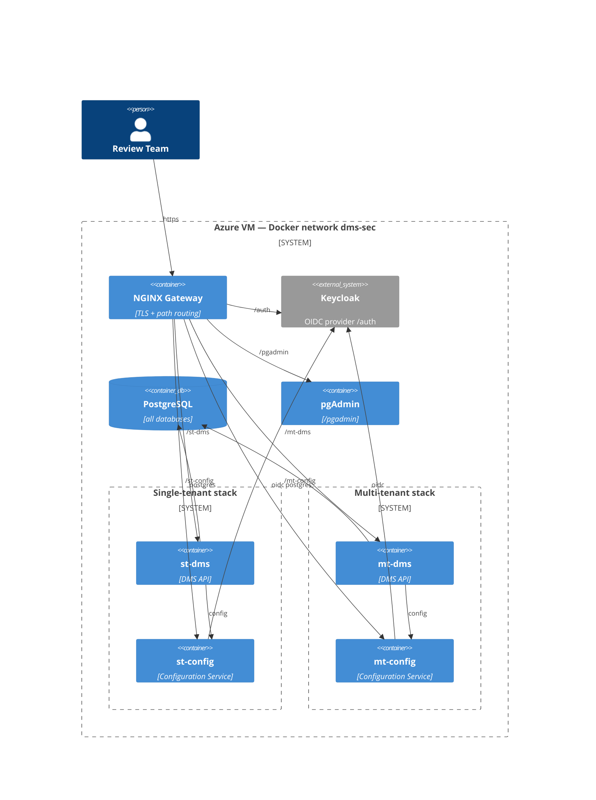

# Infrastructure for DMS Penetration Testing

All applications are deployed as Docker containers on a single Azure-hosted VM,
reachable at `https://<PUBLIC_HOST>` (set `PUBLIC_HOST` / `PUBLIC_BASE_URL` in
`compose/.env`; on Azure use the free `<label>.<region>.cloudapp.azure.com` DNS label).

## Context diagram

## Databases (one PostgreSQL server)

| Database | Used by |
|----------|---------|
| `edfi_st` | single-tenant DMS data |
| `edfi_st_config` | single-tenant Configuration Service |
| `edfi_mt` | multi-tenant **tenant1** DMS data |
| `edfi_mt_config` | multi-tenant Configuration Service |
| `edfi_mt_t2` | multi-tenant **tenant2** DMS data (physically isolated from tenant1) |
| `edfi_mt_t1` | created but currently unused (reserved) |

## Endpoints

Base: `https://<PUBLIC_HOST>`

| Component | URL |
|-----------|-----|
| Landing page | `/` |
| Single-tenant DMS — Discovery | `/st-dms` |
| OAuth token (both stacks) | `/auth/realms/edfi/protocol/openid-connect/token` (advertised in each Discovery `urls.oauth`; the `/{st,mt}-dms/oauth/token` proxy also forwards here, with a trusted cert) |
| Single-tenant DMS — data | `/st-dms/data/ed-fi/{resource}` |
| Single-tenant Config Service | `/st-config` (Swagger at `/st-config/swagger` if enabled) |
| Multi-tenant DMS — Discovery | `/mt-dms` |
| Multi-tenant DMS — data | `/mt-dms/{tenant}/{schoolYear}/data/ed-fi/{resource}` |
| Multi-tenant Config Service | `/mt-config` (requires `Tenant` header) |
| Keycloak | `/auth` (admin console `/auth/admin`) |
| pgAdmin | `/pgadmin` |

Multi-tenant requests (note the two systems identify the tenant differently):
- **DMS** takes the tenant as the **first path segment**, followed by the route
  qualifier: `/mt-dms/{tenant}/{schoolYear}/data/ed-fi/...`
  (e.g. `/mt-dms/tenant1/2025/data/ed-fi/schools`). Pattern per `CoreEndpointModule`:
  `/{tenant}/{schoolYear}/data/{**dmsPath}`.
- **Configuration Service** requires a `Tenant: <name>` **header** (no path segment).

## Accounts & credentials

> The generated key/secret values for a live deployment go in that deployment's **private**
> credentials doc / vault — not in this folder. Static config comes from `compose/.env`.

### Administrative

| What | Where | Value |
|------|-------|-------|
| Keycloak admin | `/auth/admin` | `KEYCLOAK_ADMIN` / `KEYCLOAK_ADMIN_PASSWORD` (.env) |
| pgAdmin login | `/pgadmin` | `PGADMIN_DEFAULT_EMAIL` / `PGADMIN_DEFAULT_PASSWORD` (.env) |
| Bootstrap admin (CMS) | both `*-config` | `BOOTSTRAP_ADMIN_CLIENT_ID` / `BOOTSTRAP_ADMIN_CLIENT_SECRET` (.env) |
| CMS full-access client | Keycloak | `DmsConfigurationService` / `DMS_CONFIG_IDENTITY_CLIENT_SECRET` (.env) |
| CMS read-only client | Keycloak | `CMSReadOnlyAccess` / `CONFIG_SERVICE_CLIENT_SECRET` (.env) |

### API client credentials (generated by bootstrap.ps1)

> This folder is **secret-free**. For a live deployment, the minted key/secret pairs live in
> that deployment's **private** credentials doc / vault — not here. Generated secrets are
> Basic/form-safe by construction on current images (`DMS-1231`, fixed upstream).

Scope: **single-tenant + two isolated tenants** = three apps.

| Environment | Claim set | Data DB | Key | Secret |
|-------------|-----------|---------|-----|--------|
| single-tenant | `E2E-NoFurtherAuthRequiredClaimSet` | `edfi_st` | _(from bootstrap.ps1 output)_ | _(from bootstrap.ps1 output)_ |
| multi-tenant / tenant1 | `E2E-NoFurtherAuthRequiredClaimSet` | `edfi_mt` | _(from bootstrap.ps1 output)_ | _(from bootstrap.ps1 output)_ |
| multi-tenant / tenant2 | `E2E-NoFurtherAuthRequiredClaimSet` | `edfi_mt_t2` | _(from bootstrap.ps1 output)_ | _(from bootstrap.ps1 output)_ |

Token endpoint (HTTP Basic `key:secret`, `grant_type=client_credentials`): the shared Keycloak
realm at `…/auth/realms/edfi/protocol/openid-connect/token`, which each stack's Discovery API
advertises as `urls.oauth`. The DMS `…/st-dms/oauth/token` / `…/mt-dms/oauth/token` proxy forwards
to the same endpoint (needs a publicly-trusted cert). A ready sampler that tokens + reads a spread
of resources for all three is [`http/sample-all.sh`](../http/sample-all.sh).

## Network configuration

- Single public hostname; NGINX terminates TLS and routes by path.
- TLS: self-signed for local testing; **Let's Encrypt** on the VM. Replace
  `compose/ssl/server.crt` / `server.key` with the issued `fullchain.pem` / `privkey.pem`
  (copy or symlink to those names), then reload the gateway.
- Recommended NSG rules: **443 open** to the review team (the application attack surface);
  **22 (SSH) and the gateway only** otherwise; pgAdmin/Keycloak admin reachable only over
  443 and gated by their own logins. Lock SSH to admin IPs.

## Provisioning method (as deployed)

The DMS data databases use the **relational backend** (per-resource `edfi.*` tables + a
`dms.EffectiveSchema` fingerprint), so they are **provisioned out of band**: the DMS
services run with `AppSettings__DeployDatabaseOnStartup=false` and the legacy installer
disabled (`NEED_DATABASE_SETUP=false`), and the staged ApiSchema is mounted read-only at
`/app/ApiSchema` so the running fingerprint matches the provisioned schema by construction.

Order used to stand the environment up (and that a re-deploy should follow):

1. Bring up everything **except** the DMS services — PostgreSQL, Keycloak, the Configuration
   Services, and the gateway (`setup-env.ps1`, or `docker compose -f docker-compose.yml -f
   keycloak.yml --env-file .env up -d --no-deps postgres keycloak st-config mt-config pgadmin
   gateway`). `postgres/init-databases.sh` creates the empty databases. (Bare `./up.sh` starts the
   **full** stack including the DMS — only safe once bootstrap + schema already exist, e.g. a restart.)
2. **Provision the relational schema** into each DMS data DB (`edfi_st`, `edfi_mt`,
   `edfi_mt_t2`) with the `dms-schema` tool, against the same `ApiSchema.json` that is
   mounted into the DMS containers. (`dms-schema` is build-from-source — see issue 5.)
3. **`bootstrap/bootstrap.ps1`** creates the Keycloak realm + service clients, the CMS
   tenants / data stores, and the review applications. This **must run before the DMS
   services start** (issue 3).
4. Start the DMS services (`./up.sh st-dms mt-dms`); each `/health` should return 200.
5. **Seed data:**
   - **single-tenant** (`edfi_st`): API bulk-load (ODS BulkLoadClient), descriptors first
     then resources; or restore a *relational* populated template via `seed/grandbend.sh`.
   - **multi-tenant** (`edfi_mt` = tenant1, `edfi_mt_t2` = tenant2): API bulk-load works directly
     now (`DMS-1230` fixed — issue 1), or clone the seeded `edfi_st` with `seed/clone-data.sh`
     (faster).

> **Verified 2026-06-20:** single-tenant + both tenants carry the full Grand Bend graph
> (~104,796 documents) in three physically-isolated databases; a write in `tenant2` left
> `tenant1` unchanged (tenant isolation confirmed end-to-end).

## Known issues & operational notes

1. **Multi-tenant XSD metadata 404 — `DMS-1230`, fixed upstream (#1048).** The DMS XSD metadata
   file-content endpoint used to 404 under a `/{tenant}` prefix (unanchored regex), blocking the
   BulkLoadClient against `/mt-dms`. The fix ships in the `:pre` images built ≥ 2026-06-24; run
   `docker compose … pull` to update (the originally-deployed env predated it). Multi-tenant can
   now be API-seeded directly; `seed/clone-data.sh` remains a **faster** alternative (copying the
   seeded `edfi_st` beats re-bulk-loading each tenant).
2. **CMS-minted secret characters — `DMS-1231`, fixed upstream (#1047).** Generated client secrets
   used to be able to contain `+`/`%`, which broke `Authorization: Basic` for clients that don't
   URL-encode (e.g. the BulkLoadClient → `invalid_client`). Generated secrets are now restricted to
   Basic/form-safe characters by construction; the fix ships in the `:pre` images built ≥ 2026-06-24.
   On an older image, re-mint until the secret is `+`/`%`/space-free, or URL-encode it in the header.
3. **Start DMS only AFTER identity + CMS data stores exist.** On boot the DMS eagerly loads
   data stores from the CMS; if the Keycloak realm / clients / data stores aren't present it
   exits fatally (crash-loop, e.g. "Realm does not exist"). This is intentional fail-fast
   (upstream `DMS-1093` / `DMS-1109` surface the failing phase to a status file). Always run
   `bootstrap.ps1` before starting `st-dms` / `mt-dms`.
4. **Bulk-load tuning.** A parallel BulkLoadClient trips the DMS rate limiter (429) and the
   resilience circuit breaker (`FAILURE_RATIO=0.01`), which can silently corrupt a partial
   load. Load **descriptors first**, then resources, and raise the rate limit before a
   parallel run. (The clone / template-restore paths avoid this entirely.)
5. **`dms-schema` is build-from-source only** (no published image or dotnet tool): `dotnet
   publish src/dms/clis/EdFi.DataManagementService.SchemaTools -r linux-x64 --self-contained`.
6. **Populated template must be RELATIONAL.** `seed/grandbend.sh` requires a relational build
   of `EdFi.Dms.Populated.Template.PostgreSql.5.2.0` (post `DMS-1159`, 2026-06-09); the older
   `0.7.x` builds are the legacy document-store format and are rejected by the relational
   backend (the script guards against them).
7. **Keycloak issuer behind the proxy.** Tokens are issued with `iss =
   https://<PUBLIC_HOST>/auth/realms/edfi`; if DMS rejects valid tokens, re-check
   `KC_HOSTNAME`, `KC_HOSTNAME_BACKCHANNEL_DYNAMIC`, and that the metadata `issuer` matches
   the public URL. (Self-contained identity is the lower-risk fallback.)
8. **Claim sets.** Defaults use the embedded `E2E-NoFurtherAuthRequiredClaimSet` (full
   access) and `E2E-RelationshipsWithEdOrgsOnlyClaimSet` (EdOrg-scoped). Confirm the live
   list with `GET /st-config/v3/claimSets`; add custom claim sets via the API or Hybrid mode
   (see `compose/claims`).
9. **MFA is intentionally disabled** in Keycloak so credentials can be shared with the review
   team. Enforce MFA for any real deployment.
10. **Secrets.** Replace every `CHANGEME` value in `.env` before deployment.
