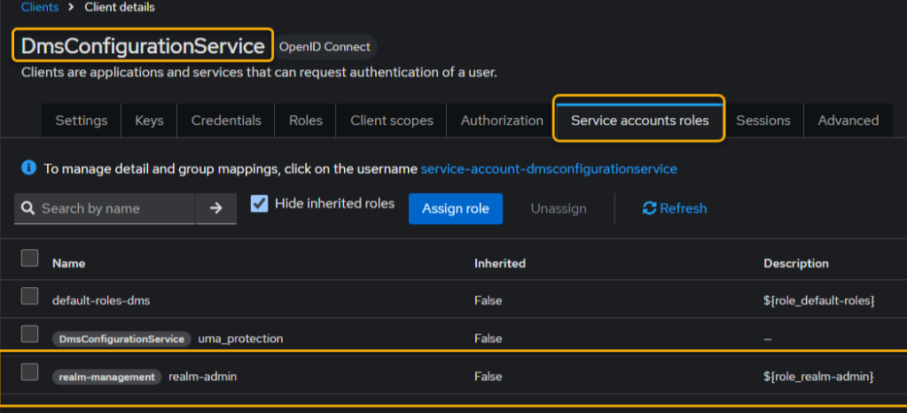
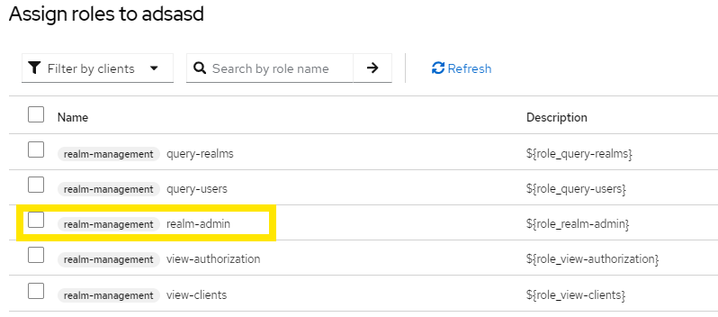
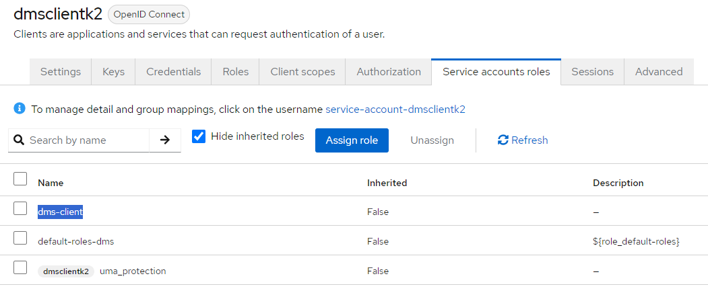
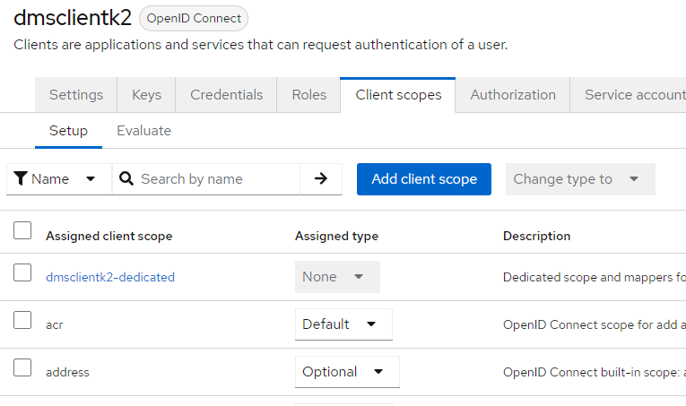
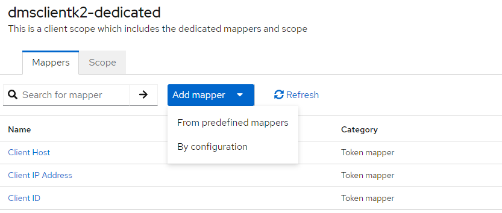
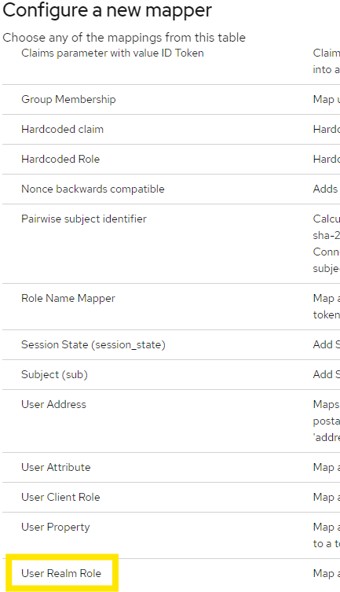
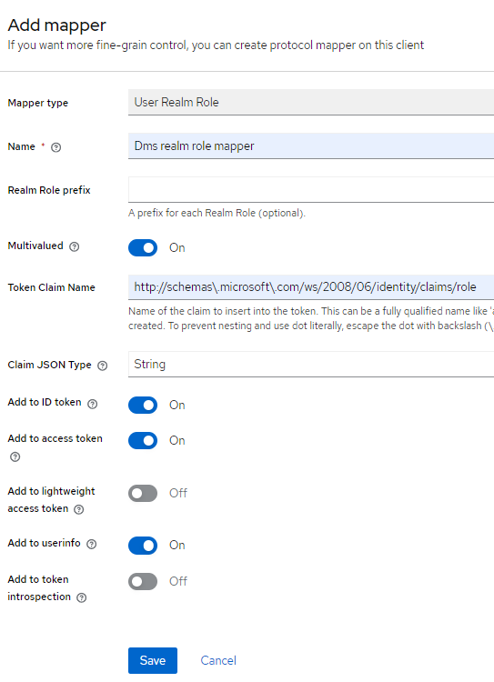

# Keycloak developer setup

The purpose of this document is to provide the basic steps for configuring
Keycloak locally using docker-compose.

> [!WARNING]
> **NOT FOR PRODUCTION USE!** This configuration contains default
> passwords that are exposed within the repository and should never be used in
> real-world scenarios. Please exercise extreme caution!

## Keycloak setup steps

1. Create a `.env` file. The `.env.example` is a good starting point

2. You have two options to set up the Keycloak container: either use the
   `keycloak.yml` Docker Compose file or run the `start-keycloak.ps1` script.

    ```pwsh
    # Start keykloack
    ./start-keycloak.ps1
    ```

    

3. After executing either of the two commands, you can verify that Keycloak is
   up and running by checking Docker Desktop.

    

4. The Keycloak console can be accessed on: <http://localhost:8045/>

5. On this page, provide your username (admin) and password (admin)

    

6. Once authenticated, you will enter the settings

    

## Creating a New Realm

 1. In the top-left corner, select the dropdown labeled `master` (or whatever
    the default realm is called).

    

 2. Click "Create Realm" to create a new one.

 3. Enter a unique Realm Name (e.g., edfi) and click "Enabled", then click
    "Create".

    

 4. Now home screen will show the newly created realm

    

## Configuring service specific realm roles

 1. From the left menu, select Realm roles.
 2. Click Create role
 3. Enter a Role Name (`config-service-app`) and Description
 4. Click Save

## Creating a Configuration Service Client

> [!NOTE]
> Make sure you are in edfi realm

1. From the left menu, select Clients.
2. Click Create client to add a new client.

    

3. In General settings, make sure to select OpenID Connect for Client type and
   enter the Client ID (`DmsConfigurationService`). This will be the identifier
   for your application.

    

4. In Capability config, enable `Client authentication`, `Authorization`, in
   Authentication Flow section select `Standard flow` and `Direct access grants`

    

5. In Login settings, enter the Root URL of your application (e.g.,
   <http://localhost:5126>)

    

6. Click Save

    

7. Once the client is created, you will be directed to the `Client details` page,
   where you can view the client information.

8. Assigning the 'realm admin' role to the created client
   (`DmsConfigurationService`) is a necessary step. In the `Client details`
   page, go to the `Service account roles` tab, click Assign role, select 'realm
   admin', and then click Assign. This will authorize the client to manage the
   realm.

    

    

## Time to update Configuration Service appsettings

1. Copy your client secret
2. Make sure you're in the edfi realm
3. Click Clients in the left sidebar
4. Select `DmsConfigurationService`
5. Click Credentials
6. Copy the Client secret
7. Update DMS Configuration Service IdentitySettings section on appsettings.json:

   ```js
    ServiceRole: "config-service-app" (Service realm role created earlier)
    Authority: "http://your-keycloak-url:port/realms/<your-realm>"
    IdentityServer: "http://your-keycloak-url:port"
    Realm: "edfi"(your realm)
    ClientId: "DmsConfigurationService"
    ClientSecret: <value-you-copied>
    RoleClaimType: "http://schemas\\.microsoft\\.com/ws/2008/06/identity/claims/role"
    Leave the rest as-are
   ```

    > [!NOTE]
    > To test the connect/register endpoint, make sure the AllowRegistration flag
    > is set to true in the IdentitySettings.

    After updating the IdentitySettings values, you can use the connect/register
    endpoint to register the client. To retrieve the access token, use the
    connect/token endpoint.

    ```js
    // connect/register sample request payload
    {    
    "clientId":"CSClientApp",
    "clientSecret":"test1@Secret",
    "displayName":"CSClientApp"
    }
    
    // connect/token sample request payload
    {    
    "clientId":"CSClientApp",
    "clientSecret":"test1@Secret"
    }
    ```

## DMS client setup in Keycloak

Please refer "Creating a Configuration Service Client" section above

1. You can provide any valid Client ID and Name when creating your client.
2. After creating the client, Keycloak will automatically generate a secret for
   you. Make sure to store this for later use.
3. Follow the section titled "Configuring service-specific realm roles" to
   create a role specific to your service (e.g., dms-client for a DMS-specific
   role).
4. Once you have created the role, assign it to your client by navigating to the
   `Service Account Roles` tab under the client settings.

   

   

5. After assigning the role, you need to create a mapper to map the role to a
 token claim.

   1. Navigate to the Client Scopes tab, click on the `<your-client-name>-dedicated`scope
    
    
   2. Click on `Add mapper` `By configuration`, then select "User Realm Role" mapper.
    
   3. Enter the following details for the role mapper:
      > [!NOTE]
      > For the `Token Claim Name`, use:
      > <http://schemas\.microsoft\.com/ws/2008/06/identity/claims/role>
    
   4. Save the mapper configuration.
6. At this point, your DMS client is fully configured with the necessary realm
   roles and claim mappings.

7. To retrieve a client token from Keycloak, follow these steps:
    1. Use the following endpoint:
      <http://localhost:8045/realms/dms/protocol/openid-connect/token>
    2. Provide the required parameters:

    ```js
        Client ID: Your client’s unique identifier.
        Client Secret: The secret generated by Keycloak for your client.
        Grant Type: Use `client_credentials` as the grant type for this request.
    ```

    3. Make a POST request to the above URL with these parameters to receive the
      client token.
    4. Once the request is successful, Keycloak will return a JSON response
      containing the client access token, which you can use to authenticate DMS
      requests to /data endpoints.
    5. To enable authorization to work in DMS, update the
       IdentitySettings section in appsettings.json file as follows:

    ```js
        "EnforceAuthorization": true,
        "ServiceRole": "dms-client",
        "Authority": "http://your-keycloak-url:port/realms/<your-realm>",
        "Audience": "account",
        "RequireHttpsMetadata": false,
        "RoleClaimType": "http://schemas\\.microsoft\\.com/ws/2008/06/identity/claims/role"
    ```
  
## Shutting down the Keycloak container

If you want to shut down the container you can use the -d parameter and if you
want to remove the volume, add the -v parameter.

```pwsh
# Stop keykloack, keeping volume
./start-keycloak.ps1 - d

# Stop keykloack and delete volume
./start-keycloak.ps1 -d -v
```
