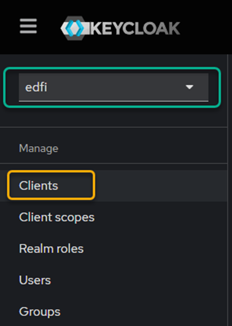
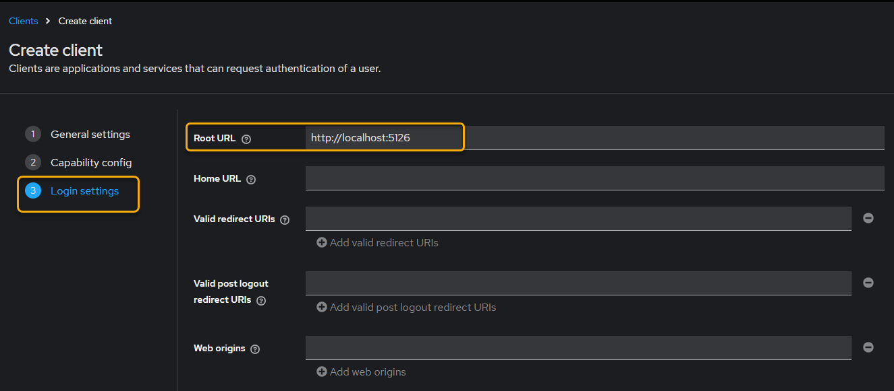

# Keycloak developer setup

The purpose of this document is to provide the basic steps for configuring Keycloak locally using docker-compose.

> [!WARNING]
> **NOT FOR PRODUCTION USE!** Includes passwords in the default configuration that are
> visible in this repo and should never be used in real life. Be very careful!

### 1.  Create a `.env` file. The `.env.example` is a good starting point.

### 2.	This directory contains the `keycloak.yml` file which will create the container. To Perform the docker compose execution use the following command:

```pwsh
# Start keykloack
./start-keycloak.ps1
```

 

### 2.	Once either of the two previous commands is executed, you can validate that keycloak is up and running in Docker Desktop.


### 3.	Now, you can enter the URL: http://localhost:8045/


### 4.	On this page, you will be asked for your username (admin) and password (admin)


### 5.	Once authenticated, you will enter the settings.


### 6.	In the upper left of the scream, you must create a new realm, called “edfi”.


### 7.	In this configuration, we will only be asked for the name and click on Create


## 8.	The home screen will change this way


<<<<<<< HEAD
### 9.	We will proceed to the configuration of the client by clicking Clients, which is located in the left panel (Note: make sure you are in edfi and not in Master).


## #10.	In General settings, we will assign a Client ID (DmsConfigurationService)


### 11.	In Capability config, we will enable 
=======
### 9.	We will proceed to the configuration of the client by clicking Clients, which is located in the left panel (Note: make sure you are in edit and not in Master).


## #10.	In General settings, we will assign a Client ID


### 11.	En Capability config, we will enable 
>>>>>>> 193f7f47eca61200364064e3b8b4b4f5d91b6a96
a.	Client authentication
b.	Authorization
c.	Authentication Flow, check-in Standard flow


<<<<<<< HEAD
### 12.	In Login settings, we will indicate the Root URL (http://localhost:5126)
=======
### 12.	In Login settings, we will indicate the Root URL
>>>>>>> 193f7f47eca61200364064e3b8b4b4f5d91b6a96


### 13.	Click Save
 


#### Note: 
If you want to shut down the container you can use the -d parameter and if you want to remove the volume, add the -v parameter.
```pwsh
# Stop keykloack, keeping volume
./start-keycloak.ps1 - d

# Stop keykloack and delete volume
./start-keycloak.ps1 -d -v
```
