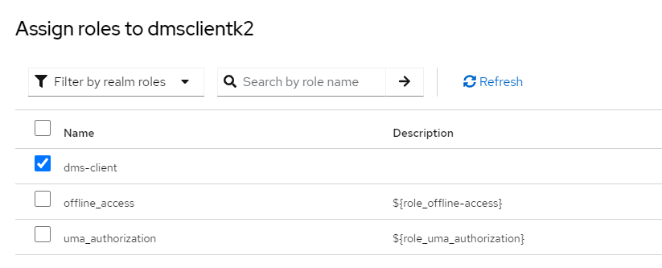

# Keycloak developer setup

The purpose of this document is to provide the basic steps for configuring
Keycloak locally using docker-compose.

> [!WARNING]
> **NOT FOR PRODUCTION USE!** This configuration contains default
> passwords that are exposed within the repository and should never be used in
> real-world scenarios. Please exercise extreme caution!

## Keycloak setup steps

1. Create a `.env` file. The `.env.example` is a good starting point

2. You have two options to set up the Keycloak container: either use the
   `keycloak.yml` Docker Compose file or run the `start-keycloak.ps1` script.

    ```pwsh
    ./start-keycloak.ps1
    ```

    

3. After executing either of the two commands, you can verify that Keycloak is
   up and running by checking Docker Desktop.

    

4. The Keycloak console can be accessed on: <http://localhost:8045/>

5. On this page, provide your username (admin) and password (admin)

    

6. Once authenticated, you will enter the settings

    

## Scripted Keycloak Setup

> [!NOTE]
> See [Manual Keycloak Setup](#appendix-manual-keycloak-setup) below if you are interested in the instructions for setting up Keycloak via the user interface.

## Time to update Configuration Service appsettings

1. Copy your client secret
2. Make sure you're in the edfi realm
3. Click Clients in the left sidebar
4. Select `DmsConfigurationService`
5. Click Credentials
6. Copy the Client secret
7. Update DMS Configuration Service IdentitySettings section on appsettings.json:

   ```js
    ConfigServiceRole: "cms-client" (Service realm role created earlier)
    ClientRole: "dms-client",
    Authority: "http://your-keycloak-url:port/realms/<your-realm>"
    IdentityServer: "http://your-keycloak-url:port"
    Realm: "edfi"(your realm)
    ClientId: "DmsConfigurationService"
    ClientSecret: <value-you-copied>
    RoleClaimType: "http://schemas\\.microsoft\\.com/ws/2008/06/identity/claims/role"
    Leave the rest as-is
   ```

    > [!NOTE]
    > To test the connect/register endpoint, make sure the AllowRegistration flag
    > is set to true in the IdentitySettings.

    After updating the IdentitySettings values, you can use the connect/register
    endpoint to register the client. To retrieve the access token, use the
    connect/token endpoint.

    ```js
    // connect/register sample request payload
    {    
    "clientId":"CSClientApp",
    "clientSecret":"test1@Secret",
    "displayName":"CSClientApp"
    }
    
    // connect/token sample request payload
    {    
    "clientId":"CSClientApp",
    "clientSecret":"test1@Secret"
    }
    ```

## Shutting down the Keycloak container

If you want to shut down the container you can use the -d parameter and if you
want to remove the volume, add the -v parameter.

```pwsh
# Stop keykloack, keeping volume
./start-keycloak.ps1 - d

# Stop keykloack and delete volume
./start-keycloak.ps1 -d -v
```

## Appendix: Manual Keycloak Setup

### Creating a New Realm

 1. In the top-left corner, select the dropdown labeled `master` (or whatever
    the default realm is called).

    

 2. Click "Create Realm" to create a new one.

 3. Enter a unique Realm Name (e.g., edfi) and click "Enabled", then click
    "Create".

    

 4. Now home screen will show the newly created realm

    

### Configuring service specific realm roles

 1. From the left menu, select Realm roles.
 2. Click Create role
 3. Enter a Role Name (`cms-client`) and Description
 4. Click Save

### Creating a Configuration Service Client

> [!NOTE]
> Make sure you are in edfi realm

1. From the left menu, select Clients.
2. Click Create client to add a new client.

    

3. In General settings, make sure to select OpenID Connect for Client type and
   enter the Client ID (`DmsConfigurationService`). This will be the identifier
   for your application.

    

4. In Capability config, enable `Client authentication`, `Authorization`, in
   Authentication Flow section select `Standard flow` and `Direct access grants`

    

5. In Login settings, enter the Root URL of your application (e.g.,
   <http://localhost:5126>)

    

6. Click Save

    

7. Once the client is created, you will be directed to the `Client details` page,
   where you can view the client information.

8. Assigning the 'realm admin' role to the created client
   (`DmsConfigurationService`) is a necessary step. In the `Client details`
   page, go to the `Service account roles` tab, click Assign role, select 'realm
   admin', and then click Assign. This will authorize the client to manage the
   realm.

    

    

### DMS client setup in Keycloak

Please refer "Creating a Configuration Service Client" section above

1. You can provide any valid Client ID and Name when creating your client.
2. After creating the client, Keycloak will automatically generate a secret for
   you. Make sure to store this for later use.
3. Follow the section titled "Configuring service-specific realm roles" to
   create a role specific to your service (e.g., dms-client for a DMS-specific
   role).
4. Once you have created the role, assign it to your client by navigating to the
   `Service Account Roles` tab under the client settings.

   

   

5. After assigning the role, you need to create a mapper to map the role to a
 token claim.

   1. Navigate to the Client Scopes tab, click on the `<your-client-name>-dedicated`scope
    
    
   2. Click on `Add mapper` `By configuration`, then select "User Realm Role" mapper.
    
   3. Enter the following details for the role mapper:
      > [!NOTE]
      > For the `Token Claim Name`, use:
      > <http://schemas\.microsoft\.com/ws/2008/06/identity/claims/role>
    
   4. Save the mapper configuration.
6. Creating and assigning a ClaimSet scope

   1. Navigate to Client scopes, then click `Create client scope`
   2. Enter a Name for the client scope (the name should match the ClaimSet name
      you want to use). Set the Type to `Default`, and check the option for
      `Include in token scope`. Finally, click Save to create the client scope.
   3. To add the client scope to the DMS client you created, follow these steps:

      1. Select the client to which you want to assign the claim set scope.
      2. Go to the Client Scopes tab and click `Add Client Scope`.
      3. Choose the scope you want to assign from the list, then click `Add
         (Default)` to complete the assignment.

7. Creating and assigning the custom claims to DMS client
      1. To create a custom `namespacePrefixes` claim, select the client you
         want to assign the custom claim.
      2. Navigate to the Client Scopes tab, click on the
         `<your-client-name>-dedicated`scope.
      3. Click on `Add mapper` `By configuration`, then select "Hardcoded claim"
         mapper.
      4. Enter the following details for the custom claim mapper:

         | Parameter                     | Value                      |
         | ----------------------------- | -------------------------- |
         | Name                          | `namespacePrefixes`        |
         | Token CLaim Name              | `namespacePrefixes`        |
         | Claim value                   | example: `uri://ed-fi.org` |
         | Claim JSON type               | string                     |
         | Add to ID token               | on                         |
         | Add to access token           | on                         |
         | Add to lightweight...         | off                        |
         | Add to userinfo               | on                         |
         | Add to access token response  | off                        |
         | Add to to token introspection | on                         |

      5. Save the mapper configuration. The decoded token will appear as follows.

         <details>
         <summary>Sample decoded JWT</summary>

         > [!TIP]
         > Look carefully at the `scope`, and look for `namespacePrefixes` close below it.

         ```json
         {
             "exp": 1730409520,
             "iat": 1730409220,
             "jti": "3cd13f2f-53ba-434e-b1f0-e5375f14bd84",
             "iss": "<http://localhost:8045/realms/edfi>",
             "aud": "account",
             "sub": "61e5e011-4e3c-418c-b974-535bf37bdcc6",
             "typ": "Bearer",
             "azp": "CSClientApp",
             "acr": "1",
             "allowed-origins": [
                 "/*"
             ],
             "realm_access": {
                 "roles": [
                 "offline_access",
                 "default-roles-edfi",
                 "uma_authorization"
                 ]
             },
             "resource_access": {
                 "CSClientApp": {
                 "roles": [
                     "uma_protection"
                 ]
                 },
                 "account": {
                 "roles": [
                     "manage-account",
                     "manage-account-links",
                     "view-profile"
                 ]
                 }
             },
             "scope": "email sis-vendor profile",
             "email_verified": false,
             "clientHost": "172.19.0.1",
             "namespacePrefixes": "uri://ed-fi.org",
             "preferred_username": "service-account-csclientapp",
             "clientAddress": "172.19.0.1",
             "client_id": "CSClientApp"
             }
         ```

         </details>

8. At this point, your DMS client is fully configured with the necessary realm
   roles and claim mappings.

9. To retrieve a client token from Keycloak, follow these steps:
    1. Use the following endpoint:
      <http://localhost:8045/realms/dms/protocol/openid-connect/token>
    2. Provide the required parameters:

        ```js
            Client ID: Your client’s unique identifier.
            Client Secret: The secret generated by Keycloak for your client.
            Grant Type: Use `client_credentials` as the grant type for this request.
        ```

    3. Make a POST request to the above URL with these parameters to receive the
       client token.
    4. Once the request is successful, Keycloak will return a JSON response
       containing the client access token, which you can use to authenticate DMS
       requests to /data endpoints.
    5. To enable authorization to work in DMS, update the
       JwtAuthentication section in appsettings.json file as follows:

        ```js
            "ClientRole": "dms-client",
            "Authority": "http://your-keycloak-url:port/realms/<your-realm>",
            "Audience": "account",
            "RequireHttpsMetadata": false,
            "RoleClaimType": "http://schemas.microsoft.com/ws/2008/06/identity/claims/role"
        ```
