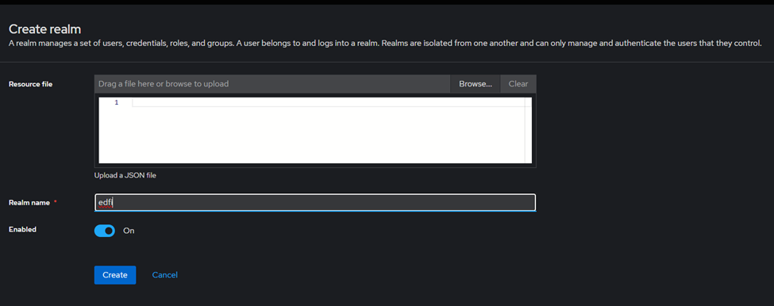

# Keycloak developer setup

The purpose of this document is to provide the basic steps for configuring
Keycloak locally using docker-compose.

> [!WARNING]
> **NOT FOR PRODUCTION USE!** This configuration contains default passwords that
> are exposed within the repository and should never be used in real-world
> scenarios. Please exercise extreme caution!

## Keycloak setup steps

1. Create a `.env` file. The `.env.example` is a good starting point

2. You have two options to set up the Keycloak container: either use the
   `keycloak.yml` Docker Compose file or run the `start-keycloak.ps1` script.

    ```pwsh
    # Start keykloack
    ./start-keycloak.ps1
    ```

    

3. After executing either of the two commands, you can verify that Keycloak is
   up and running by checking Docker Desktop.

    

4. The Keycloak console can be accessed on: <http://localhost:8045/>

5. On this page, provide your username (admin) and password (admin)

    

6. Once authenticated, you will enter the settings

    

## Creating a New Realm

 1. In the top-left corner, select the dropdown labeled `master` (or whatever
    the default realm is called).

    

 2. Click "Create Realm" to create a new one.

 3. Enter a unique Realm Name (e.g., ed-fi) and click "Enabled", then click "Create".

    

 4. Now home screen will show the newly created realm

    

## Configuring service specific realm roles

 1. From the left menu, select Realm roles.
 2. Click Create role
 3. Enter a Role Name (`config-service-app`) and Description
 4. Click Save

## Creating a Configuration Service Client

>[!NOTE]
>Make sure you are in edfi realm

1. From the left menu, select Clients.
2. Click Create client to add a new client.

    

3. In General settings, make sure to select OpenID Connect for Client type and
   enter the Client ID (`DmsConfigurationService`). This will be the identifier for
   your application.

    

4. In Capability config, enable `Client authentication`, `Authorization`, in
   Authentication Flow section select `Standard flow` and `Direct access grants`

    

5. In Login settings, enter the Root URL of your application (e.g., <http://localhost:5126>)

    

6. Click Save

    

## Shutting down the Keycloak container

If you want to shut down the container you can use the -d parameter and if you
want to remove the volume, add the -v parameter.

```pwsh
# Stop keykloack, keeping volume
./start-keycloak.ps1 - d

# Stop keykloack and delete volume
./start-keycloak.ps1 -d -v
```
