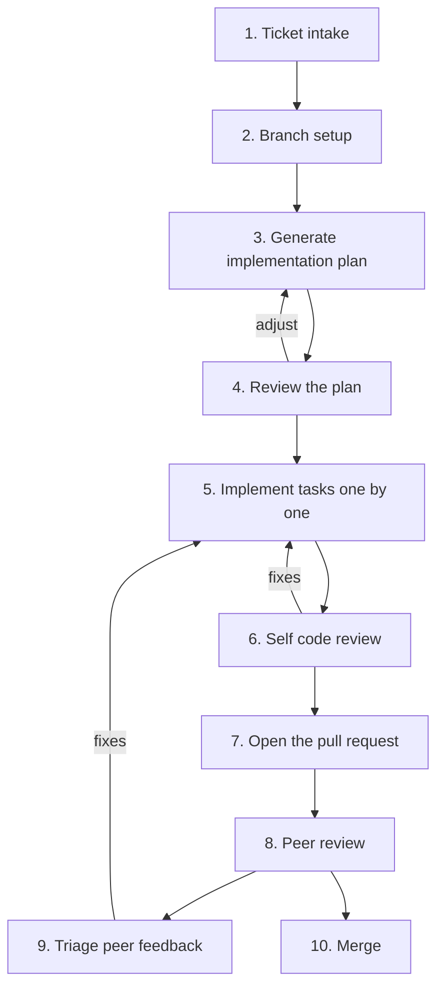

# DMS Agentic Development Workflow

This document describes the **agentic workflow** the DMS team uses to take a unit
of work from a ticket to a merged pull request with the help of an AI coding
agent. It is written to be **agent-agnostic**: the same process applies whether
you use GitHub Copilot, Claude Code, OpenAI Codex, Cursor, or any other
AI coding assistant.

It is intended as:

- A reference for how we work day-to-day.
- An onboarding guide for new team members.

This is a **high-level** description of the process. Individual engineers layer
their own personal automations (custom prompts, slash commands, "skills",
scripts) on top of it, but the stages and principles below are common to
everyone.

---

## Core principles

These principles hold at every stage, regardless of which agent you use.

### 1. Human-in-the-loop: a human approves every change

The agent is an assistant, not an autonomous committer. **A human reviews and
approves every change before it is committed, pushed, or merged.** This applies
to code, generated plans, branch names, PR descriptions, and answers to review
feedback. The agent proposes; the human disposes.

In practice this means:

- Work in small, reviewable increments so each change can actually be inspected.
- Read what the agent produced before accepting it — never rubber-stamp a diff.
- The human owns all git mutations that change shared state (commits, pushes,
  PR creation, merges). Let the agent draft them, but keep your hand on the
  trigger.

### 2. Prefer the CLI

Drive ticketing, source control, and review operations through **command-line
tools** rather than web UIs, because the agent can run, read, and reason about
CLI output directly inside the working session. Recommended tooling:

- **`git`** — branching and diffs.
- **GitHub CLI (`gh`)** — pull requests, reviews, CI status, issues.
- **Jira CLI (`jira`)** — reading tickets, comments, and acceptance criteria.

Giving the agent CLI access (read-heavy commands such as `jira issue view`,
`gh pr view`, `git diff`) lets it gather its own context instead of relying on
copy-paste, which produces better plans and reviews. Keep **state-changing**
commands (push, merge, ticket transitions) behind the human-approval gate from
Principle 1.

### 3. One task at a time

Implement work in small, focused steps and keep the agent's context tight. Long,
sprawling sessions degrade the quality of an agent's output. Completing tasks
one by one keeps each change reviewable and keeps the agent's attention on the
problem in front of it.

### 4. Push for simplicity

Bias every plan and change toward the simplest solution that satisfies the
ticket: fewer files, fewer abstractions, less code. Prefer reusing what exists
over adding new code. Call out added complexity explicitly so it can be
justified or removed.

### 5. Keep planning and review artifacts visible

Plans, task lists, and review notes are written to files so they can be
inspected, discussed, and revised. They make the agent's intent reviewable
*before* code is written and provide a paper trail for what was decided.

---

## The workflow at a glance

Stages 4→3, 6→5, and 8/9→5 are **loops**: you cycle until the plan is sound, the
self-review is clean, and the peer is satisfied.

---

## The stages

### 1. Ticket intake

Every unit of work starts from a ticket (Jira in our case). Tickets should
capture the *what* and *why*, with acceptance criteria.

- **Creating a ticket:** Write a clear summary, a description of the problem or
  feature, and acceptance criteria. Keep tickets scoped to a reviewable unit of
  work; split epics into child tickets. A standalone ticket can live entirely in
  the issue tracker. Larger, multi-ticket efforts should also have a design
  document committed to the repository, so the design lives alongside the code it
  describes and stays reviewable over time.
- **Reading a ticket:** Have the agent pull the ticket via the CLI
  (e.g. `jira issue view DMS-XXXX --comments 5`) so it can read the description,
  acceptance criteria, and comments directly. Comments often contain decisions
  and clarifications that change the implementation.

> **Agent prompt pattern:** "Read ticket DMS-XXXX and summarize the scope,
> acceptance criteria, and any open decisions in the comments."

### 2. Branch setup

Create a feature branch off the up-to-date main branch, named after the ticket
(e.g. `DMS-1195`).

**Recommendation:** Let the **agent create the branch, and have the human
approve the proposed name.** A branch-creation step that reads the ticket first
can enforce the naming convention and base-branch correctness automatically,
which is easy to get wrong by hand. The human keeps control by approving the
name before it is created. (Creating the branch manually is also fine — it is
purely a matter of preference — but the agent-creates / human-approves pattern
keeps the whole flow in one place.)

> **Agent prompt pattern:** "Create a branch for DMS-XXXX off the latest main and
> show me the name before creating it."

### 3. Generate an implementation plan

Before the agent produces a plan, have it raise its open questions about the
ticket first. Surfacing what is unclear up front flushes out gaps, ambiguities,
and conflicts with the existing design while they are still cheap to resolve,
instead of letting wrong assumptions get baked into the plan and the code. Once
those questions are answered, have the agent produce a written implementation
plan from the ticket and the current state of the codebase. A good plan includes:

- **Context** — what the ticket asks for and why.
- **Current state** — the relevant existing files, types, and patterns.
- **Plan** — concrete, ordered steps that each reference specific files.
- **Testing strategy** — the specific tests and edge cases to add.
- **Open questions** — anything ambiguous that needs a human decision.

We capture the plan as a **plan document** plus a **task list** (a checklist the
agent and human work through). Writing the plan down makes the agent's intent
reviewable before any code exists, and the task list keeps implementation
focused (see Principle 3).

> **Agent prompt pattern:** "Read DMS-XXXX and explore the relevant code. Before
> you make a plan, what questions do you have for me?" Then, once answered: "Now
> write an implementation plan and a task checklist. Favor the simplest approach;
> list anything still ambiguous as an open question instead of guessing."

### 4. Review the plan

Read the plan and resolve its open questions **before** implementation starts.
Adjust scope, correct wrong assumptions, and answer the agent's questions. A
second agent (or a teammate) reviewing the plan is a cheap way to catch a bad
approach before any code is written. Loop back to stage 3 until the plan is
sound.

### 5. Implement the tasks

Work through the task list **one task at a time** (Principle 3). For each task:

- Let the agent make the change, then read the diff and approve it
  (Principle 1).
- Run the relevant build, format, and tests for the change before moving on.
- Keep each task's change small enough to review in one sitting.

Update the task list as you go so the remaining work and current state stay
clear.

### 6. Self code review

When all tasks are complete, run a code review of your own changes **before**
involving a peer. This is typically several cycles of *review → fix → re-review*
until no issues remain or only minor ones do. Have the agent review the full
diff against the ticket's intent, looking for:

- Correctness bugs and edge cases.
- Drift from the design/spec or acceptance criteria.
- Gaps in test coverage.
- Unnecessary complexity or dead code.

Capturing each review round in a notes file helps avoid re-raising issues you
already decided to skip, and shows your reasoning to the peer reviewer later.

> **Agent prompt pattern:** "Review the diff on this branch against DMS-XXXX. Find
> real correctness, design-drift, and test-coverage problems. Cite file and line
> for each finding and rank by severity."

### 7. Open the pull request

When the self-review is clean, open the PR. Have the agent draft the PR
description (a summary of *what* changed and *why*, plus a test plan) from the
ticket and the actual diff — then review and edit it before it is published.

Creating the PR can be done manually or by the agent via `gh pr create`; either
way the **human approves** the final title, description, and the act of pushing
(Principle 1).

> **Agent prompt pattern:** "Draft a PR summary and test plan for this branch
> based on DMS-XXXX and the diff. I'll review before we open the PR."

### 8. Peer review

A teammate reviews the PR and provides feedback. We usually do this through a
direct conversation (chat in our case) rather than inline PR comments, since a
back-and-forth discussion resolves questions faster than threaded comments. As
with self-review, this is a loop: address feedback, push fixes, and repeat until
the reviewer is satisfied. Automated reviewers (e.g. GitHub Copilot's PR review)
may also contribute findings here.

### 9. Triage peer feedback

Not every review comment is valid or in scope. Before changing code, **triage
each piece of feedback** with the agent's help:

- **Valid** — a real issue; fix it.
- **Valid but minor** — low impact; fix if cheap.
- **Not valid / out of scope** — the reviewer misread the code, it's already
  handled, or it belongs to a different ticket.

Be honest in both directions: don't default to "valid" because a reviewer said
it, and don't get defensive about real problems. For valid findings, produce a
small fix plan, then loop back to stage 5 to implement and re-review.

> **Agent prompt pattern:** "Here is review feedback on this PR: <paste>. For
> each point, tell me what the code actually does, whether the finding is valid,
> and why. Then list a fix plan for the valid ones."

### 10. Merge

Once the peer reviewer is satisfied and CI is green, merge the PR. The merge is
a human-approved action.

---

## Reusable prompts / commands

Most of the stages above are repetitive, so engineers package them as **reusable
prompts** — what different tools call slash commands, skills, custom commands,
or saved prompts. Examples of the kinds of reusable prompts that map onto this
workflow:

| Stage | Reusable prompt does… |
|---|---|
| Plan (3) | Read the ticket + code, emit a plan doc and task list |
| Self-review (6) | Diff the branch against the ticket, emit categorized findings |
| PR (7) | Draft a PR summary and test plan from the ticket + diff |
| Triage (9) | Classify pasted review feedback and produce a fix plan |

Building these once and reusing them keeps the workflow consistent across people
and tickets. They are personal/optional — the workflow does not depend on any
specific one — but they make each stage faster and more uniform.

---

## Using this with different agents

The workflow is the same across agents; only the packaging differs:

- **GitHub Copilot** — chat + inline edits in the IDE; custom prompt files and
  the Copilot CLI; Copilot PR review for stage 8.
- **Claude Code** — a terminal agent with slash commands / "skills" for the
  reusable prompts, and direct `git`/`gh`/`jira` CLI access.
- **OpenAI Codex / Cursor / others** — chat-driven editing with saved prompts
  and terminal/CLI access.

Whichever you use, the same two recommendations apply throughout: **drive
ticketing, source control, and review through the CLI**, and **keep a human in
the loop to approve every change** before it lands.
