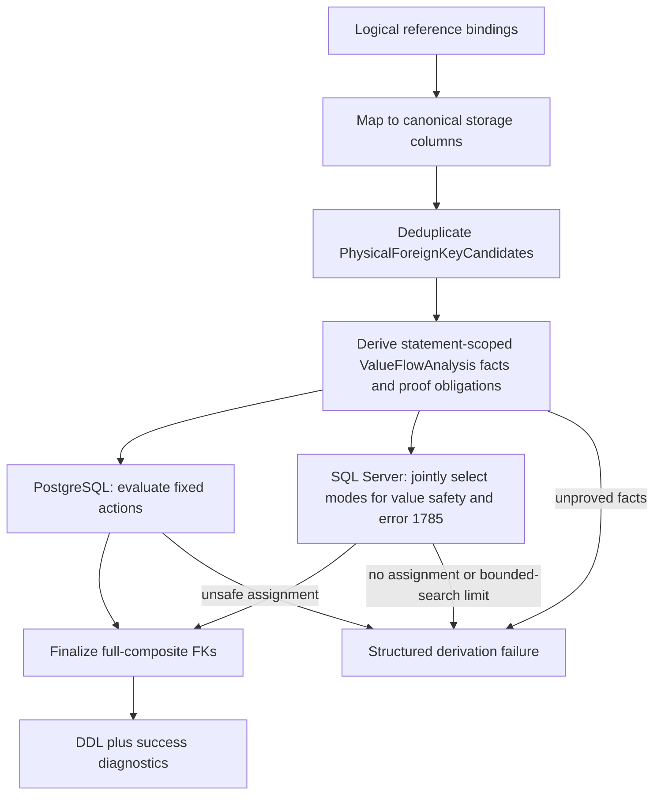
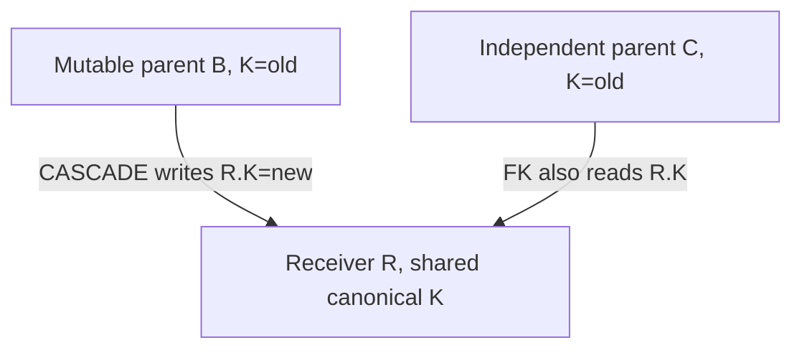

# SQL Server Identity-Update Cascades and Foreign-Key Pruning

## Status

Rewritten by DMS-1129 after implementation-readiness review. This document is the authoritative design for identity-value
propagation through document-reference foreign keys. It supersedes the earlier designs based on blanket SQL Server
`ON UPDATE NO ACTION`, `DocumentId`-only FKs, `MssqlIdentityPropagationTrigger`, table-level "coverage", and
per-diamond first-fit pruning.

Implementation is tracked by DMS-1258. This document defines the target contract; it does not contain the production
implementation.

The redesign is still establishing its first production mapping contract. DMS has not been deployed to production, so
these rules finalize `RelationalMappingVersion = v1` in place. There is no version bump, old-pack compatibility mode,
database migration, or legacy-schema interpretation in scope.

## Decisions

1. Every emitted document-reference FK is full composite: identity storage columns first and `DocumentId` last.
2. Identity values are propagated by native FK cascades. There is no identity-value propagation trigger and no
   `DocumentId`-only fallback.
3. DMS supports identity changes issued through DMS-authorized writes and DMS-owned maintenance triggers. Arbitrary
   direct SQL identity changes are outside the success contract; full FKs may reject them but must prevent corruption.
4. DDL legality and runtime value safety are different questions:
   - SQL Server error 1785 is evaluated with a physical cascade-action multigraph.
   - Statement-scoped identity value flow is analyzed from component, row, presence, and timing facts.
5. Value-flow obligations apply on PostgreSQL and SQL Server. SQL Server alone performs error-1785 pruning.
6. PostgreSQL evaluates its fixed FK action assignment. SQL Server jointly selects FK actions that satisfy both the
   value-flow obligations and error 1785.
7. A shared canonical column, a common ancestor table, or a legal SQL Server action graph is evidence only. None is a
   sufficient safety proof.
8. When safety cannot be proved, derivation fails. DMS does not weaken referential integrity to make the model install.
9. DMS owns the authoritative physical-model classifier. MetaEd provides earlier authoring feedback against the same
   versioned conformance corpus.

## Problem

Reference sites store stable `..._DocumentId` values plus copies of the target identity fields. If a target identity
changes, those local identity values must change without breaking any FK that reads the same physical columns.

PostgreSQL can create multiple `ON UPDATE CASCADE` paths to one table. SQL Server rejects a cascade action graph when a
table can occur more than once in one statement's cascade tree or a cascade cycle remains (error 1785). The previous SQL
Server workaround made every propagation-managed FK `DocumentId`-only and copied values with AFTER triggers. That made
the DDL creatable, but it stopped SQL Server from enforcing identity-value referential integrity and allowed a concurrent
write to retain stale identity values.

Restoring full-composite FKs closes that integrity gap, but pruning cannot be decided from table reachability alone. Key
unification may cause several FKs to read one writable canonical receiver column. Updating through one FK can then
invalidate another FK even when the parents are independent and the SQL Server DDL is legal. Conversely, a SQL Server
diamond can be safely pruned only when the retained writes are proved to reach the same receiver row with the same new
component value at the same constraint-check boundary.

## Confirmed Database Behavior

The following behaviors are requirements for executable provider tests, not prose-only assumptions:

| Behavior | SQL Server result | Consequence |
|---|---|---|
| One table is reached twice from one update origin, or a retained cascade cycle exists | DDL fails with 1785 | SQL Server action selection must produce an acyclic multitree. |
| Two independent parent tables cascade to distinct receiver columns | DDL succeeds; each update can succeed | Raw in-degree greater than one is not an error-1785 test. |
| Two independent parents cascade to one shared receiver column | DDL succeeds; updating one parent can fail 547 against the unchanged other FK | Error-1785 legality is not value-flow safety. |
| A full-composite `NO ACTION` FK references a changing key | Parent update fails 547 before an AFTER trigger can repair the receiver | A trigger cannot be a full-RI fallback. |
| A retained full-composite cascade has no competing FK obligation | The receiver identity values update | Native cascade is the normal propagation mechanism. |
| A purported carrier reference is absent while the pruned reference is present | The parent update fails 547 | Coverage requires a row-presence implication. |
| A concrete identity change is mirrored to an abstract identity table by an AFTER trigger | The abstract-table write is a later statement | That later trigger statement cannot cover an FK check in the initiating statement. |

## Scope and Terminology

### Physical FK candidate

A `PhysicalForeignKeyCandidate` is the canonical document-reference FK intent after all logical bindings have been mapped
to writable storage columns but before `ON UPDATE` is selected. Its identity is:

```text
(semantic FK kind,
 local table,
 ordered local storage columns,
 target table,
 ordered target storage columns,
 ON DELETE action)
```

`OnUpdate`, `MssqlPropagationMode`, a logical reference path, and a generated constraint name are not part of this
identity. Logical sites that resolve to the same identity collapse to one physical candidate. The candidate retains all
contributing logical-site provenance and presence predicates.

`PhysicalForeignKeyId` is a deterministic identifier derived from that semantic identity before dialect shortening or
constraint-name hashing. Later passes carry the id unchanged. Distinct physical FKs between the same two tables remain
distinct edges in the action multigraph.

### Mutation origin and statement boundary

A `MutationOrigin` is a DMS-supported operation that can write an identity component:

- a direct resource identity update accepted because `AllowIdentityUpdates = true`, or
- a DMS-owned maintenance-trigger statement, including an abstract-identity-table upsert/update.

Each origin has a `StatementBoundaryId`. Native cascades caused by one SQL statement share its boundary. An AFTER trigger
starts a later boundary. A write in a later boundary cannot satisfy an FK obligation checked in an earlier boundary.

`TransitivelyAllowIdentityUpdates` remains the coarse eligibility signal used to discover targets whose keys can change,
but it is not a coverage proof and does not make every intermediate table a direct mutation origin.

### Symbolic component value

Value-flow analysis labels each possibly changed identity component with a symbolic value:

```text
(mutation origin, origin-row identity, identity-component ordinal, statement boundary)
```

Two paths carry the same value only when their component lineage and origin-row correlation prove that their labels are
identical. Merely writing the same receiver column does not make two values equal.

### Reference presence

For a document reference site, the row-presence predicate is normally
`{ReferenceBaseName}_DocumentId IS NOT NULL`. Required references have predicate `true`. Presence-gated aliases preserve
API-path absence but do not imply that another optional reference site is present.

## Architecture



The derivation has four phases. The value-flow phase derives facts and obligations before dialect actions are known; it
does not claim that SQL Server is already safe. PostgreSQL evaluates those obligations against its fixed actions. SQL
Server chooses actions and proves the obligations together.

## Phase 1: Materialize Physical FK Candidates

Candidate derivation runs after reference binding, key unification, abstract-identity-table derivation, and transitive
identity mutability are known.

For every logical document-reference site:

1. Resolve the binding table and target identity table.
2. Map every local and target identity binding through `DbColumnModel.Storage`.
3. Positionally align identity components in target identity order.
4. Append local `..._DocumentId` and target `DocumentId` last.
5. Build the physical identity without an update action.
6. Deduplicate identical physical candidates and retain every contributing logical site's provenance.

The candidate records:

- stable `PhysicalForeignKeyId`;
- ordered local-to-target component mappings;
- logical reference sites and their presence predicates;
- whether the target is abstract, directly mutable, transitively mutable, or immutable;
- identity-component source paths needed to derive value lineage;
- abstract-identity concrete-member mappings needed to model maintenance-trigger statements; and
- the deterministic final constraint-name seed.

All-or-none constraints remain per logical reference site. Physical FK deduplication does not merge API presence
semantics.

## Phase 2: Derive Value-Flow Facts and Obligations

`ValueFlowAnalysis` is dialect-neutral. It derives the facts needed to evaluate an action assignment but does not choose
that assignment.

### Mutation event templates

For each supported mutation origin, derive event templates for every identity component that the operation can change.
A direct DMS identity update is conservatively allowed to change any directly mutable component independently. A
transitively mutable component changes only through its proven upstream lineage. Abstract-identity maintenance produces
a later trigger-statement event from its concrete-member column mapping.

Arbitrary direct SQL statements are not event templates. If such a statement is inconsistent with the declared DMS
write contract, the full FK may reject it.

### Required proofs

For every action assignment, every event template, and every relevant receiver row, all of these obligations must hold:

1. **Changed-target obligation.** If a candidate's referenced key changes and that reference is present, the local
   corresponding columns must receive the identical symbolic values in the same constraint-check boundary. A selected
   native cascade may perform the write; a `NO ACTION` edge requires another proved carrier.
2. **Receiver-write obligation.** If any selected cascade writes a canonical receiver column, every other present FK
   that reads that column must still match its referenced target at the end of that statement. This includes independent
   parents and `ImmutableNoAction` FKs.
3. **Single-value obligation.** Two writes that can reach the same receiver row and column in one statement must carry
   the same symbolic value. A common table ancestor or equality of old values does not prove this.
4. **Row-correlation obligation.** A carrier and the edge it covers must be proved to refer to the same origin row and
   receiver row. Proof may use the same stable `DocumentId` or equality of a complete declared unique identity; equality
   of only one component of a composite identity is insufficient.
5. **Presence obligation.** Whenever a pruned or competing reference is present, at least one selected carrier that
   supplies each changing component must also be present. For a single carrier this is
   `pruned-present => carrier-present`. Independently optional sites provide no such implication.
6. **Statement-boundary obligation.** A carrier write must occur before the engine checks the dependent FK. An AFTER
   trigger or other later statement cannot cover the initiating statement.

These obligations are universal schema proofs. Success on one populated example is not sufficient.

### Why independent edges are still analyzed



The graph has no duplicate path and SQL Server accepts both cascade declarations. Nevertheless, updating only B makes
`R.K` disagree with C. This topology fails the receiver-write obligation unless schema facts prove a coordinated same-row,
same-value update. The same rule applies on PostgreSQL.

### Why a table-level diamond is insufficient

For `A -> B`, `A -> C`, `B -> R`, and `C -> R`, the action graph proves only that A can reach R twice. Safe pruning also
requires all of the following for each changed component:

- B and C receive the value from the same A row and component;
- the retained reference is present whenever the pruned reference is present;
- the retained path reaches the same R row; and
- every write occurs within the same statement boundary.

If any fact is unavailable, that prune is inadmissible.

## Phase 3A: PostgreSQL Fixed Assignment

PostgreSQL does not perform error-1785 pruning. Its action assignment is fixed:

- abstract targets and concrete targets with `TransitivelyAllowIdentityUpdates = true` use full-composite
  `ON UPDATE CASCADE`;
- genuinely immutable concrete targets use full-composite `ON UPDATE NO ACTION`.

Evaluate all value-flow obligations against that assignment. PostgreSQL derivation fails when independent/shared-column
writes, conflicting component lineages, optional-site presence, row correlation, trigger timing, or another obligation
cannot be proved safe. This is a data-integrity rule, not SQL Server portability enforcement.

PostgreSQL never receives `MssqlPropagationMode` and is never physically pruned.

## Phase 3B: SQL Server Joint Action Selection

### Action multigraph

The SQL Server action multigraph has one vertex per physical table and one directed edge per mutable physical FK
candidate, oriented from referenced target to referencing receiver. Parallel candidates remain parallel edges.

For a proposed mode assignment, the retained graph contains only `NativeCascade` edges. SQL Server requires it to be an
acyclic multitree: for every ordered table pair there is at most one retained directed path. Direct in-degree greater
than one is only a conflict candidate; independent sources with disjoint ancestry do not violate 1785.

Cycles and duplicate-reachability diamonds create action-choice constraints. They are not, by themselves, coverage
proofs. Selection may prune an edge only when the final assignment satisfies every value-flow obligation.

### Modes

Every SQL Server physical document-reference FK receives exactly one mode:

| Mode | Target mutability | FK action | Meaning |
|---|---|---|---|
| `NativeCascade` | mutable | `ON UPDATE CASCADE` | This physical edge performs native propagation. |
| `NoPropagation` | mutable | `ON UPDATE NO ACTION` | The edge is pruned for 1785; every relevant target change is carried by other selected writes with complete coverage certificates. |
| `ImmutableNoAction` | immutable | `ON UPDATE NO ACTION` | The target has no DMS-supported identity-change event. Competing writes to its local columns must still pass value-flow validation. |

There is no `TriggerFallback` and no variable FK shape.

### Joint acceptance predicate

A complete SQL Server assignment is valid only when:

1. every candidate has exactly one compatible mode;
2. the retained `NativeCascade` multigraph is acyclic and has at most one path between every ordered vertex pair;
3. every value-flow obligation is satisfied against the final modes;
4. every `NoPropagation` candidate has a complete, non-empty set of coverage certificates;
5. every certificate refers to retained physical paths in the final assignment; and
6. final constraint names and actions are deterministic.

An independent edge may stay `NativeCascade` when these conditions hold, but independence is not a safety shortcut. A
cycle edge may be pruned only if the same conditions prove its target changes are carried safely; otherwise no solution
exists.

### Deterministic bounded search

The implementation must solve the joint predicate globally. It must not commit a local per-diamond winner.

Required solver behavior:

1. Build conflict constraints from SCC/cycle detection and duplicate reachability without materializing every path pair.
2. Restrict decision variables to mutable candidates that participate in an error-1785 conflict or a value-flow choice.
3. Order variables and modes by stable `PhysicalForeignKeyId` and a documented mode order.
4. Reject a partial assignment immediately when it cannot satisfy a graph constraint or value-flow obligation.
5. Memoize equivalent partial states, including the retained reachability summary and outstanding obligations.
6. Accept the first complete assignment in the documented stable order.
7. Enforce fixed, deterministic conflict-count and explored-state limits. The concrete limits must be selected and locked
   by DMS-1258 using the stock Ed-Fi model, representative extensions, and adversarial fixtures.

Search exhaustion means `NoSafeSqlServerAssignment`. Reaching a work limit means
`CascadeClassificationComplexityExceeded`; it must not be reported as proof that no assignment exists. Both are hard
derivation failures, but they carry different diagnostics.

## Phase 4: Finalize Constraints and Diagnostics

After a dialect assignment is certified, finalize `TableConstraint.ForeignKey` with the full ordered columns and final
`ReferentialAction OnUpdate`. The DDL emitter consumes this finalized model and does not rerun classification.

### Coverage certificates

Each SQL Server `NoPropagation` decision has an ordered, non-empty `CoverageCertificates` collection. There is one
certificate for every mutation-origin and changed-component case the pruned edge must survive. A certificate records:

- `PhysicalForeignKeyId` for the pruned edge;
- mutation origin, changed component, and statement boundary;
- ordered retained and pruned physical-FK paths;
- exact source-to-target-to-receiver component lineage;
- origin-row and receiver-row correlation proof;
- reference-presence implication; and
- the constraint-check boundary at which the proof holds.

Certificates are ordered by mutation origin, changed-component ordinal, retained path ids, then pruned path ids. One
certificate tuple cannot stand in for several incomparable origins or paths.

`NativeCascade` and `ImmutableNoAction` do not have coverage certificates. Their safety is covered by the successful
global value-flow evaluation.

### Build result and artifacts

Derivation returns one of:

```text
Success(DerivedRelationalModelSet Model, RelationalModelDerivationDiagnostics Diagnostics)
Failure(IReadOnlyList<RelationalModelDerivationError> Errors)
```

Successful SQL Server diagnostics contain `MssqlForeignKeyDecision` entries keyed by `PhysicalForeignKeyId`, including
mode and certificates. They are emitted in `relational-model.mssql.manifest.json` for audit and golden testing.

Failures are structured build results, not warnings inside a successful manifest. A CLI may render a separate failure
report, but no relational-model manifest, mapping pack, or DDL is produced from a failed derivation.

`MssqlPropagationMode` and coverage certificates are derivation/DDL/manifest diagnostics. Runtime plans and mapping packs
do not consume them. Mapping packs serialize the finalized FK `on_update` action already present in the normalized
relational model.

## Pass Ordering and Ownership

The canonical set-level order becomes:

```text
ReferenceBindingPass
-> KeyUnificationPass
-> AbstractIdentityTableAndUnionViewDerivationPass
-> ValidateUnifiedAliasMetadataPass
-> RootIdentityConstraintPass
-> TransitiveIdentityMutabilityPass
-> physical reference-FK candidate derivation and deduplication
-> ValueFlowAnalysis derivation
-> PostgreSQL fixed-assignment evaluation OR SQL Server joint action selection
-> ReferenceConstraintPass finalization
-> remaining constraint, inventory, shortening, and ordering passes
```

The candidate/value-flow phases may be implemented as new set-level passes or as explicit internal phases of a
refactored `ReferenceConstraintPass`, but there must be one shared candidate builder. Classification and FK emission must
not independently reconstruct physical edge identity.

Value-flow derivation uses abstract-identity column mappings already produced by abstract-identity derivation. It does not
wait for the later trigger-inventory pass or parse rendered trigger SQL. The trigger inventory consumes the same mapping
facts.

Constraint hashing and identifier shortening occur after decisions are recorded. Those passes update final constraint
names but retain `PhysicalForeignKeyId` and all diagnostic references.

## Errors

Required structured failure categories include:

- `PhysicalForeignKeyCandidateConflict`;
- `UnprovedComponentLineage`;
- `UnprovedOriginRowCorrelation`;
- `UnprovedReferencePresenceImplication`;
- `IncompatibleStatementBoundary`;
- `ConflictingCanonicalColumnWrites`;
- `ForeignKeyInvalidAfterReceiverWrite`;
- `UnsafePostgresqlActionAssignment`;
- `NoSafeSqlServerAssignment`; and
- `CascadeClassificationComplexityExceeded`.

Errors identify mutation origins, statement boundaries, physical FK ids, tables, final or proposed constraint names,
columns, reference sites, and the failed proof obligation. Diagnostics must be deterministic and bounded; long path sets
use stable truncation plus total counts.

## Verification Matrix

DMS-1258 must add checked-in, executable unit and provider fixtures. Prose probes are not sufficient.

### Physical candidate derivation

- two logical sites that collapse to one physical FK;
- two distinct parallel physical FKs between the same tables;
- storage aliases mapped to one canonical column;
- deterministic ids before and after identifier shortening; and
- full-composite column order and final constraint deduplication.

### Cross-engine value flow

- one mutable parent and one receiver, succeeds;
- independent mutable parents writing distinct receiver columns, succeeds;
- independent mutable parents sharing a receiver column, fails on PostgreSQL and SQL Server;
- mutable and immutable parent FKs sharing a receiver column, fails;
- common-origin paths with full same-row and same-component lineage, succeeds when presence is proved;
- same ancestor table but different origin rows, fails;
- same origin row but different identity components/new values, fails;
- required carrier with optional pruned reference, succeeds when implication is proved;
- optional carrier absent while pruned reference is present, fails;
- abstract/concrete shared-column paths separated by an AFTER-trigger boundary, fails unless another same-boundary proof
  exists;
- multi-row updates and transitive chains; and
- child, collection, and `_ext` receiver tables.

### SQL Server action selection

- sole cascade edge;
- legal independent multi-parent graph with value-disjoint columns;
- covered diamond;
- uncovered diamond;
- parallel-edge conflict;
- safely breakable and unbreakable cycle fixtures;
- overlapping conflicts requiring backtracking;
- no-solution assignment;
- deterministic output under reversed input order; and
- deterministic complexity-limit failure distinct from no solution.

### Integration behavior

- generated DDL creates on the latest supported PostgreSQL and SQL Server releases;
- identity updates retain full value-level RI;
- concurrent old-identity inserts are rejected;
- cascaded child and extension updates fire stamping, referential-identity, and change-query maintenance correctly; and
- successful manifests contain stable decisions/certificates while failed derivations produce no success artifacts.

## Relationship to ODS

ODS identifies tables with multiple incoming cascade edges, sorts by table id, retains one edge, and marks the others
`NO ACTION`. DMS reuses neither raw in-degree nor name-order pruning as a safety rule.

DMS differs in four material ways:

1. It classifies deduplicated physical FKs after key unification, not logical entity edges.
2. It separates SQL Server action-graph legality from cross-engine statement-scoped value safety.
3. It jointly selects SQL Server actions using row, component, presence, and timing obligations.
4. It fails when no proof exists instead of weakening the FK or silently dropping propagation.

## Migration from Current Code

DMS-1258 must:

1. refactor `ReferenceConstraintPass` so storage-mapped physical candidates are built and deduplicated before `OnUpdate`;
2. ensure candidate identity excludes `OnUpdate` so action choice cannot create duplicate physical constraints;
3. derive value-flow facts and proof obligations from DMS write semantics and abstract-identity mappings;
4. evaluate PostgreSQL's fixed assignment and implement SQL Server's joint bounded selector;
5. restore identity columns to every SQL Server reference FK;
6. remove `mssqlTriggerHandlesPropagation`, `EmitMssqlIdentityPropagationTriggers`,
   `MssqlIdentityPropagationTrigger`, and `PropagationReferrerTarget`;
7. emit structured Success/Failure results and success-only SQL Server decision diagnostics; and
8. add the executable conformance matrix above.

No `RelationalMappingVersion` bump or compatibility migration accompanies this work because it is part of the initial,
pre-production v1 contract.

## MetaEd Alignment

METAED-1667 remains the authoring-time guard. It must not approximate this design as raw table in-degree or common
ancestry. DMS is authoritative because it owns canonical storage mapping, physical FK deduplication, abstract-identity
statement mappings, and the emitted dialect model.

DMS and MetaEd must share a versioned, repository-neutral conformance corpus containing the positive and negative graph,
component-lineage, row-correlation, optional-presence, and statement-boundary fixtures above. For every fixture, MetaEd
and DMS must agree on accept/reject and the stable error category. SQL Server-only action decisions remain DMS physical
diagnostics; MetaEd needs only enough detail to reject an authoring model that has no supported DMS realization.

Release sequencing: the MetaEd guard should ship before or with SQL Server support that accepts authored extensions. DMS
still runs its own derivation checks as the final backstop on both dialects.

## Follow-Up Work

- **DMS-1258:** implement physical candidate derivation, `ValueFlowAnalysis`, PostgreSQL fixed-assignment evaluation,
  SQL Server joint bounded selection, final full-composite FK emission, diagnostics, and the verification matrix.
- **METAED-1667:** replace table-reachability pruning validation with authoring-time checks backed by the shared
  conformance corpus.
- **DMS-1127:** verify that native cascade updates on root, child, and extension tables fire stamping,
  referential-identity, and change-query maintenance correctly.
- **DMS-1128:** remains superseded; its historical hybrid trigger/fallback design must not be implemented.
- **Cross-scope key unification:** remains separate future work as documented in
  `key-unification-children-problem.md`.

## Non-Goals

- Arbitrary direct SQL identity-update success.
- A reduced-FK or trigger-based propagation fallback.
- In-place database migration or compatibility with pre-production packs/databases.
- General cross-table or root-to-child equality propagation. Row-local key unification remains the supported database
  scope; `key-unification-children-problem.md` tracks the separate gap.
- Changing abstract-identity maintenance from its current DMS-owned AFTER-trigger mechanism. This design models that
  boundary and rejects incompatible topologies.
- Application-managed closure traversal for identity propagation.
