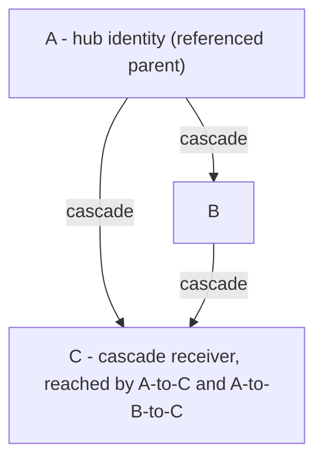
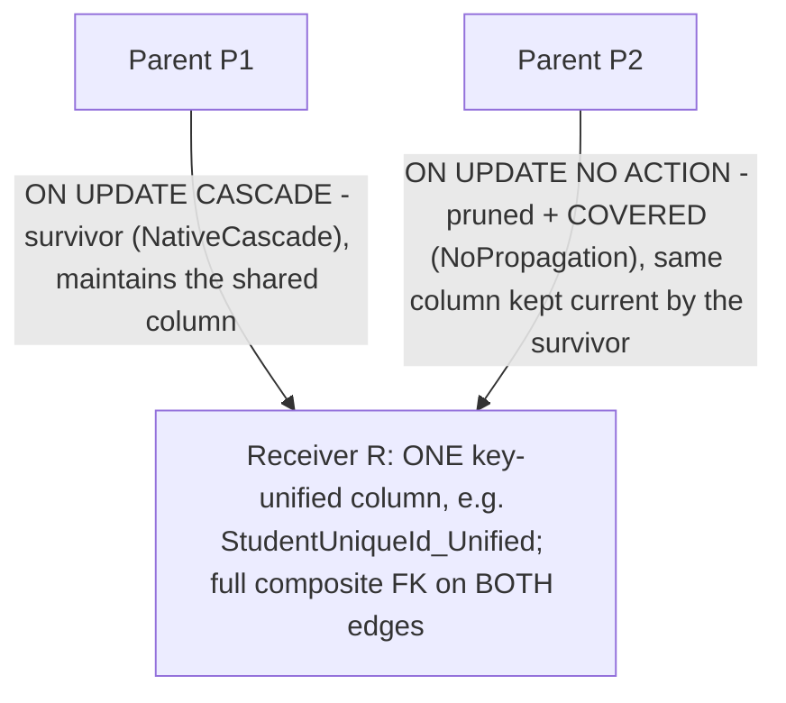
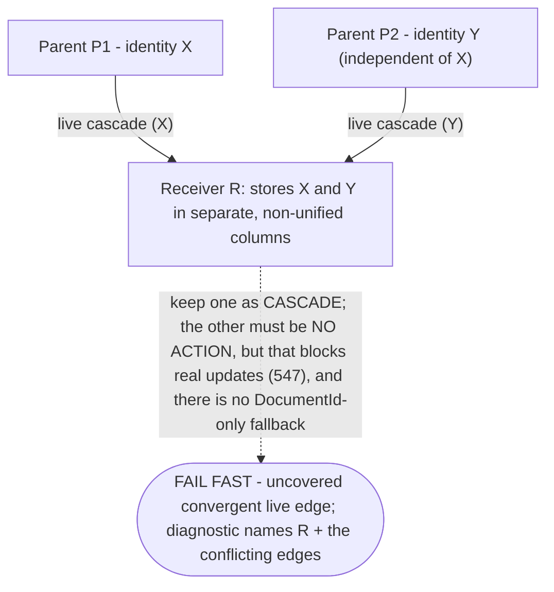
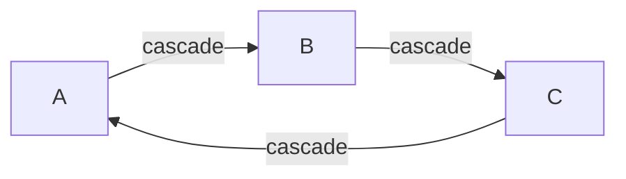
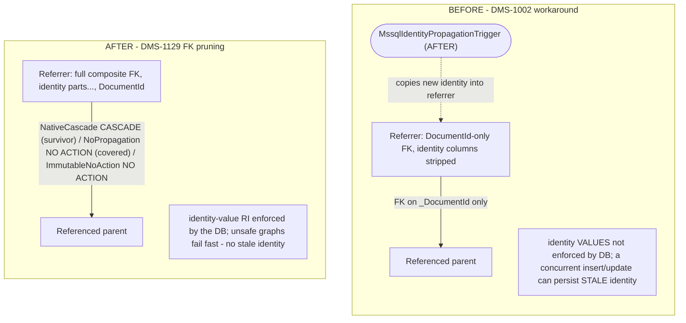

# SQL Server Identity-Update Cascade Handling and Foreign-Key Pruning

## Status

Design note produced by the DMS-1129 spike ("Design foreign key pruning") and revised to resolve
implementation-readiness review findings before DMS-1258 begins. It defines the target strategy for
SQL Server identity-update propagation and **supersedes** the earlier "every SQL Server reference
composite FK uses `ON UPDATE NO ACTION` plus a `MssqlIdentityPropagationTrigger`" rule described in
`overview.md`, `strengths-risks.md`, `transactions-and-concurrency.md`, `key-unification.md`,
`data-model.md`, and `ddl-generation.md`. Those documents now point here for the SQL Server cascade
rules.

The SQL Server behaviors this design depends on were confirmed empirically against
`mcr.microsoft.com/mssql/server:2022-latest` (SQL Server 2022, RTM-CU25); see
[SQL Server behavior (empirically confirmed)](#sql-server-behavior-empirically-confirmed).

Implementation is tracked separately (see [Follow-up work](#follow-up-work)); this note is the
design only.

> **What changed in this revision (for reviewers).** Relative to the first spike draft this note:
> models the cascade graph in **propagation direction** (referenced/parent → referrer/child) and
> analyzes SQL Server error 1785 at the **cascade receiver** (the referrer reached by multiple
> cascade paths), not at the referenced parent; adds explicit **cycle / SCC** handling (fail fast);
> **removes `TriggerFallback`** (the `DocumentId`-only + trigger outcome) entirely, so every emitted
> SQL Server reference FK keeps the full composite key and a pruned live/uncovered edge is a
> fail-fast error; reframes the cross-dialect detection as a **SQL Server portability / authoring
> guard**, not a PostgreSQL correctness requirement; and uses **transitive** identity mutability
> consistently. A follow-up review round added a third `MssqlPropagationMode` value,
> **`ImmutableNoAction`**, so genuinely immutable full-composite `NO ACTION` FKs are classified
> explicitly instead of being conflated with pruned/covered edges. See
> [Resolved design decisions](#resolved-design-decisions).

## The problem

When a resource's identifying values change, the new values must reach every row that stores a
copy of them — the propagated identity-part columns on each direct referrer's storage table.
The two supported engines diverge:

- **PostgreSQL** allows a foreign-key graph with "cycles or multiple cascade paths", so DMS uses
  composite FKs `(…identity parts…, DocumentId)` with `ON UPDATE CASCADE` on every eligible edge
  (abstract targets, and concrete targets whose identity can change transitively). The engine
  propagates identity changes natively. This remains correct and unchanged.

- **SQL Server** rejects the same graph at DDL time whenever a table would be **reached by more
  than one cascade path**, or whenever the cascade edges form a cycle (error **1785**). To get a
  schema that even *creates*, DMS previously stripped every SQL Server reference composite FK down
  to `ON UPDATE NO ACTION` and propagated identity changes with AFTER-style
  `MssqlIdentityPropagationTrigger` triggers.

That trigger-only strategy then hit a second wall. SQL Server enforces a `NO ACTION` FK check as
part of the UPDATE statement — **before** any AFTER trigger on the same table runs — and its FK
checks cannot be deferred to end-of-transaction. So a composite FK that still contains the
identity columns will reject a parent identity update for any already-referenced row (error
**547**) before the propagation trigger can fix the children. DMS-1002 worked around *that* by
removing the identity columns from SQL Server propagation-managed FKs entirely and keeping only
`…_DocumentId` (see `ReferenceConstraintPass`). The cost: SQL Server no longer enforces
referential integrity on the identity *values*. A concurrent identity update racing an insert
that references the old identity can leave a referrer holding stale identity values, and nothing
in the database rejects it.

**DMS-1129 asks whether DMS should instead adopt ODS-style FK pruning** — keep the composite FK
(identity parts included, restoring value-level RI) and remove `ON UPDATE CASCADE` only from the
*redundant* edges — and, critically, how to do so without ODS's silent-mis-prune failure mode.

## Resolved design decisions

These are the load-bearing decisions this note settles; the sections below elaborate each. They
also drive the corrections applied to the other design docs by DMS-1129.

1. **Pruning / detection unit is the cascade receiver, in propagation direction.** The cascade
   graph is directed **referenced/parent table → referrer/child (receiver) table** — the direction
   an identity update actually propagates. SQL Server 1785 is analyzed at the *receiver*: a table
   reached by more than one cascade path (equivalently, with cascade in-degree > 1), **not** a
   referenced parent that happens to have several inbound reference FKs.

2. **Cascade cycles fail fast.** Any nontrivial strongly-connected component (SCC) or self-loop
   among cascade edges in the propagation graph is a hard derivation error with a diagnostic that
   names the SCC's tables and the FK edges that form the cycle. No pruning rule is claimed safe for
   cycles.

3. **`TriggerFallback` is removed.** There is no `DocumentId`-only + trigger outcome. Every emitted
   SQL Server reference FK keeps the **full composite** key (identity columns restored), so
   value-level RI is always enforced. A pruned edge is either *covered* by the surviving cascade
   (safe `NO ACTION`) or it is *live and uncovered*, which is a **fail-fast** error. This also
   removes the DMS-1002 stale-identity race, which the `DocumentId`-only shape reintroduced.

4. **Coverage / immutability use transitive identity mutability.** Cascade-eligibility *and*
   liveness are both defined as `IsAbstract || TransitivelyAllowIdentityUpdates`, matching
   `TransitiveIdentityMutabilityPass` and the branch in `ReferenceConstraintPass`. Directly-immutable
   references (`allowIdentityUpdates = false`) can still be *transitively* mutable and must be
   treated as live.

5. **The cross-dialect detection is a SQL Server portability / authoring guard, not a PostgreSQL
   correctness requirement.** PostgreSQL can natively cascade all paths of a multi-path or cyclic
   graph and keeps full-composite `ON UPDATE CASCADE` on every eligible edge, unchanged. Detection
   runs dialect-agnostically only so a schema that *cannot* be represented on SQL Server is surfaced
   early (and prevented in MetaEd), not because PostgreSQL needs pruning.

6. **Canonical FK/RefKey column order is identity parts first, `DocumentId` last.** This matches
   `ReferenceConstraintPass` and the `*_RefKey` ordering rationale in
   [change-queries.md](change-queries.md) § "*_RefKey index ordering for /deletes". Docs that showed
   `(DocumentId, <identity parts…>)` are corrected; no code change is required.

7. **DMS-1258 wording must be corrected before implementation.** The Jira ticket (and any older doc
   text) says pruning is decided "per referenced table"; that is the wrong orientation. It must be
   restated in receiver / referrer / path-convergence terms per decision 1. See
   [Correction required in the DMS-1258 ticket](#correction-required-in-the-dms-1258-ticket).

## Diagrams

These diagrams are the visual companion to the algorithm below; they are deliberately compact and
implementation-oriented so DMS-1258 can read the object contract, the graph orientation, and each
decision point directly. `overview.md` and `summary.md` cross-reference this section rather than
duplicating it.

### A. Database objects and what maintains them

Shows the objects a reference site involves and — critically — separates **identity-value
propagation** (a database FK cascade, solid arrows) from the **maintenance triggers** (dashed
arrows) that are *not* the propagation mechanism. Arrows here point in the FK **references**
direction (child → parent); the propagation graph in B reverses this.


*For DMS-1258:* the composite reference FK (identity parts first, `DocumentId` last) is the object
that carries `MssqlPropagationMode`; the dashed triggers are the unaffected maintenance triggers,
not the retired identity-value propagation trigger.

### B. Propagation-direction graph and the convergence receiver

Edges point in **propagation direction** (referenced/parent → referrer/child). The diamond makes the
receiver explicit.



*For DMS-1258:* SQL Server error 1785 is a property of **C** (cascade in-degree 2), not of the hub
**A**. The prune/survivor decision is made at each receiver with in-degree > 1 — never "per
referenced table".

### C. Safe pruning — covered edge (restores identity-value RI)

Both incoming edges bind the **same key-unified canonical column** on the receiver, so the survivor's
cascade keeps it current and the pruned `NO ACTION` FK never observes a mismatch (probe 6).



*For DMS-1258:* both edges keep the **full composite** FK, so identity values are enforced by the
DB — no `DocumentId`-only shape, no stale-identity window. Only the pruned edge carries
coverage/carrier diagnostics (which survivor covers it, over which columns).

### D. Unsafe convergence — fail fast (no DocumentId-only fallback)

The two incoming edges carry **independent** identities into **separate, non-unified** columns, so no
survivor choice covers the other.



*For DMS-1258:* this is the case ODS prunes silently and wrongly. DMS raises a hard derivation
error; MetaEd (METAED-1667) should reject it at authoring time.

### E. Cascade cycle / SCC — fail fast



*For DMS-1258:* a nontrivial SCC (or a self-loop) is the "cycles" half of error 1785. Pruning one
edge does not leave a cascade that still propagates every identity, so no pruning rule is claimed
safe → fail fast, naming the SCC tables and the FK edges in the cycle.

### F. Before (DMS-1002 workaround) vs after (DMS-1129 pruning)



*For DMS-1258:* the migration is "restore the full composite FK everywhere + classify each edge",
not "add another trigger". The before-column mechanism (`DocumentId`-only + trigger) is removed
entirely.

## SQL Server behavior (empirically confirmed)

Six probes were run against a throwaway SQL Server 2022 container. Each result is the load-bearing
fact for one part of the design. The minimal reproduction DDL is inlined so this note is
self-contained.

| # | Probe | Result | Design consequence |
|---|-------|--------|--------------------|
| 1 | Two `ON UPDATE CASCADE` paths reach one table (diamond) | **Msg 1785** at `CREATE` | SQL Server forbids a table reachable by multiple cascade paths — pruning is *required* on SQL Server. The rejected table is the **receiver** at the bottom of the diamond, not the referenced parent at the top. |
| 2 | Same diamond, redundant edge set to `ON UPDATE NO ACTION` | DDL succeeds | Converting a redundant cascade edge into the receiver to `NO ACTION` (pruning) makes the graph legal. |
| 3 | `NO ACTION` composite FK that **includes identity columns**; update parent identity of a referenced row | **Msg 547**, and an AFTER UPDATE trigger that fixes the referrer does **not** rescue it | A `NO ACTION` composite FK blocks the update before the trigger runs. You cannot keep identity columns in a `NO ACTION` FK *and* rely on a trigger — this is why `TriggerFallback` cannot preserve value-level RI. |
| 4 | Kept `ON UPDATE CASCADE` composite FK (identity parts + DocumentId); update parent identity | Succeeds; referrer auto-updated | A kept cascade edge preserves full value-level RI and propagates natively. |
| 5 | `INSTEAD OF UPDATE` trigger on a table that has a cascading FK | **Msg 2113** | The "reorder children-first via `INSTEAD OF`" alternative is unavailable on any table participating in a kept cascade. |
| 6 | Diamond where the pruned `NO ACTION` edge shares a **key-unified** column with a surviving cascade path; update the shared key | Succeeds; shared column propagated | Pruning is *safe* exactly when the pruned edge's stored column is maintained by the surviving cascade, because `NO ACTION` never observes an inconsistent value. |

Minimal reproductions:

```sql
-- Probe 1: multiple cascade paths reach one receiver, rejected (Msg 1785).
-- Propagation direction is A -> {B, C} and B -> C; the receiver C is reached by
-- two cascade paths (A->C and A->B->C), which is what SQL Server rejects.
CREATE TABLE dbo.A (Id int NOT NULL PRIMARY KEY);
CREATE TABLE dbo.B (Id int NOT NULL PRIMARY KEY, A_Id int NOT NULL,
    CONSTRAINT FK_B_A FOREIGN KEY (A_Id) REFERENCES dbo.A(Id) ON UPDATE CASCADE);
CREATE TABLE dbo.C (Id int NOT NULL PRIMARY KEY, A_Id int NOT NULL, B_Id int NOT NULL,
    CONSTRAINT FK_C_B FOREIGN KEY (B_Id) REFERENCES dbo.B(Id) ON UPDATE CASCADE,
    CONSTRAINT FK_C_A FOREIGN KEY (A_Id) REFERENCES dbo.A(Id) ON UPDATE CASCADE); -- 1785 here

-- Probe 3: NO ACTION composite FK incl. identity columns blocks the parent update (Msg 547),
-- and an AFTER trigger cannot rescue it because the FK check precedes the trigger.
-- Column order is identity parts first, DocumentId last (the canonical DMS order).
CREATE TABLE dbo.Target (DocumentId int NOT NULL PRIMARY KEY, IdVal nvarchar(50) NOT NULL,
    CONSTRAINT UQ_Target_RefKey UNIQUE (IdVal, DocumentId));
CREATE TABLE dbo.Referrer (DocumentId int NOT NULL PRIMARY KEY,
    Target_IdVal nvarchar(50) NOT NULL, Target_DocumentId int NOT NULL,
    CONSTRAINT FK_Referrer_Target FOREIGN KEY (Target_IdVal, Target_DocumentId)
        REFERENCES dbo.Target (IdVal, DocumentId) ON UPDATE NO ACTION);
INSERT dbo.Target VALUES (1, 'old'); INSERT dbo.Referrer VALUES (10, 'old', 1);
UPDATE dbo.Target SET IdVal = 'new' WHERE DocumentId = 1; -- 547, even with an AFTER trigger present
```

### Validation on a populated database

The mechanics above were re-confirmed against a real, populated Ed-Fi ODS/API database
(`EdFi_Ods_Populated_Template`, SQL Server 2022) — the reference implementation this design
mirrors — using transactions that were rolled back, so the database was left untouched:

- **Cascade at scale on real composite keys.** Renaming one `edfi.Session` row (the 3-part natural
  key `SchoolId, SchoolYear, SessionName`) cascaded transitively — `Session → CourseOffering → Section` — rewriting 237 CourseOfferings and 237 Sections (plus their own cascade descendants)
  from a single `UPDATE`, in ~1.2 s. This is a concrete, real-data confirmation of the
  identity-update *fan-out* risk in [strengths-risks.md](strengths-risks.md): one identity change on
  a hub row synchronously rewrites hundreds-to-thousands of rows.
- **1785 on a real hub.** Adding a second `ON UPDATE CASCADE` path that reaches `edfi.Section`
  through `edfi.Session` (a diamond) failed with the verbatim
  `Msg 1785 … may cause cycles or multiple cascade paths`; pruning that one redundant edge into the
  receiver to `ON UPDATE NO ACTION` made the identical schema legal.
- **Base-model observation.** In the stock Ed-Fi data model the cascade cluster (Section, Session,
  CourseOffering, ClassPeriod, …; 41 `CASCADE` FKs vs 1628 `NO ACTION`) is already an acyclic graph
  with no convergent diamond, so ODS pruned nothing in that schema. Pruning is exercised by specific
  key-unification topologies (the `KeyUnifiedResource`-style extension in DMS-1129), not the base
  model — so the safe-vs-unsafe classification and fail-fast matter chiefly for extensions and
  heavily key-unified resources.

## Design: pruning with a safety classification

The strategy is **hybrid, deterministic, and fail-fast**. On SQL Server, DMS keeps
`ON UPDATE CASCADE` (with the full composite FK, identity columns included) on the *surviving*
edge into each convergence receiver, prunes the redundant edges into that receiver to `NO ACTION`
(still full composite), and refuses to emit DDL for any graph where no safe pruning exists — a
cascade cycle, or a receiver whose redundant edges cannot all be covered. This replaces the current
"strip identity columns everywhere + trigger" default. **No pruned edge is ever reduced to a
`DocumentId`-only FK.**

### 1. Build the cascade graph in propagation direction

Vertices are storage tables (concrete resource roots, child/collection and `_ext` binding
tables, and abstract identity tables). A directed **cascade edge** runs **from the referenced
target table to the referrer binding table** — the direction an identity update propagates — when
the reference is identity-propagating, i.e. the target is abstract or the concrete target has
`TransitivelyAllowIdentityUpdates = true` (decision 4). This is the transitive-mutability set:
directly-immutable references that are nonetheless transitively mutable are included; genuinely
immutable references (`IsAbstract = false` and `TransitivelyAllowIdentityUpdates = false`) are
**excluded** from the graph and always get a plain full-composite `NO ACTION` FK — classified
`ImmutableNoAction` in the [derived-model contract](#derived-model-contract-for-dms-1258) — so they
never participate in convergence and are not pruning candidates.

This is the same underlying edge set that `ReferenceConstraintPass` and
`DeriveTriggerInventoryPass.BuildReverseReferenceIndex` already enumerate — only the **orientation**
of analysis is stated explicitly here (parent → child). The classification is a new pass over that
graph, not a new graph. Ordering for determinism follows the existing convention (edges keyed by
source/referrer table identifier, then constraint name), mirroring ODS's `sortBy(odsTableId)` so
pruning is reproducible.

### 2. Detect cycles / SCCs — fail fast

Compute strongly-connected components over the propagation-direction graph (e.g. Tarjan's
algorithm) and detect self-loops. Any nontrivial SCC (two or more mutually reachable tables) or
self-loop among cascade edges is the "cycles" half of SQL Server error 1785 and has **no safe
pruning rule** — pruning any single edge of a cycle does not make the remaining cascade acyclic in a
way that still propagates every identity. DMS **fails derivation** with a diagnostic that names the
SCC's tables and the exact FK edges (constraint names) forming the cycle.

### 3. Detect convergence receivers (multiple cascade paths)

A table is legal on SQL Server iff no table is reached by more than one cascade path. Because two
distinct cascade paths to a receiver must reconverge at some table with cascade **in-degree > 1**,
it is sufficient to reduce the graph so **every receiver has at most one incoming cascade edge**:
a forest of cascade edges has no reconvergence and therefore no multiple-path table. So the
convergence unit is a **receiver (child/referrer) table whose cascade in-degree is greater than 1**
— a *pruning candidate*. (This is the correction to the earlier "collect a referenced table's
incoming reference FKs" framing, which grouped on the wrong vertex.)

### 4. Classify coverage using transitive mutability

Every cascade edge is *live* by construction (an immutable reference would not be in the graph —
decision 4). For a candidate receiver, exactly one incoming edge can remain `ON UPDATE CASCADE`
(the **survivor** `S`); the rest must be pruned to `NO ACTION`. A pruned edge `E` is:

- **Covered** — `E`'s stored identity-part columns are, under key unification, the *same canonical
  storage columns* the surviving cascade `S` already maintains on the receiver. Pruning `E` to a
  full-composite `NO ACTION` FK is safe: `S` keeps the shared column consistent, so the pruned FK
  never observes a mismatch (probe 6). `E` becomes `NoPropagation` and keeps the **full composite**
  FK — RI is preserved without a second cascade path.

- **Uncovered** — `E` propagates an identity into columns that `S` does not maintain. A
  full-composite `NO ACTION` on those columns would block real identity updates (probe 3), and
  neither a trigger (probe 3) nor an `INSTEAD OF` reorder (probe 5) can rescue it while the identity
  columns remain in the FK. There is no safe emission for `E` → **fail fast** (step 6).

### 5. Choose the survivor and emit outcomes

For each candidate receiver, choose the survivor deterministically so that **every** other incoming
edge is covered by it:

1. Consider each incoming cascade edge as a candidate survivor.
2. Keep the first candidate (by receiver-edge order: source table identifier, then constraint name)
   for which *all* other incoming edges are covered under key unification.
3. If such a survivor exists: emit it as `NativeCascade` and emit the remaining edges as
   `NoPropagation`.
4. If no candidate survivor covers all the others, the receiver has ≥1 uncovered live edge under
   every choice → **fail fast** (step 6).

Receivers with cascade in-degree ≤ 1 keep their single edge as `NativeCascade` (no pruning needed).

| Final per-edge outcome (`MssqlPropagationMode`) | FK shape | `ON UPDATE` | Propagation mechanism | Carrier diagnostics |
|------------------------|----------|-------------|-----------------------|---------------------|
| `NativeCascade` (cascade-eligible; surviving edge, or the sole edge into a receiver) | full composite (identity parts + DocumentId) | `CASCADE` | engine cascade (probe 4) | none |
| `NoPropagation` (cascade-eligible; pruned, covered) | full composite | `NO ACTION` | none needed — covered by the surviving cascade (probe 6) | **yes** — records the covering survivor + shared columns |
| `ImmutableNoAction` (not cascade-eligible; immutable target, not in the cascade graph) | full composite | `NO ACTION` | none — the referenced identity cannot change | none |
| **derivation fails** (cascade cycle/SCC, or a receiver with any uncovered live pruned edge) | — | — | **fail fast** with a diagnostic | n/a |

There is **no** `TriggerFallback` / `DocumentId`-only outcome. Every emitted SQL Server reference FK
keeps the full composite key, so value-level RI is always enforced and the DMS-1002 stale-identity
race does not reappear. Note that `ON UPDATE NO ACTION` is emitted for *two distinct* reasons —
`NoPropagation` (a pruned but covered cascade-eligible edge) and `ImmutableNoAction` (a reference
whose target identity cannot change) — so the mode is **not** derivable from the `OnUpdate` action
alone; that is exactly why it is carried explicitly (see the contract).

### 6. Fail fast when no safe pruning exists

Derivation fails, with a diagnostic, in exactly two situations:

- **Cascade cycle** (step 2): the propagation graph has a nontrivial SCC or self-loop. Diagnostic
  names the SCC tables and the FK edges forming the cycle.
- **Uncovered convergence** (step 5): a candidate receiver has, under every survivor choice, at
  least one live incoming edge that is not covered by the survivor. There is no legal SQL Server
  DDL that preserves identity RI here — SQL Server allows at most one cascade path into the receiver
  (probe 1), a `NO ACTION` composite FK cannot be trigger-rescued (probe 3), and `INSTEAD OF` is
  unavailable (probe 5). Diagnostic names the receiver table and the conflicting live edges
  (referrer table + constraint name for each).

Both are precisely the cases ODS prunes silently and incorrectly. Failing here is safe because the
schema that produces it should have been rejected at authoring time (see the MetaEd follow-up), so
the DMS check is a defense-in-depth backstop. Because `TriggerFallback` is gone, this fail-fast is
now the *only* backstop for an uncovered live edge — which makes the MetaEd authoring guard
load-bearing rather than merely nice-to-have.

## Dialect scope decision (AC: "MSSQL only, or both?")

**Recommendation: physical FK pruning is emitted for SQL Server only; PostgreSQL keeps full
composite `ON UPDATE CASCADE` on every eligible edge.** ODS prunes for both engines, but ODS's
motivation is uniform DDL generation, not a PostgreSQL correctness need. PostgreSQL has no
multiple-cascade-paths restriction and no `NO ACTION`-before-trigger problem: it can preserve full
composite cascades on all paths of a multi-path graph (and can cascade through cycles), so pruning
on PostgreSQL would only *remove* native RI enforcement for no benefit.

The unsafe-graph condition ("a receiver with uncovered convergent live paths", or "a cascade
cycle") is therefore **not a PostgreSQL correctness problem** — PostgreSQL handles those graphs
natively. It is a **SQL Server portability / parity concern**: a schema authored and validated on
PostgreSQL could fail to create on SQL Server. The split is:

- **Detect** the SQL-Server-unsatisfiable condition during model derivation for both dialects, so a
  non-portable schema is surfaced early regardless of the engine currently in use (schema
  soundness / cross-engine parity), **not** because PostgreSQL requires it.
- **Emit** cascade pruning (`CASCADE` → `NO ACTION` rewrites) only for SQL Server DDL. PostgreSQL
  physical emission is unchanged: full-composite `ON UPDATE CASCADE` on every eligible edge.
- **Prevent** the condition at authoring time in MetaEd (below), so neither engine encounters it in
  practice.

If a future decision wants PostgreSQL to *also* fail on these graphs, that must be stated as an
explicit cross-dialect authoring policy — it does not follow from PostgreSQL semantics.

## Derived-model contract for DMS-1258

The classification produces per-edge metadata plus diagnostics that DDL generation, runtime, and
manifest verification all consume. The **concrete C# shape is deferred to DMS-1258**, but this
design fixes the contract that ticket must add. Today's shared model
(`EdFi.DataManagementService.Backend.External/RelationalModelTypes.cs`) only carries the FK's
`ReferentialAction OnUpdate` and, in the compiled-mapping-set inventory, a trigger inventory
(`compiled-mapping-set.md`); neither expresses cascade classification.

DMS-1258 must add:

- **Per-edge `MssqlPropagationMode`** on every SQL Server reference FK, with exactly three values —
  a *total* classification, so a consumer never has to infer intent from `OnUpdate`:
  - `NativeCascade` — a cascade-eligible edge kept as the surviving cascade (or the sole edge into a
    receiver); `ON UPDATE CASCADE`.
  - `NoPropagation` — a cascade-eligible edge that was pruned but is covered by the surviving
    cascade; `ON UPDATE NO ACTION`.
  - `ImmutableNoAction` — a reference to a genuinely immutable target
    (`IsAbstract = false` and `TransitivelyAllowIdentityUpdates = false`), which is not part of the
    cascade graph and not a pruning candidate; `ON UPDATE NO ACTION`.

  The `OnUpdate` action does **not** determine the mode: `CASCADE` ⇒ `NativeCascade`, but
  `NO ACTION` is either `NoPropagation` or `ImmutableNoAction`. The mode is therefore carried
  explicitly (it distinguishes "pruned but covered" from "immutable"), not derived. (The earlier
  draft's `TriggerFallback` value is removed, and the `MssqlFkShape`
  (`FullComposite` / `DocumentIdOnly`) axis is dropped entirely — every SQL Server reference FK is
  full composite, so shape is no longer a variable.)
- **Coverage / carrier diagnostics — only for `NoPropagation` edges**: which surviving cascade edge
  (receiver + survivor constraint name) covers the pruned edge and over which shared canonical
  columns, emitted into the relational-model manifest so pruning decisions are auditable and
  reproducible. `NativeCascade` and `ImmutableNoAction` edges carry **no** carrier diagnostics —
  there is nothing to attribute (a survivor is self-carrying; an immutable target never changes).
- **Fail-fast derivation errors** for the two conditions in step 6 (cycle/SCC; uncovered
  convergence), each carrying the offending tables and FK constraint names, surfaced as hard
  derivation errors (not manifest warnings).

PostgreSQL emission and its `OnUpdate` values are unchanged; `MssqlPropagationMode` is meaningful
only for SQL Server model sets (it is absent / not applicable on PostgreSQL FKs).

## FK / RefKey column order (canonical)

The canonical physical order for both the referenced-key UNIQUE (`*_RefKey`) and the composite
reference FK is **identity storage columns first, `DocumentId` last**:
`(<identity storage columns…>, DocumentId)`. This matches `ReferenceConstraintPass` today and the
`/deletes` recreated-resource seek-path rationale in
[change-queries.md](change-queries.md) § "*_RefKey index ordering for /deletes": leading with the
identity values gives the anti-join a useful seek path, which a leading `DocumentId` would not.

DMS-1258 requires **no change** to `ReferenceConstraintPass` column ordering. Design docs that
previously illustrated `(DocumentId, <identity parts…>)` are corrected to this order for
consistency (data-model.md, transactions-and-concurrency.md, key-unification.md, summary.md,
ddl-generation.md).

## Comparison to the ODS implementation

ODS (`UpdateCascadeTopLevelEntityEnhancer.ts`) builds a graph from entities with
`allowPrimaryKeyUpdates`, follows identity / identity-rename references, finds vertices whose
`inEdges(...).length > 1`, sorts incoming edges by `odsTableId`, keeps the first, and marks the
rest `odsCausesCyclicUpdateCascade = true` (rendered as `NO ACTION`). It has **no handling** for
the case where a pruned edge is a live, uncovered identity source — it prunes by sort order
regardless, which can silently drop a cascade that was actually required (the failure mode called
out in DMS-1129).

DMS keeps the deterministic graph/sort skeleton but analyzes it in propagation direction, adds
explicit **cycle/SCC detection** (step 2), the **coverage classification** (step 4), and the
**fail-fast** (step 6): a covered edge is pruned safely; a cascade cycle or an uncovered live
conflict is a hard error, never a silent prune.

## Migration from the current code

- `ReferenceConstraintPass.ResolveOnUpdate` — currently returns `NoAction` for **all** SQL Server
  reference FK updates. Under this design it returns `Cascade` for `NativeCascade` survivors (and
  sole edges into a receiver) and `NoAction` for pruned `NoPropagation` edges, driven by the new
  classification.
- `ReferenceConstraintPass` `mssqlTriggerHandlesPropagation` branch — currently drops identity
  columns from the FK (the `DocumentId`-only shape) for every abstract / transitively-mutable
  target on SQL Server. Under this design that branch is **removed**: SQL Server reference FKs are
  always emitted with the full composite key (identity parts first, `DocumentId` last), exactly like
  PostgreSQL; only the `OnUpdate` action differs by classification. Column ordering is unchanged.
- `DeriveTriggerInventoryPass.EmitMssqlIdentityPropagationTriggers` — currently emits a
  propagation trigger for every eligible target. Under this design **no identity-value propagation
  triggers are emitted**: native cascade on the surviving edge (which naturally follows FKs on child
  and extension binding tables) replaces the trigger fan-out, and covered pruned edges need no
  propagation. The `MssqlIdentityPropagationTrigger` trigger kind is retired for identity-value
  propagation. (The UUIDv5 referential-identity and abstract-identity *maintenance* triggers are
  unaffected — see Non-goals.)
- New derivation output: per-edge `MssqlPropagationMode` (`NativeCascade` / `NoPropagation` /
  `ImmutableNoAction`), coverage/carrier diagnostics for `NoPropagation` edges only, and hard
  derivation errors for cascade cycles and uncovered convergence (see the contract above). Immutable
  references — which `ResolveOnUpdate` already emits as `NO ACTION` — become `ImmutableNoAction`
  rather than being conflated with pruned/covered edges.

PostgreSQL emission is unchanged.

## Correction required in the DMS-1258 ticket

The DMS-1258 implementation ticket (and any residual doc text) describes pruning as choosing a
survivor "per referenced table". That orientation is wrong per decision 1 and must be restated
before implementation begins:

- The survivor/prune decision is made **per cascade receiver** (the referrer/child table reached by
  multiple cascade paths), analyzed in **propagation direction**, using **path convergence**
  (cascade in-degree > 1), not per referenced/parent table.
- The ticket must also drop `TriggerFallback` / `DocumentId`-only wording: the per-edge outcomes are
  `NativeCascade`, `NoPropagation`, `ImmutableNoAction`, or fail-fast, and every emitted FK is full
  composite.
- The ticket must add explicit **cycle/SCC fail-fast** to the scope.

## Follow-up work

- **MetaEd** (authoring guard — now load-bearing): disallow `allow primary key updates`
  configurations that yield a cascade cycle or a receiver with an uncovered convergent live edge —
  i.e. any graph where no safe pruning exists — so unsafe schemas are rejected before they reach
  DMS. Because `TriggerFallback` no longer provides a permissive fallback, this guard is the
  primary place such schemas should be caught; the DMS fail-fast is the backstop. Tracked as
  METAED-1667.
- **DMS-1258** (implementation): implement the propagation-direction graph, cycle/SCC detection, the
  coverage classification, deterministic survivor selection with full-composite restoration on
  kept/covered edges, removal of the `DocumentId`-only branch and the identity-propagation trigger,
  the `MssqlPropagationMode` contract, and fail-fast derivation. Correct the ticket wording first
  (above).
- **DMS-1128**: superseded by DMS-1258; reconcile with this design.

## Non-goals

- No production implementation is part of the DMS-1129 spike; only this design, the empirical
  confirmation, and the follow-up tickets.
- No change to PostgreSQL cascade behavior (full-composite `ON UPDATE CASCADE` on every eligible
  edge).
- No change to the UUIDv5 referential-identity or abstract-identity *maintenance* triggers; only the
  identity-*value* propagation mechanism for SQL Server is in scope (native cascade replaces the
  retired `MssqlIdentityPropagationTrigger`).
