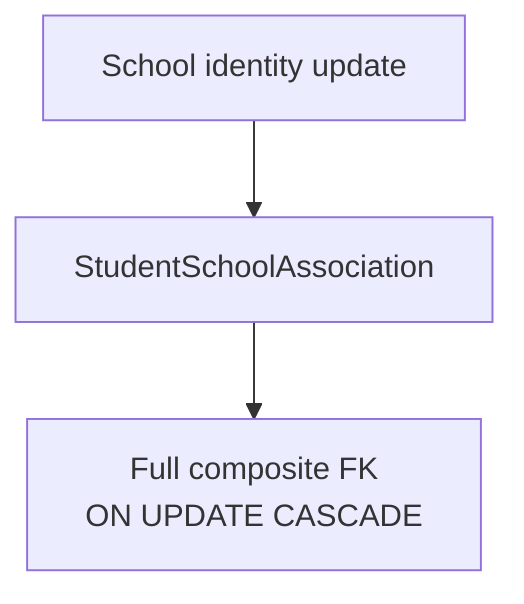
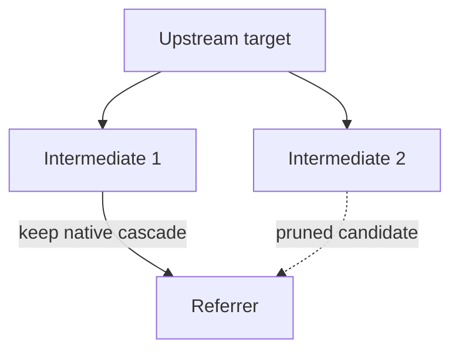
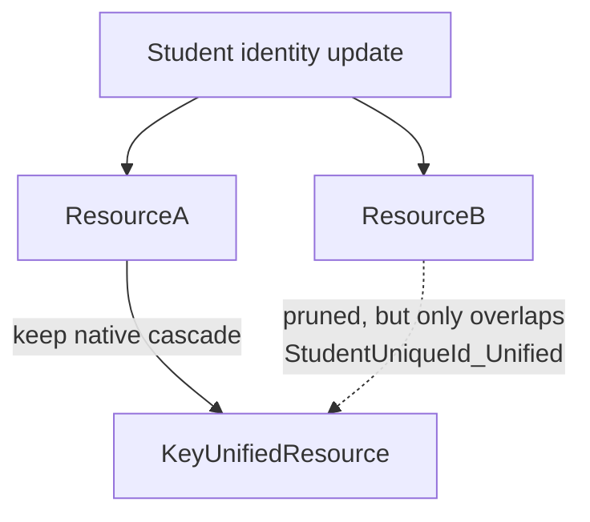
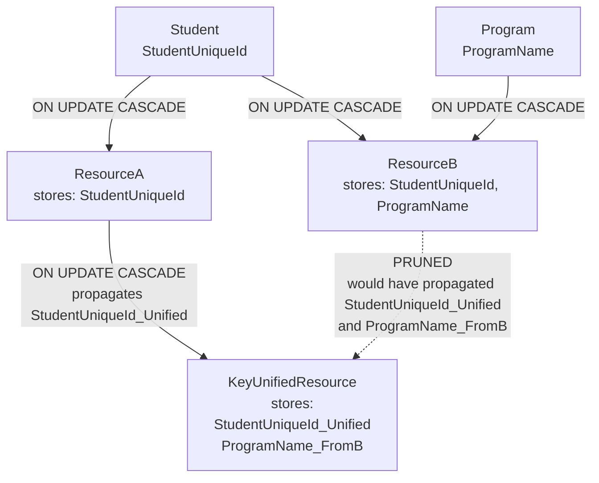
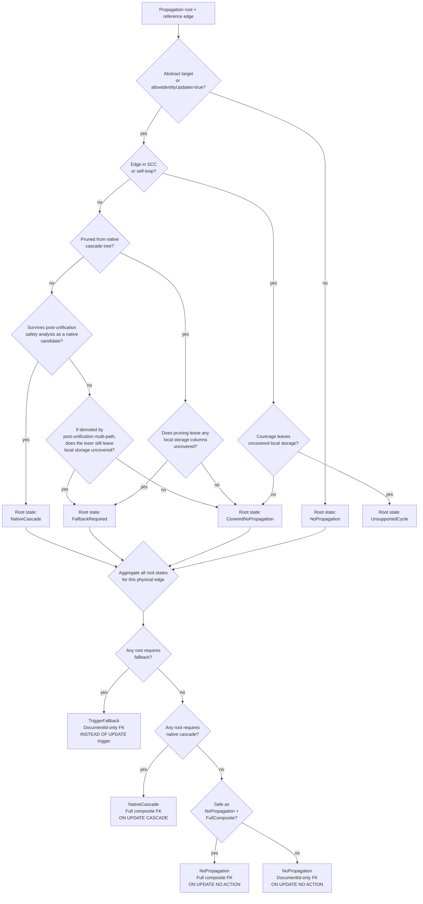
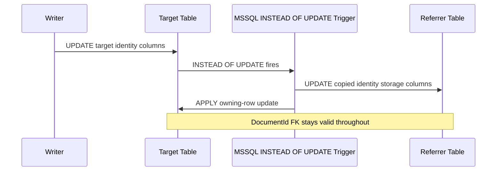
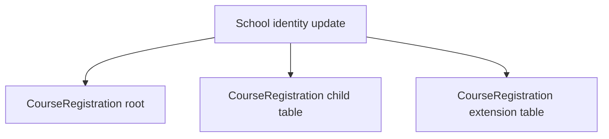
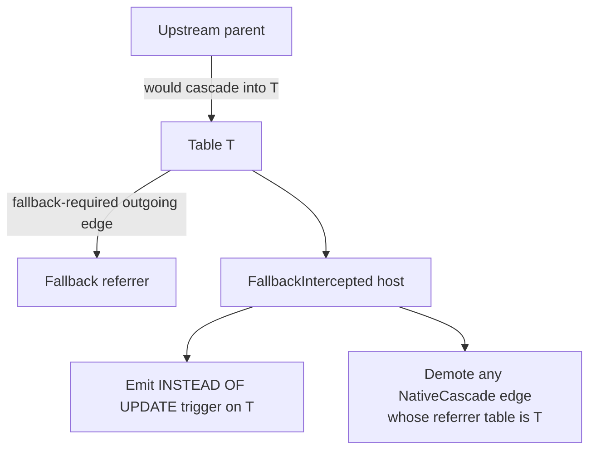

# MSSQL Cascade Revision

## Status

Draft proposal.

## Purpose

Revise the backend redesign's SQL Server identity-propagation strategy from a blanket:

- `ON UPDATE NO ACTION` on every reference FK, plus
- `DbTriggerKind.IdentityPropagationFallback` on every propagation-eligible target,

to a hybrid model that:

- uses native `ON UPDATE CASCADE` wherever SQL Server can support it safely,
- prunes repeated cascade paths deterministically, following the same core idea used by ODS/MetaEd,
- uses trigger fallback only for the remaining non-cyclic unsafe propagation edges that are still supported in v1, and
- is explicit that trigger-fallback edges may need weaker `DocumentId`-only FKs unless and until a safe composite-FK fallback scheme is proven.

This proposal is intended to replace the blanket MSSQL rule currently described in:

- `reference/design/backend-redesign/design-docs/summary.md`
- `reference/design/backend-redesign/design-docs/overview.md`
- `reference/design/backend-redesign/design-docs/data-model.md`
- `reference/design/backend-redesign/design-docs/transactions-and-concurrency.md`
- `reference/design/backend-redesign/design-docs/ddl-generation.md`
- `reference/design/backend-redesign/design-docs/flattening-reconstitution.md`
- `reference/design/backend-redesign/design-docs/key-unification.md`
- `reference/design/backend-redesign/design-docs/strengths-risks.md`
- `reference/design/backend-redesign/epics/01-relational-model/07-index-and-trigger-inventory.md`

## Current Baseline

### Current design-doc rule

The current redesign docs standardize MSSQL on:

- `ON UPDATE NO ACTION` for all reference composite FKs, and
- `DbTriggerKind.IdentityPropagationFallback` for every propagation-eligible target.

That rule appears in multiple places, including:

- `reference/design/backend-redesign/design-docs/summary.md:29`
- `reference/design/backend-redesign/design-docs/overview.md:24`
- `reference/design/backend-redesign/design-docs/overview.md:124`
- `reference/design/backend-redesign/design-docs/data-model.md:609`
- `reference/design/backend-redesign/design-docs/transactions-and-concurrency.md:120`
- `reference/design/backend-redesign/design-docs/key-unification.md:1708`
- `reference/design/backend-redesign/design-docs/strengths-risks.md:82`

### Current implementation reality

The codebase already goes further than the prose in one important way:

1. For propagation-eligible MSSQL edges, current FK derivation drops the copied identity columns from the FK and keeps only `DocumentId`.
   - See `src/dms/backend/EdFi.DataManagementService.Backend.RelationalModel/SetPasses/ReferenceConstraintPass.cs:223`.
2. MSSQL propagation fallback is currently emitted as an `INSTEAD OF UPDATE` trigger on the referenced table.
   - See `src/dms/backend/EdFi.DataManagementService.Backend.Ddl/RelationalModelDdlEmitter.cs:553`.
3. The trigger updates referrers' copied identity columns, then applies the owning-row update.
   - See `src/dms/backend/EdFi.DataManagementService.Backend.Ddl/RelationalModelDdlEmitter.cs:1616`.
4. Reverse-index derivation for fallback propagation currently only considers root-table reference bindings.
   - See `src/dms/backend/EdFi.DataManagementService.Backend.RelationalModel/SetPasses/DeriveTriggerInventoryPass.cs:537`.

### ODS reference point

ODS/MetaEd already uses a narrower MSSQL cascade strategy:

- it computes a cascade graph,
- detects repeated incoming cascade paths,
- keeps one incoming cascade edge deterministically, and
- disables the rest by marking `odsCausesCyclicUpdateCascade = true`.

Relevant implementation points:

- `metaed-plugin-edfi-ods-relational/src/enhancer/UpdateCascadeTopLevelEntityEnhancer.ts:25`
- `metaed-plugin-edfi-ods-relational/src/enhancer/ForeignKeyCreatingTableEnhancer.ts:185`

The ODS idea is sound and should inform DMS. However, DMS is not structurally identical to ODS:

- DMS relationships are anchored by stable `DocumentId`,
- DMS duplicates referenced identity parts locally for reconstitution and query,
- DMS key unification can collapse multiple reference sites onto one canonical storage column, and
- current MSSQL fallback in DMS is implemented as a trigger-managed rewrite of copied identity columns.

So ODS gives the right pruning principle, but not a complete physical design for all DMS fallback edges.

## Problem Statement

The current blanket MSSQL rule is too conservative and too trigger-heavy.

It has four main drawbacks:

1. It diverges from PostgreSQL more than necessary.
2. It increases trigger complexity, fan-out, and engine-specific behavior.
3. It hides an important distinction between:
   - edges where SQL Server can safely use declarative cascades, and
   - edges where SQL Server truly needs fallback logic.
4. It obscures a real integrity tradeoff on fallback edges:
   - with the current `INSTEAD OF UPDATE` trigger model, full composite `(DocumentId, identity parts)` FKs are not obviously safe under `ON UPDATE NO ACTION`,
   - so current code has already fallen back to `DocumentId`-only FKs for those edges.

## Goals

1. Make MSSQL as declarative as possible while preserving deterministic DDL.
2. Keep MSSQL behavior closer to PostgreSQL where SQL Server can support it.
3. Reuse the ODS idea of pruning repeated cascade paths instead of defaulting to triggers everywhere.
4. Keep key-unification semantics intact:
   - native cascades and fallback triggers must always target canonical/storage columns, never aliases.
5. Be explicit about the FK-strength tradeoff on fallback edges.
6. Preserve deterministic model derivation, manifest output, DDL emission, and test fixtures.

## Non-Goals

- Eliminating MSSQL trigger fallback entirely.
- Solving cross-table equality propagation in this proposal.
  - That remains the separate problem described in `key-unification-children-problem.md` and `key-unification-design-change-proposal.md`.
- Proving a stronger composite-FK fallback scheme in the first revision.
- Replacing the current `INSTEAD OF UPDATE` fallback implementation in the first revision.

## Proposal Summary

SQL Server final edge emission should be modeled as two related decisions:

1. a final `PropagationMode`, and
2. a final `FkShape`.

### Final `PropagationMode`

| Mode | Meaning | Notes |
| --- | --- | --- |
| `NoPropagation` | This edge does not perform identity propagation. | Includes both inherently non-propagating edges and fully covered pruned edges. |
| `NativeCascade` | This edge propagates via a composite FK with `ON UPDATE CASCADE`. | Preferred MSSQL mode. |
| `TriggerFallback` | This edge propagates via SQL Server trigger logic. | Only for propagation work that declarative cascade cannot safely cover. |

### Final `FkShape`

| Shape | Meaning | Notes |
| --- | --- | --- |
| `FullComposite` | `(DocumentId, identity storage columns...)` | Strongest declarative shape. |
| `DocumentIdOnly` | `..._DocumentId -> Target.DocumentId` | Weaker integrity shape used only where full composite is not currently safe. |

### Valid final combinations in v1

| `PropagationMode` | `FkShape` | Update behavior | Notes |
| --- | --- | --- | --- |
| `NoPropagation` | `FullComposite` | `ON UPDATE NO ACTION` | Default for non-propagating edges; also valid for fully covered pruned edges when physically safe. |
| `NoPropagation` | `DocumentIdOnly` | `ON UPDATE NO ACTION` | Explicit v1 outcome for a fully covered pruned edge whose full composite `NO ACTION` FK would still be MSSQL-invalid. |
| `NativeCascade` | `FullComposite` | `ON UPDATE CASCADE` | Preferred MSSQL mode for safe propagation edges. |
| `TriggerFallback` | `DocumentIdOnly` | Trigger-managed propagation | Current safe fallback; may be strengthened later if proven. |

The key change is:

- MSSQL should not treat every propagation-eligible reference edge as `TriggerFallback`.
- It should first attempt to keep the full composite FK with native `ON UPDATE CASCADE`.

Repeated-path pruning adds one more important distinction at derivation time:

- some pruned propagation candidates are **provisionally fully covered** by surviving native cascades and therefore need no replacement trigger if that coverage still holds after later table-level update-strategy validation, while
- other pruned candidates still carry **unique propagation work** and must become `TriggerFallback`.

This proposal treats that as a pruning/coverage diagnostic state, not as a fourth physical FK mode.
A fully covered prune that cannot safely keep a full composite `NO ACTION` FK remains `NoPropagation`; it does not become `TriggerFallback`.

## Normative Rule Set

### 1) Candidate propagation edges

For SQL Server, derive the same propagation-eligible reference-edge candidate set as PostgreSQL:

- abstract targets are propagation-eligible,
- concrete targets with `allowIdentityUpdates=true` are propagation-eligible,
- concrete targets with `allowIdentityUpdates=false` are not propagation-eligible.

Key-unification rules still apply before any physical decision:

- local FK identity columns must be mapped to canonical/storage columns,
- target identity columns must be mapped to canonical/storage columns,
- aliases are never FK columns and are never trigger update targets.

### 2) MSSQL classification model

Each MSSQL reference edge MUST end with:

- `MssqlPropagationMode`
  - `NoPropagation`
  - `NativeCascade`
  - `TriggerFallback`
- `MssqlFkShape`
  - `FullComposite`
  - `DocumentIdOnly`

Each MSSQL physical table that participates in propagation analysis MUST also end with:

- `MssqlTableUpdateStrategy`
  - `Unintercepted`
  - `FallbackIntercepted`

`FallbackIntercepted` means DMS emits a table-level MSSQL `INSTEAD OF UPDATE` fallback trigger on that table because one or more outgoing propagation edges from that table require `TriggerFallback`.

However, table-level interception is only the physical DDL grouping.
It is not sufficient by itself for post-validation coverage reconciliation.
DMS MUST also retain explicit root-scoped fallback-carrier entries after aggregation and validation.
This proposal refers to each such entry as `MssqlFallbackCarrier`.

Each `MssqlFallbackCarrier` MUST identify, at minimum:

- the `PropagationRoot`,
- the physical `ReferenceEdge` whose propagation responsibility is being carried by fallback,
- the fallback host table,
- the referrer row scope,
- the local canonical/storage columns maintained by fallback for that responsibility, and
- why fallback is carrying it:
  - direct unsafe-edge fallback,
  - replacement for a pruned edge with uncovered work, or
  - replacement after a provisional `NativeCascade` edge was demoted during table-level validation.

A table may be `FallbackIntercepted` while carrying fallback responsibility for only a subset of the reachable root/edge responsibilities involving that table.
Therefore:

- `MssqlTableUpdateStrategy` answers where MSSQL `INSTEAD OF UPDATE` triggers are emitted, while
- `MssqlFallbackCarrier` answers which root/edge responsibilities those triggers must cover.

Under the documented SQL Server rule set, a `FallbackIntercepted` table MUST NOT also be the referrer/receiving table of any final `NativeCascade` edge.
Microsoft documents that `INSTEAD OF UPDATE` triggers are not allowed on tables that are targets of cascaded referential integrity constraints, and that `ON UPDATE CASCADE` cannot be defined on a table that already has an `INSTEAD OF UPDATE` trigger.

This constraint is narrower than the stronger claim that every other edge involving the same referenced parent table must be demoted.
The cited Microsoft documentation does not establish that broader rule.

Valid v1 final combinations are:

- `NoPropagation` + `FullComposite`
- `NoPropagation` + `DocumentIdOnly`
- `NativeCascade` + `FullComposite`
- `TriggerFallback` + `DocumentIdOnly`

However, final FK emission is **not** derived directly from one global edge-level pruning pass.
The derivation model is:

1. root-scoped pruning and provisional coverage analysis over `(PropagationRoot, ReferenceEdge)`, then
2. provisional per-edge aggregation,
3. table-level update-strategy validation over fallback-trigger hosts and native-cascade target tables,
4. post-validation coverage reconciliation against the final propagation carrier set, and then
5. final FK shaping.

The root-scoped analysis MUST produce an intermediate state for each `(PropagationRoot, ReferenceEdge)` pair that is reachable from that root.
This proposal refers to that intermediate result as `MssqlRootEdgeState`.

`MssqlRootEdgeState` MUST be root-scoped, not edge-scoped, because the same physical reference edge can be:

- fully covered for one propagation root,
- required as a surviving native cascade for another propagation root, and
- fallback-requiring for yet another propagation root after post-unification analysis.

Pruned propagation candidates MUST be analyzed per propagation root before final aggregation:

- `PrunedCovered`: the edge was pruned from the MSSQL cascade tree, but all of the local canonical/storage columns it would have maintained are provisionally maintained by surviving native cascades for the same propagation root. No trigger is required solely because the edge was pruned, unless that coverage is invalidated by later table-level update-strategy validation.
- `PrunedRequiresReplacement`: the edge was pruned, and at least one local canonical/storage column it would have maintained is not maintained by any surviving native cascade. Those residual updates must become `TriggerFallback`.

`PrunedCovered` and `PrunedRequiresReplacement` are root-scoped derivation states, not final DDL modes.
`PrunedCovered` is provisional until post-validation coverage reconciliation is complete.

After all root-scoped analysis is complete, provisional edge emission MUST be aggregated with this precedence:

- if any reachable `MssqlRootEdgeState` for the edge requires fallback propagation, the final edge mode is `TriggerFallback`,
- otherwise, if at least one reachable `MssqlRootEdgeState` requires the edge to survive as a native cascade, the final edge mode is `NativeCascade`,
- otherwise, the final edge mode is `NoPropagation`.

This aggregation order is normative:

- `TriggerFallback` overrides `NativeCascade`,
- `NativeCascade` overrides `NoPropagation`.

However, a provisional aggregate of `NoPropagation` is not yet final for pruned propagation-eligible edges.
After table-level update-strategy validation, DMS MUST reconcile every provisional `NoPropagation` result against the final post-validation propagation carrier set before final FK shaping.

`MssqlFkShape` MUST be chosen only after this final per-edge `MssqlPropagationMode` is known.

### 3) `NoPropagation` edges

`NoPropagation` is the final mode for either:

- concrete targets with `allowIdentityUpdates=false`, or
- propagation-eligible edges whose reachable root-scoped states have no residual propagation responsibility after reconciliation against the final post-validation propagation carrier set.

For `NoPropagation` edges:

- emit `ON UPDATE NO ACTION`
- emit `ON DELETE NO ACTION`
- emit no propagation fallback trigger for that edge

The FK shape depends on why the edge is non-propagating:

- for concrete targets with `allowIdentityUpdates=false`, emit the full composite FK:
  - `(DocumentId, identity storage columns...)`
- for fully covered pruned edges:
  - emit the full composite FK when the physical safety pass shows that a non-propagating composite `NO ACTION` edge is MSSQL-safe, or
  - emit a `DocumentId`-only FK when the edge is fully covered from a propagation perspective but a full composite `NO ACTION` FK would still recreate an MSSQL-invalid update path.

This explicit `NoPropagation` + `DocumentIdOnly` outcome is the final state that the previous draft left ambiguous.

`NoPropagation` + `DocumentIdOnly` is only valid when DMS still has a deterministic correctness backstop for the copied identity-part storage columns:

- direct writes MUST continue to resolve `..._DocumentId` and MUST write the copied identity-part values to canonical/storage columns from values that have been verified to match the resolved target identity for that `DocumentId`, and
- this backstop MAY use the request document's reference identity values after successful resolution/verification, or a separately materialized resolved identity tuple, and
- verification MUST cover both direct writes and upstream propagated identity changes for this edge shape.

Normative rule:

- `NoPropagation` may be emitted for a propagation-eligible edge only when that edge's local canonical/storage-column responsibility is fully covered by the final post-validation propagation carrier set for the same propagation root and referrer row scope.

### 4) `NativeCascade` edges

For propagation-eligible edges that MSSQL can support safely:

- emit the full composite FK:
  - `(DocumentId, identity storage columns...)`
- emit `ON UPDATE CASCADE`
- emit `ON DELETE NO ACTION`
- emit no propagation fallback trigger for that edge

This is the preferred MSSQL mode and should be used whenever final aggregation leaves the edge in `NativeCascade`.

### 5) `TriggerFallback` edges

For propagation-eligible edges that MSSQL cannot support safely with native cascades:

- emit a `DocumentId`-only FK in v1:
  - local `..._DocumentId` to target `DocumentId`
- do not include copied identity-part columns in the FK for that edge
- keep all-or-none/presence constraints on the binding columns
- keep copied identity-part columns physically present and maintained
- emit deterministic trigger-fallback propagation for that edge

The fallback trigger:

- is placed on the referenced table,
- updates canonical/storage copied identity columns on all impacted referrers,
- never updates aliases,
- remains set-based,
- continues to use old/new mapping from `deleted` and `inserted`, and
- in v1 keeps the current MSSQL `INSTEAD OF UPDATE` implementation model.

`TriggerFallback` is reserved for edges whose aggregated root-scoped analysis still leaves propagation work DMS must perform.
A fully covered pruned edge MUST NOT be classified as `TriggerFallback` solely because a full composite `NO ACTION` FK is physically unsafe.
An uncovered SCC/self-loop case is also NOT a `TriggerFallback` candidate in v1; it is an unsupported MSSQL outcome and MUST fail derivation.

### 6) Explicitly unsupported assumption

The docs MUST NOT imply that every MSSQL fallback edge can still retain a full composite `(DocumentId, identity parts)` FK under `ON UPDATE NO ACTION`.

That is not the current implementation, and it is not currently proven safe.

If a future revision proves a safe composite-FK fallback mechanism, it can be added as a fourth mode:

- `TriggerFallbackComposite`

But that is not part of this proposal.

## Why Some MSSQL Edges May Need `DocumentId`-Only FKs

This is the central clarification.

With the current MSSQL fallback model:

- propagation is performed by an `INSTEAD OF UPDATE` trigger on the referenced row, and
- the trigger must coordinate:
  - updates to referrers' copied identity columns, and
  - the owning-row update itself.

If the referrer still had a composite FK:

- `(Referrer_DocumentId, CopiedIdentityParts...)`
  -> `(Target.DocumentId, TargetIdentityParts...)`

then `ON UPDATE NO ACTION` creates a timing problem:

1. If the trigger updates the referrer copied identity columns first, the referrer points at the new identity tuple before the target row has that tuple.
2. If the trigger updates the target row first, the referrer still points at the old tuple after that old tuple no longer exists.
3. SQL Server does not defer FK validation to the end of the statement in the way needed to make this transparent.

That is why current DMS code already documents the issue and emits `DocumentId`-only FKs for propagation-trigger-managed MSSQL edges.

The same weaker FK shape may also be required for a final `NoPropagation` edge when post-validation coverage reconciliation is complete but a full composite `NO ACTION` FK would still be physically unsafe on SQL Server.
In that case:

- the edge does not rely on trigger-managed propagation,
- the final post-validation propagation carrier set already covers the propagation work that remains relevant, and
- correctness depends on DMS continuing to materialize on direct writes a tuple of `..._DocumentId` plus copied identity-part storage columns whose identity-part values have been verified to match the resolved target identity.

This is a real tradeoff:

- stronger declarative integrity on fallback edges is reduced,
- but referential existence is still enforced by the `DocumentId` FK,
- and copied identity columns remain deterministically maintained by DB logic.

The docs should state this openly instead of implying the fallback path still preserves the full composite-FK guarantee.

## Cascade-Safety Classification

### Overview

MSSQL classification MUST be deterministic and MUST NOT depend on trial-and-error DDL application against a live SQL Server instance.

The classification pipeline should be:

1. derive candidate propagation edges,
2. identify strongly connected components and self-loops per propagation root,
3. prune repeated incoming paths using an ODS-style deterministic graph rule,
4. run provisional pruning coverage analysis on pruned candidates,
5. run a physical post-unification safety pass,
6. aggregate root-scoped outcomes, then run table-level update-strategy validation and post-validation coverage reconciliation, and
7. classify the resulting edges and emit diagnostics.

### Step 1: derive propagation candidates

For every propagation-eligible document reference binding:

- resolve local binding columns to local storage columns,
- resolve target identity bindings to target storage columns,
- derive the physical candidate edge:
  - target table,
  - referrer table,
  - referrer `..._DocumentId` FK column,
  - ordered identity storage-column pairs.

### Step 2: propagation-root cycle handling

Build a directed graph over propagation-eligible relationships **per propagation root**, matching the ODS/MetaEd pruning intent.

For each propagation root:

- start from one propagation-eligible updated target resource,
- traverse only the propagation-eligible edges reachable from that root, and
- identify strongly connected components and self-loops within that root-specific graph.

In v1, any edge that participates in:

- a strongly connected component containing more than one vertex, or
- a self-loop

is ineligible for `NativeCascade`.

Those edges MUST be recorded as root-scoped pruned edges with a cycle reason:

- `root_cycle` for cycle detection before post-unification analysis,
- `post_unification_cycle` for cycle detection introduced or still present after post-unification analysis.

Cycle-derived pruned edges then continue through the same coverage analysis as other pruned edges:

- if their propagation work is fully covered, they can aggregate to `NoPropagation`,
- otherwise, MSSQL derivation MUST fail with an explicit unsupported-cycle diagnostic in v1.

This conservative SCC rule is intentional for v1.
The doc MUST NOT imply that a pure cycle can be resolved by the same simple "keep the first incoming edge" rule used for repeated incoming paths.
The doc MUST also NOT imply that the current table-level `INSTEAD OF UPDATE` fallback trigger can safely replace uncovered cyclic propagation work.

### Step 3: propagation-root repeated-path pruning using the ODS rule

For each propagation root:

- use the cycle-filtered root graph from Step 2,
- detect repeated incoming paths within that root-specific cascade tree,
- deterministically keep one incoming cascade edge where MSSQL requires a winner, and
- deterministically prune the others.

This pruning MUST NOT be performed as one global graph over all resources.

Two unrelated propagation roots that both happen to reach the same resource do not, by themselves, justify pruning each other.

That rule applies to root-scoped pruning semantics.
It does NOT forbid the later Step 6 physical-table validation pass from demoting aggregated native-eligible edges when the documented SQL Server table-role constraint requires that demotion.

When Step 3 must choose one surviving incoming edge from a repeated-path conflict set for a given propagation root and referrer row scope, DMS MUST choose the winner that preserves the most native propagation coverage for that root:

1. maximize the number of local canonical/storage-column propagation responsibilities that remain natively carried by the surviving edge for that root and referrer row scope,
2. subject to that, maximize the number of root-scoped propagation responsibilities that remain natively carried without requiring replacement fallback, and
3. subject to that, break ties by stable storage-resolved physical edge identity (`source resource`, referrer table, referrer FK column, ordered local canonical/storage identity columns, target table), keeping the first and pruning the rest.

This ordering is normative because the chosen pruning winner can change final edge classification, fallback inventory, and whether MSSQL derivation converges to a valid output.
Stable physical-edge ordering alone is not sufficient for DMS because different winners can preserve different amounts of native coverage after storage resolution and key unification.

DMS MUST derive the final pruning decisions itself from the storage-resolved, post-unification graph.
If MetaEd can expose repeated-cascade-path diagnostics or candidate pruning winners directly into the schema/mapping inputs, DMS SHOULD consume them as advisory parity input and surface mismatches, but MUST NOT treat upstream metadata as the sole source of truth.

### Step 4: provisional pruning coverage analysis

Pruning alone is not enough to decide whether a trigger is needed.

For each pruned candidate edge, DMS MUST compare the local canonical/storage columns that edge would have maintained with the local canonical/storage columns still maintained by surviving native cascades for the **same propagation root** and **same referrer row scope**.

If the pruned edge's entire local storage-column responsibility is already covered by surviving native cascades:

- mark the root-scoped edge state `PrunedCovered`,
- do not create a trigger solely because the edge was pruned, and
- continue evaluating the edge only for any remaining integrity/physical-FK concerns.

If the pruned edge still contributes any local canonical/storage column that no surviving native cascade updates:

- mark the root-scoped edge state `PrunedRequiresReplacement`, and
- carry that residual propagation responsibility forward to root-scoped fallback-required classification.

This is the point the current draft was missing: **not every prune needs a trigger**.
However, this step is intentionally provisional: it is evaluated before table-level update-strategy validation and therefore MUST be reconciled later against the final propagation carrier set.

### Step 5: physical post-unification safety pass

The ODS rule is necessary but not sufficient for DMS.

Because DMS key unification can collapse multiple bindings onto the same canonical/storage columns, DMS needs a second pass after storage mapping:

- if two surviving propagation edges would drive the same referrer table's same canonical/storage column set from the same upstream change,
- or otherwise still create an MSSQL-invalid repeated cascade pattern after unification,
- deterministically keep one edge as the surviving native candidate and mark the others as root-scoped pruned edges with reason `post_unification_multi_path`,
- rerun the same local canonical/storage-column coverage analysis used in Step 4 against the post-unification survivor set for the same propagation root and same referrer row scope,
- carry a post-unification loser forward to fallback-required classification only when that rerun coverage analysis shows the loser still owns unique uncovered local canonical/storage-column responsibility, and
- keep a fully covered post-unification loser in the same `PrunedCovered` / final `NoPropagation` path used for other fully covered pruned edges,
- and if post-unification analysis reveals an SCC or self-loop, mark the participating root-scoped edges with `post_unification_cycle`.

This pass also applies after `PrunedCovered` analysis:

- a pruned edge that is fully covered from a propagation perspective still MUST NOT be emitted in a physical FK shape that reintroduces an MSSQL-invalid update path, and
- if such an edge cannot safely remain `NoPropagation + FullComposite`, it MUST remain `NoPropagation` but switch to `DocumentIdOnly` rather than being reclassified as `TriggerFallback`.

Post-unification repeated-path detection is therefore another pruning-and-coverage step, not a separate direct-to-fallback classifier.

This step is what makes the rule DMS-correct rather than only ODS-inspired.

### Step 6: provisional edge aggregation, table-level update-strategy validation, and coverage reconciliation

After all root-scoped pruning, coverage, and post-unification analysis is complete, DMS MUST aggregate the reachable `MssqlRootEdgeState` entries for each physical reference edge into one provisional `MssqlPropagationMode`.

The aggregation rule is:

1. if any reachable root-scoped state requires fallback propagation, classify the edge `TriggerFallback`,
2. otherwise, if any reachable root-scoped state requires the edge to survive as `NativeCascade`, classify the edge `NativeCascade`,
3. otherwise classify the edge `NoPropagation`.

Any root-scoped unsupported-cycle result from Step 2 is terminal and MUST abort MSSQL derivation before per-edge aggregation.
It is not a form of `TriggerFallback`.

This rule prevents an edge from being incorrectly downgraded to `NoPropagation` merely because it is fully covered for one root while still being required for another.

After provisional per-edge aggregation, DMS MUST compute `MssqlTableUpdateStrategy` for each physical table that participates in propagation analysis, and this validation MUST iterate to a fixpoint.

For each iteration:

- if any outgoing propagation edge from table `T` is currently classified `TriggerFallback`, `T` becomes `FallbackIntercepted` and DMS emits one table-level MSSQL `INSTEAD OF UPDATE` fallback trigger on `T`,
- any provisional `NativeCascade` edge whose referrer/receiving table is `FallbackIntercepted` is invalid under the documented SQL Server rule and MUST be demoted out of `NativeCascade`,
- this validation is about the receiving side of native cascades, not about sibling edges that merely share the same referenced parent table, and
- a `FallbackIntercepted` table MAY still remain the referenced/parent side of other `NativeCascade` edges if those edges remain otherwise safe.

That final bullet is an implementation expectation, not a direct Microsoft guarantee.
The cited Microsoft docs do not prohibit parent-side mixed mode, and `CREATE TRIGGER` says that when an `INSTEAD OF` trigger runs a statement against the same table, SQL Server proceeds with ordinary constraint processing and `AFTER` trigger execution.
DMS SHOULD rely on that expectation only with explicit SQL Server fixture coverage.

After each validation iteration, DMS MUST reconcile every provisional `NoPropagation` state for a propagation-eligible edge against the current propagation carrier set.
For a given propagation root and referrer row scope, the final propagation carrier set consists of:

- final `NativeCascade` edges that survive table-level update-strategy validation, and
- final `TriggerFallback` propagation represented by explicit `MssqlFallbackCarrier` entries after table-level update-strategy validation.

Table-level `FallbackIntercepted` state alone does NOT establish coverage for reconciliation.
Coverage reconciliation MUST use the root-scoped `MssqlFallbackCarrier` entries and the specific local canonical/storage columns each carrier maintains for the given propagation root and referrer row scope.

If a provisional `PrunedCovered` state remains fully covered by that final carrier set, it may stay eligible for final `NoPropagation`.
If it is no longer fully covered, it MUST be reclassified to fallback-required for that root before final FK shaping.
Cycle-derived states that lose coverage during this reconciliation remain subject to the same unsupported-cycle rule from Step 2.

If either table-level validation or coverage reconciliation changes any edge classification, DMS MUST repeat this Step 6 validation/reconciliation work until the edge set and per-table strategies stabilize.

After Step 6 stabilizes, DMS MUST rerun physical validation over the surviving `NativeCascade` edge set.
If that union is MSSQL-valid, Step 6 is complete.
If that union is still MSSQL-invalid, MSSQL derivation MUST fail with explicit diagnostics rather than applying any additional global repair/maximization pass in v1.

This failure is intentional.
The v1 design does not define a separate global native-cascade subset-selection algorithm beyond the deterministic pruning, post-unification safety analysis, table-level validation, and coverage reconciliation already described above.
MSSQL derivation MUST therefore fail when those rules still leave an MSSQL-invalid native-cascade union, or when unsupported uncovered SCC/self-loop propagation remains.

`MssqlFkShape` selection occurs only after the full Step 6 result is stable:

- `NativeCascade` implies `FullComposite`,
- `TriggerFallback` implies `DocumentIdOnly`,
- `NoPropagation` uses `FullComposite` or `DocumentIdOnly` according to the existing physical-safety rule.

### Step 7: final classification and diagnostics

The derived model manifest SHOULD expose, per reference FK:

- `mssql_propagation_mode`: `no_propagation`, `native_cascade`, or `trigger_fallback`,
- `mssql_fk_shape`: `full_composite` or `document_id_only`,
- `mssql_root_decisions[]` or an equivalent root-keyed map, where each entry contains:
  - the propagation root,
  - whether the edge survived as native for that root,
  - `mssql_cascade_pruned_reason` when applicable:
    - `root_multi_path`
    - `root_cycle`
    - `post_unification_multi_path`
    - `post_unification_cycle`
  - `mssql_prune_coverage_status` when applicable:
    - `not_pruned`
    - `fully_covered`
    - `requires_replacement`
  - the deterministic propagation-root winner when an edge was pruned, and
  - optionally, the local canonical/storage columns that remained uncovered after pruning for that root.

The derived model manifest SHOULD also expose `mssql_fallback_carriers[]` or an equivalent structure.
Each carrier entry SHOULD contain:

- the propagation root,
- the physical reference edge whose responsibility is carried by fallback,
- the fallback host table,
- the referrer row scope,
- the local canonical/storage columns maintained by fallback, and
- the fallback-carrier reason:
  - `unsafe_edge`
  - `pruned_replacement`
  - `table_validation_demotion`

Root-scoped diagnostics are required because a single physical edge can legitimately have different pruning and coverage outcomes for different propagation roots.
Explicit fallback-carrier diagnostics are also required because a single `FallbackIntercepted` table may carry some root/edge responsibilities but not others.

These diagnostics are important for debugging and for parity analysis with ODS.

## Trigger-Fallback Contract

### Trigger scope

Fallback triggers MUST fan out to all impacted referrers, not only root-table bindings.

That includes:

- root tables,
- child collection tables,
- nested child tables,
- extension tables, and
- collection-aligned extension tables.

The current root-only limitation in `DeriveTriggerInventoryPass` should be treated as an implementation gap, not as normative design.

### Trigger target columns

Fallback triggers MUST update:

- referrer canonical/storage identity-part columns only

and MUST NOT update:

- generated alias/binding columns directly.

### Trigger event type

In v1 of this proposal, fallback triggers remain:

- MSSQL `INSTEAD OF UPDATE`

because that matches the current implementation and current correctness assumptions.

Changing fallback triggers to `AFTER UPDATE` should be considered a separate design question, not bundled into this revision.
If fallback mechanics are revisited later, `AFTER UPDATE` SHOULD be the first prototype because it may relax the documented host-table/cascade-target restriction and simplify any remaining mixed-role cases.

### SQL Server runtime prerequisite

Fallback-managed propagation in v1 requires SQL Server nested `AFTER` triggers to remain enabled.

Reason:

- the fallback trigger on the referenced table performs direct `UPDATE`s against referrer tables, and
- those referrer tables rely on their own `AFTER` triggers for `dms.Document` stamping and referential identity maintenance.

Therefore:

- deployments that disable the SQL Server `nested triggers` server option are unsupported for fallback-managed propagation, and
- the verification harness SHOULD assert this prerequisite in any real SQL Server smoke environment.

This prerequisite only covers downstream `AFTER` trigger fan-out for document stamping and referential-identity maintenance.
It does NOT make uncovered cyclic fallback graphs safe under nested `INSTEAD OF UPDATE` recursion.

### Trigger-FK relationship

Fallback triggers assume the fallback edge's FK is `DocumentId`-only.

The docs MUST present this as an intentional v1 design decision, not an accident.

### Documented SQL Server Table-Role Constraint

Under the current v1 fallback mechanism, Microsoft documents this narrower invariant:

- a table that hosts an MSSQL `INSTEAD OF UPDATE` fallback trigger MUST NOT also be the referrer/receiving table of a declarative `ON UPDATE CASCADE` edge.

Relevant Microsoft documentation:

- [`DML triggers`](https://learn.microsoft.com/en-us/sql/relational-databases/triggers/dml-triggers?view=sql-server-ver17): `INSTEAD OF UPDATE` and `DELETE` triggers are not allowed on tables that are targets of cascaded referential integrity constraints.
- [`CREATE TRIGGER`](https://learn.microsoft.com/en-us/sql/t-sql/statements/create-trigger-transact-sql?view=sql-server-ver17): `INSTEAD OF UPDATE` cannot be defined on a table that already has a foreign key with cascaded `UPDATE` defined.
- [`CREATE TABLE`](https://learn.microsoft.com/en-us/sql/t-sql/statements/create-table-transact-sql?view=sql-server-ver17) and [error 1787](https://learn.microsoft.com/en-us/sql/relational-databases/errors-events/database-engine-events-and-errors-1000-to-1999?view=sql-server-ver17): `ON UPDATE CASCADE` cannot be defined when an `INSTEAD OF UPDATE` trigger already exists on the table being altered.

These docs are about the table receiving the cascaded action: the referrer side of the FK.
They do NOT establish the stronger claim that if one outgoing edge from a referenced parent requires fallback, every other native cascade to different referrers of that same parent must also be demoted.

`CREATE TRIGGER` also says that when an `INSTEAD OF` trigger runs a statement against the same table, SQL Server then proceeds with ordinary constraint processing and `AFTER` trigger execution.
That suggests parent-side mixed mode may still be possible, but that point is an inference from the docs rather than an explicit documented guarantee.
Therefore, this design should allow parent-side mixed mode where classification remains safe, and SHOULD verify it with explicit SQL Server fixtures.

## Relevant Scenarios

### Scenario A: safe single-path edge uses native cascade

Meaning:

- `School` is propagation-eligible,
- `StudentSchoolAssociation` has one relevant incoming propagation path from `School`,
- MSSQL should use the same composite-FK cascade shape as PostgreSQL for this edge.

### Scenario B: repeated path requires pruning

Meaning:

- SQL Server would reject both incoming cascade paths to `Referrer`,
- one path is kept as `NativeCascade`,
- the other is first pruned from the native-cascade tree,
- and only becomes `TriggerFallback` if pruning coverage analysis shows it still carries unique propagation work.

This is the ODS-style pruning idea applied to DMS.

### Scenario C: pruned edge is fully covered and needs no trigger

Meaning:

- both incoming paths would update the same local canonical/storage column set,
- keeping one native-cascade path is enough,
- the pruned edge contributes no unique propagation work, and
- therefore the prune does **not** require a trigger replacement.

### Scenario D: pruned edge still needs replacement propagation

Why this needs a replacement mechanism after pruning:

- the `ResourceA -> KeyUnifiedResource` path is enough for `StudentUniqueId_Unified`,
- but `ProgramName_FromB` only comes from `ResourceB`,
- if the `ResourceB -> KeyUnifiedResource` path is removed with no replacement, `ProgramName_FromB` stops propagating,
- so the pruned path was doing unique propagation work.

The required rule is:

- pruning winner selection must prefer the surviving path that preserves the most native local canonical/storage-column coverage for the propagation root, and
- if both paths only update the same canonical/storage column set, pruning is safe without a trigger, but
- if the pruned edge also updates some other stored value that no surviving path updates, pruning needs a replacement mechanism:
  - a trigger on `ResourceB` updates, or
  - a different surviving declarative cascade path for that unique column set.

This is the clearest example of why DMS cannot use the simplistic rule "pruned => trigger fallback" or its mirror-image "pruned => no replacement needed". It must do **coverage analysis**, and it must use that coverage signal when choosing the pruning winner rather than only as a post-hoc check on an arbitrary lexical winner.

### Scenario E: root-scoped analysis, provisional aggregation, and reconciliation

Note:

- `PrunedCovered` means "for this propagation root, no dedicated replacement propagation is required so long as the final post-validation propagation carrier set still covers the edge's local responsibility".
- a loser first discovered only during post-unification safety analysis follows that same `PrunedCovered` vs `PrunedRequiresReplacement` split; it is not automatically `TriggerFallback`.
- `UnsupportedCycle` is a terminal MSSQL derivation error in v1 and does not enter final aggregation.
- Root-scoped analysis does **not** by itself guarantee a final physical FK shape or a final physical edge mode.
- Provisional aggregation applies precedence `TriggerFallback > NativeCascade > NoPropagation`, followed by table-level update-strategy validation and post-validation coverage reconciliation.
- Only after aggregation does the physical safety rule decide whether the final `NoPropagation` state is `FullComposite` or `DocumentIdOnly`.

### Scenario F: fallback sequence with `DocumentId`-only FK

### Scenario G: fallback must include non-root referrers

Meaning:

- if any of those three bindings are fallback-managed,
- the propagation inventory must include all three,
- not only the root-table binding.

### Scenario H: fallback host table cannot also receive native cascade

Meaning:

- table `T` needs a fallback trigger because at least one outgoing propagation edge from `T` still requires `TriggerFallback`,
- that makes `T` a `FallbackIntercepted` table,
- SQL Server documents that a table with `INSTEAD OF UPDATE` cannot also be the target of declarative cascaded updates, so any `NativeCascade` edge whose referrer/receiving table is `T` must be demoted out of `NativeCascade`, and
- this does **not** by itself require demoting sibling native cascades on other tables that merely reference `T` as their parent.

## Why This Still Differs From ODS

ODS and DMS now align on one major point:

- repeated MSSQL cascade paths should be pruned, not trigger-fallbacked wholesale.
- pruning is only the first step; coverage analysis decides whether a pruned edge still needs replacement propagation.

But they still differ on fallback edges:

1. ODS often reuses one physical natural-key column across multiple relationships in the same row.
2. DMS stores:
   - stable `DocumentId` FKs, and
   - copied identity parts for representation/query.
3. DMS fallback currently rewrites copied identity columns through an `INSTEAD OF UPDATE` trigger model.

Therefore:

- ODS-style pruning should be adopted for DMS,
- but ODS does not remove the need to document the weaker FK shape for DMS fallback edges.

## Required Changes To Existing Docs

### Files that need normative revision

The following files should be revised to replace the blanket MSSQL rule:

- `reference/design/backend-redesign/design-docs/summary.md`
- `reference/design/backend-redesign/design-docs/overview.md`
- `reference/design/backend-redesign/design-docs/data-model.md`
- `reference/design/backend-redesign/design-docs/transactions-and-concurrency.md`
- `reference/design/backend-redesign/design-docs/ddl-generation.md`
- `reference/design/backend-redesign/design-docs/flattening-reconstitution.md`
- `reference/design/backend-redesign/design-docs/key-unification.md`
- `reference/design/backend-redesign/design-docs/strengths-risks.md`
- `reference/design/backend-redesign/epics/01-relational-model/07-index-and-trigger-inventory.md`
- `reference/design/backend-redesign/design-docs/compiled-mapping-set.md`

This file list is a minimum starting point, not a complete acceptance criterion.
Closing this revision requires a repo-wide normative sweep for blanket MSSQL wording so nearby docs do not keep asserting:

- `ON UPDATE NO ACTION` on every SQL Server reference composite FK, or
- trigger fallback on every propagation-eligible SQL Server edge.

### Replacement rule

Where those docs currently say any equivalent of:

- MSSQL uses `ON UPDATE NO ACTION` for all reference composite FKs, and
- MSSQL uses trigger fallback for all eligible propagation edges,

they should instead say:

- MSSQL uses the same propagation-eligible edge set as PostgreSQL,
- MSSQL prunes repeated paths per propagation root using an ODS-style deterministic rule,
- MSSQL runs pruning coverage analysis so that pruned edges only use fallback when they still carry unique propagation work,
- MSSQL emits native `ON UPDATE CASCADE` on propagation-eligible edges that remain cascade-safe after deterministic pruning, coverage analysis, post-unification safety analysis, and table-level update-strategy validation,
- MSSQL emits trigger fallback on the remaining non-cyclic unsafe propagation edges and on other propagation-required edges that must be demoted because their referrer/receiving table becomes `FallbackIntercepted`,
- MSSQL fallback edges use `DocumentId`-only FKs in v1, unless a stronger composite-FK fallback design is explicitly implemented and proven safe.

### Additional doc changes

The revised docs should also state:

1. fallback trigger inventory must include root and non-root referrers,
2. key-unified canonical/storage columns are always the physical propagation target,
3. manifest diagnostics should expose final per-edge MSSQL propagation mode/FK shape, final per-table update strategy, and root-scoped pruning decisions,
4. the ODS-style pruning rule is the intended conceptual model for repeated cascade paths, but
5. pruning alone does not imply fallback; coverage analysis decides whether a pruned edge needs replacement propagation, and
6. pure cycles are handled conservatively in v1 by making SCC/self-loop edges ineligible for `NativeCascade` and by failing uncovered cycle propagation rather than emitting cyclic fallback, and
7. if a table hosts fallback, it cannot also be the referrer/receiving table of a `NativeCascade` edge; parent-side mixed mode may still be valid but requires explicit SQL Server fixture coverage.

## Required Model And Code Changes

### Relational model / manifest

Add explicit final per-edge MSSQL classification metadata and final per-table update-strategy metadata, for example:

- `MssqlPropagationMode`
  - `NoPropagation`
  - `NativeCascade`
  - `TriggerFallback`
- `MssqlFkShape`
  - `FullComposite`
  - `DocumentIdOnly`
- `MssqlTableUpdateStrategy`
  - `Unintercepted`
  - `FallbackIntercepted`
- `MssqlFallbackCarrier`
  - `PropagationRoot`
  - `ReferenceEdge`
  - `FallbackHostTable`
  - `ReferrerRowScope`
  - `MaintainedLocalColumns`
  - `CarrierReason`

Required supporting metadata:

- root-scoped prune reason,
- root-scoped prune coverage status,
- root-scoped prune winner,
- root-scoped propagation decision entries,
- whether a table became `FallbackIntercepted`,
- optionally, which outgoing edge or edges forced that interception,
- which explicit fallback-carrier entries were grouped into each emitted fallback trigger,
- whether any provisional `NativeCascade` edge was demoted because its referrer/receiving table became `FallbackIntercepted`, and
- whether any provisional `PrunedCovered` state was reclassified during post-validation coverage reconciliation, and
- whether final Step 6 validation failed because the surviving `NativeCascade` union remained MSSQL-invalid.

The model should make the separation explicit:

- root-scoped analysis produces `(PropagationRoot, ReferenceEdge)` decisions,
- provisional edge aggregation produces one provisional `MssqlPropagationMode` per physical reference edge,
- table-level update-strategy validation produces one `MssqlTableUpdateStrategy` per physical table participating in propagation analysis,
- explicit `MssqlFallbackCarrier` entries record which root/edge responsibilities are carried by fallback after validation,
- post-validation coverage reconciliation confirms or revises provisional `NoPropagation` outcomes against those explicit carrier entries,
- final physical validation confirms whether the surviving `NativeCascade` union is MSSQL-valid or causes deterministic derivation failure in v1,
- trigger inventory groups explicit fallback-carrier responsibilities by host table into one emitted fallback trigger per `FallbackIntercepted` table, and
- final FK shaping produces one `MssqlFkShape` per physical reference edge.

### Reference constraint derivation

Revise `ReferenceConstraintPass` so MSSQL does not automatically translate every propagation-eligible edge into:

- `ON UPDATE NO ACTION`, plus
- `DocumentId`-only FK.

Instead:

- root-scoped pruning/coverage outcomes are first aggregated with precedence `TriggerFallback > NativeCascade > NoPropagation`,
- if any outgoing edge from table `T` remains `TriggerFallback`, `T` becomes `FallbackIntercepted`,
- any root/edge responsibility that remains fallback-managed after aggregation or is created by demotion during table-level validation becomes an explicit `MssqlFallbackCarrier` entry,
- any `NativeCascade` edge whose referrer/receiving table is `FallbackIntercepted` is demoted out of `NativeCascade`,
- sibling native cascades on other tables that merely reference the same parent are not demoted solely for that reason,
- coverage reconciliation uses the explicit `MssqlFallbackCarrier` entries, not only the table-level `FallbackIntercepted` flag,
- table-level validation and coverage reconciliation repeat until classifications stabilize before final FK shaping, and
- if the final Step 6 result is still MSSQL-invalid, MSSQL derivation fails deterministically with diagnostics rather than applying any additional global native-cascade repair pass in v1,
- `NativeCascade` edges emit the full composite FK with `ON UPDATE CASCADE`,
- pruned edges that are fully covered do not automatically become fallback edges, and
- fully covered pruned edges emit `NoPropagation + FullComposite` when the physical safety pass shows that shape is MSSQL-safe,
- fully covered pruned edges emit `NoPropagation + DocumentIdOnly` when the propagation work is fully covered but a full composite `NO ACTION` FK is still physically unsafe, and
- `TriggerFallback` edges emit the `DocumentId`-only FK shape currently used by the implementation.

Cycle handling must also be explicit:

- root-scoped SCC/self-loop edges are ineligible for `NativeCascade` in v1,
- those edges continue through coverage analysis like any other pruned edge,
- fully covered cycle-derived states may aggregate to `NoPropagation`, and
- uncovered cycle-derived states fail MSSQL derivation rather than entering final aggregation.

### Trigger inventory derivation

Revise `DeriveTriggerInventoryPass` so:

- fallback triggers are emitted only for `FallbackIntercepted` tables,
- fallback trigger inventory is derived by grouping explicit `MssqlFallbackCarrier` responsibilities by host table rather than by treating table interception alone as the coverage source of truth,
- fully covered pruned edges emit no fallback trigger,
- reverse reference indexing includes non-root bindings,
- trigger targets and mappings are derived after storage-column resolution.

### DDL emission

Revise DDL emission so:

- MSSQL `ON UPDATE CASCADE` is emitted on `NativeCascade` edges,
- MSSQL `ON UPDATE NO ACTION` is emitted for both `NoPropagation + FullComposite` and `NoPropagation + DocumentIdOnly` edges,
- fallback triggers are emitted only for `FallbackIntercepted` tables,
- no `NativeCascade` FK is emitted whose referrer/receiving table is `FallbackIntercepted`,
- trigger diagnostics and comments reflect the hybrid strategy.

### Verification harness

Add coverage for:

1. a single-path MSSQL edge that now uses native cascade,
2. a repeated-path graph where one edge is pruned, remains fully covered after post-validation coverage reconciliation, and remains `NoPropagation + FullComposite`,
3. a repeated-path graph where one edge is pruned, is fully covered from a propagation perspective, but must end as `NoPropagation + DocumentIdOnly`, plus a direct-write fixture proving the write path still materializes verified copied identity-part values together with the resolved `DocumentId`,
4. a repeated-path graph where one edge is pruned and still requires fallback replacement,
5. a graph where two edges only become repeated-path competitors after storage mapping/key unification, proving the losing edge is recorded as `post_unification_multi_path` and remains covered/no-propagation rather than becoming fallback when the surviving edge already maintains the same local canonical/storage columns,
6. a graph where the same physical edge is `NativeCascade` for one propagation root but `PrunedCovered` for another, proving provisional aggregation and reconciliation keep the edge in the correct final mode,
7. a pure cycle graph or self-loop graph whose propagation work is not fully covered, proving MSSQL derivation fails deterministically in v1 rather than emitting fallback,
8. a key-unified MSSQL fallback edge that targets the canonical storage column,
9. a non-root fallback referrer,
10. a parent-side mixed-mode graph where table `T` hosts fallback on one outgoing edge while another table still references `T` via `NativeCascade`, proving sibling native cascades remain valid when the graph is otherwise safe,
11. a graph where table `T` both needs to host fallback and would otherwise be the referrer/receiving table of a `NativeCascade` edge, proving table-level validation demotes that receiving edge out of `NativeCascade`,
12. a graph where a pruned edge is provisionally covered by a native edge that later loses native status during table-level validation, proving post-validation coverage reconciliation still classifies the pruned edge correctly,
13. a graph where the final Step 6 result leaves the surviving `NativeCascade` union MSSQL-invalid, proving MSSQL derivation fails deterministically with diagnostics in v1 rather than attempting an additional global repair pass,
14. a real SQL Server smoke fixture that verifies fallback-managed propagation with SQL Server nested `AFTER` triggers enabled, and
15. an abstract identity-table edge that remains cascade-safe after pruning and therefore emits `NativeCascade`, and
16. parity of resulting representations across PostgreSQL and MSSQL.

## Suggested Rollout

### Phase 1: metadata and diagnostics

- revise the design docs to adopt the hybrid rule,
- add final per-edge MSSQL propagation classification and FK shape to the derived model and manifest,
- add per-table MSSQL update-strategy classification, and
- add root-scoped pruning reasons, winners, and coverage diagnostics.

### Phase 2: fallback parity prerequisites

- fix fallback parity prerequisites first:
  - include non-root referrers in fallback trigger inventory,
  - add key-unification and child-table fallback verification fixtures,
  - add real SQL Server verification that fallback-managed propagation runs with nested `AFTER` triggers enabled,
  - fail uncovered MSSQL cycle/SCC propagation at derivation time with explicit diagnostics,
  - implement pruning coverage analysis and diagnostics,
  - implement root-scoped aggregation diagnostics and SCC handling,
  - implement table-level fallback-host / cascade-target validation to a fixpoint,
  - implement post-validation coverage reconciliation against the final propagation carrier set,
  - add direct-write verification for `NoPropagation + DocumentIdOnly` edges,
- do not ship pruning-driven fallback classification changes until these prerequisites are complete.

### Phase 3: safe-edge native cascades

- implement deterministic pruning and post-unification safety analysis,
- implement provisional aggregation of root-scoped decisions plus table-level validation and post-validation coverage reconciliation into one final physical edge mode,
- emit `ON UPDATE CASCADE` for `NativeCascade` edges,
- keep current fallback behavior for `TriggerFallback` edges.

### Phase 4: workload validation

- benchmark hybrid MSSQL workloads, including graphs where parent-side mixed mode remains allowed and graphs where host/receiver conflicts force demotion.

### Phase 5: optional future strengthening

- investigate whether any subset of fallback edges can safely retain full composite FKs,
- investigate whether MSSQL `AFTER UPDATE` fallback or another non-table-scoped mechanism could replace the current `INSTEAD OF UPDATE` model and relax host-table/cascade-target conflicts,
- if fallback is revisited, evaluate `AFTER UPDATE` before any more complex interception model.

## Verification Matrix

### DDL / manifest

- Manifest records correct `mssql_propagation_mode` and `mssql_fk_shape` for every reference edge.
- Manifest records correct `mssql_table_update_strategy` for every physical table participating in propagation analysis.
- Manifest records correct root-scoped pruning, coverage, and winner diagnostics for every reachable `(PropagationRoot, ReferenceEdge)` pair.
- Manifest records correct explicit fallback-carrier responsibilities for every root/edge obligation that is carried by fallback after validation.
- Safe MSSQL edges emit `ON UPDATE CASCADE`.
- Unsafe MSSQL edges emit fallback trigger inventory and `DocumentId`-only FKs.
- Fully covered pruned edges do not emit fallback trigger inventory solely because they were pruned.
- Edges marked `post_unification_multi_path` do not emit fallback trigger inventory solely because storage mapping exposed the overlap; they only fall back when post-unification coverage analysis leaves unique local canonical/storage-column responsibility uncovered.
- Fully covered pruned but physically unsafe edges emit `NoPropagation + DocumentIdOnly`, not `TriggerFallback`.
- An edge that is fully covered for one root but still required for another root does not aggregate incorrectly to `NoPropagation`.
- A provisional `PrunedCovered` state that loses native coverage during table-level validation is reconciled against the final propagation carrier set before final classification.
- If the final Step 6 result leaves the surviving `NativeCascade` union MSSQL-invalid, MSSQL derivation fails deterministically with diagnostics rather than attempting an additional global repair pass in v1.
- Pure cycle/SCC edges do not survive as `NativeCascade` in v1, and uncovered cycle work fails derivation rather than falling back.
- Key-unified edges target storage columns, never aliases.
- A `FallbackIntercepted` table emits no `NativeCascade` edge where it is the referrer/receiving table.
- A `FallbackIntercepted` table may still remain the referenced/parent side of other `NativeCascade` edges when the graph is otherwise safe and fixture coverage proves the behavior.
- Abstract identity-table edges are not forced to fallback-only when they remain cascade-safe after pruning and post-unification analysis.

### Runtime correctness

- Native cascade updates copied identity columns correctly on MSSQL safe edges.
- Fully covered pruned edges still converge correctly without a dedicated fallback trigger.
- A losing edge first discovered during post-unification safety analysis still converges correctly without fallback when the surviving native edge already maintains the same local canonical/storage columns.
- Fully covered pruned edges that end as `NoPropagation + DocumentIdOnly` retain correct copied identity values on both direct writes and upstream propagated changes without trigger-managed propagation on that edge.
- Mixed root outcomes on the same physical edge aggregate to the expected final mode.
- A pruned edge provisionally covered by a native edge that later loses native status during table-level validation still converges correctly because reconciliation uses the final post-validation propagation carrier set.
- Coverage reconciliation does not treat `FallbackIntercepted` as sufficient by itself; it succeeds because the final fallback carriers identify the exact root/edge responsibilities and local columns maintained by fallback.
- Trigger fallback updates copied identity columns correctly on MSSQL unsafe edges.
- Root and non-root fallback referrers both update correctly.
- Pure cycle/SCC graphs with uncovered propagation work fail deterministically during MSSQL derivation in v1.
- A table that both needs to host fallback and would otherwise receive a native cascade is deterministically resolved to a documented-valid output.
- Parent-side mixed mode behaves correctly when the SQL Server fixture graph remains otherwise safe.
- Fallback-managed environments verify that SQL Server nested `AFTER` triggers remain enabled.
- `dms.Document` stamping and referential identity maintenance remain correct for both modes.
- Abstract identity-table edges behave like other safe native-cascade edges when their final classification remains `NativeCascade`.

### Cross-engine parity

- PostgreSQL and MSSQL converge to equivalent stored copied-identity values after the same logical identity change.
- No representation drift occurs solely because an MSSQL edge used native cascade while another used fallback, including parent-side mixed-mode graphs and graphs where table-level validation forces host/receiver demotion.

## Risks

### Risk: static pruning is still insufficient after key unification

Mitigation:

- keep the required physical post-unification safety pass,
- add fixtures where two reference sites unify to the same canonical column.

### Risk: pruning coverage is misclassified and silently loses updates

Mitigation:

- require coverage analysis over local canonical/storage columns, not just resource-level path counts,
- add fixtures for both:
  - a fully covered prune, and
  - a prune that still contributes unique storage-column propagation.

### Risk: `DocumentIdOnly` edge integrity is weaker than full composite FK integrity

Mitigation:

- document it explicitly,
- keep the weaker shape only for the unsafe subset,
- require direct-write materialization of copied identity-part storage columns from values verified against the resolved target identity for `NoPropagation + DocumentIdOnly` edges,
- add verification and optional audit/repair tooling if needed.

### Risk: current `INSTEAD OF UPDATE` fallback blocks tables that both host fallback and receive native cascades

Mitigation:

- make the documented host-table/cascade-target rule explicit in the design,
- validate and demote at the physical-table level, not by blanket sibling-edge demotion on the same referenced parent, and
- revisit this restriction only if a future fallback mechanism removes the table-level interception constraint.

### Risk: parent-side mixed mode is inferred from docs rather than explicitly guaranteed

Mitigation:

- treat parent-side mixed mode as allowed by the current design but not as proven solely by documentation,
- add dedicated real SQL Server fixture coverage for graphs where a fallback host table remains the referenced/parent side of other `NativeCascade` edges, and
- if fixture behavior contradicts the current inference, tighten the rule based on that observed engine behavior.

### Risk: uncovered MSSQL cycles are assumed safe for fallback when they are not

Mitigation:

- treat uncovered SCC/self-loop propagation as unsupported in v1,
- fail derivation with explicit diagnostics instead of emitting cyclic fallback, and
- revisit only if a future fallback mechanism proves safe convergence with dedicated SQL Server fixture coverage.

### Risk: fallback semantics depend on SQL Server nested `AFTER` triggers being enabled

Mitigation:

- document `nested triggers` as a required server invariant for fallback-managed propagation,
- assert that invariant in real SQL Server smoke environments, and
- treat deployments that disable nested triggers as unsupported for fallback-managed propagation.

### Risk: metadata source for repeated-path pruning is ambiguous

Mitigation:

- derive the final pruning graph and winners in DMS from the storage-resolved, post-unification model,
- consume MetaEd-provided pruning metadata only as advisory parity input when available, and
- expose diagnostics when upstream hints and DMS-derived results differ.

### Risk: root-only fallback bug remains hidden

Mitigation:

- make non-root fallback coverage a required acceptance criterion for this revision.

## Resolved Design Decisions For This Revision

1. A fully covered pruned edge that cannot safely retain a full composite `ON UPDATE NO ACTION` FK ends as `NoPropagation + DocumentIdOnly`; it does not become `TriggerFallback`.
2. `NoPropagation + DocumentIdOnly` is only valid when direct writes continue to materialize `..._DocumentId` plus copied identity-part storage columns to canonical/storage columns using values verified against the resolved target identity, and fixtures cover both direct writes and propagated updates.
3. Under the current `INSTEAD OF UPDATE` fallback model, a table that hosts fallback MUST NOT also be the referrer/receiving table of a `NativeCascade` edge. The cited Microsoft docs do not establish the stronger same-parent demotion rule.
4. Root-scoped pruning and coverage analysis first aggregate into provisional per-edge modes with precedence `TriggerFallback > NativeCascade > NoPropagation`, then provisional `NoPropagation` results are reconciled against the final post-validation propagation carrier set after table-level validation iterates to a fixpoint.
5. `FallbackIntercepted` is only the physical table-level trigger-host classification. Post-validation coverage reconciliation must use explicit `MssqlFallbackCarrier` entries that identify which root/edge responsibilities and local canonical/storage columns are carried by fallback.
6. In v1, SCC/self-loop edges are ineligible for `NativeCascade`; if coverage leaves propagation work uncovered, MSSQL derivation fails rather than emitting `TriggerFallback`.
7. Fallback-managed propagation in v1 requires SQL Server nested `AFTER` triggers to remain enabled for downstream stamping and referential-identity maintenance, but that prerequisite does not make uncovered cyclic fallback safe.
8. DMS derives the final pruning graph and pruning winners from the storage-resolved, post-unification model; any upstream pruning metadata is advisory parity input, not the sole source of truth.
9. Repeated-path pruning winners are not chosen by stable lexical edge ordering alone. DMS first chooses the winner that preserves the most native local canonical/storage-column coverage for the propagation root and referrer row scope, then uses stable physical-edge ordering only as a tie-breaker.
10. An edge that only becomes a repeated-path loser after storage mapping/key unification is treated as a `post_unification_multi_path` pruned candidate and rerun through the same coverage test as any other pruned edge; it becomes fallback only when unique local canonical/storage-column responsibility remains uncovered.
11. Abstract identity tables follow the same hybrid rule as other propagation-eligible targets; they are not fallback-only by policy.
12. `INSTEAD OF UPDATE` remains the v1 fallback mechanism. If fallback is revisited, `AFTER UPDATE` is the first candidate to evaluate for relaxing host-table/cascade-target conflicts.
13. `DocumentId`-only should be treated as the expected long-term fallback FK shape unless a different fallback mechanism later proves full composite fallback safe.
14. If the final Step 6 result still leaves the surviving `NativeCascade` union MSSQL-invalid, MSSQL derivation fails deterministically with explicit diagnostics in v1 rather than applying any additional global native-cascade repair/maximization pass.

## Open Questions

1. If MetaEd later emits pruning hints, should manifests record both upstream hints and DMS-derived final winners so parity mismatches are visible?
2. If a future MSSQL `AFTER UPDATE` fallback proves safe, can some tables that currently must choose between hosting fallback and receiving native cascades retain both behaviors without demotion?
3. Beyond verification, is optional audit/repair tooling desirable for deployments that want periodic checks of copied identity-part columns on `DocumentIdOnly` edges?

## Recommendation

Adopt this hybrid MSSQL rule:

- use native composite-FK cascades wherever SQL Server can support them safely,
- derive final pruning decisions in DMS from the storage-resolved, post-unification graph, optionally consuming upstream hints only for parity diagnostics,
- choose repeated-path pruning winners per propagation root and referrer row scope by maximizing preserved native local canonical/storage-column coverage, using stable physical-edge ordering only as a tie-breaker,
- analyze pruning and coverage per propagation root, then aggregate those root-scoped outcomes into provisional per-edge modes with precedence `TriggerFallback > NativeCascade > NoPropagation`,
- validate the aggregated result at the physical-table level so any table with outgoing `TriggerFallback` edges becomes `FallbackIntercepted`,
- derive explicit fallback-carrier entries so reconciliation can reason about which root/edge responsibilities and local columns are covered by fallback rather than inferring that only from table interception,
- do not emit `NativeCascade` where the referrer/receiving table is `FallbackIntercepted`,
- allow parent-side mixed mode where classification remains otherwise safe, but require SQL Server fixture coverage for that pattern,
- reconcile provisional `NoPropagation` outcomes against the final post-validation propagation carrier set before final FK shaping,
- if the final Step 6 result still leaves the surviving `NativeCascade` union MSSQL-invalid, fail MSSQL derivation deterministically with explicit diagnostics in v1,
- prune repeated paths deterministically using the ODS-style rule per propagation root,
- treat SCC/self-loop edges conservatively in v1 by making them ineligible for `NativeCascade`,
- fail MSSQL derivation for uncovered SCC/self-loop propagation in v1 rather than emitting cyclic fallback,
- run pruning coverage analysis so only pruned edges with unique remaining propagation work become fallback edges, including losers first discovered during post-unification safety analysis,
- keep fully covered but physically unsafe pruned edges as `NoPropagation + DocumentIdOnly`, not `TriggerFallback`, and require the direct-write verified-identity materialization backstop for that shape,
- use fallback triggers only for the remaining non-cyclic edges whose propagation work is still unsafe or uncovered,
- make SQL Server nested `AFTER` triggers a required runtime prerequisite for fallback-managed propagation, and
- apply the same hybrid rule to abstract identity tables, and
- be explicit that `DocumentId`-only is the expected v1 fallback FK shape and may also appear on fully covered `NoPropagation` edges with the direct-write backstop described above.

This keeps MSSQL closer to PostgreSQL, reduces trigger surface area, and aligns the docs with the integrity tradeoffs already present in the implementation.
