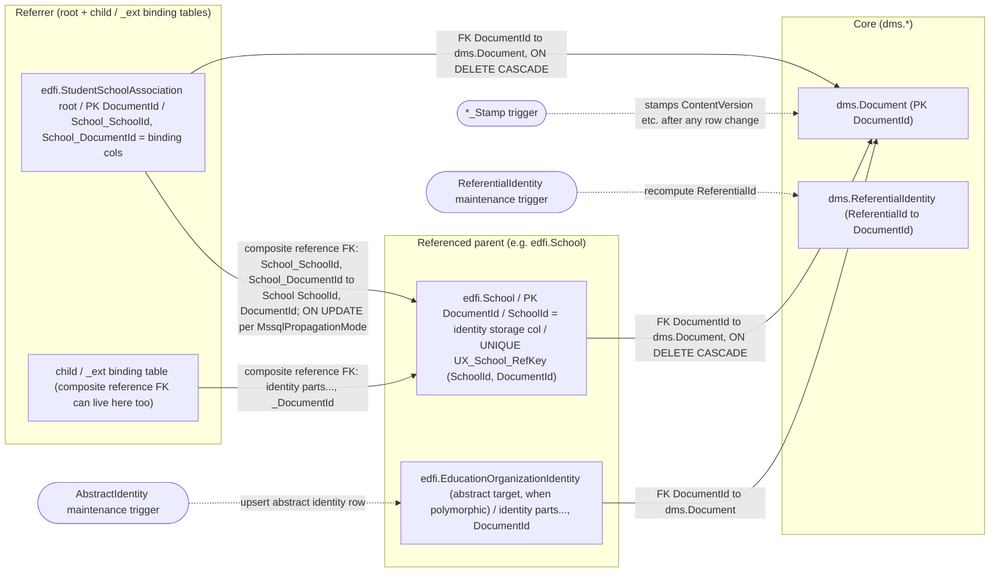
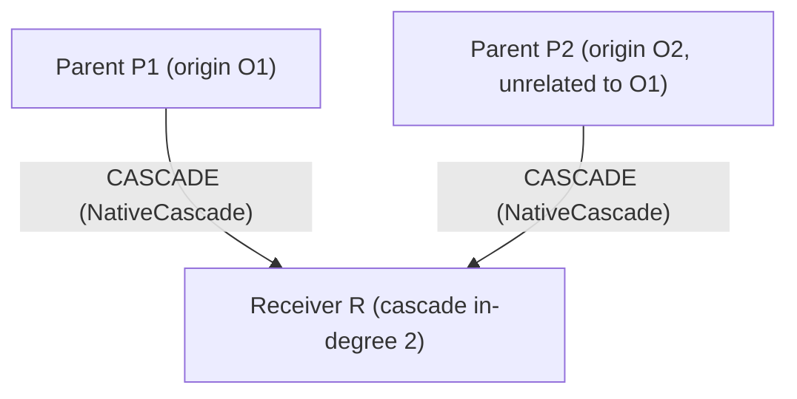
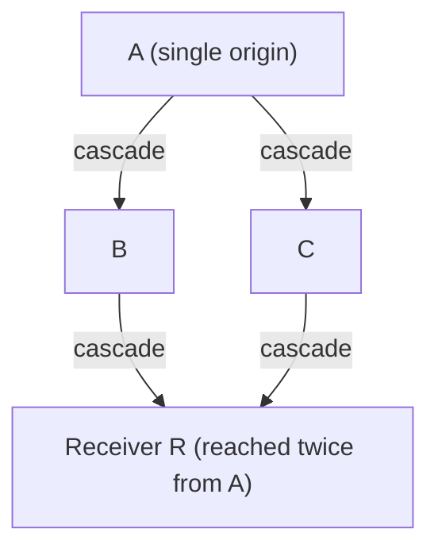
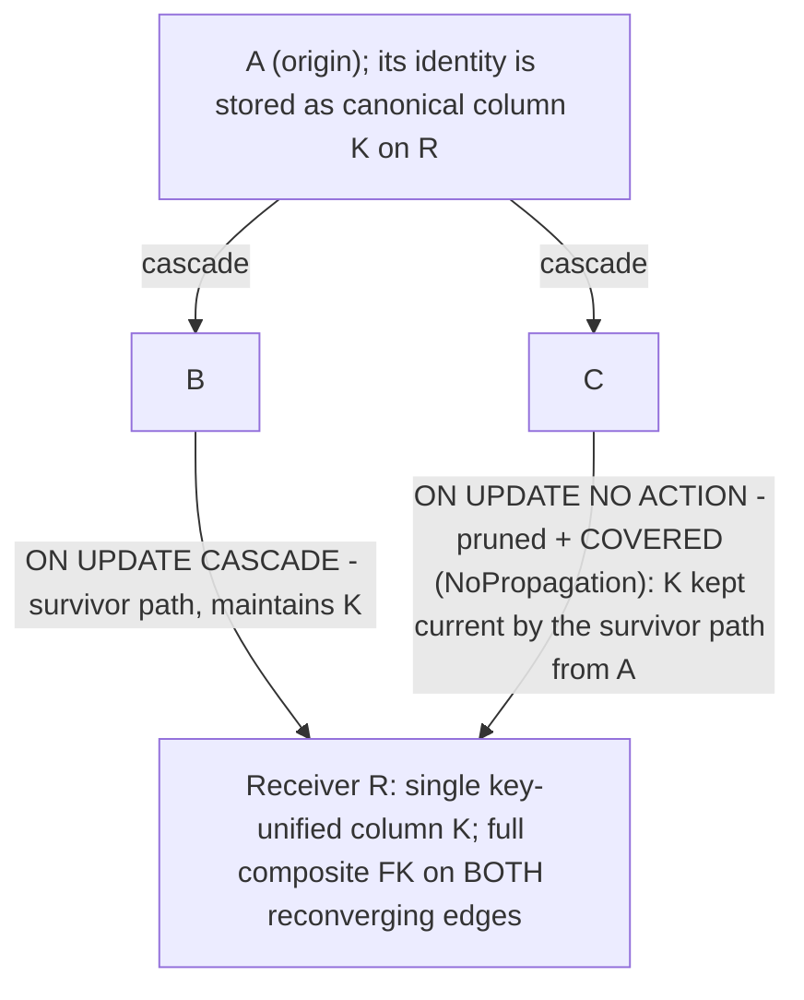
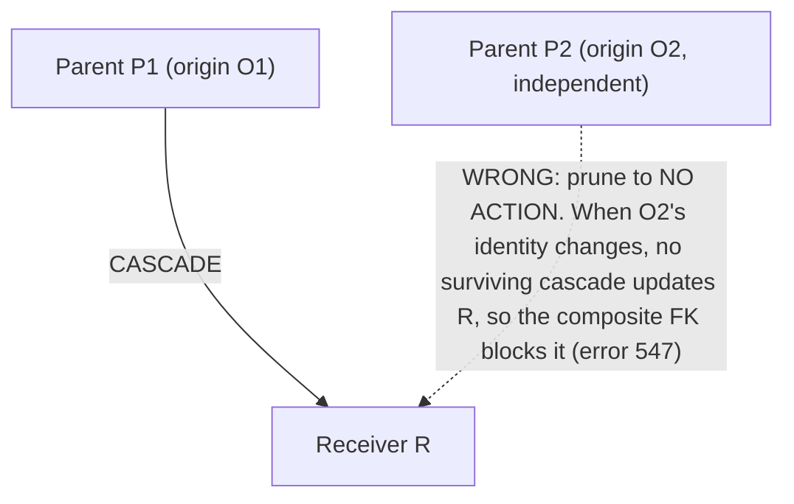
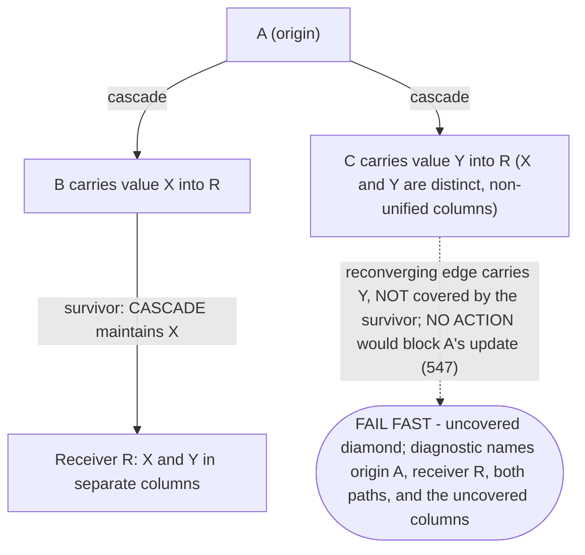
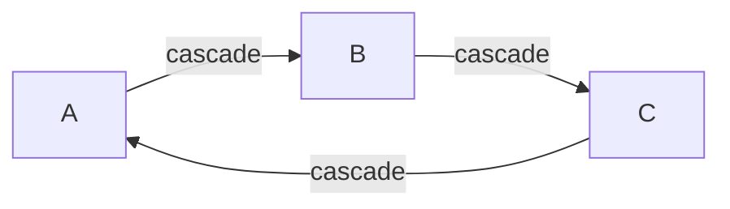

# SQL Server Identity-Update Cascade Handling and Foreign-Key Pruning

## Status

Design note produced by the DMS-1129 spike ("Design foreign key pruning") and revised to resolve
implementation-readiness review findings before DMS-1258 begins. It defines the target strategy for
SQL Server identity-update propagation and **supersedes** the earlier "every SQL Server reference
composite FK uses `ON UPDATE NO ACTION` plus a `MssqlIdentityPropagationTrigger`" rule described in
`overview.md`, `strengths-risks.md`, `transactions-and-concurrency.md`, `key-unification.md`,
`data-model.md`, and `ddl-generation.md`. Those documents now point here for the SQL Server cascade
rules.

The SQL Server behaviors this design depends on were confirmed empirically against
`mcr.microsoft.com/mssql/server:2022-latest` (SQL Server 2022, RTM-CU25); see
[SQL Server behavior (empirically confirmed)](#sql-server-behavior-empirically-confirmed).

Implementation is tracked separately (see [Follow-up work](#follow-up-work)); this note is the
design only.

> **What changed in this revision (for reviewers).** Relative to the first spike draft this note:
> models the cascade graph in **propagation direction** (referenced/parent → referrer/child) and
> analyzes SQL Server error 1785 as **duplicate reachability within a single update's cascade action
> tree** (a diamond, or a cycle), not at the referenced parent; adds explicit **cycle / SCC**
> handling (fail fast); **removes `TriggerFallback`** (the `DocumentId`-only + trigger outcome)
> entirely, so every emitted SQL Server reference FK keeps the full composite key and a pruned
> live/uncovered edge is a fail-fast error; reframes the cross-dialect detection as a **SQL Server
> portability / authoring guard**, not a PostgreSQL correctness requirement; and uses **transitive**
> identity mutability consistently. A later review round added a third `MssqlPropagationMode` value,
> **`ImmutableNoAction`**, so genuinely immutable full-composite `NO ACTION` FKs are classified
> explicitly instead of being conflated with pruned/covered edges. A further round **corrected the
> 1785 test from raw cascade in-degree > 1 to per-origin duplicate reachability** (a multitree
> violation): *independent* parents into one receiver are legal and are never pruned — pruning an
> independent live edge would only reintroduce error 547. See
> [Resolved design decisions](#resolved-design-decisions).

## The problem

When a resource's identifying values change, the new values must reach every row that stores a
copy of them — the propagated identity-part columns on each direct referrer's storage table.
The two supported engines diverge:

- **PostgreSQL** has no SQL Server 1785 DDL restriction on multiple cascade paths or cycles, so DMS
  uses composite FKs `(…identity parts…, DocumentId)` with `ON UPDATE CASCADE` on every eligible edge
  (abstract targets, and concrete targets whose identity can change transitively); the engine
  propagates identity changes natively across multiple cascade paths. DMS does **not** physically
  prune PostgreSQL FKs. This remains correct and unchanged.

- **SQL Server** rejects the same graph at DDL time whenever a table would be **reached by more
  than one cascade path**, or whenever the cascade edges form a cycle (error **1785**). To get a
  schema that even *creates*, DMS previously stripped every SQL Server reference composite FK down
  to `ON UPDATE NO ACTION` and propagated identity changes with AFTER-style
  `MssqlIdentityPropagationTrigger` triggers.

That trigger-only strategy then hit a second wall. SQL Server enforces a `NO ACTION` FK check as
part of the UPDATE statement — **before** any AFTER trigger on the same table runs — and its FK
checks cannot be deferred to end-of-transaction. So a composite FK that still contains the
identity columns will reject a parent identity update for any already-referenced row (error
**547**) before the propagation trigger can fix the children. DMS-1002 worked around *that* by
removing the identity columns from SQL Server propagation-managed FKs entirely and keeping only
`…_DocumentId` (see `ReferenceConstraintPass`). The cost: SQL Server no longer enforces
referential integrity on the identity *values*. A concurrent identity update racing an insert
that references the old identity can leave a referrer holding stale identity values, and nothing
in the database rejects it.

**DMS-1129 asks whether DMS should instead adopt ODS-style FK pruning** — keep the composite FK
(identity parts included, restoring value-level RI) and remove `ON UPDATE CASCADE` only from the
*redundant* edges — and, critically, how to do so without ODS's silent-mis-prune failure mode.

## Resolved design decisions

These are the load-bearing decisions this note settles; the sections below elaborate each. They
also drive the corrections applied to the other design docs by DMS-1129.

1. **The 1785 test is per-origin duplicate reachability, not raw in-degree.** The cascade graph is
   directed **referenced/parent table → referrer/child (receiver) table** — the direction an identity
   update actually propagates. SQL Server 1785 forbids a table from appearing more than once in the
   cascade action tree of a *single* `UPDATE`/`DELETE`: the legal graph is a **multitree** (at most
   one cascade path between any two tables). A receiver is an actual conflict only when two of its
   incoming cascade edges have source tables that **share a common cascade ancestor** — i.e. some
   origin reaches the receiver by two distinct paths (a *diamond*), or a cycle revisits it. **Direct
   cascade in-degree > 1 is only a cheap candidate signal**, not proof: *independent* parents (with
   disjoint ancestor sets) into one receiver are legal and require no pruning. (See the Microsoft
   reference: [MSSQLSERVER_1785](https://learn.microsoft.com/en-us/sql/relational-databases/errors-events/mssqlserver-1785-database-engine-error).)

2. **Cascade cycles fail fast.** Any nontrivial strongly-connected component (SCC) or self-loop
   among cascade edges in the propagation graph makes the action tree revisit a table (the "cycles"
   half of 1785) and is a hard derivation error, with a diagnostic that names the SCC's tables and
   the FK edges that form the cycle. No pruning rule is claimed safe for cycles.

3. **`TriggerFallback` is removed.** There is no `DocumentId`-only + trigger outcome. Every emitted
   SQL Server reference FK keeps the **full composite** key (identity columns restored), so
   value-level RI is always enforced. To break a diamond, one reconverging edge is pruned to
   `NO ACTION` **only if it is covered** by the surviving path for the *same originating update and
   the same canonical columns*; an uncovered reconvergence is a **fail-fast** error. An independent
   live edge is **never** pruned (no surviving cascade would carry its own origin's value — that is
   exactly the 547 trap). This also removes the DMS-1002 stale-identity race, which the
   `DocumentId`-only shape reintroduced.

4. **Coverage / immutability use transitive identity mutability.** Cascade-eligibility *and*
   liveness are both defined as `IsAbstract || TransitivelyAllowIdentityUpdates`, matching
   `TransitiveIdentityMutabilityPass` and the branch in `ReferenceConstraintPass`. Directly-immutable
   references (`allowIdentityUpdates = false`) can still be *transitively* mutable and must be
   treated as live.

5. **The unsafe-graph detection is a SQL Server portability / cross-engine authoring policy, not a
   PostgreSQL correctness requirement.** PostgreSQL has no 1785 DDL restriction and keeps
   full-composite `ON UPDATE CASCADE` on every eligible edge, unchanged; DMS never physically prunes
   PostgreSQL FKs. Because a DMS model must be representable on **both** supported engines, derivation
   runs the detection dialect-agnostically and **fails fast on both dialects** for a graph that cannot
   be represented on SQL Server (a cascade cycle/SCC, or an uncovered diamond) — an explicit
   cross-engine portability / authoring policy, **not** because PostgreSQL needs pruning (PostgreSQL
   alone would accept the graph). MetaEd (METAED-1667) prevents these graphs at authoring time so
   neither engine encounters one in practice. See the *Dialect scope decision* section.

6. **Canonical FK/RefKey column order is identity parts first, `DocumentId` last.** This matches
   `ReferenceConstraintPass` and the `*_RefKey` ordering rationale in
   [change-queries.md](change-queries.md) § "*_RefKey index ordering for /deletes". Docs that showed
   `(DocumentId, <identity parts…>)` are corrected; no code change is required.

7. **DMS-1258 has been aligned with this design.** The Jira ticket previously said pruning was decided
   "per referenced table" (the wrong orientation); it has been restated in
   receiver / referrer / path-convergence terms per decision 1, and now also carries the both-dialect
   fail-fast policy (decision 5) and the global retained-graph invariant. See
   [DMS-1258 alignment](#dms-1258-alignment).

## Diagrams

These diagrams are the visual companion to the algorithm below; they are deliberately compact and
implementation-oriented so DMS-1258 can read the object contract, the graph orientation, and each
decision point directly. `overview.md` and `summary.md` cross-reference this section rather than
duplicating it.

### A. Database objects and what maintains them

Shows the objects a reference site involves and — critically — separates **identity-value
propagation** (a database FK cascade, solid arrows) from the **maintenance triggers** (dashed
arrows) that are *not* the propagation mechanism. Arrows here point in the FK **references**
direction (child → parent); the propagation graph in B reverses this.



*For DMS-1258:* the composite reference FK (identity parts first, `DocumentId` last) is the object
that carries `MssqlPropagationMode`; the dashed triggers are the unaffected maintenance triggers,
not the retired identity-value propagation trigger.

### B. Direct in-degree > 1 is NOT proof — legal independent parents

Edges point in **propagation direction** (referenced/parent → referrer/child). A receiver can have
two incoming cascade edges and still be legal when the parents are **independent origins**.



*For DMS-1258:* O1's update action tree reaches R once (O1→R) and O2's reaches R once — **no origin
reaches R twice**, so this is a legal multitree. Both edges stay `CASCADE`; nothing is pruned.
In-degree > 1 is a cheap candidate signal only; confirm a real conflict by shared ancestry.

### C. Illegal — duplicate reachability under one origin (diamond)



*For DMS-1258:* A's update action tree reaches R by **A→B→R and A→C→R**, so R appears twice → 1785.
This diamond (two of R's incoming edges share the ancestor A) is what needs classification — prune a
covered reconverging edge, or fail fast.

### D. Safe covered pruning tied to the same origin (restores identity-value RI)

The two reconverging edges bind the **same key-unified canonical column** `K` on R, and the surviving
path from A maintains `K`, so the pruned `NO ACTION` edge never observes a mismatch (probe 6).



*For DMS-1258:* both edges keep the **full composite** FK, so identity values are enforced by the DB
— no `DocumentId`-only shape, no stale-identity window. The pruned edge's carrier diagnostics record
the **origin A, receiver R, both paths, and the shared column K**.

### E. Do NOT prune an independent live edge — it reintroduces 547



*For DMS-1258:* pruning an independent parent is never allowed — there is no surviving cascade from
O2 to carry O2's new value into R. Independent parents are legal exactly as in diagram B and stay
`CASCADE`. "Covered" is therefore defined **per originating tree**: an edge is prunable only if a
survivor carries the *same* value into the *same* canonical columns for **every** origin that reaches
R through it.

### F. Uncovered diamond — fail fast (no DocumentId-only fallback)

A genuine diamond (origin A reaches R twice) whose reconverging paths carry **different, non-unified**
values, so no survivor covers the other.



*For DMS-1258:* this is the case ODS prunes silently and wrongly. DMS raises a hard derivation error;
MetaEd (METAED-1667) should reject it at authoring time.

### G. Cascade cycle / SCC — fail fast



*For DMS-1258:* a nontrivial SCC (or a self-loop) makes the action tree revisit a table (the "cycles"
half of error 1785). Pruning one edge does not leave a cascade that still propagates every identity,
so no pruning rule is claimed safe → fail fast, naming the SCC tables and the FK edges in the cycle.

### H. Before (DMS-1002 workaround) vs after (DMS-1129 pruning)


*For DMS-1258:* the migration is "restore the full composite FK everywhere + classify each edge",
not "add another trigger". The before-column mechanism (`DocumentId`-only + trigger) is removed
entirely.

## SQL Server behavior (empirically confirmed)

Six probes were run against a throwaway SQL Server 2022 container. Each result is the load-bearing
fact for one part of the design. The minimal reproduction DDL is inlined so this note is
self-contained.

| # | Probe | Result | Design consequence |
|---|-------|--------|--------------------|
| 1 | Two `ON UPDATE CASCADE` paths reach one table (diamond) | **Msg 1785** at `CREATE` | SQL Server forbids a table reachable by multiple cascade paths — pruning is *required* on SQL Server. The rejected table is the **receiver** at the bottom of the diamond, not the referenced parent at the top. |
| 2 | Same diamond, redundant edge set to `ON UPDATE NO ACTION` | DDL succeeds | Converting a redundant cascade edge into the receiver to `NO ACTION` (pruning) makes the graph legal. |
| 3 | `NO ACTION` composite FK that **includes identity columns**; update parent identity of a referenced row | **Msg 547**, and an AFTER UPDATE trigger that fixes the referrer does **not** rescue it | A `NO ACTION` composite FK blocks the update before the trigger runs. You cannot keep identity columns in a `NO ACTION` FK *and* rely on a trigger — this is why `TriggerFallback` cannot preserve value-level RI. |
| 4 | Kept `ON UPDATE CASCADE` composite FK (identity parts + DocumentId); update parent identity | Succeeds; referrer auto-updated | A kept cascade edge preserves full value-level RI and propagates natively. |
| 5 | `INSTEAD OF UPDATE` trigger on a table that has a cascading FK | **Msg 2113** | The "reorder children-first via `INSTEAD OF`" alternative is unavailable on any table participating in a kept cascade. |
| 6 | Diamond where the pruned `NO ACTION` edge shares a **key-unified** column with a surviving cascade path; update the shared key | Succeeds; shared column propagated | Pruning is *safe* exactly when the pruned edge's stored column is maintained by the surviving cascade, because `NO ACTION` never observes an inconsistent value. |

**Scope of these probes.** Probe 1 exercises a **diamond** — one origin (`A`) reaching one receiver
(`C`) by two distinct cascade paths, i.e. *duplicate reachability within a single update's action
tree*. That is the actual 1785 condition (with cycles), per the Microsoft reference
([MSSQLSERVER_1785](https://learn.microsoft.com/en-us/sql/relational-databases/errors-events/mssqlserver-1785-database-engine-error):
"a table cannot appear more than one time in the list of all the cascading referential actions … The
tree of cascading referential actions must only have one path to a particular table"). It is **not**
the case that any table with cascade in-degree > 1 is illegal: two `ON UPDATE CASCADE` FKs into one
table from **independent** parents (no shared cascade ancestor) are legal, because no single
`UPDATE`/`DELETE` reaches the table twice. The design below treats in-degree > 1 only as a candidate
signal and confirms a real conflict by shared ancestry.

Minimal reproductions:

```sql
-- Probe 1: multiple cascade paths reach one receiver, rejected (Msg 1785).
-- Propagation direction is A -> {B, C} and B -> C; the receiver C is reached by
-- two cascade paths (A->C and A->B->C), which is what SQL Server rejects.
CREATE TABLE dbo.A (Id int NOT NULL PRIMARY KEY);
CREATE TABLE dbo.B (Id int NOT NULL PRIMARY KEY, A_Id int NOT NULL,
    CONSTRAINT FK_B_A FOREIGN KEY (A_Id) REFERENCES dbo.A(Id) ON UPDATE CASCADE);
CREATE TABLE dbo.C (Id int NOT NULL PRIMARY KEY, A_Id int NOT NULL, B_Id int NOT NULL,
    CONSTRAINT FK_C_B FOREIGN KEY (B_Id) REFERENCES dbo.B(Id) ON UPDATE CASCADE,
    CONSTRAINT FK_C_A FOREIGN KEY (A_Id) REFERENCES dbo.A(Id) ON UPDATE CASCADE); -- 1785 here

-- Probe 3: NO ACTION composite FK incl. identity columns blocks the parent update (Msg 547),
-- and an AFTER trigger cannot rescue it because the FK check precedes the trigger.
-- Column order is identity parts first, DocumentId last (the canonical DMS order).
CREATE TABLE dbo.Target (DocumentId int NOT NULL PRIMARY KEY, IdVal nvarchar(50) NOT NULL,
    CONSTRAINT UQ_Target_RefKey UNIQUE (IdVal, DocumentId));
CREATE TABLE dbo.Referrer (DocumentId int NOT NULL PRIMARY KEY,
    Target_IdVal nvarchar(50) NOT NULL, Target_DocumentId int NOT NULL,
    CONSTRAINT FK_Referrer_Target FOREIGN KEY (Target_IdVal, Target_DocumentId)
        REFERENCES dbo.Target (IdVal, DocumentId) ON UPDATE NO ACTION);
INSERT dbo.Target VALUES (1, 'old'); INSERT dbo.Referrer VALUES (10, 'old', 1);
UPDATE dbo.Target SET IdVal = 'new' WHERE DocumentId = 1; -- 547, even with an AFTER trigger present
```

### Validation on a populated database

The mechanics above were re-confirmed against a real, populated Ed-Fi ODS/API database
(`EdFi_Ods_Populated_Template`, SQL Server 2022) — the reference implementation this design
mirrors — using transactions that were rolled back, so the database was left untouched:

- **Cascade at scale on real composite keys.** Renaming one `edfi.Session` row (the 3-part natural
  key `SchoolId, SchoolYear, SessionName`) cascaded transitively — `Session → CourseOffering → Section` — rewriting 237 CourseOfferings and 237 Sections (plus their own cascade descendants)
  from a single `UPDATE`, in ~1.2 s. This is a concrete, real-data confirmation of the
  identity-update *fan-out* risk in [strengths-risks.md](strengths-risks.md): one identity change on
  a hub row synchronously rewrites hundreds-to-thousands of rows.
- **1785 on a real hub.** Adding a second `ON UPDATE CASCADE` path that reaches `edfi.Section`
  through `edfi.Session` (a diamond) failed with the verbatim
  `Msg 1785 … may cause cycles or multiple cascade paths`; pruning that one redundant edge into the
  receiver to `ON UPDATE NO ACTION` made the identical schema legal.
- **Base-model observation.** In the stock Ed-Fi data model the cascade cluster (Section, Session,
  CourseOffering, ClassPeriod, …; 41 `CASCADE` FKs vs 1628 `NO ACTION`) is already an acyclic graph
  with no convergent diamond, so ODS pruned nothing in that schema. Pruning is exercised by specific
  key-unification topologies (the `KeyUnifiedResource`-style extension in DMS-1129), not the base
  model — so the safe-vs-unsafe classification and fail-fast matter chiefly for extensions and
  heavily key-unified resources.

## Design: pruning with a safety classification

The strategy is **hybrid, deterministic, and fail-fast**. On SQL Server, DMS keeps
`ON UPDATE CASCADE` (with the full composite FK, identity columns included) on every cascade edge
that is not part of a diamond — including **independent** parents into a shared receiver — and, only
where one origin reaches a receiver by two distinct paths (a *diamond*), prunes **one covered
reconverging edge** to `NO ACTION` (still full composite). It refuses to emit DDL for any graph where
no safe pruning exists — a cascade cycle, or a diamond whose reconverging edge cannot be covered.
This replaces the current "strip identity columns everywhere + trigger" default. **No pruned edge is
ever reduced to a `DocumentId`-only FK, and an independent live edge is never pruned** (that would
only reintroduce error 547).

### 1. Build the cascade graph in propagation direction

Vertices are storage tables (concrete resource roots, child/collection and `_ext` binding
tables, and abstract identity tables). A directed **cascade edge** runs **from the referenced
target table to the referrer binding table** — the direction an identity update propagates — when
the reference is identity-propagating, i.e. the target is abstract or the concrete target has
`TransitivelyAllowIdentityUpdates = true` (decision 4). This is the transitive-mutability set:
directly-immutable references that are nonetheless transitively mutable are included; genuinely
immutable references (`IsAbstract = false` and `TransitivelyAllowIdentityUpdates = false`) are
**excluded** from the graph and always get a plain full-composite `NO ACTION` FK — classified
`ImmutableNoAction` in the [derived-model contract](#derived-model-contract-for-dms-1258) — so they
never participate in convergence and are not pruning candidates.

This is the same underlying edge set that `ReferenceConstraintPass` and
`DeriveTriggerInventoryPass.BuildReverseReferenceIndex` already enumerate — only the **orientation**
of analysis is stated explicitly here (parent → child). The classification is a new pass over that
graph, not a new graph. Ordering for determinism follows the existing convention (edges keyed by
source/referrer table identifier, then constraint name), mirroring ODS's `sortBy(odsTableId)` so
pruning is reproducible.

### 2. Detect cycles / SCCs — fail fast

Compute strongly-connected components over the propagation-direction graph (e.g. Tarjan's
algorithm) and detect self-loops. Any nontrivial SCC (two or more mutually reachable tables) or
self-loop among cascade edges is the "cycles" half of SQL Server error 1785 and has **no safe
pruning rule** — pruning any single edge of a cycle does not make the remaining cascade acyclic in a
way that still propagates every identity. DMS **fails derivation** with a diagnostic that names the
SCC's tables and the exact FK edges (constraint names) forming the cycle.

### 3. Detect duplicate reachability (diamonds) — not raw in-degree

**What "origin" means.** Throughout this analysis an *origin* is **any cascade-graph ancestor** — any
table from which cascade edges can reach the receiver — **not** only the resources at which DMS
permits a *direct* identity update. This is deliberate. SQL Server 1785 is a **static, DDL-time**
check over the entire cascade FK graph (when it builds the tree of cascading actions it treats every
table as a potential update source), so the multitree property must hold from every ancestor for the
schema to even `CREATE`; restricting origins to update-permitted roots would let non-creatable DDL
through. Coverage (step 4) quantifies over the **same** origin set for a runtime reason: a pruned
`NO ACTION` composite FK trips error 547 whenever its *referenced* key changes for **any** reason —
including a cascade arriving from a transitively-mutable ancestor — so an edge is prunable only if a
survivor maintains its columns for every ancestor that can reach it, regardless of where the update
was first issued. The runtime `AllowIdentityUpdates` gate (`RelationalWriteIdentityStability`) governs
only whether a *statement-level direct* identity write is accepted at a root resource; it does **not**
bound which tables' keys change under propagation, so it never narrows the origin set for 1785 or 547.
The graph is therefore built over the full transitive-mutability edge set (decision 4), and
reachability/coverage quantify over all cascade ancestors.

A table is legal on SQL Server iff it appears at most once in the cascade action tree of any single
`UPDATE`/`DELETE` — equivalently, the cascade graph is a **multitree**: at most one directed cascade
path between any ordered pair of tables. So the unit of analysis is **duplicate reachability**, not
raw in-degree:

- **Candidate signal (cheap prefilter).** A receiver with cascade in-degree > 1 is a *candidate* to
  investigate — nothing more. Most such receivers are legal.
- **Confirmed conflict (a diamond).** A candidate receiver `R` is an actual 1785 conflict only when
  two of its incoming cascade edges have source tables that **share a common cascade ancestor** — i.e.
  there is an origin `O` with two distinct `O → R` cascade paths. Compute this with ancestor sets
  (`ancestor(v)` = `v` plus everything that reaches `v` via cascade edges): `R` conflicts iff two
  incoming edges' sources have intersecting ancestor sets.
- **Independent parents are legal.** If `R`'s incoming edges come from sources with **disjoint**
  ancestor sets, no single update reaches `R` twice; every such edge stays `ON UPDATE CASCADE` and
  **nothing is pruned** (diagram B). Pruning one of them would strand that parent's own identity
  updates with no surviving cascade — the error-547 trap (diagram E).

(This corrects the earlier "reduce every receiver to at most one incoming cascade edge" rule, which
over-approximated 1785 by treating a multitree as if it had to be a forest.)

### 4. Classify coverage using transitive mutability

Every cascade edge is *live* by construction (an immutable reference would not be in the graph —
decision 4). Only edges that participate in a **diamond** (step 3) are pruning candidates; the two
(or more) paths from the shared origin `O` to the receiver `R` reconverge, and one reconverging edge
must be pruned so `R` appears once in `O`'s action tree. The surviving path keeps `ON UPDATE CASCADE`;
a reconverging edge `E` chosen for pruning is:

- **Covered** — for **every** origin that reaches `R` through `E`, the surviving path from that origin
  maintains the *same canonical storage columns* on `R` that `E` constrains (under key unification).
  Pruning `E` to a full-composite `NO ACTION` FK is then safe: a survivor always keeps the shared
  column consistent, so the pruned FK never observes a mismatch (probe 6). `E` becomes `NoPropagation`
  and keeps the **full composite** FK — RI is preserved without a second cascade path.

- **Uncovered** — some origin reaches `R` through `E` with no surviving path maintaining `E`'s
  columns (a different/non-unified value, or `E` is the *sole* path from an independent origin). A
  full-composite `NO ACTION` on those columns would block that origin's real identity updates
  (probe 3), and neither a trigger (probe 3) nor an `INSTEAD OF` reorder (probe 5) can rescue it while
  the identity columns remain in the FK. There is no safe emission for `E` → **fail fast** (step 6).

**Independent edges are never candidates.** An incoming edge whose source shares no ancestor with the
receiver's other retained edges is not part of any diamond; it stays `NativeCascade`. Coverage is
therefore evaluated *per originating tree* — never "does some other edge into `R` happen to touch the
same column", which would wrongly green-light pruning an independent parent.

### 5. Choose survivors and emit outcomes

Independent edges (and every edge into an in-degree-≤-1 receiver) are emitted as `NativeCascade` — no
pruning. For each **diamond** (a receiver `R` reachable twice from a common origin), break the
duplicate deterministically:

1. Among the reconverging incoming edges of the diamond, consider each as the candidate survivor,
   in a stable order (source table identifier, then constraint name).
2. Keep the first candidate for which every *other reconverging* edge is covered (step 4) for all of
   its origins under key unification.
3. If such a survivor exists: emit it (and the rest of its path) as `NativeCascade` and emit the
   covered reconverging edge(s) as `NoPropagation`.
4. If no candidate survivor covers the others — including any case where a reconverging edge is also
   the sole path from an independent origin — the diamond cannot be broken safely → **fail fast**
   (step 6).

The choice is local to each diamond; edges outside diamonds are untouched. Immutable references are
outside the cascade graph entirely and are emitted as `ImmutableNoAction` (step 1).

**Global invariant (validated after all diamonds are resolved).** Survivor selection is computed per
diamond, but overlapping diamonds can share edges, so a locally-valid choice for one diamond can break
another. The classification is complete only once the **whole** retained graph satisfies a global
invariant, which DMS-1258 must validate after all local choices are made rather than trusting the
per-diamond snapshots:

1. Every SQL Server reference FK has **exactly one** final `MssqlPropagationMode`.
2. The retained `NativeCascade` subgraph (all kept `CASCADE` edges) is **acyclic**.
3. The retained `NativeCascade` subgraph is a **multitree**: at most one directed cascade path between
   any ordered pair of tables (no receiver is reachable twice from any origin over kept edges).
4. Every `NoPropagation` edge is **covered by the final retained graph** — the surviving path that
   justified the prune must still exist and still maintain the shared canonical columns *after* every
   other diamond is resolved, not merely within its own local diamond snapshot.

If a local survivor choice would violate (2)–(3) for another diamond, or leaves a `NoPropagation` edge
uncovered under (4), the graph has no safe classification → **fail fast** (step 6). Survivor selection
stays deterministic (the stable source-table / constraint-name order above); the global check adds no
nondeterminism — it only rejects graphs that no deterministic local choice can satisfy.

| Final per-edge outcome (`MssqlPropagationMode`) | FK shape | `ON UPDATE` | Propagation mechanism | Carrier diagnostics |
|------------------------|----------|-------------|-----------------------|---------------------|
| `NativeCascade` (cascade-eligible; an independent edge, the surviving path of a diamond, or the sole edge into a receiver) | full composite (identity parts + DocumentId) | `CASCADE` | engine cascade (probe 4) | none |
| `NoPropagation` (cascade-eligible; a covered reconverging edge of a diamond) | full composite | `NO ACTION` | none needed — covered by the surviving path for the same origin (probe 6) | **yes** — records the origin, receiver, both paths, and shared columns |
| `ImmutableNoAction` (not cascade-eligible; immutable target, not in the cascade graph) | full composite | `NO ACTION` | none — the referenced identity cannot change | none |
| **derivation fails** (cascade cycle/SCC, or a diamond whose reconverging edge cannot be covered) | — | — | **fail fast** with a diagnostic | n/a |

There is **no** `TriggerFallback` / `DocumentId`-only outcome. Every emitted SQL Server reference FK
keeps the full composite key, so value-level RI is always enforced and the DMS-1002 stale-identity
race does not reappear. Note that `ON UPDATE NO ACTION` is emitted for *two distinct* reasons —
`NoPropagation` (a pruned but covered cascade-eligible edge) and `ImmutableNoAction` (a reference
whose target identity cannot change) — so the mode is **not** derivable from the `OnUpdate` action
alone; that is exactly why it is carried explicitly (see the contract).

### 6. Fail fast when no safe pruning exists

Derivation fails, with a diagnostic, in exactly two situations. This failure applies on **both**
dialects as a cross-engine portability policy — the graph is unrepresentable on SQL Server; PostgreSQL
alone could run it, but DMS refuses a non-portable model (see the *Dialect scope decision*):

- **Cascade cycle** (step 2): the propagation graph has a nontrivial SCC or self-loop, so the action
  tree revisits a table. Diagnostic names the SCC tables and the FK edges forming the cycle.
- **Uncovered diamond** (step 5): an origin reaches a receiver by two distinct cascade paths, and no
  survivor choice covers the reconverging edge (a different/non-unified value, or a reconverging edge
  that is also the sole path from an independent origin). There is no legal SQL Server DDL that
  preserves identity RI here — SQL Server allows at most one cascade path from an origin to a table
  (probe 1), a `NO ACTION` composite FK cannot be trigger-rescued (probe 3), and `INSTEAD OF` is
  unavailable (probe 5). Diagnostic names the **origin/root, the receiver, the two (or more) distinct
  cascade paths, the candidate/pruned edges, and the coverage columns**.

Both are precisely the cases ODS prunes silently and incorrectly. Failing here is safe because the
schema that produces it should have been rejected at authoring time (see the MetaEd follow-up), so
the DMS check is a defense-in-depth backstop. Because `TriggerFallback` is gone, this fail-fast is
now the *only* backstop for an uncovered live edge — which makes the MetaEd authoring guard
load-bearing rather than merely nice-to-have.

## Dialect scope decision (AC: "MSSQL only, or both?")

**Physical FK pruning is emitted for SQL Server only; PostgreSQL keeps full composite
`ON UPDATE CASCADE` on every eligible edge.** ODS prunes for both engines, but ODS's motivation is
uniform DDL generation, not a PostgreSQL correctness need. PostgreSQL has no 1785
multiple-cascade-paths/cycles DDL restriction and no `NO ACTION`-before-trigger problem: it can create
and natively cascade all paths of a multi-path graph, so pruning on PostgreSQL would only *remove*
native RI enforcement for no benefit.

Detection of the unsafe-graph condition (an **uncovered diamond** — duplicate reachability that cannot
be safely broken — or a **cascade cycle**) is therefore **not a PostgreSQL correctness requirement**.
It is a **cross-engine portability / parity policy**: a schema authored and validated on PostgreSQL
must not silently fail to create on SQL Server later, so a DMS model is required to be representable on
**both** supported engines. The split is:

- **Detect** the SQL-Server-unsatisfiable condition during model derivation dialect-agnostically, and
  **fail derivation on both dialects** — so a non-portable schema is rejected up front regardless of
  the engine currently in use (schema soundness / cross-engine parity), **not** because PostgreSQL
  requires it. (PostgreSQL alone would create and run such a graph; DMS refuses it as a portability
  policy.)
- **Emit** cascade pruning (`CASCADE` → `NO ACTION` rewrites) only for SQL Server DDL. PostgreSQL
  physical emission is unchanged: full-composite `ON UPDATE CASCADE` on every eligible edge.
- **Prevent** the condition at authoring time in MetaEd (below), so neither engine encounters it in
  practice.

This both-dialect fail-fast is a deliberate cross-engine authoring policy: it does not follow from
PostgreSQL semantics (PostgreSQL alone would accept the graph), but from DMS's requirement that a
single derived model be valid on every supported engine. No claim is made about PostgreSQL propagating
identity through a cascade *cycle* at run time — DMS refuses cyclic cascade graphs at derivation before
either engine runs them.

## Derived-model contract for DMS-1258

The classification produces per-edge metadata plus diagnostics that DDL generation, runtime, and
manifest verification all consume. The **concrete C# shape is deferred to DMS-1258**, but this
design fixes the contract that ticket must add. Today's shared model
(`EdFi.DataManagementService.Backend.External/RelationalModelTypes.cs`) only carries the FK's
`ReferentialAction OnUpdate` and, in the compiled-mapping-set inventory, a trigger inventory
(`compiled-mapping-set.md`); neither expresses cascade classification.

DMS-1258 must add:

- **Per-edge `MssqlPropagationMode`** on every SQL Server reference FK, with exactly three values —
  a *total* classification, so a consumer never has to infer intent from `OnUpdate`:
  - `NativeCascade` — a cascade-eligible edge that is **not** pruned: an independent edge (its source
    shares no ancestor with the receiver's other retained edges), the surviving path of a diamond, or
    the sole edge into a receiver; `ON UPDATE CASCADE`.
  - `NoPropagation` — a cascade-eligible edge that was pruned but is covered by the surviving
    cascade; `ON UPDATE NO ACTION`.
  - `ImmutableNoAction` — a reference to a genuinely immutable target
    (`IsAbstract = false` and `TransitivelyAllowIdentityUpdates = false`), which is not part of the
    cascade graph and not a pruning candidate; `ON UPDATE NO ACTION`.

  The `OnUpdate` action does **not** determine the mode: `CASCADE` ⇒ `NativeCascade`, but
  `NO ACTION` is either `NoPropagation` or `ImmutableNoAction`. The mode is therefore carried
  explicitly (it distinguishes "pruned but covered" from "immutable"), not derived. (The earlier
  draft's `TriggerFallback` value is removed, and the `MssqlFkShape`
  (`FullComposite` / `DocumentIdOnly`) axis is dropped entirely — every SQL Server reference FK is
  full composite, so shape is no longer a variable.)
- **Coverage / carrier diagnostics — only for `NoPropagation` edges**: enough to reconstruct the
  diamond that justified the prune — the **originating root, the receiver, the surviving path and the
  pruned path** (as ordered FK-constraint sequences), and the **shared canonical columns** the
  survivor maintains — emitted into the relational-model manifest so pruning decisions are auditable
  and reproducible. `NativeCascade` and `ImmutableNoAction` edges carry **no** carrier diagnostics —
  there is nothing to attribute (a survivor is self-carrying; an immutable target never changes).
- **Fail-fast derivation errors** for the two conditions in step 6, surfaced as hard derivation
  errors (not manifest warnings): a **cycle/SCC** error carrying the SCC tables and the FK edges in
  the cycle; an **uncovered-diamond** error carrying the origin/root, the receiver, the two (or more)
  distinct cascade paths, the candidate/pruned edges, and the coverage columns.

PostgreSQL emission and its `OnUpdate` values are unchanged; `MssqlPropagationMode` is meaningful
only for SQL Server model sets (it is absent / not applicable on PostgreSQL FKs).

### Where the classification runs and lives (pass ordering, for DMS-1258)

The classification is a new set-level pass with a fixed position in
`RelationalModelSetPasses.CreatePasses`. Today that list runs, in order,
`… ReferenceBindingPass → KeyUnificationPass → AbstractIdentityTableAndUnionViewDerivationPass →
RootIdentityConstraintPass → TransitiveIdentityMutabilityPass → ReferenceConstraintPass → …`. The
pruning classification MUST run:

- **after `TransitiveIdentityMutabilityPass`**, because cascade-eligibility and liveness are defined
  by `IsAbstract || TransitivelyAllowIdentityUpdates` (decision 4), which that pass computes;
- **after `ReferenceBindingPass` / `KeyUnificationPass`**, so the reference-FK edge set and the
  canonical (key-unified) columns each edge binds are known; and
- **before the reference FK's `ON UPDATE` action is finalized** — i.e. it runs immediately before
  `ReferenceConstraintPass` and feeds `ResolveOnUpdate`, or `ReferenceConstraintPass` is split so a
  classification step precedes its `OnUpdate` finalization. Either way `ResolveOnUpdate` becomes a
  **consumer** of `MssqlPropagationMode`, not the source of the `NO ACTION` / `CASCADE` decision.

Storage: `MssqlPropagationMode` is carried **per reference FK** on the derived constraint model
(alongside `ReferentialAction OnUpdate`) in the shared derived contract; the coverage/carrier
diagnostics and the fail-fast errors are emitted into `relational-model.manifest.json`. The concrete
C# shape is deferred to DMS-1258 (see the contract above); this note fixes only the ordering and the
home of the metadata.

## FK / RefKey column order (canonical)

The canonical physical order for both the referenced-key UNIQUE (`*_RefKey`) and the composite
reference FK is **identity storage columns first, `DocumentId` last**:
`(<identity storage columns…>, DocumentId)`. This matches `ReferenceConstraintPass` today and the
`/deletes` recreated-resource seek-path rationale in
[change-queries.md](change-queries.md) § "*_RefKey index ordering for /deletes": leading with the
identity values gives the anti-join a useful seek path, which a leading `DocumentId` would not.

DMS-1258 requires **no change** to `ReferenceConstraintPass` column ordering. Design docs that
previously illustrated `(DocumentId, <identity parts…>)` are corrected to this order for
consistency (data-model.md, transactions-and-concurrency.md, key-unification.md, summary.md,
ddl-generation.md).

## Comparison to the ODS implementation

ODS (`UpdateCascadeTopLevelEntityEnhancer.ts`) builds a graph from entities with
`allowPrimaryKeyUpdates`, follows identity / identity-rename references, finds vertices whose
`inEdges(...).length > 1`, sorts incoming edges by `odsTableId`, keeps the first, and marks the
rest `odsCausesCyclicUpdateCascade = true` (rendered as `NO ACTION`). It has **no handling** for
the case where a pruned edge is a live, uncovered identity source — it prunes by sort order
regardless, which can silently drop a cascade that was actually required (the failure mode called
out in DMS-1129).

DMS keeps the deterministic graph/sort skeleton but makes three refinements. First, it **narrows the
detection from `inEdges > 1` (raw in-degree) to per-origin duplicate reachability** (step 3): ODS's
in-degree test over-approximates 1785 and would prune legal *independent* parents, whereas DMS leaves
them as `CASCADE`. Second, it adds explicit **cycle/SCC detection** (step 2). Third, it adds the
**coverage classification** (step 4) and **fail-fast** (step 6): a covered reconverging edge is pruned
safely; a cascade cycle or an uncovered diamond is a hard error, never a silent prune.

## Migration from the current code

- `ReferenceConstraintPass.ResolveOnUpdate` — currently returns `NoAction` for **all** SQL Server
  reference FK updates. Under this design it returns `Cascade` for `NativeCascade` edges (independent
  edges, diamond survivors, and sole edges into a receiver) and `NoAction` for `NoPropagation`
  (covered reconverging) and `ImmutableNoAction` edges, driven by the new classification.
- `ReferenceConstraintPass` `mssqlTriggerHandlesPropagation` branch — currently drops identity
  columns from the FK (the `DocumentId`-only shape) for every abstract / transitively-mutable
  target on SQL Server. Under this design that branch is **removed**: SQL Server reference FKs are
  always emitted with the full composite key (identity parts first, `DocumentId` last), exactly like
  PostgreSQL; only the `OnUpdate` action differs by classification. Column ordering is unchanged.
- `DeriveTriggerInventoryPass.EmitMssqlIdentityPropagationTriggers` — currently emits a
  propagation trigger for every eligible target. Under this design **no identity-value propagation
  triggers are emitted**: native cascade on the kept edges (which naturally follow FKs on child
  and extension binding tables) replaces the trigger fan-out, and covered pruned edges need no
  propagation. The `MssqlIdentityPropagationTrigger` trigger kind is retired for identity-value
  propagation. (The UUIDv5 referential-identity and abstract-identity *maintenance* triggers are
  unaffected — see Non-goals.)
- New derivation pass and output: the classification detects diamonds by **per-origin reachability**
  (ancestor sets), not raw in-degree, so independent parents keep `CASCADE`. It emits per-edge
  `MssqlPropagationMode` (`NativeCascade` / `NoPropagation` / `ImmutableNoAction`), coverage/carrier
  diagnostics for `NoPropagation` edges only, and hard derivation errors for cascade cycles and
  uncovered diamonds (see the contract above). Immutable references — which `ResolveOnUpdate` already
  emits as `NO ACTION` — become `ImmutableNoAction` rather than being conflated with pruned/covered
  edges.

PostgreSQL emission is unchanged.

## DMS-1258 alignment

DMS-1258 has been updated to match this design (it previously described pruning as choosing a survivor
"per referenced table", the wrong orientation per decision 1). The aligned ticket now states:

- The survivor/prune decision is made **per diamond** — a receiver reached by two distinct cascade
  paths from a common origin — analyzed in **propagation direction** using **per-origin duplicate
  reachability** (a multitree violation). Raw cascade in-degree > 1 is only a candidate signal, and it
  is **not** decided "per referenced/parent table"; independent parents into one receiver are legal
  and are never pruned.
- The per-edge outcomes are `NativeCascade`, `NoPropagation`, `ImmutableNoAction`, or fail-fast, and
  every emitted SQL Server FK is full composite — no `TriggerFallback` / `DocumentId`-only shape.
- Explicit **cycle/SCC fail-fast** is in scope, and derivation fails on **both** dialects as the
  cross-engine portability policy (decision 5).
- The classification runs after `TransitiveIdentityMutabilityPass` and feeds
  `ReferenceConstraintPass.ResolveOnUpdate` (a consumer of `MssqlPropagationMode`), and the retained
  graph must satisfy the global invariant above.

## Follow-up work

- **MetaEd** (authoring guard — now load-bearing): disallow `allow primary key updates`
  configurations that yield a cascade cycle or an uncovered diamond (per-origin duplicate reachability
  that cannot be safely broken) — i.e. any graph where no safe pruning exists — so unsafe schemas are
  rejected before they reach DMS. Because `TriggerFallback` no longer provides a permissive fallback, this guard is the
  primary place such schemas should be caught; the DMS fail-fast is the backstop. Tracked as
  METAED-1667.
- **DMS-1258** (implementation): implement the propagation-direction graph, cycle/SCC detection, the
  coverage classification, deterministic survivor selection with full-composite restoration on
  kept/covered edges, removal of the `DocumentId`-only branch and the identity-propagation trigger,
  the `MssqlPropagationMode` contract, and fail-fast derivation. (The ticket wording has been aligned
  with this design — see the DMS-1258 alignment section above.)
- **DMS-1128**: superseded by DMS-1258; reconcile with this design.

## Non-goals

- No production implementation is part of the DMS-1129 spike; only this design, the empirical
  confirmation, and the follow-up tickets.
- No change to PostgreSQL cascade behavior (full-composite `ON UPDATE CASCADE` on every eligible
  edge).
- No change to the UUIDv5 referential-identity or abstract-identity *maintenance* triggers; only the
  identity-*value* propagation mechanism for SQL Server is in scope (native cascade replaces the
  retired `MssqlIdentityPropagationTrigger`).
