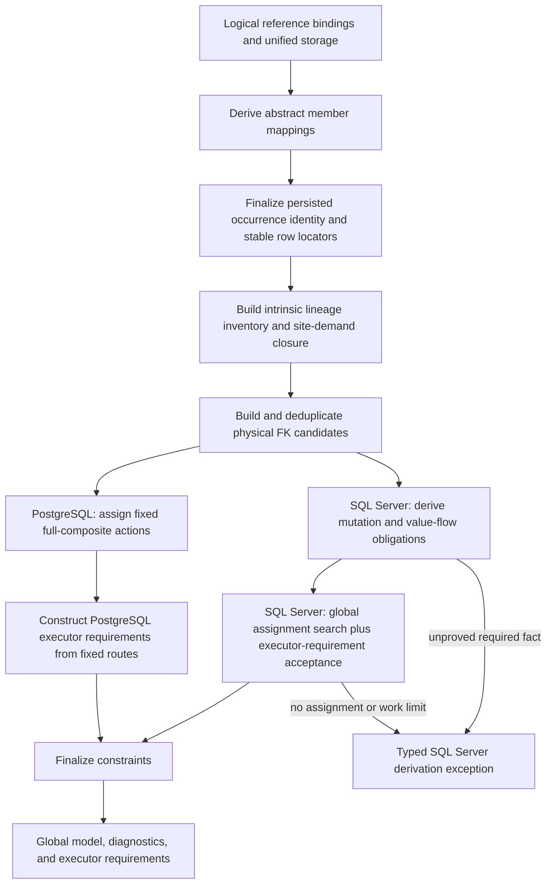

# SQL Server Identity-Update Cascades and Foreign-Key Pruning

## Status

This document is the authoritative DMS-1129 design for identity-value propagation through document-reference foreign
keys. It supersedes the earlier designs based on blanket SQL Server `ON UPDATE NO ACTION`, `DocumentId`-only foreign
keys, `MssqlIdentityPropagationTrigger`, table-level coverage, per-diamond first-fit pruning, or automatic rejection of
cycles.

Implementation is tracked by DMS-1258. METAED-1667 tracks the corresponding authoring-time validation.

The redesign finalizes the first production relational mapping contract in place:

- `RelationalMappingVersion` remains `v1`.
- No dialect-specific `PhysicalModelHash` or other compatibility discriminator is introduced.
- No mapping-version bump, migration, old-pack compatibility mode, or legacy-schema interpretation is in scope.
- There are no relevant earlier development databases or mapping packs to recognize; local artifacts are reprovisioned
  or regenerated from the finalized `v1` model.

## Settled Decisions

1. Every document-reference foreign key is full composite for its site. Its ordered propagation vector contains the
   target's public identity values, exactly the identity-lineage anchors demanded by that receiver site, and the target
   `DocumentId` last. A site's demanded anchor set may be empty.
2. Every target inventories and stores its intrinsic reference-backed identity lineages. A separate minimal fixed-point
   demand analysis selects which of those anchors each incoming site must carry. Target inventory does not by itself
   widen an incoming foreign key.
3. Identity values and anchors propagate through native foreign-key cascades. There is no identity-value propagation
   trigger and no `DocumentId`-only fallback.
4. PostgreSQL receives fixed full-composite actions. DMS does not prune PostgreSQL foreign keys, run the mutation/value-
   flow classifier for PostgreSQL, or reject a PostgreSQL model because of cascade topology or an unproved SQL Server
   coverage obligation.
5. SQL Server alone derives mutation/value-flow obligations and globally selects `NativeCascade` or `NoPropagation` for
   mutable physical foreign keys. Its retained cascade graph must satisfy error 1785 and every pruned edge must have a
   complete value-flow proof.
6. Safely breaking cycles is required behavior. A strongly connected component is a set of global action choices, not
   an automatic error. An unbreakable cycle still causes SQL Server derivation to fail.
7. An accepted model supports every DMS-authorized identity change: any independently writable primitive component,
   every non-empty subset of those components, one or more reference-backed identity replacements, and every valid
   simultaneous mixture of primitive changes and reference replacements. Classification must not accept a model that
   works for only selected identity-update shapes.
8. DMS supports identity changes issued by DMS writes and DMS-owned maintenance statements. Arbitrary direct SQL
   identity updates are outside the success contract; full foreign keys must still prevent corruption.
9. DMS owns the authoritative physical-model classifier. MetaEd provides earlier feedback using a shared, versioned
   conformance corpus with separate MetaEd, PostgreSQL, and SQL Server outcomes.

## Problem

A document-reference site stores the target `DocumentId` and copies of the target identity fields. Key unification can
make several logical fields share one writable physical column. When a target identity changes, every present reference
must contain the new identity vector when its full foreign key is checked.

PostgreSQL permits multiple `ON UPDATE CASCADE` paths to a table. SQL Server rejects a cascade action graph when a table
can occur more than once in one statement's cascade tree or when a retained cascade cycle exists (error 1785). The old
SQL Server workaround used `DocumentId`-only foreign keys and copied identity values with AFTER triggers. That allowed
the DDL to be created, but removed database enforcement of identity-value referential integrity and allowed concurrent
writes to retain stale values.

Restoring public identity fields to the foreign key is not sufficient for every receiver of a reference-backed identity.
Consider a `Session` identity containing `schoolReference.schoolId`. Repointing the Session from School A to School B
changes both the public `SchoolId` and the stable row that the value denotes. A dependent whose unified `SchoolId` also
participates in a direct School foreign key must receive both the new value and the new School `DocumentId`.
Identity-lineage anchors make that correlation part of that site's enforced propagation vector. An unrelated Session
referrer with no receiver-side School constraint or correlation obligation does not need the School anchor.

For SQL Server, selecting a legal cascade graph is only half the problem. A pruned edge is safe only when another write
is proved to put the identical public values and anchors on the same receiver row before the pruned constraint is
checked. A common ancestor table, a shared receiver column, old-value equality, or a legal error-1785 graph is not a
coverage proof.

## Confirmed Provider Behavior

The following are executable provider-test requirements:

| Behavior | SQL Server result | Design consequence |
|---|---|---|
| One table is reached twice from one update origin, or a retained cascade cycle exists | DDL fails with 1785 | The retained native-cascade multigraph must be an acyclic multitree. |
| Two independent parents cascade to distinct receiver columns | DDL succeeds | Raw in-degree greater than one is not an error-1785 test. |
| Two independent parents cascade to one shared receiver column | DDL succeeds; an update can fail 547 against the other FK | DDL legality is not value-flow safety. |
| A full-composite `NO ACTION` FK references a changing key | The parent update fails 547 before an AFTER trigger can repair it | An AFTER trigger cannot cover the initiating statement. |
| A purported carrier reference is absent while the pruned reference is present | The parent update fails 547 | Coverage requires a presence implication. |
| A direct update already writes the covered receiver row | The write is visible at that statement's constraint check | A zero-hop `OriginWrite` can be a carrier when row and value equality are proved. |
| A concrete identity change is mirrored to an abstract identity table by an AFTER trigger | The abstract-table update is a later statement | The maintenance statement has its own boundary and cannot retroactively cover an earlier check. |

## Core Terms

### Intrinsic lineage inventory, propagation item, and site vector

A `PropagationItem` is either:

- a public identity component, identified by its target identity ordinal; or
- an identity-lineage anchor, identified by a stable `IdentityLineageId`.

`IntrinsicIdentityLineageInventory(T)` is the canonical inventory of reference-backed identity lineages that target
table `T` can expose. Each entry records its `IdentityLineageId`, the referenced row meaning, correlated public identity
components, table-qualified anchor storage on `T`, presence/nullability, and the reference or maintenance source that
keeps the storage current. The inventory belongs to `T` even when no incoming reference currently demands an entry.

Each logical incoming reference site `S -> T` has a demanded set `DemandedIdentityLineages(S)`. It starts empty and grows
only when receiver-side full-FK validity or row-correlation obligations require a target lineage anchor. Equal ordered
demanded sets are assigned the same canonical `AnchorSetId` for `T`.

For target table `T` and a stable minimal `AnchorSetId`,
`PropagationVector(T, AnchorSetId)` is ordered as follows:

1. public identity components in target identity order;
2. lineage anchors in stable semantic-lineage order; and
3. `T.DocumentId` last.

Every logical document-reference site selects exactly one minimal vector and maps a local storage column to every item in
that vector. The target has one matching declared unique or primary key per distinct vector. Sites with the same semantic
anchor set share the same target key; sites are not forced to carry anchors they do not need. "Full composite" means the
site's entire selected vector. Omitting an intrinsic target anchor is valid only when no receiver validity or correlation
obligation needs it for any authorized mutation subset.

### Identity-lineage anchor

An identity-lineage anchor is the `DocumentId` of an independently replaceable referenced document whose identity
values contribute to another resource's identity. It distinguishes "the same old public value" from "the same referenced
row" and moves atomically with the public values when that reference is replaced.

Anchors are internal relational storage. They do not add API identity fields. Intrinsic target storage is distinct from
site demand: storage makes a lineage available but does not require every incoming site to carry it. When a site demands
an anchor, its local mapping may reuse an existing `..._DocumentId` column only when complete identity equivalence, row
correlation, and presence equivalence are proved. Otherwise derivation adds a dedicated local stored anchor populated by
normal reference resolution or the demanded upstream cascade.

### Physical foreign-key candidate

A `PhysicalForeignKeyCandidate` is formed after storage mapping and anchor closure but before `ON UPDATE` is selected.
Its semantic identity is:

```text
(semantic FK kind,
 local table,
 ordered local propagation-vector columns,
 target table,
 ordered target propagation-vector columns,
 ON DELETE action)
```

`OnUpdate`, `MssqlPropagationMode`, a logical reference path, and the generated constraint name are not part of this
identity. Logical sites resolving to the same semantic identity collapse to one candidate while retaining all source
reference sites and presence predicates.

`PhysicalForeignKeyId` is derived deterministically from that semantic identity before identifier shortening or
constraint-name hashing. Parallel physical foreign keys between the same tables remain distinct graph edges.

### Stable semantic ids

`ReferenceSiteId`, `IdentityLineageId`, `AnchorSetId`, `PhysicalForeignKeyId`, `StatementBoundaryId`, `MutationOriginId`,
`MutationCaseId`, and `ValueLineageId` use one canonical semantic-id encoder. This is an object-correlation contract, not
a dialect-specific physical-model or compatibility hash.

1. Serialize a kind/version header followed by tuple fields in the stated order. Strings are canonical UTF-8, each framed
   as a four-byte unsigned big-endian byte length followed by its bytes. Integers are four-byte unsigned big-endian.
   Lists are framed by count and then item encodings. There are no culture-sensitive conversions, delimiters, physical
   identifier names, dictionary iteration, or input-order fields.
2. Hash the framed bytes with SHA-256 and expose the full lowercase hexadecimal value with a kind prefix (`rs_`, `il_`,
   `as_`, `fk_`, `sb_`, `mo_`, `mc_`, or `vl_`). Producers retain the canonical tuple and fail on any repeated id with
   unequal tuple bytes.
3. SQL object names may use a deterministic leading digest token only after full-id collision detection; ordinary dialect
   identifier shortening then applies. Manifests, packs, corpus fixtures, and proof structures retain the full id.

The canonical tuples are:

- `ReferenceSiteId` (`dms-reference-site-v1`): owner qualified resource, logical table scope (`JsonScope` plus extension
  project identity when applicable), canonical reference-object JSON path, and target qualified resource.
- concrete `IdentityLineageId` (`dms-identity-lineage-v1`): identity owner qualified resource, source
  `ReferenceSiteId`, normalized referenced-resource identity, and the ordered public identity ordinals correlated to that
  same referenced row. Multiple public components from one source reference share the one id and carry the complete
  ordinal list.
- abstract `IdentityLineageId`: abstract owner qualified resource, normalized referenced-resource identity, and ordered
  abstract public identity ordinals. Concrete member paths/names are deliberately excluded;
  `AbstractIdentityMemberMapping` maps each concrete source to this common abstract tuple. A member that cannot supply the
  same non-null referenced-row meaning makes the demanded abstract variant unrepresentable.
- `AnchorSetId` (`dms-anchor-set-v1`): target qualified resource and the strictly ordered full `IdentityLineageId` list.
  The empty list is encoded normally and therefore has one stable id for the target.
- `PhysicalForeignKeyId` (`dms-physical-fk-v1`): the update-action-independent semantic FK identity listed above, using
  full canonical table/column semantic identities. `AnchorSetId`, logical-site provenance, rendered constraint names, and
  `OnUpdate` are excluded; the ordered physical columns already encode the selected vector, so identical SQL constraints
  still deduplicate even when logical sites arrived through equivalent anchor-set provenance.
- `StatementBoundaryId` (`dms-statement-boundary-v1`): statement kind, owning qualified resource/table, DMS operation or
  maintenance kind, and the stable source mapping that schedules it. A native cascade reuses its initiating statement's
  boundary id; an AFTER-trigger maintenance statement has its own id and an explicit
  `LaterAfterTriggerStatement` relationship to the initiating boundary.
- `MutationOriginId` (`dms-mutation-origin-v1`): origin kind (`DirectResourceIdentityWrite` or a named DMS-owned
  maintenance kind), owning qualified resource/table, complete origin-row key role, and `StatementBoundaryId`.
- `MutationCaseId` (`dms-mutation-case-v1`): `MutationOriginId`, the ordered changed `PropagationItemRef` set, and the
  ordered atomic reference-replacement groups. Each group starts with exactly one tagged source union:
  `ConcreteReferenceSite(ReferenceSiteId)` for a direct concrete reference replacement, or
  `NormalizedLineage(IdentityLineageId)` for an abstract/DMS-maintenance replacement whose concrete member path is
  intentionally normalized away. The tag is encoded as its four-byte enum value before the selected id; the unselected
  arm is absent, and a semantic replacement has no alternative encoding. The group then carries all public components
  and anchors that must change together. Changed items are unique and ordered by the target propagation vector (public
  identity ordinal, then stable lineage id, then terminal `DocumentId` when applicable). Replacement groups are unique
  and ordered by `(source-tag numeric value, selected full semantic id)`; each group's items use the same propagation-
  vector order. Thus `{Key1}`, `{Key2}`, and `{Key1, Key2}` are distinct ids, and a reference retarget cannot be encoded
  as an anchor-only sample case.
- `ValueLineageId` (`dms-value-lineage-v1`): `MutationOriginId`, the origin-row correlation slot (target table plus
  complete row-key role), one `PropagationItemRef`, its symbolic old/new role, and `StatementBoundaryId`. Two route values
  compare equal only when these full tuple bytes match; equal current data or equal physical columns do not merge ids.

DMS and the MetaEd conformance harness share golden vectors for provider-neutral site, lineage, anchor-set, boundary,
origin, case, and value-lineage ids. DMS additionally owns golden vectors for physical FK ids because MetaEd need not
reproduce final storage mapping. Every vector includes the canonical tuple bytes and expected full prefixed digest; tests
also prove list ordering, field framing, abstract-member normalization, and physical-name/action independence.

### Mutation origin, case, and statement boundary

A `MutationOrigin` is a supported statement that can write an identity propagation item:

- a direct resource update allowed by `AllowIdentityUpdates`; or
- a DMS-owned maintenance statement, including an abstract-identity member update.

Every origin has a `StatementBoundaryId`. Native cascades caused by one SQL statement share its boundary. An AFTER
trigger starts another boundary.

A `MutationTemplate` represents all identity updates authorized at an origin. Each independently writable public
component can remain unchanged or receive a distinct symbolic new value. Replacing a reference-backed identity lineage
atomically changes the affected public components and its anchor. Multiple independently replaceable references may be
retargeted in the same write and may be combined with primitive component changes. The template universally quantifies
over every valid non-empty subset and simultaneous combination; it is not a sample update.

An implementation may prove primitive item cases compositionally instead of enumerating `2^n - 1` subsets, but it must
also prove that the item-level writes compose without changing route, row, presence, or timing facts. If composition
cannot be proved, the relevant combined cases must be evaluated explicitly.

### Reference presence

For an optional document-reference site, the presence predicate is normally
`{ReferenceBaseName}_DocumentId IS NOT NULL`. Required sites have predicate `true`. A dedicated local anchor has exactly
the presence of the reference from which it is populated. API-path aliasing alone does not prove that another optional
reference is present.

### Changed-target and receiver-carrier routes

For a pruned physical edge `T -> R`:

- `ChangedTargetRoute` proves how a mutation origin changes the relevant propagation items on the referenced row in
  `T`.
- `ReceiverCarrierRoute` proves how the same origin writes identical items to the covered receiver row in `R` without
  using the pruned edge.

A route is an ordered list of retained physical FK hops within one statement boundary. Either route may start at the
origin row. A receiver carrier may be zero-hop `OriginWrite` when the initiating statement directly writes `R`; this is
not represented as an invented foreign-key hop.

## Derivation Architecture



PostgreSQL does not traverse the `MV` or `MS` branches. Anchor closure is a physical integrity requirement shared by
both providers; SQL Server coverage classification is not.

## Phase 1: Explicit Abstract-Identity Mappings

`AbstractIdentityTableAndUnionViewDerivationPass` must publish an ordered
`AbstractIdentityMemberMapping` inventory. A later pass must not reconstruct these facts from rendered trigger SQL.
Each mapping contains at least:

- stable abstract resource and concrete member identifiers;
- qualified abstract and concrete table names;
- the concrete-member discriminator value;
- table-qualified mappings for every public identity component;
- table-qualified intrinsic-lineage inventory mappings, including each `IdentityLineageId` and maintenance source;
- concrete and abstract `DocumentId` columns and their row-correlation rule;
- effective storage expressions and nullability/presence predicates; and
- the DMS-owned maintenance statement kind and its `StatementBoundaryId` relationship to the initiating write.

Anchor closure, SQL Server value-flow analysis, and `DeriveTriggerInventoryPass` consume this same inventory.
`DeriveTriggerInventoryPass` must remove its private concrete-member mapping reconstruction.

## Phase 2: Intrinsic Lineage Inventory and Site-Demand Closure

Anchor closure runs after reference binding, key unification, abstract identity derivation, and transitive identity
mutability are known. It completes before physical FK candidates are formed. This is provider-neutral, constructive
foreign-key-shape derivation: discovering an obligation adds site demand and continues the fixed point. It is not
PostgreSQL action classification, graph pruning, or unsafe-topology rejection.

### Fixed-point algorithm

1. Build `IntrinsicIdentityLineageInventory(T)` for every target `T`. For each independently replaceable reference-backed
   identity lineage, record one semantic `IdentityLineageId`, its correlated public components, target anchor storage,
   and the reference or maintenance source that keeps it current. Components from the same referenced-row lineage share
   one inventory entry. Physical column names and traversal order do not define the id.
2. Initialize `DemandedIdentityLineages(S) = {}` for every logical incoming reference site `S`. The site's baseline
   vector is therefore target public identity components followed by target `DocumentId`.
3. For each site `S: T -> R`, inspect every public identity item that a cascade from `T` can write to a canonical column
   on receiver `R`. Compare that write with every other local full FK and identity/correlation consumer that reads the
   column. If changing the public item without its target lineage anchor could invalidate a present consumer or cannot
   preserve the required same-row correlation, add that `IdentityLineageId` to `DemandedIdentityLineages(S)`.
4. Do not seed demand merely because `T` inventories an anchor, because the target identity is reference-backed, or
   because another site targeting `T` demands it. A seed always names the receiver consumer and validity/correlation
   obligation that requires it.
5. For each newly demanded `(S, IdentityLineageId)` pair, map the target inventory storage to local receiver storage.
   Reuse a local `..._DocumentId` only when complete target-identity equivalence, the same referenced row, and equivalent
   presence are proved. Otherwise add a dedicated local anchor with the demanding site's presence and nullability.
6. Follow the demanded anchor's maintenance provenance. If keeping target storage current under an upstream identity
   cascade requires an identity-contributing reference site on `T` to carry a corresponding lineage, add demand to that
   specific source site. This rule lets a downstream consumer require maintenance through an intermediate identity
   chain without widening unrelated sites.
7. Re-evaluate downstream identity and constraint consumers reached by a newly materialized local anchor. Add demand
   only where that consumer would otherwise lose full-FK validity or required row correlation. An anchor becoming
   available on `R` does not automatically add it to every reference whose target is `R`.
8. Process new `(ReferenceSiteId, IdentityLineageId)` facts in stable site/lineage order until no demand, storage mapping,
   maintenance dependency, or consumer obligation changes. Demand is monotone, so this computes a deterministic least
   fixed point.
9. Omit every intrinsic lineage not in the site's final demanded set only after checking all authorized mutation subsets
   for that site. The omission is valid when none can create a receiver full-FK validity or correlation obligation for
   the lineage; current data equality is not sufficient. If a subset exposes an obligation, add the lineage demand and
   resume the worklist rather than accepting the omission.
10. Deduplicate only identical `IdentityLineageId` values. Canonically group equal ordered demanded sets for a target,
    assign each group a stable `AnchorSetId`, and emit one target propagation-key UNIQUE constraint per distinct
    `(target, AnchorSetId)` vector. Each logical site keeps exactly one full FK to its selected variant.
11. Validate target uniqueness, all-or-none behavior, nullability, storage writability, and provider identifier/key-width
    limits after closure. Report deterministic physical-model errors when a demanded vector cannot be represented; do
    not drop an anchor or substitute a wider unrelated site's set.

This is a least fixed point over site-specific demands, not a table-wide union. It stores the intrinsic anchors needed to
represent each target's reference-backed identity lineages, but adds an anchor to an incoming FK only in response to a
receiver consumer. Two sites targeting the same table can therefore select different `AnchorSetId` variants.

### Data Standard 5.2: Session and CourseOffering

Data Standard 5.2 has a mutable `Session` identity containing a School reference. `CourseOffering` has both a direct
School reference and a Session reference, and key unification makes their School identity value share one receiver
column.

Session's intrinsic inventory contains the School `IdentityLineageId` backed by `Session.School_DocumentId`. The
CourseOffering-to-Session site's demanded set initially starts empty. Its Session cascade can write
`CourseOffering.SchoolId_Unified`, which is also read by the local CourseOffering-to-School full FK. Changing that public
column alone would combine School B's `SchoolId` with School A's `School_DocumentId`, so receiver validity seeds the
School lineage demand for this site.

The CourseOffering site's selected Session target-key variant is:

```text
Session target, AnchorSetId = {School lineage}:
  (SchoolId, SchoolYear, SessionName, School_DocumentId, DocumentId)
```

The corresponding CourseOffering-to-Session foreign key is:

```text
CourseOffering local:
  (SchoolId_Unified,
   Session_SchoolYear,
   Session_SessionName,
   School_DocumentId,
   Session_DocumentId)

Session target:
  (SchoolId,
   SchoolYear,
   SessionName,
   School_DocumentId,
   DocumentId)
```

The direct CourseOffering-to-School foreign key remains:

```text
(SchoolId_Unified, School_DocumentId)
    -> School(SchoolId, DocumentId)
```

When Session is repointed from School A to School B, its `SchoolId` and `School_DocumentId` change together. The Session
cascade writes both `SchoolId_Unified` and `School_DocumentId` on CourseOffering. The immutable School foreign key
therefore points completely to School B instead of combining School B's public value with School A's `DocumentId`.

An unrelated reference to Session whose receiver has no School full FK and no row-correlation consumer retains the empty
anchor set and uses this narrower target-key variant:

```text
Session target, AnchorSetId = {}:
  (SchoolId, SchoolYear, SessionName, DocumentId)
```

The unrelated site does not carry `School_DocumentId` merely because CourseOffering needs it. If a Section constraint
later consumes a CourseOffering identity column in a way that requires School row correlation, that specific
Section-to-CourseOffering site demands the School lineage. The maintenance-provenance rule then ensures the upstream
CourseOffering-to-Session site keeps CourseOffering's School anchor current. A Section site with no such consumer stays
on its empty anchor-set variant.

## Phase 3: Materialize Physical FK Candidates

For each logical document-reference site after anchor closure:

1. Resolve the binding table and target identity table.
2. Read the site's finalized target propagation-vector variant and `AnchorSetId`.
3. Map every local and target item through `DbColumnModel.Storage`.
4. Positionally align public identity items, anchors, and terminal `DocumentId`.
5. Build the semantic physical identity without an update action.
6. Deduplicate identical candidates and retain every contributing logical site's provenance and presence predicate.

Each candidate records:

- stable `PhysicalForeignKeyId`;
- the site's stable `AnchorSetId` and ordered demanded `IdentityLineageId` values;
- ordered, table-qualified item mappings, distinguishing public values, anchors, and terminal `DocumentId`;
- contributing logical reference sites and normalized presence predicates;
- target direct/transitive/abstract mutability;
- component and anchor source lineages;
- applicable abstract-identity member mappings; and
- the deterministic final constraint-name seed.

All-or-none validation remains per logical reference site. Physical deduplication does not merge API presence semantics.
Candidate identity is provider-neutral and excludes `OnUpdate`, so action selection cannot create duplicate constraints.

## Phase 4A: PostgreSQL Fixed Actions

PostgreSQL action assignment is mechanical:

- an abstract target or concrete target with `TransitivelyAllowIdentityUpdates = true` receives full-composite
  `ON UPDATE CASCADE`;
- a genuinely immutable concrete target receives full-composite `ON UPDATE NO ACTION`.

Phase 2's provider-neutral closure may quantify authorized mutation shapes only to record typed anchor-omission proofs;
that is not an action/topology classifier and cannot prune or reject a PostgreSQL cascade graph. DMS performs no
PostgreSQL SCC/diamond analysis, SQL Server action-selection mutation/value-flow classification, pruning, unsafe-graph
check, or coverage-certificate failure. PostgreSQL has no `MssqlPropagationMode` and no coverage certificates. A model
rejected by SQL Server classification may still produce a PostgreSQL model and DDL.

Ordinary provider-independent model validation, such as an unresolved binding or an unrepresentable key, remains an
error. Such an error is not a PostgreSQL cascade-classification result.

## Phase 4B: SQL Server Mutation and Value-Flow Analysis

SQL Server derives symbolic facts before selecting actions. A symbolic changed item is identified by:

```text
(mutation origin,
 origin-row identity,
 public-component ordinal or IdentityLineageId,
 symbolic new value,
 statement boundary)
```

Two routes carry the same value only when component/anchor lineage and origin-row correlation prove that their symbols
are identical. Writing the same physical receiver column or observing equal old values is insufficient.

For every mutation template, every valid changed-item subset, every candidate action assignment, and every relevant
receiver row, the following obligations apply:

1. **Changed-target coverage.** If a target propagation item changes and a candidate reference is present, every mapped
   local item must have the identical resulting value at that candidate's constraint check. A native cascade can perform
   the write. A `NoPropagation` edge needs another proved receiver carrier.
2. **Selected-vector coverage.** Coverage includes all changed public values and every anchor in the site's selected
   `AnchorSetId`. A route that carries a demanded public-value/anchor correlation only partially is invalid.
3. **Anchor-omission validity.** For every intrinsic target lineage omitted from a site's `AnchorSetId`, no authorized
   mutation subset may make that anchor necessary to preserve another receiver full FK or required row correlation. If
   such an obligation exists, the closure is incomplete and the candidate must be rebuilt with the demanded lineage.
4. **Receiver validity.** If any selected cascade or origin write changes a canonical receiver column, every other
   present foreign key reading that column must still match one complete referenced propagation vector. This includes
   mutable and `ImmutableNoAction` foreign keys.
5. **Single-value coherence.** Writes that can reach the same receiver row/column in one statement must carry the same
   symbolic value. Component-wise proofs must remain valid for simultaneous changes.
6. **Origin-row correlation.** A changed-target route and receiver carrier must originate from the same mutation row.
7. **Receiver-row correlation.** The carrier and covered edge must identify the same receiver row. Proof may use the
   same stable `DocumentId` or equality of a complete declared unique identity, including required anchors. Partial
   composite equality is insufficient.
8. **Presence implication.** Whenever the covered reference is present, at least one carrier supplying each changed
   item must be present. Independently optional sites do not imply one another.
9. **Statement and constraint timing.** The carrier write must be visible at the covered foreign key's check boundary.
   An AFTER trigger or later DMS statement cannot cover an earlier statement.
10. **Subset composition.** Proofs for primitive items must compose for every authorized simultaneous subset. Shared
   columns, different routes, conditional presence, or different boundaries invalidate composition unless explicitly
   proved.

These are universal schema proofs. Successful execution against one populated example is not proof.

## Phase 5: SQL Server Global Action Selection

### Physical cascade multigraph

The graph has one vertex per physical table and one directed edge per mutable physical FK candidate, oriented from
referenced target to referencing receiver. Parallel candidates remain parallel edges. The retained graph contains only
`NativeCascade` edges.

SQL Server requires the retained graph to be an acyclic multitree: for every ordered table pair there is at most one
retained directed path. Direct in-degree greater than one is not itself a violation when sources have disjoint ancestry.

Cycles, parallel edges, and duplicate-reachability diamonds create global action-choice constraints. An SCC must be
searched for a safe break set. The implementation must not reject an SCC before attempting coverage-certified edge
removal.

### Modes

Every SQL Server physical document-reference FK receives exactly one mode:

| Mode | Target mutability | FK action | Contract |
|---|---|---|---|
| `NativeCascade` | mutable | `ON UPDATE CASCADE` | This edge performs native propagation. |
| `NoPropagation` | mutable | `ON UPDATE NO ACTION` | This edge is pruned and every authorized target change is covered by other same-boundary writes. |
| `ImmutableNoAction` | immutable | `ON UPDATE NO ACTION` | No supported origin changes this target; competing receiver writes must still remain valid. |

There is no trigger fallback and no variable foreign-key shape.

### Acceptance predicate

A complete assignment is valid only when:

1. every candidate has one mutability-compatible mode;
2. the retained graph is an acyclic multitree;
3. all SQL Server value-flow obligations hold for every authorized identity-update subset;
4. every `NoPropagation` edge has a complete, non-empty ordered certificate set;
5. every certificate's cascade hops remain `NativeCascade` in the final assignment;
6. an `OriginWrite` carrier is used only when that origin directly writes the proved receiver row in the same boundary;
7. public values and every anchor demanded by the selected `AnchorSetId` are covered together;
8. every omitted intrinsic lineage has no receiver validity/correlation obligation for any mutation subset; and
9. for every direct API origin and existing submitted reference binding whose target changes on a retained same-boundary
   route, every complete mutation case that produces a pre-statement future-identity miss has a representable
   `SameStatementReferenceResolutionRequirement`, independent of that binding FK's own final action; and
10. final ids, actions, certificates, executor-plan keys, and errors are deterministic.

A safely breakable cycle has at least one assignment satisfying this predicate. An unsafe cycle produces
`NoSafeSqlServerAssignment`; cycle membership alone is never the failure reason.

### Concrete safely breakable two-table cycle

The following fixture is the minimum non-vacuous cycle. `CycleA` and `CycleB` each have public identity components
`Key1` and `Key2` plus a stable `DocumentId`. Their reciprocal reference identity columns are unified with the receiver's
own `Key1` and `Key2` columns. The public identities are primitive; the reciprocal references alias them but do not
define additional reference-backed identity lineages, so both sites select the empty `AnchorSetId`:

```text
e_BA: CycleA(Key1, Key2, B_DocumentId)
          -> CycleB(Key1, Key2, DocumentId)
       graph edge CycleB -> CycleA

e_AB: CycleB(Key1, Key2, A_DocumentId)
          -> CycleA(Key1, Key2, DocumentId)
       graph edge CycleA -> CycleB
```

`CycleA.B_DocumentId` is required. `CycleB.A_DocumentId` may be absent for insertion but is present in the covered
state. Both are full FKs; the terminal `DocumentId` columns provide reciprocal row correlation. The fixture has exactly
these supported mutation origins:

- `CycleB.AllowIdentityUpdates = true`; a direct update of one `CycleB` row may change `Key1`, `Key2`, or both.
- `CycleA.AllowIdentityUpdates = false`; `CycleA` is transitively mutable only through `e_BA`.
- There is no maintenance-statement origin and `DocumentId` never changes.

The unique valid assignment is:

| Physical FK | Mode | SQL action |
|---|---|---|
| `e_BA` | `NativeCascade` | `ON UPDATE CASCADE` |
| `e_AB` | `NoPropagation` | `ON UPDATE NO ACTION` |

The retained graph is the single edge `CycleB -> CycleA`, so it is acyclic and has one path per ordered table pair.
Consider rows `b` and `a` with reciprocal stable ids:

```text
a.B_DocumentId = b.DocumentId
b.A_DocumentId = a.DocumentId
a.(Key1, Key2) = b.(Key1, Key2)
```

For one SQL statement `S0` that directly changes any mutation case
`Delta in {{Key1}, {Key2}, {Key1, Key2}}` on `b`, the `e_AB` certificate is:

```text
MutationOrigin:
  direct CycleB update of row b, statement boundary S0

ChangedTargetRoute for CycleA row a:
  MutationRow(CycleB, b) --e_BA/NativeCascade--> CycleA, a
  boundary S0; one retained hop

ReceiverCarrierRoute for CycleB row b:
  OriginWrite(CycleB, b)
  boundary S0; zero FK hops

Constraint check:
  e_AB is checked at the end of S0 after e_BA has cascaded
```

For each changed component `c` in `Delta`, the origin write gives `b.c = new(c)` and `e_BA` gives
`a.c = new(c)` from the same `ValueLineageId`. The changed-target route reaches the exact `CycleA` row referenced by
`b.A_DocumentId`: `a.B_DocumentId = b.DocumentId` places `a` on the retained cascade, while
`b.A_DocumentId = a.DocumentId` identifies it as the pruned FK target. The pruned-reference presence predicate is
`b.A_DocumentId IS NOT NULL`; whenever it is true, the receiver carrier is the same directly updated `b` row and is
therefore present. Origin write, native cascade, and constraint check all occur in `S0`.

These facts do not depend on which non-empty subset is changed. The same routes, reciprocal `DocumentId` correlation,
presence implication, and boundary prove `{Key1}`, `{Key2}`, and `{Key1, Key2}`. Those are every supported target
mutation case for `CycleA`, because `CycleA` has no direct or maintenance origin. The example is therefore covered, not
vacuously immutable.

If `CycleA.AllowIdentityUpdates` is changed to `true`, the ordinary independently mutable two-cycle is unbreakable. With
`e_AB` pruned, a direct `CycleA` update changes the target of `e_AB`, but `CycleB` is neither the origin row nor reachable
through the retained `CycleB -> CycleA` edge; no receiver carrier exists. Reversing the modes blocks the symmetric
direct `CycleB` update, and pruning both edges blocks both direct origins. Consequently no error-1785-legal assignment
covers all authorized mutations, and classification must return `NoSafeSqlServerAssignment`.

### DMS API executability for future reference identities

The SQL proof above is necessary but not sufficient for a DMS write. A full `CycleB` resource update includes the
still-present `CycleB -> CycleA` reference using A's future public identity. Before statement `S0`, that referential id is
not yet in `dms.ReferentialIdentity`; A receives the new identity only when retained edge `e_BA` cascades during `S0`.
Normal pre-statement lookup would therefore reject the request before the certified cycle break could run.

Plan compilation emits the provider-specific executor projection defined in `flattening-reconstitution.md`:
`SameStatementReferenceResolutionPlan`. It is keyed by binding/site, allowed direct origin, and complete
`MutationCaseId`; records the stored stable target `DocumentId`, retained changed-target route and complete row
correlation; carries canonical locking/correlation SQL; and maps every future public value, demanded anchor, and terminal
`DocumentId` to a proved origin-write binding, a locked unchanged target column, or the stored target id. A proved origin
binding may use the unresolved reference's submitted public scalar; it may not consume its deferred target id/anchors. It
is not a general missing-reference fallback and does not serialize the full SQL Server certificate.

Requirement derivation intersects every direct API mutation origin with every existing request binding whose target is
changed on a retained same-boundary cascade route. It consumes the already-finalized persisted occurrence-identity and
stable-locator inventory and does not depend on the binding edge being pruned or having a coverage certificate; an
acyclic retained graph can need the same executor plan. PostgreSQL derives it after fixed action assignment. SQL Server
derives it while evaluating each complete candidate assignment, before deterministic best-assignment selection. An
assignment is selectable only when every resulting requirement is representable. An unrepresentable
plan rejects that assignment and continues global search; if no assignment remains, derivation reports
`UnrepresentableSameStatementReferenceResolution` with `ProofObligationKind.ApiReferenceResolution`. For PostgreSQL, the
equivalent requirements and executor plans are constructed from the fixed full-cascade actions without pruning,
unsafe-graph classification, or topology failure.

At runtime, normal lookup always wins. Only an update of an existing correlated row may use the stored target id, and
only after the exact plan's future values, anchors, mutation subset, statement boundary, and locked row correlation all
match. The executor retains the submitted future referential id and predicted full vector in an instance-scoped override,
then verifies both against the post-cascade target before commit. Creates, new references, ambiguous/missing cases,
recursive sources, value disagreement, stale rows, or failed correlation fail closed without reusing an id.

### Deterministic bounded solver

The selector solves the predicate globally rather than committing local per-diamond or per-SCC winners:

1. Derive conflict constraints from SCCs, parallel edges, and duplicate reachability without materializing every path
   pair.
2. Restrict decision variables to mutable candidates participating in an error-1785 conflict or a value-flow choice.
3. Order variables by `PhysicalForeignKeyId`.
4. Enumerate or optimize complete assignments using this objective tuple:
   `(number of NoPropagation edges, lexicographic mode vector in PhysicalForeignKeyId order)`, where
   `NativeCascade` sorts before `NoPropagation`.
5. Reject a partial assignment as soon as it cannot satisfy graph legality, a required carrier, complete-vector
   coverage for the site's selected `AnchorSetId`, anchor-omission validity, presence, correlation, timing, subset
   composition, or any already-decidable executor-requirement obligation. Before admitting a complete assignment to the
   objective comparison, derive its full requirement inventory and prove every requirement plan-representable.
6. Memoize equivalent partial states using the decision prefix, retained-reachability summary, and normalized
   outstanding obligations.
7. Return the unique best valid assignment under the objective, independent of input enumeration order.
8. Enforce fixed deterministic limits on conflict count, explored states, and proof work. Never use elapsed time as a
   correctness or failure boundary.

Exhausting the search space without a solution produces `NoSafeSqlServerAssignment`. Exceeding a deterministic work
limit produces `CascadeClassificationComplexityExceeded`; it must not be described as proof that no solution exists.

## Proof and Diagnostic Contracts

### Typed proof structures

The implementation contracts must preserve table-qualified lineage and timing. The following is structural pseudocode;
production names may follow the established model namespace, but fields may not be weakened into message text:

```csharp
public sealed record PropagationItemRef(
    PropagationItemKind Kind,
    int? IdentityOrdinal,
    IdentityLineageId? IdentityLineage
);

public sealed record PhysicalColumnRef(QualifiedTableName Table, DbColumnName Column);

public sealed record PropagationRoute(
    MutationOriginId Origin,
    StatementBoundaryId Boundary,
    RouteStart Start,
    IReadOnlyList<PhysicalForeignKeyId> NativeCascadeHops,
    QualifiedTableName EndTable
);

public abstract record RouteStart
{
    public sealed record MutationRow(QualifiedTableName Table) : RouteStart;
    public sealed record OriginWrite(QualifiedTableName ReceiverTable) : RouteStart;
}

public sealed record ComponentEqualityProof(
    PropagationItemRef Item,
    PhysicalColumnRef ChangedTargetColumn,
    PhysicalColumnRef ReceiverColumn,
    ValueLineageId ValueLineage
);

public sealed record RowCorrelationProof(
    RowCorrelationKind Kind,
    IReadOnlyList<(PhysicalColumnRef Left, PhysicalColumnRef Right)> CompleteKeyPairs
);

public sealed record PresenceImplicationProof(
    NormalizedPresencePredicate CoveredReference,
    IReadOnlyList<NormalizedPresencePredicate> CarrierReferences,
    PresenceProofKind Kind,
    IReadOnlyList<ReferenceSiteId> EvidenceSites
);

public sealed record ConstraintTimingProof(
    StatementBoundaryId ChangedTargetBoundary,
    StatementBoundaryId ReceiverWriteBoundary,
    StatementBoundaryId ConstraintCheckBoundary,
    ConstraintTimingKind Kind
);

public enum AnchorOmissionConsumerKind
{
    FullForeignKeyValidity,
    RequiredRowCorrelation,
    DownstreamIdentityMaintenance,
}

public enum AnchorOmissionFinding
{
    ConsumerDoesNotReadChangedLineage,
    ExistingVectorAlreadyCarriesSameLineage,
    SchemaProvenMutualExclusion,
    NoAuthorizedMutationReachesConsumer,
}

public sealed record AnchorOmissionConsumerCheck(
    AnchorOmissionConsumerKind Kind,
    ReferenceSiteId? ConsumerReferenceSite,
    QualifiedTableName ReceiverTable,
    IReadOnlyList<PhysicalColumnRef> ConsumedColumnsInOrder,
    NormalizedPresencePredicate ConsumerPresence,
    AnchorOmissionFinding Finding
);

public sealed record AnchorOmissionMutationCoverage(
    MutationOriginId MutationOrigin,
    IReadOnlyList<MutationCaseId> ExplicitCasesInIdOrder,
    SubsetCompositionProof Composition
);

public sealed record AnchorOmissionProof(
    ReferenceSiteId ReferenceSite,
    IdentityLineageId OmittedIdentityLineage,
    AnchorSetId SelectedAnchorSet,
    bool TargetHasNoAuthorizedMutationOrigins,
    IReadOnlyList<AnchorOmissionConsumerCheck> ConsumerChecksInStableOrder,
    IReadOnlyList<AnchorOmissionMutationCoverage> MutationCoverageInOriginOrder
);

public sealed record CoverageCertificate(
    PhysicalForeignKeyId PrunedForeignKeyId,
    MutationOriginId MutationOrigin,
    MutationCaseId MutationCase,
    PropagationRoute ChangedTargetRoute,
    PropagationRoute ReceiverCarrierRoute,
    IReadOnlyList<ComponentEqualityProof> ItemEqualityProofs,
    RowCorrelationProof OriginRowCorrelation,
    RowCorrelationProof ReceiverRowCorrelation,
    PresenceImplicationProof PresenceImplication,
    ConstraintTimingProof Timing,
    SubsetCompositionProof Composition
);
```

`ReceiverCarrierRoute.Start = OriginWrite` with zero hops is the explicit zero-hop carrier. A changed-target route and a
receiver-carrier route are never conflated into generic "retained" and "pruned" paths.

For every `NoPropagation` edge, certificates are exhaustive over all mutation origins and mutation cases that can change
its selected target propagation-vector variant. A certificate may cover several changed items only when its
`SubsetCompositionProof` proves the combined case.

Independently of SQL Server action selection, both dialect builds emit exactly one provider-neutral
`AnchorOmissionProof` for every `(ReferenceSiteId, intrinsic IdentityLineageId)` pair not present in that site's selected
`AnchorSetId`. Its consumer checks exhaustively cover every local full-FK, row-correlation, and downstream-maintenance
consumer that can observe a column changed through the site. Its mutation coverage names every authorized origin and
either every explicit case or a composition proof covering every valid subset. `TargetHasNoAuthorizedMutationOrigins`
is true exactly when mutation coverage is empty; otherwise it is false and coverage is non-empty. Any discovered
obligation resumes demand closure instead of emitting an omission proof. Proofs sort by site id then lineage id.
Consumer checks are unique and sort by `(consumer-kind numeric value, null-site token or full ReferenceSiteId, receiver
schema/table, consumed-column vector, normalized-presence bytes, finding numeric value)`. Mutation coverage is unique and
sorts by full `MutationOriginId`; its explicit cases sort by full `MutationCaseId`. Coverage-certificate ordering remains
by pruned FK id, mutation origin, mutation-case item vector, carrier kind, and hop ids.

`NativeCascade` and `ImmutableNoAction` decisions have no coverage certificates. Their safety is represented by the
successful global obligation evaluation.

### SQL Server decisions

```csharp
public sealed record MssqlForeignKeyDecision(
    PhysicalForeignKeyId PhysicalForeignKeyId,
    MssqlPropagationMode Mode,
    IReadOnlyList<CoverageCertificate> CoverageCertificates
);
```

There is exactly one ordered decision per finalized SQL Server physical reference FK. A `NoPropagation` decision has a
non-empty certificate collection. Other modes have an empty collection.

### Structured errors

Required error categories include:

- `IdentityLineageAnchorConflict`;
- `UnrepresentablePropagationVector`;
- `PhysicalForeignKeyCandidateConflict`;
- `UnprovedComponentOrAnchorLineage`;
- `UnprovedOriginRowCorrelation`;
- `UnprovedReceiverRowCorrelation`;
- `UnprovedReferencePresenceImplication`;
- `IncompatibleStatementBoundary`;
- `UnprovedSubsetComposition`;
- `ConflictingCanonicalColumnWrites`;
- `ForeignKeyInvalidAfterReceiverWrite`;
- `UnrepresentableSameStatementReferenceResolution`;
- `NoSafeSqlServerAssignment`; and
- `CascadeClassificationComplexityExceeded`.

There is no PostgreSQL unsafe-action or pruning error category.

Every error is machine-readable. The minimum structural contract is:

```csharp
public sealed record RelationalModelDerivationError(
    RelationalModelDerivationErrorKind Kind,
    ProofObligationKind? FailedObligation,
    SqlDialect Dialect,
    MutationOriginId? MutationOrigin,
    MutationCaseId? MutationCase,
    IReadOnlyList<StatementBoundaryId> StatementBoundaries,
    IReadOnlyList<StatementBoundaryId> ConstraintCheckBoundaries,
    IReadOnlyList<PhysicalForeignKeyId> PhysicalForeignKeyIds,
    IReadOnlyList<DbConstraintName> ConstraintNames,
    IReadOnlyList<ReferenceSiteId> ReferenceSites,
    IReadOnlyList<PhysicalColumnRef> Columns,
    IReadOnlyList<NormalizedPresencePredicate> PresencePredicates,
    int TotalWitnessCount,
    IReadOnlyList<DerivationFailureWitness> TruncatedWitnesses,
    string Message
);
```

Fields that do not apply use empty ordered collections or nullable scalar ids; they are not omitted from serialized
diagnostics. The record contains, when applicable:

- dialect and stable error category;
- failed obligation kind;
- mutation origin, mutation case, and statement/check boundaries;
- physical FK ids and final or proposed constraint names;
- qualified tables and columns, including propagation item ids;
- every contributing stable reference-site id;
- normalized presence predicates;
- total witness/path count plus a deterministically truncated ordered witness collection; and
- a human-readable message used only for presentation.

The exception's `Errors` collection uses this canonical ascending sort tuple, with ordinal comparisons and a fixed null
token that sorts before any id:

```text
(Dialect stable token,
 ErrorKind stable numeric value,
 FailedObligation or null,
 MutationOriginId or null,
 MutationCaseId or null,
 StatementBoundaries vector,
 ConstraintCheckBoundaries vector,
 PhysicalForeignKeyIds vector,
 ConstraintNames vector,
 ReferenceSiteIds vector,
 PhysicalColumnRef (schema, table, column) vector,
 PresencePredicates vector,
 TruncatedWitness StableSortKey vector)
```

Every component collection is first deduplicated and sorted by its own stable semantic tuple. Two errors with the same
complete tuple are one error; unequal presentation messages for that tuple are a producer bug. `Message` never
participates in ordering. This rule applies to provider-neutral failures and SQL Server-only failures alike.

The message is not the contract. Tests and tools compare stable fields.

## Build, Artifact, and Producer Contract

The repository retains its exception-based public failure convention:

```csharp
public sealed record DerivedRelationalModelArtifact(
    DerivedRelationalModelSet Model,
    RelationalModelDerivationDiagnostics Diagnostics,
    RelationalExecutorRequirements ExecutorRequirements
);
```

The builder returns this artifact on success. New DMS-1129 derivation failures throw one typed
`RelationalModelDerivationException` containing an ordered, non-empty collection of
`RelationalModelDerivationError`. `IdentityLineageAnchorConflict`, `UnrepresentablePropagationVector`, and
`PhysicalForeignKeyCandidateConflict` are provider-neutral physical-derivation categories and can arise while building
either dialect. The SQL value-flow, timing, composition, receiver-validity, same-statement-plan representability,
no-assignment, and complexity categories arise only in the SQL Server classification branch; PostgreSQL never emits
them. The selector may use an internal result union,
but it does not leak into the public builder contract. Existing failures from unrelated pre-DMS-1129 passes retain their
established typed exceptions.

Successful diagnostics for both dialects contain the ordered provider-neutral `AnchorOmissionProof` collection.
Successful SQL Server diagnostics additionally contain ordered `MssqlForeignKeyDecision` values; PostgreSQL diagnostics
contain no SQL Server decisions. A failed requested-dialect build emits no DDL, relational-model manifest, or mapping
pack for that build. Failure of the SQL Server classification branch does not invalidate an independently requested
PostgreSQL artifact.

`ExecutorRequirements` is a separate success-only compiler input, not a diagnostic. It carries ordered
`SameStatementReferenceResolutionRequirement` values without rendered SQL or runtime binding indexes: owning resource,
site/FK, PUT direct origin and case, changed items, stored target-id column, retained changed-target route, complete row
correlation, and one typed future-value source per selected-vector item. PostgreSQL constructs this inventory from its
fixed cascade actions without topology classification. SQL Server constructs it from the selected certified assignment
after plan representability is part of the acceptance predicate. Plan compilation must consume the complete artifact;
`.Model` alone is insufficient.
Finalization sets each site's `DocumentReferenceResolutionPolicy` from this inventory: certified policy exactly when one
or more requirements exist, lookup-only otherwise. Runtime compilation and pack decode both reject any policy/plan
cardinality mismatch before publishing `MappingSet`.

The DDL pipeline and relational-model manifest receive the complete success artifact so anchor-omission proofs and SQL
Server decisions/certificates remain auditable. Mapping packs and runtime plans serialize or consume only the finalized
foreign-key shapes/actions plus separately specified executor plans; they omit omission proofs, selector modes, and
certificates.

Every producer uses one full-schema pipeline:

```text
EffectiveSchemaSet
-> DerivedRelationalModelSetBuilder
-> persisted occurrence identity and stable row locators
-> identity-lineage anchor closure
-> PostgreSQL fixed actions plus constructive executor requirements
   OR SQL Server global classification with per-assignment requirement acceptance
-> finalized DerivedRelationalModelArtifact
-> DDL, manifest, runtime plans, or per-resource pack plans
```

Pack/AOT production must not build or classify one resource at a time. Per-resource plan compilation begins only after
the global physical model and all SQL Server actions are finalized.

## Pass Ordering and Ownership

The canonical set-level order is:

```text
ReferenceBindingPass
-> KeyUnificationPass
-> AbstractIdentityTableAndUnionViewDerivationPass
   (publishes AbstractIdentityMemberMapping inventory)
-> ValidateUnifiedAliasMetadataPass
-> RootIdentityConstraintPass
-> PersistedOccurrenceIdentityPass
   (publishes complete match sources and stable receiver-row locators)
-> TransitiveIdentityMutabilityPass
-> IdentityLineageAnchorClosurePass
-> PhysicalReferenceForeignKeyCandidatePass
-> [PostgreSQL fixed-action finalization
    -> PostgreSQL SameStatementReferenceResolutionRequirementPass]
   OR
   [SQL Server MutationValueFlowAnalysisPass + MssqlCascadeActionSelectionPass
    (derives and checks requirements inside each complete-assignment acceptance predicate)]
-> ReferenceConstraintPass finalization
-> remaining constraints, trigger inventory, shortening, and ordering
```

The exact class boundaries may be combined during implementation, but ownership may not be duplicated:

- abstract identity derivation owns concrete-member mapping facts;
- stable occurrence derivation owns the ordered receiver match-source and physical locator inventory used by both E01
  requirement derivation and E15 merge-plan compilation;
- anchor closure owns intrinsic lineage inventories, site-demand facts, `AnchorSetId` variants, and anchor storage;
- one candidate builder owns physical FK identity and deduplication;
- SQL Server analysis owns mutation/value-flow obligations;
- SQL Server selection owns modes, certificates, and the ordered executor-requirement inventory for its selected
  requirement-representable assignment;
- PostgreSQL finalization constructively owns its ordered executor-requirement inventory after fixed actions; and
- finalization consumes decisions without rerunning classification.

Identifier shortening occurs after decisions are recorded and must retain stable physical FK, lineage-anchor, reference-
site, and proof ids.

## Shared Conformance Corpus

DMS and MetaEd use a versioned, repository-neutral fixture corpus. Each fixture has independent expected outcomes:

```text
metaEd:
  accepted | rejected(category, stable sites)
dmsPostgresql:
  accepted(actions, anchorOmissionProofs, executorRequirements)
    | rejected(provider-independent physical-model category)
dmsSqlServer:
  accepted(actions, anchorOmissionProofs, modes, certificates, executorRequirements)
    | rejected(provider-independent physical-model category | sqlServerClassification category)
```

The outcomes are intentionally not one shared boolean:

- MetaEd predicts whether the authored model has a supported SQL Server realization and reports earlier authoring
  feedback. It need not reproduce physical constraint names or DMS certificates.
- PostgreSQL accepts every otherwise-valid topology with fixed actions, including graphs that SQL Server cannot realize.
- DMS is authoritative for shared storage mapping, anchor closure, physical deduplication, omission proofs, and executor
  requirements. SQL Server alone owns action selection and its coverage certificates/classification diagnostics.

Corpus fixtures describe semantic resources, identities, reference sites, optionality, abstract membership, canonical
storage equivalence, intrinsic `IdentityLineageId` inventories, receiver constraint consumers, mutation origins, and
statement boundaries. Expected physical results include each site's minimal `AnchorSetId` but do not encode preselected
SQL Server cascade winners.

## Verification Matrix

DMS-1258 must add checked-in unit, conformance, and provider integration tests. Prose probes are not sufficient.

### Anchor closure and candidate derivation

- Data Standard 5.2 and TPDM complete-model derivation;
- Session inventories the School `IdentityLineageId` independently of incoming-site demand;
- the exact CourseOffering-to-Session School-demand mapping above;
- an unrelated Session referrer selects the empty `AnchorSetId` variant and carries no School anchor;
- Session School A-to-B repointing updates both `SchoolId_Unified` and `School_DocumentId`;
- downstream Section demand propagates through CourseOffering only when a Section receiver constraint requires School
  validity/correlation;
- a downstream Section site without such a consumer remains on its empty anchor-set variant;
- one anchor reused from an equivalent required reference;
- a dedicated anchor when references are optional or not row-equivalent;
- multiple components from one replaceable reference deduplicate to one anchor;
- independent reference lineages retain distinct anchors;
- two sites targeting one table select different minimal anchor-set variants without widening one another;
- adding one site's demand leaves unrelated sites' physical FK ids and vectors unchanged;
- omitted intrinsic anchors have no validity/correlation obligation for every authorized mutation subset;
- downstream demand adds only the specific upstream maintenance dependency needed to keep target anchor storage current;
- multi-level fixed-point convergence independent of input order;
- abstract-member value and anchor mappings;
- two logical sites collapsing to one physical FK;
- distinct parallel physical FKs between the same tables;
- deterministic ids before and after shortening;
- shared golden vectors for `ReferenceSiteId`, concrete/abstract `IdentityLineageId`, empty/non-empty `AnchorSetId`, and
  `PhysicalForeignKeyId`, including reversed input order and collision detection;
- public values, demanded-anchor set, and terminal `DocumentId` column order for empty and non-empty variants; and
- deterministic failure when a provider key-width or storage limit cannot represent the required vector.

### PostgreSQL

- mutable and abstract targets receive full-composite `CASCADE`;
- immutable targets receive full-composite `NO ACTION`;
- cycle, diamond, parallel-edge, optional-presence, and shared-receiver fixtures do not invoke classification or fail as
  PostgreSQL unsafe graphs;
- fixtures rejected only by SQL Server can still emit and install PostgreSQL DDL; and
- the concrete direct-`CycleB` API fixture compiles a certified same-statement plan from fixed cascade actions and its
  PUT-by-`DocumentUuid` succeeds without topology classification; and
- no SQL Server modes, certificates, or classifier errors appear in PostgreSQL diagnostics.

### SQL Server value flow and action selection

- every single identity component changes independently;
- every non-empty component subset changes, including all components at once;
- reference-backed identity replacement changes public values and anchors atomically;
- multiple reference-backed identities are replaced together, both alone and combined with primitive component changes;
- one mutable parent and receiver;
- independent mutable parents using disjoint receiver columns;
- shared receiver columns with equal and conflicting symbolic lineages;
- mutable and immutable parent FKs sharing receiver storage;
- required and optional carrier implications;
- same ancestor table but different origin rows;
- same row but different components or anchors;
- abstract/concrete routes separated by an AFTER-trigger boundary;
- multi-row updates, transitive chains, child tables, collections, and `_ext` tables;
- covered and uncovered diamonds;
- parallel-edge conflicts;
- safely breakable cycles using retained carriers;
- the concrete `CycleB -> CycleA` retained cycle break above, with `CycleB` as the zero-hop `OriginWrite` carrier;
- exact same-statement executor plans for every direct-`CycleB` mutation subset, including future public values, demanded
  anchors, terminal stored target id, row-correlation SQL, and the PUT-by-`DocumentUuid` origin identity;
- an acyclic `R -> T -> RChild` fixture with no pruned edge: direct R identity update cascades to T, while multiple
  existing child bindings in the same R PUT name T by its future identity. T's vector combines the changed R-derived item
  with an unchanged primitive/anchor returned from the locked target. Both providers emit requirements despite the child
  FK remaining `CASCADE`, batch correlation/post-verification by plan, and reject a wrong unchanged submitted component
  before DML;
- unbreakable cycles;
- overlapping SCC/diamond conflicts requiring backtracking;
- deterministic minimum-prune selection under reversed input order;
- no-solution classification; and
- deterministic complexity-limit failure distinct from no solution.

### Proof and artifact behavior

- every omitted intrinsic lineage has one provider-neutral typed proof with exhaustive consumer and mutation coverage on
  both dialect builds;
- every pruned edge has exhaustive changed-target and receiver-carrier certificates;
- certificates contain public-value and anchor equality, row correlation, presence, timing, and subset composition;
- witness truncation preserves stable total counts and order;
- a typed SQL Server failure produces no SQL Server success artifact;
- successful manifests contain stable decisions and certificates;
- packs contain final FK actions but no selector diagnostics; and
- AOT and runtime compilation consume the same globally finalized model as DDL.

### Provider integration behavior

- generated DDL installs on the latest supported PostgreSQL and SQL Server releases;
- the concrete cycle succeeds through the DMS HTTP/backend write path on both providers, not only through direct SQL;
- the acyclic multi-child future-identity fixture succeeds through batched certified resolution on both providers without
  any SQL Server `NoPropagation` certificate;
- DS 5.2 Session School repointing succeeds on both providers;
- arbitrary identity-component subsets and all-components-at-once updates succeed for accepted models;
- an anchor-bearing extension of the concrete `CycleA`/`CycleB` fixture gives each identity two independently
  replaceable references to immutable target rows plus one primitive component. Both reciprocal cycle sites demand both
  lineage anchors. On each provider, one DMS write retargets both references and changes the primitive component together,
  and the complete public/anchor/`DocumentId` vectors remain valid. PostgreSQL executes its fixed full-cascade cycle;
  SQL Server retains the safe cycle break and its pruned-edge certificate names the explicit combined mutation case and
  a `SubsetCompositionProof` covering both atomic replacement groups plus the primitive item;
- CourseOffering and only the downstream Section sites that demand the lineage retain full value-and-anchor integrity;
- concurrent inserts using an old identity vector are rejected;
- native cascades still cause stamping, referential-identity, and change-query maintenance to run correctly; and
- unsafe SQL Server graphs fail before any SQL Server DDL or pack is emitted.

### Executable SQL Server cycle fixture

The provider suite must implement the concrete cycle above against the supported SQL Server container, not only as an
in-memory graph test:

1. Create `CycleA` and `CycleB` with unique keys `(Key1, Key2, DocumentId)`, then add `e_BA` as `ON UPDATE CASCADE` and
   `e_AB` as `ON UPDATE NO ACTION`. Assert both actions through `sys.foreign_keys` and assert DDL creation does not raise
   error 1785.
2. With both constraints enabled and trusted, insert `b = (10, 20, bId, A_DocumentId = NULL)`, insert
   `a = (10, 20, aId, B_DocumentId = bId)`, then set `b.A_DocumentId = aId`. This produces a present, reciprocal cycle
   without disabling either FK.
3. Execute three separate origin statements on `b`: change only `Key1`, change only `Key2`, then change both. After each
   statement, assert the selected `a` and `b` rows have identical expected keys, their reciprocal `DocumentId` values
   are unchanged, and `DBCC CHECKCONSTRAINTS` reports no violation.
4. Capture the derivation certificate and assert `PrunedForeignKeyId = e_AB`, the changed-target hops are `[e_BA]`, the
   receiver carrier is `OriginWrite(CycleB)` with zero hops, all boundaries are `S0`, and the three mutation cases cover
   `{Key1}`, `{Key2}`, and `{Key1, Key2}`.
5. In a rolled-back negative probe, directly update `CycleA.Key1` and assert SQL Server error 547. In the corresponding
   classifier fixture, enable both direct origins and assert `NoSafeSqlServerAssignment` before DDL emission.
6. Exercise a normal DMS PUT-by-`DocumentUuid` of `CycleB` for every complete mutation subset. Before DML, assert the
   submitted future A referential id is absent; normal lookup misses; the exact plan reuses the locked stored
   `A_DocumentId`; and after DML the referential id plus full vector resolve to that same A row. Run typo/non-correlated,
   newly-present, missing-case, stale-version, and true-retarget controls. Invalid cases issue no resource DML. Run the
   equivalent fixed-cascade API scenario on PostgreSQL without SQL Server classifier diagnostics.
   POST retains ordinary identity-based upsert/create resolution and is not a certified future-identity locator.

## Relationship to ODS

ODS identifies tables with multiple incoming cascade edges, retains one by table order, and marks others `NO ACTION`.
DMS does not use raw in-degree, name order, or automatic SCC rejection as a safety rule.

DMS instead:

1. derives intrinsic lineage inventories, site-specific `AnchorSetId` variants, and deduplicated physical FKs after key
   unification;
2. leaves PostgreSQL on fixed provider-native actions;
3. treats SQL Server graph legality separately from statement-scoped value safety;
4. searches globally for safe diamond and cycle break sets;
5. certifies each pruned edge with value, anchor, row, presence, subset, and timing proofs; and
6. fails SQL Server derivation when no proved assignment exists instead of weakening referential integrity.

## Implementation Work

DMS-1258 must:

1. publish `AbstractIdentityMemberMapping` facts from abstract identity derivation and share them with trigger inventory;
2. implement intrinsic lineage inventories and the site-specific fixed-point demand closure, adding local stored anchors
   only where demanded equivalence reuse is not proved;
3. refactor `ReferenceConstraintPass` so post-closure physical candidates are built and deduplicated before `OnUpdate`;
4. assign PostgreSQL's fixed full-composite actions without invoking classification;
5. derive SQL Server mutation/value-flow obligations for all identity-update subsets;
6. implement deterministic global SQL Server selection, including coverage-certified cycle breaking and zero-hop carriers;
7. restore each site's complete selected propagation-vector variant to every SQL Server reference FK;
8. remove `mssqlTriggerHandlesPropagation`, `EmitMssqlIdentityPropagationTriggers`,
   `MssqlIdentityPropagationTrigger`, and `PropagationReferrerTarget`;
9. return the success artifact or throw typed structured derivation errors;
10. route the global artifact through DDL, manifest, runtime, and AOT/pack producers; and
11. add the conformance and verification matrix above.

This work does not change `RelationalMappingVersion` and introduces no compatibility or migration path.

## Follow-Up Alignment

- **DMS-1258:** implements this physical derivation, anchor closure, provider behavior, selector, diagnostics, and tests.
- **METAED-1667:** implements authoring-time SQL Server realizability feedback using the shared corpus and its `metaEd`
  outcomes.
- **DMS-1127:** verifies maintenance-trigger behavior after native cascades on root, child, and extension tables.
- **DMS-1128:** remains superseded; its hybrid trigger/fallback design must not be implemented.
- **Dependent design documents and epics:** must use full propagation vectors, the global artifact producer, exception-based
  failure, distinct provider outcomes, and explicit abstract-member mappings.

## Non-Goals

- Arbitrary direct SQL identity-update success.
- A reduced-FK or trigger-based propagation fallback.
- PostgreSQL cascade pruning or SQL Server portability rejection in the PostgreSQL branch.
- In-place migration or compatibility with pre-production databases and packs.
- Changing abstract-identity maintenance from its current DMS-owned AFTER-trigger mechanism; this design models that
  boundary.
- Application-managed closure traversal for identity propagation.
- General root-to-child value equality outside document-reference propagation and row-local key unification.
