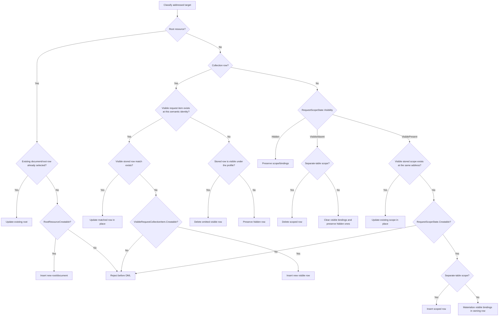

# Backend Redesign: API Profiles (Core/Backend Contract)

This document is the API profiles deep dive for `overview.md`, focusing on:
- readable and writable profile semantics,
- the Core/backend contract for profile-constrained writes,
- merge and preservation rules for hidden data,
- extension behavior under profiles, and
- no-op/concurrency implications.

- Overview: [overview.md](overview.md)
- Flattening & reconstitution: [flattening-reconstitution.md](flattening-reconstitution.md)
- Transactions and concurrency: [transactions-and-concurrency.md](transactions-and-concurrency.md)
- Data model: [data-model.md](data-model.md)
- Extensions: [extensions.md](extensions.md)
- Compiled mapping set: [compiled-mapping-set.md](compiled-mapping-set.md)
- Strengths and risks: [strengths-risks.md](strengths-risks.md)

## Table of Contents

- [Scope](#scope)
- [Goals and Constraints](#goals-and-constraints)
- [Terms](#terms)
- [Legacy Semantics to Preserve](#legacy-semantics-to-preserve)
- [Ownership Boundary](#ownership-boundary)
- [Everything DMS Core Is Expected to Own](#everything-dms-core-is-expected-to-own)
- [Everything Backend Is Expected to Own](#everything-backend-is-expected-to-own)
- [Data Model and Compilation Prerequisites](#data-model-and-compilation-prerequisites)
- [Minimum Core Write Contract](#minimum-core-write-contract)
- [Scope and Row Address Derivation](#scope-and-row-address-derivation)
- [Creatability Decision Model](#creatability-decision-model)
- [Profile Write State Machine](#profile-write-state-machine)
- [Hidden-Member Preservation Execution Model](#hidden-member-preservation-execution-model)
- [Profile-Constrained Write Flow](#profile-constrained-write-flow)
- [Collection Merge Rules Under Profiles](#collection-merge-rules-under-profiles)
- [Non-Collection Scope Rules Under Profiles](#non-collection-scope-rules-under-profiles)
- [Extensions Under Profiles](#extensions-under-profiles)
- [Read Path Under Profiles](#read-path-under-profiles)
- [No-Op Detection and Concurrency](#no-op-detection-and-concurrency)
- [Validation and Error Semantics](#validation-and-error-semantics)

---

## Scope

Defines how API profiles constrain DMS reads and writes in the relational primary store.

Profiles are representation and write-surface rules. They are not a substitute for authorization:
- authorization remains defined in [auth.md](auth.md),
- profile filtering must not change authorization decisions, and
- authorization checks must continue to operate on the full stored state defined by [auth.md](auth.md), not on a profile-projected subset.

This document covers:
- readable and writable profile semantics,
- profile-constrained writes for root, 1:1, collection, common-type, and extension scopes,
- interaction with stable `CollectionItemId`-based child storage,
- backend merge behavior when some stored data is hidden by the active profile, and
- the Core/backend boundary needed to keep profile semantics centralized in Core.

Related redesign discussion:
- high-level architecture and existing profile split: [overview.md:81](overview.md#L81)
- authorization interaction: [auth.md:1](auth.md#L1)
- write/reconstitution mechanics: [flattening-reconstitution.md:399](flattening-reconstitution.md#L399)
- concurrency and guarded execution: [transactions-and-concurrency.md:322](transactions-and-concurrency.md#L322)

## Goals and Constraints

- **Preserve legacy profile semantics**: readable profiles limit returned fields; writable profiles limit accepted input; hidden stored data is preserved on update.
- **Core owns profile semantics**: member filtering, value filtering, readable vs writable mode, request validation, stored-state projection, and creatability rules belong in Core.
- **Backend owns persistence mechanics**: relational flattening, current-state loading, semantic-key matching, `CollectionItemId` reservation, and DML execution remain backend responsibilities.
- **No public API change**: the Core/backend profile contract is internal. Profile support must not add a new external write API.
- **No silent data loss**: a writable profile must not cause hidden data to be deleted simply because it was absent from the filtered request body.
- **No silent pruning of invalid submitted items**: submitted data that violates writable profile collection filters must be rejected, not dropped.
- **Cross-engine parity**: PostgreSQL and SQL Server must follow the same profile-visible merge semantics.
- **Profile support must compose with the rest of the redesign**:
  - stable `CollectionItemId` child storage,
  - compiled semantic collection identity,
  - extension tables aligned to stable base identities,
  - whole-document no-op detection, and
  - `If-Match` / `ContentVersion` concurrency rules.

## Terms

- **Readable profile**: the profile surface used for GET/query representations.
- **Writable profile**: the profile surface used for POST/PUT request validation and shaping.
- **`WritableRequestBody`**: the request body after normal Core canonicalization and writable-profile shaping.
- **`VisibleStoredBody`**: the current stored document after Core applies the same writable-profile rules used for `WritableRequestBody`.
- **Profile visibility state**: one of `VisiblePresent`, `VisibleAbsent`, or `Hidden` for a compiled scope instance.
- **Hidden data**: persisted data excluded from the writable profile surface for the current request.
- **Visible data**: persisted data included in the writable profile surface for the current request.
- **Semantic collection identity**: the compiled non-empty key used to match persisted and requested collection items within a parent scope.
- **Creatability**: the Core-owned answer to the "create new visible data here?" question, surfaced as `RootResourceCreatable`, `RequestScopeState.Creatable`, and `VisibleRequestCollectionItem.Creatable`.
- **Deterministic post-merge sibling-order rule**: the rule used by both write execution and no-op detection to merge visible rows back into the full stored sibling sequence.

## Legacy Semantics to Preserve

The relational redesign must preserve these behaviors:

- Writable profiles can exclude fields, objects, collections, and extensions from the accepted request surface.
- Writable profiles can constrain collection items by value filters, not just by member presence.
- A request that submits a collection item failing a writable profile value filter is invalid. The item must not be silently pruned from the request.
- A writable profile can allow updates to an existing visible item while still forbidding creation of a new item or scope if required members are hidden by the profile.
- Hidden stored data must be preserved on update:
  - hidden collection rows are not deleted,
  - hidden columns on matched rows are not overwritten,
  - hidden 1:1 scopes are not deleted because they are absent from the filtered request,
  - hidden extension data is preserved under the same rules as base data.
- These rules apply recursively to nested collections, common types, and `_ext` sites.

## Ownership Boundary

Profile support is intentionally split:

- Core owns profile semantics.
- Backend owns persistence mechanics.

Backend MUST NOT evaluate:
- profile member filters,
- profile collection item value filters,
- readable vs writable profile selection rules, or
- profile media-type semantics.

Backend MAY use Core-supplied profile outputs to:
- identify visible vs hidden stored data,
- decide whether a new visible scope/item may be created,
- derive which stored collection rows are visible for merge/delete, and
- shape read responses through Core-owned readable projection.

Related redesign discussion:
- Core/backend split and current contract summary: [overview.md:83](overview.md#L83)
- prohibition on backend-evaluated profile predicates during merge execution: [flattening-reconstitution.md:401](flattening-reconstitution.md#L401)
- profile-scoped write/concurrency notes: [transactions-and-concurrency.md:338](transactions-and-concurrency.md#L338)

## Everything DMS Core Is Expected to Own

Core is expected to own all of the following:

1. **Profile metadata loading and validation**
   - load readable and writable profile definitions,
   - validate member names, nested scope references, and profile configuration,
   - fail invalid profile definitions before request-time persistence logic runs.

2. **Readable vs writable profile interpretation**
   - determine which profile definition applies for the current request mode,
   - own the semantics of profile-specific media-type usage.

3. **Recursive member filtering**
   - apply profile member selection rules across root, embedded objects, collections, common types, and extensions.

4. **Recursive collection item value filtering**
   - evaluate profile collection item predicates,
   - apply those predicates consistently to request bodies and stored documents.

5. **Writable request validation**
   - validate that the submitted request does not include data forbidden by the writable profile,
   - reject submitted collection items that fail writable profile value filters,
   - reject submitted collection/common-type/extension collection items that collide on compiled semantic identity within the same stable parent scope after writable-profile shaping, and
   - return structured validation/policy failures rather than silently pruning invalid submitted data.

6. **Creatability analysis**
   - determine whether the active writable profile permits creating:
     - a new resource instance,
     - a new 1:1 child scope,
     - a new collection item,
     - a new nested/common-type scope,
     - a new extension scope or extension collection item.
   - this analysis must account for required members hidden by the writable profile.

7. **Writable request shaping**
   - canonicalize the request as Core normally does,
   - apply writable profile shaping,
   - produce the `WritableRequestBody` used by backend flattening.

8. **Stored-state projection for writes**
   - given the current stored JSON, apply the same writable profile semantics used for the request,
   - produce the `VisibleStoredBody` plus the structured stored-scope and stored-row metadata required by the write contract.

9. **Stable scope and row address derivation**
   - derive `ScopeInstanceAddress` and `CollectionRowAddress` from the shared compiled-scope adapter plus JSON data for both request-side and stored-side projection,
   - use compiled `JsonScope`, compiled collection ancestry, and compiled semantic-identity member order rather than request ordinals or ad hoc JSON traversal, and
   - keep request-side and stored-side address derivation aligned for nested collections and `_ext` scopes.

10. **Visibility signaling for all scopes**
   - identify, for each compiled scope, whether it is:
     - visible and present,
     - visible and absent, or
     - hidden by the profile.
   - this must cover both collection and non-collection scopes.
   - filtered JSON alone is not sufficient because backend must distinguish "hidden" from "intentionally absent."

11. **Collection visibility details**
    - provide enough information for backend to determine which persisted collection rows are visible for merge/delete.
    - Core MUST supply structured collection visibility metadata keyed to compiled scope identity; projected JSON may accompany that metadata, but it is not sufficient by itself.

12. **Semantic identity compatibility validation**
    - Core must reject any writable profile definition that excludes a field required to compute the compiled semantic identity of a persisted multi-item collection scope.
    - this is a Core-owned pre-runtime validation gate; backend write stories assume such invalid profiles never reach runtime merge execution.
    - perform this validation before runtime merge execution whenever possible.

13. **Read projection**
    - apply readable profile semantics to GET/query responses,
    - keep readable shaping logic centralized in Core rather than duplicating it in backend serializers.

14. **Extension profile semantics**
    - apply the same readable/writable filtering semantics to `_ext` data as to base resource data,
    - determine visibility and creatability for extension scopes and extension collection items.

15. **Structured error classification**
    - distinguish invalid profile definitions, invalid profile usage, profile-based write validation failures, and creatability violations so the API layer can map them to consistent responses.

## Everything Backend Is Expected to Own

Backend is expected to own all of the following:

- load the current persisted document state needed for auth, reconstitution, no-op detection, and profile-constrained merge execution,
- resolve document and descriptor references to `DocumentId`,
- flatten the `WritableRequestBody` into row candidates,
- use compiled semantic identities to match visible stored collection rows to request candidates,
- reserve new `CollectionItemId` values for unmatched inserts,
- preserve hidden rows, hidden columns, and hidden scopes using Core-supplied visibility/creatability information,
- execute relational DML and trigger-driven derived maintenance,
- perform storage-space no-op detection using the same post-merge rules as the real write path,
- validate Core-emitted scope/row addresses against the selected compiled-scope adapter and compiled metadata, and fail fast on contract mismatches before merge/readable-projection hand-off continues, and
- enforce `If-Match` / `ContentVersion` concurrency behavior.

## Data Model and Compilation Prerequisites

Profile-constrained backend support depends on the following redesign elements:

Related redesign discussion:
- stable child-row identity and collection table shape: [data-model.md:621](data-model.md#L621)
- compiled collection merge plans and executor behavior: [compiled-mapping-set.md:377](compiled-mapping-set.md#L377)
- flattened write candidates, semantic identities, and merge binding: [flattening-reconstitution.md:427](flattening-reconstitution.md#L427)
- branch-level summary of the merged design: [summary.md:159](summary.md#L159)

1. **Stable collection row identity**
   - every persisted collection row has a stable `CollectionItemId`,
   - matched rows keep their existing `CollectionItemId`,
   - nested descendants and extension scope rows attach through stable base identities rather than ordinals.

2. **Compiled semantic collection identity**
   - for a persisted multi-item collection scope, the compiled semantic identity is the non-empty ordered member set compiled from exactly one of two schema sources after scope resolution and path-to-column binding:
     - non-reference-backed scopes use the applicable `resourceSchema.arrayUniquenessConstraints` entry, and
     - reference-backed scopes whose AUC-derived identity is still empty use exactly one qualifying scope-local `DocumentReferenceBinding` in `documentPathsMapping.referenceJsonPaths` order, with every compiled member bound to the reference `..._DocumentId` FK column rather than to propagated identity columns,
   - runtime merge behavior uses `(ParentScope, SemanticIdentity)` rather than blanket delete/reinsert,
   - collection semantic-identity UNIQUE constraints are derived from that compiled identity rather than from raw `arrayUniquenessConstraints` alone,
   - DMS does not synthesize fallback collection identity from `Ordinal`, `CollectionItemId`, or a parent-only locator,
   - the supported DMS boundary is valid MetaEd-generated models with the relevant validator set applied; for common-backed collections this relies on validators such as `CommonPropertyCollectionTargetMustContainIdentity`, while `CommonPropertyMustNotContainIdentity` keeps the collection property itself out of the parent identity, and
   - if compilation cannot derive that non-empty semantic identity for a persisted multi-item collection scope from either schema source, validation/compilation MUST fail before runtime write execution.

3. **Root and parent scope locators**
   - every collection table stores the root `..._DocumentId`,
   - nested collections additionally store `ParentCollectionItemId`,
   - extension/common-type scope tables align to the owning stable base identity.

4. **Deterministic post-merge sibling-order rule**
   - write execution and no-op detection must use the same sibling-order rule after profile-scoped merges.

5. **Current-state loading**
   - backend must have the full current stored document available before profile-scoped write decisions are finalized.

## Minimum Core Write Contract

The existing branch design already introduces:
- `ProfileAppliedWriteRequest.WritableRequestBody`, and
- `ProfileAppliedWriteContext.VisibleStoredBody`.

Related redesign discussion:
- high-level Core/backend contract statement: [overview.md:85](overview.md#L85)
- current request/context assembly design: [flattening-reconstitution.md:399](flattening-reconstitution.md#L399)
- summarized contract wording: [summary.md:159](summary.md#L159)

For backend profile support to be correct across collection and non-collection scopes, the minimum contract must be concrete and executable. Filtered JSON alone is insufficient.

The implementation does not have to use these exact C# types, but the backend-facing contract MUST be semantically equivalent to the following:

```csharp
public enum ProfileVisibilityKind
{
    VisiblePresent,
    VisibleAbsent,
    Hidden
}

public sealed record ScopeInstanceAddress(
    string JsonScope,
    ImmutableArray<AncestorCollectionInstance> AncestorCollectionInstances
);

public sealed record AncestorCollectionInstance(
    string JsonScope,
    ImmutableArray<SemanticIdentityPart> SemanticIdentityInOrder
);

public sealed record CollectionRowAddress(
    string JsonScope,
    ScopeInstanceAddress ParentAddress,
    ImmutableArray<SemanticIdentityPart> SemanticIdentityInOrder
);

public sealed record SemanticIdentityPart(string RelativePath, JsonNode? Value, bool IsPresent);

public sealed record RequestScopeState(
    ScopeInstanceAddress Address,
    ProfileVisibilityKind Visibility,
    bool Creatable
);

public sealed record VisibleRequestCollectionItem(
    CollectionRowAddress Address,
    bool Creatable
);

public sealed record StoredScopeState(
    ScopeInstanceAddress Address,
    ProfileVisibilityKind Visibility,
    ImmutableArray<string> HiddenMemberPaths
);

public sealed record VisibleStoredCollectionRow(
    CollectionRowAddress Address,
    ImmutableArray<string> HiddenMemberPaths
);

public sealed record ProfileAppliedWriteRequest(
    JsonNode WritableRequestBody,
    bool RootResourceCreatable,
    ImmutableArray<RequestScopeState> RequestScopeStates,
    ImmutableArray<VisibleRequestCollectionItem> VisibleRequestCollectionItems
);

public sealed record ProfileAppliedWriteContext(
    ProfileAppliedWriteRequest Request,
    JsonNode VisibleStoredBody,
    ImmutableArray<StoredScopeState> StoredScopeStates,
    ImmutableArray<VisibleStoredCollectionRow> VisibleStoredCollectionRows
);
```

Normative requirements:

- `WritableRequestBody` is the request after normal canonicalization and writable-profile shaping.
- `RootResourceCreatable` is a Core-owned decision that backend must consult before creating `dms.Document` or root rows for a profile-constrained create.
- `RequestScopeStates` and `StoredScopeStates` MUST distinguish `VisiblePresent`, `VisibleAbsent`, and `Hidden` for every compiled non-collection scope instance that can affect write behavior, including root-adjacent 1:1 scopes, nested/common-type scopes, and `_ext` scopes.
- `RequestScopeState.Creatable` MUST answer only the "create a new visible scope instance here" question. When `Visibility=VisiblePresent` and a visible stored scope already exists at `Address`, backend may update that scope even when `Creatable=false`. For `VisibleAbsent` and `Hidden`, `Creatable` MUST be `false`.
- `VisibleRequestCollectionItems` MUST include every visible submitted item for collection/common-type/extension collection scopes. If an item does not match an existing visible stored row, backend may insert it only when `Creatable=true`.
- `VisibleRequestCollectionItems` MUST contain at most one item per `CollectionRowAddress`. If writable-profile shaping would emit two visible submitted items with the same stable parent address and compiled semantic identity, Core MUST reject the request before backend flattening, merge planning, or DML begins.
- `VisibleRequestCollectionItem.Creatable` MUST answer only the "insert a new visible row here" question. A matched visible stored row may be updated even when `Creatable=false`.
- `VisibleStoredCollectionRows` MUST identify visible persisted rows by compiled semantic identity, not by array ordinal.
- Every `JsonScope` in the contract MUST equal the compiled `DbTableModel.JsonScope` / `TableWritePlan.TableModel.JsonScope` for the addressed scope.
- `AncestorCollectionInstances` MUST be ordered from the root-most collection ancestor to the immediate parent collection ancestor and MUST use compiled semantic identity so the address stays stable across caller-visible reordering.
- `SemanticIdentityInOrder` MUST follow the compiled semantic-identity member order for that collection scope.
- Request-side and stored-side `ScopeInstanceAddress` / `CollectionRowAddress` derivation MUST follow the normative algorithm in [Scope and Row Address Derivation](#scope-and-row-address-derivation).
- `HiddenMemberPaths` MUST be canonical scope-relative member paths that tell backend which stored values must be preserved on matched rows/scopes, including hidden scalar columns, hidden inlined common-type members, and hidden extension members.
- For any profiled matched row/scope that remains in storage, `HiddenMemberPaths` plus compiled write-plan metadata MUST let backend classify every non-storage-managed binding affected by that scope as exactly one of: visible and writable, hidden and preserved, cleared because the scope is visible but absent, or storage-managed. This accounting rule applies to canonical key-unification storage columns, synthetic presence flags, and FK/descriptor bindings derived from profiled members; generated `UnifiedAlias` columns remain indirect/read-only and are accounted for through their canonical/presence bindings rather than direct writes.
- `VisibleStoredBody` remains the projected JSON view of currently visible stored state, but backend MUST NOT infer hidden-vs-absent semantics or persisted row identity from projected JSON alone when the structured contract is available.
- Core MUST reject any writable profile definition that excludes a field required to compute the compiled semantic identity of a persisted multi-item collection scope.

This contract is internal to Core/backend. It MUST NOT change the public API surface.

## Shared Compiled-Scope Adapter

The ownership boundary for profile support is:

- Backend/runtime plan compilation remains the source of truth for `DbTableModel`, `TableWritePlan`, `CollectionMergePlan`, hydration/reconstitution plans, and all SQL/DML binding metadata.
- Core MUST NOT take a direct dependency on those backend plan types or on storage-binding internals to derive addresses, readable/writable profile projections, or `HiddenMemberPaths`.
- Instead, the selected mapping set MUST expose an immutable resource-scoped compiled-scope catalog or equivalent adapter built from the same compiled plans. The concrete implementation can be a DTO graph, interface, or generated adapter; the required semantics are normative even if the type name is not.
- Core consumes only that narrowed adapter for request-side/stored-side address derivation and canonical member-path vocabulary. Backend continues to use its full compiled plans for binding accounting, DML generation, and runtime validation.

Minimum adapter surface per compiled scope:

| Adapter field | Required semantics |
| --- | --- |
| `JsonScope` | Exact compiled scope identifier used by `DbTableModel.JsonScope` / `TableWritePlan.TableModel.JsonScope` |
| `ScopeKind` | Distinguishes `Root`, `NonCollection`, and `Collection` so Core knows whether to emit `ScopeInstanceAddress` or `CollectionRowAddress` |
| `ImmediateParentJsonScope` | Compiled parent scope that directly owns this scope/item; collection-aligned `_ext` scopes point at the aligned base scope rather than an ordinal path |
| `CollectionAncestorsInOrder` | Compiled collection scopes on the path from the root-most collection ancestor to the immediate parent collection ancestor |
| `SemanticIdentityRelativePathsInOrder` | For persisted multi-item collection scopes, the non-empty compiled semantic identity member paths in `CollectionMergePlan.SemanticIdentityBindings` order |
| `CanonicalScopeRelativeMemberPaths` | Canonical scope-relative member-path vocabulary Core uses when emitting `SemanticIdentityPart.RelativePath` and `HiddenMemberPaths` |

Lifecycle and validation rules:

- Backend MUST build the adapter from the same selected mapping set/resource plan instance used for write execution and read/write reconstitution; Core and backend MUST therefore operate over the same compiled scope vocabulary.
- The adapter is an internal runtime contract. It MAY be cached, serialized, or code-generated with the mapping set, but it MUST stay version-aligned with the compiled plans it was derived from.
- Core MUST emit `SemanticIdentityPart.RelativePath` and `HiddenMemberPaths` only in the canonical scope-relative vocabulary published by the adapter. Core MUST NOT synthesize alternate relative path strings ad hoc.
- Backend MUST validate Core-emitted addresses and canonical member paths against its locally selected compiled plans and fail deterministically on drift rather than attempting best-effort coercion.
- `HiddenMemberPaths` remains a Core-owned output. Backend resolves those canonical member paths to physical bindings through `TableWritePlan`, `CollectionMergePlan`, `KeyUnificationWritePlan`, and related compiled metadata it already owns.
- This keeps the ownership boundary narrow: Core needs compiled scope shape and canonical path vocabulary, but it does not need direct knowledge of column bindings, FK bindings, key-unification storage columns, `Ordinal` handling, or SQL plan shapes.

## Scope and Row Address Derivation

`ScopeInstanceAddress` and `CollectionRowAddress` are executable contract keys, not descriptive record shapes. Core MUST derive them from the shared compiled-scope adapter plus JSON data using the same algorithm for request-side and stored-side projection, and backend MUST validate the emitted addresses against the compiled plan metadata before using them.

Compiled-scope adapter inputs:

- `JsonScope`: the compiled `DbTableModel.JsonScope` / `TableWritePlan.TableModel.JsonScope` for the addressed scope.
- `CollectionAncestorsInOrder`: the compiled collection scopes on the path to that scope, ordered from the root-most collection ancestor to the immediate parent collection ancestor.
- `SemanticIdentityRelativePathsInOrder`: for every persisted multi-item collection scope, the compiled non-empty semantic identity member paths emitted in `CollectionMergePlan.SemanticIdentityBindings` order.
- `ImmediateParentJsonScope`: the compiled scope instance that directly owns the addressed scope or collection row. For top-level collections this is `$`; for nested/common-type and collection-aligned `_ext` scopes it is the aligned parent scope, not a request-ordinal path.

Normative derivation algorithm:

1. Resolve the compiled scope descriptor for the addressed scope from the shared adapter. The emitted `JsonScope` MUST be that compiled `JsonScope` exactly. Core MUST NOT emit caller-visible numeric indexes or synthesize alternate path strings.
2. Derive `AncestorCollectionInstances` from `CollectionAncestorsInOrder`. For each ancestor collection scope:
   - locate the concrete JSON collection item instance on the traversal path to the addressed node,
   - read the ancestor collection scope's semantic identity relative paths from that item in compiled order, and
   - emit `AncestorCollectionInstance(JsonScope, SemanticIdentityInOrder)` using the ancestor scope's compiled `JsonScope`.
3. For each `SemanticIdentityPart`:
   - `RelativePath` MUST equal the adapter-published canonical scope-relative path for that semantic identity member,
   - `Value` MUST be the JSON value read at that relative path after normal request canonicalization or full stored-document reconstitution, and
   - `IsPresent` MUST preserve missing-vs-explicit-null semantics for that same relative path.
4. `ScopeInstanceAddress` for a non-collection scope instance is:
   - the addressed scope's compiled `JsonScope`, and
   - the derived `AncestorCollectionInstances`.
   The root scope `$` therefore has an empty ancestor list.
5. `CollectionRowAddress` for a visible collection row/item is:
   - the collection scope's compiled `JsonScope`,
   - `ParentAddress` equal to the `ScopeInstanceAddress` of the immediate containing scope instance, and
   - `SemanticIdentityInOrder` equal to the addressed collection scope's own compiled semantic identity parts read from the collection item in compiled order.
6. `_ext` segments participate as literal `JsonScope` segments, but they do not create ancestor collection instances by themselves. Only compiled collection scopes contribute ancestor entries. A collection-aligned extension child collection therefore reuses the aligned base collection instance as the relevant parent/ancestor context.
7. Request-side derivation MUST use `WritableRequestBody`. Stored-side derivation MUST use the full current stored document before readable-profile projection. Both sides MUST use the same shared adapter, ancestor discovery rules, and semantic-identity member order so a visible scope/item resolves to the same address on both sides.

Runtime validation and fail-fast diagnostics:

- Backend MUST pre-index compiled scope metadata by `JsonScope` and validate every Core-emitted `ScopeInstanceAddress` and `CollectionRowAddress` before merge execution, no-op comparison, or readable-projection hand-off proceeds.
- If Core emits an address whose `JsonScope` does not map to exactly one compiled scope of the expected kind, backend MUST fail deterministically with a profile contract mismatch diagnostic.
- If Core emits an address whose ancestor chain length, ancestor `JsonScope`s, or per-ancestor semantic-identity part ordering cannot be matched to the compiled collection ancestry, backend MUST fail deterministically.
- If backend cannot line up a Core-emitted visible stored row or visible stored scope with the compiled current-state shape expected for that resource scope, backend MUST fail deterministically rather than guessing from array order, filtered JSON, or delete+insert fallback behavior.
- These diagnostics are internal contract failures. They MUST short-circuit before DML or readable response shaping continues, and they MUST NOT be downgraded to silent omission handling.

## Creatability Decision Model

Creatability is the Core-owned answer to a narrow question:

> If this request would materialize a new visible stored instance at this root/scope/item address, is that create allowed under the active writable profile?

It is not a general permission bit for mentioning that scope/item in the request. Existing visible data may remain updatable even when the same profile forbids creation of a brand-new visible instance.

Normative rules:

- Creatability MUST be evaluated against the visible stored state represented by `StoredScopeStates` and `VisibleStoredCollectionRows`, not against raw stored JSON alone.
- Only existing visible stored data suppresses the create decision. Hidden stored data never converts a create-of-new-visible-data attempt into an update-of-existing-visible-data.
- Creatability MUST be evaluated top-down. A child scope/item is not creatable unless its immediate visible parent instance already exists in stored state or is itself creatable in the same request.
- Creation-required members are the writable-profile-controlled request members needed to materialize a valid new visible stored instance for that root/scope/item. They include:
  - required members of the root/scope/item under the effective schema,
  - required members of any newly visible nested/common-type or extension scope/item that must also be created as part of the same request, and
  - compiled semantic-identity members for persisted multi-item collections.
- Storage-managed values such as `DocumentId`, `CollectionItemId`, `ParentCollectionItemId`, timestamps, and `ContentVersion` are not creation-required members for this algorithm.
- A creation-required member hidden by the writable profile makes the create attempt non-creatable.
- Submitted data that fails a writable profile value filter is a writable-profile validation failure, not a creatability decision.
- For persisted multi-item collections, a writable profile that hides a compiled semantic-identity member is invalid profile metadata. Core MUST reject that profile definition before runtime instead of reporting `Creatable=false`.
- Matched visible stored scopes/rows may be updated even when the same profile would reject creation of a new visible scope/row because hidden required members are preserved from stored state on update.

Normative decision procedure:

1. Determine whether the request is trying to create a new visible stored instance.
   - Root resource instance: the operation would create a new document/root row.
   - Non-collection scope: `RequestScopeState.Visibility=VisiblePresent` and there is no visible stored scope at the same `ScopeInstanceAddress`.
   - Collection/common-type/extension collection item: the visible request item has no visible stored row match at the same parent address by compiled semantic identity.
2. If the request is not trying to create a new visible stored instance, it is on the update/delete/preserve path rather than the creatability path.
   - Existing document/root row: update path; `RootResourceCreatable` is not consulted.
   - Existing visible non-collection scope with `Visibility=VisiblePresent`: update path even when `Creatable=false`.
   - Visible non-collection scope with `Visibility=VisibleAbsent`: delete/clear path.
   - Hidden non-collection scope: preserve path.
   - Matched visible collection/common-type/extension item: update path even when `Creatable=false`.
   - Omitted visible stored collection row: delete path.
   - Hidden stored collection row: preserve path.
3. If the request is trying to create a new visible stored instance, it is creatable only when all of the following are true:
   - the immediate visible parent instance already exists or is creatable in the same request,
   - every creation-required member for that new visible instance is exposed by the writable profile, and
   - after writable-profile shaping, the request still provides the required visible values, or those values come from normal system/backend processing rather than hidden stored data.

Decision table:

| Create target | When it is a create attempt | Create allowed when | Existing visible behavior |
| --- | --- | --- | --- |
| New resource instance | The write would create a new `dms.Document` + root row | Root creation-required members are visible or system-supplied, and any newly visible children are creatable | Existing document update ignores `RootResourceCreatable` |
| New 1:1 child scope | `Visibility=VisiblePresent` and no visible stored scope exists at the same scope address | Parent visible instance exists or is creatable, and the scope's creation-required members are visible or system-supplied | Existing visible scope updates normally; hidden required members do not block that update |
| New nested/common-type scope | Same as any non-collection scope, whether stored in a separate table or inlined into the parent row | Parent visible instance exists or is creatable, and the nested scope's creation-required members are visible or system-supplied | Existing visible scope updates normally; `VisibleAbsent` clears/deletes instead of creating |
| New collection item | Visible request item has no visible stored-row match by compiled semantic identity | Parent visible instance exists or is creatable, the item passes writable-profile validation, and the item's creation-required members are visible or system-supplied | Matched visible row updates in place even when `Creatable=false` |
| New extension scope | `Visibility=VisiblePresent` on a `_ext` scope and no visible stored extension scope exists at that address | Owning base instance exists or is creatable, and the extension scope's creation-required members are visible or system-supplied | Existing visible extension scope updates normally |
| New extension collection item | Visible request item in an extension collection has no visible stored-row match by compiled semantic identity | Owning base/extension parent exists or is creatable, the item passes writable-profile validation, and the item's creation-required members are visible or system-supplied | Matched visible extension row updates in place even when `Creatable=false` |

Worked examples:

1. Rejected new resource instance because the writable profile hides a required root member.

```text
Writable profile exposes: $.studentReference.studentUniqueId, $.entryDate
Writable profile hides required root member: $.schoolReference.schoolId
Operation: POST that would create a new resource instance
Result: RootResourceCreatable=false
Backend behavior: reject before creating dms.Document or root rows
```

2. Existing visible non-collection scope may update even though a new scope would be non-creatable.

```text
Scope: $.birthData
Required scope members: birthDate, countryOfBirthDescriptor
Writable profile exposes: birthDate
Writable profile hides: countryOfBirthDescriptor

Case A: stored visible $.birthData already exists
Request keeps $.birthData visible/present and changes birthDate
Result: update allowed, hidden countryOfBirthDescriptor is preserved from stored state

Case B: stored $.birthData does not exist
Same request body would create a new visible $.birthData scope
Result: RequestScopeState.Creatable=false, reject as a creatability failure
```

3. Existing visible collection item may update even though a new item would be non-creatable.

```text
Collection scope: $.sessions[*]
Compiled semantic identity: sessionName
Required item members: sessionName, startDate
Writable profile exposes: sessionName, endDate
Writable profile hides: startDate

Case A: visible stored row exists for sessionName="Regular"
Request updates endDate for sessionName="Regular"
Result: matched visible row updates in place; hidden startDate is preserved

Case B: request includes sessionName="Summer" and no visible stored row matches
Result: VisibleRequestCollectionItem.Creatable=false, reject before insert
```

4. Extension scopes follow the same rule set.

```text
Extension scope: $._ext.project.interventionPlan
Required members: interventionTypeDescriptor, beginDate

Case A: profile exposes both required members and request supplies them
Result: new visible extension scope is creatable

Case B: extension child collection item requires serviceDescriptor but the profile hides it
Result: submitted new visible extension collection item is non-creatable and must be rejected
```

5. Top-down creatability across an existing root, a middle collection item, and a descendant extension child collection.

```text
Existing visible root resource: $.studentProgramAssociation
Middle collection scope: $.programs[*]
Compiled semantic identity: programName
Required middle-level members: programName, beginDate
Extension child collection: $.programs[*]._ext.project.services[*]
Required child members: serviceDescriptor

Writable profile exposes:
- root members needed to target the existing resource
- middle level: programName
- extension child level: serviceDescriptor, dosage

Writable profile hides:
- middle level: beginDate

Case A: existing visible middle-level item already exists
Stored visible $.programs[*] row exists for programName="Tutoring" with hidden beginDate=2024-08-20
Request targets programName="Tutoring" and adds/updates serviceDescriptor="Counseling"
Decision chain:
- root already exists -> update path
- $.programs[*](programName="Tutoring") matches visible stored data -> update path even though beginDate is hidden
- descendant extension child item is evaluated under an existing visible parent; if its own required members are visible/supplied, create or update is allowed
Result: request is valid

Case B: request tries to create a new visible middle-level item
Request submits programName="Mentoring" plus descendant serviceDescriptor="Coaching"
No visible stored $.programs[*] row matches programName="Mentoring"
Decision chain:
- root already exists -> update path
- $.programs[*](programName="Mentoring") is a create attempt, but beginDate is hidden by the profile -> non-creatable
- descendant extension child item is also non-creatable because its immediate visible parent neither exists nor is creatable in the same request
Result: reject before inserting either the new middle-level row or the descendant extension row
```

## Profile Write State Machine

The contract surface is intentionally rich, but backend execution MUST reduce every profiled write target to a small finite dispatcher. After address derivation and visible-stored-state projection, each addressed root/scope/item MUST end in exactly one of these outcomes:

- `Insert`
- `Update`
- `Delete/Clear`
- `Preserve`
- reject before DML because the request is attempting a non-creatable visible insert/create

There are no other legal runtime outcomes. In particular, backend MUST NOT invent a fifth execution behavior such as "guess from filtered JSON", "treat hidden as absent", or "fall back to delete+insert for a matched visible row."

### Concrete Scope Kinds Collapse to Execution Families

The apparent cross-product of "7 scope kinds x 3 profile states x operation kind" is smaller at runtime because the compiled write path collapses concrete shapes into a few execution families:

| Concrete addressed thing | Execution family | Identity basis | Legal outcomes |
| --- | --- | --- | --- |
| Root resource instance | Root | Existing document/root-row existence for the resource identity | `Insert`, `Update`, reject |
| Root-adjacent 1:1 scope stored in its own table | Non-collection separate-table scope | `ScopeInstanceAddress` | `Insert`, `Update`, `Delete`, `Preserve`, reject |
| Nested/common-type scope stored in its own table | Non-collection separate-table scope | `ScopeInstanceAddress` | `Insert`, `Update`, `Delete`, `Preserve`, reject |
| Nested/common-type scope inlined into a parent/root row | Non-collection inlined scope | `ScopeInstanceAddress` plus the owning row selected by the compiled plan | materialize/update visible bindings, clear visible bindings, preserve hidden bindings, reject |
| Base collection or common-type collection item | Collection row | `CollectionRowAddress` with compiled semantic identity | `Insert`, `Update`, `Delete`, `Preserve`, reject |
| Resource-level or collection-aligned extension scope row | Non-collection separate-table scope | `ScopeInstanceAddress` | `Insert`, `Update`, `Delete`, `Preserve`, reject |
| Extension child collection item | Collection row | `CollectionRowAddress` with compiled semantic identity | `Insert`, `Update`, `Delete`, `Preserve`, reject |

`POST` versus `PUT` does not create a different child-scope state machine. It only changes whether the root resource is on the create path or the existing-document path before the same scope/item dispatcher runs underneath it.

### Normative Decision Tree

Backend MUST drive profiled writes through this decision tree after Core has produced `ProfileAppliedWriteRequest` and `ProfileAppliedWriteContext`:



Equivalent numbered procedure:

1. Classify the addressed thing as `Root`, `Non-collection separate-table scope`, `Non-collection inlined scope`, or `Collection row`.
2. Resolve the visible stored presence for that same `ScopeInstanceAddress` or `CollectionRowAddress`.
3. If the target is a create attempt, consult the corresponding Core-owned creatability bit.
4. Select exactly one of `Insert`, `Update`, `Delete/Clear`, `Preserve`, or reject before DML.
5. Apply the family-specific execution semantics from the tables below.

### Exhaustive Root Outcome Table

| Root condition | `RootResourceCreatable` consulted? | Outcome |
| --- | --- | --- |
| No existing document/root row is selected for the resource identity | Yes | `Insert` when `true`; reject before creating `dms.Document` or root rows when `false` |
| Existing document/root row is selected for the resource identity | No | `Update` the existing root and then dispatch descendant scopes/items by their families |

Root execution has no profile-state-specific `Delete/Clear` or `Preserve` branch. Those semantics apply to descendant scopes/items inside the root update.

### Exhaustive Non-Collection Scope Outcome Table

For non-collection scopes, hidden branches care about whether a physical stored scope/row already exists. `VisiblePresent` and `VisibleAbsent` branches care about whether `StoredScopeStates` contains a `VisiblePresent` scope at the same `ScopeInstanceAddress`. Hidden stored data does not count as an existing visible scope for create/update/delete decisions.

| Storage family | Request visibility | Stored condition | `Creatable` consulted? | Outcome |
| --- | --- | --- | --- | --- |
| Separate-table scope | `Hidden` | No stored row exists | No | `Preserve` absence; backend does not create or delete anything for that scope |
| Separate-table scope | `Hidden` | Stored row exists | No | `Preserve` the existing scoped row unchanged |
| Separate-table scope | `VisibleAbsent` | No visible stored scope exists | No | `Delete/Clear` is a no-op because there is no visible row to delete |
| Separate-table scope | `VisibleAbsent` | Visible stored scope exists | No | `Delete` the existing scoped row |
| Separate-table scope | `VisiblePresent` | No visible stored scope exists | Yes | `Insert` when `Creatable=true`; otherwise reject before DML |
| Separate-table scope | `VisiblePresent` | Visible stored scope exists | No | `Update` the existing scoped row in place using hidden-member overlay |
| Inlined scope | `Hidden` | No stored bindings currently materialized for that scope surface | No | `Preserve` the owning row unchanged for that scope surface |
| Inlined scope | `Hidden` | Stored bindings exist for that scope surface | No | `Preserve` the existing hidden-governed bindings unchanged |
| Inlined scope | `VisibleAbsent` | No visible stored scope exists | No | `Delete/Clear` means clear the visible compiled bindings for that scope surface; if they are already clear, the result is a no-op |
| Inlined scope | `VisibleAbsent` | Visible stored scope exists | No | `Delete/Clear` means clear the visible compiled bindings for that scope surface and preserve bindings still governed by `HiddenMemberPaths` |
| Inlined scope | `VisiblePresent` | No visible stored scope exists | Yes | materialize the visible bindings in the owning row when `Creatable=true`; otherwise reject before DML |
| Inlined scope | `VisiblePresent` | Visible stored scope exists | No | `Update` the visible bindings in place using hidden-member overlay |

The non-collection table is exhaustive for:

- root-adjacent 1:1 separate-table scopes,
- nested/common-type scopes stored separately,
- nested/common-type scopes inlined into a parent/root row, and
- resource-level or collection-aligned extension scope rows.

### Exhaustive Collection Outcome Table

For collection scopes, backend classifies each row candidate or stored row by compiled semantic identity within its stable parent instance.

| Collection classification | `Creatable` consulted? | Outcome |
| --- | --- | --- |
| Visible request item matches a visible stored row at the same `CollectionRowAddress` | No | `Update` the matched row in place; preserve hidden-member-governed bindings on that row |
| Visible request item has no visible stored-row match at the same parent address | Yes | `Insert` when `VisibleRequestCollectionItem.Creatable=true`; otherwise reject before DML |
| Visible stored row has no visible request item match | No | `Delete` the omitted visible row |
| Hidden stored row has no visible request item match | No | `Preserve` the hidden row unchanged |

Additional collection-state clarifications:

- A request item that fails writable profile value filtering is rejected by Core before it reaches this dispatcher. Backend never interprets that case as `Preserve` or `Delete`.
- Duplicate visible request items at the same `CollectionRowAddress` are invalid dispatcher input. Core MUST reject them as request-validation failures before runtime merge execution; backend MUST NOT pick a first-wins/last-wins tie-breaker or defer the public error behavior to a relational unique-constraint violation.
- A semantic-identity change is not an in-place rename. It decomposes into `Delete` for the old visible row plus `Insert` for the new visible row, and the `Insert` branch still requires `Creatable=true`.
- Hidden stored rows never suppress the create branch for a new visible request item. They remain on the `Preserve` path unless the same row is also visible and matched under the profile.

### Dispatcher Invariants

The state machine above is normative:

- Exactly one execution family applies to any addressed root/scope/item instance.
- Exactly one outcome applies after visibility, current visible state, and creatability are evaluated.
- `Creatable` is consulted only on the create branch; it is never used to block updates to already visible matched data.
- Hidden data always takes the `Preserve` branch, never the `Delete/Clear` branch.
- Whole-document no-op detection MUST replay this same dispatcher and its post-merge synthesis rules rather than inventing compare-only semantics.

## Hidden-Member Preservation Execution Model

This design chooses one explicit backend execution model for hidden-member preservation:

- Core supplies scope visibility plus canonical scope-relative `HiddenMemberPaths`.
- Backend preserves hidden stored values by overlaying visible request-derived values onto current stored row values using compiled write-plan bindings and current-state rows.
- Backend does not receive per-column visibility booleans from Core and MUST NOT infer hidden-vs-absent semantics from filtered JSON.

Normative rules:

- **Matched collection rows**
  - backend starts from the current stored row identified by the matched `CollectionItemId`,
  - overlays visible request/resolved values onto that row using compiled bindings, and
  - preserves any binding governed by `HiddenMemberPaths`, including FK columns, presence columns, and key-unification canonical/presence bindings derived from hidden members.

- **Matched visible non-collection scopes stored in separate tables**
  - backend updates the existing row using the same compiled-binding overlay model,
  - preserves columns governed by `HiddenMemberPaths`, and
  - deletes the row only when the scope state is `VisibleAbsent`.

- **Inlined parent/root-row scopes**
  - the parent/root row is updated in place,
  - when the inlined scope is `VisiblePresent`, backend overlays visible request/resolved values and preserves bindings governed by `HiddenMemberPaths`,
  - when the inlined scope is `VisibleAbsent`, backend clears only the compiled bindings belonging to the visible scope surface and preserves bindings governed by `HiddenMemberPaths`, and
  - when the inlined scope is `Hidden`, backend preserves those bindings unchanged.

- **Extension scopes and extension columns**
  - `_ext` scopes use the same model as base scopes,
  - hidden-vs-visible-absent for extensions is a scope-row decision because the redesign stores `_ext` in separate extension tables rather than inlining extension columns into base tables, and
  - columns on matched visible extension rows preserve hidden members through the same compiled-binding overlay model.

- **Scope-state authority**
  - `RequestScopeStates` / `StoredScopeStates` are the authoritative source for `VisiblePresent`, `VisibleAbsent`, and `Hidden`,
  - `WritableRequestBody` and `VisibleStoredBody` are insufficient by themselves to decide whether omission means "clear/delete" or "preserve hidden data."

### Compiled Binding Accounting

The preservation model is enforced against compiled write bindings, not against raw JSON member enumeration.

For every compiled binding on:
- a matched visible row/scope that stays in storage, or
- an inlined scope whose state is `VisibleAbsent`,
backend MUST assign exactly one of the following outcomes:

- **Visible and writable**
  - the binding is driven by the visible request surface for that scope instance and is written from request/resolved/precomputed values.
  - this includes canonical key-unification storage bindings when at least one visible member path in the corresponding unification class is being written.

- **Hidden and preserved**
  - the binding is governed only by hidden member paths for that scope instance, so backend copies the current stored value unchanged.
  - this includes hidden reference FK bindings, hidden descriptor FK bindings, canonical key-unification storage columns fed only by hidden members, and synthetic presence columns whose governing member path is hidden.

- **Cleared when the scope is visible but absent**
  - the scope state is `VisibleAbsent` and normal `PUT` semantics clear that binding because it belongs only to the visible surface being removed.
  - for separate-table scopes, deleting the row satisfies this outcome for that row's non-storage-managed bindings.
  - if a storage binding is also governed by a preserved hidden member path (for example a shared canonical key-unification column), it is not cleared; it falls under hidden-and-preserved instead.

- **Storage-managed**
  - the binding is owned by executor/storage mechanics rather than by profile member visibility.
  - examples include row identity/locator columns (`DocumentId`, `CollectionItemId`, `ParentCollectionItemId`, `BaseCollectionItemId`), recomputed `Ordinal`, and document/version/stamp columns.

How `HiddenMemberPaths` maps to compiled bindings:

- `HiddenMemberPaths` is emitted by Core in the canonical scope-relative vocabulary published by the shared compiled-scope adapter, not in physical column names. Backend resolves those paths through compiled write-plan metadata before classifying bindings.
- A direct scalar/member binding is governed by its own scope-relative path.
- A document-reference FK binding and any propagated/reference-identity storage bindings derived from that reference are governed by the reference member paths that produced them. Hidden reference members therefore preserve both the FK column and any derived storage bindings.
- A descriptor FK binding is governed by the descriptor member path that produced the resolved `..._DescriptorId`.
- A key-unification canonical storage binding is governed by the full member set in the corresponding `KeyUnificationWritePlan`. Hidden aliases are never written directly; they are preserved indirectly through the canonical storage binding and its presence gates.
- A synthetic `..._Present` binding is governed by the optional member path whose presence it tracks: visible/present writes recompute it, hidden members preserve it, and visible-absent clears it when no preserved hidden member path still governs the same storage state.
- Generated/computed `UnifiedAlias` columns MUST NOT appear in direct profiled DML. If a dialect persists them physically, they are still accounted for indirectly through the canonical storage column plus optional presence column that defines the alias expression.

Defensive validation:

- Before merge DML proceeds for a profiled matched row/scope, backend MUST prove every affected compiled binding is accounted for by exactly one of the four outcomes above.
- An unaccounted or multiply-accounted binding is a deterministic profile-runtime failure, not a reason to guess from filtered JSON, omit a column write, or fall back to delete+insert behavior.

## Profile-Constrained Write Flow

The write flow under a writable profile is:

Related redesign discussion:
- end-to-end write-path mechanics: [flattening-reconstitution.md:427](flattening-reconstitution.md#L427)
- transactional write ordering and guarded execution: [transactions-and-concurrency.md:208](transactions-and-concurrency.md#L208)
- compiled runtime write-plan usage: [compiled-mapping-set.md:377](compiled-mapping-set.md#L377)
- authorization ordering and integration: [transactions-and-concurrency.md:233](transactions-and-concurrency.md#L233)

1. **Core validates profile usage**
   - select the writable profile definition for the request,
   - reject invalid profile usage or invalid profile metadata.

2. **Core validates and shapes the request**
   - apply normal request canonicalization,
   - validate submitted data against writable profile rules,
   - reject invalid submitted collection items instead of silently pruning them,
   - produce `ProfileAppliedWriteRequest`, including `WritableRequestBody`, `RootResourceCreatable`, `RequestScopeStates`, and `VisibleRequestCollectionItems`.

3. **Backend resolves references and authorization inputs**
   - resolve references/descriptors to `DocumentId`,
   - perform authorization as defined in [auth.md](auth.md) using the full stored/request state required there.

4. **Backend loads current state**
   - for update/upsert-to-existing flows, load the current stored JSON and current relational rows needed for merge/no-op detection.

5. **Backend invokes Core stored-state projection**
   - this is a backend-to-Core callback function invocation.
   - apply writable profile semantics to the current stored JSON,
   - assemble `ProfileAppliedWriteContext` containing `VisibleStoredBody`, `StoredScopeStates`, and `VisibleStoredCollectionRows`.

6. **Backend extracts request candidates**
   - flatten the `WritableRequestBody` into logical row candidates,
   - compute semantic identities for persisted multi-item collection scopes.

7. **Backend binds candidates against current state**
   - for visible collection rows, match by compiled semantic identity,
   - for hidden collection rows, preserve them untouched,
   - for non-collection scopes, use Core visibility information to distinguish hidden-from-profile vs visible-and-absent, and
   - for matched rows/scopes, overlay visible request-derived values onto current stored row values while preserving bindings identified by `HiddenMemberPaths`, and
   - classify every affected compiled binding as visible-and-writable, hidden-and-preserved, clear-on-visible-absent, or storage-managed, failing fast if any binding cannot be accounted for deterministically.

8. **Backend executes merge DML**
   - update matched rows in place,
   - delete omitted visible rows/scopes,
   - insert only new visible rows/scopes that Core marks as creatable,
   - preserve hidden rows/scopes/columns.

9. **Backend performs no-op/concurrency checks**
   - compare post-merge storage-space rowsets to current rowsets,
   - enforce `If-Match` / `ContentVersion` rules before committing a no-op success.

This remains full-document `PUT` semantics. Profile support does not introduce API-surface partial updates.

## Collection Merge Rules Under Profiles

For profile-constrained writes:

Related redesign discussion:
- normative merge and ordering rules: [flattening-reconstitution.md:483](flattening-reconstitution.md#L483)
- write-path/concurrency constraints on accepted profile writes: [transactions-and-concurrency.md:338](transactions-and-concurrency.md#L338)
- compiled executor behavior for current sibling sets, updates, deletes, and inserts: [compiled-mapping-set.md:389](compiled-mapping-set.md#L389)
- collection table identity and constraints: [data-model.md:621](data-model.md#L621)

- visible stored rows are the persisted rows that the writable profile exposes for that scope instance,
- hidden stored rows are persisted rows excluded from that scope instance by the writable profile,
- backend matches visible stored rows to request candidates by compiled semantic identity,
- matched rows keep their existing `CollectionItemId`,
- hidden rows are never deleted or updated,
- hidden columns on matched rows are preserved by applying the compiled-binding overlay model to the existing row identity,
- a change to the semantic identity is treated as `delete old visible row + insert new visible row`, not as an in-place rename,
- unmatched visible inserts require Core to have marked the scope/item creatable.

Ordering rules:

- for full-surface writes, the stored sibling set may reorder to match request order,
- for profile-scoped writes, start from the current full sibling sequence for that scope instance,
- identify the visible-row subsequence for that scope instance,
- replace that visible subsequence with the merged visible rows in request order,
- preserve hidden rows in their existing relative gaps,
- append any extra visible inserts after the last previously visible row for that scope instance (or at the end when there was no previously visible row),
- renumber `Ordinal` contiguously.

The same deterministic ordering rule must be used by:
- the real write executor, and
- whole-document no-op detection.

That shared behavior MUST come from the same executor-facing merge metadata and rowset-synthesis logic. Backend MAY factor this as a common helper, but it MUST NOT introduce a separate profile-specific compare-only merge implementation for no-op detection that can drift from real execution semantics.

Normative worked examples:

Apply the same rule independently per compiled collection scope plus stable parent instance.

1. No previously visible row for the scope instance.

```text
Stored siblings:  [A1(hidden,id=10), A2(hidden,id=11)]
Request siblings: [A3(city=new), A4(city=new)]
Visible subset:   []
Match mode:       SemanticKey
Result:           insert A3 with new id=20, insert A4 with new id=21
Stored order:     [A1(hidden,id=10), A2(hidden,id=11), A3(visible,id=20), A4(visible,id=21)]
```

2. Deleting all previously visible rows while hidden rows remain.

```text
Stored siblings:  [A1(hidden,id=10), A2(visible,id=11), A3(hidden,id=12), A4(visible,id=13)]
Request siblings: []
Visible subset:   [id=11, id=13]
Match mode:       SemanticKey
Result:           delete visible id=11 and id=13
Stored order:     [A1(hidden,id=10), A3(hidden,id=12)]
```

3. Visible updates plus inserts with hidden rows interleaved.

```text
Stored siblings:  [A1(hidden,id=10), A2(visible,id=11), A3(hidden,id=12), A4(visible,id=13)]
Request siblings: [A4(city=updated), A2(city=updated), A5(city=new)]
Visible subset:   [id=11, id=13]
Match mode:       SemanticKey
Result:           update visible id=13 and id=11 in place, insert A5 with new id=20
Stored order:     [A1(hidden,id=10), A4(visible,id=13), A3(hidden,id=12), A2(visible,id=11), A5(visible,id=20)]
```

4. Nested collection scopes use the same rule per stable parent instance.

```text
Scope instance:   $.sections[*].meetings[*] under ParentCollectionItemId=50
Stored siblings:  [M1(hidden,id=100), M2(visible,id=101), M3(hidden,id=102)]
Request siblings: [M2(room=updated), M4(room=new)]
Visible subset:   [id=101]
Match mode:       SemanticKey
Result:           update visible id=101 in place, insert M4 with new id=110
Stored order:     [M1(hidden,id=100), M2(visible,id=101), M3(hidden,id=102), M4(visible,id=110)]
```

5. Extension child collections use the same rule per stable parent instance.

```text
Scope instance:   $._ext.project.interventions[*].services[*] under ParentCollectionItemId=300
Stored siblings:  [S1(hidden,id=401), S2(visible,id=402), S3(hidden,id=403)]
Request siblings: [S2(code=updated), S4(code=new)]
Visible subset:   [id=402]
Match mode:       SemanticKey
Result:           update visible id=402 in place, insert S4 with new id=450
Stored order:     [S1(hidden,id=401), S2(visible,id=402), S3(hidden,id=403), S4(visible,id=450)]
```

## Non-Collection Scope Rules Under Profiles

Profile support must also define behavior for non-collection scopes:

Related redesign discussion:
- current 1:1 execution mechanics (`UpdateSql` / `DeleteByParentSql`): [flattening-reconstitution.md:456](flattening-reconstitution.md#L456)
- root and scope-aligned extension table mapping: [extensions.md:96](extensions.md#L96)
- key strategy for root-scope and extension-scope tables: [data-model.md:916](data-model.md#L916)

- **Hidden 1:1 or common-type scope**
  - backend preserves the persisted scope if it exists,
  - backend must not interpret absence from the filtered request body as a delete.

- **Visible and absent 1:1 or common-type scope**
  - backend applies normal `PUT` semantics:
    - delete the persisted scoped row when the request intentionally omits it, or
    - when that scope is inlined into a parent row, clear only the visible compiled bindings for that scope after binding accounting, and preserve bindings still governed by `HiddenMemberPaths` (for example shared canonical key-unification storage or hidden reference/descriptor bindings).

- **Visible and present 1:1 or common-type scope**
  - backend inserts or updates the scoped row/columns as normal,
  - when updating an existing row/scope, backend uses the compiled-binding overlay model so hidden members remain stored,
  - creation of a newly present scope requires Core to mark that scope creatable.

This same distinction is required for:
- root-adjacent separate tables,
- nested/common-type scopes,
- resource-level extension rows, and
- extension scope tables aligned to a base collection/common-type row.

## Extensions Under Profiles

Profile semantics apply to extensions under the same rules as base resource data.

Related redesign discussion:
- normative `_ext` mapping rules: [extensions.md:96](extensions.md#L96)
- extension table keys and naming in the relational model: [data-model.md:841](data-model.md#L841)
- write/reconstitution integration for extension rows: [flattening-reconstitution.md:470](flattening-reconstitution.md#L470)
- compiled read/write plan interaction with extension tables: [compiled-mapping-set.md:440](compiled-mapping-set.md#L440)

Implications:

- resource-level `_ext.{project}` rows keyed by `DocumentId` must be preserved when hidden by the writable profile,
- collection/common-type extension scope rows keyed by the base `CollectionItemId` must be preserved when hidden,
- extension child collections use the same visible-row merge/delete rules as core collections,
- hidden extension columns on matched rows are preserved through the same compiled-binding overlay model used for base rows,
- creatability for extension scopes and extension child rows is Core-owned,
- backend must not special-case `_ext` as "always replace" while applying merge semantics to base data.

## Read Path Under Profiles

Readable profile support follows the same ownership split:

Related redesign discussion:
- reconstitution mechanics and stored representation metadata: [flattening-reconstitution.md:742](flattening-reconstitution.md#L742)
- compiled read-path batching and attachment order: [compiled-mapping-set.md:415](compiled-mapping-set.md#L415)
- `_ext` overlay behavior during reconstitution: [extensions.md:158](extensions.md#L158)

- backend reconstitutes the full stored document from relational tables,
- Core owns readable profile projection of that document,
- backend serializers must not reimplement readable profile member filtering,
- extension data participates in readable profile shaping under the same rules as base data.

## No-Op Detection and Concurrency

Profile-constrained writes participate in the same no-op and concurrency rules as any other write:

Related redesign discussion:
- whole-document no-op detection details: [flattening-reconstitution.md:524](flattening-reconstitution.md#L524)
- provisional no-op decisions, `ContentVersion`, and `If-Match`: [transactions-and-concurrency.md:322](transactions-and-concurrency.md#L322)
- compiled executor no-op candidate handling: [compiled-mapping-set.md:366](compiled-mapping-set.md#L366)
- `ContentVersion` storage and stamping fields: [data-model.md:84](data-model.md#L84)

- no-op comparison occurs in storage space after applying the same post-merge rules the real write path would use,
- guarded no-op comparison MUST reuse the same merge-ordering and post-merge rowset-synthesis logic as the real executor, either by invoking the same helper or by sharing a helper built from the same `CollectionMergePlan` / `TableWritePlan` metadata,
- profile-scoped comparison must account for:
  - visible vs hidden collection rows,
  - hidden columns on matched rows,
  - hidden non-collection scopes that are preserved,
  - extension rows under the same rules,
- a no-op decision is provisional until backend verifies that the observed `ContentVersion` is still current,
- if the observed `ContentVersion` is stale:
  - with `If-Match`, return `412 Precondition Failed`,
  - without `If-Match`, abandon the no-op fast path and re-evaluate against current state.

Profiles do not require a new concurrency surface. They rely on the same `If-Match` / `ContentVersion` guard as the rest of the redesign.

## Validation and Error Semantics

The design expects these behaviors:

Related redesign discussion:
- high-level profile contract and semantic-identity compatibility requirement: [overview.md:85](overview.md#L85)
- request/context assembly and runtime merge preconditions: [flattening-reconstitution.md:399](flattening-reconstitution.md#L399)
- write-path validity and concurrency notes for accepted profile writes: [transactions-and-concurrency.md:338](transactions-and-concurrency.md#L338)

- invalid profile definitions fail metadata validation/compilation,
- writable profiles that hide required semantic-identity fields fail validation/compilation rather than falling back at runtime,
- invalid request usage of a readable vs writable profile fails before persistence logic runs,
- Core/backend contract mismatches in emitted scope/row addresses or stored-side visibility metadata fail deterministically before DML or readable response shaping continues; backend does not guess or recover by ordinal,
- submitted collection items that violate writable profile filters fail request validation,
- submitted collection/common-type/extension collection items that duplicate an earlier visible item at the same stable parent address by compiled semantic identity fail request validation with the same `400 Data Validation Failed` category DMS already uses for `arrayUniquenessConstraints`; they are not deferred to DB unique-constraint mapping,
- attempts to create a new scope/item that the writable profile does not permit fail as a profile-based write validation/policy error,
- creatability failures apply only to create-of-new-visible-data cases; matched visible scope/item updates remain valid even when the same profile would forbid creation of a brand-new visible instance because required members are hidden,
- backend must not silently prune invalid submitted data to make the write succeed,
- backend must not delete hidden stored data because a filtered request omitted it.
