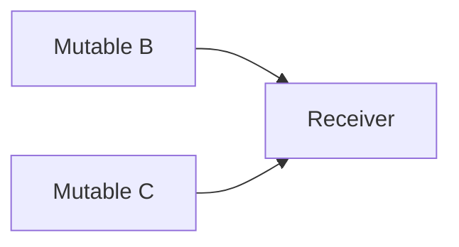

# SQL Server Foreign-Key Pruning

## Status

Target design for [DMS-1129](https://edfi.atlassian.net/browse/DMS-1129). Implementation is tracked by
[DMS-1258](https://edfi.atlassian.net/browse/DMS-1258).

This design replaces the current SQL Server rule that reduces mutable document-reference foreign keys to `DocumentId`
and maintains public identity values with `MssqlIdentityPropagationTrigger`. The replacement is intentionally narrow:
use native full-composite foreign keys where SQL Server permits them, and prune only the incoming edge of an actual
multiple-cascade-path convergence.

## Settled Decisions

1. Pruning is SQL Server-only. PostgreSQL behavior does not change.
2. Every document-reference foreign key remains full composite: its ordered local public-identity storage columns and
   local reference `DocumentId` are paired with the corresponding ordered target `*_RefKey` columns. There is no
   `DocumentId`-only shape or identity-value propagation-trigger fallback.
3. DMS, not MetaEd, makes the SQL Server physical pruning decision after reference binding and key unification.
4. Detection is ODS-style and per directly mutable origin. Two independent parents of one receiver are not a diamond.
5. At a convergence, DMS considers the conflicting incoming edges in stable order. It retains the first safe survivor;
   if a later convergence directly conflicts with the action already assigned to that physical edge, it retries that
   earlier survivor choice. It fails only after those directly relevant choices are exhausted.
6. A cut is safe only when the retained path updates the same canonical local FK values for the same receiver row in the
   same native cascade statement. If the cut tuple's `DocumentId` must move, the retained path must carry that same move.
7. Cycles and unsupported cuts fail derivation. DMS does not search arbitrary upstream cuts, optimize a cut set, or retain
   a weaker fallback.

## Problem

DMS stores each document reference as the target's stable `DocumentId` plus copied public identity values. Together these
columns form a composite foreign key to the target's `*_RefKey` unique constraint. When the target identity is mutable,
`ON UPDATE CASCADE` keeps the copied values current while the composite FK preserves correlation between those values and
the `DocumentId`.

PostgreSQL accepts multiple update-cascade paths. SQL Server rejects a cascade topology in which one update can reach a
table through more than one path (error 1785). The existing SQL Server workaround removes public identity columns from
mutable reference FKs and propagates them with triggers. That permits stale public values to remain paired with a valid
`DocumentId`.

Legacy ODS solves the topology problem by walking the identity graph once per mutable origin and disabling redundant
incoming cascades at a convergence. DMS uses that decision shape, with one physical safety check required by DMS's
composite reference FKs.

## Goals

- Restore full-composite referential integrity for SQL Server document references.
- Retain native update cascades wherever the physical cascade graph permits them.
- Prune only duplicate paths from the same mutable origin; preserve independent-parent cascades.
- Choose stable safe alternatives and fail deterministically when no safe alternative exists.
- Cover document-reference bindings on roots, child/collection tables, and extension tables.
- Store only final FK actions in the finalized relational model.

## Non-Goals and Scope Guardrails

This ticket deliberately does **not** implement a general propagation-analysis or graph-solving framework.

- No complete or transitive propagation vectors, lineage `DocumentId` columns, origin facts, or route-proof artifacts.
- No optional- or presence-sensitive carrier proofs. The safety test recognizes only required-binding shapes that
  directly establish its conditions; if they do not establish equality of the receiver row or availability of the
  retained carrier, that survivor is unsafe.
- No shared-writer, generalized storage-promotion, equality-flow, or arbitrary reference-retarget support.
- No generalized topology validation over unrelated foreign-key classes. The selector considers only DMS
  document-reference candidate cascades. A non-document `ON UPDATE CASCADE` is outside this ticket's selector scope.
- No arbitrary upstream cut, minimum-cut optimization, global graph transformation, or unbounded search for every
  theoretically feasible assignment.
- No PostgreSQL topology rejection or changed PostgreSQL FK action.
- No `DocumentId`-only or trigger-based identity propagation fallback.

If a schema needs one of these capabilities, derivation fails with a concise diagnostic and the capability is considered
for a separate feature backed by a real fixture.

Existing abstract-identity maintenance, referential-identity maintenance, document stamping, and Change Query triggers
retain their responsibilities. Only `MssqlIdentityPropagationTrigger` identity-value fan-out is retired.

## Terms and Direction

The selector works on a directed physical multigraph after key unification:

- A vertex is a physical table.
- A candidate edge is a document-reference FK whose complete ordered target `*_RefKey` tuple is referenced and whose
  target identity is abstract or transitively mutable.
- An edge is directed from referenced target to referencing receiver, matching `ON UPDATE CASCADE` propagation.
- A mutable origin is a directly mutable concrete resource root or an abstract identity maintenance update that can change
  a referenced identity key.
- A duplicate path exists when one mutable origin reaches a receiver through two retained candidate paths.
- A convergence is the first receiver at which those paths use distinct incoming edges.
- A survivor remains `ON UPDATE CASCADE`; competing incoming decision edges become full-composite `ON UPDATE NO ACTION`.

The graph is a multigraph: distinct physical FKs may have the same target and receiver tables. Candidate identity and
ordering use a stable `PruningEdgeKey` consisting of receiver table, ordered local columns, target table, ordered target
columns, and `OnDelete`; it excludes the selected `OnUpdate` action and rendered constraint name.

### Independent parents are legal

If no mutable origin reaches both `B` and `C`, each update has one route to `R`. Raw receiver in-degree is not a pruning
test.

### A diamond is pruned at its convergence

An update from `A` reaches `R` through `A -> R` and `A -> B -> R`. SQL Server rejects the all-cascade form. DMS retains
one safe incoming edge at `R` and changes the other to full-composite `ON UPDATE NO ACTION`.

## Provider Boundary

### PostgreSQL

PostgreSQL bypasses pruning. Abstract and transitively mutable concrete targets use full-composite `ON UPDATE CASCADE`;
immutable concrete targets use full-composite `ON UPDATE NO ACTION`. SQL Server cycle and pruning diagnostics are never
produced for a PostgreSQL model.

### SQL Server

Every document-reference FK is full composite. Its final action is either:

| Classification | Action |
|---|---|
| Mutable candidate retained by the selector | `ON UPDATE CASCADE` |
| Safe convergence cut | `ON UPDATE NO ACTION` |
| Immutable target | `ON UPDATE NO ACTION` |

The final `TableConstraint.ForeignKey.OnUpdate` is authoritative; no classifier or proof metadata is serialized.

## Derivation Boundary and Pass Ordering

Pruning runs after final physical storage and every document-reference FK are known, but before constraint hashing,
supporting indexes, trigger inventory, manifests, and DDL are derived:

1. Bind document references to root, child/collection, and extension tables.
2. Apply key unification and resolve canonical storage columns.
3. Derive abstract identity tables and transitive identity mutability.
4. Build all document-reference FKs in full-composite form.
5. Finish the existing FK-producing constraint passes.
6. For SQL Server, run this pruning pass and assign final `OnUpdate` actions.
7. Apply constraint dialect hashing and derive the remaining inventories and DDL.

`ReferenceConstraintPass` therefore builds the same ordered full-composite column pairs for both providers: canonical
public identity storage columns first and target `DocumentId` last. The new pass belongs immediately before
`ApplyConstraintDialectHashingPass`, because the constraint hash includes `OnUpdate`.

`DeriveTriggerInventoryPass` stops emitting `MssqlIdentityPropagationTrigger` and continues emitting unrelated
maintenance and stamping triggers.

## Selection Algorithm

### Build candidates and reject cycles

For SQL Server only, collect full-composite document-reference candidate FKs after canonical storage mapping. Preserve
logical reference provenance only for diagnostics during this pass; it is not output metadata. Collapse identical physical
constraints into one candidate, because one physical constraint has one action.

Detect self-loops and cycles in the reachable candidate components before pruning. A cycle fails as
`SqlServerCascadeCycleNotSupported`; DMS does not cut an arbitrary cycle edge. DMS does not scan unrelated FK topology
merely because it exists.

### Traverse per mutable origin

Process mutable origins, receivers, and incoming edges in stable physical order. For each origin, walk the retained
candidate graph while retaining the predecessor edge for each first arrival and a second-arrival trace when needed. Two
arrivals are enough to establish that a receiver has a convergence, but they are not enough to select its cuts: at the
earliest receiver with distinct incoming physical edges, collect every distinct incoming candidate edge that is
reachable from that origin. Those, and only those, are the choices. If two paths arrive through the same incoming edge,
their convergence is upstream and that receiver supplies no pruning choice. Incoming edges not on a duplicate path from
that origin remain cascades.

This is intentionally not global raw-in-degree pruning. Independent parents remain legal, and DMS does not reject an
unrelated cascade component just because SQL Server might have a topology concern outside DMS-1129's candidate domain.

### Select a survivor

For the convergence, evaluate survivor choices in stable `PruningEdgeKey` order. Tentatively retain one candidate
survivor, cut the other conflicting incoming candidate edges, and apply the safe-cut test below.

Commit the first safe choice unless a later convergence directly conflicts with an action already assigned to that same
physical edge and cannot be resolved. A direct conflict exists only when the later convergence requires that exact
physical FK to have the opposite action; a failure merely reachable through an earlier decision is not a direct
conflict. In that case, restore that earlier decision and try its next stable survivor. The implementation may maintain
a decision stack keyed by physical edge to identify the directly conflicting decision.

It must not turn this into a general constraint solver: it does not propose upstream edges, enumerate arbitrary graph
assignments, retry merely transitively related decisions, or retry disjoint previously settled convergences. If the
directly relevant survivor choices are exhausted, fail as `NoSafeSqlServerForeignKeyPruning`.

## Safe-Cut Test

Topology alone does not make a full-composite `NO ACTION` FK safe. A cut is safe only when the retained native cascade
updates the same values that the cut edge would have updated while SQL Server checks the constraint.

For each tentative cut, establish all of the following for every mutable origin whose retained path reaches that
physical edge, using only the existing ordered FK column pairs, canonical storage mapping, and required
document-reference bindings. This is a deliberately structural, fail-closed test, not a general route or value-flow
proof: the implementation recognizes only binding shapes that directly establish each condition below and rejects all
other shapes.

1. **Same receiver row.** The retained path and cut edge terminate at the same physical receiver row through the
   existing binding/parent correlation. Table equality alone is not enough. If this is not directly established by the
   normal physical binding shape, reject the survivor; do not derive a general row-correlation proof.
2. **Same canonical local values.** Each local canonical identity column that the cut would change is updated by the
   retained native path through the same canonical source/target column pairing in the existing ordered bindings. Equal
   current values or a merely similar logical path are not proof.
3. **Complete correlation.** The cut's complete FK remains valid. An ordinary rename need not rewrite an unchanged
   `DocumentId`; if a reference-backed retarget would require the cut's local `DocumentId` to move, the retained path
   must update that same local anchor in the same native statement. Otherwise reject the survivor.
4. **Required carrier.** The retained path must be structurally required whenever the cut reference is present. DMS does
   not reason about optional references, synthetic presence gates, or arbitrary Boolean presence implication. Any case
   requiring such proof is unsupported and rejected.
5. **Same statement.** Coverage is a retained native `ON UPDATE CASCADE` path in the statement that checks the cut FK.
   An `AFTER` trigger, later maintenance command, or application write is not a carrier.

A direct DMS write that replaces a receiver reference supplies the complete public-identity and `DocumentId` tuple and is
validated by the full-composite FK directly. It is not a carrier obligation for an incoming cut. Conversely, if a directly
mutable intermediate identity change would require a cut tuple to change without a retained carrier, that survivor is
unsafe. DMS need not model arbitrary value combinations to make this determination.

## Outputs and Diagnostics

Success changes only the finalized relational model:

- every document-reference FK has its full ordered local and target columns;
- each has its final `OnUpdate` action; and
- no `MssqlIdentityPropagationTrigger` is emitted for identity-value propagation.

Failures are stable and concise:

- `SqlServerCascadeCycleNotSupported`: report a stable cycle witness within the candidate component.
- `NoSafeSqlServerForeignKeyPruning`: report the mutable origin, convergence receiver, conflicting constraints,
  survivor choices in stable order, and the first failed simple safety condition (row, canonical columns, `DocumentId`,
  required carrier, statement boundary, or interacting convergence).

The diagnostic describes an unsupported schema; it is not a route-proof artifact.

## DDL and Runtime Consequences

- DDL renders final relational-model actions and does not repeat pruning logic.
- Supporting indexes derive from final full-composite FK columns.
- Native cascades update root, child/collection, and extension binding tables through their physical FKs.
- Existing stamping and identity-maintenance behavior remains unchanged apart from retiring the SQL Server identity-value
  propagation trigger.
- Reference reads and writes gain no lineage-anchor reads, propagation vectors, or pruning metadata.
- Fresh provisioning and the DMS relational mapping version/fingerprint are required because SQL Server FK shapes,
  actions, indexes, and trigger inventory change.

## Verification

Unit coverage must include:

1. a chain with no convergence;
2. independent parents into one receiver;
3. a covered direct-versus-indirect diamond;
4. a convergence with three or more distinct incoming candidate edges from one origin;
5. first stable survivor unsafe and second survivor safe;
6. an interacting overlapping-diamond case that retries an earlier shared choice;
7. a no-safe-survivor case;
8. a self-loop and multi-table cycle;
9. a canonical-column mismatch;
10. a retarget requiring an uncarried `DocumentId` change;
11. an optional/presence-sensitive carrier rejected as unsupported;
12. parallel physical FKs and declaration-order determinism; and
13. root, child/collection, and extension bindings.

SQL Server integration coverage must prove generated DDL installs without error 1785, every document-reference FK is
full composite, retained cascades perform renames, covered cuts remain valid, unsafe schemas fail before DDL, the old
identity-propagation trigger is absent, and existing stamping still observes cascaded child/extension updates.

PostgreSQL regression coverage must prove no action or FK-shape change. SQL Server-only failure fixtures continue to
derive for PostgreSQL unless an independent existing validation rejects them.

## Relationship to Legacy ODS

The retained ODS strategy is small: start at each mutable origin, walk identity-reference dependencies, detect a
convergence, and disable redundant incoming cascades deterministically. DMS adds only the physical post-key-unification
safety check, complete-FK/`DocumentId` protection, and retry of a genuinely interacting survivor choice. It does not add
a generalized propagation-vector or graph-solver subsystem.
