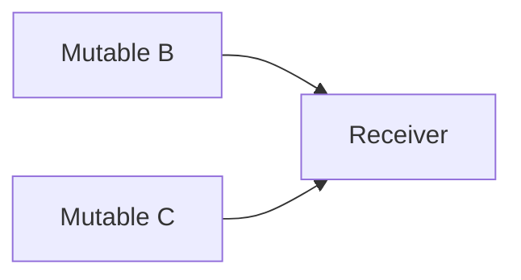
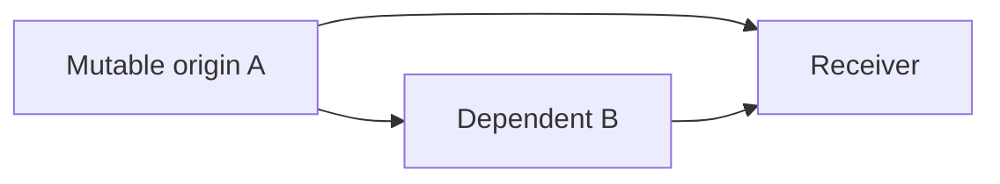

# SQL Server Foreign-Key Pruning

## Status

Target design for [DMS-1129](https://edfi.atlassian.net/browse/DMS-1129). Implementation is tracked by
[DMS-1258](https://edfi.atlassian.net/browse/DMS-1258).

This document replaces the target SQL Server rule that every mutable document-reference foreign key is reduced to
`DocumentId` and maintained by an `MssqlIdentityPropagationTrigger`. The current implementation still has that behavior;
this document describes the intended replacement.

## Settled Decisions

1. Foreign-key pruning is a SQL Server concern. PostgreSQL behavior does not change.
2. Every document-reference foreign key remains full composite: the target's public identity storage columns followed by
   the target `DocumentId`. There is no `DocumentId`-only shape or identity-value propagation-trigger fallback.
3. DMS is the sole authority for pruning. MetaEd validation or pruning metadata is not required.
4. DMS follows the legacy ODS strategy of reasoning about safe propagation per mutation origin and cutting incoming edges
   at a convergence. It additionally evaluates topology from every physical cascade source because SQL Server applies
   error 1785 structurally. Unlike ODS, DMS evaluates every incoming-edge choice and never silently chooses an unsafe cut.
5. Candidate choices are evaluated in stable order. The first complete safe assignment wins. When a later convergence
   invalidates an earlier choice, selection backtracks only across the interacting convergence choices.
6. The pruning pass fails only when the SQL Server cascade graph contains a cycle or no incoming-edge assignment can
   safely remove all duplicate paths. Other existing relational-model validation failures remain unchanged.
7. The selector does not consider arbitrary upstream cuts, optimize for a globally minimal cut set, or perform generalized
   graph rejection.

## Problem

DMS stores a document reference as both:

- the stable target `DocumentId`; and
- the target's public identity values, which support referential integrity, queries, and reconstitution.

Together those columns form a composite foreign key to the target's `*_RefKey` unique constraint. When the target permits
identity updates, `ON UPDATE CASCADE` is the natural way to keep the copied public values current.

PostgreSQL accepts multiple update-cascade paths. SQL Server rejects a foreign-key topology in which one update cascade
can reach the same table by more than one path, reporting error 1785. The existing workaround gives all mutable SQL Server
references a `DocumentId`-only `ON UPDATE NO ACTION` foreign key and propagates public identity values with triggers. That
allows the schema to be created, but the database no longer enforces that a stored `DocumentId` and the stored public
identity values identify the same target row. A concurrent identity update and reference insert can therefore preserve a
valid `DocumentId` while storing stale public values.

Legacy ODS avoids the blanket fallback. MetaEd walks the identity cascade graph once for each entity with
`allowPrimaryKeyUpdates`, keeps one incoming cascade at a convergence, and disables the other incoming cascades. DMS uses
the same bounded decision shape, adding a safety check and deterministic choice search for cases in which the first ODS
choice is not safe.

## Goals

- Restore full-composite referential integrity for SQL Server document references.
- Use native SQL Server update cascades wherever the physical cascade graph permits them.
- Break duplicate cascade paths only at their convergence points.
- Preserve valid independent-parent cascades.
- Select a safe alternative when the first stable incoming-edge choice is unsafe.
- Fail deterministically when no safe incoming-edge choice exists.
- Cover reference bindings on resource roots, child/collection tables, and extension tables.
- Keep the selected actions in the finalized relational model so DDL, indexes, manifests, and tests observe one result.

## Non-Goals

- Changing PostgreSQL foreign-key actions or rejecting PostgreSQL schemas because of a SQL Server topology restriction.
- Supporting a SQL Server cascade cycle by selecting a cycle cut.
- Searching arbitrary upstream edges when no incoming edge at a convergence is safely cuttable.
- Accepting every graph for which an unconstrained graph solver could theoretically find a cut set.
- Minimizing the total number of pruned edges or estimating cascade execution cost.
- Adding complete transitive propagation vectors or additional lineage `DocumentId` columns.
- Adding a `DocumentId`-only or trigger-based identity-value propagation fallback.
- Adding provider-independent shared-writer, storage-promotion, or generalized equality-flow validation.
- Persisting route proofs, search state, or classifier-specific metadata in runtime mappings or mapping packs.
- Supporting arbitrary SQL updates outside the DMS-authorized identity-update behavior.

Existing abstract-identity maintenance, referential-identity maintenance, document stamping, and Change Query triggers
retain their separate responsibilities. Only `MssqlIdentityPropagationTrigger` identity-value fan-out is retired.

## Terminology and Graph Direction

The selector operates on a directed physical multigraph:

- A **vertex** is a physical table.
- A **cascade edge** is a physical foreign key that would use `ON UPDATE CASCADE` before SQL Server pruning.
- An edge is directed from the **referenced target** to the **referencing receiver**, matching update propagation.
- A **topology origin** is any vertex with an outgoing cascade edge. SQL Server considers every such vertex when checking
  cascade topology at DDL creation, regardless of whether DMS authorizes a direct write to that table.
- A **mutation origin** is a physical statement root whose referenced key or dependent reference tuple may change through
  a DMS-authorized write or a required maintenance statement.
- A **duplicate path** exists when one topology origin can reach one receiver through two distinct retained cascade paths.
- A **convergence** is the first receiver at which those paths enter through distinct incoming edges.
- A **survivor** is an incoming edge retained as `ON UPDATE CASCADE` for that convergence.
- A **cut** is a conflicting incoming edge changed to full-composite `ON UPDATE NO ACTION`.

The graph is a multigraph because two distinct references can produce parallel physical foreign keys between the same
tables. Candidate identity is the action-independent `PruningEdgeKey`, not just the `(target table, receiver table)` pair.

### Independent parents are not a convergence

Two parents may independently cascade into one receiver:



If no topology origin can reach both `B` and `C`, an update beginning at `B` has one route to `R`, and an update beginning
at `C` has one route to `R`. SQL Server permits both cascades. Raw receiver in-degree is therefore not a pruning test.

### A diamond is a convergence



An update beginning at `A` can reach `R` through `A -> R` and `A -> B -> R`. SQL Server rejects the all-cascade shape.
The selector must retain one of the two incoming edges to `R` and safely cut the other.

## Provider Boundary

### PostgreSQL

PostgreSQL bypasses this selector:

- references to abstract targets and transitively mutable concrete targets use full-composite `ON UPDATE CASCADE`; and
- references to genuinely immutable concrete targets use full-composite `ON UPDATE NO ACTION`.

No SQL Server cycle, duplicate-path, or safe-cut diagnostic is produced while deriving a PostgreSQL model.

### SQL Server

Every SQL Server document-reference foreign key is full composite. Its final action is:

| Derivation-local classification | Final action | Meaning |
|---|---|---|
| Native cascade | `ON UPDATE CASCADE` | Mutable edge retained by the selector or never involved in a duplicate path. |
| Safe cut | `ON UPDATE NO ACTION` | Decision edge pruned at a convergence; every supported mutation obligation is covered by a retained native path, or no such obligation exists. |
| Immutable | `ON UPDATE NO ACTION` | Target identity cannot change, so propagation is unnecessary. |

These classifications explain derivation and diagnostics; they do not require a new serialized runtime enum. The final
`TableConstraint.ForeignKey.OnUpdate` value is authoritative.

## Derivation Boundary and Pass Ordering

Pruning must run after DMS knows the final physical storage columns and all foreign-key constraints, and before constraint
hashing, indexes, and trigger inventory are derived.
The intended pass sequence is:

1. Bind document references to physical root, child/collection, and extension tables.
2. Apply key unification so every binding column resolves to its canonical stored column.
3. Derive abstract identity tables and transitive identity mutability.
4. Build every document-reference foreign-key candidate in full-composite form.
5. Finish every other foreign-key-producing constraint pass.
6. For SQL Server, run the pruning selector and assign final `OnUpdate` actions.
7. Apply constraint dialect hashing, validate foreign-key storage, then derive supporting indexes, triggers, manifests,
   and DDL from the finalized model.

`ReferenceConstraintPass` therefore stops selecting the blanket SQL Server `DocumentId`-only shape. It builds the same
ordered full-composite column pairs used for PostgreSQL: canonical public identity storage columns first and target
`DocumentId` last. The new SQL Server pruning pass runs after the last foreign-key-producing pass and immediately before
`ApplyConstraintDialectHashingPass`. This ordering is required because the constraint hash includes `OnUpdate`.

`DeriveTriggerInventoryPass` no longer emits `MssqlIdentityPropagationTrigger`. It continues to derive all unrelated
maintenance and stamping triggers.

Any non-document-reference foreign key that is independently required to use `ON UPDATE CASCADE` participates as a fixed
edge in SQL Server topology checks. A fixed edge is never a pruning decision. If fixed edges alone make a cycle or
duplicate path that no document-reference incoming edge can cut, derivation fails.

## Topology and Mutation Origins

The ODS algorithm starts one traversal for every entity that declares `allowPrimaryKeyUpdates`. DMS preserves that
per-origin reasoning for safe propagation, but SQL Server's DDL check has a broader structural boundary.

For topology legality, every physical table with an outgoing cascade edge is a topology origin. Duplicate-path discovery
and final validation consider all topology origins, including tables that DMS never updates directly. This is necessary
because SQL Server error 1785 is based on the declared cascade graph, not the application's write permissions.

For safe-cut value propagation, mutation origins are limited to physical statement roots that DMS can cause:

- a directly mutable concrete resource root is a mutation origin;
- an abstract identity table updated by its maintenance statement is a mutation origin for cascades leaving that table;
  and
- any other required maintenance statement that changes a referenced key starts a new mutation origin.

A trigger statement is not a continuation of the statement that caused the trigger. It starts a new traversal boundary.
Consequently, a route that crosses a later trigger statement cannot cover a `NO ACTION` foreign key checked by the
earlier statement.

Transitive mutability determines which document-reference edges are candidate cascades. Before selection begins, derive
and freeze the set of mutation-origin flows that can change each candidate's local FK tuple in the all-native graph. A
tentative cut never removes one of these safety obligations merely because the origin can no longer reach the receiver in
the retained graph. Topology reachability and frozen mutation obligations are derivation-local and are not runtime mapping
metadata.

## SQL Server Selection Algorithm

### 1. Build and normalize the candidate graph

Build the physical graph from full-composite candidates after canonical storage mapping. Each edge records:

- an action-independent `PruningEdgeKey` consisting of receiver table, ordered local columns, target table, and ordered
  target columns;
- target and receiver tables;
- ordered `(target column, local column)` pairs;
- target mutability;
- receiver row-correlation keys and reference requiredness/presence atoms; and
- for document-reference decision edges, stable logical reference provenance needed for diagnostics and to determine
  which identity components a mutation origin may change. Fixed non-document edges have no such provenance.

`PruningEdgeKey` deliberately excludes `OnUpdate`, rendered or shortened constraint names, and classifier state. The
existing foreign-key `ConstraintIdentity` includes referential actions and therefore must not be reused as the selector's
edge identity or ordering key.

If multiple logical reference mappings collapse to one identical physical constraint after key unification, use one
physical decision edge with all logical sites retained as diagnostic provenance. One physical constraint receives one
action.

### 2. Reject cycles

Topologically sort the all-native SQL Server candidate graph, including fixed cascade edges. A self-loop or incomplete
sort fails as `SqlServerCascadeCycleNotSupported`.

Cycle cutting is deliberately outside the ODS-style diamond algorithm. The selector does not try converting an arbitrary
cycle edge to `NO ACTION`.

### 3. Traverse per topology origin

Process topology origins in stable physical-table order. Within one origin, walk the currently retained graph in stable
topological and edge order, counting paths to each receiver and capping each count at two.

When a receiver obtains a second path, identify the distinct incoming edges by which the conflicting paths enter the
receiver. Only those incoming edges are choices for that convergence. Other incoming edges that are not on duplicate
paths from the current topology origin remain native cascades.

This retains the significant ODS property: analysis is per origin, so independent parents are not pruned merely because
they share a receiver. Using every topology origin additionally guarantees that final DDL satisfies SQL Server's
structural error-1785 rule even when a fixed cascade component is not rooted at a DMS-authorized mutation origin.

### 4. Evaluate incoming-edge choices

Evaluate possible survivors in stable `PruningEdgeKey` order. For one survivor choice, the other conflicting incoming
edges become tentative cuts.

Fixed incoming edges have forced behavior:

- if exactly one conflicting incoming edge is fixed, it is the forced survivor and every competing decision edge is a
  tentative cut;
- if two or more conflicting incoming edges are fixed, the convergence has no solution; and
- if no conflicting incoming edge is fixed, evaluate each decision edge as survivor in stable order.

A tentative choice is admissible only when:

- every new cut passes the safe-cut predicate below;
- no physical edge is assigned both cascade and no-action by different origin traversals;
- fixed cascade edges remain retained; and
- the partial choice does not already leave an unavoidable duplicate path.

Do not reject a convergence merely because the first incoming edge is unsafe. Continue through every incoming-edge
choice.

### 5. Continue and backtrack across interacting convergences

After making a tentative choice, continue traversal. A later convergence may share a physical edge with an earlier one or
may depend on an earlier survivor as its only safe carrier. If the later convergence has no admissible choice, restore the
earlier state and try the next earlier survivor.

This is limited deterministic backtracking over convergence choices, not generalized graph search:

- decision positions are only incoming edges at observed convergences;
- an arbitrary upstream edge is never proposed as an alternative cut;
- fixed cascade edges are never decisions; and
- there is no cost function or minimum-cut optimization.

### 6. Accept the first complete safe assignment

An assignment is complete when every topology origin has at most one retained path to every receiver and every cut passes
the safe-cut predicate against the final retained graph. Accept the first complete assignment in stable search order.

Fail as `NoSafeSqlServerForeignKeyPruning` only after every incoming-edge choice reachable through this search has been
exhausted.

Conceptually:

```text
search(current actions):
    find the first stable (origin, receiver) with two retained paths
    if none:
        return success if every cut is safe in the final graph
        return failure otherwise

    determine forced-fixed or stable decision survivor choices
    if two or more conflicting incoming edges are fixed:
        return failure

    for each allowed incoming survivor choice in stable order:
        cut the other conflicting incoming decision edges
        require the choice to remove at least one retained decision edge
        if the tentative cuts can be safe and actions remain consistent:
            if search(updated actions) succeeds:
                return success

    return failure
```

## Safe-Cut Predicate

Topology alone does not make a full-composite `NO ACTION` edge safe. SQL Server checks that constraint within the
initiating statement, before a later propagation trigger could repair the receiver. A cut is safe only when a retained
native cascade route performs the update that the cut edge would have performed.

For a tentative cut from target `S` to receiver `R`, evaluate every mutation origin whose authorized change can alter
any local column in the cut FK tuple. This includes a target-key update, a directly replaceable identity reference, or
another native cascade that rewrites one of the local columns. Derive this obligation inventory from the original
all-native graph before selection; do not recompute it from a graph in which tentative cuts have hidden a route. For each
obligated mutation origin, the final retained graph must supply a native route that proves all of the following.

If the frozen inventory contains no mutation origin capable of changing the cut tuple, the value-flow obligation is
vacuously satisfied. A direct SQL update outside DMS that would make the `NO ACTION` edge block is outside the supported
write contract.

For example, with `A -> B -> R` and `A -> R`, cutting `A -> R` must account for a directly authorized update of `B`
that retargets its identity reference from `A1` to `A2`. That write does not change an `A` target key, but it can
change the local `A` reference tuple on `R`, including `A_DocumentId`, through `B -> R`.

### Same receiver row

The cut route and retained route terminate at the same physical row in `R`. Merely reaching the same table is insufficient.
The selector may prove this only by composing existing ordered FK column pairs, stable target/receiver keys, and structural
reference-presence atoms. The composed routes must produce the same receiver correlation key. Current data values, naming
conventions, data-dependent joins, and arbitrary relational inference are not proof. If this finite structural composition
does not establish row equality, the choice is unsafe.

### Same canonical columns and values

After key unification, every receiver storage column that the cut route would change is also changed by the retained route.
Composing the ordered FK column pairs from the origin to `R` must map the same origin key position to the same canonical
receiver column.

Equal current values are not proof. For example, if one route maps root key position `P` to receiver column `X` and another
maps root key position `Q` to `X`, the cut is unsafe even when `P` and `Q` happen to contain equal data.

### Complete FK correlation

The full cut foreign key must remain valid, including its local target `DocumentId`.

An ordinary identity rename changes public identity values while the target row's `DocumentId` remains stable, so a
retained route need not rewrite that unchanged anchor. A reference-backed identity retarget may change which target row a
unified receiver reference identifies. If that requires the cut edge's local `DocumentId` to change, the retained route
must update the same local anchor to the same value in the same statement. Otherwise that survivor choice is unsafe.

This design adds no transitive lineage anchors or complete propagation vectors. If every incoming-edge choice would require
an uncarried `DocumentId` change, derivation fails.

### Presence implication

Whenever the cut reference is present on a receiver row, the retained route that covers it must also be present. Required
identity-component references normally satisfy this structurally. An optional survivor cannot cover a required or
independently present cut edge unless existing mapping metadata proves the implication.

The selector does not infer arbitrary Boolean presence relationships. If structural requiredness and the existing
reference presence columns do not prove coverage, the choice is unsafe.

### Same native statement

Every edge used for coverage is a retained native `ON UPDATE CASCADE` edge executed within the statement whose `NO ACTION`
constraint is being checked. An `AFTER` trigger, later maintenance command, or application write is not a carrier.

### Safe for every mutation origin

A physical FK has one action for the entire database. A cut selected while traversing origin `A` must also be safe when an
intermediate resource is itself a directly mutable origin. This prevents the legacy ODS failure in which a branch that was
redundant for an upstream rename was still the only correct propagation route for an independently authorized downstream
identity change.

The implementation does not enumerate arbitrary values or mutation powersets. It conservatively treats every directly
writable public identity component and every directly replaceable identity reference as mutable, then composes the finite
ordered column mappings already present in the relational model.

## Determinism and Complexity

All ordering uses action-independent final structural identifiers with ordinal comparison:

1. topology origin table;
2. receiver table;
3. `PruningEdgeKey`; and
4. ordered column pairs as a final tie-breaker.

Reversing ApiSchema declaration order must not change selected actions or diagnostics.

The search can revisit an earlier convergence only when later choices interact with it. No fixed work budget, memoization
protocol, serialized solver state, or route inventory is part of this design. If supported-schema measurements later show
that the focused search is too expensive, preserve the failing schema as evidence and add the smallest measured bound or
optimization in a separate change.

## Outputs and Diagnostics

Successful derivation changes only the finalized relational model:

- every reference FK has its full ordered local and target columns;
- every reference FK has its final `OnUpdate` action; and
- no `MssqlIdentityPropagationTrigger` is present for identity-value propagation.

Runtime write and read mappings need no classifier state. A diagnostic/manifest view may report the final action and
derivation-local reason, but route proofs and backtracking state are not artifact contracts.

Failures are stable and concise:

### `SqlServerCascadeCycleNotSupported`

Report one stable cycle witness containing the participating tables and physical constraints.

### `NoSafeSqlServerForeignKeyPruning`

Report:

- topology origin and each affected mutation origin;
- convergence receiver;
- conflicting incoming constraints;
- survivor choices considered in stable order; and
- for each rejected choice, either the first failed safe-cut clause or the stable downstream convergence/fixed-edge
  conflict that made the partial assignment infeasible. Safe-cut failures include mismatched canonical mapping, changing
  uncarried `DocumentId`, missing presence implication, different receiver-row correlation, or later-statement
  propagation.

The diagnostic explains the unsupported schema. It is not a generalized proof artifact.

## DDL and Runtime Consequences

- The DDL emitter renders the final relational-model actions; it does not repeat pruning decisions.
- Supporting indexes derive from the final full-composite FK columns.
- Native cascades update root, child/collection, and extension binding tables through their actual physical FKs.
- Existing stamping triggers observe those row updates and preserve content/change tracking behavior.
- Existing referential-identity and abstract-identity maintenance remains row-local and transactional.
- Reference resolution, flattening, and reconstitution do not gain new anchor reads or mapping metadata.
- Databases must be freshly provisioned from the new relational mapping. The implementation must update the DMS-owned
  relational mapping version/fingerprint because SQL Server FK columns, actions, indexes, and trigger inventory change.

## Verification

### Unit fixtures

The selector requires deterministic fixtures for:

1. a chain with no convergence: retain every mutable edge;
2. independent parents into one receiver: retain both edges;
3. a direct-versus-indirect covered diamond: select one safe incoming cut;
4. a sibling diamond: select one safe incoming cut;
5. first stable survivor unsafe, second survivor safe: select the second;
6. overlapping convergences where a later failure requires backtracking to an earlier survivor;
7. overlapping convergences with no complete safe assignment: fail only after exhausting choices;
8. one conflicting fixed edge forcing the survivor and two conflicting fixed edges producing no solution;
9. duplicate reachability rooted at a topology origin that is not a DMS mutation origin;
10. parallel physical FKs;
11. a self-loop and a multi-table cascade cycle;
12. a canonical-column position mismatch despite equal-looking logical values;
13. a reference-backed retarget that would require an uncarried local `DocumentId` change;
14. a tentative cut not erasing a mutation obligation derived from the all-native graph;
15. required cut with optional survivor and no presence implication;
16. the same physical FK reached from multiple mutation origins;
17. action changes not affecting `PruningEdgeKey`, selection order, or diagnostics;
18. reversed schema/declaration order producing identical actions and diagnostics; and
19. root, child/collection, and extension receiver tables.

### SQL Server integration fixtures

Provider tests must prove:

- generated DDL installs without error 1785;
- every document-reference FK is full composite;
- a retained cascade propagates an identity rename;
- a covered `NO ACTION` edge remains valid because the retained cascade updates its canonical receiver columns;
- an unsafe graph fails before DDL;
- no identity-value propagation trigger is emitted;
- an insert racing a referenced identity rename cannot commit stale public values paired with a valid `DocumentId`;
- cascaded child/extension updates fire the existing stamping behavior; and
- representative Data Standard and extension schemas produce deterministic actions.

### PostgreSQL regression fixtures

PostgreSQL relational-model and generated-DDL tests must show no action or FK-shape changes. SQL Server-only failure
fixtures must continue to derive for PostgreSQL unless an independent existing model validation rejects them.

## Relationship to Legacy ODS

The legacy MetaEd enhancer provides the core strategy retained here:

- start from each directly mutable identity origin;
- walk identity-reference dependencies;
- detect convergence through incoming edges; and
- deterministically disable redundant incoming cascades.

DMS differs in four deliberate ways:

1. pruning is SQL Server-only;
2. physical candidates are evaluated after DMS key unification;
3. DMS tries every incoming survivor choice, with limited backtracking across interacting convergences; and
4. DMS fails rather than emitting an unsafe full-composite `NO ACTION` edge.

Those differences address the known ODS case where an alphabetically selected edge is redundant for one mutable origin
but required for another. They do not turn pruning into a generalized graph solver.
