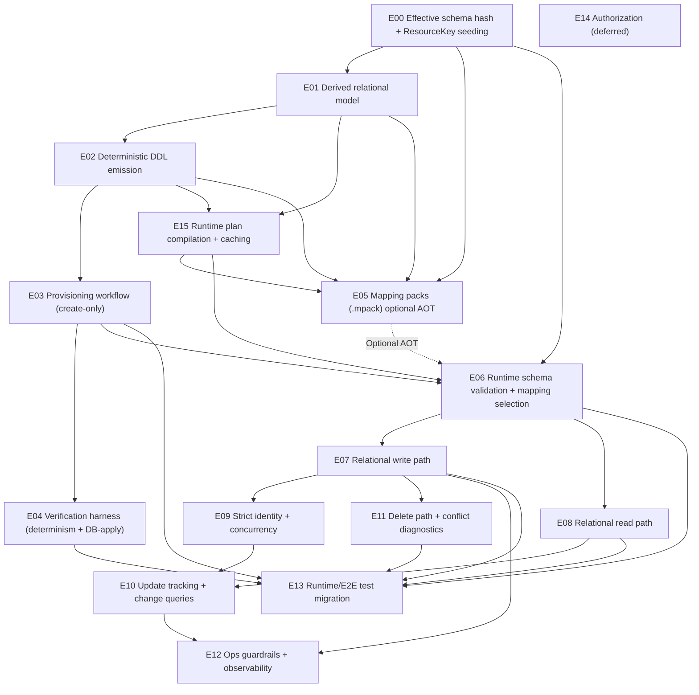

# Backend Redesign — Epic & Story Dependency Analysis

Status: Draft (planning aid derived from `reference/design/backend-redesign/epics/*`).

Scope:
- Includes all epics/stories under `reference/design/backend-redesign/epics/` (currently 16 epics, 86 stories).
- Captures *implementation* dependencies implied by acceptance criteria and shared design contracts.
- Does not attempt to define ownership, sequencing within sprints, or exact delivery dates.

## Legend

Dependency types used below:
- **Hard**: required to satisfy the story’s acceptance criteria or to run its primary tests.
- **Soft**: not strictly required, but strongly recommended to avoid rework or to make the story testable/operationally complete.
- **Optional path**: applies only when mapping packs (`.mpack`) are enabled.

ID conventions:
- Epic: `E{NN}` maps to `{NN}-*/EPIC.md`
- Story: `E{NN}-S{MM}` maps to `{NN}-*/{MM}-*.md`

---

## Epic Dependency Graph (Mermaid)

Notes:
- `E07` and `E09` are tightly coupled in practice (write correctness requires transactional identity maintenance + propagation + deadlock retry), but are shown as a one-way dependency to keep the graph readable.
- `E05` is optional; `E06` can select runtime-compiled mapping sets without packs.

---

## Epic Dependency Summary

| Epic | Title | Hard Depends On | Primary Outputs / What It Unblocks |
| --- | --- | --- | --- |
| E00 | [Effective Schema Fingerprinting & `dms.ResourceKey` Seeding](00-effective-schema-hash/EPIC.md) | — | Hashing + seed contract used by DDL/provisioning, packs, and runtime selection |
| E01 | [Derived Relational Model (v1)](01-relational-model/EPIC.md) | E00 | Fully derived model inventory used by DDL emission and plan compilation |
| E02 | [Deterministic DDL Emission](02-ddl-emission/EPIC.md) | E01 | Engine-specific DDL (pgsql/mssql) + deterministic ordering/canonicalization |
| E03 | [Provisioning Workflow (Create-Only)](03-provisioning-workflow/EPIC.md) | E02 | CLI + provisioning guardrails; enables DB-apply and runtime validation |
| E04 | [Verification Harness](04-verification-harness/EPIC.md) | E00–E03 | Fixture runner + determinism/snapshot/golden/DB-apply tests |
| E05 | [Mapping Pack Generation and Consumption (Optional)](05-mpack-generation/EPIC.md) | E00–E02, E15 | `.mpack` build/validate/load; enables AOT mapping distribution |
| E06 | [Runtime Schema Validation & Mapping Set Selection](06-runtime-mapping-selection/EPIC.md) | E00, E03, E15 (and E05 optional) | Per-DB fingerprint validation + mapping selection + caching; removes hot reload |
| E07 | [Relational Write Path (POST/PUT)](07-relational-write-path/EPIC.md) | E06, E01, E02 | End-to-end relational writes; populates propagated reference identity columns and relies on DB triggers for stamps/identity maintenance |
| E08 | [Relational Read Path (GET + Query)](08-relational-read-path/EPIC.md) | E06, E01, E02 | End-to-end relational reads and reconstitution (incl. abstract+descriptor projection) |
| E09 | [Strict Identity Maintenance & Concurrency](09-identity-concurrency/EPIC.md) | E07, E02 | Transactional referential-identity correctness + cascade/trigger propagation semantics + deadlock retry |
| E10 | [Update Tracking + Change Queries](10-update-tracking-change-queries/EPIC.md) | E07, E08, E02 | Stored `_etag/_lastModifiedDate/ChangeVersion`, journaling triggers, change selection |
| E11 | [Delete Path & Conflict Diagnostics](11-delete-path/EPIC.md) | E07, E02 | Delete-by-id + FK conflict mapping + diagnostics |
| E12 | [Operational Guardrails](12-ops-guardrails/EPIC.md) | E07, E09 (and E10 recommended) | Drift prevention/repair + observability + identity-update fan-out guardrails + benchmarks |
| E13 | [Test Strategy & Migration](13-test-migration/EPIC.md) | E03, E06–E08, E11 | E2E/integration/parity tests and docs aligned to provisioning model |
| E14 | [Authorization Design Spike (Relational Primary Store)](14-authorization/EPIC.md) | — | Implementation-ready authorization design (implementation deferred); does not block baseline redesign |
| E15 | [Runtime Plan Compilation + Caching (Shared)](15-plan-compilation/EPIC.md) | E01, E02 | Dialect-specific compiled plans + runtime cache used by runtime mapping selection and optional pack builders |

---

## Story Dependencies (by Epic)

### E00 — Effective Schema Fingerprinting & `dms.ResourceKey` Seeding

Epic: `00-effective-schema-hash/EPIC.md`

| Story | Title | Hard Depends On | Soft Depends On | Produces / Touches |
| --- | --- | --- | --- | --- |
| E00-S00 | [`00-schema-loader.md`](00-effective-schema-hash/00-schema-loader.md) | — | — | Effective schema loader (explicit inputs, OpenAPI stripping, fail-fast validation) |
| E00-S01 | [`01-canonical-json.md`](00-effective-schema-hash/01-canonical-json.md) | — | — | Canonical JSON serializer (stable UTF-8 bytes) |
| E00-S02 | [`02-effective-schema-hash.md`](00-effective-schema-hash/02-effective-schema-hash.md) | E00-S00, E00-S01 | — | `EffectiveSchemaHash` calculator + `RelationalMappingVersion` participation |
| E00-S03 | [`03-resourcekey-seed.md`](00-effective-schema-hash/03-resourcekey-seed.md) | E00-S00 | E00-S02 | Deterministic `dms.ResourceKey` seed list + `resource_key_seed_hash` |
| E00-S04 | [`04-effective-schema-manifest.md`](00-effective-schema-hash/04-effective-schema-manifest.md) | E00-S02, E00-S03 | — | `effective-schema.manifest.json` emitter (deterministic) |
| E00-S05 | [`05-startup-schema-and-mapping-init.md`](00-effective-schema-hash/05-startup-schema-and-mapping-init.md) | — | E00-S00, E00-S02, E00-S03, E06-S02 | Startup-time schema + mapping initialization; DB fingerprint + seed validation before serving traffic |

### E01 — Derived Relational Model (v1)

Epic: `01-relational-model/EPIC.md`

| Story | Title | Hard Depends On | Soft Depends On | Produces / Touches |
| --- | --- | --- | --- | --- |
| E01-S00 | [`00-base-schema-traversal.md`](01-relational-model/00-base-schema-traversal.md) | E00-S00 | — | Logical table/column scopes from JSON schema (arrays→tables, object inlining, scalar columns) |
| E01-S01 | [`01-reference-and-constraints.md`](01-relational-model/01-reference-and-constraints.md) | E01-S00 | — | FK bindings (`..._DocumentId`/`..._DescriptorId`) + identity/uniqueness constraints |
| E01-S02 | [`02-naming-and-overrides.md`](01-relational-model/02-naming-and-overrides.md) | E01-S00 | E01-S01 | Deterministic naming + `relational.nameOverrides` parsing + collision/length rules |
| E01-S03 | [`03-ext-mapping.md`](01-relational-model/03-ext-mapping.md) | E01-S00, E01-S02 | E01-S01 | `_ext` model derivation (extension schemas/tables aligned to base keys) |
| E01-S04 | [`04-abstract-union-views.md`](01-relational-model/04-abstract-union-views.md) | E01-S01, E01-S02 | — | Abstract union view model (identity select-list + ordering + casts) |
| E01-S05 | [`05-relational-model-manifest.md`](01-relational-model/05-relational-model-manifest.md) | E01-S00–E01-S04, E01-S07 | — | `relational-model.manifest.json` emitter (stable ordering) |
| E01-S06 | [`06-descriptor-resource-mapping.md`](01-relational-model/06-descriptor-resource-mapping.md) | E01-S00 | E01-S01 | Descriptor resource mapping to `dms.Descriptor` (no per-descriptor tables) |
| E01-S07 | [`07-index-and-trigger-inventory.md`](01-relational-model/07-index-and-trigger-inventory.md) | E01-S00–E01-S04, E01-S06 | — | Derived index + trigger inventories (DDL intent; shared by manifest + DDL) |

### E02 — Deterministic DDL Emission (PostgreSQL + SQL Server)

Epic: `02-ddl-emission/EPIC.md`

| Story | Title | Hard Depends On | Soft Depends On | Produces / Touches |
| --- | --- | --- | --- | --- |
| E02-S00 | [`00-dialect-abstraction.md`](02-ddl-emission/00-dialect-abstraction.md) | — | — | Dialect abstraction (quoting, type mapping, idempotent patterns, formatter) |
| E02-S01 | [`01-core-dms-ddl.md`](02-ddl-emission/01-core-dms-ddl.md) | E02-S00 | E00-S02 | Core `dms.*` objects (tables, triggers, sequences, indexes) |
| E02-S02 | [`02-project-and-resource-ddl.md`](02-ddl-emission/02-project-and-resource-ddl.md) | E02-S00, E01-S05 | — | Project schemas + resource/extension tables + abstract views |
| E02-S03 | [`03-seed-and-fingerprint-ddl.md`](02-ddl-emission/03-seed-and-fingerprint-ddl.md) | E02-S00, E02-S01, E00-S02, E00-S03 | — | Seed/recording DML (`ResourceKey`, `EffectiveSchema`, `SchemaComponent`) |
| E02-S04 | [`04-sql-canonicalization.md`](02-ddl-emission/04-sql-canonicalization.md) | E02-S00 | E02-S01–E02-S03 | Canonical SQL formatting + deterministic statement ordering tests |
| E02-S05 | [`05-descriptor-ddl.md`](02-ddl-emission/05-descriptor-ddl.md) | E02-S01 | E01-S06 | ODS-parity `dms.Descriptor` DDL (descriptor resources stored in `dms`) |
| E02-S06 | [`06-uuidv5-function.md`](02-ddl-emission/06-uuidv5-function.md) | E02-S01 | — | Engine UUIDv5 helper function for deterministic `ReferentialId` recomputation |

### E03 — Provisioning Workflow (Create-Only)

Epic: `03-provisioning-workflow/EPIC.md`

| Story | Title | Hard Depends On | Soft Depends On | Produces / Touches |
| --- | --- | --- | --- | --- |
| E03-S00 | [`00-ddl-emit-command.md`](03-provisioning-workflow/00-ddl-emit-command.md) | E00-S04, E01-S05, E02-S01–E02-S04, E02-S06 | — | CLI outputs: `{dialect}.sql` + manifests (no DB required) |
| E03-S01 | [`01-ddl-provision-command.md`](03-provisioning-workflow/01-ddl-provision-command.md) | E03-S00 | — | CLI provisions empty DB (create-only) using generated DDL |
| E03-S02 | [`02-preflight-and-idempotency.md`](03-provisioning-workflow/02-preflight-and-idempotency.md) | E03-S01 | — | Preflight mismatch, rerun safety, seed validation diagnostics |
| E03-S03 | [`03-ddl-manifest.md`](03-provisioning-workflow/03-ddl-manifest.md) | E03-S00 | — | `ddl.manifest.json` emission (hashes/counts for DDL) |
| E03-S04 | [`04-remove-legacy-schemagenerator.md`](03-provisioning-workflow/04-remove-legacy-schemagenerator.md) | E03-S00, E03-S01 | E04-S00 | Remove legacy SchemaGenerator + migrate docs/scripts/CI references |
| E03-S05 | [`05-seed-descriptors.md`](03-provisioning-workflow/05-seed-descriptors.md) | E03-S01, E02-S05 | E07-S06 | Optional: provisioning-time descriptor seeding (`--seed-descriptors`) |

### E04 — Verification Harness (Determinism + DB-Apply)

Epic: `04-verification-harness/EPIC.md`

| Story | Title | Hard Depends On | Soft Depends On | Produces / Touches |
| --- | --- | --- | --- | --- |
| E04-S00 | [`00-fixture-runner.md`](04-verification-harness/00-fixture-runner.md) | E03-S00 | — | Fixture runner (`expected/` vs `actual/`) + `.gitignore` for `actual/` |
| E04-S01 | [`01-contract-tests.md`](04-verification-harness/01-contract-tests.md) | E00-S04, E01-S05, E02-S00 | — | Determinism + negative-path unit/contract tests |
| E04-S02 | [`02-snapshot-tests.md`](04-verification-harness/02-snapshot-tests.md) | E04-S00 | E04-S01 | Snapshot tests for small fixtures (DDL + manifests) |
| E04-S03 | [`03-authoritative-goldens.md`](04-verification-harness/03-authoritative-goldens.md) | E04-S00 | — | Authoritative golden directory diffs + bless mode |
| E04-S04 | [`04-db-apply-smoke.md`](04-verification-harness/04-db-apply-smoke.md) | E03-S01, E03-S02 | — | DB-apply smoke (docker compose) + post-provision introspection manifest |
| E04-S05 | [`05-runtime-compatibility-gate.md`](04-verification-harness/05-runtime-compatibility-gate.md) | E04-S04 | E06-S01, E06-S02 | Gate tests: mapping set seed summary ↔ DB fingerprint validation |

### E05 — Mapping Pack (`.mpack`) Generation and Consumption (Optional AOT Mode)

Epic: `05-mpack-generation/EPIC.md`

| Story | Title | Hard Depends On | Soft Depends On | Produces / Touches |
| --- | --- | --- | --- | --- |
| E05-S00 | [`00-protobuf-contracts.md`](05-mpack-generation/00-protobuf-contracts.md) | — | — | Contracts project/package for PackFormatVersion=1 |
| E05-S01 | [`01-pack-payload-shape.md`](05-mpack-generation/01-pack-payload-shape.md) | E05-S00, E00-S03, E01-S05 | — | Payload builder + ordering invariants + validation |
| E05-S03 | [`03-pack-build-cli.md`](05-mpack-generation/03-pack-build-cli.md) | E05-S01, E15-S00, E00-S02 | — | CLI: `pack build` produces `.mpack` keyed by `EffectiveSchemaHash` |
| E05-S04 | [`04-pack-manifests.md`](05-mpack-generation/04-pack-manifests.md) | E05-S01, E15-S00 | — | Deterministic `pack.manifest.json` + `mappingset.manifest.json` |
| E05-S05 | [`05-pack-loader-validation.md`](05-mpack-generation/05-pack-loader-validation.md) | E05-S03, E05-S04 | E06-S01 | Pack selection + decode/validate + DB seed gate |
| E05-S06 | [`06-pack-equivalence-tests.md`](05-mpack-generation/06-pack-equivalence-tests.md) | E05-S05 | — | Equivalence: runtime compile vs pack decode mapping-set semantics |
| E05-S07 | [`07-pack-manifest-command.md`](05-mpack-generation/07-pack-manifest-command.md) | E05-S05 | E05-S04 | CLI: validate/decode pack and emit manifests (no rebuild) |

### E06 — Runtime Schema Validation & Mapping Set Selection

Epic: `06-runtime-mapping-selection/EPIC.md`

| Story | Title | Hard Depends On | Soft Depends On | Produces / Touches |
| --- | --- | --- | --- | --- |
| E06-S00 | [`00-read-effective-schema.md`](06-runtime-mapping-selection/00-read-effective-schema.md) | E02-S01, E03-S01 | — | Runtime DB fingerprint reader + per-connection-string cache |
| E06-S01 | [`01-resourcekey-validation.md`](06-runtime-mapping-selection/01-resourcekey-validation.md) | E06-S00, E00-S03 | — | Fast-path seed gate via `dms.EffectiveSchema`; slow-path `dms.ResourceKey` diff |
| E06-S02 | [`02-mapping-set-selection.md`](06-runtime-mapping-selection/02-mapping-set-selection.md) | E06-S00, E06-S01, E15-S00 | E05-S05 | Mapping set selection/caching (pack-backed optional; runtime compile fallback) |
| E06-S03 | [`03-config-and-failure-modes.md`](06-runtime-mapping-selection/03-config-and-failure-modes.md) | E06-S02 | — | Config surface + error contracts + multi-DB-safe failure behavior |
| E06-S04 | [`04-remove-hot-reload.md`](06-runtime-mapping-selection/04-remove-hot-reload.md) | E06-S00–E06-S03 | — | Remove schema reload/hot-reload hooks; align tests/workflow to provisioning model |

### E07 — Relational Write Path (POST/PUT)

Epic: `07-relational-write-path/EPIC.md`

| Story | Title | Hard Depends On | Soft Depends On | Produces / Touches |
| --- | --- | --- | --- | --- |
| E07-S00 | [`00-core-extraction-location.md`](07-relational-write-path/00-core-extraction-location.md) | — | — | Core emits concrete JSON locations for each extracted document reference |
| E07-S01 | [`01-reference-and-descriptor-resolution.md`](07-relational-write-path/01-reference-and-descriptor-resolution.md) | E07-S00, E02-S01 | E09-S01 | Bulk `ReferentialId→DocumentId` resolver + descriptor discriminator validation |
| E07-S02 | [`02-flattening-executor.md`](07-relational-write-path/02-flattening-executor.md) | E06-S02, E07-S01 | E01-S05, E01-S03 | JSON→row buffers (root/children/_ext) using compiled mapping |
| E07-S03 | [`03-persist-and-batch.md`](07-relational-write-path/03-persist-and-batch.md) | E07-S02 | E10-S00 | Transactional persist executor (replace semantics, batching, limits) |
| E07-S04 | [`04-propagated-reference-identity-columns.md`](07-relational-write-path/04-propagated-reference-identity-columns.md) | E07-S03 | E01-S01 | Populate propagated reference identity columns for FK cascades |
| E07-S05 | [`05-write-error-mapping.md`](07-relational-write-path/05-write-error-mapping.md) | E07-S03 | E01-S02 | DB constraint error mapping (pgsql/mssql parity) |
| E07-S06 | [`06-descriptor-writes.md`](07-relational-write-path/06-descriptor-writes.md) | E06-S02, E02-S05 | E01-S06 | Descriptor POST/PUT writes to `dms.Descriptor` + descriptor referential identities |

### E08 — Relational Read Path (GET + Query)

Epic: `08-relational-read-path/EPIC.md`

| Story | Title | Hard Depends On | Soft Depends On | Produces / Touches |
| --- | --- | --- | --- | --- |
| E08-S00 | [`00-hydrate-multiresult.md`](08-relational-read-path/00-hydrate-multiresult.md) | E06-S02 | E15-S00 | Multi-result hydration queries for root/child/_ext tables |
| E08-S01 | [`01-json-reconstitution.md`](08-relational-read-path/01-json-reconstitution.md) | E08-S00 | — | JSON writer/reconstituter (ordering, null handling, `_ext` overlay) |
| E08-S02 | [`02-reference-identity-projection.md`](08-relational-read-path/02-reference-identity-projection.md) | E08-S00, E02-S02 | E01-S04 | Reference identity projection (incl. abstract targets via `{Abstract}_View`) |
| E08-S03 | [`03-descriptor-projection.md`](08-relational-read-path/03-descriptor-projection.md) | E08-S00, E02-S01 | — | Descriptor URI projection from `dms.Descriptor` |
| E08-S04 | [`04-query-execution.md`](08-relational-read-path/04-query-execution.md) | E06-S02 | E15-S00 | Root-table-only query execution + deterministic paging |
| E08-S05 | [`05-descriptor-endpoints.md`](08-relational-read-path/05-descriptor-endpoints.md) | E06-S02, E01-S06 | E02-S05 | Descriptor GET/query endpoints served from `dms.Descriptor` |

### E09 — Strict Identity Maintenance & Concurrency

Epic: `09-identity-concurrency/EPIC.md`

| Story | Title | Hard Depends On | Soft Depends On | Produces / Touches |
| --- | --- | --- | --- | --- |
| E09-S00 | [`00-locking-and-retry.md`](09-identity-concurrency/00-locking-and-retry.md) | E02-S01 | — | Deadlock retry policy for cascade/trigger writes |
| E09-S01 | [`01-referentialidentity-maintenance.md`](09-identity-concurrency/01-referentialidentity-maintenance.md) | E09-S00, E02-S06 | — | Transactional writes to `dms.ReferentialIdentity` (primary + alias rows) |
| E09-S02 | [`02-identity-change-detection.md`](09-identity-concurrency/02-identity-change-detection.md) | E07-S02 | — | Detect “identity projection changed” from write inputs/outputs |
| E09-S03 | [`03-identity-propagation.md`](09-identity-concurrency/03-identity-propagation.md) | E09-S00, E09-S01, E07-S04 | E12-S03 | Identity propagation via cascades/triggers (no closure traversal) |
| E09-S04 | [`04-cache-invalidation.md`](09-identity-concurrency/04-cache-invalidation.md) | E06-S02, E09-S01 | — | Post-commit cache invalidation for identity resolution |

### E10 — Update Tracking (`_etag/_lastModifiedDate`) + Change Queries (`ChangeVersion`)

Epic: `10-update-tracking-change-queries/EPIC.md`

| Story | Title | Hard Depends On | Soft Depends On | Produces / Touches |
| --- | --- | --- | --- | --- |
| E10-S00 | [`00-token-stamping.md`](10-update-tracking-change-queries/00-token-stamping.md) | E02-S01, E07-S03 | — | Stamping triggers for `dms.Document` (Content/Identity stamps) |
| E10-S01 | [`01-journaling-contract.md`](10-update-tracking-change-queries/01-journaling-contract.md) | E02-S01, E03-S01 | E10-S00 | Triggers own journal writes; integration smoke tests |
| E10-S02 | [`02-derived-metadata.md`](10-update-tracking-change-queries/02-derived-metadata.md) | E10-S00, E08-S01 | — | Serve `_etag/_lastModifiedDate/ChangeVersion` from stored stamps |
| E10-S03 | [`03-if-match.md`](10-update-tracking-change-queries/03-if-match.md) | E10-S02 | — | `If-Match` enforcement using stored `_etag` |
| E10-S04 | [`04-change-query-selection.md`](10-update-tracking-change-queries/04-change-query-selection.md) | E10-S01 | — | Change Query candidate selection (journal + verify) |
| E10-S05 | [`05-change-query-api.md`](10-update-tracking-change-queries/05-change-query-api.md) | E10-S04 | — | Optional HTTP endpoints for change queries |
| E10-S06 | [`06-descriptor-stamping.md`](10-update-tracking-change-queries/06-descriptor-stamping.md) | E10-S00 | E07-S06 | Ensure `dms.Descriptor` updates stamp/journal descriptor documents |

### E11 — Delete Path & Conflict Diagnostics

Epic: `11-delete-path/EPIC.md`

| Story | Title | Hard Depends On | Soft Depends On | Produces / Touches |
| --- | --- | --- | --- | --- |
| E11-S00 | [`00-delete-by-id.md`](11-delete-path/00-delete-by-id.md) | E02-S01, E02-S02 | — | Delete-by-id transaction shape (delete via `dms.Document`) |
| E11-S01 | [`01-conflict-mapping.md`](11-delete-path/01-conflict-mapping.md) | E11-S00 | E11-S02 | FK violation mapping to DMS conflict response (deterministic constraint naming) |
| E11-S02 | [`02-referencing-diagnostics.md`](11-delete-path/02-referencing-diagnostics.md) | E11-S01 | — | “who references me?” diagnostics from FK constraint info |
| E11-S03 | [`03-delete-tests.md`](11-delete-path/03-delete-tests.md) | E11-S00–E11-S02 | — | Delete/conflict parity tests (pgsql + mssql) |

### E12 — Operational Guardrails, Repair Tools, and Observability

Epic: `12-ops-guardrails/EPIC.md`

| Story | Title | Hard Depends On | Soft Depends On | Produces / Touches |
| --- | --- | --- | --- | --- |
| E12-S00 | [`00-referentialidentity-audit-repair.md`](12-ops-guardrails/00-referentialidentity-audit-repair.md) | E06-S02, E09-S01 | — | Offline audit/repair tool for `dms.ReferentialIdentity` |
| E12-S01 | [`01-referentialidentity-watchdog.md`](12-ops-guardrails/01-referentialidentity-watchdog.md) | E12-S00 | — | Online sampling verification + optional self-heal |
| E12-S02 | [`02-instrumentation.md`](12-ops-guardrails/02-instrumentation.md) | E07-S03, E09-S03 | — | Metrics/logs for cascades, stamps/journals, retries |
| E12-S03 | [`03-guardrails.md`](12-ops-guardrails/03-guardrails.md) | E09-S03 | — | Guardrails for identity-update fan-out and retry behavior |
| E12-S04 | [`04-performance-benchmarks.md`](12-ops-guardrails/04-performance-benchmarks.md) | E07-S03, E08-S00 | — | Benchmark harness for read/write hot paths |

### E13 — Test Strategy & Migration (Runtime + E2E)

Epic: `13-test-migration/EPIC.md`

| Story | Title | Hard Depends On | Soft Depends On | Produces / Touches |
| --- | --- | --- | --- | --- |
| E13-S00 | [`00-e2e-environment-updates.md`](13-test-migration/00-e2e-environment-updates.md) | E03-S01, E06-S04 | — | E2E docker/scripts updated for per-schema provisioning (no hot reload) |
| E13-S01 | [`01-backend-integration-tests.md`](13-test-migration/01-backend-integration-tests.md) | E07-S03, E08-S01, E11-S01 | — | End-to-end runtime CRUD/query integration tests (docker compose, no Testcontainers) |
| E13-S02 | [`02-parity-and-fixtures.md`](13-test-migration/02-parity-and-fixtures.md) | E13-S01 | — | Cross-engine parity tests and shared fixtures |
| E13-S03 | [`03-developer-docs.md`](13-test-migration/03-developer-docs.md) | E13-S00 | E03-S00, E05-S03 | Dev docs/runbooks for provisioning, packs (optional), debugging |
| E13-S04 | [`04-descriptor-tests.md`](13-test-migration/04-descriptor-tests.md) | E07-S06, E08-S05 | E03-S05 | Descriptor integration coverage (writes, queries, optional seeding) |

### E14 — Authorization Design Spike (Relational Primary Store)

Epic: `14-authorization/EPIC.md`

| Story | Title | Hard Depends On | Soft Depends On | Produces / Touches |
| --- | --- | --- | --- | --- |
| E14-S00 | [`00-auth-placeholder.md`](14-authorization/00-auth-placeholder.md) | — | — | Authorization design spike (v1); no implementation |

### E15 — Runtime Plan Compilation + Caching (Shared)

Epic: `15-plan-compilation/EPIC.md`

| Story | Title | Hard Depends On | Soft Depends On | Produces / Touches |
| --- | --- | --- | --- | --- |
| E15-S00 | [`00-plan-compilation.md`](15-plan-compilation/00-plan-compilation.md) | E02-S00, E01-S05 | E01-S02 | Shared plan compiler + runtime cache (dialect-specific SQL plans) |

---

## Critical Path (Recommended)

This is the smallest “end-to-end usable” spine that enables: generate DDL → provision DB → validate DB fingerprint → write/read/delete a small resource.

1. E00-S00 → E00-S01 → E00-S02 → E00-S03 → E00-S04
2. E01-S00 → E01-S01 → E01-S02 → E01-S03 → E01-S04 → E01-S05
3. E02-S00 → E02-S01 → E02-S06 → E02-S02 → E02-S03 → E02-S04
4. E03-S00 → E03-S01 → E03-S02
5. E15-S00
6. E06-S00 → E06-S01 → E06-S02 → E06-S03 → E06-S04
7. E07-S00 → E07-S01 → E07-S02 → E07-S03 → E07-S04 → E07-S05
8. E08-S00 → E08-S01 → E08-S02 → E08-S03 → E08-S04
9. E09-S00 → E09-S01 → E09-S02 → E09-S03 → E09-S04
10. E10-S00 → E10-S01 → E10-S02 → E10-S03
11. E11-S00 → E11-S01 → E11-S02
12. E13-S01 → E13-S02 (runtime parity tests)

Notes:
- `E05` (packs) can be done later; `E06` can select runtime-compiled mapping sets first.
- `E04` (verification harness) should be started early even if it finishes later; it reduces churn and locks down determinism.

---

## Parallelizable Workstreams

The following can typically proceed in parallel once the necessary foundations exist:

- **Schema/model pipeline**: E00 + E01 (loader/hash/seed + model derivation)
- **Plan compilation + caching**: E15 (dialect-specific plan compilation + runtime cache)
- **DDL emission + CLI surface**: E02 + E03 (dialect writer + deterministic emission + provision)
- **Harness-first correctness**: E04 (fixtures/snapshots/DB-apply) can start once E03-S00 exists
- **Runtime selection**: E06 can start once provisioning/fingerprint tables exist
- **Write vs read**: E07 and E08 can proceed in parallel once E06 provides mapping sets/plans
- **Ops guardrails**: E12 can start once `dms.ReferentialIdentity` is present and maintained (E02-S01 + E02-S06 + E09-S01)
- **Optional AOT packs**: E05 can proceed largely in parallel once E00/E01/E02/E15 foundations exist

---

## Notable Cross-Cutting Dependencies / “Single Source of Truth” Constraints

These are areas where diverging implementations will create long-term drift; the dependency analysis assumes they are centralized and reused.

1. **Effective schema loader + OpenAPI stripping**
   - Source: E00-S00
   - Consumers: E00-S02/E00-S03, E01, E02-S03, E05-S03, E15-S00 (runtime compile), E06 (selection)

2. **Canonical JSON**
   - Source: E00-S01
   - Consumers: E00-S02, (optionally) E05 pack determinism checks

3. **`RelationalMappingVersion`**
   - Source: E00-S02 (contract) and used consistently by E05/E06
   - Consumers: E00-S02, E05 selection keys, E06 mapping set selection, CLI diagnostics

4. **Naming + identifier shortening**
   - Source: E01-S02 (rules), reused by E02 DDL emission and any compiled SQL plan generation
   - Consumers: E02, E15-S00 (plan compilation), E11-S01 fallback conflict mapping

5. **Dialect abstraction**
   - Source: E02-S00
   - Consumers: E02 DDL, E03 provisioning execution, E15-S00 plan compilation, E07/E08 runtime SQL execution utilities

6. **`dms.ResourceKey` seed gate**
   - Source: E00-S03 (seed derivation), E02-S03 (seed DDL), E06-S01 (runtime validation)
   - Consumers: E06 runtime, E05 pack loader, E04-S05 gate tests

7. **Journaling triggers own journal writes**
   - Source: E10-S01 (enforcement)
   - Consumers: E02-S01 (trigger DDL), E10 change selection, E04 DB-apply smoke tests

8. **Propagation + stamping triggers are correctness-critical**
   - Source: E01 reference bindings, E02 DDL emission, E10 stamping/journaling enforcement
   - Consumers: indirect update semantics (`_etag/_lastModifiedDate/ChangeVersion`), identity maintenance (`dms.ReferentialIdentity`), delete/conflict diagnostics

## Story Dependency Edges (for Jira issue links)

Direction: if a story **depends on** another story, then the dependency story **blocks** the dependent story.

Recommended Jira link creation:
- **Hard** dependency rows: create a `Blocks` link from the blocker to the blocked issue.
- **Soft** dependency rows: typically keep as documentation-only (or use a non-blocking link type if desired).

## Story Dependency Edges (for Jira issue links)

Direction: if a story **depends on** another story, then the dependency story **blocks** the dependent story.

Recommended Jira link creation:
- **Hard** dependency rows: create a `Blocks` link from the blocker to the blocked issue.
- **Soft** dependency rows: typically keep as documentation-only (or use a non-blocking link type if desired).

<!-- BEGIN STORY DEPENDENCY EDGES -->
| Dependency Type | Blocker (Story) | Blocker Jira | Blocker File | Blocked (Story) | Blocked Jira | Blocked File |
| --- | --- | --- | --- | --- | --- | --- |
| Hard | `E00-S00` | `DMS-923` | `00-effective-schema-hash/00-schema-loader.md` | `E00-S02` | `DMS-925` | `00-effective-schema-hash/02-effective-schema-hash.md` |
| Hard | `E00-S01` | `DMS-924` | `00-effective-schema-hash/01-canonical-json.md` | `E00-S02` | `DMS-925` | `00-effective-schema-hash/02-effective-schema-hash.md` |
| Hard | `E00-S00` | `DMS-923` | `00-effective-schema-hash/00-schema-loader.md` | `E00-S03` | `DMS-926` | `00-effective-schema-hash/03-resourcekey-seed.md` |
| Soft | `E00-S02` | `DMS-925` | `00-effective-schema-hash/02-effective-schema-hash.md` | `E00-S03` | `DMS-926` | `00-effective-schema-hash/03-resourcekey-seed.md` |
| Hard | `E00-S02` | `DMS-925` | `00-effective-schema-hash/02-effective-schema-hash.md` | `E00-S04` | `DMS-927` | `00-effective-schema-hash/04-effective-schema-manifest.md` |
| Hard | `E00-S03` | `DMS-926` | `00-effective-schema-hash/03-resourcekey-seed.md` | `E00-S04` | `DMS-927` | `00-effective-schema-hash/04-effective-schema-manifest.md` |
| Soft | `E00-S00` | `DMS-923` | `00-effective-schema-hash/00-schema-loader.md` | `E00-S05` | `DMS-947` | `00-effective-schema-hash/05-startup-schema-and-mapping-init.md` |
| Soft | `E00-S02` | `DMS-925` | `00-effective-schema-hash/02-effective-schema-hash.md` | `E00-S05` | `DMS-947` | `00-effective-schema-hash/05-startup-schema-and-mapping-init.md` |
| Soft | `E00-S03` | `DMS-926` | `00-effective-schema-hash/03-resourcekey-seed.md` | `E00-S05` | `DMS-947` | `00-effective-schema-hash/05-startup-schema-and-mapping-init.md` |
| Soft | `E06-S02` | `DMS-977` | `06-runtime-mapping-selection/02-mapping-set-selection.md` | `E00-S05` | `DMS-947` | `00-effective-schema-hash/05-startup-schema-and-mapping-init.md` |
| Hard | `E00-S00` | `DMS-923` | `00-effective-schema-hash/00-schema-loader.md` | `E01-S00` | `DMS-929` | `01-relational-model/00-base-schema-traversal.md` |
| Hard | `E01-S00` | `DMS-929` | `01-relational-model/00-base-schema-traversal.md` | `E01-S01` | `DMS-930` | `01-relational-model/01-reference-and-constraints.md` |
| Hard | `E01-S00` | `DMS-929` | `01-relational-model/00-base-schema-traversal.md` | `E01-S02` | `DMS-931` | `01-relational-model/02-naming-and-overrides.md` |
| Soft | `E01-S01` | `DMS-930` | `01-relational-model/01-reference-and-constraints.md` | `E01-S02` | `DMS-931` | `01-relational-model/02-naming-and-overrides.md` |
| Hard | `E01-S00` | `DMS-929` | `01-relational-model/00-base-schema-traversal.md` | `E01-S03` | `DMS-932` | `01-relational-model/03-ext-mapping.md` |
| Soft | `E01-S01` | `DMS-930` | `01-relational-model/01-reference-and-constraints.md` | `E01-S03` | `DMS-932` | `01-relational-model/03-ext-mapping.md` |
| Hard | `E01-S02` | `DMS-931` | `01-relational-model/02-naming-and-overrides.md` | `E01-S03` | `DMS-932` | `01-relational-model/03-ext-mapping.md` |
| Hard | `E01-S01` | `DMS-930` | `01-relational-model/01-reference-and-constraints.md` | `E01-S04` | `DMS-933` | `01-relational-model/04-abstract-union-views.md` |
| Hard | `E01-S02` | `DMS-931` | `01-relational-model/02-naming-and-overrides.md` | `E01-S04` | `DMS-933` | `01-relational-model/04-abstract-union-views.md` |
| Hard | `E01-S00` | `DMS-929` | `01-relational-model/00-base-schema-traversal.md` | `E01-S05` | `DMS-934` | `01-relational-model/05-relational-model-manifest.md` |
| Hard | `E01-S01` | `DMS-930` | `01-relational-model/01-reference-and-constraints.md` | `E01-S05` | `DMS-934` | `01-relational-model/05-relational-model-manifest.md` |
| Hard | `E01-S02` | `DMS-931` | `01-relational-model/02-naming-and-overrides.md` | `E01-S05` | `DMS-934` | `01-relational-model/05-relational-model-manifest.md` |
| Hard | `E01-S03` | `DMS-932` | `01-relational-model/03-ext-mapping.md` | `E01-S05` | `DMS-934` | `01-relational-model/05-relational-model-manifest.md` |
| Hard | `E01-S04` | `DMS-933` | `01-relational-model/04-abstract-union-views.md` | `E01-S05` | `DMS-934` | `01-relational-model/05-relational-model-manifest.md` |
| Hard | `E01-S07` | `DMS-945` | `01-relational-model/07-index-and-trigger-inventory.md` | `E01-S05` | `DMS-934` | `01-relational-model/05-relational-model-manifest.md` |
| Hard | `E01-S00` | `DMS-929` | `01-relational-model/00-base-schema-traversal.md` | `E01-S06` | `DMS-942` | `01-relational-model/06-descriptor-resource-mapping.md` |
| Soft | `E01-S01` | `DMS-930` | `01-relational-model/01-reference-and-constraints.md` | `E01-S06` | `DMS-942` | `01-relational-model/06-descriptor-resource-mapping.md` |
| Hard | `E01-S00` | `DMS-929` | `01-relational-model/00-base-schema-traversal.md` | `E01-S07` | `DMS-945` | `01-relational-model/07-index-and-trigger-inventory.md` |
| Hard | `E01-S01` | `DMS-930` | `01-relational-model/01-reference-and-constraints.md` | `E01-S07` | `DMS-945` | `01-relational-model/07-index-and-trigger-inventory.md` |
| Hard | `E01-S02` | `DMS-931` | `01-relational-model/02-naming-and-overrides.md` | `E01-S07` | `DMS-945` | `01-relational-model/07-index-and-trigger-inventory.md` |
| Hard | `E01-S03` | `DMS-932` | `01-relational-model/03-ext-mapping.md` | `E01-S07` | `DMS-945` | `01-relational-model/07-index-and-trigger-inventory.md` |
| Hard | `E01-S04` | `DMS-933` | `01-relational-model/04-abstract-union-views.md` | `E01-S07` | `DMS-945` | `01-relational-model/07-index-and-trigger-inventory.md` |
| Hard | `E01-S06` | `DMS-942` | `01-relational-model/06-descriptor-resource-mapping.md` | `E01-S07` | `DMS-945` | `01-relational-model/07-index-and-trigger-inventory.md` |
| Soft | `E00-S02` | `DMS-925` | `00-effective-schema-hash/02-effective-schema-hash.md` | `E02-S01` | `DMS-937` | `02-ddl-emission/01-core-dms-ddl.md` |
| Hard | `E02-S00` | `DMS-936` | `02-ddl-emission/00-dialect-abstraction.md` | `E02-S01` | `DMS-937` | `02-ddl-emission/01-core-dms-ddl.md` |
| Hard | `E01-S05` | `DMS-934` | `01-relational-model/05-relational-model-manifest.md` | `E02-S02` | `DMS-938` | `02-ddl-emission/02-project-and-resource-ddl.md` |
| Hard | `E02-S00` | `DMS-936` | `02-ddl-emission/00-dialect-abstraction.md` | `E02-S02` | `DMS-938` | `02-ddl-emission/02-project-and-resource-ddl.md` |
| Hard | `E00-S02` | `DMS-925` | `00-effective-schema-hash/02-effective-schema-hash.md` | `E02-S03` | `DMS-939` | `02-ddl-emission/03-seed-and-fingerprint-ddl.md` |
| Hard | `E00-S03` | `DMS-926` | `00-effective-schema-hash/03-resourcekey-seed.md` | `E02-S03` | `DMS-939` | `02-ddl-emission/03-seed-and-fingerprint-ddl.md` |
| Hard | `E02-S00` | `DMS-936` | `02-ddl-emission/00-dialect-abstraction.md` | `E02-S03` | `DMS-939` | `02-ddl-emission/03-seed-and-fingerprint-ddl.md` |
| Hard | `E02-S01` | `DMS-937` | `02-ddl-emission/01-core-dms-ddl.md` | `E02-S03` | `DMS-939` | `02-ddl-emission/03-seed-and-fingerprint-ddl.md` |
| Hard | `E02-S00` | `DMS-936` | `02-ddl-emission/00-dialect-abstraction.md` | `E02-S04` | `DMS-940` | `02-ddl-emission/04-sql-canonicalization.md` |
| Soft | `E02-S01` | `DMS-937` | `02-ddl-emission/01-core-dms-ddl.md` | `E02-S04` | `DMS-940` | `02-ddl-emission/04-sql-canonicalization.md` |
| Soft | `E02-S02` | `DMS-938` | `02-ddl-emission/02-project-and-resource-ddl.md` | `E02-S04` | `DMS-940` | `02-ddl-emission/04-sql-canonicalization.md` |
| Soft | `E02-S03` | `DMS-939` | `02-ddl-emission/03-seed-and-fingerprint-ddl.md` | `E02-S04` | `DMS-940` | `02-ddl-emission/04-sql-canonicalization.md` |
| Soft | `E01-S06` | `DMS-942` | `01-relational-model/06-descriptor-resource-mapping.md` | `E02-S05` | `DMS-943` | `02-ddl-emission/05-descriptor-ddl.md` |
| Hard | `E02-S01` | `DMS-937` | `02-ddl-emission/01-core-dms-ddl.md` | `E02-S05` | `DMS-943` | `02-ddl-emission/05-descriptor-ddl.md` |
| Hard | `E02-S01` | `DMS-937` | `02-ddl-emission/01-core-dms-ddl.md` | `E02-S06` | `DMS-946` | `02-ddl-emission/06-uuidv5-function.md` |
| Hard | `E00-S04` | `DMS-927` | `00-effective-schema-hash/04-effective-schema-manifest.md` | `E03-S00` | `DMS-950` | `03-provisioning-workflow/00-ddl-emit-command.md` |
| Hard | `E01-S05` | `DMS-934` | `01-relational-model/05-relational-model-manifest.md` | `E03-S00` | `DMS-950` | `03-provisioning-workflow/00-ddl-emit-command.md` |
| Hard | `E02-S01` | `DMS-937` | `02-ddl-emission/01-core-dms-ddl.md` | `E03-S00` | `DMS-950` | `03-provisioning-workflow/00-ddl-emit-command.md` |
| Hard | `E02-S02` | `DMS-938` | `02-ddl-emission/02-project-and-resource-ddl.md` | `E03-S00` | `DMS-950` | `03-provisioning-workflow/00-ddl-emit-command.md` |
| Hard | `E02-S03` | `DMS-939` | `02-ddl-emission/03-seed-and-fingerprint-ddl.md` | `E03-S00` | `DMS-950` | `03-provisioning-workflow/00-ddl-emit-command.md` |
| Hard | `E02-S04` | `DMS-940` | `02-ddl-emission/04-sql-canonicalization.md` | `E03-S00` | `DMS-950` | `03-provisioning-workflow/00-ddl-emit-command.md` |
| Hard | `E02-S06` | `DMS-946` | `02-ddl-emission/06-uuidv5-function.md` | `E03-S00` | `DMS-950` | `03-provisioning-workflow/00-ddl-emit-command.md` |
| Hard | `E03-S00` | `DMS-950` | `03-provisioning-workflow/00-ddl-emit-command.md` | `E03-S01` | `DMS-951` | `03-provisioning-workflow/01-ddl-provision-command.md` |
| Hard | `E03-S01` | `DMS-951` | `03-provisioning-workflow/01-ddl-provision-command.md` | `E03-S02` | `DMS-952` | `03-provisioning-workflow/02-preflight-and-idempotency.md` |
| Hard | `E03-S00` | `DMS-950` | `03-provisioning-workflow/00-ddl-emit-command.md` | `E03-S03` | `DMS-953` | `03-provisioning-workflow/03-ddl-manifest.md` |
| Hard | `E03-S00` | `DMS-950` | `03-provisioning-workflow/00-ddl-emit-command.md` | `E03-S04` | `DMS-954` | `03-provisioning-workflow/04-remove-legacy-schemagenerator.md` |
| Hard | `E03-S01` | `DMS-951` | `03-provisioning-workflow/01-ddl-provision-command.md` | `E03-S04` | `DMS-954` | `03-provisioning-workflow/04-remove-legacy-schemagenerator.md` |
| Soft | `E04-S00` | `DMS-957` | `04-verification-harness/00-fixture-runner.md` | `E03-S04` | `DMS-954` | `03-provisioning-workflow/04-remove-legacy-schemagenerator.md` |
| Hard | `E02-S05` | `DMS-943` | `02-ddl-emission/05-descriptor-ddl.md` | `E03-S05` | `DMS-955` | `03-provisioning-workflow/05-seed-descriptors.md` |
| Hard | `E03-S01` | `DMS-951` | `03-provisioning-workflow/01-ddl-provision-command.md` | `E03-S05` | `DMS-955` | `03-provisioning-workflow/05-seed-descriptors.md` |
| Soft | `E07-S06` | `DMS-987` | `07-relational-write-path/06-descriptor-writes.md` | `E03-S05` | `DMS-955` | `03-provisioning-workflow/05-seed-descriptors.md` |
| Hard | `E03-S00` | `DMS-950` | `03-provisioning-workflow/00-ddl-emit-command.md` | `E04-S00` | `DMS-957` | `04-verification-harness/00-fixture-runner.md` |
| Hard | `E00-S04` | `DMS-927` | `00-effective-schema-hash/04-effective-schema-manifest.md` | `E04-S01` | `DMS-958` | `04-verification-harness/01-contract-tests.md` |
| Hard | `E01-S05` | `DMS-934` | `01-relational-model/05-relational-model-manifest.md` | `E04-S01` | `DMS-958` | `04-verification-harness/01-contract-tests.md` |
| Hard | `E02-S00` | `DMS-936` | `02-ddl-emission/00-dialect-abstraction.md` | `E04-S01` | `DMS-958` | `04-verification-harness/01-contract-tests.md` |
| Hard | `E04-S00` | `DMS-957` | `04-verification-harness/00-fixture-runner.md` | `E04-S02` | `DMS-959` | `04-verification-harness/02-snapshot-tests.md` |
| Soft | `E04-S01` | `DMS-958` | `04-verification-harness/01-contract-tests.md` | `E04-S02` | `DMS-959` | `04-verification-harness/02-snapshot-tests.md` |
| Hard | `E04-S00` | `DMS-957` | `04-verification-harness/00-fixture-runner.md` | `E04-S03` | `DMS-960` | `04-verification-harness/03-authoritative-goldens.md` |
| Hard | `E03-S01` | `DMS-951` | `03-provisioning-workflow/01-ddl-provision-command.md` | `E04-S04` | `DMS-961` | `04-verification-harness/04-db-apply-smoke.md` |
| Hard | `E03-S02` | `DMS-952` | `03-provisioning-workflow/02-preflight-and-idempotency.md` | `E04-S04` | `DMS-961` | `04-verification-harness/04-db-apply-smoke.md` |
| Hard | `E04-S04` | `DMS-961` | `04-verification-harness/04-db-apply-smoke.md` | `E04-S05` | `DMS-962` | `04-verification-harness/05-runtime-compatibility-gate.md` |
| Soft | `E06-S01` | `DMS-976` | `06-runtime-mapping-selection/01-resourcekey-validation.md` | `E04-S05` | `DMS-962` | `04-verification-harness/05-runtime-compatibility-gate.md` |
| Soft | `E06-S02` | `DMS-977` | `06-runtime-mapping-selection/02-mapping-set-selection.md` | `E04-S05` | `DMS-962` | `04-verification-harness/05-runtime-compatibility-gate.md` |
| Hard | `E00-S03` | `DMS-926` | `00-effective-schema-hash/03-resourcekey-seed.md` | `E05-S01` | `DMS-965` | `05-mpack-generation/01-pack-payload-shape.md` |
| Hard | `E01-S05` | `DMS-934` | `01-relational-model/05-relational-model-manifest.md` | `E05-S01` | `DMS-965` | `05-mpack-generation/01-pack-payload-shape.md` |
| Hard | `E05-S00` | `DMS-964` | `05-mpack-generation/00-protobuf-contracts.md` | `E05-S01` | `DMS-965` | `05-mpack-generation/01-pack-payload-shape.md` |
| Hard | `E00-S02` | `DMS-925` | `00-effective-schema-hash/02-effective-schema-hash.md` | `E05-S03` | `DMS-966` | `05-mpack-generation/03-pack-build-cli.md` |
| Hard | `E05-S01` | `DMS-965` | `05-mpack-generation/01-pack-payload-shape.md` | `E05-S03` | `DMS-966` | `05-mpack-generation/03-pack-build-cli.md` |
| Hard | `E15-S00` | `DMS-1028` | `15-plan-compilation/00-plan-compilation.md` | `E05-S03` | `DMS-966` | `05-mpack-generation/03-pack-build-cli.md` |
| Hard | `E05-S01` | `DMS-965` | `05-mpack-generation/01-pack-payload-shape.md` | `E05-S04` | `DMS-967` | `05-mpack-generation/04-pack-manifests.md` |
| Hard | `E15-S00` | `DMS-1028` | `15-plan-compilation/00-plan-compilation.md` | `E05-S04` | `DMS-967` | `05-mpack-generation/04-pack-manifests.md` |
| Hard | `E05-S03` | `DMS-966` | `05-mpack-generation/03-pack-build-cli.md` | `E05-S05` | `DMS-968` | `05-mpack-generation/05-pack-loader-validation.md` |
| Hard | `E05-S04` | `DMS-967` | `05-mpack-generation/04-pack-manifests.md` | `E05-S05` | `DMS-968` | `05-mpack-generation/05-pack-loader-validation.md` |
| Soft | `E06-S01` | `DMS-976` | `06-runtime-mapping-selection/01-resourcekey-validation.md` | `E05-S05` | `DMS-968` | `05-mpack-generation/05-pack-loader-validation.md` |
| Hard | `E05-S05` | `DMS-968` | `05-mpack-generation/05-pack-loader-validation.md` | `E05-S06` | `DMS-969` | `05-mpack-generation/06-pack-equivalence-tests.md` |
| Soft | `E05-S04` | `DMS-967` | `05-mpack-generation/04-pack-manifests.md` | `E05-S07` | `DMS-970` | `05-mpack-generation/07-pack-manifest-command.md` |
| Hard | `E05-S05` | `DMS-968` | `05-mpack-generation/05-pack-loader-validation.md` | `E05-S07` | `DMS-970` | `05-mpack-generation/07-pack-manifest-command.md` |
| Hard | `E02-S01` | `DMS-937` | `02-ddl-emission/01-core-dms-ddl.md` | `E06-S00` | `DMS-975` | `06-runtime-mapping-selection/00-read-effective-schema.md` |
| Hard | `E03-S01` | `DMS-951` | `03-provisioning-workflow/01-ddl-provision-command.md` | `E06-S00` | `DMS-975` | `06-runtime-mapping-selection/00-read-effective-schema.md` |
| Hard | `E00-S03` | `DMS-926` | `00-effective-schema-hash/03-resourcekey-seed.md` | `E06-S01` | `DMS-976` | `06-runtime-mapping-selection/01-resourcekey-validation.md` |
| Hard | `E06-S00` | `DMS-975` | `06-runtime-mapping-selection/00-read-effective-schema.md` | `E06-S01` | `DMS-976` | `06-runtime-mapping-selection/01-resourcekey-validation.md` |
| Soft | `E05-S05` | `DMS-968` | `05-mpack-generation/05-pack-loader-validation.md` | `E06-S02` | `DMS-977` | `06-runtime-mapping-selection/02-mapping-set-selection.md` |
| Hard | `E06-S00` | `DMS-975` | `06-runtime-mapping-selection/00-read-effective-schema.md` | `E06-S02` | `DMS-977` | `06-runtime-mapping-selection/02-mapping-set-selection.md` |
| Hard | `E06-S01` | `DMS-976` | `06-runtime-mapping-selection/01-resourcekey-validation.md` | `E06-S02` | `DMS-977` | `06-runtime-mapping-selection/02-mapping-set-selection.md` |
| Hard | `E15-S00` | `DMS-1028` | `15-plan-compilation/00-plan-compilation.md` | `E06-S02` | `DMS-977` | `06-runtime-mapping-selection/02-mapping-set-selection.md` |
| Hard | `E06-S02` | `DMS-977` | `06-runtime-mapping-selection/02-mapping-set-selection.md` | `E06-S03` | `DMS-978` | `06-runtime-mapping-selection/03-config-and-failure-modes.md` |
| Hard | `E06-S00` | `DMS-975` | `06-runtime-mapping-selection/00-read-effective-schema.md` | `E06-S04` | `DMS-979` | `06-runtime-mapping-selection/04-remove-hot-reload.md` |
| Hard | `E06-S01` | `DMS-976` | `06-runtime-mapping-selection/01-resourcekey-validation.md` | `E06-S04` | `DMS-979` | `06-runtime-mapping-selection/04-remove-hot-reload.md` |
| Hard | `E06-S02` | `DMS-977` | `06-runtime-mapping-selection/02-mapping-set-selection.md` | `E06-S04` | `DMS-979` | `06-runtime-mapping-selection/04-remove-hot-reload.md` |
| Hard | `E06-S03` | `DMS-978` | `06-runtime-mapping-selection/03-config-and-failure-modes.md` | `E06-S04` | `DMS-979` | `06-runtime-mapping-selection/04-remove-hot-reload.md` |
| Hard | `E02-S01` | `DMS-937` | `02-ddl-emission/01-core-dms-ddl.md` | `E07-S01` | `DMS-982` | `07-relational-write-path/01-reference-and-descriptor-resolution.md` |
| Hard | `E07-S00` | `DMS-981` | `07-relational-write-path/00-core-extraction-location.md` | `E07-S01` | `DMS-982` | `07-relational-write-path/01-reference-and-descriptor-resolution.md` |
| Soft | `E09-S01` | `DMS-997` | `09-identity-concurrency/01-referentialidentity-maintenance.md` | `E07-S01` | `DMS-982` | `07-relational-write-path/01-reference-and-descriptor-resolution.md` |
| Soft | `E01-S03` | `DMS-932` | `01-relational-model/03-ext-mapping.md` | `E07-S02` | `DMS-983` | `07-relational-write-path/02-flattening-executor.md` |
| Soft | `E01-S05` | `DMS-934` | `01-relational-model/05-relational-model-manifest.md` | `E07-S02` | `DMS-983` | `07-relational-write-path/02-flattening-executor.md` |
| Hard | `E06-S02` | `DMS-977` | `06-runtime-mapping-selection/02-mapping-set-selection.md` | `E07-S02` | `DMS-983` | `07-relational-write-path/02-flattening-executor.md` |
| Hard | `E07-S01` | `DMS-982` | `07-relational-write-path/01-reference-and-descriptor-resolution.md` | `E07-S02` | `DMS-983` | `07-relational-write-path/02-flattening-executor.md` |
| Hard | `E07-S02` | `DMS-983` | `07-relational-write-path/02-flattening-executor.md` | `E07-S03` | `DMS-984` | `07-relational-write-path/03-persist-and-batch.md` |
| Soft | `E10-S00` | `DMS-1002` | `10-update-tracking-change-queries/00-token-stamping.md` | `E07-S03` | `DMS-984` | `07-relational-write-path/03-persist-and-batch.md` |
| Soft | `E01-S01` | `DMS-930` | `01-relational-model/01-reference-and-constraints.md` | `E07-S04` | `DMS-985` | `07-relational-write-path/04-propagated-reference-identity-columns.md` |
| Hard | `E07-S03` | `DMS-984` | `07-relational-write-path/03-persist-and-batch.md` | `E07-S04` | `DMS-985` | `07-relational-write-path/04-propagated-reference-identity-columns.md` |
| Soft | `E01-S02` | `DMS-931` | `01-relational-model/02-naming-and-overrides.md` | `E07-S05` | `DMS-986` | `07-relational-write-path/05-write-error-mapping.md` |
| Hard | `E07-S03` | `DMS-984` | `07-relational-write-path/03-persist-and-batch.md` | `E07-S05` | `DMS-986` | `07-relational-write-path/05-write-error-mapping.md` |
| Soft | `E01-S06` | `DMS-942` | `01-relational-model/06-descriptor-resource-mapping.md` | `E07-S06` | `DMS-987` | `07-relational-write-path/06-descriptor-writes.md` |
| Hard | `E02-S05` | `DMS-943` | `02-ddl-emission/05-descriptor-ddl.md` | `E07-S06` | `DMS-987` | `07-relational-write-path/06-descriptor-writes.md` |
| Hard | `E06-S02` | `DMS-977` | `06-runtime-mapping-selection/02-mapping-set-selection.md` | `E07-S06` | `DMS-987` | `07-relational-write-path/06-descriptor-writes.md` |
| Hard | `E06-S02` | `DMS-977` | `06-runtime-mapping-selection/02-mapping-set-selection.md` | `E08-S00` | `DMS-989` | `08-relational-read-path/00-hydrate-multiresult.md` |
| Soft | `E15-S00` | `DMS-1028` | `15-plan-compilation/00-plan-compilation.md` | `E08-S00` | `DMS-989` | `08-relational-read-path/00-hydrate-multiresult.md` |
| Hard | `E08-S00` | `DMS-989` | `08-relational-read-path/00-hydrate-multiresult.md` | `E08-S01` | `DMS-990` | `08-relational-read-path/01-json-reconstitution.md` |
| Soft | `E01-S04` | `DMS-933` | `01-relational-model/04-abstract-union-views.md` | `E08-S02` | `DMS-991` | `08-relational-read-path/02-reference-identity-projection.md` |
| Hard | `E02-S02` | `DMS-938` | `02-ddl-emission/02-project-and-resource-ddl.md` | `E08-S02` | `DMS-991` | `08-relational-read-path/02-reference-identity-projection.md` |
| Hard | `E08-S00` | `DMS-989` | `08-relational-read-path/00-hydrate-multiresult.md` | `E08-S02` | `DMS-991` | `08-relational-read-path/02-reference-identity-projection.md` |
| Hard | `E02-S01` | `DMS-937` | `02-ddl-emission/01-core-dms-ddl.md` | `E08-S03` | `DMS-992` | `08-relational-read-path/03-descriptor-projection.md` |
| Hard | `E08-S00` | `DMS-989` | `08-relational-read-path/00-hydrate-multiresult.md` | `E08-S03` | `DMS-992` | `08-relational-read-path/03-descriptor-projection.md` |
| Hard | `E06-S02` | `DMS-977` | `06-runtime-mapping-selection/02-mapping-set-selection.md` | `E08-S04` | `DMS-993` | `08-relational-read-path/04-query-execution.md` |
| Soft | `E15-S00` | `DMS-1028` | `15-plan-compilation/00-plan-compilation.md` | `E08-S04` | `DMS-993` | `08-relational-read-path/04-query-execution.md` |
| Hard | `E01-S06` | `DMS-942` | `01-relational-model/06-descriptor-resource-mapping.md` | `E08-S05` | `DMS-994` | `08-relational-read-path/05-descriptor-endpoints.md` |
| Soft | `E02-S05` | `DMS-943` | `02-ddl-emission/05-descriptor-ddl.md` | `E08-S05` | `DMS-994` | `08-relational-read-path/05-descriptor-endpoints.md` |
| Hard | `E06-S02` | `DMS-977` | `06-runtime-mapping-selection/02-mapping-set-selection.md` | `E08-S05` | `DMS-994` | `08-relational-read-path/05-descriptor-endpoints.md` |
| Hard | `E02-S01` | `DMS-937` | `02-ddl-emission/01-core-dms-ddl.md` | `E09-S00` | `DMS-996` | `09-identity-concurrency/00-locking-and-retry.md` |
| Hard | `E02-S06` | `DMS-946` | `02-ddl-emission/06-uuidv5-function.md` | `E09-S01` | `DMS-997` | `09-identity-concurrency/01-referentialidentity-maintenance.md` |
| Hard | `E09-S00` | `DMS-996` | `09-identity-concurrency/00-locking-and-retry.md` | `E09-S01` | `DMS-997` | `09-identity-concurrency/01-referentialidentity-maintenance.md` |
| Hard | `E07-S02` | `DMS-983` | `07-relational-write-path/02-flattening-executor.md` | `E09-S02` | `DMS-998` | `09-identity-concurrency/02-identity-change-detection.md` |
| Hard | `E07-S04` | `DMS-985` | `07-relational-write-path/04-propagated-reference-identity-columns.md` | `E09-S03` | `DMS-999` | `09-identity-concurrency/03-identity-propagation.md` |
| Hard | `E09-S00` | `DMS-996` | `09-identity-concurrency/00-locking-and-retry.md` | `E09-S03` | `DMS-999` | `09-identity-concurrency/03-identity-propagation.md` |
| Hard | `E09-S01` | `DMS-997` | `09-identity-concurrency/01-referentialidentity-maintenance.md` | `E09-S03` | `DMS-999` | `09-identity-concurrency/03-identity-propagation.md` |
| Soft | `E12-S03` | `DMS-1018` | `12-ops-guardrails/03-guardrails.md` | `E09-S03` | `DMS-999` | `09-identity-concurrency/03-identity-propagation.md` |
| Hard | `E06-S02` | `DMS-977` | `06-runtime-mapping-selection/02-mapping-set-selection.md` | `E09-S04` | `DMS-1000` | `09-identity-concurrency/04-cache-invalidation.md` |
| Hard | `E09-S01` | `DMS-997` | `09-identity-concurrency/01-referentialidentity-maintenance.md` | `E09-S04` | `DMS-1000` | `09-identity-concurrency/04-cache-invalidation.md` |
| Hard | `E02-S01` | `DMS-937` | `02-ddl-emission/01-core-dms-ddl.md` | `E10-S00` | `DMS-1002` | `10-update-tracking-change-queries/00-token-stamping.md` |
| Hard | `E07-S03` | `DMS-984` | `07-relational-write-path/03-persist-and-batch.md` | `E10-S00` | `DMS-1002` | `10-update-tracking-change-queries/00-token-stamping.md` |
| Hard | `E02-S01` | `DMS-937` | `02-ddl-emission/01-core-dms-ddl.md` | `E10-S01` | `DMS-1003` | `10-update-tracking-change-queries/01-journaling-contract.md` |
| Hard | `E03-S01` | `DMS-951` | `03-provisioning-workflow/01-ddl-provision-command.md` | `E10-S01` | `DMS-1003` | `10-update-tracking-change-queries/01-journaling-contract.md` |
| Soft | `E10-S00` | `DMS-1002` | `10-update-tracking-change-queries/00-token-stamping.md` | `E10-S01` | `DMS-1003` | `10-update-tracking-change-queries/01-journaling-contract.md` |
| Hard | `E08-S01` | `DMS-990` | `08-relational-read-path/01-json-reconstitution.md` | `E10-S02` | `DMS-1004` | `10-update-tracking-change-queries/02-derived-metadata.md` |
| Hard | `E10-S00` | `DMS-1002` | `10-update-tracking-change-queries/00-token-stamping.md` | `E10-S02` | `DMS-1004` | `10-update-tracking-change-queries/02-derived-metadata.md` |
| Hard | `E10-S02` | `DMS-1004` | `10-update-tracking-change-queries/02-derived-metadata.md` | `E10-S03` | `DMS-1005` | `10-update-tracking-change-queries/03-if-match.md` |
| Hard | `E10-S01` | `DMS-1003` | `10-update-tracking-change-queries/01-journaling-contract.md` | `E10-S04` | `DMS-1006` | `10-update-tracking-change-queries/04-change-query-selection.md` |
| Hard | `E10-S04` | `DMS-1006` | `10-update-tracking-change-queries/04-change-query-selection.md` | `E10-S05` | `DMS-1007` | `10-update-tracking-change-queries/05-change-query-api.md` |
| Soft | `E07-S06` | `DMS-987` | `07-relational-write-path/06-descriptor-writes.md` | `E10-S06` | `DMS-1008` | `10-update-tracking-change-queries/06-descriptor-stamping.md` |
| Hard | `E10-S00` | `DMS-1002` | `10-update-tracking-change-queries/00-token-stamping.md` | `E10-S06` | `DMS-1008` | `10-update-tracking-change-queries/06-descriptor-stamping.md` |
| Hard | `E02-S01` | `DMS-937` | `02-ddl-emission/01-core-dms-ddl.md` | `E11-S00` | `DMS-1010` | `11-delete-path/00-delete-by-id.md` |
| Hard | `E02-S02` | `DMS-938` | `02-ddl-emission/02-project-and-resource-ddl.md` | `E11-S00` | `DMS-1010` | `11-delete-path/00-delete-by-id.md` |
| Hard | `E11-S00` | `DMS-1010` | `11-delete-path/00-delete-by-id.md` | `E11-S01` | `DMS-1011` | `11-delete-path/01-conflict-mapping.md` |
| Soft | `E11-S02` | `DMS-1012` | `11-delete-path/02-referencing-diagnostics.md` | `E11-S01` | `DMS-1011` | `11-delete-path/01-conflict-mapping.md` |
| Hard | `E11-S01` | `DMS-1011` | `11-delete-path/01-conflict-mapping.md` | `E11-S02` | `DMS-1012` | `11-delete-path/02-referencing-diagnostics.md` |
| Hard | `E11-S00` | `DMS-1010` | `11-delete-path/00-delete-by-id.md` | `E11-S03` | `DMS-1013` | `11-delete-path/03-delete-tests.md` |
| Hard | `E11-S01` | `DMS-1011` | `11-delete-path/01-conflict-mapping.md` | `E11-S03` | `DMS-1013` | `11-delete-path/03-delete-tests.md` |
| Hard | `E11-S02` | `DMS-1012` | `11-delete-path/02-referencing-diagnostics.md` | `E11-S03` | `DMS-1013` | `11-delete-path/03-delete-tests.md` |
| Hard | `E06-S02` | `DMS-977` | `06-runtime-mapping-selection/02-mapping-set-selection.md` | `E12-S00` | `DMS-1015` | `12-ops-guardrails/00-referentialidentity-audit-repair.md` |
| Hard | `E09-S01` | `DMS-997` | `09-identity-concurrency/01-referentialidentity-maintenance.md` | `E12-S00` | `DMS-1015` | `12-ops-guardrails/00-referentialidentity-audit-repair.md` |
| Hard | `E12-S00` | `DMS-1015` | `12-ops-guardrails/00-referentialidentity-audit-repair.md` | `E12-S01` | `DMS-1016` | `12-ops-guardrails/01-referentialidentity-watchdog.md` |
| Hard | `E07-S03` | `DMS-984` | `07-relational-write-path/03-persist-and-batch.md` | `E12-S02` | `DMS-1017` | `12-ops-guardrails/02-instrumentation.md` |
| Hard | `E09-S03` | `DMS-999` | `09-identity-concurrency/03-identity-propagation.md` | `E12-S02` | `DMS-1017` | `12-ops-guardrails/02-instrumentation.md` |
| Hard | `E09-S03` | `DMS-999` | `09-identity-concurrency/03-identity-propagation.md` | `E12-S03` | `DMS-1018` | `12-ops-guardrails/03-guardrails.md` |
| Hard | `E07-S03` | `DMS-984` | `07-relational-write-path/03-persist-and-batch.md` | `E12-S04` | `DMS-1019` | `12-ops-guardrails/04-performance-benchmarks.md` |
| Hard | `E08-S00` | `DMS-989` | `08-relational-read-path/00-hydrate-multiresult.md` | `E12-S04` | `DMS-1019` | `12-ops-guardrails/04-performance-benchmarks.md` |
| Hard | `E03-S01` | `DMS-951` | `03-provisioning-workflow/01-ddl-provision-command.md` | `E13-S00` | `DMS-1021` | `13-test-migration/00-e2e-environment-updates.md` |
| Hard | `E06-S04` | `DMS-979` | `06-runtime-mapping-selection/04-remove-hot-reload.md` | `E13-S00` | `DMS-1021` | `13-test-migration/00-e2e-environment-updates.md` |
| Hard | `E07-S03` | `DMS-984` | `07-relational-write-path/03-persist-and-batch.md` | `E13-S01` | `DMS-1022` | `13-test-migration/01-backend-integration-tests.md` |
| Hard | `E08-S01` | `DMS-990` | `08-relational-read-path/01-json-reconstitution.md` | `E13-S01` | `DMS-1022` | `13-test-migration/01-backend-integration-tests.md` |
| Hard | `E11-S01` | `DMS-1011` | `11-delete-path/01-conflict-mapping.md` | `E13-S01` | `DMS-1022` | `13-test-migration/01-backend-integration-tests.md` |
| Hard | `E13-S01` | `DMS-1022` | `13-test-migration/01-backend-integration-tests.md` | `E13-S02` | `DMS-1023` | `13-test-migration/02-parity-and-fixtures.md` |
| Soft | `E03-S00` | `DMS-950` | `03-provisioning-workflow/00-ddl-emit-command.md` | `E13-S03` | `DMS-1024` | `13-test-migration/03-developer-docs.md` |
| Soft | `E05-S03` | `DMS-966` | `05-mpack-generation/03-pack-build-cli.md` | `E13-S03` | `DMS-1024` | `13-test-migration/03-developer-docs.md` |
| Hard | `E13-S00` | `DMS-1021` | `13-test-migration/00-e2e-environment-updates.md` | `E13-S03` | `DMS-1024` | `13-test-migration/03-developer-docs.md` |
| Soft | `E03-S05` | `DMS-955` | `03-provisioning-workflow/05-seed-descriptors.md` | `E13-S04` | `DMS-1025` | `13-test-migration/04-descriptor-tests.md` |
| Hard | `E07-S06` | `DMS-987` | `07-relational-write-path/06-descriptor-writes.md` | `E13-S04` | `DMS-1025` | `13-test-migration/04-descriptor-tests.md` |
| Hard | `E08-S05` | `DMS-994` | `08-relational-read-path/05-descriptor-endpoints.md` | `E13-S04` | `DMS-1025` | `13-test-migration/04-descriptor-tests.md` |
| Soft | `E01-S02` | `DMS-931` | `01-relational-model/02-naming-and-overrides.md` | `E15-S00` | `DMS-1028` | `15-plan-compilation/00-plan-compilation.md` |
| Hard | `E01-S05` | `DMS-934` | `01-relational-model/05-relational-model-manifest.md` | `E15-S00` | `DMS-1028` | `15-plan-compilation/00-plan-compilation.md` |
| Hard | `E02-S00` | `DMS-936` | `02-ddl-emission/00-dialect-abstraction.md` | `E15-S00` | `DMS-1028` | `15-plan-compilation/00-plan-compilation.md` |
<!-- END STORY DEPENDENCY EDGES -->
