# Derived Relational Model: Technical Presentation

---

## Agenda

1. The big picture: what we build and how
2. `DerivedRelationalModelSet` — the output object
3. Zooming in: resource models, tables, columns, constraints
4. `DerivedRelationalModelSetBuilder` — orchestration
5. Per-resource pipeline: steps
6. Set-level passes: cross-resource derivation
7. Zooming in: pass groups by concern

---

## 1. The Big Picture

The relational model is **derived** from `ApiSchema.json` at build time — no code generation, no handwritten SQL. The derivation produces a single immutable object, `DerivedRelationalModelSet`, consumed by DDL emission, plan compilation, and manifest output.

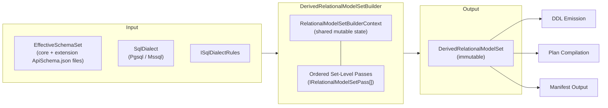

---

## 2. `DerivedRelationalModelSet` — The Output

The top-level immutable record produced by the builder.

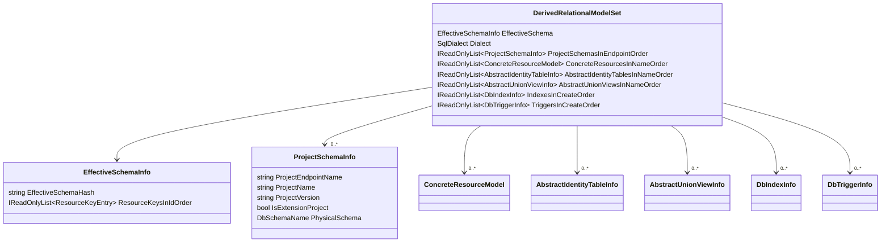

### What each collection represents

| Collection | Contents |
|-----------|----------|
| `ProjectSchemasInEndpointOrder` | Physical schema mappings per project (`ed-fi` → `edfi`, `tpdm` → `tpdm`) |
| `ConcreteResourcesInNameOrder` | One entry per concrete resource — the full relational model for that resource |
| `AbstractIdentityTablesInNameOrder` | Trigger-maintained identity tables for polymorphic abstract resources |
| `AbstractUnionViewsInNameOrder` | Diagnostic union views over concrete members of abstract resources |
| `IndexesInCreateOrder` | Complete index inventory (PK, unique, FK-support, explicit) |
| `TriggersInCreateOrder` | Complete trigger inventory (stamping, referential identity, abstract identity, propagation fallback) |

---

## 3. Zooming In: ConcreteResourceModel

Each concrete resource wraps a `RelationalResourceModel` with its storage kind and resource key.

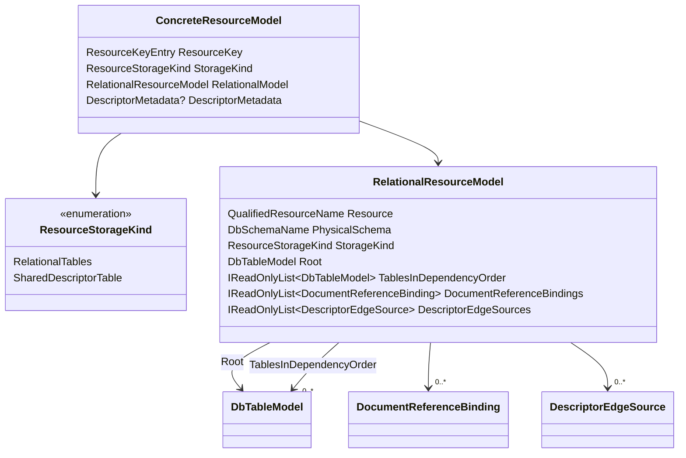

### Storage kinds

- **`RelationalTables`** — normal resources: root table + child collection tables + extension tables
- **`SharedDescriptorTable`** — descriptors: stored in the shared `dms.Descriptor` table (no per-descriptor tables)

---

## 3a. Zooming In: DbTableModel

Every table in the model — root, collection, or extension — is represented by `DbTableModel`.

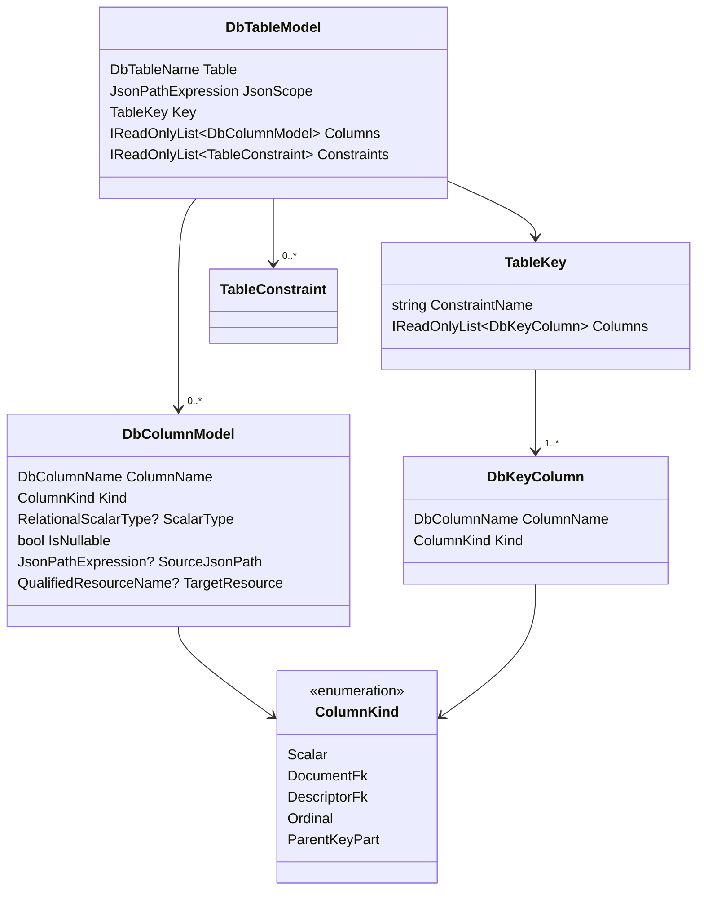

### JsonScope examples

| Table type | JsonScope | Example |
|-----------|-----------|---------|
| Root | `$` | `edfi.Student` |
| Collection | `$.addresses[*]` | `edfi.SchoolAddress` |
| Nested collection | `$.addresses[*].periods[*]` | `edfi.SchoolAddressPeriod` |

### ColumnKind examples

| `ColumnKind` | Purpose | Example column | `ScalarType` | `SourceJsonPath` | `TargetResource` |
|---|---|---|---|---|---|
| `Scalar` | A value projected from the request JSON | `FirstName varchar(75)` | set | set (`$.firstName`) | null |
| `Scalar` | Propagated reference identity binding column (see note below) | `Student_StudentUniqueId varchar(32)` | set | set | set (`Ed-Fi.Student`) |
| `DocumentFk` | FK to another document's `DocumentId` | `Student_DocumentId bigint` | null (always bigint) | null | set (`Ed-Fi.Student`) |
| `DescriptorFk` | FK to `dms.Descriptor(DocumentId)` | `SchoolTypeDescriptor_DescriptorId bigint` | null (always bigint) | null | set (`Ed-Fi.SchoolTypeDescriptor`) |
| `Ordinal` | Array ordering column preserving element order | `Ordinal int` | null (always int) | null | null |
| `ParentKeyPart` | Key column inherited from an ancestor scope | `School_DocumentId bigint` (on a child table) | null (inherited) | null | null |

> **Note on reference identity binding columns**: Columns like `Student_StudentUniqueId` are `ColumnKind.Scalar` — from the table model's perspective they are typed, JSON-sourced scalar columns. Their reference semantics (composite FK participation, `ON UPDATE CASCADE` propagation) are captured separately in `DocumentReferenceBinding` and its `ReferenceIdentityBinding` list, not in the column kind. You can distinguish them from plain scalars by the presence of a non-null `TargetResource`.

---

## 3b. Zooming In: Constraints

Constraints are a discriminated union — three subtypes under `TableConstraint`.

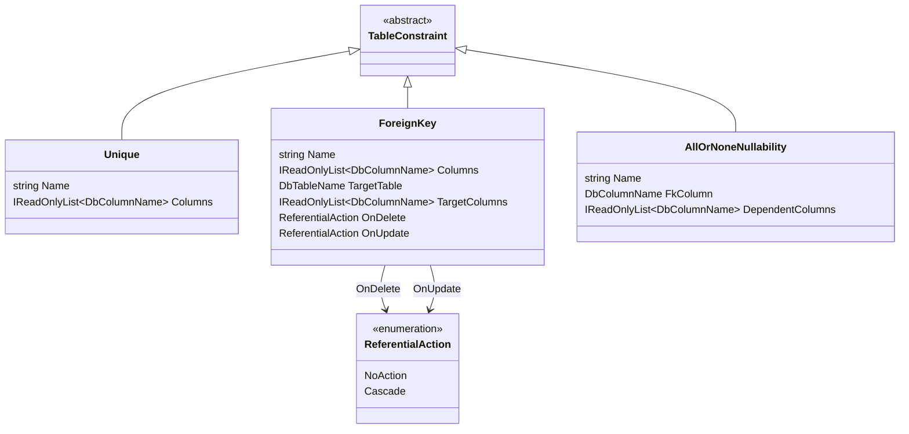

| Constraint type | Purpose | Example |
|----------------|---------|---------|
| `Unique` | Natural key (`UX_..._NK`), reference key (`UX_..._RefKey`), array uniqueness | `UX_Student_NK (StudentUniqueId)` |
| `ForeignKey` | Composite ref FKs, parent FKs, descriptor FKs | `FK_StudentSchoolAssociation_Student_RefKey` |
| `AllOrNoneNullability` | CHECK that reference group columns are all-null or all-populated | `CK_StudentSchoolAssociation_Student_AllNone` |

---

## 3c. Zooming In: Reference and Descriptor Bindings

These metadata records bind JSON reference/descriptor paths to their stored FK columns.

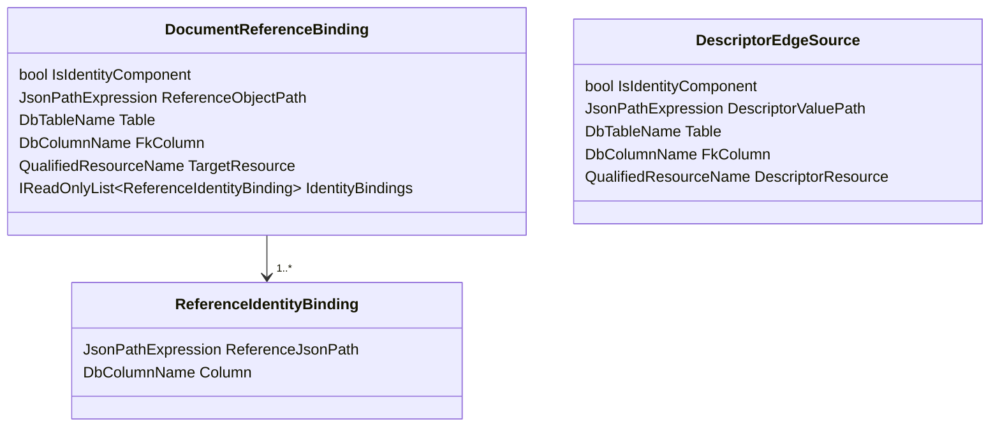

**`DocumentReferenceBinding`** — records how a JSON reference object maps to:
- a `..._DocumentId` FK column, plus
- per-identity-part binding columns (e.g., `Student_StudentUniqueId`)

**`ReferenceIdentityBinding`** — maps a single identity scalar within a reference to:
- a `ReferenceJsonPath` locating the scalar in the JSON reference object
- a `Column` storing that value (e.g., `Student_StudentUniqueId`)

**`DescriptorEdgeSource`** — records how a descriptor value path maps to:
- a `..._DescriptorId` FK column (targeting `dms.Descriptor(DocumentId)`)
- a `DescriptorResource` identifying the expected descriptor type (e.g., `Ed-Fi.SchoolTypeDescriptor`)

---

## 3d. Zooming In: Abstract Resources

For polymorphic/abstract reference targets (e.g., `EducationOrganization`).

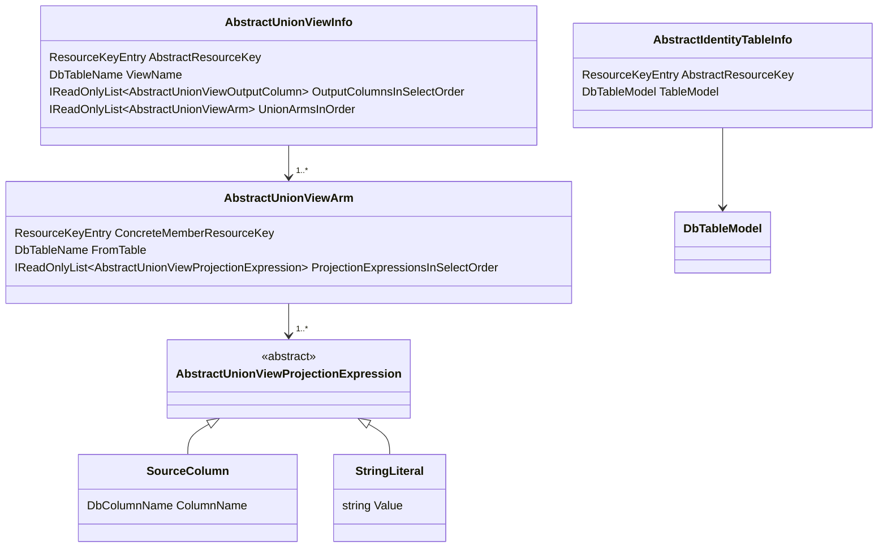

**`AbstractIdentityTableInfo`** — a trigger-maintained identity table that serves as a composite FK target for polymorphic references.

**`AbstractUnionViewInfo`** — a `UNION ALL` view across concrete member root tables, for diagnostic/query use:
- an `OutputColumnsInSelectOrder` defining the view's column list
- an `UnionArmsInOrder` list of per-concrete-member SELECT arms

**`AbstractUnionViewArm`** — one arm of the union view for a single concrete member:
- a `FromTable` identifying the concrete member's root table
- a `ProjectionExpressionsInSelectOrder` list of column expressions

**`AbstractUnionViewProjectionExpression`** — either a `SourceColumn` (real column from the member table) or a `StringLiteral` (constant, e.g., the resource type name).

---

## 3e. Zooming In: Index and Trigger Inventory

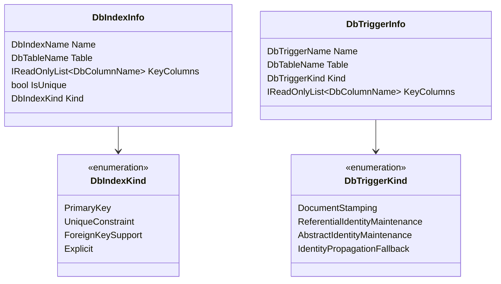

---

## 4. `DerivedRelationalModelSetBuilder` — Orchestration

The builder is intentionally simple: it creates a shared mutable context and runs passes in order.

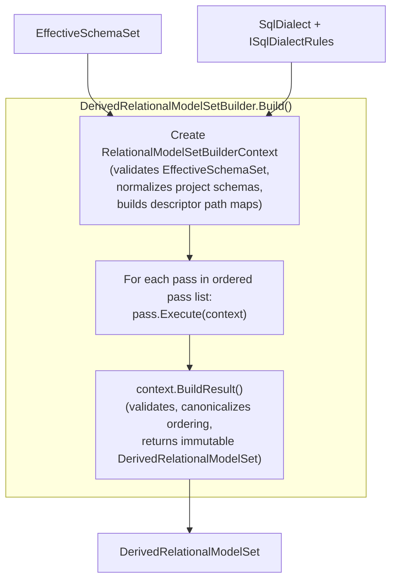

### `RelationalModelSetBuilderContext` — the shared mutable state

The context holds:

| State | Purpose |
|-------|---------|
| `EffectiveSchemaSet` | The input schema set |
| `Dialect` / `DialectRules` | Target database engine |
| `ConcreteResourcesInNameOrder` | Mutable list — passes add/mutate resource models |
| `AbstractIdentityTablesInNameOrder` | Mutable list — abstract identity pass populates |
| `AbstractUnionViewsInNameOrder` | Mutable list — abstract union view pass populates |
| `IndexInventory` | Mutable list — passes add indexes |
| `TriggerInventory` | Mutable list — passes add triggers |
| `ProjectSchemasInEndpointOrder` | Mutable list — shortening pass may update schema names |
| Per-resource `RelationalModelBuilderContext` cache | Retains extracted metadata for cross-resource lookups |
| Extension site registry | `_ext` sites per resource, used by extension pass |
| Descriptor path maps | Pre-computed descriptor paths per resource |

---

## 5. Per-Resource Pipeline

The per-resource pipeline runs inside the first set-level pass (`BaseTraversalAndDescriptorBindingPass`). It derives the base relational model for a single resource.

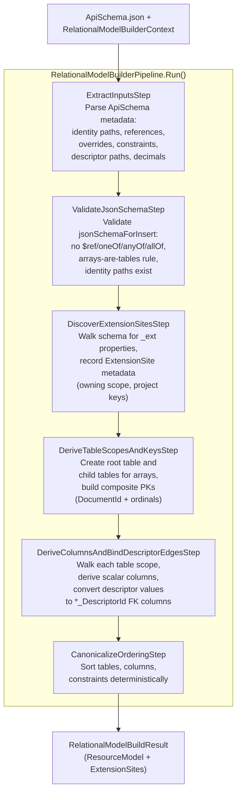

### `RelationalModelBuilderContext` — per-resource mutable state

Key properties populated by steps:

| Property | Populated by | Purpose |
|----------|-------------|---------|
| `JsonSchemaForInsert` | ExtractInputs | Fully dereferenced JSON schema |
| `IdentityJsonPaths` | ExtractInputs | Natural key paths |
| `DocumentReferenceMappings` | ExtractInputs | Reference metadata from `documentPathsMapping` |
| `ArrayUniquenessConstraints` | ExtractInputs | Collection uniqueness constraints |
| `NameOverridesByPath` | ExtractInputs | `relational.nameOverrides` entries |
| `DescriptorPathsByJsonPath` | Precomputed | Descriptor path → resource mappings |
| `DecimalPropertyValidationInfosByPath` | ExtractInputs | Precision/scale for decimal columns |
| `ExtensionSites` | DiscoverExtensionSites | `_ext` mapping sites discovered |
| `ResourceModel` | DeriveTableScopes + DeriveColumns | The derived relational model |

---

## 6. Set-Level Passes — Overview

After the per-resource pipeline runs for all resources, subsequent set-level passes stitch cross-resource artifacts.

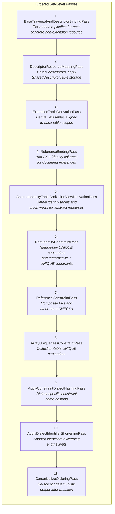

---

## 7. Zooming In: Pass Groups by Concern

### Group A: Base Model (Passes 1-3)

Establishes the foundation — tables, columns, storage kinds, extensions.

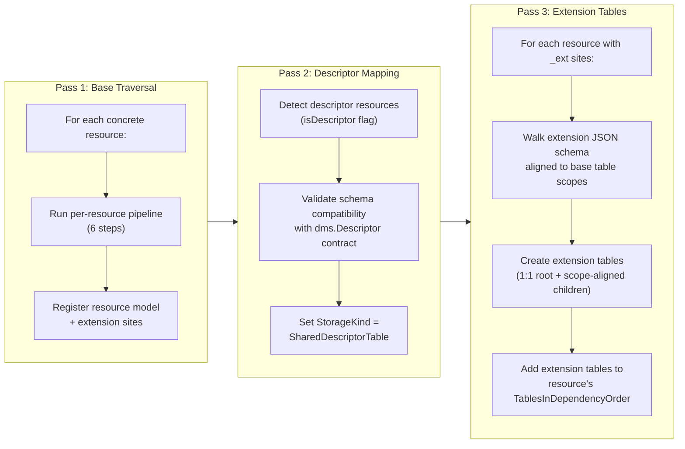

### Group B: References (Passes 4-5)

Binds references across resources and handles polymorphism.

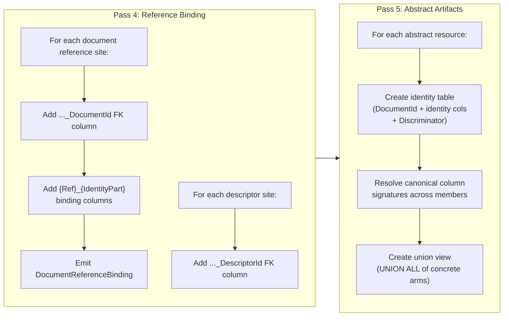

### Group C: Constraints (Passes 6-8)

Derives all constraint types — uniqueness and referential integrity.

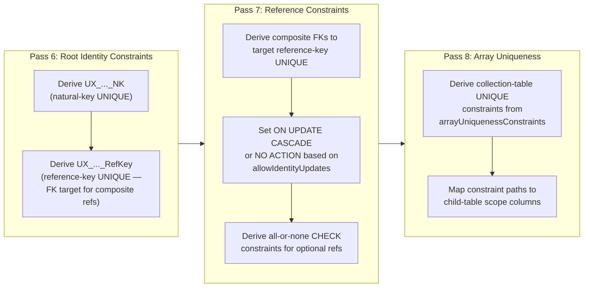

### Group D: Naming and Finalization (Passes 9-11)

Makes identifiers safe for the target engine and deterministic.

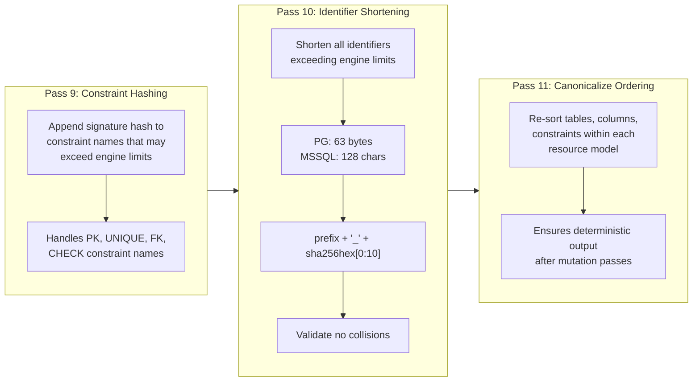

---

## Putting It All Together

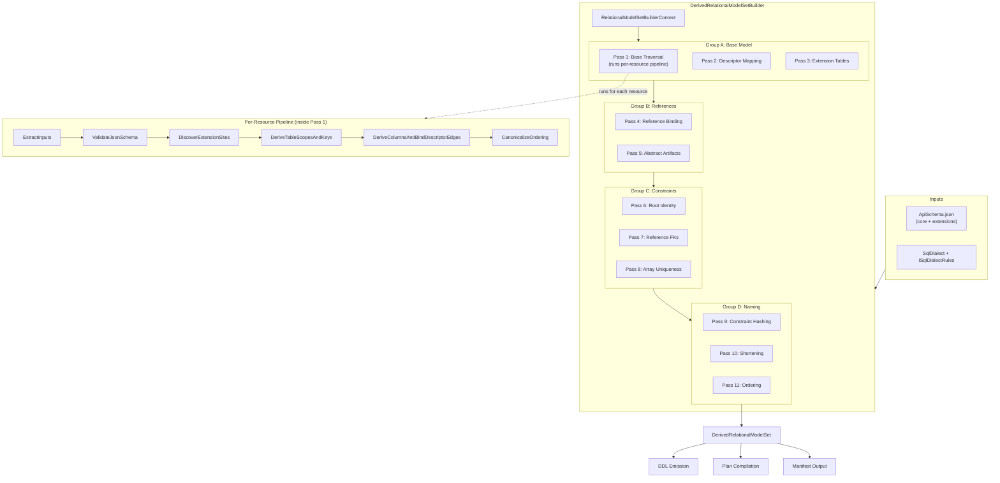

---

## Key Design Decisions

| Decision | Rationale |
|----------|-----------|
| **Ordered passes, not visitors** | Dependencies between passes are explicit in ordering; no DAG resolution needed |
| **Mutable context, immutable output** | Passes freely mutate shared state; `BuildResult()` freezes into immutable records |
| **Per-resource pipeline inside Pass 1** | Base traversal is resource-local; cross-resource concerns live in later passes |
| **Constraint passes after reference binding** | FK constraints need reference columns to already exist |
| **Naming passes last** | All semantic derivation completes before identifier shortening and hashing |
| **Canonical ordering at both levels** | Per-resource pipeline orders once; final pass re-orders after mutation |

---

## Epic Story Mapping

| Pass | Story | Description |
|------|-------|-------------|
| 1. Base Traversal | DMS-929 | JSON schema → base tables/columns |
| 2. Descriptor Mapping | DMS-942 | Descriptor → `dms.Descriptor` storage |
| 3. Extension Tables | DMS-932, DMS-1035 | `_ext` relational mapping + common-type extensions |
| 4. Reference Binding | DMS-930 | References/descriptors + identity columns |
| 5. Abstract Artifacts | DMS-933 | Abstract identity tables + union views |
| 6. Root Identity | DMS-930 | Natural-key and reference-key UNIQUE constraints |
| 7. Reference Constraints | DMS-930 | Composite FKs + all-or-none CHECKs |
| 8. Array Uniqueness | DMS-930 | Collection uniqueness constraints |
| 9. Constraint Hashing | DMS-931 | Dialect-specific constraint naming |
| 10. Shortening | DMS-931 | Engine identifier length limits |
| 11. Ordering | DMS-934 | Deterministic manifest output |
| Set Builder | DMS-1033 | Orchestrates all passes |
| Index/Trigger Inventory | DMS-945 | Deterministic index + trigger derivation |
