# Derived Relational Model: Technical Presentation

---

## Agenda

1. The big picture: what we build and how
2. `DerivedRelationalModelSet` — the output object
3. Zooming in: resource models, tables, columns, constraints
4. `DerivedRelationalModelSetBuilder` — orchestration
5. Per-resource pipeline: steps
6. Set-level passes: cross-resource derivation
7. Zooming in: pass groups by concern

---

## 1. The Big Picture

The relational model is **derived** from `ApiSchema.json` at build time — no code generation, no handwritten SQL.
Successful derivation returns `DerivedRelationalModelArtifact(Model, Diagnostics, ExecutorRequirements)`: the immutable
model, success diagnostics, and provider-finalized semantic requirements for executable plans. SQL Server classification
failures throw `RelationalModelDerivationException` with ordered structured errors. DDL, per-resource plan compilation,
and manifest output consume only the completed global artifact; plan compilation from `.Model` alone is invalid.

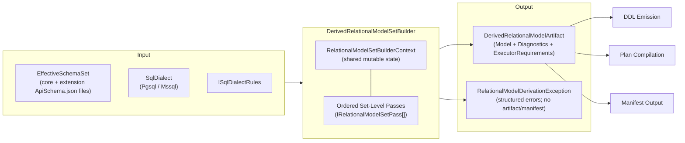
```mermaid
flowchart LR
    subgraph Input
        ESS["EffectiveSchemaSet<br/>(core + extension ApiSchema.json files)"]
        DIALECT["SqlDialect<br/>(Pgsql / Mssql)"]
        RULES["ISqlDialectRules"]
    end

    subgraph Builder["DerivedRelationalModelSetBuilder"]
        CTX["RelationalModelSetBuilderContext<br/>(shared mutable state)"]
        PASSES["Ordered Set-Level Passes<br/>(IRelationalModelSetPass[])"]
        CTX --- PASSES
    end

    subgraph Output
        DRMS["DerivedRelationalModelArtifact<br/>(Model + Diagnostics + ExecutorRequirements)"]
        FAIL["RelationalModelDerivationException<br/>(structured errors; no artifact/manifest)"]
    end

    Input --> Builder --> DRMS
    Builder --> FAIL

    DRMS --> DDL["DDL Emission"]
    DRMS --> PLANS["Plan Compilation"]
    DRMS --> MANIFEST["Manifest Output"]
```

---

## 2. `DerivedRelationalModelArtifact` — The Output

The artifact exists only after every global pass and provider action has finalized. PostgreSQL has no classifier failure
or classifier decisions. SQL Server value-flow/action-selection errors are carried by a typed exception, never embedded
in a partial model or successful manifest. Both dialects produce executor requirements: PostgreSQL constructs them from
fixed retained routes without topology classification, while SQL Server produces them from an accepted representable
assignment.

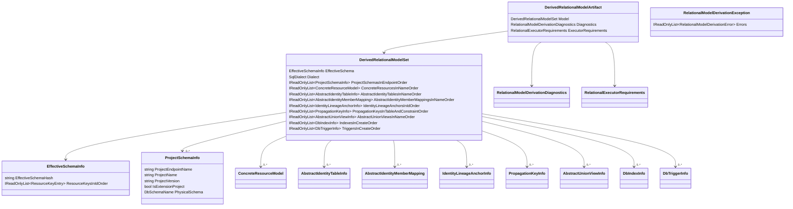
```mermaid
classDiagram
    class DerivedRelationalModelArtifact {
        DerivedRelationalModelSet Model
        RelationalModelDerivationDiagnostics Diagnostics
        RelationalExecutorRequirements ExecutorRequirements
    }

    class RelationalModelDerivationException {
        IReadOnlyList~RelationalModelDerivationError~ Errors
    }

    class DerivedRelationalModelSet {
        EffectiveSchemaInfo EffectiveSchema
        SqlDialect Dialect
        IReadOnlyList~ProjectSchemaInfo~ ProjectSchemasInEndpointOrder
        IReadOnlyList~ConcreteResourceModel~ ConcreteResourcesInNameOrder
        IReadOnlyList~AbstractIdentityTableInfo~ AbstractIdentityTablesInNameOrder
        IReadOnlyList~AbstractIdentityMemberMapping~ AbstractIdentityMemberMappingsInNameOrder
        IReadOnlyList~IdentityLineageAnchorInfo~ IdentityLineageAnchorsInIdOrder
        IReadOnlyList~PropagationKeyInfo~ PropagationKeysInTableAndConstraintOrder
        IReadOnlyList~AbstractUnionViewInfo~ AbstractUnionViewsInNameOrder
        IReadOnlyList~DbIndexInfo~ IndexesInCreateOrder
        IReadOnlyList~DbTriggerInfo~ TriggersInCreateOrder
    }

    class EffectiveSchemaInfo {
        string EffectiveSchemaHash
        IReadOnlyList~ResourceKeyEntry~ ResourceKeysInIdOrder
    }

    class ProjectSchemaInfo {
        string ProjectEndpointName
        string ProjectName
        string ProjectVersion
        bool IsExtensionProject
        DbSchemaName PhysicalSchema
    }

    DerivedRelationalModelArtifact --> DerivedRelationalModelSet
    DerivedRelationalModelArtifact --> RelationalModelDerivationDiagnostics
    DerivedRelationalModelArtifact --> RelationalExecutorRequirements
    DerivedRelationalModelSet --> EffectiveSchemaInfo
    DerivedRelationalModelSet --> "0..*" ProjectSchemaInfo
    DerivedRelationalModelSet --> "0..*" ConcreteResourceModel
    DerivedRelationalModelSet --> "0..*" AbstractIdentityTableInfo
    DerivedRelationalModelSet --> "0..*" AbstractIdentityMemberMapping
    DerivedRelationalModelSet --> "0..*" IdentityLineageAnchorInfo
    DerivedRelationalModelSet --> "0..*" PropagationKeyInfo
    DerivedRelationalModelSet --> "0..*" AbstractUnionViewInfo
    DerivedRelationalModelSet --> "0..*" DbIndexInfo
    DerivedRelationalModelSet --> "0..*" DbTriggerInfo
```

### What each collection represents

| Collection | Contents |
|-----------|----------|
| `ProjectSchemasInEndpointOrder` | Physical schema mappings per project (`ed-fi` → `edfi`, `tpdm` → `tpdm`) |
| `ConcreteResourcesInNameOrder` | One entry per concrete resource — the full relational model for that resource |
| `AbstractIdentityTablesInNameOrder` | Trigger-maintained identity tables for polymorphic abstract resources |
| `IdentityLineageAnchorsInIdOrder` | Intrinsic target-table inventory/storage for reference-backed identity lineages |
| `PropagationKeysInTableAndConstraintOrder` | Site-demanded propagation-key variants grouped by stable `AnchorSetId` |
| `AbstractUnionViewsInNameOrder` | Diagnostic union views over concrete members of abstract resources |
| `IndexesInCreateOrder` | Complete index inventory (PK, unique, FK-support, explicit) |
| `TriggersInCreateOrder` | Complete maintenance-trigger inventory (stamping, referential identity, abstract identity). Identity-value propagation uses finalized native FK actions, not a propagation trigger |

---

## 3. Zooming In: ConcreteResourceModel

Each concrete resource wraps a `RelationalResourceModel` with its storage kind and resource key.

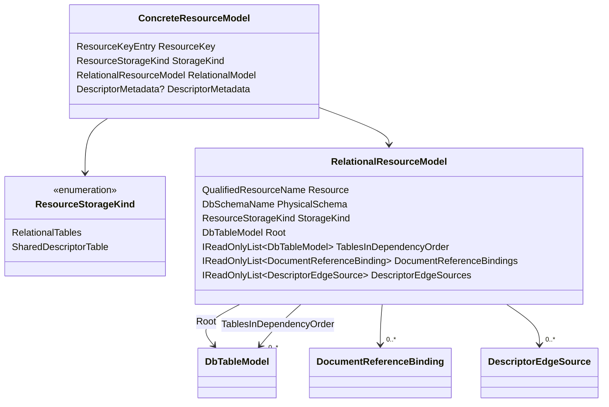
```mermaid
classDiagram
    class ConcreteResourceModel {
        ResourceKeyEntry ResourceKey
        ResourceStorageKind StorageKind
        RelationalResourceModel RelationalModel
        DescriptorMetadata? DescriptorMetadata
    }

    class ResourceStorageKind {
        <<enumeration>>
        RelationalTables
        SharedDescriptorTable
    }

    class RelationalResourceModel {
        QualifiedResourceName Resource
        DbSchemaName PhysicalSchema
        ResourceStorageKind StorageKind
        DbTableModel Root
        IReadOnlyList~DbTableModel~ TablesInDependencyOrder
        IReadOnlyList~DocumentReferenceBinding~ DocumentReferenceBindings
        IReadOnlyList~DescriptorEdgeSource~ DescriptorEdgeSources
    }

    ConcreteResourceModel --> RelationalResourceModel
    ConcreteResourceModel --> ResourceStorageKind
    RelationalResourceModel --> DbTableModel : Root
    RelationalResourceModel --> "0..*" DbTableModel : TablesInDependencyOrder
    RelationalResourceModel --> "0..*" DocumentReferenceBinding
    RelationalResourceModel --> "0..*" DescriptorEdgeSource
```

### Storage kinds

- **`RelationalTables`** — normal resources: root table + child collection tables + extension tables
- **`SharedDescriptorTable`** — descriptors: stored in the shared `dms.Descriptor` table (no per-descriptor tables)

---

## 3a. Zooming In: DbTableModel

Every table in the model — root, collection, or extension — is represented by `DbTableModel`.

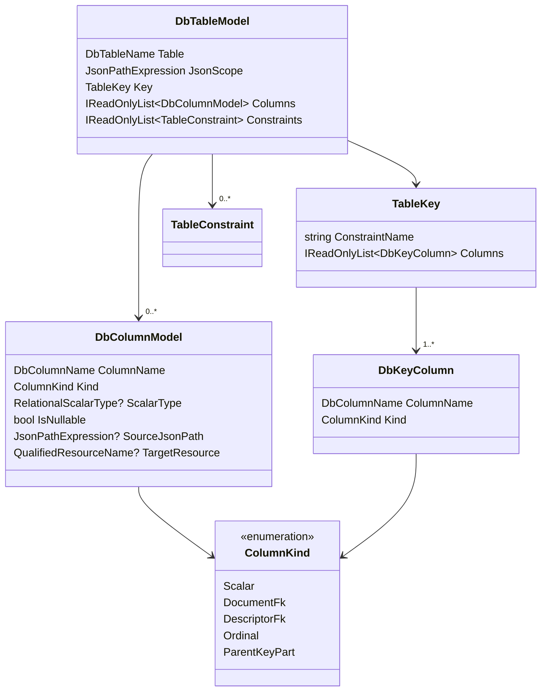
```mermaid
classDiagram
    class DbTableModel {
        DbTableName Table
        JsonPathExpression JsonScope
        TableKey Key
        IReadOnlyList~DbColumnModel~ Columns
        IReadOnlyList~TableConstraint~ Constraints
    }

    class TableKey {
        string ConstraintName
        IReadOnlyList~DbKeyColumn~ Columns
    }

    class DbKeyColumn {
        DbColumnName ColumnName
        ColumnKind Kind
    }

    class DbColumnModel {
        DbColumnName ColumnName
        ColumnKind Kind
        RelationalScalarType? ScalarType
        bool IsNullable
        JsonPathExpression? SourceJsonPath
        QualifiedResourceName? TargetResource
    }

    class ColumnKind {
        <<enumeration>>
        Scalar
        DocumentFk
        DescriptorFk
        Ordinal
        ParentKeyPart
    }

    DbTableModel --> TableKey
    DbTableModel --> "0..*" DbColumnModel
    DbTableModel --> "0..*" TableConstraint
    TableKey --> "1..*" DbKeyColumn
    DbColumnModel --> ColumnKind
    DbKeyColumn --> ColumnKind
```

### JsonScope examples

| Table type | JsonScope | Example |
|-----------|-----------|---------|
| Root | `$` | `edfi.Student` |
| Collection | `$.addresses[*]` | `edfi.SchoolAddress` |
| Nested collection | `$.addresses[*].periods[*]` | `edfi.SchoolAddressPeriod` |

### ColumnKind examples

| `ColumnKind` | Purpose | Example column | `ScalarType` | `SourceJsonPath` | `TargetResource` |
|---|---|---|---|---|---|
| `Scalar` | A value projected from the request JSON | `FirstName varchar(75)` | set | set (`$.firstName`) | null |
| `Scalar` | Propagated reference identity binding column (see note below) | `Student_StudentUniqueId varchar(32)` | set | set | set (`Ed-Fi.Student`) |
| `DocumentFk` | FK to another document's `DocumentId` | `Student_DocumentId bigint` | null (always bigint) | null | set (`Ed-Fi.Student`) |
| `DescriptorFk` | FK to `dms.Descriptor(DocumentId)` | `SchoolTypeDescriptor_DescriptorId bigint` | null (always bigint) | null | set (`Ed-Fi.SchoolTypeDescriptor`) |
| `Ordinal` | Array ordering column preserving element order | `Ordinal int` | null (always int) | null | null |
| `ParentKeyPart` | Key column inherited from an ancestor scope | `School_DocumentId bigint` (on a child table) | null (inherited) | null | null |

> **Note on reference identity binding columns**: Columns like `Student_StudentUniqueId` are `ColumnKind.Scalar` — from the table model's perspective they are typed, JSON-sourced scalar columns. Their reference semantics (composite FK participation, `ON UPDATE CASCADE` propagation) are captured separately in `DocumentReferenceBinding` and its `ReferenceIdentityBinding` list, not in the column kind. You can distinguish them from plain scalars by the presence of a non-null `TargetResource`.

---

## 3b. Zooming In: Constraints

Constraints are a discriminated union — three subtypes under `TableConstraint`.

```mermaid
classDiagram
    class TableConstraint {
        <<abstract>>
    }

    class Unique {
        string Name
        IReadOnlyList~DbColumnName~ Columns
    }

    class ForeignKey {
        PhysicalForeignKeyId PhysicalForeignKeyId
        AnchorSetId? AnchorSetId
        string Name
        IReadOnlyList~DbColumnName~ Columns
        DbTableName TargetTable
        IReadOnlyList~DbColumnName~ TargetColumns
        IReadOnlyList~ForeignKeyLineageAnchorMapping~ LineageAnchorsInOrder
        ReferentialAction OnDelete
        ReferentialAction OnUpdate
    }

    class AllOrNoneNullability {
        string Name
        DbColumnName FkColumn
        IReadOnlyList~DbColumnName~ DependentColumns
    }

    class ForeignKeyLineageAnchorMapping {
        IdentityLineageId IdentityLineage
        DbColumnName LocalColumn
        DbColumnName TargetColumn
    }

    class ReferentialAction {
        <<enumeration>>
        NoAction
        Cascade
    }

    class MssqlPropagationMode {
        <<enumeration>>
        NativeCascade
        NoPropagation
        ImmutableNoAction
    }

    class RelationalModelDerivationDiagnostics {
        IReadOnlyList~AnchorOmissionProof~ AnchorOmissionProofs
        IReadOnlyList~MssqlForeignKeyDecision~ MssqlForeignKeyDecisions
    }

    class RelationalExecutorRequirements {
        IReadOnlyList~SameStatementReferenceResolutionRequirement~ SameStatementReferences
    }

    class SameStatementReferenceResolutionRequirement {
        QualifiedResourceName OwningResource
        ReferenceSiteId ReferenceSite
        MutationOriginId AllowedDirectMutationOrigin
        MutationCaseId MutationCase
        PropagationRoute RetainedChangedTargetRoute
        RowCorrelationProof TargetCorrelation
        IReadOnlyList~SameStatementFutureValueRequirement~ FutureValues
    }

    class AnchorOmissionProof {
        ReferenceSiteId ReferenceSite
        IdentityLineageId OmittedIdentityLineage
        AnchorSetId SelectedAnchorSet
        IReadOnlyList~AnchorOmissionConsumerCheck~ ConsumerChecks
        IReadOnlyList~AnchorOmissionMutationCoverage~ MutationCoverage
    }

    class MssqlForeignKeyDecision {
        PhysicalForeignKeyId ForeignKeyId
        MssqlPropagationMode Mode
        IReadOnlyList~CoverageCertificate~ CoverageCertificates
    }

    class CoverageCertificate {
        PhysicalForeignKeyId PrunedForeignKeyId
        MutationOriginId MutationOrigin
        MutationCaseId MutationCase
        PropagationRoute ChangedTargetRoute
        PropagationRoute ReceiverCarrierRoute
        IReadOnlyList~ComponentEqualityProof~ ItemEqualityProofs
        RowCorrelationProof OriginRowCorrelation
        RowCorrelationProof ReceiverRowCorrelation
        PresenceImplicationProof PresenceImplication
        ConstraintTimingProof Timing
        SubsetCompositionProof Composition
    }

    class SubsetCompositionProof {
        SubsetCompositionKind Kind
        AnchorSetId AnchorSetId
        IReadOnlyList~PropagationItemRef~ ItemsInVectorOrder
        IReadOnlyList~MutationCaseId~ SupportingCasesInIdOrder
    }

    TableConstraint <|-- Unique
    TableConstraint <|-- ForeignKey
    TableConstraint <|-- AllOrNoneNullability
    ForeignKey --> ReferentialAction : OnDelete
    ForeignKey --> ReferentialAction : OnUpdate
    ForeignKey --> "0..*" ForeignKeyLineageAnchorMapping
    RelationalModelDerivationDiagnostics --> "0..*" AnchorOmissionProof
    RelationalModelDerivationDiagnostics --> "0..*" MssqlForeignKeyDecision
    RelationalExecutorRequirements --> "0..*" SameStatementReferenceResolutionRequirement
    MssqlForeignKeyDecision --> MssqlPropagationMode
    MssqlForeignKeyDecision --> "0..*" CoverageCertificate : NoPropagation only
    CoverageCertificate --> SubsetCompositionProof
```

Targets intrinsically inventory/store every reference-backed lineage, while each incoming site's demanded anchor set
starts empty. Receiver-side full-FK validity/correlation adds only necessary anchors, and demand propagates only through
downstream identity/constraint consumers to a least fixed point. Equal demand sets share an `AnchorSetId`
propagation-key/`RefKey` variant, so target-intrinsic anchors are not blanket-copied and each reference keeps exactly one
full FK. Omission is accepted only when no receiver obligation needs the anchor across every mutation subset and
simultaneous combination. Logical references are then mapped to canonical storage and de-duplicated as
`PhysicalForeignKeyCandidate` objects; stable identity excludes `OnUpdate` and `MssqlPropagationMode`.

DS 5.2 `CourseOffering -> Session` demands Session's School anchor because the unified School receiver is also read by
`CourseOffering -> School`. An unrelated Session reference with no such receiver constraint uses the empty-demand
variant.

PostgreSQL receives fixed full-composite actions without DMS classification. SQL Server alone derives statement-scoped
proofs and globally selects modes satisfying value flow and error 1785. Cycles may be broken when the pruned edge has a
changed-target route and same-row receiver-carrier route; the carrier may be zero-hop `OriginWrite`. Certificates prove
the complete selected vector, presence, separate origin/receiver row correlation, and constraint timing for each complete
`MutationCaseId`. Reusing primitive cases requires typed `SubsetCompositionProof`; missing composition is
`UnprovedSubsetComposition`.

`MssqlForeignKeyDecision` values are success-only derivation/DDL/manifest diagnostics keyed by
`PhysicalForeignKeyId`; they are separate from runtime `ForeignKey`. DDL emission consumes the finalized constraint.
Mapping packs serialize its expanded local/target vectors, stable `PhysicalForeignKeyId`, selected `AnchorSetId`, and final
actions, but omit classification certificates and composition proofs.

`RelationalExecutorRequirements` is success-only compiler input, not a diagnostic. For every direct API mutation origin
and existing request binding whose target changes along any retained same-boundary route, it carries each complete
mutation case that can miss normal pre-statement lookup. The requirement records the exact site/origin/case key, stored
target id, occurrence and target-row correlation, retained route, and every future-vector source. This rule also applies
to retained acyclic `CASCADE` bindings; it is not restricted to a SQL Server cycle cut or zero-hop certificate.

| Constraint type | Purpose | Example |
|----------------|---------|---------|
| `Unique` | Natural key (`UX_..._NK`), reference key (`UX_..._RefKey`), array uniqueness | `UX_Student_NK (StudentUniqueId)` |
| `ForeignKey` | Composite ref FKs, parent FKs, descriptor FKs | `FK_StudentSchoolAssociation_Student_RefKey` |
| `AllOrNoneNullability` | CHECK that site `..._DocumentId`, per-site aliases, and every dedicated demanded local anchor are all-null or all-populated | `CK_StudentSchoolAssociation_Student_AllNone` |

---

## 3c. Zooming In: Reference and Descriptor Bindings

These metadata records bind JSON reference/descriptor paths to their stored FK columns.

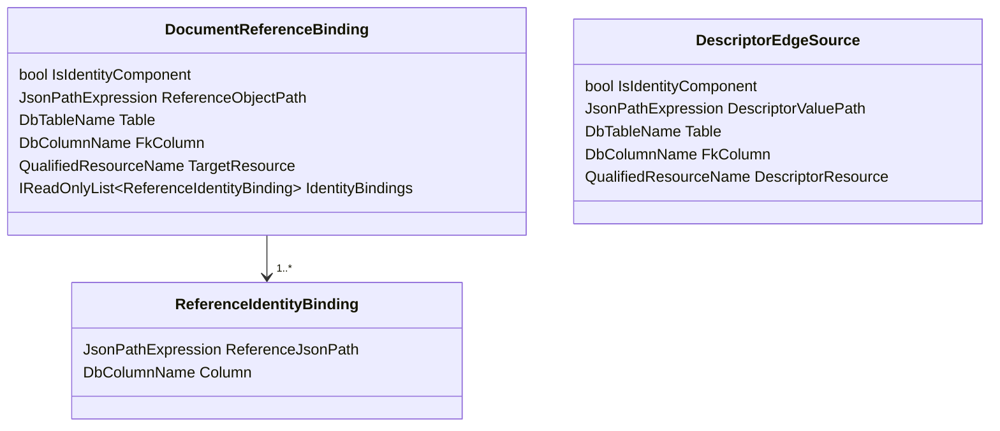
```mermaid
classDiagram
    class DocumentReferenceBinding {
        bool IsIdentityComponent
        JsonPathExpression ReferenceObjectPath
        DbTableName Table
        DbColumnName FkColumn
        QualifiedResourceName TargetResource
        IReadOnlyList~ReferenceIdentityBinding~ IdentityBindings
    }

    class ReferenceIdentityBinding {
        JsonPathExpression ReferenceJsonPath
        DbColumnName Column
    }

    class DescriptorEdgeSource {
        bool IsIdentityComponent
        JsonPathExpression DescriptorValuePath
        DbTableName Table
        DbColumnName FkColumn
        QualifiedResourceName DescriptorResource
    }

    DocumentReferenceBinding --> "1..*" ReferenceIdentityBinding
```

**`DocumentReferenceBinding`** — records how a JSON reference object maps to:
- a `..._DocumentId` FK column, plus
- per-identity-part binding columns (e.g., `Student_StudentUniqueId`)

**`ReferenceIdentityBinding`** — maps a single identity scalar within a reference to:
- a `ReferenceJsonPath` locating the scalar in the JSON reference object
- a `Column` storing that value (e.g., `Student_StudentUniqueId`)

**`DescriptorEdgeSource`** — records how a descriptor value path maps to:
- a `..._DescriptorId` FK column (targeting `dms.Descriptor(DocumentId)`)
- a `DescriptorResource` identifying the expected descriptor type (e.g., `Ed-Fi.SchoolTypeDescriptor`)

---

## 3d. Zooming In: Abstract Resources

For polymorphic/abstract reference targets (e.g., `EducationOrganization`).

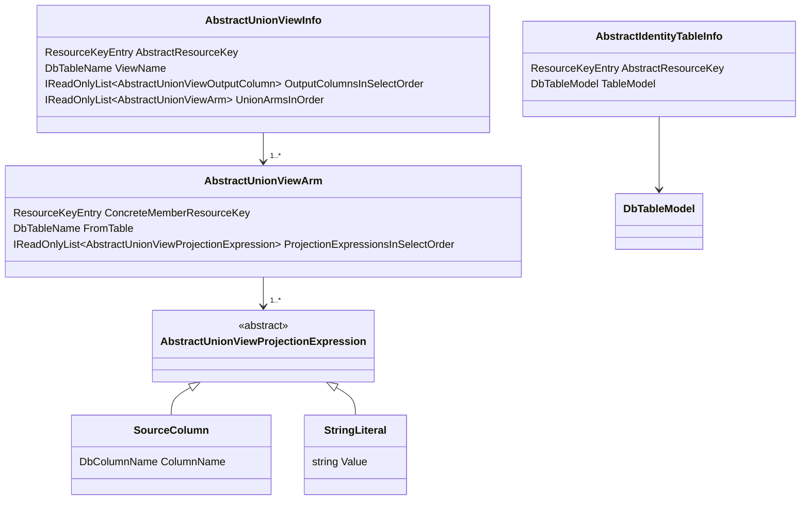
```mermaid
classDiagram
    class AbstractIdentityTableInfo {
        ResourceKeyEntry AbstractResourceKey
        DbTableModel TableModel
    }

    class AbstractUnionViewInfo {
        ResourceKeyEntry AbstractResourceKey
        DbTableName ViewName
        IReadOnlyList~AbstractUnionViewOutputColumn~ OutputColumnsInSelectOrder
        IReadOnlyList~AbstractUnionViewArm~ UnionArmsInOrder
    }

    class AbstractUnionViewArm {
        ResourceKeyEntry ConcreteMemberResourceKey
        DbTableName FromTable
        IReadOnlyList~AbstractUnionViewProjectionExpression~ ProjectionExpressionsInSelectOrder
    }

    class AbstractUnionViewProjectionExpression {
        <<abstract>>
    }
    class SourceColumn {
        DbColumnName ColumnName
    }
    class StringLiteral {
        string Value
    }

    AbstractUnionViewInfo --> "1..*" AbstractUnionViewArm
    AbstractUnionViewArm --> "1..*" AbstractUnionViewProjectionExpression
    AbstractUnionViewProjectionExpression <|-- SourceColumn
    AbstractUnionViewProjectionExpression <|-- StringLiteral
    AbstractIdentityTableInfo --> DbTableModel
```

**`AbstractIdentityTableInfo`** — a trigger-maintained identity table that serves as a composite FK target for polymorphic references.

**`AbstractIdentityMemberMapping`** — the shared table-qualified mapping from each concrete member's public identity,
intrinsic target-lineage inventory/storage, `DocumentId`, discriminator, and storage expressions into the abstract identity table. Anchor-demand closure,
SQL Server analysis, and abstract maintenance-trigger derivation consume this inventory; no later pass reconstructs it.

**`AbstractUnionViewInfo`** — a `UNION ALL` view across concrete member root tables, for diagnostic/query use:
- an `OutputColumnsInSelectOrder` defining the view's column list
- an `UnionArmsInOrder` list of per-concrete-member SELECT arms

**`AbstractUnionViewArm`** — one arm of the union view for a single concrete member:
- a `FromTable` identifying the concrete member's root table
- a `ProjectionExpressionsInSelectOrder` list of column expressions

**`AbstractUnionViewProjectionExpression`** — either a `SourceColumn` (real column from the member table) or a `StringLiteral` (constant, e.g., the resource type name).

---

## 3e. Zooming In: Index and Trigger Inventory

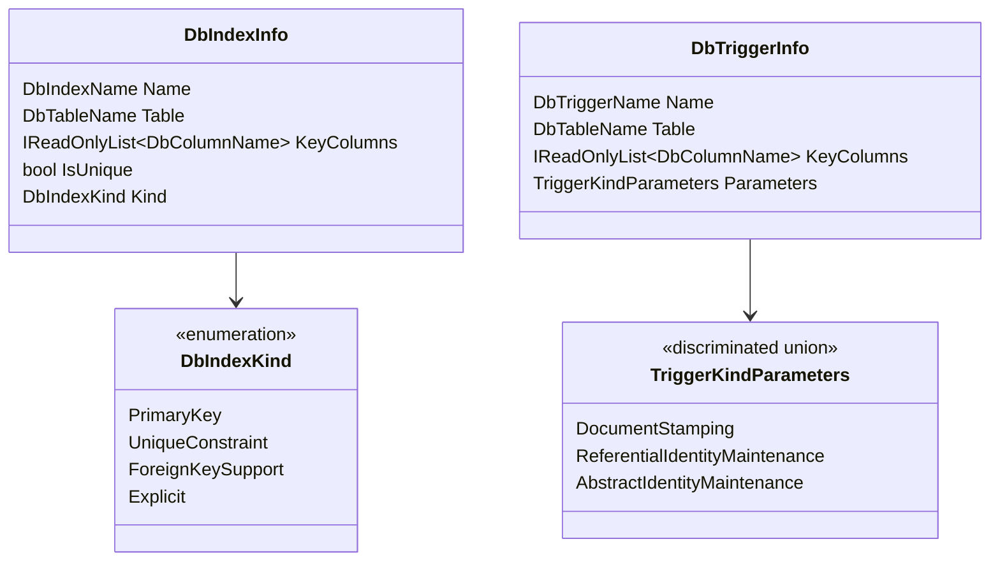
```mermaid
classDiagram
    class DbIndexInfo {
        DbIndexName Name
        DbTableName Table
        IReadOnlyList~DbColumnName~ KeyColumns
        bool IsUnique
        DbIndexKind Kind
    }

    class DbIndexKind {
        <<enumeration>>
        PrimaryKey
        UniqueConstraint
        ForeignKeySupport
        Explicit
    }

    class DbTriggerInfo {
        DbTriggerName Name
        DbTableName Table
        IReadOnlyList~DbColumnName~ KeyColumns
        TriggerKindParameters Parameters
    }

    class TriggerKindParameters {
        <<discriminated union>>
        DocumentStamping
        ReferentialIdentityMaintenance
        AbstractIdentityMaintenance
    }

    DbIndexInfo --> DbIndexKind
    DbTriggerInfo --> TriggerKindParameters
```

---

## 4. `DerivedRelationalModelSetBuilder` — Orchestration

The builder is intentionally simple: it creates a shared mutable context and runs passes in order.

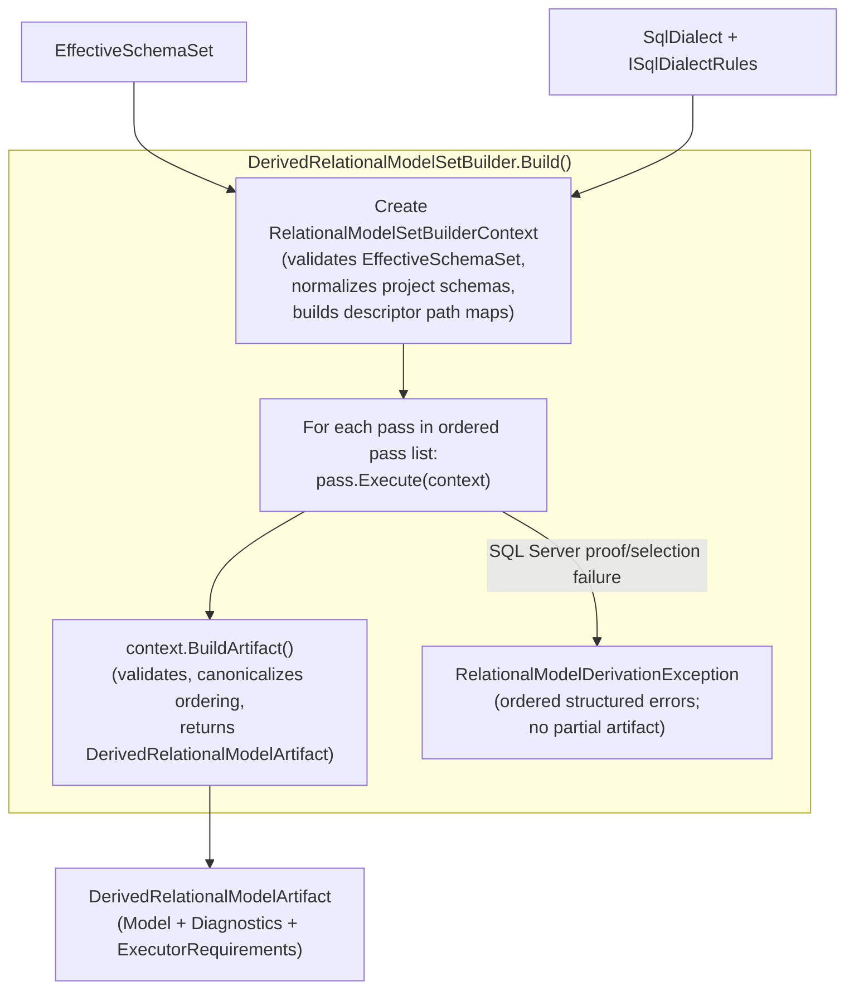
```mermaid
flowchart TD
    subgraph Builder["DerivedRelationalModelSetBuilder.Build()"]
        direction TB
        CREATE["Create RelationalModelSetBuilderContext<br/>(validates EffectiveSchemaSet,<br/>normalizes project schemas,<br/>builds descriptor path maps)"]

        LOOP["For each pass in ordered pass list:<br/>pass.Execute(context)"]

        RESULT["context.BuildArtifact()<br/>(validates, canonicalizes ordering,<br/>returns DerivedRelationalModelArtifact)"]
        ERROR["RelationalModelDerivationException<br/>(ordered structured errors;<br/>no partial artifact)"]

        CREATE --> LOOP --> RESULT
        LOOP -->|SQL Server proof/selection failure| ERROR
    end

    ESS["EffectiveSchemaSet"] --> CREATE
    DIALECT["SqlDialect + ISqlDialectRules"] --> CREATE
    RESULT --> ARTIFACT["DerivedRelationalModelArtifact<br/>(Model + Diagnostics + ExecutorRequirements)"]
```

### `RelationalModelSetBuilderContext` — the shared mutable state

The context holds:

| State | Purpose |
|-------|---------|
| `EffectiveSchemaSet` | The input schema set |
| `Dialect` / `DialectRules` | Target database engine |
| `ConcreteResourcesInNameOrder` | Mutable list — passes add/mutate resource models |
| `AbstractIdentityTablesInNameOrder` | Mutable list — abstract identity pass populates |
| `AbstractUnionViewsInNameOrder` | Mutable list — abstract union view pass populates |
| `IndexInventory` | Mutable list — passes add indexes |
| `TriggerInventory` | Mutable list — passes add triggers |
| `ProjectSchemasInEndpointOrder` | Mutable list — shortening pass may update schema names |
| Per-resource `RelationalModelBuilderContext` cache | Retains extracted metadata for cross-resource lookups |
| Extension site registry | `_ext` sites per resource, used by extension pass |
| Descriptor path maps | Pre-computed descriptor paths per resource |

---

## 5. Per-Resource Pipeline

The per-resource pipeline runs inside the first set-level pass (`BaseTraversalAndDescriptorBindingPass`). It derives the base relational model for a single resource.

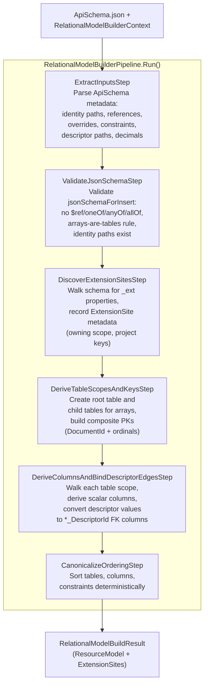
```mermaid
flowchart TD
    subgraph Pipeline["RelationalModelBuilderPipeline.Run()"]
        direction TB
        S1["ExtractInputsStep<br/>Parse ApiSchema metadata:<br/>identity paths, references,<br/>overrides, constraints,<br/>descriptor paths, decimals"]

        S2["ValidateJsonSchemaStep<br/>Validate jsonSchemaForInsert:<br/>no $ref/oneOf/anyOf/allOf,<br/>arrays-are-tables rule,<br/>identity paths exist"]

        S3["DiscoverExtensionSitesStep<br/>Walk schema for _ext properties,<br/>record ExtensionSite metadata<br/>(owning scope, project keys)"]

        S4["DeriveTableScopesAndKeysStep<br/>Create root table and<br/>child tables for arrays,<br/>build composite PKs<br/>(DocumentId + ordinals)"]

        S5["DeriveColumnsAndBindDescriptorEdgesStep<br/>Walk each table scope,<br/>derive scalar columns,<br/>convert descriptor values<br/>to *_DescriptorId FK columns"]

        S6["CanonicalizeOrderingStep<br/>Sort tables, columns,<br/>constraints deterministically"]

        S1 --> S2 --> S3 --> S4 --> S5 --> S6
    end

    INPUT["ApiSchema.json +<br/>RelationalModelBuilderContext"] --> S1
    S6 --> OUTPUT["RelationalModelBuildResult<br/>(ResourceModel + ExtensionSites)"]
```

### `RelationalModelBuilderContext` — per-resource mutable state

Key properties populated by steps:

| Property | Populated by | Purpose |
|----------|-------------|---------|
| `JsonSchemaForInsert` | ExtractInputs | Fully dereferenced JSON schema |
| `IdentityJsonPaths` | ExtractInputs | Natural key paths |
| `DocumentReferenceMappings` | ExtractInputs | Reference metadata from `documentPathsMapping` |
| `ArrayUniquenessConstraints` | ExtractInputs | Collection uniqueness constraints |
| `NameOverridesByPath` | ExtractInputs | `relational.nameOverrides` entries |
| `DescriptorPathsByJsonPath` | Precomputed | Descriptor path → resource mappings |
| `DecimalPropertyValidationInfosByPath` | ExtractInputs | Precision/scale for decimal columns |
| `ExtensionSites` | DiscoverExtensionSites | `_ext` mapping sites discovered |
| `ResourceModel` | DeriveTableScopes + DeriveColumns | The derived relational model |

---

## 6. Set-Level Passes — Overview

After the per-resource pipeline runs for all resources, subsequent set-level passes stitch cross-resource artifacts. The
diagram shows the semantic spine; specialized semantic-identity, descriptor, authorization, and tracked-change passes
remain in their documented positions around these stages.

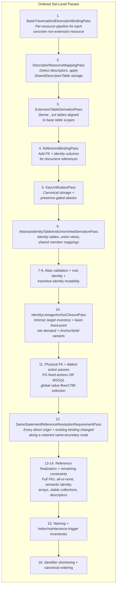
```mermaid
flowchart TD
    subgraph Passes["Ordered Set-Level Passes"]
        direction TB
        P1["1. BaseTraversalAndDescriptorBindingPass<br/><i>Per-resource pipeline for each<br/>concrete non-extension resource</i>"]

        P2["2. DescriptorResourceMappingPass<br/><i>Detect descriptors, apply<br/>SharedDescriptorTable storage</i>"]

        P3["3. ExtensionTableDerivationPass<br/><i>Derive _ext tables aligned<br/>to base table scopes</i>"]

        P4["4. ReferenceBindingPass<br/><i>Add FK + identity columns<br/>for document references</i>"]

        P5["5. KeyUnificationPass<br/><i>Canonical storage +<br/>presence-gated aliases</i>"]

        P6["6. AbstractIdentityTableAndUnionViewDerivationPass<br/><i>Identity tables, union views,<br/>shared member mappings</i>"]

        P7["7-9. Alias validation + root identity +<br/>transitive identity mutability"]

        P8["10. IdentityLineageAnchorClosurePass<br/><i>Intrinsic target inventory + least-fixed-point<br/>site demand + AnchorSetId variants</i>"]

        P9["11. Physical FK + dialect action passes<br/><i>PG fixed actions OR MSSQL<br/>global value-flow/1785 selection</i>"]

        P10["12. SameStatementReferenceResolutionRequirementPass<br/><i>Every direct origin + existing binding changed<br/>along a retained same-boundary route</i>"]

        P11["13-14. Reference finalization + remaining constraints<br/><i>Full FKs, all-or-none, semantic identity,<br/>arrays, stable collections, descriptors</i>"]

        P12["15. Naming + index/maintenance-trigger inventories"]

        P13["16. Identifier shortening + canonical ordering"]

        P1 --> P2 --> P3 --> P4 --> P5 --> P6 --> P7 --> P8 --> P9 --> P10 --> P11 --> P12 --> P13
    end
```

---

## 7. Zooming In: Pass Groups by Concern

### Group A: Base Model (Passes 1-3)

Establishes the foundation — tables, columns, storage kinds, extensions.

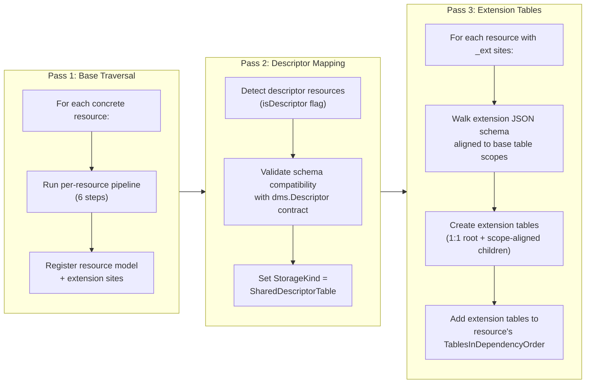
```mermaid
flowchart LR
    subgraph P1["Pass 1: Base Traversal"]
        direction TB
        P1A["For each concrete resource:"]
        P1B["Run per-resource pipeline<br/>(6 steps)"]
        P1C["Register resource model<br/>+ extension sites"]
        P1A --> P1B --> P1C
    end

    subgraph P2["Pass 2: Descriptor Mapping"]
        direction TB
        P2A["Detect descriptor resources<br/>(isDescriptor flag)"]
        P2B["Validate schema compatibility<br/>with dms.Descriptor contract"]
        P2C["Set StorageKind =<br/>SharedDescriptorTable"]
        P2A --> P2B --> P2C
    end

    subgraph P3["Pass 3: Extension Tables"]
        direction TB
        P3A["For each resource with _ext sites:"]
        P3B["Walk extension JSON schema<br/>aligned to base table scopes"]
        P3C["Create extension tables<br/>(1:1 root + scope-aligned children)"]
        P3D["Add extension tables to<br/>resource's TablesInDependencyOrder"]
        P3A --> P3B --> P3C --> P3D
    end

    P1 --> P2 --> P3
```

### Group B: References and Unification (Passes 4-6)

Binds references, consolidates row-local equality storage, and handles polymorphism.

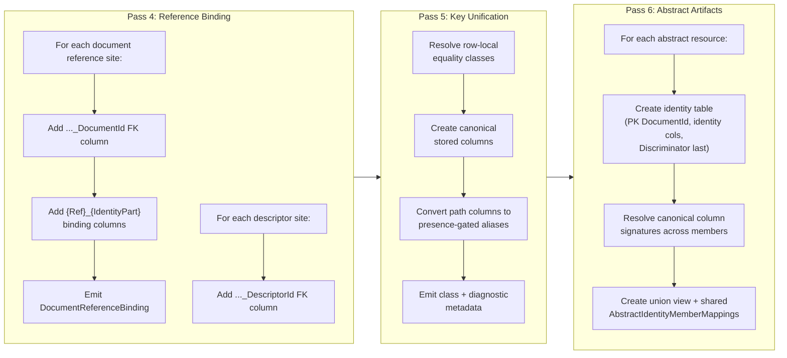
```mermaid
flowchart LR
    subgraph P4["Pass 4: Reference Binding"]
        direction TB
        P4A["For each document reference site:"]
        P4B["Add ..._DocumentId FK column"]
        P4C["Add {Ref}_{IdentityPart}<br/>binding columns"]
        P4D["Emit DocumentReferenceBinding"]
        P4E["For each descriptor site:"]
        P4F["Add ..._DescriptorId FK column"]
        P4A --> P4B --> P4C --> P4D
        P4E --> P4F
    end

    subgraph P5["Pass 5: Key Unification"]
        direction TB
        P5A["Resolve row-local<br/>equality classes"]
        P5B["Create canonical<br/>stored columns"]
        P5C["Convert path columns to<br/>presence-gated aliases"]
        P5D["Emit class + diagnostic<br/>metadata"]
        P5A --> P5B --> P5C --> P5D
    end

    subgraph P6["Pass 6: Abstract Artifacts"]
        direction TB
        P6A["For each abstract resource:"]
        P6B["Create identity table<br/>(PK DocumentId, identity cols,<br/>Discriminator last)"]
        P6C["Resolve canonical column<br/>signatures across members"]
        P6D["Create union view + shared<br/>AbstractIdentityMemberMappings"]
        P6A --> P6B --> P6C --> P6D
    end

    P4 --> P5 --> P6
```

### Group C: Constraints and Propagation

Derives uniqueness/referential constraints, provider actions, and the executor requirements that make future-identity
request bindings executable through the API.

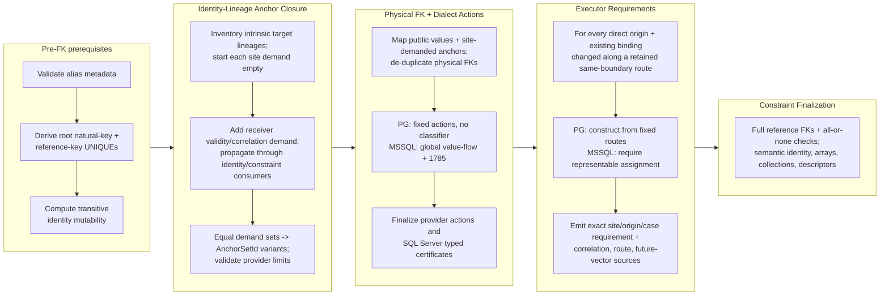
```mermaid
flowchart LR
    subgraph P7["Pre-FK prerequisites"]
        direction TB
        P7A["Validate alias metadata"]
        P7B["Derive root natural-key +<br/>reference-key UNIQUEs"]
        P7C["Compute transitive<br/>identity mutability"]
        P7A --> P7B --> P7C
    end

    subgraph P8["Identity-Lineage Anchor Closure"]
        direction TB
        P8A["Inventory intrinsic target lineages;<br/>start each site demand empty"]
        P8B["Add receiver validity/correlation demand;<br/>propagate through identity/constraint consumers"]
        P8C["Equal demand sets -> AnchorSetId variants;<br/>validate provider limits"]
        P8A --> P8B --> P8C
    end

    subgraph P9["Physical FK + Dialect Actions"]
        direction TB
        P9A["Map public values + site-demanded anchors;<br/>de-duplicate physical FKs"]
        P9B["PG: fixed actions, no classifier<br/>MSSQL: global value-flow + 1785"]
        P9C["Finalize provider actions and<br/>SQL Server typed certificates"]
        P9A --> P9B --> P9C
    end

    subgraph P10["Executor Requirements"]
        direction TB
        P10A["For every direct origin + existing binding<br/>changed along a retained same-boundary route"]
        P10B["PG: construct from fixed routes<br/>MSSQL: require representable assignment"]
        P10C["Emit exact site/origin/case requirement +<br/>correlation, route, future-vector sources"]
        P10A --> P10B --> P10C
    end

    subgraph P11["Constraint Finalization"]
        direction TB
        P11A["Full reference FKs + all-or-none checks;<br/>semantic identity, arrays, collections, descriptors"]
    end

    P7 --> P8 --> P9 --> P10 --> P11
```

The retained acyclic `R -> T -> RChild` fixture is a required counterexample to certificate-only selection: a direct R
identity update changes T along a retained route while multiple existing child bindings submit T's future identity. Both
providers emit batched plans even though the child FK remains `CASCADE`; the future vector combines an origin-written
item with a locked unchanged target primitive/anchor, and a wrong unchanged value fails before DML.

### Group D: Naming, Inventories, and Finalization

Makes identifiers safe for the target engine and deterministic.

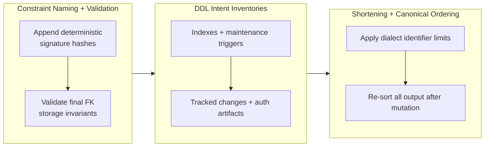
```mermaid
flowchart LR
    subgraph GDA["Constraint Naming + Validation"]
        direction TB
        GDA1["Append deterministic<br/>signature hashes"]
        GDA2["Validate final FK<br/>storage invariants"]
        GDA1 --> GDA2
    end

    subgraph GDB["DDL Intent Inventories"]
        direction TB
        GDB1["Indexes + maintenance triggers"]
        GDB2["Tracked changes + auth artifacts"]
        GDB1 --> GDB2
    end

    subgraph GDC["Shortening + Canonical Ordering"]
        direction TB
        GDC1["Apply dialect identifier limits"]
        GDC2["Re-sort all output after mutation"]
        GDC1 --> GDC2
    end

    GDA --> GDB --> GDC
```

---

## Putting It All Together

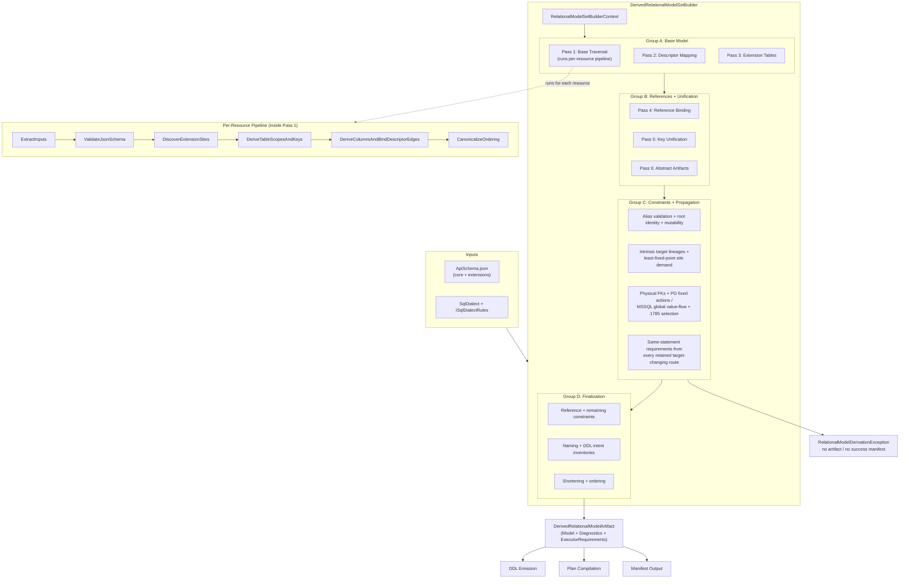
```mermaid
flowchart TD
    subgraph Inputs["Inputs"]
        API["ApiSchema.json<br/>(core + extensions)"]
        DI["SqlDialect + ISqlDialectRules"]
    end

    subgraph SetBuilder["DerivedRelationalModelSetBuilder"]
        CTX["RelationalModelSetBuilderContext"]

        subgraph GroupA["Group A: Base Model"]
            P1["Pass 1: Base Traversal<br/>(runs per-resource pipeline)"]
            P2["Pass 2: Descriptor Mapping"]
            P3["Pass 3: Extension Tables"]
        end

        subgraph GroupB["Group B: References + Unification"]
            P4["Pass 4: Reference Binding"]
            P5["Pass 5: Key Unification"]
            P6["Pass 6: Abstract Artifacts"]
        end

        subgraph GroupC["Group C: Constraints + Propagation"]
            P7["Alias validation + root identity + mutability"]
            P8["Intrinsic target lineages +<br/>least-fixed-point site demand"]
            P9["Physical FKs + PG fixed actions /<br/>MSSQL global value-flow + 1785 selection"]
            P10["Same-statement requirements from<br/>every retained target-changing route"]
        end

        subgraph GroupD["Group D: Finalization"]
            P11["Reference + remaining constraints"]
            P12["Naming + DDL intent inventories"]
            P13["Shortening + ordering"]
        end

        CTX --> GroupA --> GroupB --> GroupC --> GroupD
    end

    subgraph PerResourcePipeline["Per-Resource Pipeline (inside Pass 1)"]
        S1["ExtractInputs"]
        S2["ValidateJsonSchema"]
        S3["DiscoverExtensionSites"]
        S4["DeriveTableScopesAndKeys"]
        S5["DeriveColumnsAndBindDescriptorEdges"]
        S6["CanonicalizeOrdering"]
        S1 --> S2 --> S3 --> S4 --> S5 --> S6
    end

    P1 -.->|"runs for each resource"| PerResourcePipeline

    Inputs --> SetBuilder

    GroupD --> RESULT["DerivedRelationalModelArtifact<br/>(Model + Diagnostics + ExecutorRequirements)"]
    GroupC --> FAILURE["RelationalModelDerivationException<br/>no artifact / no success manifest"]

    RESULT --> DDL["DDL Emission"]
    RESULT --> PLANS["Plan Compilation"]
    RESULT --> MAN["Manifest Output"]
```

---

## Key Design Decisions

| Decision | Rationale |
|----------|-----------|
| **Ordered passes, not visitors** | Dependencies between passes are explicit in ordering; no DAG resolution needed |
| **Mutable context, immutable output** | Passes freely mutate shared state; `BuildArtifact()` freezes `Model`, `Diagnostics`, and `ExecutorRequirements` together |
| **Per-resource pipeline inside Pass 1** | Base traversal is resource-local; cross-resource concerns live in later passes |
| **Constraint passes after reference binding** | FK constraints need reference columns to already exist |
| **Physical FK de-duplication before actions** | Logical-reference duplication and action choice cannot create duplicate physical constraints |
| **Site-specific identity-lineage demand** | Targets store intrinsic lineages; incoming demand starts empty and grows only for receiver validity/correlation; equal sets share `AnchorSetId` variants |
| **Explicit provider split** | PostgreSQL uses fixed actions without DMS classification; SQL Server alone proves value flow and globally breaks error-1785 cycles/diamonds |
| **Route-driven executor requirements** | Every direct API origin and existing binding changed along a retained same-boundary route is considered, including retained acyclic `CASCADE` bindings on both providers |
| **Typed failure separate from artifact** | SQL Server failures throw structured exceptions; consumers never receive an unsafe partial model |
| **Shared DMS/MetaEd conformance corpus** | Fixtures have separate `metaEd`, `dmsPostgresql`, and `dmsSqlServer` outcomes |
| **Cross-scope equality stays separate** | Root-to-child equality propagation is not a physical FK edge and cannot satisfy a coverage obligation |
| **Pre-production v1 contract** | Keep `RelationalMappingVersion = v1`; add no migration, compatibility discriminator, or physical-model hash |
| **Naming passes last** | All semantic derivation completes before identifier shortening and hashing |
| **Canonical ordering at both levels** | Per-resource pipeline orders once; final pass re-orders after mutation |

---

## Epic Story Mapping

| Pass | Story | Description |
|------|-------|-------------|
| 1. Base Traversal | DMS-929 | JSON schema → base tables/columns |
| 2. Descriptor Mapping | DMS-942 | Descriptor → `dms.Descriptor` storage |
| 3. Extension Tables | DMS-932, DMS-1035 | `_ext` relational mapping + common-type extensions |
| 4. Reference Binding | DMS-930 | References/descriptors + identity columns |
| 5. Key Unification | DMS-1033 | Canonical storage + presence-gated aliases |
| 6. Abstract Artifacts | DMS-933 | Abstract identity tables + union views + shared concrete-member mappings |
| Reference prerequisites | DMS-930 | Root identity constraints + transitive mutability |
| Anchor demand + physical FK/action phases | DMS-1258 | Intrinsic lineage inventory, least-demand `AnchorSetId` variants, PostgreSQL fixed actions, SQL Server global cycle/diamond breaking + typed certificates/composition proofs |
| Same-statement executor requirements | DMS-1258 | Provider-finalized site/origin/case requirements from retained target-changing routes, including the retained acyclic child case |
| Downstream constraints/naming | DMS-930, DMS-931 | Array/descriptor constraints + dialect naming |
| Shortening/ordering | DMS-931, DMS-934 | Engine identifier limits + deterministic output |
| Set Builder | DMS-1033 | Orchestrates all passes |
| Index/Trigger Inventory | DMS-945 | Deterministic index + trigger derivation |
