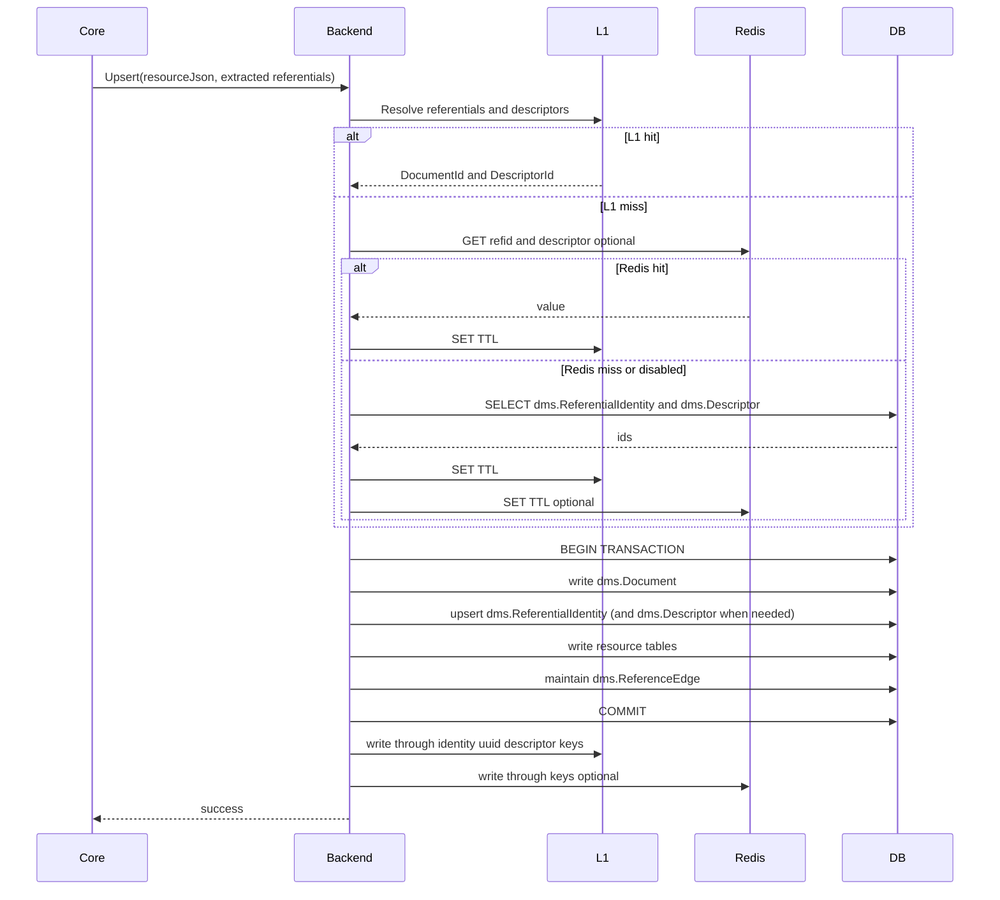
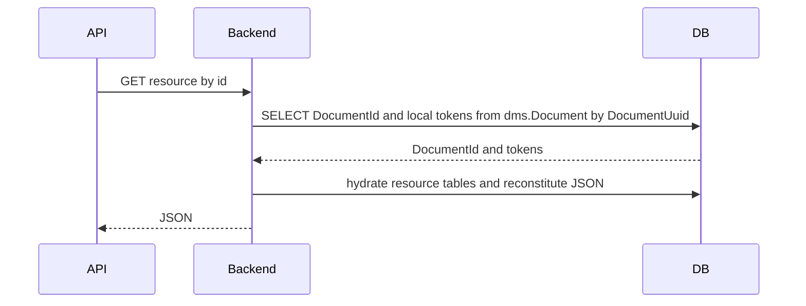

# Backend Redesign: Transactions, Concurrency, and Cascades

## Status

Draft.

This document is the transactions/concurrency deep dive for `overview.md`, focusing on identity-correctness locking, derived-index maintenance (`dms.ReferentialIdentity`), and operational caching.

- Overview: [overview.md](overview.md)
- Update tracking: [update-tracking.md](update-tracking.md)
- Data model: [data-model.md](data-model.md)
- Flattening & reconstitution deep dive: [flattening-reconstitution.md](flattening-reconstitution.md)
- Extensions: [extensions.md](extensions.md)
- DDL Generation: [ddl-generation.md](ddl-generation.md)
- AOT compilation (optional mapping pack distribution): [aot-compilation.md](aot-compilation.md)
- Strengths and risks: [strengths-risks.md](strengths-risks.md)

## Table of Contents

- [Reference Validation](#reference-validation)
- [How `ApiSchema.json` Drives This Design](#how-apischemajson-drives-this-design)
- [Write Path (POST Upsert / PUT by id)](#write-path-post-upsert--put-by-id)
- [Read Path (GET by id / GET query)](#read-path-get-by-id--get-query)
- [Caching (Low-Complexity Options)](#caching-low-complexity-options)
- [Optional Database Projection: `dms.DocumentCache`](#optional-database-projection-dmsdocumentcache)
- [Delete Path (DELETE by id)](#delete-path-delete-by-id)
- [Schema Validation (EffectiveSchema)](#schema-validation-effectiveschema)
- [Operational Considerations](#operational-considerations)

---

## Reference Validation

Reference validation is provided by **two layers** (mirroring what the current `Reference` table + FK does, but in a relational way):

### 1) Write-time validation (application-level)

During POST/PUT processing, the backend:
- Resolves each extracted reference (`DocumentReference` / `DescriptorReference`) to a target `DocumentId` using an ApiSchema-derived “natural-key resolver”:
  - resolve by `dms.ReferentialIdentity` (`ReferentialId → DocumentId`) for **all** identities (self-contained, reference-bearing, and polymorphic/abstract via superclass alias rows).
- Fails the request if any referenced identity does not exist (same semantics as today: descriptor failures vs resource reference failures).

This is required because the relational tables store **`DocumentId` foreign keys**, and we cannot write those without resolving them.

#### ApiSchema-derived natural-key resolver

The **natural-key resolver** is the backend service that converts a `(Project, Resource, DocumentIdentity)` triple into a persisted `DocumentId` **without per-resource code**.

This design keeps `ReferentialId` as the canonical “natural identity key” that the resolver uses for `ReferentialId → DocumentId` lookups; see [overview.md#Why keep ReferentialId](overview.md#why-keep-referentialid).

It is used for:
- resolving extracted `DocumentReference` / `DescriptorReference` instances during writes
- POST upsert existence detection (always via `dms.ReferentialIdentity`)
- query-time resolution when a filter targets a referenced identity

**Inputs**
- `QualifiedResourceName` of the target (from `DocumentReference.ResourceInfo` / `DescriptorReference.ResourceInfo`)
- `DocumentIdentity` (ordered `IdentityJsonPath → string value` pairs)
- the request-local `ReferentialId` (already computed by Core for writes; optional for query-time and computable deterministically using the same UUIDv5 algorithm as Core)
- optional “location” info for error reporting (e.g., concrete JSON path instance from Core extraction)

**Outputs**
- `DocumentId` when found
- “not found” when no matching row exists (write-time: validation failure; query-time: empty-match behavior)

##### Plan compilation (per resource)

No resource-specific SQL is required for identity resolution: all lookups are via `dms.ReferentialIdentity`.

ApiSchema is still used to:
- compute `ReferentialId` deterministically (Core does this for writes; backend can do it for query-time), and
- determine polymorphic/superclass targets so `dms.ReferentialIdentity` alias rows are present and used correctly.

##### Resolution algorithm (bulk, request-scoped)

1. Dedupe referential ids across all extracted references.
2. Resolve in bulk via `dms.ReferentialIdentity` (`ReferentialId → DocumentId`).
3. For descriptor references, validate “is a descriptor” (and optional descriptor type) via `dms.Descriptor`.

##### Caching

The resolver uses layered caching:
- **Per-request memoization** (always): avoids duplicate work within one request.
- Optional L1/L2 caches (after-commit population only):
  - `ReferentialId → DocumentId`

When identity updates occur, any cross-request cache of `ReferentialId → DocumentId` must be updated/evicted for all affected keys after commit.

### 2) Database enforcement (FKs)

Relational tables store references as FKs so the database enforces referential integrity:

- **Concrete non-descriptor references**: FK to the **target resource table**, e.g. `FK(StudentSchoolAssociation.School_DocumentId → edfi.School.DocumentId)`. This validates both existence and type.
- **Descriptor references**: FK directly to `dms.Descriptor`. This validates existence (“is a descriptor”); `Discriminator` supports type validation in the application (or via optional triggers).
- **Polymorphic references** (e.g., `EducationOrganization`): a single FK to a concrete table is not possible. Baseline enforcement is:
  - FK to `dms.Document(DocumentId)` (existence)
  - Application validation uses `{AbstractResource}_View` (a union view derived from `ApiSchema.json` `abstractResources`) to ensure the referenced `DocumentId` is a member of the allowed hierarchy and to obtain a discriminator for diagnostics (see [data-model.md](data-model.md))

Optional: add a trigger to enforce the same membership check in the database by validating `EXISTS (SELECT 1 FROM {AbstractResource}_View WHERE DocumentId = <fk>)` on insert/update.

### Delete conflicts

Deletes rely on the same FK graph:
- If a document is referenced, `DELETE` fails with an FK violation; DMS maps that to a `409` conflict.
- Baseline: because FK names are deterministic, DMS can map the violated constraint back to a referencing resource/table to produce a conflict response.
- `dms.ReferenceEdge` can optionally be used for diagnostics:
  - `SELECT ParentDocumentId FROM dms.ReferenceEdge WHERE ChildDocumentId = @deletedDocumentId`
  - join `dms.Document` to report referencing resource types
  - this avoids scanning all resource tables and produces more consistent diagnostics across engines.
  - note: `dms.ReferenceEdge` excludes descriptor FKs in this redesign (descriptors are treated as immutable), so it is not a complete “who references this descriptor?” index.


## How `ApiSchema.json` Drives This Design

The design uses existing metadata and adds minimal new hints to avoid embedding full “flattening metadata” if we can derive it.

Deep dive on derived mapping and the minimal `ApiSchema.json` additions: [flattening-reconstitution.md](flattening-reconstitution.md) (sections 2–4).

### Existing ApiSchema inputs (already present)

- `jsonSchemaForInsert`: authoritative shape, types, formats, maxLength, required
- `identityJsonPaths`: natural key extraction and uniqueness
- `documentPathsMapping`: identifies references vs scalars vs descriptor paths, plus reference identity mapping
- `decimalPropertyValidationInfos`: precision/scale for `decimal`
- `arrayUniquenessConstraints`: relational unique constraints for collection tables
- `abstractResources`: abstract identity metadata for polymorphic reference targets (used for union-view identity projection on reads and polymorphic membership validation)
- `isSubclass` + superclass metadata: drives insertion of one superclass/abstract alias referential id (documents have ≤ 2 referential ids)
- `queryFieldMapping`: defines queryable fields and their JSON paths/types, and is constrained to paths that map to root-table columns (no array/child-table predicates). **MetaEd enforces this** (no `[*]` in `queryFieldMapping` paths).

### Optional ApiSchema additions

This redesign proposes a small, optional `resourceSchema.relational` block to support stable physical naming without enumerating full “flattening metadata”. See [flattening-reconstitution.md](flattening-reconstitution.md) (section 3) for the proposed shape and semantics.


## Write Path (POST Upsert / PUT by id)

Deep dive on flattening execution and write-planning: [flattening-reconstitution.md](flattening-reconstitution.md) (section 5).

### Common steps

1. Core validates JSON and extracts:
   - `DocumentIdentity` + `ReferentialId`
   - Document references (with `ReferentialId`s)
   - Descriptor references (with `ReferentialId`s, normalized URI)
2. Backend resolves references in bulk:
   - Use an ApiSchema-derived resolver to turn references into `DocumentId`s via `dms.ReferentialIdentity` (`ReferentialId → DocumentId`), including:
     - self-contained identities
     - reference-bearing identities (required; kept current via cascading recompute)
     - polymorphic/abstract identities via superclass/abstract alias rows in `dms.ReferentialIdentity`
   - Descriptor refs additionally require a `dms.Descriptor` existence/type check (for “is a descriptor” enforcement)
3. Backend acquires identity locks:
   - Acquire **shared locks** on `dms.IdentityLock` rows for any **identity-component** referenced `ChildDocumentId`s from **document references** (from ApiSchema-derived bindings) *before* acquiring the parent document’s update lock. This prevents “stale-at-birth” derived identities and avoids deadlocks with concurrent identity-cascade transactions.
     - Descriptor identity components do not require locks because descriptor documents are treated as immutable in this redesign.
   - Acquire an **update lock** on this document’s `dms.IdentityLock` row (insert the row first for inserts).
   - See [Phantom-safe impacted-set locking](#phantom-safe-impacted-set-locking) for the normative lock ordering + algorithms.
4. Backend writes within a single transaction:
   - `dms.Document` insert/update (resource identity + local token stamps; see [update-tracking.md](update-tracking.md))
   - `dms.ReferentialIdentity` upsert (primary + superclass aliases) for all resource identities (self-contained and reference-bearing)
   - Resource root + child tables (using replace strategy for collections)
   - `dms.Descriptor` upsert if the resource is a descriptor
   - Maintain `dms.ReferenceEdge` rows for this document (outgoing non-descriptor references only; descriptors are treated as immutable and excluded):
     - required to drive `dms.ReferentialIdentity` cascades (`IsIdentityComponent=true`)
     - required for update tracking / Change Queries (see [update-tracking.md](update-tracking.md))
     - used for diagnostics (“who references me?”)

#### Maintaining `dms.ReferenceEdge` (identity cascades and diagnostics; low-churn)

`dms.ReferenceEdge` is maintained as a **reverse lookup index** for:
- `dms.ReferentialIdentity` cascading recompute when upstream identity components change (`IsIdentityComponent=true`)
- delete conflict diagnostics (“who references me?”)

**Write strategy**

Two correct approaches:

1) **Simple replace** (initial implementation)
   - `DELETE FROM dms.ReferenceEdge WHERE ParentDocumentId=@parent`
   - bulk insert the current edges

2) **Diff-based upsert** (recommended to address churn concerns)
   - Stage the current edges into a temp table
   - Insert missing edges
   - Delete stale edges
   - If the reference set did not change, this performs **zero** writes to `dms.ReferenceEdge`

**PostgreSQL example (diff-based)**

```sql
-- Per-session staging table
CREATE TEMP TABLE IF NOT EXISTS reference_edge_stage (
  ChildDocumentId bigint NOT NULL PRIMARY KEY,
  IsIdentityComponent boolean NOT NULL
) ON COMMIT DELETE ROWS;

-- For each invocation (within the same transaction as the resource write):
DELETE FROM reference_edge_stage;

-- Stage current edges (already deduped by ChildDocumentId; IsIdentityComponent is OR'd in application code)
INSERT INTO reference_edge_stage (ChildDocumentId, IsIdentityComponent)
VALUES
  (@ChildDocumentId1, @IsIdentityComponent1),
  (@ChildDocumentId2, @IsIdentityComponent2);

-- Insert missing edges
INSERT INTO dms.ReferenceEdge (ParentDocumentId, ChildDocumentId, IsIdentityComponent)
SELECT @ParentDocumentId, s.ChildDocumentId, s.IsIdentityComponent
FROM reference_edge_stage s
LEFT JOIN dms.ReferenceEdge e
  ON e.ParentDocumentId = @ParentDocumentId
 AND e.ChildDocumentId = s.ChildDocumentId
WHERE e.ParentDocumentId IS NULL;

-- Update IsIdentityComponent when it changes (collapsed edge granularity)
UPDATE dms.ReferenceEdge e
SET IsIdentityComponent = s.IsIdentityComponent
FROM reference_edge_stage s
WHERE e.ParentDocumentId = @ParentDocumentId
  AND e.ChildDocumentId  = s.ChildDocumentId
  AND e.IsIdentityComponent IS DISTINCT FROM s.IsIdentityComponent;

-- Delete stale edges
DELETE FROM dms.ReferenceEdge e
WHERE e.ParentDocumentId = @ParentDocumentId
  AND NOT EXISTS (
    SELECT 1
    FROM reference_edge_stage s
    WHERE s.ChildDocumentId = e.ChildDocumentId
  );
```

**SQL Server sketch (diff-based)**
- Use a `#reference_edge_stage` temp table or a table-valued parameter.
- Use `INSERT ... WHERE NOT EXISTS` + `UPDATE ... FROM` + `DELETE ... WHERE NOT EXISTS` (avoid `MERGE` unless you have strong operational confidence in its behavior under concurrency).

##### Correctness requirement: `dms.ReferenceEdge` must be complete

This redesign makes `dms.ReferenceEdge` a **strict** dependency index:

- `dms.ReferenceEdge` is the only reverse index used to compute:
  - the **identity-dependency closure** for `dms.ReferentialIdentity` recompute (`IsIdentityComponent=true`), and
  - reverse dependency expansion for representation update tracking and change queries (see [update-tracking.md](update-tracking.md)).
- If an outgoing reference is missing an edge, then upstream changes will silently miss dependents:
  - stale `dms.ReferentialIdentity` rows (identity-based upsert/reference resolution becomes incorrect), and
  - stale cached projections and incomplete change-query results (if those features are enabled).

**Definition of completeness (for one parent document)**

For a given `ParentDocumentId`, the set of edges in `dms.ReferenceEdge` must equal the set implied by relational storage:

- For every distinct non-null referenced `ChildDocumentId` produced by any document-reference FK column (`..._DocumentId`) in any root/child table row belonging to the parent document, there exists a corresponding `(ParentDocumentId, ChildDocumentId)` row.
- No extras: `dms.ReferenceEdge` must not contain a `(ParentDocumentId, ChildDocumentId)` row where `ChildDocumentId` does not appear in any document-reference FK column (`..._DocumentId`) for the parent document (descriptor FK columns are intentionally excluded).
- `IsIdentityComponent` must match the ApiSchema-derived classification **aggregated by child**:
  - it is `true` iff at least one document-reference FK binding that produced this `ChildDocumentId` is an identity component.

**Design ideas to make completeness provable**

1) **By-construction edge extraction (preferred default)**
   - Make edge extraction *structural*: derive edges from the same `ResourceWritePlan` column bindings used to populate FK columns.
	   - Avoid ad-hoc `edges.Add(...)` calls scattered across code paths.
	   - Recommended implementation pattern:
	     - Each `DocumentFk` column in the compiled model carries `IsIdentityComponent` (descriptor FK columns do not participate in `dms.ReferenceEdge` in this redesign).
	     - During row materialization, when a document FK column value is produced (non-null), merge an edge keyed by `ChildDocumentId`, OR-ing `IsIdentityComponent` when multiple FK sites reference the same child.
	   - Plan compilation/startup validation fails fast if:
	     - any ApiSchema reference path cannot be mapped to exactly one document FK column + `IsIdentityComponent` classification.
	     - any ApiSchema descriptor path cannot be mapped to exactly one descriptor FK column + expected descriptor resource type.

2) **Optional in-transaction verification (provable correctness mode, but slow)**
   - In strict environments (or in CI/tests), add a verification step that compares:
     - the staged edge set for this write (what we intend to persist), vs
     - the expected edge set derived from **reading the persisted FK columns** for this `ParentDocumentId`.
   - If there is any mismatch, fail the transaction (no “best effort” window).

   A cross-engine sketch:
   - Stage intended edges: `reference_edge_stage(ChildDocumentId, IsIdentityComponent)`.
   - Populate `reference_edge_expected(ChildDocumentId, IsIdentityComponent)` via a compiled “edge projection query”:
     - one `SELECT` per FK column, filtered to `ParentDocumentId`, with a constant `IsIdentityComponent`,
     - `UNION ALL` across all FK columns in all tables for that resource, then `GROUP BY ChildDocumentId` with `bool_or`/`MAX` to aggregate.
   - Detect mismatch with set differences (`EXCEPT` works on both PostgreSQL and SQL Server):
     - missing edges: `expected EXCEPT stage`
     - extra edges: `stage EXCEPT expected`

   Notes:
   - This verification is expensive if done on every write for very large documents, so it should be configurable (e.g., on in test/CI; sampling or “debug mode” in prod).
   - Even without full verification, a cheap invariant check is to ensure that the number of edges is within an expected range per resource type (guardrail telemetry), but only set-equality gives provable completeness.

3) **Background auditing + repair tooling**
   - Provide an admin job/tool that can:
     - recompute `dms.ReferenceEdge` from relational FK columns for a document (or for all documents), and
     - optionally trigger corresponding recompute of derived artifacts (e.g., `dms.ReferentialIdentity`) for impacted documents.
   - This is essential as a recovery mechanism if a bug ever shipped that produced incomplete edges.

### Insert vs update detection

- **Upsert (POST)**: detect an existing row by resolving the request’s `ReferentialId` via `dms.ReferentialIdentity` (`ReferentialId → DocumentId`).
  - The resource root table’s natural-key unique constraint remains a recommended relational guardrail and is still useful for race detection (unique violation → 409) if two writers attempt to create the same natural key concurrently.
- **Update by id (PUT)**: detect by `DocumentUuid`:
  - Find `DocumentId` from `dms.Document` by `DocumentUuid`.

### Identity updates (AllowIdentityUpdates)

If identity changes on update:
- Treat `dms.ReferentialIdentity` as a derived index and recompute it **transactionally**:
  - update this document’s own referential id mappings (primary + superclass alias), and
  - cascade recompute to any documents whose identities depend on this document (transitively) via `dms.ReferenceEdge` where `IsIdentityComponent=true`.
  - Use `dms.IdentityLock` row-lock orchestration (no global lock) to prevent phantoms and to ensure referential ids are never stale after commit.
- References stored as FKs (`DocumentId`) remain valid; no cascading rewrite needed.

### Cascade scenarios (tables-per-resource)

Tables-per-resource storage removes the need for **relational** cascade rewrites when upstream natural keys change, because relationships are stored as stable `DocumentId` FKs. Cascades still exist for **derived artifacts** (identity keys, caches, diagnostics), and should be handled explicitly:

- **Identity/URI change on the document itself** (e.g., `StudentUniqueId` update)
  - Do not rewrite referencing rows: FKs remain correct.
  - Compute and lock the **impacted identity set** (this document, plus all transitive parents over `dms.ReferenceEdge` where `IsIdentityComponent=true`) using `dms.IdentityLock` row-lock orchestration (expand-and-lock to a fixpoint to prevent phantoms).
  - Recompute and upsert `dms.ReferentialIdentity` for every impacted document (primary + superclass/abstract alias rows) in the same transaction, so `ReferentialId → DocumentId` lookups are never stale after commit (even for reference-bearing identities).
  - No rewrite of `dms.ReferenceEdge` rows is required for identity/URI changes: edges store `DocumentId`s and only change when outgoing references change.
  - Update/evict any caching after commit (e.g., `ReferentialId → DocumentId`, `DocumentUuid → DocumentId`, descriptor expansion).
  - If `dms.DocumentCache` is enabled, schedule rebuild/invalidation for any cached rows whose JSON representation is impacted (see `dms.DocumentCache` section below).

- **Outgoing document-reference set changes on a document** (`..._DocumentId` FK values change)
  - Relational writes update the FK columns as usual.
  - Maintain `dms.ReferenceEdge` for the parent with a diff-based upsert (avoid churn on no-op updates).

- **Representation update tracking (`_etag/_lastModifiedDate`, ChangeVersion)**
  - DMS derives representation metadata at read time from per-document tokens plus dependency identity tokens (no write-time fan-out bump cascades).
  - Identity/URI changes still cascade *logically* (dependents’ representations change), but update tracking is handled via derived tokens and journals rather than cross-document updates; see [update-tracking.md](update-tracking.md).

- **Deletes**
  - Correctness is enforced by the FK graph (delete cascades or fails with FK violation).
  - For richer “who references me?” diagnostics, use `dms.ReferenceEdge` (instead of deterministic FK-name mapping).

### Concurrency (If-Match)

With derived `_etag`, optimistic concurrency is implemented by:
- computing the current derived `_etag` for the document (including dependency identity tokens), and
- performing the write under the same identity-lock ordering used for identity correctness.

See [update-tracking.md](update-tracking.md) (“Optimistic concurrency (`If-Match`)”) for the normative algorithm and lock requirements.


## Read Path (GET by id / GET query)

Deep dive on reconstitution execution and read-planning: [flattening-reconstitution.md](flattening-reconstitution.md) (section 6).

### GET by id

1. Resolve `DocumentUuid` → `DocumentId` via `dms.Document`.
2. Reconstitute JSON from relational tables and return it.

The returned JSON representation must preserve:
- Array order (via `Ordinal`)
- Required vs optional properties
- The API surface properties (`id`, `_etag`, `_lastModifiedDate`)

### Query

Filter directly on **resource root table columns** and (when needed) resolve reference/descriptor query terms to `DocumentId`s.

Contract/clarification:
- `queryFieldMapping` is constrained in ApiSchema to **root-table** paths (no JSON paths that cross an array boundary like `[*]`). This constraint is enforced by **MetaEd** at schema generation time, so query compilation does not need child-table `EXISTS (...)` / join predicate support.
- Backend model compilation should still fail fast if any `queryFieldMapping` path cannot be mapped to a root-table column.

Ordering/paging contract:
- Collection GET results are ordered by the **resource root table’s** `DocumentId` (ascending).
- This is an acceptable ordering contract because `DocumentId` is a monotonic identity value allocated at insert time and therefore roughly correlates with created order.
- Pagination applies to that ordering (`offset` skips N rows in `DocumentId` order; `limit` bounds the page size).
- Paging queries are executed against the **resource root table**, not against `dms.Document`.
- Response materialization joins the page’s `DocumentId`s to `dms.Document` to obtain `id` (`DocumentUuid`), then derives `_etag/_lastModifiedDate` per [update-tracking.md](update-tracking.md).

1. Translate query parameters to typed filters using Core’s canonicalization rules (`ValidateQueryMiddleware` → `QueryElement[]`).
2. Build a SQL predicate plan from `ApiSchema`:
   - **Scalar query fields**: `queryFieldMapping` JSON path → derived root-table column → `r.Column = @value`
   - **Descriptor query fields** (e.g., `schoolTypeDescriptor`): normalize URI, compute descriptor `ReferentialId` (descriptor resource type from `ApiSchema` + normalized URI) → resolve `DocumentId` via `dms.ReferentialIdentity` → `r.DescriptorIdColumn = @descriptorDocumentId`
   - **Document reference query fields** (e.g., `studentUniqueId` on `StudentSchoolAssociation`): resolve the referenced resource identity → referenced `DocumentId` (or set of `DocumentId`s) → `r.Student_DocumentId = @documentId` (or `IN (...)`)
3. Execute a `DocumentId` page query:
   - `SELECT r.DocumentId FROM {schema}.{Resource} r`
   - Apply compiled predicates (intersection/AND across query terms; OR within a single query field if it maps to multiple JSON paths/columns)
   - Apply ordering and paging (`ORDER BY r.DocumentId OFFSET @offset LIMIT @limit`)

Example (PostgreSQL) - filter Students by `lastSurname`, return the page starting at offset 50:

```sql
SELECT r.DocumentId
FROM edfi.Student AS r
WHERE r.LastSurname = @LastSurname
ORDER BY r.DocumentId
OFFSET 50
LIMIT @Limit;
```

Then join the page to `dms.Document` (for `id` / local tokens). Representation metadata (`_etag/_lastModifiedDate`) is derived per [update-tracking.md](update-tracking.md).

```sql
WITH page AS (
  SELECT r.DocumentId
  FROM edfi.Student AS r
  WHERE r.LastSurname = @LastSurname
  ORDER BY r.DocumentId
  OFFSET @Offset
  LIMIT @Limit
)
SELECT
  p.DocumentId,
  d.DocumentUuid,
  d.ContentVersion,
  d.IdentityVersion,
  d.ContentLastModifiedAt,
  d.IdentityLastModifiedAt
FROM page p
JOIN dms.Document d ON d.DocumentId = p.DocumentId
ORDER BY p.DocumentId;
```

4. Fetch documents:
   - Reconstitute from relational tables (page-based hydration; see [flattening-reconstitution.md](flattening-reconstitution.md)).

Reference/descriptor resolution is metadata-driven (no per-resource code):
- For **descriptor** query params: compute the descriptor `ReferentialId` (descriptor resource type from `ApiSchema` + normalized URI) and resolve `DocumentId` via `dms.ReferentialIdentity`.
- For **document reference** query params: use `documentPathsMapping.referenceJsonPaths` to group query terms by reference, and:
  - If all referenced identity components are present, resolve a single referenced `DocumentId` via `dms.ReferentialIdentity` by computing the referenced resource’s `ReferentialId`.
  - If only a subset is present, resolve a *set* of referenced `DocumentId`s by filtering the referenced root table using the available identity components (including resolving any referenced identity components that are present), then filter the FK column with `IN (subquery)` (or an equivalent join).

Indexing:
- Ensure a supporting index exists for every foreign key (including composite parent/child FKs and `..._DocumentId` / `..._DescriptorId` FKs). See [ddl-generation.md](ddl-generation.md) (“FK index policy”).
- Rely on existing unique/identity indexes on referenced resource natural-key columns (and on `dms.ReferentialIdentity.ReferentialId`) to make reference resolution fast.


## Caching (Low-Complexity Options)

### Recommended cache targets

1. **Derived relational mapping (from `ApiSchema`)**
   - Cache the derived mapping per `(EffectiveSchemaHash, ProjectName, ResourceName)`.
   - Includes: JsonPath→(table,column), collection table names, query param→column/type plan, and prepared SQL templates.
   - Invalidation: effective schema change + restart (natural).

2. **`dms.ReferentialIdentity` lookups**
   - Cache `ReferentialId → DocumentId` for identity/reference resolution (all identities, including reference-bearing and abstract/superclass aliases).
   - Invalidation:
     - on insert: add cache entry after commit
     - on identity/URI change: evict old `ReferentialId` keys and write new mappings after commit (note: identity cascades can touch many documents; if you cannot evict/update impacted keys reliably, disable this cache or treat it as best-effort and fall back to DB for correctness)
     - on delete: remove relevant entries (or rely on short TTL)

3. **Descriptor expansion lookups** (optional)
   - Cache `DescriptorDocumentId → Uri` (and optionally `Discriminator`) to reconstitute descriptor strings without repeated joins.
   - Descriptor resolution/validation itself is via `dms.ReferentialIdentity` and is covered by cache #2 (descriptor referential ids are regular referential ids).

4. **`DocumentUuid → DocumentId`**
   - Cache GET/PUT/DELETE resolution.
   - Invalidation: add on insert, remove on delete (or rely on TTL).

### Cache keying strategy

- Always include `(DmsInstanceId)` in cache keys.
- For Redis, prefix keys with `dms:{DmsInstanceId}:...`.

### Local-only (per-node) option

Use an in-process `MemoryCache`:
- Lowest complexity; no network hop.
- Good for: derived mapping, `ReferentialId → DocumentId` (including descriptor referential ids), descriptor expansion.


### Redis (distributed) option

Add Redis as an optional L2 cache:
- Reduces DB round-trips across nodes for hot lookups.
  - Keep it simple:
    - cache-aside reads
    - write-through updates after successful commit

Invalidation approaches (choose one):
- **TTL-only** (simplest): acceptable for non-critical caches; for `ReferentialId → DocumentId` TTL-only staleness can cause incorrect resolution due to identity updates/cascades
- **Best-effort delete on writes**: on identity updates/deletes, delete affected Redis keys after commit.
- Optional later: pub/sub “invalidate key” messages to reduce staleness for local L1 caches.

### Invalidation rules (recommended)

- **Successful write transaction commit**:
  - update local/Redis caches for the touched identity/descriptor/uuid keys
  - do not populate caches before commit
- **Identity updates** (`AllowIdentityUpdates=true`):
  - explicitly evict old `ReferentialId` keys and write new mappings after commit (including any cascade-updated documents’ identities, not just the directly-updated document)
  - if caching “reference identity fragments” (`DocumentId → natural key values`), evict those for any resource whose identity fields are affected by the cascade

### ReferentialIdentity maintenance via `dms.ReferenceEdge` (transactional cascade; strict)

Because this redesign uses `ReferentialId → DocumentId` resolution for **all** identities (including reference-bearing and abstract/superclass aliases), `dms.ReferentialIdentity` must be maintained as a **strict derived index**:

- Any identity/URI-affecting write updates the changed document’s own `dms.ReferentialIdentity` rows (primary + optional superclass alias). This includes changes to:
  - scalar identity values on the document itself,
  - identity-component FK values (changing which document the identity depends on), and
  - identity-component descriptor URIs (because the identity includes the descriptor string).
- If the changed identity/URI is an **identity component** of other resources’ identities, the backend must synchronously recompute those dependent documents’ referential ids as well.

The dependency graph is `dms.ReferenceEdge` filtered by `IsIdentityComponent=true` (reverse direction: `ChildDocumentId → ParentDocumentId`).

#### Phantom-safe impacted-set locking

This section is a concrete, implementation-ready locking spec for the strict invariants in this redesign:
- `dms.ReferentialIdentity` is a **strict derived index** (never stale after commit), and
- identity/URI-changing writes must be safe under concurrency (no missed dependents, no stale-at-birth referential ids).

The system accomplishes this with per-document row locks in `dms.IdentityLock` plus a strict lock ordering contract.

##### Definitions

- **Identity component edge**: a `dms.ReferenceEdge` row where `IsIdentityComponent=true`. This is derived from ApiSchema (`identityJsonPaths` + `documentPathsMapping`) and indicates “the parent’s identity depends on the child’s identity/URI”.
  - In this redesign, identity component edges are produced from **document references only** (`..._DocumentId` FKs). Descriptor FKs (`..._DescriptorId`) are excluded because descriptor documents are treated as immutable.
- **Seed**: a `DocumentId` whose identity/URI is changing in the current transaction (the document being written, and any other document whose identity/URI is changed as part of the same transaction).
- **Identity closure**: the transitive set of documents that must have their `dms.ReferentialIdentity` recomputed when a seed document’s identity/URI changes:  
  the seed document(s) plus every parent document reachable by repeatedly following identity component edges in reverse (`ChildDocumentId → ParentDocumentId`).
- **Shared identity lock**: a transaction-held lock on `dms.IdentityLock(DocumentId)` that blocks other transactions from taking an update/exclusive lock on that same row. Used by writers of parents to prevent identity-component children from changing while computing derived identities.
- **Update identity lock**: a transaction-held lock on `dms.IdentityLock(DocumentId)` used by the transaction that is allowed to change the derived identity for that document.

##### Example

Assume:
- `Student` has `DocumentId=100` and its identity is changing (it's a seed).
- `School` has `DocumentId=200`
- `StudentSchoolAssociation` (SSA) has `DocumentId=300` and is in the `IdentityClosure` because its identity depends on Student.
- SSA’s identity depends on Student + School, so it will maintain identity component edges:
  - `dms.ReferenceEdge(ParentDocumentId=300, ChildDocumentId=100, IsIdentityComponent=true)`
  - `dms.ReferenceEdge(ParentDocumentId=300, ChildDocumentId=200, IsIdentityComponent=true)`

**Tx A (identity update): update Student identity (seed = 100)**

1. Acquire update identity lock on `dms.IdentityLock(100)`.
2. Expand identity closure by querying `dms.ReferenceEdge` for `ChildDocumentId=100 AND IsIdentityComponent=true`:
   - finds parent `DocumentId=300` (SSA).
3. Acquire update identity lock on `dms.IdentityLock(300)`.
4. Recompute and replace `dms.ReferentialIdentity` rows for impacted documents (`100` and `300`) in the same transaction, then commit.

**Tx B (normal write): write SSA (parent = 300)**

1. Resolve references to `DocumentId`s in bulk (for example, Student=100 and School=200).
2. Acquire shared identity locks on `dms.IdentityLock(100)` and `dms.IdentityLock(200)` (ascending `DocumentId`) **before** acquiring the parent update lock.
3. Acquire update identity lock on `dms.IdentityLock(300)`.
4. Write SSA rows + maintain identity component edges, then commit.

Optional optimization:
- If the written resource type is known (from the effective ApiSchema + configuration) to (a) never be in an identity closure and (b) never allow identity/URI updates, the writer may omit the parent update identity lock; and if `IdentityComponentChildren` is empty for this write (no ApiSchema-derived `IsIdentityComponent=true` bindings), the shared identity locks on children can be omitted as well. This does not apply to SSA in this example because SSA participates in identity closures (its identity depends on Student/School).

**Why this avoids deadlocks and is phantom-safe**

- If Tx A is changing `100`, Tx B blocks at step 2 (shared-locking `100`) and therefore never holds the parent update lock while waiting on the child, preventing the deadlock pattern “Tx B holds `300` and waits on `100` while Tx A holds `100` and waits on `300`”.
- While Tx A holds the update lock on `100`, no other transaction can commit a *new* identity component edge into child `100` (Invariant A requires that writer to hold a shared lock on `dms.IdentityLock(100)`), so Tx A’s closure expansion cannot miss dependents that appear “behind its back”.

##### Required invariants

**Invariant A — child locked before parent identity edge**

Before inserting/updating any identity component edge row:
- `dms.ReferenceEdge(ParentDocumentId=P, ChildDocumentId=C, IsIdentityComponent=true)`

the writer **MUST** hold a **shared identity lock** on `dms.IdentityLock(C)` for the duration of the transaction.

Rationale:
- Prevents “stale-at-birth” referential ids when a child’s identity/URI is concurrently changing.
- Makes closure expansion phantom-safe: while a seed document `C` is update-locked, no other transaction can commit a *new* identity component edge into `C`.

**Invariant B — lock ordering (deadlock avoidance)**

Any write transaction that acquires both:
- shared identity locks on child documents, and
- an update identity lock on the parent document

**MUST** acquire locks in this order:
1) shared locks for all required child `DocumentId`s (sorted ascending), then  
2) update lock(s) for the parent `DocumentId`(s) (sorted ascending).

This prevents a classic deadlock where:
- Tx1 (identity update) holds update lock on `C` and tries to update-lock `P`, while
- Tx2 (write to `P`) holds update lock on `P` and tries to shared-lock `C`.

**Invariant C — closure recompute is atomic**

If a transaction changes the identity/URI of any seed document, it **MUST**:
- lock the full identity closure to a fixpoint (Algorithm 2 below), and
- recompute and replace `dms.ReferentialIdentity` rows for every document in that closure

in the **same database transaction** as the write. If the recompute fails, the transaction must roll back.

##### Lock primitives (by engine)

All multi-row lock acquisitions **MUST** lock in ascending `DocumentId` order.

**PostgreSQL**
- Shared identity lock:  
  `SELECT 1 FROM dms.IdentityLock WHERE DocumentId = ANY(@ids) ORDER BY DocumentId FOR SHARE;`
- Update identity lock:  
  `SELECT 1 FROM dms.IdentityLock WHERE DocumentId = ANY(@ids) ORDER BY DocumentId FOR UPDATE;`

**SQL Server**
- Shared identity lock (hold to end of transaction):  
  `SELECT DocumentId FROM dms.IdentityLock WITH (HOLDLOCK) WHERE DocumentId IN (...) ORDER BY DocumentId;`
- Update identity lock (must conflict with shared):  
  `SELECT DocumentId FROM dms.IdentityLock WITH (XLOCK, HOLDLOCK) WHERE DocumentId IN (...) ORDER BY DocumentId;`

Notes:
- For large `IN (...)` sets, use a temp table or table-valued parameter for `@ids` and join to it.
- The SQL Server “update identity lock” intentionally uses `XLOCK` to ensure it blocks shared locks; `UPDLOCK` does not reliably provide that blocking relationship.

##### Algorithm 1 — Normal write: identity-dependent locking (POST/PUT)

This algorithm applies to any write where the document’s identity depends on referenced identities (reference-bearing identities) and/or where the document will write any identity component edges.

1) Resolve references → `DocumentId`s in bulk (via `dms.ReferentialIdentity`).
2) Compute `IdentityComponentChildren`:
   - the set of referenced `ChildDocumentId`s whose document-reference bindings are `IsIdentityComponent=true` for this resource.
3) Acquire shared identity locks on `IdentityComponentChildren` (ascending `DocumentId`).  
   - If this blocks, it is because an identity-affecting transaction is in progress for one of the children; wait (or let the DB deadlock detector choose a victim).
4) Resolve / allocate this document’s `DocumentId`:
   - insert path: insert `dms.Document`, then insert `dms.IdentityLock(DocumentId)` for the new `DocumentId`
   - update path: lookup `DocumentId` first (by `DocumentUuid` or by referential-id upsert resolution)
5) Acquire update identity lock on `dms.IdentityLock(DocumentId)` for the document being written.
   - Optional optimization: if the resource type is known (from the effective ApiSchema + configuration) to (a) never be in an identity closure and (b) never allow identity/URI updates, this update identity lock can be omitted; and if `IdentityComponentChildren` is empty for this write (no ApiSchema-derived `IsIdentityComponent=true` bindings), step 3’s shared child locks can be omitted as well.
6) Write the relational rows (root + children) and maintain `dms.ReferenceEdge` rows.
7) Detect whether this write changed the document’s identity/URI.
   - If yes, run Algorithm 2 (closure expansion + locks), then recompute `dms.ReferentialIdentity` (Set-based recompute section).

##### Algorithm 2 — Identity closure expansion + locking (fixpoint)

This algorithm is used inside an identity/URI-affecting transaction to lock the full identity closure (no global lock).

Inputs:
- `SeedIds`: one or more `DocumentId`s whose identity/URI changed in this transaction (typically the written document’s `DocumentId`)

Procedure:
1) Acquire update identity locks on `SeedIds` (ascending).
2) Initialize:
   - set `Impacted` to `SeedIds`
   - set `Frontier` to `SeedIds`
3) Repeat until fixpoint:
   1. Query parents of the current frontier:

      ```sql
      SELECT DISTINCT ParentDocumentId
      FROM dms.ReferenceEdge
      WHERE ChildDocumentId IN (@Frontier)
        AND IsIdentityComponent = true;
      ```

   2. Let `NewParents` be any returned parent `DocumentId`s that are not already in `Impacted`.
   3. If `NewParents` is empty, stop.
   4. Acquire update identity locks on `NewParents` (ascending).
   5. Update:
      - add `NewParents` to `Impacted`
      - set `Frontier` to `NewParents`

Correctness argument (why fixpoint is phantom-safe):
- While a document `C` is update-locked in `dms.IdentityLock`, any writer that would insert an identity component edge into `C` must first acquire a shared identity lock on `C` (Invariant A), and therefore cannot commit during the cascade. This prevents the impacted set from growing “behind our back”.

##### Deadlock + retry policy

- Deadlocks are still possible under contention (e.g., overlapping closures). The correct response is to roll back and retry the **entire** identity-affecting transaction.
- Recommended: bounded retry (e.g., 3 attempts) with jittered backoff.
- Treat these as retryable for identity/URI-changing transactions:
  - PostgreSQL: `40P01` (deadlock detected)
  - SQL Server: `1205` (deadlock victim), `1222` (lock request timeout, if configured)

This spec assumes the DMS resilience policy retries the full write transaction on these failures.

##### Isolation level guidance

- Default: use **READ COMMITTED + explicit `dms.IdentityLock` row locks** for normal writes and for identity correctness (Algorithms 1–2).
- Do not rely on SERIALIZABLE edge scans for representation update tracking; the derived-token design in [update-tracking.md](update-tracking.md) avoids write-time fan-out and SERIALIZABLE/key-range locking for `_etag/_lastModifiedDate` / `ChangeVersion`.

##### Locking future improvement ideas

These are non-normative ideas to reduce lock contention/overhead while preserving the strict identity correctness guarantees of this redesign.

1) **Identity-volatility-based child lock elision**
   - Today’s Algorithm 1 assumes any identity-component child might have an identity/URI-affecting transaction in flight.
   - Future optimization: precompute `CanIdentityOrUriChange` per *resource type* from ApiSchema (a DAG once cycles are rejected):
     - `CanChange(R) = AllowIdentityUpdates(R) OR any(CanChange(C) for identity-component child reference targets C)`
     - descriptor components remain excluded (descriptors treated as immutable in this redesign)
   - At runtime, filter `IdentityComponentChildren` to only those whose resolved resource type has `CanIdentityOrUriChange=true` before taking shared locks.
   - Benefit: avoids shared locking on “immutable hubs” (frequently referenced resources whose identities never change), reducing blocking and lock-manager churn.
   - Cost/complexity: requires the resolver to surface the resolved target resource type (e.g., `ResourceKeyId`) alongside `DocumentId` (including polymorphic references).

2) **Skip locks/recompute on non-identity writes (fast path)**
   - Many writes do not change:
     - scalar identity values, nor
     - identity-component FK targets, nor
     - the set of identity-component edges.
   - Future optimization: if identity projection is unchanged (see epic [02-identity-change-detection.md](epics/09-identity-concurrency/02-identity-change-detection.md)) and `dms.ReferenceEdge` maintenance is diff-based (so no new identity edges are written), then:
     - skip shared identity locks on children, and
     - skip closure recompute entirely.
   - Benefit: makes “update non-identity fields” scale without paying identity-lock overhead.
   - Cost/complexity: requires reliable identity-change detection and edge diffing so we do not violate Invariant A by accidentally inserting identity-component edges without holding the child lock.

3) **Make diff-based `dms.ReferenceEdge` the default (lock and write reduction)**
   - This document already recommends diff-based edge maintenance to reduce churn.
   - Future improvement: treat it as the default path (replace becomes debug-only), because it is also a *locking* optimization:
     - if the edge set does not change, we avoid writing identity-component edges, which makes the non-identity fast path above feasible.
   - Benefit: fewer writes + fewer lock requirements under Invariant A.
   - Cost/complexity: implementation work + careful performance validation for very large edge sets.

4) **PostgreSQL: advisory locks to avoid hot-row `MultiXact` overhead**
   - Under very high concurrency, repeated shared row locks on the same `dms.IdentityLock` tuple can create measurable Postgres overhead (lock-manager work, `MultiXact` membership churn, and associated VACUUM/WAL pressure).
   - Future optimization (PostgreSQL only): replace row-locking `dms.IdentityLock` with transaction-scoped advisory locks keyed by `DocumentId`:
     - shared: `pg_advisory_xact_lock_shared(...)`
     - exclusive/update: `pg_advisory_xact_lock(...)`
   - Benefit: keeps the same ordering/phantom-safety story but removes tuple-level locking side effects on a hot row.
   - Cost/complexity: PostgreSQL-specific implementation, careful keying (namespace + `DocumentId`), and additional diagnostics/telemetry for lock contention since it won’t surface as row locks.

5) **Optimistic “validate and retry” using identity-version stamps (reduce shared locking)**
   - Future optimization: instead of taking shared locks on all identity-component children for Algorithm 1, read each child’s `IdentityVersion` (or equivalent “identity changed” stamp) during reference resolution, compute the parent’s derived identity, then re-check the versions before commit; retry on mismatch.
   - Benefit: shifts work from steady-state locking to rare retries during concurrent identity updates.
   - Cost/complexity:
     - requires durable identity-version stamps on documents and a clear “version increments on identity/URI change” contract (including closure recompute),
     - must still preserve phantom-safety for closure expansion (Invariant A) for *new* identity-component edges, or replace it with an equivalent mechanism (e.g., versioned FK metadata akin to the “versioned reference” idea explored in `axel-alternative/`).

##### Cycle safety (MUST)

Startup schema validation must reject ApiSchema identity graphs with cycles at the **resource-type** level (edge `R → T` when `R`’s identity includes an identity-component document reference that depends on `T`). Cycles make Algorithm 2 unsafe and can lead to deadlocks or non-termination.

#### Set-based recompute

Within the same transaction (and while holding the impacted-set locks):

1) For each impacted document, compute the identity element values from relational storage using ApiSchema-derived `IdentityProjectionPlan`s (see section 7.5 in [flattening-reconstitution.md](flattening-reconstitution.md)), including joins through FK columns for reference-bearing identities and descriptor URI projection.
2) Compute new `ReferentialId` values in application code using the existing UUIDv5 algorithm (same canonical identity element ordering and path strings as Core).
3) Stage and replace `dms.ReferentialIdentity` rows for the impacted set (delete by `DocumentId`, then insert staged rows). Include superclass/abstract alias rows for subclass resources.

If the recompute fails (identity conflict/unique violation, deadlock without successful retry, etc.), the transaction must roll back (no stale window). Identity conflicts should map to a 409 (same as other natural-key conflicts).

### Pseudocode (versioned cache keys)

```csharp
// Cache key namespace: dms:{dmsInstanceId}:{effectiveSchemaHash}:{kind}:{key}
string CacheKey(string kind, string key) =>
    $"dms:{dmsInstanceId}:{effectiveSchemaHash}:{kind}:{key}";

async Task<long?> ResolveReferentialIdAsync(Guid referentialId, CancellationToken ct)
{
    var cacheKey = CacheKey("refid", referentialId.ToString("N"));

    if (localCache.TryGetValue<long>(cacheKey, out var documentId))
        return documentId;

    if (redis is not null && await redis.TryGetAsync<long>(cacheKey, ct) is { } redisDocId)
    {
        localCache.Set(cacheKey, redisDocId, ttl: TimeSpan.FromMinutes(10));
        return redisDocId;
    }

    var dbDocId = await db.QuerySingleOrDefaultAsync<long?>(
        "select DocumentId from dms.ReferentialIdentity where ReferentialId = @ReferentialId",
        new { ReferentialId = referentialId },
        ct);

    if (dbDocId is null)
        return null;

    localCache.Set(cacheKey, dbDocId.Value, ttl: TimeSpan.FromMinutes(10));
    if (redis is not null)
        await redis.SetAsync(cacheKey, dbDocId.Value, ttl: TimeSpan.FromMinutes(10), ct);

    return dbDocId.Value;
}

// After a successful commit:
Task OnIdentityUpsertCommitted(Guid referentialId, long documentId) =>
    CacheWriteThroughAsync(CacheKey("refid", referentialId.ToString("N")), documentId, ttl: TimeSpan.FromMinutes(10));

Task OnIdentityUpdateCommitted(Guid oldReferentialId, Guid newReferentialId, long documentId) =>
    Task.WhenAll(
        CacheDeleteAsync(CacheKey("refid", oldReferentialId.ToString("N"))),
        CacheWriteThroughAsync(CacheKey("refid", newReferentialId.ToString("N")), documentId, ttl: TimeSpan.FromMinutes(10))
    );
```

### Mermaid diagrams

**Write (Upsert) with reference + descriptor caches**



**Read (GET by id) with minimal caches**




## Optional Database Projection: `dms.DocumentCache`

`dms.DocumentCache` is an optional **materialized JSON projection** of GET/query results, intended for:
- accelerating GET/query response assembly (skip reconstitution),
- CDC streaming (e.g., Debezium → Kafka), and
- downstream indexing (e.g., OpenSearch).

Correctness must not depend on this table:
- rows may be missing/stale and rebuilt asynchronously,
- authorization must not use it as a source of truth.

`dms.DocumentCache` is emitted by the DDL generator, but may remain unused/empty unless projection population is enabled (see [ddl-generation.md](ddl-generation.md)).

### Freshness contract (recommended)

When serving from `dms.DocumentCache`, treat a row as usable only if it is **fresh**:
- compute the current derived `_etag` for the document (see [update-tracking.md](update-tracking.md)),
- compare to the cached `Etag`,
- if mismatched (or missing), fall back to relational reconstitution and/or enqueue a rebuild.

This avoids correctness depending on projection rebuild timing while still allowing `dms.DocumentCache` to deliver hot-path speedups when stable.

### Rebuild/invalidation triggers (eventual consistency)

Minimum rebuild targets:
- **local content change**: rebuild the document’s own cached JSON (document itself changed).
- **dependency identity/URI change**: rebuild any documents that reference the changed document (the parent representation embeds the referenced identity values).

Targeting approach (recommended):
- use `dms.ReferenceEdge` reverse lookups (`ChildDocumentId → ParentDocumentId`) over **all** document-reference edges (not just `IsIdentityComponent=true`) to find parents whose JSON reference objects become stale when a child identity changes.
- drive the background projector from existing journals (`dms.DocumentChangeEvent`, `dms.IdentityChangeEvent`) plus `dms.ReferenceEdge` expansion, similar to Change Query candidate selection (see [update-tracking.md](update-tracking.md)).

Operational note:
- high fan-in dependencies can cause large rebuild cascades; prefer rate-limited background rebuild and/or rebuild-on-read strategies instead of in-transaction cascades.

## Delete Path (DELETE by id)

1. Resolve `DocumentUuid` → `DocumentId`.
2. Attempt delete from `dms.Document` (which cascades to resource tables and identities).
3. Rely on FK constraints from referencing resource tables to `dms.Document` / `dms.Descriptor` to prevent deleting referenced records.

Error reporting:
- SQL Server and PostgreSQL will report FK constraint violations. DMS should map the violated constraint name back to the referencing resource (deterministic FK naming) to produce a conflict response comparable to today’s `DeleteFailureReference`.
- Prefer `dms.ReferenceEdge` for diagnostics (and to address “what references me?” consistently across engines):
  - query `dms.ReferenceEdge` by `ChildDocumentId` to find referencing `ParentDocumentId`s
  - join to `dms.Document` to report referencing resource types

Example (PostgreSQL) conflict diagnostic query:

```sql
SELECT
  p.DocumentUuid         AS ReferencingDocumentUuid,
  rk.ProjectName         AS ReferencingProjectName,
  rk.ResourceName        AS ReferencingResourceName
FROM dms.ReferenceEdge e
JOIN dms.Document p
  ON p.DocumentId = e.ParentDocumentId
JOIN dms.ResourceKey rk
  ON rk.ResourceKeyId = p.ResourceKeyId
WHERE e.ChildDocumentId = @DeletedDocumentId
ORDER BY rk.ProjectName, rk.ResourceName, p.DocumentUuid;
```

Example (C#) mapping to today’s `DeleteFailureReference` shape:

```csharp
catch (DbException ex) when (IsForeignKeyViolation(ex))
{
    const string sql = @"
        SELECT DISTINCT rk.ResourceName
        FROM dms.ReferenceEdge e
        JOIN dms.Document p
          ON p.DocumentId = e.ParentDocumentId
        JOIN dms.ResourceKey rk
          ON rk.ResourceKeyId = p.ResourceKeyId
        WHERE e.ChildDocumentId = @DeletedDocumentId;";

    var resourceNames = (await connection.QueryAsync<string>(
            new CommandDefinition(
                sql,
                new { DeletedDocumentId = documentId },
                transaction: tx,
                cancellationToken: ct)))
        .ToArray();

    if (resourceNames.Length > 0)
        return new DeleteResult.DeleteFailureReference(resourceNames);

    // Defensive fallback: map the violated constraint name when edge maintenance is broken.
    return MapFkConstraintToDeleteFailure(ex);
}
```


## Schema Validation (EffectiveSchema)

This redesign treats schema changes as an **operational concern outside DMS**. DMS does not define any in-place schema evolution behavior; instead it validates compatibility **per database** on **first use** of that database connection string:

- Schema provisioning is performed by a separate DDL generation utility that builds the same derived relational model as runtime and emits/provisions dialect-specific DDL (see [ddl-generation.md](ddl-generation.md)).
- Each provisioned database records its schema fingerprint in `dms.EffectiveSchema` + `dms.SchemaComponent`.
- `dms.EffectiveSchema` is a singleton current-state row; DMS reads `EffectiveSchemaHash` (and seed fingerprint columns) from that row.
- When a request is routed to a `DmsInstance`/connection string, DMS reads that database’s recorded fingerprint **once** (cached per connection string), and uses `EffectiveSchemaHash` to select the matching compiled mapping set.
  - Perform this immediately after instance routing and before any schema-dependent work (plan compilation, SQL generation, or relational reads/writes).
- The compiled mapping set can be produced by runtime compilation or loaded from an ahead-of-time mapping pack (see [aot-compilation.md](aot-compilation.md)).
- If no mapping set is available for that `EffectiveSchemaHash`, DMS rejects requests for that database (other databases can still be served).

This keeps schema mismatch a **fail-fast** condition while avoiding “one mis-provisioned instance prevents the server from starting” in multi-instance deployments.

## Operational Considerations

### Random UUID index behavior (`dms.ReferentialIdentity.ReferentialId`)

`ReferentialId` is a UUID (deterministic UUIDv5) and is effectively randomly distributed for index insertion. The primary concern is **write amplification** (page splits, fragmentation/bloat), not point-lookup speed.

**SQL Server guidance**
- Use a sequential clustered key (recommended above: cluster on `(DocumentId, ResourceKeyId)`), and keep the UUID key as a **NONCLUSTERED** PK/unique index.
- Consider a lower `FILLFACTOR` on the UUID index (e.g., 80–90) to reduce page splits; monitor fragmentation and rebuild/reorganize as needed.

**PostgreSQL guidance**
- B-tree point lookups on UUID are fine; manage bloat under high write rates with:
  - index/table `fillfactor` (e.g., 80–90) if insert churn is high
  - healthy autovacuum settings and monitoring
  - periodic `REINDEX` when bloat warrants it
- If sustained ingest is extreme, consider hash partitioning `dms.ReferentialIdentity` by `ReferentialId` (e.g., 8–32 partitions) to reduce contention and make maintenance cheaper.

---
