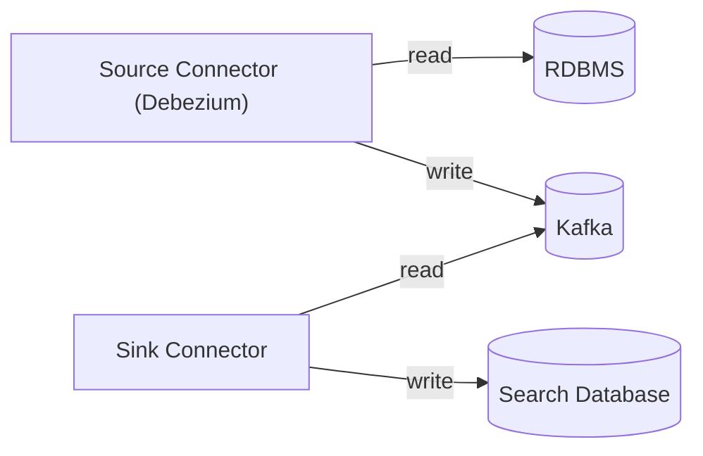

# DMS Feature: Change Data Capture to Stream

> [!NOTE]
> References to the `dms.documents` table in this document predate the current
> relational backend. Support for OpenSearch/Elasticsearch as a read store has
> been dropped. The Debezium + Kafka architecture remains the intended pattern;
> the specific table and column names will differ in the current implementation.

As described in the architectural vision, the Data Management Service (DMS) will
utilize Change Data Capture (CDC) technology to load incoming data into other
platforms. For example, the CDC application could push data into a streaming
platform (e.g. Kafka), which will enable subscribers to perform operations such
as level 2 validation checks or populating a search database.

> [!NOTE]
> This document describes a reference architecture that should assist in
> building production deployments. This reference architecture will not be tuned
> for production usage. For example, it will not include service clustering, may
> not be well secured, and it will not utilize cloud providers' managed
> services.

## Tech Stack

### Debezium

CDC technology uses a database's [write-ahead
log](https://en.wikipedia.org/wiki/Write-ahead_logging) to read the database's
transaction logs, allowing the application to access new data essentially in
real-time without needing to query or poll the storage tables. The alternative
to CDC is to have dual-writes: the DMS would need to write to both the primary
data storage and any secondary storage in the same transaction, which degrades
responsiveness (waiting for a second transaction to complete) and introduces
resiliency challenges around distributed transactions.

The open source [Debezium](https://debezium.io/) platform is the ideal tool for
CDC:

* Has
  [Connectors](https://debezium.io/documentation/reference/2.7/connectors/index.html)
  for PostgreSQL and SQL Server, among other database platforms.
* Mature and active.
* Supported by a large corporate backer (Red Hat/IBM).
* Available under the Apache License, version 2.0.

### Apache Kafka

[Apache Kafka](https://kafka.apache.org/) is a widely-used open source platform
for durable storage of streaming data. In essence, it is a highly-scalable
transactional database log. Kafka storage is built on _topics_, which are
[analogous to database
_tables_](https://developer.confluent.io/courses/apache-kafka/topics/).

The system will detect changes in the primary data table and publish them to a
Kafka topic. These messages must have a structure that is easily consumable by
the sink connector for loading, updating, and deleting from the search database.

The reference implementation Kubernetes deployment for the Data Management
Service will include Kafka 3.7, packaged by Debezium under its version number
2.7. This sample setup will also include the [Kafdrop user
interface](https://github.com/obsidiandynamics/kafdrop) for browsing topics and
messages.

### Search Databases

> [!IMPORTANT]
> OpenSearch/Elasticsearch support as a read store has been dropped. The
> sections below are preserved for historical reference only.

The reference deployment will include [OpenSearch](https://opensearch.org/) and
may include an alternative demonstration using
[Elasticsearch](https://www.elastic.co/elasticsearch). The DMS source code will
include a backend module for querying either service, using the API from
Elasticsearch 7.10 (the last ancestor common to both applications). The
deployment will include [OpenSearch
Dashboard](https://www.opensearch.org/docs/latest/dashboards/) for browsing and
managing indexes.

## Implementation

### Debezium Deployment Patterns

Debezium 2.7 has two common [deployment
options](https://debezium.io/documentation/reference/2.7/architecture.html):

1. Using **Apache Kafka Connect** with integrated Debezium to populate an Apache
   Kafka instance. Downstream Kafka Connect instances, or custom applications,
   can read from the Kafka streams to perform operations and/or load the data
   into downstream data stores.
2. Alternately, **Debezium Server** can load data directly into a number of
   different data stores, many of which have their own streaming support.

(A third mode is to incorporate Debezium into a custom Java application; that
will not be explored for the Ed-Fi platform).



### Connectors

The source connector will use the native Debezium connector for PostgreSQL and
Microsoft SQL Server. Transforms will be used to reshape the data into something
more easily consumed by downstream consumers.

Connector configurations are saved as JSON files, which are POST'ed into a REST
API running in the Connector service. Example command, in PowerShell:

```pwsh
Invoke-RestMethod -Method Post -InFile .\postgresql_connector.json `
    -uri http://localhost:$sourcePort/connectors/ -ContentType "application/json"
```

#### PostgreSQL Connector

These connector settings appear to be useful in prototype testing:

| Key                                    | Value                                                | Explanation                                                                                       |
| -------------------------------------- | ---------------------------------------------------- | ------------------------------------------------------------------------------------------------- |
| plugin.name                            | pgoutput                                             | Supported by PostgreSQL by default; the other options require modification of PostgreSQL.         |
| topic.prefix                           | edfi                                                 |                                                                                                   |
| value.converter                        | org.apache.kafka.connect.json.JsonConverter          | Writes the message body as JSON                                                                   |
| value.converter.schemas.enable         | false                                                | Removes the schema from the message; trims the message size                                       |
| transforms                             | unwrap, extractId                                    | List of transforms to be applied, described below                                                 |
| transforms.unwrap.type                 | io.debezium.transforms.ExtractNewRecordState         |                                                                                                   |
| transforms.unwrap.drop.tombstones      | false                                                | We need tombstones for deleting records in downstream consumers                                   |
| transforms.unwrap.delete.handling.mode | none                                                 | Also required for properly writing a tombstone                                                    |
| transforms.extractId.type              | org.apache.kafka.connect.transforms.ExtractField$Key |                                                                                                   |
| transforms.extractId.field             | id                                                   | Simplifies the message key to only the `id`                                                       |

The tombstone settings above are also important for Kafka topic compaction.

#### OpenSearch Connector

> [!IMPORTANT]
> This section is preserved for historical reference. OpenSearch support as a
> read store has been dropped.

These [connector
settings](https://github.com/Aiven-Open/opensearch-connector-for-apache-kafka/blob/main/docs/opensearch-sink-connector-config-options.rst)
appear to be useful in prototype testing:

| Key                            | Value                                            | Explanation                                        |
| ------------------------------ | ------------------------------------------------ | -------------------------------------------------- |
| max.in.flight.requests         | 1                                                | Prevents out-of-order messages                     |
| key.converter                  | org.apache.kafka.connect.storage.StringConverter | Simplifies the key for use in OpenSearch           |
| value.converter                | org.apache.kafka.connect.json.JsonConverter      | Read the message body as JSON                      |
| value.converter.schemas.enable | false                                            | Prevents looking for a schema                      |
| schema.ignore                  | true                                             | Tells OpenSearch to infer the schema               |
| behavior.on.version.conflict   | ignore                                           | Keep the existing record on version conflicts      |
| behavior.on.null.values        | delete                                           | Deletes by key when the message body is null       |
| index.write.method             | upsert                                           | Updates records in place                           |

### Data Replication Strategy

Each message in Kafka has a unique key and a message body. In Upsert mode a
sink connector will, when it sees a message with the same key:

* If the message has a body, replace the existing record with the new body.
* If the body is `null`, delete the existing record.

#### Outbox Topic

An alternative is to populate an Outbox topic that _describes events_. More
information will be needed from the Ed-Fi community before we can contemplate
the message structure details. It might be necessary to write messages to a
separate `outbox` table in the relational database, or the source messages could
be transformed into the desired structure using database triggers.

### PostgreSQL Configuration

The PostgreSQL instance needs to be configured for logical replication, allowing
access from the Kafka Connect instance. The following commands will enable this:

```bash
echo "host    replication    postgres         kafka-connect-source    trust" >> /var/lib/postgresql/data/pg_hba.conf
echo "wal_level = logical" >> /var/lib/postgresql/data/postgresql.conf
```

Restart the PostgreSQL server after applying these settings.

> [!WARNING]
> This is not a good security configuration, as it uses the built-in `postgres`
> super user. See [these
> notes](https://debezium.io/documentation/reference/2.7/connectors/postgresql.html#postgresql-permissions)
> from Debezium for an improved security posture.
