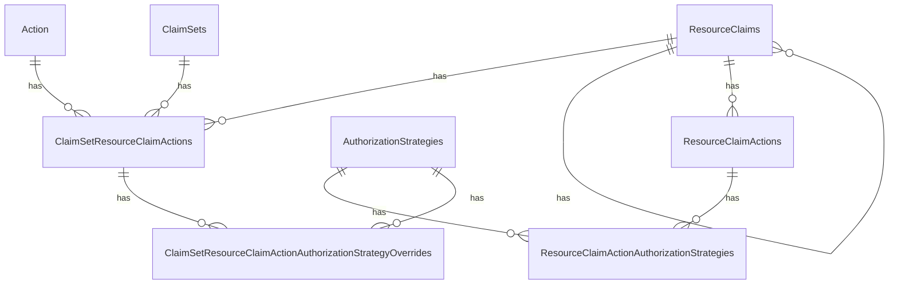
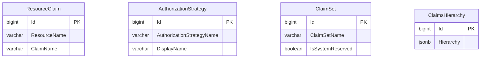

# Claimset Management

Ed-Fi API security relies on the concept of a claimset, which groups together
the operations allowed by an API client in the following dimensions:

* Authorization Strategy (namespace, ownership, various relationships, or no
  restriction).
* Resource - all of the entities in both the Resource API and the Descriptors
  API
  * There is also a hierarchy: for example, grouping some Descriptors together
    as "system descriptors" or "managed descriptors", or grouping together all
    education organizations.
* Actions (create, read, update, delete, and read changes (change queries)).

## Legacy Approach

### Database Model

In the ODS/API and the Admin API applications, the security metadata is stored in the `EdFi_Security` database modeled relationally using the following 4 core entities:

* **ResourceClaims** - Represent nodes in a hierarchy with 3 types of claims represented: resources (representing data management API endpoints), domains (for organizing related resource claims into logical groups) and services (functional areas of the API, such as identity).

* **Actions** - Operations that can be performed on resources such as Create, Read, Update and Delete (CRUD), but is also extensible for other use cases (such as ReadChanges for clients performing change processing or the ReadHistory offered by the Nebraska DOE Longitudinal API).

* **AuthorizationStrategies** - Predefined data filters that limit which items of a resource are available to an API client. For example, one authorization strategy limits an API client's access to student data based on _enrollments_ while another uses _school responsibility_ associations.

* **ClaimSets** - Represents pre-defined sets of action permissions and authorization strategies to be applied to various resources. Conceptually this is equivalent to a "role".

The remaining tables capture metadata related to the association of these
entities.



### Admin API REST Interface

The Admin API interface supports the following operations related to these tables:

* /action
  * GET all
* /authorizationStrategies
  * GET all
* /claimsets
  * Regular CRUD operations:
    * GET all
    * GET by id
    * POST
    * PUT
    * DELETE
  * CLOB ("Character Large OBject") operations, which unifies all of the dimensions of a Claimset into one payload:
    * GET /export
    * POST /copy
    * POST /import
  * /claimsets/{id}/resourceClaimActions
    * POST
    * PUT
    * DELETE
    * /claimsets/{id}/resourceClaimActions/{id}
      * POST overrideAuthorizationStrategy
      * POST resetAuthorizationStrategies
* /resourceClaims
  * GET all
  * GET by id

The read-only endpoint return essentially hard-coded lists, so that a user will
know what ID values to use in constructing the payload for the CLOB operations
or resourceClaimActions operations.

## Proposed Approach

### Data Model

The DMS Configuration Service needs to support client tools built to interact
with Admin API 2. One of the challenges of moving to a full-JSON-based resource claim hierarchy is the management of the identities of the _entities_ of the existing security metadata model described earlier.

Thus, DMS will use a hybrid model that retains those entity tables exactly as they currently appear in the `EdFi_Security` database with the following exceptions:

* The self-recursive `ParentResourceClaimId` column of the `ResourceClaims` table will be removed in favor of managing the hierarchy in JSON.

* Actions are hardcoded in the application rather than stored in a database table. The `GET /actions` endpoint returns a fixed list from code, not from a database query.

The security metadata stored in the join tables of the EdFi_Security database will be managed using JSON in a new table named "ClaimsHierarchy".

The DMS Configuration Service data model for managing security metadata will be as follows:



> [!NOTE]
> The Admin API specification already describes the identifiers as integers. We
> will stick with that convention, rather than trying to switch to a UUID.

## REST API Implications

The DMS Configuration Service will not, initially, support all of the Admin API
endpoints. Further discussion with the affected community members is needed to
determine if this is a viable long-term direction.

Initially, the key goal is to enable the DMS to retrieve claim set information
from the Configuration Service. However, the DMS represents a different type of
consumer -- one that is consuming the security metadata for the purpose of
making authorization decisions. The Admin API has been designed for consumers
performing security metadata management. For this reason, the DMS Configuration
Service will implement a new endpoint that supports this use case:

* `GET /v3/authorizationMetadata?claimSetName=SIS%20Vendor`
  * Returns authorization metadata for the specified claim set, containing the
    resources accessible to API clients and the authorization strategies needed
    to make authorization decisions.

  The actual response is an array of claim set metadata objects:

  ```json
  [
    {
      "claimSetName": "SIS Vendor",
      "claims": [
        {
          "name": "http://ed-fi.org/ods/identity/claims/ed-fi/academicSubjectDescriptor",
          "authorizationId": 1
        }
      ],
      "authorizations": [
        {
          "id": 1,
          "actions": [
            {
              "name": "Create",
              "authorizationStrategies": [{ "name": "NamespaceBased" }]
            },
            {
              "name": "Read",
              "authorizationStrategies": [{ "name": "NoFurtherAuthorizationRequired" }]
            }
          ]
        }
      ]
    }
  ]
  ```

  The response does not include the resource claim hierarchy — that pertains to
  security metadata management and is not required for authorization decisions.
  Consumers receive only the information necessary to make authorization decisions.

> [!TIP]
> [management-api-2.3.0.yaml](https://github.com/Ed-Fi-Alliance-OSS/Ed-Fi-API-Specifications/blob/main/api-specifications/management/management-api-2.3.0.yaml)
> is the Management API specification in OpenAPI format. Use this definition to
> determine the request and response payloads.

### Supported Endpoints

#### ClaimSets

In the claimset GET requests, the readonly `_applications` array implies that
the query needs to join to the `Application` table. Thus the `Application` table
needs an index on `ClaimSetName`.

* `GET /v3/claimSets/{id}/export`
* `GET /v3/claimSets`
  * Return the simple response body defined in the Admin API specification.
  * Includes paging operations.
* `GET /v3/claimSets?verbose=true`
  * Returns the entire CLOB, with the same response as the `/export` endpoint.
  * Needs to support the normal paging operations, though `offset` and `limit`
    should _not_ be required fields.
* `GET /v3/claimSets/{id}`
  * Return the simple response body defined in the Admin API specification.
* `GET /v3/claimSets/{id}?verbose=true`
  * Returns the entire CLOB, with the same response as the `/export` endpoint.
* `POST /v3/claimSets`
  * In the Admin API interface, only the `name` is used. Continue supporting
    that. Basically, this is creating a placeholder with no useful information.
  * Also support accepting the entire `resourceClaims` CLOB payload, just like
    the `/import` endpoint.
  * If the `name` already exists, perform an `UPDATE` instead of re-inserting.

  > [!NOTE]
  > ClaimSet `name` must be unique.

* `PUT /v3/claimSets/{id}`
  * There is a small mistake in the Admin API specification, and we should fix
    that right now. Thus we have a breaking change compared to the Admin API 2.2
    specification. A `PUT` request _by definition_ must include the entire
    resource. In the DMS, we have interpreted that to mean that the `id` value
    is required in the payload. It also means that a request with only `{ "id":
    1, "name": "claimset name" }` would completely remove the `resourceClaims`
    node. Except for any metadata, we store _exactly_ what was received in the
    `PUT` request.
* `DELETE /v3/claimSets/{id}`
* `POST /v3/claimSets/copy`
* `POST /v3/claimSets/import`
  * Becomes a synonym to `/v3/claimSets`, except that now the `resourceClaims`
    array will be a required attribute.

#### AuthorizationStrategies

Continue supporting the read-only list for `/v3/authorizationStrategies`.

#### Actions

Continue supporting the read-only hard-coded list for `/v3/actions`.

### Unsupported Endpoints

At this time, the following endpoints will not be supported in the Configuration
Service, because the `/v3/claimSets` will provide the same support. This is
subject to change based on community feedback.

* `/v3/resourceClaims`
* `/v3/resourceClaims/{id}`
* `/v3/claimSets/{claimSetId}/resourceClaimActions/{resourceClaimId}/overrideAuthorizationStrategy`
* `/v3/claimSets/{claimSetId}/resourceClaimActions/{resourceClaimId}/resetAuthorizationStrategies`
* `/v3/claimSets/{claimSetId}/resourceClaimActions`
* `/v3/claimSets/{claimSetId}/resourceClaimActions/{resourceClaimId}`
* `/v3/claimSets/{claimSetId}/resourceClaimActions/{resourceClaimId}`

## Summary of Changes Compared to Admin API 2.2 Specification

* `offset` and `limit` should not be required parameters
* `PUT` requests will require the presence of the matching `id` attribute in the
  request body.
* Both `POST` and `PUT` on `/v3/claimSets` will support use of the
  `resourceClaims` attribute.
* A `GET` request to `/v3/claimSets` or `/v3/claimSets/{id}` will return the
  `resourceClaims` array _if_ query string parameter `verbose` is received with
  value `true`.

Thus, we have begun defining elements of an Admin API **3.0** specification.
