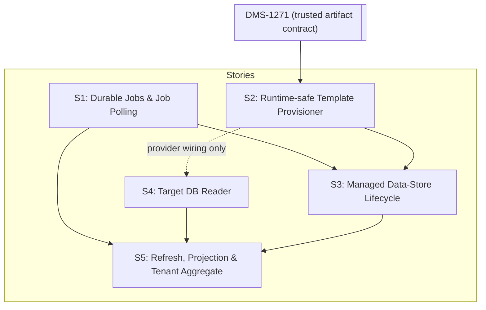

# DMS-1334 Candidate Implementation Stories

## Recommended story decomposition

The confirmed gaps in [the spike findings](data-store-lifecycle-findings.md) resolve into five stories:

| ID | Candidate story | Primary owner |
| --- | --- | --- |
| S1 | Add durable CMS background jobs, schedules, and Management API v3 job polling | CMS |
| S2 | Add a runtime-safe CMS DMS-template provisioner | CMS |
| S3 | Add managed data-store lifecycle endpoints and reconciliation to CMS | CMS, consuming CMS S2 |
| S4 | Add a CMS target-database education-organization reader | CMS |
| S5 | Add CMS education-organization refresh, projection, and tenant aggregation | CMS, consuming CMS S4 |

No estimates are included so refinement teams can estimate independently without anchoring bias. Every story includes PostgreSQL and SQL Server support and the validation described in its acceptance criteria.

## Dependency and delivery order

- S1 and S4's provider-neutral reader and provider-adapter work can begin independently. S4's final shared `DmsDataStoreSettings.Provider` wiring depends on S2. S2 design can begin, but S2 is formally blocked by DMS-1271 until its trusted artifact contract is delivered.
- S3 requires S1 and S2.
- S5 requires S1 and S4. Its complete v3 tenant aggregate also requires S3, although refresh persistence for ordinary unmanaged stores can be developed before S3 lands.
- S2 must carry a Jira blocker link to open [DMS-1271](https://edfi.atlassian.net/browse/DMS-1271). It consumes DMS-1271's delivered trusted manifest/artifact contract but does not take ownership of DMS-1271's operator/bootstrap sequencing.

- S2 and S4 are implemented inside the existing CMS backend and provider-specific projects. They consume versioned DMS artifacts and database-shape contracts as data and add no CMS-to-DMS project/package reference, DMS runtime dependency, or Docker build-context change.

## S1 — Add durable CMS background jobs, schedules, and Management API v3 job polling

### Problem / outcome

CMS has an in-process hosted-service precedent but no durable job resource, recurring schedule resource, or recoverable asynchronous execution. Managed lifecycle and education-organization refresh both need work to survive process restarts, avoid concurrent duplicate execution, retry safely, and expose the v3 job contract.

This story delivers tenant-scoped CMS job and schedule persistence, a recoverable dispatcher, and `GET /v3/jobs/{jobId}` without adding Quartz, a message broker, or a new service.

### Scope

- Add provider-equivalent CMS persistence for jobs, attempts, timestamps, sanitized errors, retry timing, and lease ownership/expiry.
- Add provider-equivalent CMS persistence for recurring schedules: stable schedule ID, tenant, job type, non-secret payload/target identifiers, interval, enabled state, next-run time, and claim/lease metadata.
- Add provider-specific atomic claim/lease operations that allow multiple CMS replicas while permitting expired work to be reclaimed.
- Add a schedule dispatcher that atomically claims due schedules, enqueues ordinary `Pending` jobs, advances the next-run time, and reclaims expired schedule leases.
- Add an extensible in-process job-handler dispatch contract and a hosted worker using the existing CMS `BackgroundService` pattern.
- Add bounded retry/backoff, cancellation on shutdown, configurable retention/cleanup, structured logs, and operational metrics.
- Add the v3 job-status read endpoint.
- Establish explicit tenant context inside every background execution scope.

### Relevant API surface

- `GET /v3/jobs/{jobId}`
- Response: `jobId`, `status`, `createdAt`, nullable `finishedAt`, nullable `errorMessage`
- Statuses: `Pending`, `InProgress`, `Completed`, `Error`
- Errors: `401`, `403`, `404`, and existing CMS problem-details behavior

### Architectural approach

CMS owns job and schedule persistence because they are Management API control-plane resources. The `Jobs` model preserves Admin API's externally visible `JobStatuses` semantics while adding the retry/lease state required for recovery. The separate `Schedules` model preserves Admin API's distinction between a recurring trigger and each resulting job execution, but makes the trigger durable instead of using Admin API's in-memory Quartz schedule. Hosted workers poll/claim both due schedules and due jobs from the CMS database. Work is at-least-once, so handlers must be idempotent. Persisted payloads contain a type and tenant-scoped entity identifiers, never a connection string, token, package credential, or other secret.

The enqueue API must allow a caller to create its control-plane record and corresponding job atomically in one CMS transaction. A refresh caller that needs only a job may insert the job directly in that transaction. A due schedule creates the same ordinary job record used by a manual request; scheduled executions do not use a separate handler or status model.

### Dependencies

- Existing CMS PostgreSQL and SQL Server repository/migration conventions.
- Existing [`TenantContext`](../../../src/config/backend/EdFi.DmsConfigurationService.Backend/Services/TenantContext.cs) and scoped provider.
- Existing [`TokenCleanupService`](../../../src/config/backend/EdFi.DmsConfigurationService.Backend.OpenIddict/Services/TokenCleanupService.cs) as a hosted-service pattern, not as job infrastructure.

### Blockers

None. S1 can start independently.

### Acceptance criteria

1. PostgreSQL and SQL Server CMS schemas persist an opaque unique job ID, tenant, job type, target identifiers/payload, optional source-schedule/occurrence identity, status, created/finished timestamps, bounded sanitized error, attempt count, next-attempt time, and lease metadata.
2. Enqueue persists `Pending` before the originating API response is returned; an immediate authorized GET never races to `404` for an accepted job.
3. `GET /v3/jobs/{jobId}` returns the OpenAPI response shape and `404` for an absent job or a job belonging to another tenant.
4. Job GET uses the existing read-only-or-admin policy. It never exposes payload secrets, stack traces, administrative connection details, or another tenant's data.
5. A provider-specific atomic claim permits at most one unexpired lease for a job, including when two CMS replicas poll concurrently.
6. The worker creates a dependency-injection scope, establishes the job's persisted tenant context, invokes the registered handler, and clears/disposes the scope after completion.
7. A completed handler sets `Completed` and `finishedAt`; a terminal failure sets `Error`, `finishedAt`, and a sanitized client-facing error.
8. A transient handler failure is retried with configurable bounded attempts and backoff. Attempt accounting is persisted.
9. Work left `InProgress` by process termination is reclaimable after lease expiry and does not remain permanently stuck.
10. Process shutdown stops new claims and allows active handlers to observe cancellation without losing their durable job state.
11. Job retention/cleanup is configurable and cannot remove pending, leased, or retryable jobs.
12. Structured logs and metrics expose job type, tenant-safe identifiers, queue delay, attempt, duration, lease recovery, and outcome without logging payload secrets.
13. No Quartz package, external broker, or new deployable service is introduced.
14. PostgreSQL and SQL Server CMS schemas persist recurring schedules with a stable unique ID/key, tenant, job type, non-secret target/payload, interval, enabled state, next-run time, and lease metadata. A uniqueness constraint permits only one active schedule for a given tenant and schedule type.
15. Claiming a due schedule, inserting its `Pending` job with source schedule and scheduled-occurrence identity, and advancing the schedule's next-run time are atomic. A unique schedule-occurrence constraint prevents concurrent CMS replicas or transaction retries from enqueueing the same occurrence twice, and an expired schedule lease is reclaimable after process termination.
16. A scheduled job uses the same handler, retry rules, status transitions, tenant context, polling representation, retention rules, and observability as a manually enqueued job. Disabling a schedule prevents future enqueue without deleting prior job history.
17. Missed intervals are coalesced: after downtime, the dispatcher enqueues at most one immediately due occurrence and advances `nextRunAt` to the first future interval. It does not enqueue one catch-up job per missed interval.

### Out of scope

- Managed data-store lifecycle handlers.
- Education-organization refresh handlers.
- A generic user-authored job API or arbitrary payload execution.
- A public schedule-management API or arbitrary user-defined schedules.
- Job cancellation, prioritization, or progress percentages not present in v3.

### Risks / implementation refinements

- Lease duration, retry intervals, maximum attempts, and retention defaults need operational calibration. They are configuration decisions and do not block the architecture. The schedule misfire policy is fixed by AC 17.
- Provider-specific claim and reclaim statements must compare lease expiry using database UTC time rather than worker-process clocks (for example, PostgreSQL `now()` and SQL Server `SYSUTCDATETIME()`). Cross-provider integration tests must demonstrate equivalent observable claim, expiry, and reclaim behavior.

### Validation expectations

- Unit tests for job/schedule state transitions, next-run calculation, retry classification, error sanitization, tenant setup, and retention rules.
- PostgreSQL and SQL Server integration tests for atomic manual enqueue, atomic scheduled enqueue/next-run advancement, concurrent claims, lease expiry/reclaim, attempt persistence, schedule uniqueness, and tenant isolation.
- API-level tests for authorization, immediate polling, all response states, and cross-tenant `404` behavior.
- Restart simulations proving abandoned in-progress jobs and due schedule leases are reclaimed without losing or duplicating an occurrence.

## S2 — Add a runtime-safe CMS DMS-template provisioner

### Problem / outcome

DMS publishes Minimal and Populated database-template packages and has operator-oriented restore tooling, but CMS cannot safely invoke those PowerShell/Docker helpers inside an HTTP-triggered job. `ddl provision` creates an empty schema and does not implement the v3 template behavior.

This story delivers a CMS-owned runtime service that creates or deletes one managed PostgreSQL or SQL Server data store from a trusted, deployment-allowlisted DMS template.

### Scope

- Define a provider-neutral create/delete contract in the existing CMS backend project, with implementations in the existing CMS PostgreSQL and SQL Server provider projects.
- Resolve v3 `Minimal` to a DMS Minimal package and v3 `Sample` to the equivalent DMS Populated package.
- Reuse the package identity, manifest, artifact hash, content-profile, schema-compatibility, and producer-trust contract coordinated with DMS-1271.
- Implement PostgreSQL SQL-dump and SQL Server backup restoration in the corresponding CMS provider projects.
- Add a target DMS data-store provider setting (`DmsDataStoreSettings.Provider`, `postgresql` or `mssql`) independent of the provider used by the CMS catalog database.
- Implement administrative connection handling, safe identifier generation/quoting, reserved-name and protected-database denial, timeouts, cancellation, and secret-safe diagnostics.
- Use a caller-supplied expected `dms.DataStoreIdentity.SourceIdentity` to prove ownership for reconciliation and deletion.

### Relevant API surface

No public endpoint is delivered by this story. The consuming request values are the v3 `databaseTemplate` values `Minimal` and `Sample`.

### Architectural approach

CMS owns this service because provisioning is invoked by the Management API lifecycle and is a control-plane responsibility. DMS owns the Resources, Descriptors, and Discovery APIs, template production, and the versioned artifact/database contracts consumed by the service; it does not own a Management API runtime component.

The request never supplies an artifact path, feed, package ID, database server, or administrative connection string. Those are resolved from operator configuration. The implementation stays within the current CMS project graph and must not reference DMS application projects or shell out to `pwsh`, Docker, `ddl provision`, or a repository script. DMS artifacts, manifests, `dms.DataStoreIdentity`, and `dms.EffectiveSchema` are consumed as versioned data contracts.

### Dependencies

- Completed [DMS-1255](https://edfi.atlassian.net/browse/DMS-1255) template packages for PostgreSQL and SQL Server.
- Delivery of the trusted manifest, artifact authentication, DMS-only content-profile, and compatibility contract owned by open [DMS-1271](https://edfi.atlassian.net/browse/DMS-1271). S2 must be linked as blocked by DMS-1271 in Jira.
- Existing [`Template-Management.psm1`](../../../eng/DatabaseTemplates/Template-Management.psm1) as verified provider restore sequencing: it demonstrates that `SourceIdentity` is reseeded after restore, but generates a fresh UUID. Assigning the lifecycle record's caller-supplied expected UUID is new S2 behavior, not an existing capability or runtime dependency.
- Existing CMS backend/provider project boundaries and database-provider registration conventions.
- The versioned DMS template and target-database contracts, including `dms.DataStoreIdentity` and `dms.EffectiveSchema`.

### Blockers

- [DMS-1271](https://edfi.atlassian.net/browse/DMS-1271) — formal Jira blocker for the trusted artifact manifest, authentication, content-profile, and compatibility contract. S2 cannot complete trusted package execution until it is delivered.

### Acceptance criteria

1. A typed async contract can create and delete one target for PostgreSQL and SQL Server and supports cancellation and configurable command timeouts.
2. Only `Minimal` and `Sample` are accepted at the contract boundary; matching is case-sensitive for v3 parity.
3. `Minimal` resolves to an allowlisted DMS Minimal package and `Sample` resolves to an allowlisted DMS Populated package for the configured target provider and supported Data Standard/effective schema.
4. Package bytes are authenticated and the manifest, artifact hash, provider, Data Standard, extension/project inventory, effective-schema metadata, DMS-only content profile, and engine compatibility are validated before target mutation.
5. Client input cannot choose or override an artifact path, feed, package ID/version, administrative connection, or protected database.
6. Target names are normalized and safely quoted. PostgreSQL `postgres`, `template0`, and `template1`; SQL Server `master`, `model`, `msdb`, and `tempdb`; and every configured CMS/identity database are rejected before destructive work.
7. Creation fails safely when the target already exists without a matching expected source identity. It does not drop or overwrite an unowned database.
8. A successful restore sets `dms.DataStoreIdentity.SourceIdentity` to the expected UUID supplied by the lifecycle record and validates the resulting DMS schema before success.
9. A retry accepts and reconciles an existing target only when the expected source identity, trusted artifact identity/hash, provider, engine compatibility, content profile, and effective schema all match and target validation is complete. It never replaces a target merely because source identity matches; a partial, incompatible, or unverifiable owned target fails safely for operator inspection.
10. Delete drops only a target whose `dms.DataStoreIdentity.SourceIdentity` matches the expected value. A missing target is an idempotent success; a mismatched or unreadable identity is a safe failure requiring inspection.
11. PostgreSQL and SQL Server implementations return typed outcome/error categories suitable for retry classification without returning secrets.
12. Administrative and generated runtime connection strings, package credentials, and decrypted secrets are never logged.
13. The provisioner has no dependency on Management API DTOs, job state, PowerShell, Docker, the DMS command-line application, or DMS runtime projects.
14. The provider-neutral contract is implemented in the existing CMS backend project and its provider adapters are implemented in the existing CMS PostgreSQL and SQL Server projects; no new CMS-to-DMS project/package reference or Docker build-context change is introduced.
15. `DmsDataStoreSettings.Provider` selects the target data-store provider independently of the CMS catalog provider, is validated at startup, and selects the matching CMS provider adapter. A deployment supports one configured target provider; mixed-provider ordinary data stores are out of scope until the catalog carries provider metadata.

### Out of scope

- Producing or publishing template packages; DMS-1255 owns that pipeline.
- Bootstrap/start-script sequencing, workspace replacement, or multi-database restore; DMS-1271 owns that operator workflow.
- `ddl provision` changes unless a small existing provider primitive must be safely extracted without changing CLI behavior.
- Descriptor seeding; DMS-955 is obsolete and unrelated.
- DMS application, API, or runtime-library changes.
- CMS lifecycle persistence or public endpoints.

### Risks / implementation refinements

- DMS-1271 is not complete. Its formal Jira blocker relationship prevents S2 completion until the trusted artifact contract lands; S2 must not execute unauthenticated PostgreSQL SQL or SQL Server backups while waiting.
- The repository does not record a provider on each ordinary data store. The one-target-provider-per-CMS-deployment constraint must be documented until a separately approved catalog change supports mixed providers.
- SQL Server restore file placement and PostgreSQL replay privileges differ operationally and require explicit deployment documentation.

### Validation expectations

- Unit tests for template resolution, compatibility validation, identifier/protected-target checks, typed errors, and secret redaction.
- Live PostgreSQL and SQL Server integration tests for Minimal and Sample/Populated creation, effective-schema validation, source-identity assignment, idempotent retry, owned deletion, absent deletion, mismatch refusal, cancellation, and cleanup after failure.
- Adversarial tests for forged/tampered packages, manifest mismatches, protected targets, unowned collisions, SQL/identifier injection, and contaminated non-DMS package content.

## S3 — Add managed data-store lifecycle endpoints and reconciliation to CMS

### Problem / outcome

CMS can register an existing data store but cannot provision, observe, or physically delete one. The v3 managed resource requires a separate lifecycle aggregate whose asynchronous work ultimately creates or removes an ordinary CMS `DataStore` registration.

This story delivers `/v3/dataStores/manage`, durable create/delete reconciliation, and safe integration with the existing routing catalog.

### Scope

- Add tenant-scoped managed data-store persistence for request values, generated database name, expected source identity, linked ordinary data-store ID/name, lifecycle status, and timestamps.
- Add collection, create, by-ID, and delete routes under `/v3/dataStores/manage`.
- Add create and delete job handlers using S1 and the S2 provisioner.
- Build and encrypt the ordinary runtime connection string using existing CMS facilities and insert/remove it through the existing data-store repository boundary.
- Add duplicate, lifecycle-state, database-name, provider/configuration, and ownership validation.
- Prevent ordinary metadata-only deletion from bypassing managed lifecycle.
- Add `EnableDataStoreManagement`, default `true`, gating managed routes and managed work only.

### Relevant API surface

- `GET /v3/dataStores/manage`
- `POST /v3/dataStores/manage`
- `GET /v3/dataStores/manage/{id}`
- `DELETE /v3/dataStores/manage/{id}`
- Existing `DELETE /v3/dataStores/{id}` receives a guard for managed records.

No managed PUT is in the v3 contract.

### Architectural approach

CMS owns the management aggregate and state machine. `dmscs.DataStore` remains the ordinary DMS routing registration and is populated only after physical provisioning succeeds. Create/delete API transactions write the management transition and S1 job atomically. Job handlers reconcile physical and CMS state idempotently because those systems cannot share a transaction.

Lifecycle statuses follow current v3 behavior: `PendingCreate`, `CreateInProgress`, `Created`, `CreateFailed`, `CreateError`, `PendingDelete`, `DeleteInProgress`, `Deleted`, `DeleteFailed`, and `DeleteError`.

### Dependencies

- S1 durable CMS jobs.
- S2 CMS-owned runtime-safe DMS-template provisioner.
- Existing CMS `IDataStoreRepository`, connection-string encryption, authorization policies, tenant context, and provider-specific migration conventions.
- Existing DMS data-store cache refresh; no new callback dependency.

### Blockers

- [S1](#s1) — must deliver durable job enqueue, execution, retry, and polling.
- [S2](#s2) — must deliver the CMS-owned trusted template provisioner used by create/delete reconciliation.

### Acceptance criteria

1. Managed records are tenant-scoped and persist all fields needed to return `dataStoreManageModel`, plus an internal expected source identity and retry/reconciliation metadata that are never exposed.
2. `POST /v3/dataStores/manage` requires nonblank `name` and `databaseTemplate`, accepts only case-sensitive `Minimal` or `Sample`, and rejects additional unsupported values with CMS problem details.
3. POST is create-only. It returns `400` only for malformed or unsupported request values, an active managed name, an existing ordinary data-store name, an invalid name, or an unsafe/overlength generated database name. Static administrative-connection and template-catalog configuration is validated at startup. POST does not synchronously probe artifact-feed or target database availability; a transient outage discovered after acceptance is a typed retryable job failure, never a client-validation error.
4. POST atomically inserts `PendingCreate` and its durable job, then returns `202 Accepted`, no required body, and an absolute `Location` for `/v3/dataStores/manage/{id}`.
5. Collection GET supports the OpenAPI paging/sorting, `id`, and `name` filters and returns tenant-scoped management models. By-ID GET returns one model or `404` without revealing another tenant's record.
6. Create execution transitions through `CreateInProgress`, calls the CMS-owned S2 service with the persisted target name/template/expected source identity, constructs and encrypts the runtime connection string, creates the ordinary `DataStore`, links its ID/name, and marks `Created`.
7. A transient create failure is recorded as `CreateFailed` while S1 will retry; exhausting attempts records `CreateError`. Retries reconcile an already-owned physical target and an already-linked ordinary record without duplicates.
8. `DELETE /v3/dataStores/manage/{id}` accepts only `Created`, atomically writes `PendingDelete` and its job, and returns `204`. Absent/`Deleted` returns `404`; all other lifecycle states return a status-specific `400`.
9. Delete execution transitions through `DeleteInProgress`, verifies and drops the S2-owned physical target, removes the linked ordinary catalog row, retains the management tombstone, and marks `Deleted`.
10. A transient delete failure is `DeleteFailed`; exhausting attempts is `DeleteError`. Retry is idempotent when the owned database or ordinary catalog row is already absent.
11. Existing `DELETE /v3/dataStores/{id}` returns `409 Conflict` for a linked managed data store and directs the caller to the managed resource, preventing an orphaned physical database.
12. Management responses and logs never expose the ordinary or administrative connection string, expected source identity, package credentials, or decrypted secrets.
13. Managed POST/DELETE use the existing admin policy. Managed reads use the existing read-only-or-admin policy. All repository and job operations enforce tenant isolation.
14. With `EnableDataStoreManagement=false`, all managed routes return the established disabled-feature error and managed jobs are not claimed/scheduled; job and education-organization capabilities remain available.
15. With the feature enabled or unset, default behavior is enabled. Startup validates required administrative connection and template-catalog configuration with actionable diagnostics.
16. Successful ordinary registration becomes visible through the existing DMS cache refresh. Documentation states that routability is eventually consistent with `DataStoreCacheExpirationSeconds`; no CMS-to-DMS callback is introduced.
17. PostgreSQL and SQL Server exhibit the same observable API/state behavior.

### Out of scope

- Managed update/rename/copy, database size reporting, migrations, or progress percentages.
- Creating template artifacts.
- Application/API-client assignment to the new data store.
- Immediate DMS cache invalidation or a reverse service callback.
- Education-organization refresh.

### Risks / implementation refinements

- Physical and CMS state cannot be committed atomically. Correctness depends on the idempotent state machine and S2 ownership check.
- Operators need explicit documentation for administrative database privileges and the DMS cache visibility window.

### Validation expectations

- Unit tests following CMS conventions for validators, route results, authorization mapping, state transitions, retry classification, feature flag, and secret redaction.
- PostgreSQL and SQL Server integration tests for schema constraints, transactional enqueue, duplicate races, tenant isolation, and ordinary data-store linking/removal.
- API-level integration tests for every route/status, absolute `Location`, filters, disabled mode, cross-tenant behavior, and ordinary-delete guard.
- Live provider tests covering successful create/delete, process interruption and lease recovery, retry after each cross-system boundary, unowned collision refusal, and DMS discovery after cache expiry.

## S4 — Add a CMS target-database education-organization reader

### Problem / outcome

CMS needs to read the four core education-organization types from each configured DMS database for the Management API projection. Existing DMS token-info code is request- and mapping-specific and returns token ancestry; it is evidence for physical relationships, not an appropriate CMS dependency.

This story delivers a CMS-owned reader that enumerates a target data store's core education organizations in the Management API projection shape.

### Scope

- Define a provider-neutral async reader contract in the existing CMS backend project returning education-organization ID, institution name, nullable short name, discriminator, and nullable direct parent ID.
- Implement PostgreSQL and SQL Server adapters in the existing CMS provider projects using the stable DMS database shape for the four current Admin API core types: State Education Agency, Education Service Center, Local Education Agency, and School.
- Validate the configured target provider, the target `dms.EffectiveSchema` contract/version, and every required core table and column before projection.
- Encode the exact Management API discriminator and direct-parent rules as CMS projection behavior. Extension-defined education-organization types are not queried because the Management API contract does not define their discriminator or parent semantics.
- Return deterministic, unique results with provider-neutral error categories and cancellation.
- Keep the reader independent of HTTP request/authentication state and CMS persistence.

### Relevant API surface

No public route is delivered. The output must be sufficient for the OpenAPI `educationOrganizationModel` embedded by S5.

### Architectural approach

CMS owns the reader because it supports a Management API projection and runs inside a CMS refresh job. The provider-neutral contract and provider adapters follow the existing CMS layering; no CMS project references a DMS project. DMS continues to own Resources, Descriptors, and Discovery behavior and publishes the target database contract that CMS consumes as data.

The reader performs an explicit Management API projection. It does not reuse the token-info response discriminator (`Ed-Fi:School`), require DMS `RequestInfo`, load DMS mapping/schema packages, call the public DMS API, or require an OAuth client. A target incompatible with the supported versioned database contract fails before returning a partial projection.

### Dependencies

- Existing CMS backend, PostgreSQL, and SQL Server project boundaries and service-registration conventions.
- The versioned DMS relational database contract for `dms.EffectiveSchema` and the four core education-organization resource tables/columns.
- `DmsDataStoreSettings.Provider` from S2, which selects the target-database adapter independently of the CMS catalog provider.
- Current Admin API behavior and DMS token-info implementation as behavioral evidence only, not runtime dependencies or reuse seams.

### Blockers

- [S2](#s2) — blocks final shared `DmsDataStoreSettings.Provider` wiring. The provider-neutral reader contract and provider adapters can be developed before S2 completes.

### Acceptance criteria

1. A provider-neutral CMS backend contract asynchronously returns the v3 projection fields using non-nullable internal models except for fields nullable in the contract.
2. PostgreSQL and SQL Server implementations reside in the existing CMS provider projects and require no `RequestInfo`, authenticated DMS request, DMS HTTP call, DMS project/package reference, or DMS startup component.
3. Before projecting data, the reader validates the target `dms.EffectiveSchema` contract/version and all required core tables and columns. A missing or incompatible contract produces a typed non-transient failure and no partial projection is returned.
4. The reader enumerates exactly State Education Agency, Education Service Center, Local Education Agency, and School without requiring the caller to know IDs in advance.
5. Required physical objects are defined by a documented, versioned DMS database contract consumed by both CMS provider adapters; arbitrary DMS implementation details are not treated as a stable interface.
6. Core discriminators match current Admin API projection values: `edfi.StateEducationAgency`, `edfi.EducationServiceCenter`, `edfi.LocalEducationAgency`, and `edfi.School`. The existing token-info values such as `Ed-Fi:School` are not exposed on this contract.
7. Core `parentId` precedence matches current Admin API behavior: School uses its Local Education Agency; Local Education Agency uses parent Local Education Agency, then Education Service Center, then State Education Agency; Education Service Center uses State Education Agency; State Education Agency has no parent. Self and transitive-only ancestors are not returned as the direct parent.
8. Duplicate identifiers or contradictory core relationships fail with actionable diagnostics rather than returning ambiguous results.
9. PostgreSQL and SQL Server return equivalent ordered results, preserve `int64` identifiers, and correctly handle an empty data store.
10. Missing required tables/columns or an incompatible effective-schema contract returns a typed non-transient failure suitable for S5 job reporting.
11. Connection/transient provider failures remain distinguishable for retry classification and do not include secrets.
12. The reader adds no public DMS or CMS route, job, snapshot table, OAuth credential, or HTTP dependency.
13. Extension-defined education-organization types are excluded. The reader neither guesses nor synthesizes discriminator or parent semantics absent from the Management API contract.
14. The contract and adapters are implemented within the existing CMS project graph; no CMS-to-DMS project/package reference or Docker build-context change is introduced.

### Out of scope

- CMS snapshot persistence or refresh endpoints.
- Application education-organization assignment validation.
- A new public DMS resource endpoint or any DMS application/code change.
- Extension-defined education-organization types until the Management API contract defines their projection semantics.
- Historical/deleted education organizations not present in the active target data store.

### Risks / implementation refinements

- A future DMS database-layout change can break direct reads. The DMS database contract must be versioned, validated before use, and changed compatibly or with a coordinated CMS adapter update.
- Mixed target providers remain out of scope until ordinary data stores carry provider metadata; the configured target provider must match every queried data store.

### Validation expectations

- Reader unit tests for the exact four core discriminators and parent-precedence rules, exclusion of extension types, short-name nullability, duplicate IDs, contradictory relationships, deterministic ordering, and typed failures.
- Contract-validation tests prove a missing/incompatible target effective schema or required table/column prevents a partial projection and returns the non-transient classification.
- PostgreSQL and SQL Server integration tests against realistic State Education Agency, Education Service Center, Local Education Agency, and School hierarchies, including `int64` IDs.

## S5 — Add CMS education-organization refresh, projection, and tenant aggregation

### Problem / outcome

CMS stores application education-organization IDs but cannot discover the organizations present in each configured data store, refresh a durable projection, expose refresh job status, or return the tenant aggregate required by Management API v3.

This story delivers tenant-scoped snapshots, mandatory manual refresh, the retained tenant aggregate route, and required scheduled refresh matching current Admin API behavior. It intentionally does not add either superseded education-organization read route.

### Scope

- Add provider-equivalent CMS snapshot persistence keyed by tenant, data store, and education-organization ID, including refresh metadata.
- Add refresh-all and refresh-one endpoints that enqueue S1 jobs and return the v3 job response.
- Add refresh job handlers that decrypt the existing ordinary data-store connection, call the CMS-owned S4 reader, and transactionally replace snapshots per successful target.
- Add configurable scheduled refresh per tenant using S1's durable `Schedules` and `Jobs` persistence, the same refresh-all handler as manual refresh, and the same duplicate-suppression rules.
- Add `GET /v3/tenants/{tenantName}/dataStores/edOrgs` and merge ordinary data stores, snapshots, and S3 management metadata.
- Remove a data store's snapshot when its ordinary CMS catalog row is deleted, including deletion through S3 managed lifecycle.
- Add truthful partial-failure, stale-snapshot, retry, authorization, observability, and tenant-isolation behavior.

### Relevant API surface

- `POST /v3/dataStores/edOrgs/refresh`
- `POST /v3/dataStores/{dataStoreId}/edOrgs/refresh`
- `GET /v3/tenants/{tenantName}/dataStores/edOrgs`
- `GET /v3/jobs/{jobId}` from S1
- Explicitly excluded as superseded: `GET /v3/dataStores/edOrgs`
- Explicitly excluded: `GET /v3/dataStores/{dataStoreId}/edOrgs`

### Architectural approach

CMS owns both the Management API projection and its target-database reader. S4 isolates the versioned DMS database contract behind CMS provider adapters. CMS does not reference DMS projects, proxy the public DMS API, create service OAuth credentials, or add a reverse service call.

Scheduled refresh mirrors Admin API's logical separation between a recurring trigger and each refresh execution. CMS startup reconciliation creates or updates one stable S1 schedule per configured tenant from `EdOrgsRefreshIntervalInMins`; each due occurrence enqueues the same refresh-all job used by the manual route. Unlike Admin API's in-memory Quartz trigger, the CMS schedule and its next-run/lease state are durable. The schedule is independent of `EnableDataStoreManagement`.

Each successful target refresh replaces that target's snapshot in one CMS transaction. Failure leaves the previous snapshot intact. An all-target job may keep successful replacements, but if any target fails its aggregate S1 job ends in `Error` with a bounded sanitized summary.

### Dependencies

- S1 durable jobs, schedules, dispatch, and polling.
- S4 CMS target-database education-organization reader.
- The versioned DMS database contract and configured target-provider setting consumed by S4.
- Existing CMS ordinary data-store repository, connection-string encryption/decryption, tenant context, and authorization policies.
- Existing [`TenantResolutionMiddleware`](../../../src/config/frontend/EdFi.DmsConfigurationService.Frontend.AspNetCore/Middleware/TenantResolutionMiddleware.cs), whose deliberate `/v3/tenants...` bypass means S5 must install path-derived tenant context itself.
- S3 for the complete v3 aggregate's management metadata, pending/unlinked lifecycle entries, and managed-delete cleanup integration. Snapshot persistence and refresh of ordinary unmanaged stores can be developed before S3 lands.
- [ADMINAPI-1488](https://edfi.atlassian.net/browse/ADMINAPI-1488) as the explicit removed-route boundary.

### Blockers

- [S1](#s1) — must deliver durable manual/scheduled job enqueue, execution, status polling, and schedule dispatch.
- [S4](#s4) — must deliver the CMS target-database education-organization reader.
- [S3](#s3) — blocks the complete tenant aggregate and managed-delete snapshot cleanup. Snapshot persistence and refresh for ordinary unmanaged stores can proceed before S3 completes.

### Acceptance criteria

1. PostgreSQL and SQL Server CMS schemas persist tenant-scoped snapshot rows with data-store ID, the full v3 education-organization model, and internal refresh timestamps. Uniqueness prevents duplicate organization IDs within one tenant/data store.
2. Refresh-all uses the current tenant's ordinary data stores, including unmanaged stores. It does not attempt to query pending management records that lack an ordinary data-store link.
3. Refresh-one returns `404` when the ordinary data store is absent or belongs to another tenant.
4. Both refresh routes require the existing admin policy, atomically enqueue a `Pending` S1 job, and return `202 Accepted`, an absolute `/v3/jobs/{jobId}` `Location`, and `jobQueuedResult` with the same job ID.
5. The returned job is immediately readable through S1 and no scheduling race can produce an initial `404`.
6. CMS validates the configured target provider at startup. S4 validates each target's versioned DMS database contract and required core tables/columns before projection; failures produce actionable diagnostics.
7. A refresh handler establishes the persisted tenant context, resolves/decrypts the existing data-store connection only inside the job scope, invokes S4, and never persists that connection in the job payload or snapshot.
8. S4 verifies the target `dms.EffectiveSchema` contract/version and required core objects before returning a projection. A mismatch is non-transient, preserves the previous snapshot, and appears in the sanitized job error.
9. A successful target read transactionally replaces only that tenant/data-store snapshot and removes organizations no longer present. Other tenants and stores are untouched.
10. A target failure preserves its previous complete snapshot, emits secret-safe structured diagnostics, and is classified for S1 retry where appropriate.
11. A refresh-all job that has any target failure ends in `Error` after processing the selected targets, with a bounded sanitized summary. Successful target snapshots remain committed and are not rolled back by another target's failure.
12. Concurrent or scheduled refresh attempts for the same tenant/target are deduplicated or serialized so no older completion can overwrite a newer snapshot.
13. `EdOrgsRefreshIntervalInMins` configures required periodic refresh and must be a positive interval. Startup reconciliation creates or updates exactly one stable active S1 schedule per configured tenant and disables schedules for tenants no longer configured. Each due occurrence enqueues the same tenant-scoped refresh-all job/handler as the manual endpoint, requires no HTTP request context, does not overlap work for the same target, and remains active when `EnableDataStoreManagement=false`. This is required Admin API behavioral parity even though it is not a separate OpenAPI operation.
14. `GET /v3/tenants/{tenantName}/dataStores/edOrgs` uses the existing read-only-or-admin policy and returns `tenantDetailsResponse`. Because current middleware bypasses `/v3/tenants...`, a dedicated endpoint filter/handler first resolves `{tenantName}` through the tenant repository, validates any tenant header against that path, and installs `TenantContext.Multitenant` before any tenant-scoped repository is resolved or called. An unknown path tenant returns `404`; a path/header mismatch returns the existing CMS `400` tenant-validation problem without revealing whether another tenant exists. The request scope is disposed without leaking context.
15. The tenant response includes every ordinary tenant data store with its snapshot. An unmanaged ordinary store has null management identifiers/template/database name and status `Created`.
16. When S3 is present, linked management metadata overlays the ordinary store. Pending or orphaned management records without a linked ordinary store are also present with their lifecycle status and an empty education-organization list.
17. No response or log exposes ordinary/admin connection strings, decrypted secrets, internal job payload, or another tenant's snapshot.
18. `GET /v3/dataStores/{dataStoreId}/edOrgs` is not registered. Repository-wide endpoint documentation and tests contain no dependency on that removed route.
19. Education-organization IDs and parent IDs remain `int64` end to end.
20. Deleting an unmanaged ordinary data store deletes its snapshot in the same CMS transaction. S3 managed deletion reaches the same cleanup when it removes the linked ordinary row; tenant aggregation never returns orphaned snapshot rows after either path.
21. CMS consumes S4 through its own backend abstraction and provider adapters. No CMS project references a DMS application/library project, internal startup task, request pipeline, or HTTP host.
22. `GET /v3/dataStores/edOrgs` is not registered. The original story route is superseded by the authoritative tenant aggregate, and tests/documentation do not depend on the unscoped route.

### Out of scope

- The deprecated per-data-store education-organization GET.
- Writing education organizations to DMS or validating application assignments against the snapshot.
- Real-time/event-driven synchronization or change-data capture.
- A CMS-to-DMS HTTP client, service credential, or message broker.
- Deleting or modifying target data-store domain data.

### Risks / implementation refinements

- Snapshots are eventually consistent by design. Operator documentation must explain manual and scheduled refresh, the configured interval, error status, and retained stale data.
- An incompatible DMS database contract or a target-provider mismatch blocks refresh by design. Deployment documentation must identify the supported contract versions and diagnostics.
- An all-target refresh can be expensive. Bounded concurrency, command timeouts, and job deduplication need provider-backed load validation.
- Long refresh duration, downtime, or lease recovery can make an occurrence late. Operator documentation must explain S1's single-run coalescing behavior; it must not produce a catch-up burst or overlapping tenant refreshes.

### Validation expectations

- Unit tests for route contracts, exact tenant error semantics, authorization, target-provider startup diagnostics, schedule reconciliation, interval validation, merge/default behavior, partial failure, database-contract mismatch retention, deduplication, deletion cleanup, and tenant setup.
- PostgreSQL and SQL Server CMS integration tests for snapshot replacement/removal, ordinary and managed delete cleanup, tenant isolation, transactional failure, `int64` IDs, and concurrency.
- API-level tests for both refresh routes, immediate polling, exact tenant `404`/header-mismatch `400` behavior, path-derived repository tenant context, cross-tenant isolation, absolute `Location`, manual and scheduled job outcomes, tenant response shape, managed/unmanaged/pending stores, and both excluded unscoped/per-store route `404` responses.
- Live cross-provider validation against DMS stores containing representative education-organization hierarchies, plus one inaccessible store proving partial success is reported as `Error` and prior data is preserved.

## Why five stories is appropriate

Fewer stories would combine independently substantial responsibilities:

- S1 is shared job/schedule infrastructure with its own persistence, concurrency, tenancy, and API contract.
- S2 and S4 are separate CMS provider-backed services with unrelated artifact/security and target-query risks.
- S3 and S5 are separate CMS capabilities with different routes, persistence, failure semantics, and delivery dependencies.

More stories would split endpoints, provider adapters, tables, workers, feature flags, or tests away from the cohesive capability that needs them. The five-story boundary lets the three prerequisites be developed and reviewed independently inside CMS, then lets each CMS feature consume them without creating one endpoint/class story or one oversized story.

## Coverage mapping

| Findings gap | Resolution |
| --- | --- |
| G01 ordinary registration | Existing capability; reused by S3. |
| G02 managed persistence | S3 |
| G03 managed POST | S3 |
| G04 managed reads | S3 |
| G05 managed physical delete | S3 consuming S2 |
| G06 template meaning | S2 |
| G07 provider-neutral provisioner | S2 |
| G08 durable execution | S1 |
| G09 job polling | S1 |
| G10 concurrency/crash recovery | S1 |
| G11 DMS discovery | Existing capability; documented by S3. |
| G12 full education-organization extraction | S4 |
| G13 snapshot persistence | S5 |
| G14 refresh all/one | S5 consuming S1/S4 |
| G15 tenant aggregate | S5 |
| G16 removed per-store read | Intentionally absent; no story. |
| G17 authorization policies | Existing mechanism applied within S1/S3/S5; no separate story. |
| G18 background tenant propagation | S1 |
| G19 management feature flag | S3 |
| G20 truthful refresh failure | S5 |
| G21 scheduled refresh | S1 durable schedule/job infrastructure; S5 tenant schedule and refresh behavior |
| G22 snapshot cleanup on data-store deletion | S5 integrated with S3 |
| G23 CMS/DMS project boundary | Existing structure is sufficient: S2/S4 stay in CMS and consume versioned DMS artifacts/database contracts as data; no cross-project reference is added. |
| G24 original unscoped all-store read | Superseded/out of scope; S5 implements only the tenant aggregate. |

Every candidate story maps to confirmed gaps, and every gap has an explicit implementation, reuse, or exclusion disposition.
