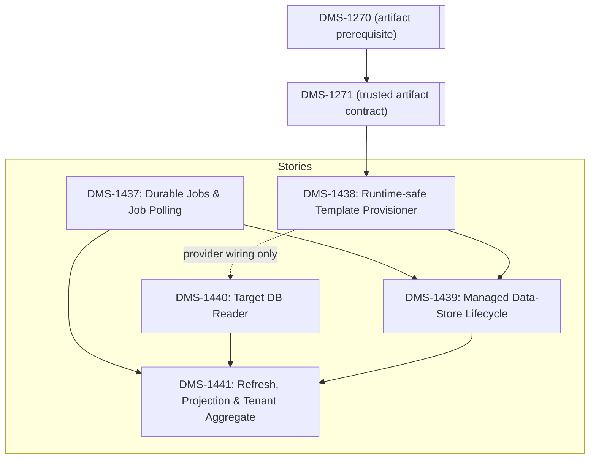

# DMS-1334 Candidate Implementation Stories

## Recommended story decomposition

The confirmed gaps in [the spike findings](data-store-lifecycle-findings.md) resolve into five stories:

| ID | Candidate story | Primary owner |
| --- | --- | --- |
| DMS-1437 | Add durable CMS background jobs, schedules, and Management API v3 job polling | CMS |
| DMS-1438 | Add a runtime-safe CMS DMS-template provisioner | CMS |
| DMS-1439 | Add managed data-store lifecycle endpoints and reconciliation to CMS | CMS, consuming CMS DMS-1438 |
| DMS-1440 | Add a CMS target-database education-organization reader | CMS |
| DMS-1441 | Add CMS education-organization refresh, projection, and tenant aggregation | CMS, consuming CMS DMS-1440 |

## Dependency and delivery order

- DMS-1437 and DMS-1440 can begin independently. DMS-1440 defines its minimal relational read contract and provider fixtures before implementing the provider SQL; final shared target-provider-setting wiring depends on DMS-1438. DMS-1438 design can begin, but package execution is blocked by DMS-1271 (transitively DMS-1270) until its trusted artifact contract is delivered.
- DMS-1439 requires DMS-1437 and DMS-1438.
- DMS-1441 requires DMS-1437 and DMS-1440. Its complete v3 tenant aggregate also requires DMS-1439, although refresh persistence for ordinary unmanaged stores can be developed before DMS-1439 lands.
- DMS-1438 must carry a Jira blocker link to open [DMS-1271](https://edfi.atlassian.net/browse/DMS-1271). It consumes DMS-1271's delivered trusted manifest/artifact contract but does not take ownership of DMS-1271's operator/bootstrap sequencing.

- DMS-1438 and DMS-1440 are implemented inside the existing CMS backend and provider-specific projects. They consume versioned DMS artifacts and database-shape contracts as data and add no CMS-to-DMS project/package reference, DMS runtime dependency, or Docker build-context change.

### Expected implementation locations

- Provider-neutral contracts, orchestration, and unit tests: `src/config/backend/EdFi.DmsConfigurationService.Backend` and `EdFi.DmsConfigurationService.Backend.Tests.Unit`.
- PostgreSQL persistence/adapters and live repository tests: `src/config/backend/EdFi.DmsConfigurationService.Backend.Postgresql` and `EdFi.DmsConfigurationService.Backend.Postgresql.Tests.Integration`.
- SQL Server persistence/adapters and live repository tests: `src/config/backend/EdFi.DmsConfigurationService.Backend.Mssql` and `EdFi.DmsConfigurationService.Backend.Mssql.Tests.Integration`.
- HTTP routes, options/DI wiring, authorization, problem details, and endpoint unit tests: `src/config/frontend/EdFi.DmsConfigurationService.Frontend.AspNetCore` and `EdFi.DmsConfigurationService.Frontend.AspNetCore.Tests.Unit`.
- Shared request/response validation models only when they follow existing ownership: `src/config/datamodel/EdFi.DmsConfigurationService.DataModel`.
- API contract and cross-component behavior: `src/config/tests/EdFi.DmsConfigurationService.Tests.E2E`.

Each implementer must inspect neighboring files and follow current repository naming/migration conventions rather than creating a new project. Schema and public-contract changes require tests in both providers plus API-level coverage. The story is not done when only the provider-neutral or one-provider path passes.

### Requirement interpretation

- Acceptance criteria are normative and should describe observable behavior, safety invariants, compatibility boundaries, and required verification.
- Architectural approach sections are normative only for ownership, dependency direction, persistence/transaction boundaries, and explicitly selected deployment topology.
- Sections labeled **Implementation guidance (non-binding)** provide a safe starting point, not a requirement to use the named C# API, property name, or storage representation. Equivalent implementations are acceptable when all acceptance criteria and tests pass.
- Names and exact wire values from a pinned OpenAPI or verified existing contract remain normative; unsourced examples must not be promoted into new API/configuration contracts during implementation.

### Ready-to-start gates

| Story | Start condition |
| --- | --- |
| DMS-1437 | Ready now. |
| DMS-1438 | Contract/options design may start; artifact execution waits for DMS-1270/DMS-1271 delivery and a pinned trusted artifact contract. |
| DMS-1439 | Starts after DMS-1437 and DMS-1438 contracts are stable; end-to-end completion waits for both implementations. |
| DMS-1440 | Ready now; define the minimal relational read contract and provider fixtures before implementing provider SQL. |
| DMS-1441 | Snapshot/schedule design may start; implementation needs DMS-1437/DMS-1440, complete aggregate needs DMS-1439, and endpoint conformance waits for the corrected pinned OpenAPI and verified removal-ticket provenance. |

## DMS-1437

**Add durable CMS background jobs, schedules, and Management API v3 job polling**

### Description

CMS has an in-process hosted-service precedent but no durable job resource, recurring schedule resource, or recoverable asynchronous execution. Managed lifecycle and education-organization refresh both need work to survive process restarts, avoid concurrent duplicate execution, retry safely, and expose the v3 job contract.

This story delivers tenant-scoped CMS job and schedule persistence, a recoverable dispatcher, and `GET /v3/jobs/{jobId}` without adding Quartz, a message broker, or a new service.

**Scope**

- Add provider-equivalent CMS persistence for jobs, attempts, timestamps, sanitized errors, retry timing, and lease ownership/expiry.
- Add provider-equivalent CMS persistence for recurring schedules: stable schedule ID, tenant, job type, non-secret payload/target identifiers, interval, enabled state, next-run time, and claim/lease metadata.
- Add provider-specific atomic claim/lease operations that allow multiple CMS replicas while permitting expired work to be reclaimed.
- Add a schedule dispatcher that atomically claims due schedules, enqueues ordinary `Pending` jobs, advances the next-run time, and reclaims expired schedule leases.
- Add an extensible in-process job-handler dispatch contract and a hosted worker using the existing CMS `BackgroundService` pattern.
- Add bounded retry/backoff, cancellation on shutdown, configurable retention/cleanup, structured logs, and operational metrics.
- Add the v3 job-status read endpoint.
- Establish explicit tenant context inside every background execution scope.

**API surface**

- `GET /v3/jobs/{jobId}`
- Response: `jobId`, `status`, `createdAt`, nullable `finishedAt`, nullable `errorMessage`
- Statuses: `Pending`, `InProgress`, `Completed`, `Error`
- Errors: `400` for missing/invalid tenant context when multi-tenancy is enabled, plus `401`, `403`, `404`, and existing CMS problem-details behavior

**Architecture and boundaries**

CMS owns job and schedule persistence because they are Management API control-plane resources. The `Jobs` model preserves Admin API's externally visible `JobStatuses` semantics while adding the retry/lease state required for recovery. The separate `Schedules` model preserves Admin API's distinction between a recurring trigger and each resulting job execution, but makes the trigger durable instead of using Admin API's in-memory Quartz schedule. Hosted workers poll/claim both due schedules and due jobs from the CMS database. Work is at-least-once, so handlers must be idempotent. Persisted payloads contain a type and tenant-scoped entity identifiers, never a connection string, token, package credential, or other secret.

The enqueue API must allow a caller to create its control-plane record and corresponding job atomically in one CMS transaction. A refresh caller that needs only a job may insert the job directly in that transaction. A due schedule creates the same ordinary job record used by a manual request; scheduled executions do not use a separate handler or status model.

**Dependencies**

- Existing CMS PostgreSQL and SQL Server repository/migration conventions.
- Existing [`TenantContext`](../../../src/config/backend/EdFi.DmsConfigurationService.Backend/Services/TenantContext.cs) and scoped provider.
- Existing [`TokenCleanupService`](../../../src/config/backend/EdFi.DmsConfigurationService.Backend.OpenIddict/Services/TokenCleanupService.cs) as a hosted-service pattern, not as job infrastructure.

**Blockers**

None. DMS-1437 can start independently.

**Out of scope**

- Managed data-store lifecycle handlers.
- Education-organization refresh handlers.
- A generic user-authored job API or arbitrary payload execution.
- A public schedule-management API or arbitrary user-defined schedules.
- Job cancellation, prioritization, or progress percentages not present in v3.

**Risks and implementation considerations**

- Exact operational defaults and payload/error bounds require refinement and load validation before coding. They may be configurable, but must preserve the lease-renewal invariant and fixed schedule misfire policy in AC 20.
- Provider-specific claim and reclaim statements must compare lease expiry using database UTC time rather than worker-process clocks (for example, PostgreSQL `now()` and SQL Server `SYSUTCDATETIME()`). Cross-provider integration tests must demonstrate equivalent observable claim, expiry, and reclaim behavior.

**Non-binding implementation guidance**

- Follow repository JSON conventions (`System.Text.Json`) and prefer a small explicit envelope/handler registry over serialized .NET type names.
- A GUID is a reasonable opaque job-ID implementation if it matches the pinned API representation; the story does not require a specific GUID version or text formatting beyond that contract.
- Choose polling, lease, retry, payload/error bounds, and retention defaults from provider-backed load/operational review rather than treating spike examples as product constants.

### Acceptance Criteria

1. PostgreSQL and SQL Server CMS schemas persist an opaque unique job ID compatible with the pinned OpenAPI representation, tenant, supported job type, versioned target payload, optional source-schedule/occurrence identity, status, created/finished timestamps, bounded sanitized error, attempt count, next-attempt time, lease owner/expiry, and a monotonically increasing fencing token.
2. Enqueue persists `Pending` before the originating API response is returned; an immediate authorized GET never races to `404` for an accepted job.
3. `GET /v3/jobs/{jobId}` returns the OpenAPI response shape and `404` for an absent job or a job belonging to another tenant.
4. Job GET uses the existing read-only-or-admin policy. It never exposes payload secrets, stack traces, administrative connection details, or another tenant's data.
5. A provider-specific atomic claim/reclaim uses database UTC, permits at most one unexpired lease, and increments the fencing token; renewal and every retry/terminal write match job ID, owner, and fencing token. A stale worker cannot mutate job or consumer state after losing its lease.
6. The worker creates a dependency-injection scope, establishes the job's persisted tenant context, invokes the registered handler, and clears/disposes the scope after completion.
7. A completed handler sets `Completed` and `finishedAt`; a terminal failure sets `Error`, `finishedAt`, and a sanitized client-facing error only while the handler still owns the matching lease version.
8. A transient handler failure increments persisted attempts, returns the job to `Pending`, records `nextAttemptAt`, clears lease fields, and leaves `finishedAt` null. Exhausting the configured attempt limit produces terminal `Error`.
9. Work left `InProgress` by process termination is reclaimable after lease expiry. The reclaim increments the fence, and an earlier worker's late commit is rejected.
10. The worker renews each active lease before expiry using database UTC. Renewal failure cancels local execution; every handler, including external process/database operations, observes cancellation and remains idempotent across retry.
11. Process shutdown stops new claims, cancels active handlers, and either safely returns a still-owned job to `Pending` or leaves it for lease expiry. A late completion is fenced.
12. Jobs use a versioned, size-bounded payload containing target CMS IDs only. Dispatch accepts only explicitly registered job types and supported payload versions; unknown, invalid, or oversized stored payloads fail terminally before handler execution. Payload deserialization cannot activate arbitrary runtime types.
13. Job retention/cleanup is configurable and cannot remove pending, leased, or retryable jobs.
14. Polling, lease, renewal, attempt, retry-backoff, retention, and cleanup settings have documented startup-validated defaults. Renewal occurs comfortably before lease expiry, retry/retention values are bounded, and invalid combinations fail startup with actionable diagnostics. Exact defaults require operational review before the story enters implementation.
15. Structured logs and metrics expose job type, tenant-safe identifiers, queue delay, attempt, duration, lease recovery, and outcome without logging payload secrets. API timestamps use UTC and the pinned OpenAPI date-time representation.
16. No Quartz package, external broker, or new deployable service is introduced.
17. PostgreSQL and SQL Server CMS schemas persist recurring schedules with a stable unique ID/key, tenant, job type, non-secret target/payload, interval, enabled state, next-run time, lease owner/expiry/version. A uniqueness constraint permits only one active schedule for a given tenant and schedule type.
18. Claiming a due schedule, inserting its `Pending` job with source schedule and scheduled-occurrence identity, and advancing the schedule's next-run time are atomic and fenced. A unique schedule-occurrence constraint prevents concurrent replicas or retries from enqueueing the same occurrence twice; expired schedule leases are reclaimable.
19. A scheduled job uses the same handler, retry rules, status transitions, tenant context, polling representation, retention rules, and observability as a manually enqueued job. Disabling a schedule prevents future enqueue without deleting prior job history.
20. Missed intervals are coalesced: after downtime, the dispatcher enqueues at most one immediately due occurrence and advances `nextRunAt` to the first future interval. It does not enqueue one catch-up job per missed interval.

### Tasks

**Implementation**

1. Add equivalent PostgreSQL/SQL Server job and schedule migrations, constraints, configurable bounds, and mapping models.
2. Add provider repository operations for atomic enqueue, claim/reclaim, renewal, fenced transitions, schedule occurrence creation, and cleanup.
3. Add the allowlisted versioned handler registry, worker/scheduler hosted services, cancellation, validated options/defaults, logs, and metrics.
4. Add tenant-safe `GET /v3/jobs/{jobId}` using existing authorization/problem-details conventions.
5. Document job/schedule configuration, recovery behavior, retention, observability, and operational tuning constraints for DMS-1437 consumers.

**Verification**

- Unit tests for job/schedule state transitions, next-run calculation, retry classification, error sanitization, tenant setup, and retention rules.
- PostgreSQL and SQL Server integration tests for atomic manual enqueue, atomic scheduled enqueue/next-run advancement, concurrent claims, renewal, lease expiry/reclaim, attempt persistence, schedule uniqueness, and tenant isolation.
- API-level tests for authorization, immediate polling, all response states, and cross-tenant `404` behavior.
- Restart simulations proving abandoned in-progress jobs and due schedule leases are reclaimed without losing or duplicating an occurrence.
- Two-worker tests where execution outlives the original lease: the current owner renews successfully, or a reclaimed worker completes and the stale worker's late state/result write is rejected.

## DMS-1438

**Add a runtime-safe CMS DMS-template provisioner**

### Description

DMS publishes Minimal and Populated database-template packages and has operator-oriented restore tooling, but CMS cannot safely invoke those PowerShell/Docker helpers inside an HTTP-triggered job. `ddl provision` creates an empty schema and does not implement the v3 template behavior.

This story delivers a CMS-owned runtime service that creates or deletes one managed PostgreSQL or SQL Server data store from a trusted, deployment-allowlisted DMS template.

**Scope**

- Define a provider-neutral create/delete contract in the existing CMS backend project, with implementations in the existing CMS PostgreSQL and SQL Server provider projects.
- Resolve v3 `Minimal` to a DMS Minimal package and v3 `Sample` to the equivalent DMS Populated package.
- Reuse the package identity, manifest, artifact hash, content-profile, schema-compatibility, and producer-trust contract coordinated with DMS-1271.
- Implement PostgreSQL SQL-dump and SQL Server backup restoration in the corresponding CMS provider projects.
- Add a target DMS data-store provider setting (working name `DmsDataStoreSettings.Provider`, values `postgresql` or `mssql`) independent of the provider used by the CMS catalog database.
- Implement administrative connection handling, safe identifier generation/quoting, reserved-name and protected-database denial, timeouts, cancellation, and secret-safe diagnostics.
- Use a caller-supplied expected `dms.DataStoreIdentity.SourceIdentity` to prove ownership for reconciliation and deletion.

**API surface**

No public endpoint is delivered by this story. The consuming request values are the v3 `databaseTemplate` values `Minimal` and `Sample`.

**Architecture and boundaries**

CMS owns this service because provisioning is invoked by the Management API lifecycle and is a control-plane responsibility. DMS owns the Resources, Descriptors, and Discovery APIs, template production, and the versioned artifact/database contracts consumed by the service; it does not own a Management API runtime component.

The request never supplies an artifact path, feed, package ID, database server, or administrative connection string. Those are resolved from operator configuration. The implementation stays within the current CMS project graph and must not reference DMS application projects or shell out to `pwsh`, Docker, `ddl provision`, or a repository script. DMS artifacts, manifests, `dms.DataStoreIdentity`, and `dms.EffectiveSchema` are consumed as versioned data contracts.

The PostgreSQL adapter uses a supported `psql` executable available in the CMS runtime. The SQL Server adapter executes administrative restore commands against a verified backup staged where the SQL Server host can read it. Both paths must protect credentials, honor cancellation/timeouts, verify immutable artifact bytes, clean up temporary resources on every outcome, and avoid secrets in process arguments and logs. A generic remote-upload protocol is not inferred: SQL Server deployments without server-visible backup staging are unsupported by this story.

**Dependencies**

- Completed [DMS-1255](https://edfi.atlassian.net/browse/DMS-1255) template packages for PostgreSQL and SQL Server.
- Delivery of the trusted manifest, artifact authentication, DMS-only content-profile, and compatibility contract owned by open [DMS-1271](https://edfi.atlassian.net/browse/DMS-1271). DMS-1438 must be linked as blocked by DMS-1271 in Jira.
- Existing [`Template-Management.psm1`](../../../eng/DatabaseTemplates/Template-Management.psm1) as verified provider restore sequencing: it demonstrates that `SourceIdentity` is reseeded after restore, but generates a fresh UUID. Assigning the lifecycle record's caller-supplied expected UUID is new DMS-1438 behavior, not an existing capability or runtime dependency.
- Existing CMS backend/provider project boundaries and database-provider registration conventions.
- The versioned DMS template and target-database contracts, including `dms.DataStoreIdentity` and `dms.EffectiveSchema`.

**Blockers**

- [DMS-1271](https://edfi.atlassian.net/browse/DMS-1271), transitively dependent on DMS-1270 — formal Jira blocker for the trusted artifact manifest, authentication, content-profile, and compatibility contract. DMS-1438 cannot complete trusted package execution until it is delivered.

**Out of scope**

- Producing or publishing template packages; DMS-1255 owns that pipeline.
- Bootstrap/start-script sequencing, workspace replacement, or multi-database restore; DMS-1271 owns that operator workflow.
- `ddl provision` changes unless a small existing provider primitive must be safely extracted without changing CLI behavior.
- Descriptor seeding; DMS-955 is obsolete and unrelated.
- DMS application, API, or runtime-library changes.
- CMS lifecycle persistence or public endpoints.

**Risks and implementation considerations**

- DMS-1271 is not complete. Its formal Jira blocker relationship prevents DMS-1438 completion until the trusted artifact contract lands; DMS-1438 must not execute unauthenticated PostgreSQL SQL or SQL Server backups while waiting.
- The repository does not record a provider on each ordinary data store. The one-target-provider-per-CMS-deployment constraint must be documented until a separately approved catalog change supports mixed providers.
- SQL Server restore file placement and PostgreSQL replay privileges differ operationally; the exact runtime dependencies and supported staging topology are release documentation, not late implementation choices.

**Non-binding implementation guidance**

- Process invocation and PostgreSQL credential handling are implementation decisions. The chosen approach should address quoting and injection risks, prevent credential exposure, secure temporary resources, and satisfy AC 12 and AC 16.
- SQL Server client selection and restore-command sequencing are implementation decisions. The chosen approach should provide logical-file validation, safe destination control, cancellation, redaction, cleanup, and satisfy AC 12, AC 17, and AC 18.
- Suggested option names such as `PostgresqlPsqlPath` and `MssqlBackupStagingPath` should follow the final CMS configuration conventions; their behavior is contractual, not the spelling of the property names.

### Acceptance Criteria

1. A typed async contract can create and delete one target for PostgreSQL and SQL Server and supports cancellation and configurable command timeouts.
2. Only `Minimal` and `Sample` are accepted at the contract boundary; matching is case-sensitive for v3 parity.
3. `Minimal` resolves to an allowlisted DMS Minimal package and `Sample` resolves to an allowlisted DMS Populated package for the configured target provider and supported Data Standard/effective schema.
4. Package bytes are authenticated and the manifest, artifact hash, provider, Data Standard, extension/project inventory, effective-schema metadata, DMS-only content profile, and engine compatibility are validated before target mutation.
5. Client input cannot choose or override an artifact path, feed, package ID/version, administrative connection, or protected database.
6. Target names are normalized and safely quoted. PostgreSQL `postgres`, `template0`, and `template1`; SQL Server `master`, `model`, `msdb`, and `tempdb`; and every configured CMS/identity database are rejected before destructive work.
7. Creation fails safely when the target already exists without a matching expected source identity. It does not drop or overwrite an unowned database.
8. A successful restore sets `dms.DataStoreIdentity.SourceIdentity` to the expected UUID supplied by the lifecycle record and validates the resulting DMS schema before success.
9. A retry accepts and reconciles an existing target only when the expected source identity, trusted artifact identity/hash, provider, engine compatibility, content profile, and effective schema all match and target validation is complete. It never replaces a target merely because source identity matches; a partial, incompatible, or unverifiable owned target fails safely for operator inspection.
10. Delete drops only a target whose `dms.DataStoreIdentity.SourceIdentity` matches the expected value. A missing target is an idempotent success; a mismatched or unreadable identity is a safe failure requiring inspection.
11. PostgreSQL and SQL Server implementations return typed outcome/error categories suitable for retry classification without returning secrets.
12. Administrative and generated runtime connection strings, package credentials, and decrypted secrets are never logged.
13. The provisioner has no dependency on Management API DTOs, job state, PowerShell, Docker, the DMS command-line application, or DMS runtime projects.
14. The provider-neutral contract is implemented in the existing CMS backend project and its provider adapters are implemented in the existing CMS PostgreSQL and SQL Server projects; no new CMS-to-DMS project/package reference or Docker build-context change is introduced.
15. A dedicated setting selects the target data-store provider independently of the CMS catalog provider, is validated at startup, and selects the matching CMS provider adapter. A deployment supports one configured target provider; mixed-provider ordinary data stores are out of scope until the catalog carries provider metadata.
16. PostgreSQL restoration uses a configured supported `psql` executable available in the CMS runtime. Startup validates availability; authentication and invocation do not expose credentials in arguments or logs; cancellation terminates the restore; and temporary credential/artifact resources are permission-restricted and cleaned up on every outcome.
17. SQL Server restoration uses provider-supported administrative database commands and a configured private staging location visible to the SQL Server host. CMS re-verifies the staged backup, validates its logical files and safe destination paths before restore, and cleans staging on every outcome.
18. Startup validates the selected provider's admin-secret reference, artifact catalog, runtime dependency, staging-path accessibility, and required privileges before managed routes can accept work. Documentation defines supported same-host/container/shared-volume topologies and explicitly rejects an unavailable SQL Server staging path.

### Tasks

**Implementation**

1. Finalize DMS-1438 only after DMS-1270/DMS-1271 deliver a pinned manifest, producer-trust, content-profile, and compatibility contract.
2. Add validated `DmsDataStoreSettings` and the provider-neutral provision/delete request, result, and typed-error contracts in the existing CMS backend project.
3. Add trusted artifact resolution, immutable staging, hash verification, protected-name/ownership validation, and secret-safe diagnostics.
4. Implement PostgreSQL `psql` restore and SQL Server administrative restore/staging adapters in their existing provider projects, including cancellation and cleanup.
5. Add the required container/runtime dependencies and operator documentation for supported topology, credentials, privileges, staging, cancellation, and cleanup.

**Verification**

- Unit tests for template resolution, compatibility validation, identifier/protected-target checks, typed errors, and secret redaction.
- Live PostgreSQL and SQL Server integration tests for Minimal and Sample/Populated creation, effective-schema validation, source-identity assignment, idempotent retry, owned deletion, absent deletion, mismatch refusal, cancellation, and cleanup after failure.
- Adversarial tests for forged/tampered packages, manifest mismatches, protected targets, unowned collisions, SQL/identifier injection, and contaminated non-DMS package content.

## DMS-1439

**Add managed data-store lifecycle endpoints and reconciliation to CMS**

### Description

CMS can register an existing data store but cannot provision, observe, or physically delete one. The v3 managed resource requires a separate lifecycle aggregate whose asynchronous work ultimately creates or removes an ordinary CMS `DataStore` registration.

This story delivers `/v3/dataStores/manage`, durable create/delete reconciliation, and safe integration with the existing routing catalog.

**Scope**

- Add tenant-scoped managed data-store persistence for request values, generated database name, expected source identity, linked ordinary data-store ID/name, lifecycle status, and timestamps.
- Add collection, create, by-ID, and delete routes under `/v3/dataStores/manage`.
- Add create and delete job handlers using DMS-1437 and the DMS-1438 provisioner.
- Build and encrypt the ordinary runtime connection string using existing CMS facilities and insert/remove it through the existing data-store repository boundary.
- Add duplicate, lifecycle-state, database-name, provider/configuration, and ownership validation.
- Prevent ordinary update or metadata-only deletion from bypassing managed lifecycle.
- Add `EnableDataStoreManagement`, default `true`, gating managed routes and managed work only.

**API surface**

- `GET /v3/dataStores/manage`
- `POST /v3/dataStores/manage`
- `GET /v3/dataStores/manage/{id}`
- `DELETE /v3/dataStores/manage/{id}`
- Existing `PUT /v3/dataStores/{id}` and `DELETE /v3/dataStores/{id}` receive atomic guards for managed records.

No managed PUT is in the v3 contract.

**Architecture and boundaries**

CMS owns the management aggregate and state machine. `dmscs.DataStore` remains the ordinary DMS routing registration and is populated only after physical provisioning succeeds. Each CMS-only consistency boundary is atomic: managed row plus job enqueue; ordinary row plus link/`Created`; `PendingDelete` plus job; and snapshot/ordinary removal plus retained `Deleted` tombstone. Existing repository calls that create independent transaction scopes cannot be composed to claim this atomicity. Job handlers reconcile physical and CMS state idempotently because physical databases and CMS cannot share a transaction.

Lifecycle statuses follow current v3 behavior: `PendingCreate`, `CreateInProgress`, `Created`, `CreateFailed`, `CreateError`, `PendingDelete`, `DeleteInProgress`, `Deleted`, `DeleteFailed`, and `DeleteError`.

**Dependencies**

- DMS-1437 durable CMS jobs.
- DMS-1438 CMS-owned runtime-safe DMS-template provisioner.
- Existing CMS `IDataStoreRepository`, connection-string encryption, authorization policies, tenant context, and provider-specific migration conventions.
- Existing DMS data-store cache refresh; no new callback dependency.

**Blockers**

- [DMS-1437](#dms-1437) — must deliver durable job enqueue, execution, retry, and polling.
- [DMS-1438](#dms-1438) — must deliver the CMS-owned trusted template provisioner used by create/delete reconciliation.

**Out of scope**

- Managed update/rename/copy, database size reporting, migrations, or progress percentages.
- Creating template artifacts.
- Application/API-client assignment to the new data store.
- Immediate DMS cache invalidation or a reverse service callback.
- Education-organization refresh.

**Risks and implementation considerations**

- Physical and CMS state cannot be committed atomically. Correctness depends on the idempotent state machine and DMS-1438 ownership check.
- Operators need explicit documentation for administrative database privileges and the DMS cache visibility window.

### Acceptance Criteria

1. Managed records are tenant-scoped and persist all fields needed to return `dataStoreManageModel`, plus an internal expected source identity and retry/reconciliation metadata that are never exposed.
2. `POST /v3/dataStores/manage` trims `name`, requires 1–100 characters matching `^[A-Za-z0-9 _]+$`, and accepts only case-sensitive `Minimal` or `Sample`. Normalized uniqueness uses the trimmed value. Invalid values return the established CMS `400` problem details.
3. POST is create-only. It returns `400` for an active managed name, an existing ordinary data-store name, or an unsafe/overlength generated name. Database naming starts with `EdFi_Ods`, converts spaces to underscores, trims underscores, strips repeated leading case-insensitive `edfi_ods` variants, appends the case-sensitive template, and enforces a portable 63-character maximum. Static configuration is validated at startup; transient artifact/target outages discovered after acceptance are retryable job failures, not client errors.
4. POST atomically inserts `PendingCreate` and its durable job, then returns `202 Accepted`, no required body, and an absolute `Location` for `/v3/dataStores/manage/{id}`.
5. Collection GET supports the OpenAPI paging/sorting, `id`, and `name` filters and returns tenant-scoped management models. By-ID GET returns one model or `404` without revealing another tenant's record.
6. Create execution transitions through `CreateInProgress`, calls DMS-1438 with the persisted target name/template/expected source identity, then atomically creates the encrypted ordinary `DataStore`, links it, and marks `Created` in a single CMS transaction.
7. A transient create failure is recorded as `CreateFailed` while DMS-1437 will retry; exhausting attempts records `CreateError`. Retries reconcile an already-owned physical target and an already-linked ordinary record without duplicates.
8. `DELETE /v3/dataStores/manage/{id}` accepts only `Created`, atomically writes `PendingDelete` and its job in a single CMS transaction, and returns `204`. Absent/`Deleted` returns `404`; all other lifecycle states return a status-specific `400`.
9. Delete execution transitions through `DeleteInProgress`, verifies and drops the DMS-1438-owned physical target, then atomically removes its snapshot and linked ordinary catalog row, retains the management tombstone, and marks `Deleted` in a single CMS transaction.
10. A transient delete failure is `DeleteFailed`; exhausting attempts is `DeleteError`. Retry is idempotent when the owned database or ordinary catalog row is already absent.
11. Existing ordinary `PUT /v3/dataStores/{id}` and `DELETE /v3/dataStores/{id}` return `409 Conflict` for a linked managed data store. Stable CMS problem details include the absolute `/v3/dataStores/manage/{manageId}` location. PostgreSQL and SQL Server enforce the link check and mutation atomically in the repository transaction, preventing TOCTOU races and bypass through another handler.
12. Management responses and logs never expose the ordinary or administrative connection string, expected source identity, package credentials, or decrypted secrets.
13. Managed POST/DELETE use the existing admin policy. Managed reads use the existing read-only-or-admin policy. All repository and job operations enforce tenant isolation.
14. With `EnableDataStoreManagement=false`, all managed routes return the established CMS `400` disabled-feature problem details and managed jobs are not claimed/scheduled; job and education-organization capabilities remain available.
15. With the feature enabled or unset, default behavior is enabled. Startup validates required administrative connection and template-catalog configuration with actionable diagnostics.
16. Successful ordinary registration becomes visible through the existing DMS cache refresh. Documentation states that routability is eventually consistent with `DataStoreCacheExpirationSeconds`; no CMS-to-DMS callback is introduced.
17. PostgreSQL and SQL Server exhibit the same observable API/state behavior.

### Tasks

**Implementation**

1. Add provider-equivalent managed lifecycle migrations, constraints, records, mapping, and deterministic database-name validation.
2. Add managed-aggregate persistence operations that provide one atomic transaction for every CMS consistency boundary, including failure-injection tests.
3. Add routes, validators, authorization, feature gating, stable problem details, and absolute resource locations.
4. Add fenced/idempotent DMS-1437 create/delete handlers around DMS-1438, encrypted ordinary registration, snapshot cleanup, and lifecycle transitions.
5. Add atomic ordinary PUT/DELETE repository guards and document managed-resource conflict/remediation behavior.

**Verification**

- Unit tests following CMS conventions for validators, route results, authorization mapping, state transitions, retry classification, feature flag, and secret redaction.
- PostgreSQL and SQL Server integration tests for schema constraints, each aggregate transaction boundary, injected rollback, duplicate races, tenant isolation, and ordinary data-store linking/removal.
- API-level integration tests for every route/status, exact name/database-name vectors, absolute `Location`, filters, disabled mode, cross-tenant behavior, and ordinary PUT/DELETE guards.
- Live provider tests covering successful create/delete, process interruption and lease recovery, retry after each cross-system boundary, unowned collision refusal, and DMS discovery after cache expiry.

## DMS-1440

**Add a CMS target-database education-organization reader**

### Description

CMS needs to read the four core education-organization types from each configured DMS database for the Management API projection. Existing DMS token-info code is request- and mapping-specific and returns token ancestry; it is evidence for physical relationships, not an appropriate CMS dependency.

This story first defines the minimal relational read contract and provider fixtures from the existing generated DMS PostgreSQL and SQL Server DDL, then delivers a reader that enumerates a target data store's core education organizations in the Management API projection shape.

**Scope**

- Define a minimal relational read contract from the existing generated DMS PostgreSQL and SQL Server DDL, covering supported Data Standard/effective-schema versions; `dms.EffectiveSchema` compatibility fields; required provider objects, columns, types, nullability, joins, hierarchy precedence, and deterministic ordering; and representative provider fixtures.
- Define a provider-neutral async reader contract in the existing CMS backend project returning education-organization ID, institution name, nullable short name, discriminator, and nullable direct parent ID.
- Implement PostgreSQL and SQL Server adapters in the existing CMS provider projects using the stable DMS database shape for the four current Admin API core types: State Education Agency, Education Service Center, Local Education Agency, and School.
- Validate the configured target provider, the target `dms.EffectiveSchema` contract/version, and every required core table and column before projection.
- Encode the exact Management API discriminator and direct-parent rules as CMS projection behavior. Extension-defined education-organization types are not queried because the Management API contract does not define their discriminator or parent semantics.
- Return deterministic, unique results with provider-neutral error categories and cancellation.
- Keep the reader independent of HTTP request/authentication state and CMS persistence.

**API surface**

No public route is delivered. The output must be sufficient for the OpenAPI `educationOrganizationModel` embedded by DMS-1441.

**Architecture and boundaries**

CMS owns the reader because it supports a Management API projection and runs inside a CMS refresh job. The provider-neutral contract and provider adapters follow the existing CMS layering; no CMS project references a DMS project. DMS continues to own Resources, Descriptors, and Discovery behavior, while the reader treats the generated DMS relational schema as its versioned integration boundary.

The reader performs an explicit Management API projection against the pinned contract only. It does not reuse the token-info response discriminator (`Ed-Fi:School`), require DMS `RequestInfo`, load DMS mapping/schema packages, call the public DMS API, or require an OAuth client. A target incompatible with the supported versioned database contract fails before returning a partial projection.

**Dependencies**

- Existing CMS backend, PostgreSQL, and SQL Server project boundaries and service-registration conventions.
- Existing generated DMS PostgreSQL and SQL Server DDL as the source for the minimal relational read contract and provider fixtures.
- The target-provider setting from DMS-1438, which selects the target-database adapter independently of the CMS catalog provider.
- Current Admin API behavior and DMS token-info implementation as behavioral evidence only, not runtime dependencies or reuse seams.

**Blockers**

- [DMS-1438](#dms-1438) — blocks final shared target-provider-setting wiring. The provider-neutral interface/model can be developed before DMS-1438 completes.

**Out of scope**

- CMS snapshot persistence or refresh endpoints.
- Application education-organization assignment validation.
- A new public DMS resource endpoint or any DMS application/code change.
- Extension-defined education-organization types until the Management API contract defines their projection semantics.
- Historical/deleted education organizations not present in the active target data store.

**Risks and implementation considerations**

- A future DMS database-layout change can break direct reads. The DMS database contract must be versioned, validated before use, and changed compatibly or with a coordinated CMS adapter update.
- Mixed target providers remain out of scope until ordinary data stores carry provider metadata; the configured target provider must match every queried data store.

### Acceptance Criteria

1. A provider-neutral CMS backend contract asynchronously returns the v3 projection fields using non-nullable internal models except for fields nullable in the contract.
2. PostgreSQL and SQL Server implementations reside in the existing CMS provider projects and require no `RequestInfo`, authenticated DMS request, DMS HTTP call, DMS project/package reference, or DMS startup component.
3. Before provider SQL is implemented, DMS-1440 defines and checks in a minimal relational read contract derived from the existing generated DMS PostgreSQL and SQL Server DDL. It specifies supported Data Standard/effective-schema versions, required `dms.EffectiveSchema` compatibility fields, required provider objects/columns/types/nullability, joins, hierarchy precedence, deterministic ordering, and representative fixtures for both providers.
4. The reader enumerates exactly State Education Agency, Education Service Center, Local Education Agency, and School without requiring the caller to know IDs in advance.
5. Before projecting data, the reader validates the pinned contract version, target `dms.EffectiveSchema` compatibility fields, and every required core object/column/type/nullability rule. A missing or incompatible contract produces a typed non-transient failure and no partial projection is returned.
6. Core discriminators match current Admin API projection values: `edfi.StateEducationAgency`, `edfi.EducationServiceCenter`, `edfi.LocalEducationAgency`, and `edfi.School`. The existing token-info values such as `Ed-Fi:School` are not exposed on this contract.
7. Core `parentId` precedence matches current Admin API behavior: School uses its Local Education Agency; Local Education Agency uses parent Local Education Agency, then Education Service Center, then State Education Agency; Education Service Center uses State Education Agency; State Education Agency has no parent. Self and transitive-only ancestors are not returned as the direct parent.
8. Duplicate identifiers or contradictory core relationships fail with actionable diagnostics rather than returning ambiguous results.
9. PostgreSQL and SQL Server return equivalent ordered results, preserve `int64` identifiers, and correctly handle an empty data store.
10. Missing required tables/columns or an incompatible effective-schema contract returns a typed non-transient failure suitable for DMS-1441 job reporting.
11. Connection/transient provider failures remain distinguishable for retry classification and do not include secrets.
12. The reader adds no public DMS or CMS route, job, snapshot table, OAuth credential, or HTTP dependency.
13. Extension-defined education-organization types are excluded. The reader neither guesses nor synthesizes discriminator or parent semantics absent from the Management API contract.
14. The CMS contract and adapters are implemented within the existing CMS project graph; no CMS-to-DMS project/package reference, runtime library, or Docker build-context change is introduced.

### Tasks

**Implementation**

1. Define and check in the minimal relational read contract and representative PostgreSQL/SQL Server fixtures derived from the existing generated DMS DDL.
2. Add provider-neutral projection models, reader interface, compatibility result, and typed error categories in the existing CMS backend project.
3. Add contract tests for the fixtures, then implement PostgreSQL and SQL Server adapters without inferring any unlisted object or join.
4. Wire the adapter through the validated target-provider setting after DMS-1438 supplies it.
5. Document the supported contract versions, compatibility diagnostics, provider assumptions, and coordinated DMS/CMS upgrade process.

**Verification**

- Reader unit tests for the exact four core discriminators and parent-precedence rules, exclusion of extension types, short-name nullability, duplicate IDs, contradictory relationships, deterministic ordering, and typed failures.
- Contract-validation tests prove a missing/incompatible target effective schema or required table/column prevents a partial projection and returns the non-transient classification.
- PostgreSQL and SQL Server integration tests against realistic State Education Agency, Education Service Center, Local Education Agency, and School hierarchies, including `int64` IDs.

## DMS-1441

**Add CMS education-organization refresh, projection, and tenant aggregation**

### Description

CMS stores application education-organization IDs but cannot discover the organizations present in each configured data store, refresh a durable projection, expose refresh job status, or return the tenant aggregate required by Management API v3.

This story delivers tenant-scoped snapshots, mandatory manual refresh, the retained tenant aggregate route, and required scheduled refresh matching current Admin API behavior. It intentionally does not add either superseded education-organization read route.

**Scope**

- Add provider-equivalent CMS snapshot persistence keyed by tenant, data store, and education-organization ID, including refresh metadata.
- Add refresh-all and refresh-one endpoints that enqueue DMS-1437 jobs and return the v3 job response.
- Add refresh job handlers that decrypt the existing ordinary data-store connection, call the CMS-owned DMS-1440 reader, and transactionally replace snapshots per successful target.
- Add configurable scheduled refresh per tenant using DMS-1437's durable `Schedules` and `Jobs` persistence, the same refresh-all handler as manual refresh, and the same duplicate-suppression rules.
- Add `GET /v3/tenants/{tenantName}/dataStores/edOrgs` and merge ordinary data stores, snapshots, and DMS-1439 management metadata.
- Remove a data store's snapshot when its ordinary CMS catalog row is deleted, including deletion through DMS-1439 managed lifecycle.
- Add truthful partial-failure, stale-snapshot, retry, authorization, observability, and tenant-isolation behavior.

**API surface**

- `POST /v3/dataStores/edOrgs/refresh`
- `POST /v3/dataStores/{dataStoreId}/edOrgs/refresh`
- `GET /v3/tenants/{tenantName}/dataStores/edOrgs`
- `GET /v3/jobs/{jobId}` from DMS-1437
- Explicitly excluded as superseded: `GET /v3/dataStores/edOrgs`
- Explicitly excluded: `GET /v3/dataStores/{dataStoreId}/edOrgs`

**Architecture and boundaries**

CMS owns both the Management API projection and its target-database reader. DMS-1440 isolates the versioned DMS database contract behind CMS provider adapters. CMS does not reference DMS projects, proxy the public DMS API, create service OAuth credentials, or add a reverse service call.

Scheduled refresh mirrors Admin API's logical separation between a recurring trigger and each refresh execution. CMS startup reconciliation creates or updates one stable DMS-1437 schedule per configured tenant from `EdOrgsRefreshIntervalInMins`; each due occurrence enqueues the same refresh-all job used by the manual route. Unlike Admin API's in-memory Quartz trigger, the CMS schedule and its next-run/lease state are durable. The schedule is independent of `EnableDataStoreManagement`.

Each successful target refresh replaces that target's snapshot in one CMS transaction. Failure leaves the previous snapshot intact. An all-target job may keep successful replacements, but if any target fails its aggregate DMS-1437 job ends in `Error` with a bounded sanitized summary.

**Dependencies**

- DMS-1437 durable jobs, schedules, dispatch, and polling.
- DMS-1440 CMS target-database education-organization reader.
- The versioned DMS database contract and configured target-provider setting consumed by DMS-1440.
- Existing CMS ordinary data-store repository, connection-string encryption/decryption, tenant context, and authorization policies.
- Existing [`TenantResolutionMiddleware`](../../../src/config/frontend/EdFi.DmsConfigurationService.Frontend.AspNetCore/Middleware/TenantResolutionMiddleware.cs), whose deliberate `/v3/tenants...` bypass means DMS-1441 must install path-derived tenant context itself.
- DMS-1439 for the complete v3 aggregate's management metadata, pending/unlinked lifecycle entries, and managed-delete cleanup integration. Snapshot persistence and refresh of ordinary unmanaged stores can be developed before DMS-1439 lands.
- The selected removal of the per-data-store GET. The reported `ADMINAPI-1488` key/provenance and corrected contract revision must be verified during refinement.

**Blockers**

- [DMS-1437](#dms-1437) — must deliver durable manual/scheduled job enqueue, execution, status polling, and schedule dispatch.
- [DMS-1440](#dms-1440) — must deliver the CMS target-database education-organization reader.
- [DMS-1439](#dms-1439) — blocks the complete tenant aggregate and managed-delete snapshot cleanup. Snapshot persistence and refresh for ordinary unmanaged stores can proceed before DMS-1439 completes.
- Contract gate — checked-in OpenAPI/current Admin API source returns `201 Created`; the selected `202 Accepted` behavior is blocked on ADMINAPI-1496 and a pinned updated OpenAPI revision. The per-data-store GET exclusion likewise requires a verified owning ticket and pinned corrected contract before conformance implementation. Refinement must also confirm the canonical `{tenantName}` accepted in single-tenant mode; CMS currently has no equivalent named setting.

**Out of scope**

- The deprecated per-data-store education-organization GET.
- Writing education organizations to DMS or validating application assignments against the snapshot.
- Real-time/event-driven synchronization or change-data capture.
- A CMS-to-DMS HTTP client, service credential, or message broker.
- Deleting or modifying target data-store domain data.

**Risks and implementation considerations**

- Snapshots are eventually consistent by design. Operator documentation must explain manual and scheduled refresh, the configured interval, error status, and retained stale data.
- An incompatible DMS database contract or a target-provider mismatch blocks refresh by design. Deployment documentation must identify the supported contract versions and diagnostics.
- An all-target refresh can be expensive. Bounded concurrency, command timeouts, and job deduplication need provider-backed load validation.
- Long refresh duration, downtime, or lease recovery can make an occurrence late. Operator documentation must explain DMS-1437's single-run coalescing behavior; it must not produce a catch-up burst or overlapping tenant refreshes.

**Non-binding implementation guidance**

- Resolve tenant-scoped aggregate dependencies lazily after installing the path-derived tenant context. Resolving from the request service provider or from a nested scope are both acceptable if lifetime/disposal and tenant isolation tests pass.
- A single-tenant schedule may use a null/internal sentinel tenant key, but that is a persistence choice and must not define the public `{tenantName}` contract.
- Avoid tests coupled to exact `jobQueuedResult.message` prose unless the pinned OpenAPI/reference contract requires exact text.

### Acceptance Criteria

1. PostgreSQL and SQL Server CMS schemas persist tenant-scoped snapshot rows with data-store ID, the full v3 education-organization model, and internal refresh timestamps. Uniqueness prevents duplicate organization IDs within one tenant/data store.
2. Refresh-all uses the current tenant's ordinary data stores, including unmanaged stores. It does not attempt to query pending management records that lack an ordinary data-store link.
3. Refresh-one returns `404` when the ordinary data store is absent or belongs to another tenant.
4. After the contract gate is resolved, both refresh routes require the existing admin policy, atomically enqueue a `Pending` DMS-1437 job, and return `202 Accepted`, an absolute `/v3/jobs/{jobId}` `Location`, and `jobQueuedResult` with the same job ID. The response message distinguishes refresh-all from refresh-one and follows the pinned contract/reference behavior; exact prose is not an acceptance requirement unless the pinned contract makes it one.
5. The returned job is immediately readable through DMS-1437 and no scheduling race can produce an initial `404`.
6. CMS validates the configured target provider at startup. DMS-1440 validates each target's versioned DMS database contract and required core tables/columns before projection; failures produce actionable diagnostics.
7. A refresh handler establishes the persisted tenant context, resolves/decrypts the existing data-store connection only inside the job scope, invokes DMS-1440, and never persists that connection in the job payload or snapshot.
8. DMS-1440 verifies the target `dms.EffectiveSchema` contract/version and required core objects before returning a projection. A mismatch is non-transient, preserves the previous snapshot, and appears in the sanitized job error.
9. A successful target read transactionally replaces only that tenant/data-store snapshot and removes organizations no longer present. Other tenants and stores are untouched.
10. A target failure preserves its previous complete snapshot, emits secret-safe structured diagnostics, and is classified for DMS-1437 retry where appropriate.
11. A refresh-all job that has any target failure ends in `Error` after processing the selected targets, with a bounded sanitized summary. Successful target snapshots remain committed and are not rolled back by another target's failure.
12. Concurrent or scheduled refresh attempts for the same tenant/target are deduplicated or serialized so no older completion can overwrite a newer snapshot.
13. `EdOrgsRefreshIntervalInMins` configures required periodic refresh and must be positive. In multi-tenant mode, startup reconciliation creates/updates one stable active DMS-1437 schedule per current tenant repository record and disables (without deleting history) schedules for removed tenants. In single-tenant mode it maintains one schedule for the canonical single-tenant context. Each occurrence uses the same refresh-all handler, has no HTTP-context dependency, prevents target overlap, and remains active when `EnableDataStoreManagement=false`.
14. `GET /v3/tenants/{tenantName}/dataStores/edOrgs` uses read-only-or-admin and returns `tenantDetailsResponse`. In multi-tenant mode it first requires `Tenant`; missing returns existing CMS `400`. It compares header/path before lookup; mismatch returns existing `400` without existence disclosure. A matching pair is resolved with the non-tenant-scoped tenant repository; unknown returns `404`. Tenant-scoped aggregate dependencies are not resolved or called until `TenantContext.Multitenant` is installed, and scope disposal cannot leak context.
15. In single-tenant mode no `Tenant` header is required and context remains `NotMultitenant`. `{tenantName}` must equal the canonical single-tenant value confirmed during contract refinement or return `404`; this story must not invent a new configuration property or default value without that product decision.
16. The tenant response includes every ordinary tenant data store with its snapshot. An unmanaged ordinary store has null management identifiers/template/database name and status `Created`. Data stores are ordered by numeric ID; embedded education organizations are ordered by numeric ID.
17. When DMS-1439 is present, linked management metadata overlays the ordinary store. Pending or orphaned management records without a linked ordinary store are also present after ordinary stores, ordered by management ID, with lifecycle status and an empty education-organization list.
18. No response or log exposes ordinary/admin connection strings, decrypted secrets, internal job payload, or another tenant's snapshot.
19. `GET /v3/dataStores/{dataStoreId}/edOrgs` is not registered per the selected spike boundary. Contract tests for exclusion start only after the owning removal ticket/provenance and corrected OpenAPI revision are verified.
20. Education-organization IDs and parent IDs remain `int64` end to end.
21. Deleting an unmanaged ordinary data store deletes its snapshot in the same CMS transaction. DMS-1439 managed deletion reaches the same cleanup when it removes the linked ordinary row; tenant aggregation never returns orphaned snapshot rows after either path.
22. CMS consumes DMS-1440 through its own backend abstraction and provider adapters. No CMS project references a DMS application/library project, internal startup task, request pipeline, or HTTP host.
23. `GET /v3/dataStores/edOrgs` is not registered. The original story route is superseded by the authoritative tenant aggregate, and tests/documentation do not depend on the unscoped route.

### Tasks

**Implementation**

1. Resolve the ADMINAPI-1496 response-code delta and per-store removal provenance; pin the corrected OpenAPI revision before route/conformance work.
2. Add provider-equivalent snapshot persistence, replacement/delete transactions, deterministic aggregate reads, and concurrency guards.
3. Add manual refresh enqueue routes and fenced/idempotent DMS-1437 handlers over DMS-1440, including contract-compliant operation-specific messages and truthful partial failure.
4. Add tenant schedule reconciliation for multi- and single-tenant modes using DMS-1437, including tenant removal/history behavior.
5. Add the late-resolved tenant aggregate endpoint, merge DMS-1439 metadata, and document refresh consistency, retained-stale-data, scheduling, and tenant-resolution behavior.

**Verification**

- Unit tests for route contracts, exact tenant error semantics, authorization, target-provider startup diagnostics, schedule reconciliation, interval validation, merge/default behavior, partial failure, database-contract mismatch retention, deduplication, deletion cleanup, and tenant setup.
- PostgreSQL and SQL Server CMS integration tests for snapshot replacement/removal, ordinary and managed delete cleanup, tenant isolation, transactional failure, `int64` IDs, and concurrency.
- API-level tests for both refresh routes, immediate polling, exact tenant `404`/header-mismatch `400` behavior, path-derived repository tenant context, cross-tenant isolation, absolute `Location`, manual and scheduled job outcomes, tenant response shape, managed/unmanaged/pending stores, and both excluded unscoped/per-store route `404` responses.
- Live cross-provider validation against DMS stores containing representative education-organization hierarchies, plus one inaccessible store proving partial success is reported as `Error` and prior data is preserved.

## Why five stories is appropriate

Fewer stories would combine independently substantial responsibilities:

- DMS-1437 is shared job/schedule infrastructure with its own persistence, concurrency, tenancy, and API contract.
- DMS-1438 and DMS-1440 are separate CMS provider-backed services with unrelated artifact/security and target-query risks.
- DMS-1439 and DMS-1441 are separate CMS capabilities with different routes, persistence, failure semantics, and delivery dependencies.

More stories would split endpoints, provider adapters, tables, workers, feature flags, or tests away from the cohesive capability that needs them. The five-story boundary lets the three prerequisites be developed and reviewed independently inside CMS, then lets each CMS feature consume them without creating one endpoint/class story or one oversized story.

## Coverage mapping

| Findings gap | Resolution |
| --- | --- |
| G01 ordinary registration | Existing capability; reused by DMS-1439. |
| G02 managed persistence | DMS-1439 |
| G03 managed POST | DMS-1439 |
| G04 managed reads | DMS-1439 |
| G05 managed physical delete and ordinary mutation guards | DMS-1439 consuming DMS-1438 |
| G06 template meaning | DMS-1438 |
| G07 provider-neutral provisioner | DMS-1438 |
| G08 durable execution | DMS-1437 |
| G09 job polling | DMS-1437 |
| G10 concurrency/crash recovery | DMS-1437 |
| G11 DMS discovery | Existing capability; documented by DMS-1439. |
| G12 versioned education-organization database contract and extraction | DMS-1440 relational read contract, provider fixtures, and CMS reader |
| G13 snapshot persistence | DMS-1441 |
| G14 refresh all/one | DMS-1441 consuming DMS-1437/DMS-1440 |
| G15 tenant aggregate | DMS-1441 |
| G16 selected removal of per-store read | Intentionally absent; contract/ticket provenance gate recorded in DMS-1441. |
| G17 authorization policies | Existing mechanism applied within DMS-1437/DMS-1439/DMS-1441; no separate story. |
| G18 background tenant propagation | DMS-1437 |
| G19 management feature flag | DMS-1439 |
| G20 truthful refresh failure | DMS-1441 |
| G21 scheduled refresh | DMS-1437 durable schedule/job infrastructure; DMS-1441 tenant schedule and refresh behavior |
| G22 snapshot cleanup on data-store deletion | DMS-1441 integrated with DMS-1439 |
| G23 CMS/DMS project boundary | Existing structure is sufficient: DMS-1438/DMS-1440 stay in CMS and consume versioned DMS artifacts/database contracts as data; no cross-project reference is added. |
| G24 original unscoped all-store read | Superseded/out of scope; DMS-1441 implements only the tenant aggregate. |

Every candidate story maps to confirmed gaps, and every gap has an explicit implementation, reuse, or exclusion disposition. DMS-1437 and DMS-1440 can start now. DMS-1438, DMS-1439, and DMS-1441 are directly implementable only for the portions allowed by their ready-to-start gates; no developer or AI agent should invent the missing artifact contract, ticket provenance, or response contract to bypass those gates.
