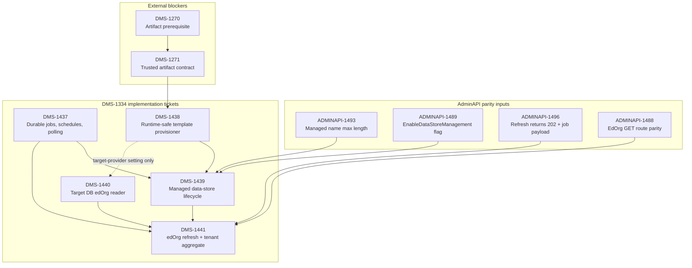

# DMS-1334 Candidate Implementation Stories

## Recommended story decomposition

The confirmed gaps in [the spike findings](data-store-lifecycle-findings.md) resolve into five stories:

These files are the developer handoff for the DMS-1334 spike after the Jira tickets were created. The index preserves shared Admin API parity rules, delivery order, readiness gates, and coverage mapping; each linked ticket file contains the implementation-specific scope, acceptance criteria, payload examples, persistence notes, and verification expectations for that Jira ticket.

| ID | Candidate story | Primary owner |
| --- | --- | --- |
| [DMS-1437](DMS-1437-durable-jobs-and-schedules.md) | Add durable CMS background jobs, schedules, and Management API v3 job polling | CMS |
| [DMS-1438](DMS-1438-template-provisioner.md) | Add a runtime-safe CMS DMS-template provisioner | CMS |
| [DMS-1439](DMS-1439-managed-data-store-lifecycle.md) | Add managed data-store lifecycle endpoints and reconciliation to CMS | CMS, consuming CMS DMS-1438 |
| [DMS-1440](DMS-1440-edorg-reader.md) | Add a CMS target-database education-organization reader | CMS |
| [DMS-1441](DMS-1441-edorg-refresh-and-tenant-aggregate.md) | Add CMS education-organization refresh, projection, and tenant aggregation | CMS, consuming CMS DMS-1440 |

## Dependency and delivery order

- DMS-1437 and DMS-1440 can begin independently. DMS-1440 defines its minimal relational read contract and provider fixtures before implementing the provider SQL; final shared target-provider-setting wiring depends on DMS-1438. DMS-1438 design can begin, but package execution is blocked by DMS-1271 (transitively DMS-1270) until its trusted artifact contract is delivered.
- DMS-1439 requires DMS-1437 and DMS-1438.
- DMS-1441 requires DMS-1437 and DMS-1440. Its complete v3 tenant aggregate also requires DMS-1439, although refresh persistence for ordinary unmanaged stores can be developed before DMS-1439 lands.
- DMS-1438 must carry a Jira blocker link to open [DMS-1271](https://edfi.atlassian.net/browse/DMS-1271). It consumes DMS-1271's delivered trusted manifest/artifact contract but does not take ownership of DMS-1271's operator/bootstrap sequencing.

### Dependency Graph

- DMS-1438 and DMS-1440 are implemented inside the existing CMS backend and provider-specific projects. They consume versioned DMS artifacts and database-shape contracts as data and add no CMS-to-DMS project/package reference, DMS runtime dependency, or Docker build-context change.

### Expected implementation locations

- Provider-neutral contracts, orchestration, and unit tests: `src/config/backend/EdFi.DmsConfigurationService.Backend` and `EdFi.DmsConfigurationService.Backend.Tests.Unit`.
- PostgreSQL persistence/adapters and live repository tests: `src/config/backend/EdFi.DmsConfigurationService.Backend.Postgresql` and `EdFi.DmsConfigurationService.Backend.Postgresql.Tests.Integration`.
- SQL Server persistence/adapters and live repository tests: `src/config/backend/EdFi.DmsConfigurationService.Backend.Mssql` and `EdFi.DmsConfigurationService.Backend.Mssql.Tests.Integration`.
- HTTP routes, options/DI wiring, authorization, problem details, and endpoint unit tests: `src/config/frontend/EdFi.DmsConfigurationService.Frontend.AspNetCore` and `EdFi.DmsConfigurationService.Frontend.AspNetCore.Tests.Unit`.
- Shared request/response validation models only when they follow existing ownership: `src/config/datamodel/EdFi.DmsConfigurationService.DataModel`.
- API contract and cross-component behavior: `src/config/tests/EdFi.DmsConfigurationService.Tests.E2E`.

Each implementer must inspect neighboring files and follow current repository naming/migration conventions rather than creating a new project. Schema and public-contract changes require tests in both providers plus API-level coverage. The story is not done when only the provider-neutral or one-provider path passes.

### Requirement interpretation

- Acceptance criteria are normative and should describe observable behavior, safety invariants, compatibility boundaries, and required verification.
- Architectural approach sections are normative only for ownership, dependency direction, persistence/transaction boundaries, and explicitly selected deployment topology.
- Sections labeled **Implementation guidance (non-binding)** provide a safe starting point, not a requirement to use the named C# API, property name, or storage representation. Equivalent implementations are acceptable when all acceptance criteria and tests pass.
- Names and exact wire values from a pinned OpenAPI or verified existing contract remain normative; unsourced examples must not be promoted into new API/configuration contracts during implementation.
- Admin API payload parity is mandatory for every public route. Request and response JSON must match the pinned Admin API v3 contract exactly in field names, casing, nullability, status codes, and omission of internal-only fields. CMS may persist additional reconciliation, retry, lease, or diagnostic data, but those fields must not appear in Management API responses.
- The examples below are parity examples, not new schema inventions. If the pinned OpenAPI or source revision differs, update the story to the pinned contract before implementation rather than improvising during coding.

### Admin API story impacts

Recent Admin API story outcomes affect these candidate stories as follows:

- `ADMINAPI-1496` changes v3 refresh endpoints to `202 Accepted`. DMS-1441 should target `202 Accepted` refresh responses with `jobQueuedResult` and a `/v3/jobs/{jobId}` `Location`; this is no longer treated as an unresolved 201-to-202 design question, but the exact pinned OpenAPI/source revision still needs to be recorded before conformance sign-off.
- `ADMINAPI-1493` tightens managed `name` validation. DMS-1439 must use the 46-character maximum, not the older 100-character limit, while retaining generated `databaseName` defense-in-depth validation against the 63-character portable limit.
- `ADMINAPI-1489` adds `EnableDataStoreManagement`, default `true`. It gates managed data-store endpoints and create/delete dispatcher work only. Education-organization refresh jobs and schedules remain active when management is disabled.
- `ADMINAPI-1488` removes the per-data-store education-organization GET route and confirms the unscoped all-data-store GET route was an unimplemented documentation error. DMS-1441 owns the tenant aggregate education-organization read route required for parity: `GET /v3/tenants/{tenantName}/dataStores/edOrgs`. The excluded GET routes must not be reintroduced unless product explicitly decides to diverge from Admin API.

### Ready-to-start gates

| Story | Start condition |
| --- | --- |
| [DMS-1437](DMS-1437-durable-jobs-and-schedules.md) | Ready now. |
| [DMS-1438](DMS-1438-template-provisioner.md) | Contract/options design may start; artifact execution waits for DMS-1270/DMS-1271 delivery and a pinned trusted artifact contract. |
| [DMS-1439](DMS-1439-managed-data-store-lifecycle.md) | Starts after DMS-1437 and DMS-1438 contracts are stable; end-to-end completion waits for both implementations. |
| [DMS-1440](DMS-1440-edorg-reader.md) | Ready now; define the minimal relational read contract and provider fixtures before implementing provider SQL. |
| [DMS-1441](DMS-1441-edorg-refresh-and-tenant-aggregate.md) | Snapshot/schedule/read-route design may start; implementation needs DMS-1437/DMS-1440, complete aggregate payload parity needs DMS-1439, and endpoint conformance waits for a pinned Admin API/OpenAPI revision containing `ADMINAPI-1496` and the final education-organization GET route contract. |

## Story Files

| Ticket | Story |
| --- | --- |
| [DMS-1437](DMS-1437-durable-jobs-and-schedules.md) | Add durable CMS background jobs, schedules, and Management API v3 job polling |
| [DMS-1438](DMS-1438-template-provisioner.md) | Add a runtime-safe CMS DMS-template provisioner |
| [DMS-1439](DMS-1439-managed-data-store-lifecycle.md) | Add managed data-store lifecycle endpoints and reconciliation to CMS |
| [DMS-1440](DMS-1440-edorg-reader.md) | Add a CMS target-database education-organization reader |
| [DMS-1441](DMS-1441-edorg-refresh-and-tenant-aggregate.md) | Add CMS education-organization refresh, projection, and tenant aggregation |

## Why five stories is appropriate

Fewer stories would combine independently substantial responsibilities:

- DMS-1437 is shared job/schedule infrastructure with its own persistence, concurrency, tenancy, and API contract.
- DMS-1438 and DMS-1440 are separate CMS provider-backed services with unrelated artifact/security and target-query risks.
- DMS-1439 and DMS-1441 are separate CMS capabilities with different routes, persistence, failure semantics, and delivery dependencies.

More stories would split endpoints, provider adapters, tables, workers, feature flags, or tests away from the cohesive capability that needs them. The five-story boundary lets the three prerequisites be developed and reviewed independently inside CMS, then lets each CMS feature consume them without creating one endpoint/class story or one oversized story.

## Coverage mapping

| Findings gap | Resolution |
| --- | --- |
| G01 ordinary registration | Existing capability; reused by DMS-1439. |
| G02 managed persistence | DMS-1439 |
| G03 managed POST | DMS-1439 |
| G04 managed reads | DMS-1439 |
| G05 managed physical delete and ordinary mutation guards | DMS-1439 consuming DMS-1438 |
| G06 template meaning | DMS-1438 |
| G07 provider-neutral provisioner | DMS-1438 |
| G08 durable execution | DMS-1437 |
| G09 job polling | DMS-1437 |
| G10 concurrency/crash recovery | DMS-1437 |
| G11 DMS discovery | Existing capability; documented by DMS-1439. |
| G12 versioned education-organization database contract and extraction | DMS-1440 relational read contract, provider fixtures, and CMS reader |
| G13 snapshot persistence | DMS-1441 |
| G14 refresh all/one | DMS-1441 consuming DMS-1437/DMS-1440 |
| G15 tenant aggregate | DMS-1441 |
| G16 per-store education-organization read | Excluded by `ADMINAPI-1488`; no DMS story unless product explicitly diverges. |
| G17 authorization policies | Existing mechanism applied within DMS-1437/DMS-1439/DMS-1441; no separate story. |
| G18 background tenant propagation | DMS-1437 |
| G19 management feature flag | DMS-1439 |
| G20 truthful refresh failure | DMS-1441 |
| G21 scheduled refresh | DMS-1437 durable schedule/job infrastructure; DMS-1441 tenant schedule and refresh behavior |
| G22 snapshot cleanup on data-store deletion | DMS-1441 integrated with DMS-1439 |
| G23 CMS/DMS project boundary | Existing structure is sufficient: DMS-1438/DMS-1440 stay in CMS and consume versioned DMS artifacts/database contracts as data; no cross-project reference is added. |
| G24 original unscoped all-store read | Excluded as an Admin API documentation error; no DMS story unless product explicitly diverges. |

Every candidate story maps to confirmed gaps, and every gap has an explicit implementation or reuse disposition. DMS-1437 and DMS-1440 can start now. DMS-1438, DMS-1439, and DMS-1441 are directly implementable only for the portions allowed by their ready-to-start gates; no developer or AI agent should invent the missing artifact contract, ticket provenance, or response contract to bypass those gates.
