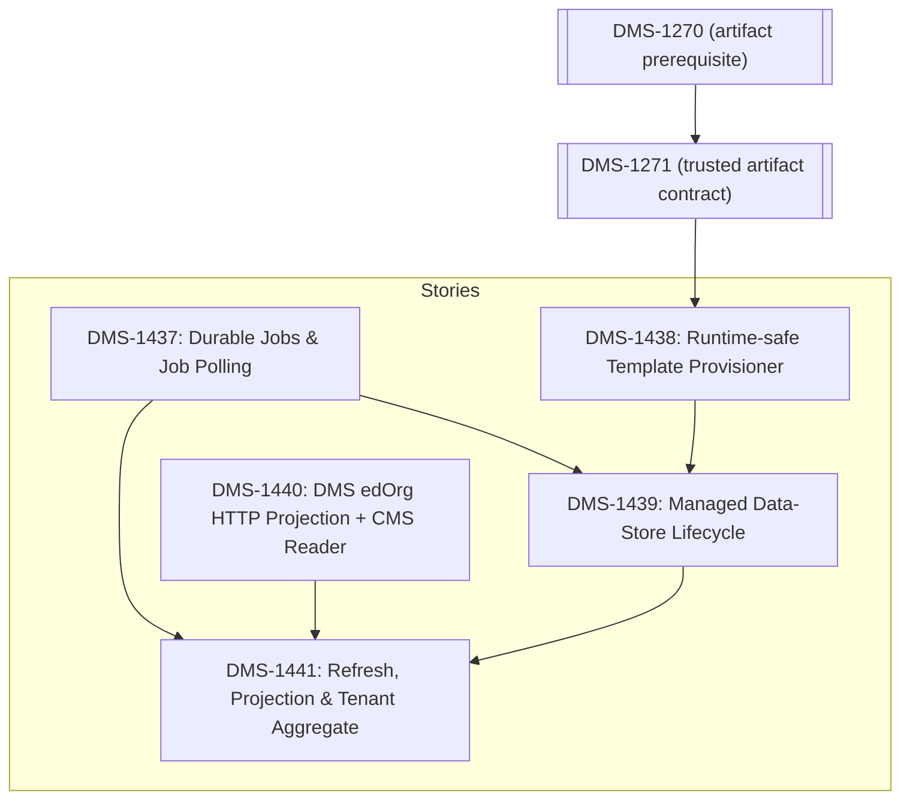

# DMS-1334 Data Store Lifecycle Documentation Spike

## Executive summary

DMS-1334 is a Management API v3 compatibility and architecture spike covering managed data-store creation and deletion, asynchronous job polling, and education-organization synchronization. The current CMS/DMS platform contains important pieces of each capability, but it does not contain an end-to-end managed lifecycle or education-organization projection.

The recommended design keeps every Management API runtime capability in CMS while keeping DMS physical-schema knowledge inside DMS:

- CMS owns Management API routes, tenant-scoped lifecycle and job persistence, authorization, background orchestration, retries, ordinary `DataStore` registration, template restoration/deletion, refresh scheduling, snapshots, and aggregate responses.
- CMS defines provider-neutral contracts in its existing backend project and implements CMS persistence and administrative database lifecycle behavior in its existing provider projects. No CMS project/package reference to DMS and no Docker build-context change is introduced.
- DMS remains the Resources/Descriptors/Discovery API implementation. It owns template production and the education-organization domain-data projection exposed over authenticated HTTP; CMS does not consume DMS tables, columns, joins, generated DDL, or `dms.EffectiveSchema` for refresh reads.
- CMS should use a durable database-backed worker built on the existing hosted-service pattern. It should not copy Admin API's Quartz topology or add a message broker.
- CMS runtime provisioning should restore allowlisted DMS Minimal/Populated template packages. `databaseTemplate: "Sample"` is the v3 wire value for the DMS `Populated` package kind.
- CMS should refresh education organizations by calling a DMS-owned, service-authenticated HTTP projection for the four Management API core types. Existing public resource endpoints and token-info must be evaluated first, but a dedicated endpoint is required unless they can meet the stable, complete, caller-independent projection contract without leaking DMS physical schema knowledge.

Five candidate stories are required. This is the minimum cohesive decomposition because durable jobs, privileged template operations, authenticated DMS projection, lifecycle orchestration, and education-organization synchronization have different ownership, API, persistence, security, and failure semantics. Open `DMS-1271` (and its DMS-1270 prerequisite) is a formal delivery blocker for DMS-1438's trusted package execution. DMS-1440 defines the DMS HTTP projection contract, service-authentication/authorization, Discovery advertisement, DMS route-context prefix behavior, tenant/data-store targeting, pagination, failure taxonomy, DMS endpoint, and CMS HTTP reader.

The stories are refinement-ready only after the explicitly identified contract gates are resolved. In particular, the checked-in OpenAPI still describes refresh as `201 Created`, while the selected target behavior is `202 Accepted`; and the final tenant aggregate education-organization read contract must be pinned before conformance sign-off. `ADMINAPI-1488` removes the single-data-store education-organization GET route and identifies the advertised all-data-store GET route as an unimplemented documentation error, so those two GET routes are excluded from parity scope unless product explicitly decides to diverge from Admin API. The stories preserve the spike's chosen behavior but prohibit implementation/conformance sign-off against an unpinned or contradictory contract.

No production code was changed, and no implementation, build, or test work was performed during this spike.

## Scope reviewed

The spike reviewed:

- `GET`, `POST`, and `DELETE` under `/v3/dataStores/manage`;
- `GET /v3/jobs/{jobId}`;
- all-data-store and single-data-store education-organization refresh operations;
- the unsupported education-organization read-route claims for `GET /v3/dataStores/edOrgs` and `GET /v3/dataStores/{dataStoreId}/edOrgs`;
- `GET /v3/tenants/{tenantName}/dataStores/edOrgs`;
- physical PostgreSQL and SQL Server data-store provisioning and deletion;
- template selection, tenant isolation, authorization, retries, crash recovery, failure reporting, and observability;
- how a successfully managed data store enters the existing CMS catalog and becomes discoverable by DMS.

## Sources used

### Governing sources

- [DMS-1334 story](https://edfi.atlassian.net/browse/DMS-1334)
- Artifact `admin-api-v3-latest.yaml` OpenAPI specification from [ODS-Admin-API](https://github.com/Ed-Fi-Alliance-OSS/ODS-Admin-API)
- Current CMS/DMS repository source and tests

### Current Admin API v3 reference

Current Admin API source and design were inspected, including:

- [`AddDataStoreManage`](https://github.com/Ed-Fi-Alliance-OSS/ODS-Admin-API/blob/main/Application/EdFi.Ods.AdminApi.V3/Features/DataStores/Manage/AddDataStoreManage.cs)
- [`DeleteDataStoreManage`](https://github.com/Ed-Fi-Alliance-OSS/ODS-Admin-API/blob/main/Application/EdFi.Ods.AdminApi.V3/Features/DataStores/Manage/DeleteDataStoreManage.cs)
- [`CreateInstanceJob`](https://github.com/Ed-Fi-Alliance-OSS/ODS-Admin-API/blob/main/Application/EdFi.Ods.AdminApi.V3/Infrastructure/Services/Jobs/CreateInstanceJob.cs) and [`DeleteInstanceJob`](https://github.com/Ed-Fi-Alliance-OSS/ODS-Admin-API/blob/main/Application/EdFi.Ods.AdminApi.V3/Infrastructure/Services/Jobs/DeleteInstanceJob.cs)
- [`RefreshEducationOrganizations`](https://github.com/Ed-Fi-Alliance-OSS/ODS-Admin-API/blob/main/Application/EdFi.Ods.AdminApi.V3/Features/DataStores/RefreshEducationOrganizations.cs), [`RefreshEducationOrganizationsJob`](https://github.com/Ed-Fi-Alliance-OSS/ODS-Admin-API/blob/main/Application/EdFi.Ods.AdminApi.V3/Infrastructure/Services/Jobs/RefreshEducationOrganizationsJob.cs), and [`EducationOrganizationService`](https://github.com/Ed-Fi-Alliance-OSS/ODS-Admin-API/blob/main/Application/EdFi.Ods.AdminApi.V3/Infrastructure/Services/EducationOrganizationService/EducationOrganizationService.cs)
- [`QuartzJobScheduler`](https://github.com/Ed-Fi-Alliance-OSS/ODS-Admin-API/blob/main/Application/EdFi.Ods.AdminApi.Common/Infrastructure/Jobs/QuartzJobScheduler.cs), [`Program`](https://github.com/Ed-Fi-Alliance-OSS/ODS-Admin-API/blob/main/Application/EdFi.Ods.AdminApi/Program.cs), and the PostgreSQL/SQL Server [`JobStatuses`](https://github.com/Ed-Fi-Alliance-OSS/ODS-Admin-API/blob/main/Application/EdFi.Ods.AdminApi.V3/Artifacts/PgSql/Structure/Admin/00004-AddJobStatus.sql) migrations
- [`GetJobStatus`](https://github.com/Ed-Fi-Alliance-OSS/ODS-Admin-API/blob/main/Application/EdFi.Ods.AdminApi.V3/Features/Jobs/GetJobStatus.cs), [`ReadTenants`](https://github.com/Ed-Fi-Alliance-OSS/ODS-Admin-API/blob/main/Application/EdFi.Ods.AdminApi.V3/Features/Tenants/ReadTenants.cs), and [`TenantService`](https://github.com/Ed-Fi-Alliance-OSS/ODS-Admin-API/blob/main/Application/EdFi.Ods.AdminApi.V3/Infrastructure/Services/Tenants/TenantService.cs)
- [`INSTANCE-MANAGEMENT.md`](https://github.com/Ed-Fi-Alliance-OSS/ODS-Admin-API/blob/main/docs/design/INSTANCE-MANAGEMENT.md)
- [`Education-organization-Endpoints.md`](https://github.com/Ed-Fi-Alliance-OSS/ODS-Admin-API/blob/main/docs/design/Education-organization-Endpoints.md)
- [`2026-05-15-job-status-tracking-design.md`](https://github.com/Ed-Fi-Alliance-OSS/ODS-Admin-API/blob/main/docs/design/2026-05-15-job-status-tracking-design.md)
- [`2026-08-05-enable-datastore-management-flag.md`](https://github.com/Ed-Fi-Alliance-OSS/ODS-Admin-API/blob/main/docs/design/2026-08-05-enable-datastore-management-flag.md)

Current implementation was preferred over historical design prose whenever they differed.

### Jira and architectural decisions

- [DMS-1334](https://edfi.atlassian.net/browse/DMS-1334) — this spike
- [ADMINAPI-1344](https://edfi.atlassian.net/browse/ADMINAPI-1344) — completed Admin API instance management reference
- [ADMINAPI-1424](https://edfi.atlassian.net/browse/ADMINAPI-1424) — completed refresh job ID and polling work
- [ADMINAPI-1488](https://edfi.atlassian.net/browse/ADMINAPI-1488) — education-organization read-route parity; removed the per-data-store GET route and confirmed the unscoped all-data-store GET route was an unimplemented documentation error
- [ADMINAPI-1489](https://edfi.atlassian.net/browse/ADMINAPI-1489) — data-store management feature flag
- [ADMINAPI-1496](https://edfi.atlassian.net/browse/ADMINAPI-1496) — refresh endpoints return `202 Accepted` rather than `201 Created`
- [DMS-951](https://edfi.atlassian.net/browse/DMS-951) — completed create-only `ddl provision`
- [DMS-955](https://edfi.atlassian.net/browse/DMS-955) — obsolete descriptor-seeding proposal
- [DMS-1255](https://edfi.atlassian.net/browse/DMS-1255) — completed Minimal/Populated template-package parity
- [DMS-1271](https://edfi.atlassian.net/browse/DMS-1271) — open bootstrap template-restore work
- [Management API v3 POST semantics decision](https://edfi.atlassian.net/wiki/spaces/BD/pages/2639396868/Management+API+v3.0.0+Additional+Differences+-+Architectural+decision)
- [Admin API 2.3 and CMS gap analysis](https://edfi.atlassian.net/wiki/spaces/BD/pages/1789526018/Admin+API+2.3+and+CMS+Gap+Analysis)

## Relevant Admin API v3 contract

The contract below distinguishes the checked-in OpenAPI from spike-selected corrections. A correction is not an updated contract until the owning Admin API ticket is complete and a revision is pinned in the implementation story.

| Operation | Contract |
| --- | --- |
| `GET /v3/dataStores/manage` | Returns `dataStoreManageModel[]`; supports paging, sorting, `id`, and `name` filters. |
| `POST /v3/dataStores/manage` | Accepts `addDataStoreManageRequest` with `name` and `databaseTemplate`; returns `202 Accepted`. |
| `GET /v3/dataStores/manage/{id}` | Returns one `dataStoreManageModel` or `404`. |
| `DELETE /v3/dataStores/manage/{id}` | Returns `204` when deletion is accepted or `404` when absent. Current behavior also returns `400` for invalid lifecycle states. |
| `GET /v3/jobs/{jobId}` | Returns `jobId`, `status`, `createdAt`, nullable `finishedAt`, and nullable `errorMessage`; returns `404` when unknown. |
| `POST /v3/dataStores/edOrgs/refresh` | Checked-in OpenAPI/current source: `201 Created`. Selected target per `ADMINAPI-1496`: `202 Accepted`, a job-status `Location`, and `jobQueuedResult`. Implementation is contract-blocked until an updated revision is pinned. |
| `POST /v3/dataStores/{dataStoreId}/edOrgs/refresh` | Same `201`/selected-`202` delta for one data store; also returns `404` when the data store is absent. |
| `GET /v3/dataStores/edOrgs` | Not implemented in Admin API; excluded from CMS parity unless product explicitly decides to diverge. |
| `GET /v3/dataStores/{dataStoreId}/edOrgs` | Removed by `ADMINAPI-1488`; returns `404` in Admin API and is excluded from CMS parity. |
| `GET /v3/tenants/{tenantName}/dataStores/edOrgs` | Returns `tenantDetailsResponse` with tenant identity plus data stores, management metadata, and education organizations. |

`dataStoreManageModel` contains nullable management and linked-catalog fields: `id`, `name`, `dataStoreId`, `dataStoreName`, `status`, `databaseTemplate`, `databaseName`, `lastRefreshed`, and `lastModifiedDate`. The aggregate `tenantDetailsResponse` contains `id`, `name`, and `dataStores`; unmanaged ordinary stores have `dataStoreManageId`, `databaseTemplate`, and `databaseName` as `null`, while pending managed rows with no ordinary link have `id` and `dataStoreType` as `null` and an empty `educationOrganizations` array. Education-organization items contain an `int64` identifier, institution name, nullable short name, discriminator, and nullable `int64` parent ID.

The OpenAPI description incorrectly calls managed POST an upsert. Current Admin API rejects duplicates, CMS POST operations are create-oriented, and the cross-team architectural decision selects create-only/reject-on-duplicate behavior. Candidate acceptance criteria therefore use create-only semantics.

The two asynchronous response patterns are intentionally different:

- managed create returns `202` and a `Location` for the management resource; the caller polls its lifecycle `status`;
- education-organization refresh is selected to return `202`, a job body, and a `Location` for `/v3/jobs/{jobId}` after the `ADMINAPI-1496` contract delta is delivered and pinned.

## Admin API behavior observed in the cited external source

Admin API is a behavioral reference, not an architecture template.

The observations below were derived from the linked current Admin API source and design documents, which are not part of this repository. They should be reconfirmed against pinned Admin API revisions before parity behavior is converted into delivery acceptance criteria. Locally verified CMS/DMS facts are documented separately in the next section.

- Managed create validates `name`, accepts only the case-sensitive `Minimal` and `Sample` template names, rejects active management-name and ordinary data-store-name duplicates, writes `PendingCreate`, queues a create job, and returns `202` with the management-resource location and no body.
- The create job provisions a physical database before registering the ordinary data store and linking it to the management row. This proves that the managed resource and ordinary routing resource have separate lifecycles.
- Managed delete is accepted only for `Created`, writes `PendingDelete`, returns `204`, and later physically drops the database and removes the ordinary registration. Prior spike notes describing metadata-only deletion were disproved by current source.
- Lifecycle statuses are `PendingCreate`, `CreateInProgress`, `Created`, `CreateFailed`, `CreateError`, `PendingDelete`, `DeleteInProgress`, `Deleted`, `DeleteFailed`, and `DeleteError`.
- PostgreSQL copies a configured Minimal or Sample database using `CREATE DATABASE ... TEMPLATE`; SQL Server restores a configured Minimal or Sample backup. `databaseTemplate` therefore means a golden/template database choice, not descriptor seeding or an arbitrary DDL profile.
- Quartz schedules immediate workers and recurring retry dispatchers, while business state and job execution history are stored in the Admin database. Quartz itself is not configured as a persistent store.
- Dispatchers do not reclaim `CreateInProgress` or `DeleteInProgress`. The current design document identifies process-crash rows as permanently stuck until manually repaired. CMS should not copy this limitation.
- Refresh endpoints return a job ID and job-status location. The base job records execution state. Current source does not persist `Pending` before the job begins, despite the design document saying it does; an immediate poll can therefore race to `404`.
- Education-organization refresh in Admin API connects directly to each ordinary target database, reads education organizations, and stores a projection in the Admin database. CMS should copy the refresh/snapshot/partial-failure semantics, but not the direct database-read architecture. Per-store failures are logged and swallowed in Admin API, so an all-store job can be `Completed` even when one or more stores failed; CMS should report that partial failure.
- `EnableDataStoreManagement`, defaulting to `true`, gates managed endpoints and create/delete dispatchers but does not gate education-organization refresh.

## Current CMS/DMS state

### Existing capabilities that should be reused

- CMS already exposes ordinary data-store registration CRUD in [`DataStoreModule`](../../../src/config/frontend/EdFi.DmsConfigurationService.Frontend.AspNetCore/Modules/DataStoreModule.cs). Mutations use the admin policy. Ordinary data-store reads use `MapLimitedAccess`, which additionally permits the authorization-metadata-read-only scope; that broader read policy must not be copied automatically to operational job, managed-lifecycle, or tenant-snapshot reads. Those new reads should use the existing `MapSecuredGet` read-only-or-admin policy from [`EndpointBuilderExtensions`](../../../src/config/frontend/EdFi.DmsConfigurationService.Frontend.AspNetCore/Infrastructure/Authorization/EndpointBuilderExtensions.cs).
- CMS PostgreSQL and SQL Server repositories already tenant-scope `DataStore` persistence and store encrypted connection strings. The existing `dmscs.DataStore` table is the routing catalog, not a managed-lifecycle aggregate.
- DMS already reads `GET v3/dataStores/` through [`ConfigurationServiceDataStoreProvider`](../../../src/dms/core/EdFi.DataManagementService.Core/Configuration/ConfigurationServiceDataStoreProvider.cs), decrypts the connection strings, and refreshes its per-tenant cache after a configurable TTL. A successful lifecycle job can therefore register through the existing CMS resource; no new CMS-to-DMS notification is needed.
- CMS now has an existing hosted-service precedent: [`TokenCleanupService`](../../../src/config/backend/EdFi.DmsConfigurationService.Backend.OpenIddict/Services/TokenCleanupService.cs) uses `BackgroundService` and `PeriodicTimer`. This disproves the premise that CMS has no background runtime, but it is not a durable, generalized job facility.
- [`DdlProvisionCommand`](../../../src/dms/clis/EdFi.DataManagementService.SchemaTools/Commands/DdlProvisionCommand.cs) can optionally create an empty database and apply generated DDL for PostgreSQL and SQL Server. Its reusable-looking helper, [`DdlCommandHelpers`](../../../src/dms/clis/EdFi.DataManagementService.SchemaTools/Commands/DdlCommandHelpers.cs), is internal to the CLI project. The command is create-only schema provisioning, not template restoration.
- [`eng/DatabaseTemplates`](../../../eng/DatabaseTemplates) builds and restores Minimal and Populated packages for both providers and supported Data Standard versions. [`Template-Management.psm1`](../../../eng/DatabaseTemplates/Template-Management.psm1) performs provider-specific restore and then reseeds `dms.DataStoreIdentity.SourceIdentity` with a newly generated UUID. This establishes that identity reseeding is a required post-restore step and shows where it occurs in the restore sequence. It does not implement DMS-1438's caller-supplied expected identity; selecting and assigning that pre-persisted value is new CMS-side behavior. The tooling disproves the premise that DMS lacks a golden/template concept, but the current PowerShell/Docker helper is operator tooling rather than a safe in-process runtime service.
- CMS already has the required project layering for new CMS persistence and administrative database lifecycle capabilities: provider-neutral contracts belong in [`EdFi.DmsConfigurationService.Backend`](../../../src/config/backend/EdFi.DmsConfigurationService.Backend/EdFi.DmsConfigurationService.Backend.csproj), while PostgreSQL and SQL Server implementations belong in the existing [`Backend.Postgresql`](../../../src/config/backend/EdFi.DmsConfigurationService.Backend.Postgresql/EdFi.DmsConfigurationService.Backend.Postgresql.csproj) and [`Backend.Mssql`](../../../src/config/backend/EdFi.DmsConfigurationService.Backend.Mssql/EdFi.DmsConfigurationService.Backend.Mssql.csproj) projects. For education-organization refresh, CMS uses HTTP client infrastructure rather than provider-specific DMS-domain readers.
- DMS has [`IRelationalTokenInfoEducationOrganizationLookup`](../../../src/dms/backend/EdFi.DataManagementService.Backend.External/IRelationalTokenInfoEducationOrganizationLookup.cs) and [`TokenInfoEducationOrganizationSqlCompiler`](../../../src/dms/backend/EdFi.DataManagementService.Backend.Plans/TokenInfoEducationOrganizationSqlCompiler.cs), but they are not an appropriate CMS reuse seam. They require DMS mapping/token inputs, return token-specific ancestry, and use internal discriminators such as `Ed-Fi:School`; the Management API requires a smaller core projection with values such as `edfi.School`.
- DMS builds its effective schema through internal application startup types such as [`LoadAndBuildEffectiveSchemaTask`](../../../src/dms/core/EdFi.DataManagementService.Core/Startup/LoadAndBuildEffectiveSchemaTask.cs). Their internal status and dependency graph confirm that CMS must not reference, package, or model them. DMS-1440 keeps that knowledge inside DMS and exposes only a stable HTTP projection.
- CMS stores application education-organization IDs, but it has no target-data-store education-organization projection, discovery API, or refresh workflow.

### Confirmed missing capabilities

- durable tenant-scoped job records, renewable fenced leases/recovery semantics, handler dispatch, and the v3 job-status endpoint;
- a safe typed runtime provisioner that restores the existing DMS template artifacts and deletes only databases proven to belong to the lifecycle record;
- separate managed data-store lifecycle persistence and `/v3/dataStores/manage` routes;
- a DMS-owned, authenticated HTTP education-organization projection plus CMS HTTP reader;
- CMS snapshot persistence, manual refresh, tenant aggregation, and durable scheduled refresh matching Admin API behavior.

## Gap matrix

| ID | Capability / API | Admin API v3 expectation | Existing CMS/DMS capability | Disposition | Owner | Story |
| --- | --- | --- | --- | --- | --- | --- |
| G01 | Ordinary `DataStore` registration | A created managed database becomes an ordinary routable data store. | CMS CRUD, encryption, tenancy, and DMS discovery already exist. | Already supported; reuse after physical provisioning. | CMS/DMS | None |
| G02 | Managed resource persistence | Separate management state survives asynchronous create/delete. | `dmscs.DataStore` has no template, database name, link, or lifecycle status. | Implementation gap. | CMS | DMS-1439 |
| G03 | `POST /v3/dataStores/manage` | Create-only request, `202`, management-resource `Location`. | No route or lifecycle aggregate. | Implementation gap. | CMS | DMS-1439 |
| G04 | Managed reads | Collection/by-ID return management and linked data-store state. | Ordinary data-store reads only. | Implementation gap. | CMS | DMS-1439 |
| G05 | Managed physical delete and catalog mutation guards | Managed `DELETE` queues physical drop and catalog cleanup; ordinary PUT/DELETE cannot mutate a linked managed row. | Ordinary CMS PUT changes name/type/connection and ordinary DELETE removes metadata only. | Implementation gap; both mutations need an atomic provider-repository guard and managed operations need one CMS transaction. | CMS | DMS-1439, using DMS-1438 |
| G06 | Template meaning | `Minimal` or `Sample` selects a golden database. | DMS Minimal/Populated artifacts exist; CLI DDL and obsolete descriptor seeding are not equivalent. | Partial; add a CMS runtime primitive and map `Sample` to `Populated`. | CMS, consuming DMS artifacts | DMS-1438 |
| G07 | Provider-neutral physical provisioning | PostgreSQL and SQL Server create/delete behind one contract. | DMS CLI/PowerShell tooling is not a CMS service-safe reusable layer; CMS provider projects already have the correct runtime boundary. | Implementation gap. | CMS | DMS-1438 |
| G08 | Durable job execution | Long operations survive restart and retry safely. | CMS has a hosted-service pattern but no job persistence, leases, or dispatch. | Implementation gap. | CMS | DMS-1437 |
| G09 | `GET /v3/jobs/{jobId}` | Tenant-scoped status, timestamps, error, and `404`. | No job resource. | Implementation gap. | CMS | DMS-1437 |
| G10 | Multi-instance concurrency/crash recovery | One active execution per target, renewable leases, stale-worker fencing, and recoverable interrupted work. | No CMS mechanism; Admin API has a documented stuck-in-progress limitation. | Implementation gap. | CMS | DMS-1437 |
| G11 | DMS discovery after create | Newly registered stores become routable. | Existing CMS provider and TTL refresh already perform this. | Already supported; document eventual visibility. | DMS | None |
| G12 | Education-organization discovery contract and extraction | Return ID, names, discriminator, and parent for each target data store without exposing DMS physical schema to CMS. | Public DMS resource endpoints and token-info exist but do not provide a complete, caller-independent Management API projection; CMS has no DMS projection client. | DMS-1440 defines and implements a DMS-owned authenticated HTTP projection, Discovery advertisement, service-auth contract, pagination, failure taxonomy, and CMS HTTP reader. | DMS/CMS | DMS-1440 |
| G13 | Education-organization projection | Persist tenant/data-store snapshots for management reads. | CMS stores only application assignment IDs. | Implementation gap. | CMS | DMS-1441 |
| G14 | Refresh all/one | Selected target is `202`, job body/location, async refresh, and single-store `404`; checked-in contract remains `201`. | No routes or handlers. | Implementation gap built on DMS-1437/DMS-1440; endpoint conformance is blocked on ADMINAPI-1496 and a pinned corrected contract. | CMS | DMS-1441 |
| G15 | Tenant aggregate read | Tenant data stores plus management metadata and snapshots. | Tenant CRUD exists; aggregate response does not. | Implementation gap. | CMS | DMS-1441 |
| G16 | Deprecated per-data-store education-organization read | `GET /v3/dataStores/{dataStoreId}/edOrgs` returns `404` after `ADMINAPI-1488`. | Not present in CMS. | Not a DMS implementation gap; excluded from DMS-1441 parity scope unless product explicitly decides to diverge. | None | No story |
| G17 | Authorization | Mutations require administrative authority; reads allow read-only/admin. | Existing secured endpoint conventions already encode this split. | Already supported as a policy mechanism; apply it in DMS-1437/DMS-1439/DMS-1441. | CMS | No separate story |
| G18 | Multi-tenancy | Records and jobs cannot cross tenants; workers and tenant-path endpoints establish explicit tenant context. | Tenant-scoped repositories and request-scoped context exist, but background propagation is absent and current middleware deliberately bypasses `/v3/tenants...`. | Partial implementation gap; DMS-1441 must resolve the path tenant and install scoped context before repository access. | CMS | DMS-1437, consumed by DMS-1439/DMS-1441 |
| G19 | Feature disablement | Managed capability can be disabled without disabling refresh. | No managed feature exists or flag exists. | Implementation gap folded into lifecycle, not a separate capability. | CMS | DMS-1439 |
| G20 | Refresh failure truthfulness | Job status must let clients detect failure. | No CMS behavior; Admin API can mark partial failure completed. | Implementation gap; preserve successful snapshots but mark aggregate job `Error`. | CMS | DMS-1441 |
| G21 | Scheduled refresh | Current Admin API creates a recurring refresh schedule for each tenant from `EdOrgsRefreshIntervalInMins`, independently of the managed-lifecycle feature flag. | CMS has no refresh scheduler or durable refresh path. | Confirmed behavioral-parity gap; DMS-1437 supplies durable schedule/job persistence and DMS-1441 registers a tenant schedule that invokes the same handler as manual refresh. | CMS | DMS-1437, configured by DMS-1441 |
| G22 | Snapshot cleanup on data-store deletion | Tenant aggregation must not return projections for a deleted ordinary or managed data store. | CMS has no snapshot persistence or cleanup relationship. | Lifecycle-consistency gap; delete snapshots transactionally/cascade with ordinary catalog deletion. | CMS | DMS-1441, integrated with DMS-1439 |
| G23 | Preserve application boundaries | CMS must implement Management API behavior without referencing DMS projects or depending on DMS physical schema; DMS must own DMS domain-data projection. | CMS has provider-neutral and provider-specific projects; DMS has route, Discovery, OAuth/token, data-store routing, mapping, and read infrastructure. | DMS-1438 stays in CMS for administrative lifecycle work. DMS-1440 adds a DMS-owned HTTP projection and CMS HTTP reader, with no CMS-to-DMS project reference and no direct SQL reader for domain data. | DMS/CMS | DMS-1438, DMS-1440; no separate story |
| G24 | Original unscoped all-store education-organization GET | `GET /v3/dataStores/edOrgs` was documented but not implemented in Admin API. | Not present in CMS. | Not a DMS implementation gap; excluded from DMS-1441 parity scope unless product explicitly decides to diverge. | None | No story |

Every supported implementation requirement is therefore already supported or mapped to one candidate story. Shared prerequisite rows list both the primitive and its consuming story only where needed to express the dependency; the implementation gap itself has one primary owner. Unsupported Admin API read-route claims are recorded above as excluded, not assigned to delivery stories.

## Architectural analysis

### Alternatives considered

#### A. Copy Admin API mechanically: Quartz, configured live template databases, and unversioned provider SQL

This is behaviorally proven but not recommended. CMS already has a hosted-service pattern and does not otherwise use Quartz. Adding Quartz would not remove the need for durable business state, tenant propagation, provider-specific persistence, idempotency, or crash recovery. Admin API's in-memory Quartz store and dispatcher model also leaves in-progress work stuck after a process crash. Copying Admin API's target-database SQL would also couple CMS to DMS physical tables, columns, joins, and schema drift; versioning that contract detects breakage but still leaves CMS responsible for DMS internals.

#### B. CMS-owned Management API runtime plus DMS-owned HTTP education-organization projection — recommended

CMS persists jobs and lifecycle state in its existing provider-specific database, leases work from a hosted service, and invokes CMS-owned provisioning and snapshot persistence contracts. Provider-neutral CMS contracts live in the existing CMS backend project; PostgreSQL and SQL Server implementations are used for CMS persistence and administrative lifecycle operations. DMS remains responsible for producing trusted templates and for projecting DMS domain data through an authenticated HTTP endpoint discovered by CMS. The design adds no broker, shell execution, project reference, Docker build-context dependency, or CMS direct SQL dependency on DMS domain tables. It does add an intentional CMS-to-DMS service call for domain-data reads, with service authentication, authorization, timeout, cancellation, retry, pagination, and stale-snapshot behavior defined.

#### C. Execute lifecycle and refresh inside DMS through new internal HTTP or queue contracts

DMS already has active schema mappings, so this can look attractive for the entire refresh workflow. It would, however, put Management API jobs, schedules, snapshots, aggregate response composition, and retry state in the Resources API application. That is still incorrect ownership. DMS-1440 uses DMS HTTP only for the narrow domain-data projection; CMS remains the owner of Management API runtime behavior.

### Durable CMS jobs

Use a CMS-owned database table and provider-specific repository operations with an in-process `BackgroundService`. Persist an opaque unique job ID compatible with the pinned API representation, tenant, supported type, versioned target/payload identifiers, status, timestamps, bounded sanitized error, attempt count, next-attempt time, lease owner/expiry, and a monotonically increasing fencing token. Payloads are versioned and size-bounded, reference CMS IDs only, and accept only explicitly registered job types; unknown/invalid type or version values fail terminally before handler dispatch. Payloads must not contain connection strings or secrets.

The worker uses at-least-once execution with idempotent, cancellation-aware handlers. A database claim/reclaim increments the lease version. Lease renewal and every retry/terminal transition compare job ID, owner, and lease version using database UTC; a late worker that lost ownership cannot persist state or overwrite a newer result. Losing a lease cancels local execution. A transient failure increments attempts, returns the job to `Pending`, records `nextAttemptAt`, clears lease fields, and leaves `finishedAt` null; only terminal `Completed`/`Error` records `finishedAt`. Enqueue and the originating CMS control-plane state change occur in one CMS transaction so an accepted request never loses its work record.

Polling, lease/renewal, attempts, backoff, payload/error bounds, retention, and cleanup require documented startup-validated defaults selected during implementation refinement and operational review. Renewal must occur comfortably before lease expiry, and invalid combinations fail startup. Shutdown stops new claims, cancels active handlers, and either safely returns owned jobs to `Pending` or leaves them for expiry; fencing protects against any late completion.

This design intentionally improves on two Admin API behaviors: the job exists before a refresh response is returned, preventing immediate-poll `404`, and expired in-progress work is automatically reclaimable.

### Template-backed provisioning

`ddl provision` is useful evidence for provider-neutral database creation and DDL execution, but it does not implement `databaseTemplate`. The selected design restores existing template packages through a typed runtime contract. It never accepts a client-provided package path or arbitrary template string:

- `Minimal` resolves to the deployment's allowlisted Minimal package;
- `Sample` resolves to the equivalent DMS Populated package;
- package provider, Data Standard/effective schema, content profile, artifact hash, and producer trust must match deployment configuration;
- the PostgreSQL SQL dump and SQL Server backup are restored using implementations in the existing CMS provider projects behind a CMS backend contract;
- open `DMS-1271` owns the package manifest/trust contract. DMS-1438 is formally blocked by DMS-1271 for trusted package execution and must consume its delivered artifact contract without duplicating bootstrap orchestration.

The deployable restore mechanisms are explicit without prescribing incidental C# APIs. PostgreSQL uses a supported `psql` executable available in the CMS runtime; authentication/invocation cannot expose credentials in arguments or logs, cancellation terminates the restore, and temporary resources are protected and cleaned up. SQL Server uses provider-supported administrative restore commands against a verified backup staged in a private location visible to the SQL Server host; logical files and safe destinations are validated before restore. A deployment without server-visible SQL Server staging is unsupported in this story, and a generic remote-upload protocol is out of scope. Process APIs, credential handoff, SQL client selection, and restore-command sequencing remain implementation decisions as long as they satisfy the same security, validation, cancellation, redaction, and cleanup outcomes.

CMS configuration must identify the DMS target provider independently of CMS's own catalog provider for administrative lifecycle operations. The two current deployment settings can differ, and ordinary `DataStoreType` is an environment classification rather than a database engine. DMS-1438 therefore uses one validated target-provider setting (`postgresql` or `mssql`) for all managed target stores in that CMS deployment. `DmsDataStoreSettings.Provider` is a working implementation name, not a contractually required property name. Mixed target providers for managed provisioning require future ordinary-data-store provider metadata and are out of scope. DMS-1440 domain-data reads do not consume this setting; they target DMS over HTTP by tenant and ordinary `dataStoreId`.

Physical operations require administrative database credentials that are distinct from the encrypted ordinary data-store connection string.

Deletion and retry require more than database-name matching. The lifecycle record generates and persists the expected `dms.DataStoreIdentity.SourceIdentity` before provisioning, and the new CMS provisioner must assign that exact value after restore. Existing template tooling assigns a fresh random value instead, so it is sequencing precedent rather than reusable value-selection behavior. A retry accepts and reconciles an existing target only when source identity, trusted artifact identity/hash, provider, engine compatibility, content profile, and effective schema all match and validation is complete; it never replaces a target merely because source identity matches. Deletion may drop a target only after the source-identity ownership check succeeds. An absent/different identity or partial, incompatible, or unverifiable target fails safely for operator inspection. Provider system databases and configured CMS databases are always denied targets.

### Managed lifecycle

Store lifecycle records separately from `dmscs.DataStore`. The management record is the durable desired/observed state; the ordinary row remains the DMS routing catalog. It contains tenant, name, template, generated physical database name, expected source identity, nullable ordinary data-store link, lifecycle status, and timestamps.

Create and delete handlers are idempotent reconciliation steps because physical database changes and CMS persistence cannot share a transaction. Within CMS, each consistency boundary is atomic: enqueue create with `PendingCreate`; link the ordinary row and mark `Created`; enqueue delete with `PendingDelete`; and delete snapshot/ordinary row while retaining and marking the management tombstone `Deleted`. Existing repository calls with independent transaction scopes cannot be composed to claim atomicity. The physical restore/drop remains an external reconciliation boundary.

The existing ordinary `PUT /v3/dataStores/{id}` and `DELETE /v3/dataStores/{id}` must atomically reject a linked managed data store with `409 Conflict` and stable problem details containing the managed-resource location. Enforcing the guard in the provider repository/transaction, not only at the endpoint, prevents update/delete races from renaming a managed catalog row, changing its encrypted connection, or orphaning its physical database.

Managed names are trimmed, limited to 46 characters, and matched against `^[A-Za-z0-9 _]+$`; normalized uniqueness is evaluated on the trimmed value. Database names follow the pinned Admin API formatter: start with `EdFi_Ods`, convert spaces to underscores, trim underscores, strip repeated leading `edfi_ods` variants, append the case-sensitive template, and remain within the portable 63-character limit.

DMS will discover the new ordinary record using its existing tenant cache. The API should document that routability is eventually visible according to DMS cache configuration; no new callback is justified.

### Education-organization synchronization

Add a DMS-owned education-organization projection endpoint and a CMS HTTP reader behind a provider-neutral CMS backend contract. The DMS endpoint returns only the four current Management API core types: State Education Agency, Education Service Center, Local Education Agency, and School. For these types the discriminator is `edfi.<ResourceName>`, not DMS's internal `Ed-Fi:<ResourceName>` form, and direct-parent precedence is exactly school LEA, LEA parent LEA, LEA ESC, LEA SEA, then ESC SEA. Extension-defined education-organization types are out of scope because the Management API contract does not define their discriminator or parent behavior.

DMS-1440 first defines and checks in the stable HTTP projection contract: Discovery advertisement, service authentication and authorization, route-context prefix behavior matching DMS Discovery/Core API routes, tenant/data-store targeting by CMS ordinary `dataStoreId`, projection fields, pagination, response-size bounds, cancellation, and failure taxonomy. DMS validates its own internal schema/mapping state before returning data and converts internal failures into typed HTTP problem details. CMS does not load DMS schema packages, reference DMS mapping/compiler projects, validate `dms.EffectiveSchema`, inspect generated DDL, or reuse token-info types.

Existing DMS endpoints are evaluated but do not satisfy the requirement. Public resource collections require CMS to know multiple Ed-Fi resource routes, page and merge them, understand parent-reference shapes, and run under ordinary resource authorization. `oauth/token_info` is token-specific and not a complete target-store projection. Discovery is the right place to advertise the dedicated endpoint, not the domain-data source itself.

CMS calls the DMS-1440 HTTP reader inside a refresh job, using a least-privilege service token and the DMS-discovered endpoint template. It pages until the target response is complete and transactionally replaces that data store's tenant-scoped snapshot only after every page succeeds. A failed DMS instance, failed token request, unavailable target, failed page, malformed response, timeout, or cancellation retains the previous snapshot. A refresh-all job may commit successful stores, but if any store fails the aggregate job ends in `Error` with a sanitized summary so the client is not told the whole refresh succeeded.

Deleting an ordinary data store deletes its snapshot in the same CMS transaction, whether deletion is invoked directly for an unmanaged store or through DMS-1439 for a managed store. This prevents orphaned projection rows from appearing in tenant aggregation.

The education-organization tenant aggregate endpoint uses one snapshot-backed query model. `GET /v3/tenants/{tenantName}/dataStores/edOrgs` returns the tenant aggregate after resolving the path tenant. The unsupported `GET /v3/dataStores/edOrgs` and `GET /v3/dataStores/{dataStoreId}/edOrgs` routes are excluded from parity scope unless product explicitly decides to diverge from Admin API. Aggregate responses merge:

- ordinary CMS data stores and their snapshots;
- linked management metadata when present;
- default `Created`/null-management fields for unmanaged ordinary stores;
- pending or orphaned management records that do not yet have an ordinary data-store ID, with an empty education-organization list.

Current `TenantResolutionMiddleware` deliberately bypasses every `/v3/tenants...` route, leaving the scoped provider in `NotMultitenant`. In multi-tenant mode, the DMS-1441 endpoint first requires the `Tenant` header, returns the existing `400` for a missing or path-mismatched header without performing a tenant lookup, then resolves a matching path/header through the non-tenant-scoped tenant repository. Unknown matching tenants return `404`. Only after success does it install `TenantContext.Multitenant` and lazily resolve tenant-scoped aggregate dependencies; the exact DI technique is replaceable as long as tenant isolation and disposal are correct. In single-tenant mode, no header is required, context remains `NotMultitenant`, and the route accepts Admin API's default tenant name `default`, so the supported path is `/v3/tenants/default/dataStores/edOrgs`.

Configurable scheduled refresh is required behavioral parity even though it is not a distinct OpenAPI operation. Admin API stores job status in `JobStatuses` but recreates recurring Quartz triggers at startup; CMS preserves the same job/schedule separation with durable CMS `Jobs` and `Schedules` persistence instead of introducing Quartz. Multi-tenant mode maintains one stable schedule for each current tenant repository record and disables schedules when tenants are removed without deleting history. Single-tenant mode maintains one schedule for its canonical context; whether persistence uses a null/sentinel tenant key is an internal choice. Each uses `EdOrgsRefreshIntervalInMins` and enqueues the same DMS-1437 refresh-all job/handler as the manual endpoint. Schedule claiming, occurrence insertion, and next-run advancement are atomic, restart-safe, fenced, and safe across multiple CMS replicas. A unique schedule-occurrence identity prevents duplicate enqueue. Missed intervals are coalesced into at most one immediately due run, matching Admin API's start-now behavior without a catch-up burst. Scheduled refresh remains active when `EnableDataStoreManagement=false`, and at most one refresh may run for the same tenant/data-store target at a time.

### Authorization, configuration, and observability

- Use existing CMS policy conventions: admin for managed POST/DELETE and refresh POST; read-only-or-admin for managed GET, job GET, and all education-organization read GET routes.
- Scope every record and lookup by tenant. A background handler creates a scope and explicitly sets the persisted tenant context before resolving repositories or connections.
- `EnableDataStoreManagement`, default `true` for Admin API parity, gates managed routes and managed job consumption/scheduling only. It does not gate education-organization refresh.
- Never expose administrative or decrypted connection strings in management, job, or tenant responses or logs.
- Emit structured logs and metrics for queue delay, attempts, lease recovery, duration, target type, outcome, and refresh failures. Job error text returned to clients is bounded and sanitized; detailed exception data stays in logs.

## Recommended approach

Implement the five stories in [candidate-implementation-stories.md](candidate-implementation-stories.md):

1. CMS durable jobs and v3 job polling.
2. CMS runtime-safe DMS-template provisioning.
3. CMS managed data-store lifecycle.
4. DMS education-organization HTTP projection and CMS HTTP reader.
5. CMS education-organization refresh, projection, and tenant aggregation.

DMS-1437, DMS-1438, and DMS-1440 are separable prerequisites. DMS-1438 is formally blocked by the trusted artifact contract owned by open DMS-1271, transitively dependent on DMS-1270. DMS-1440 defines its DMS-owned HTTP projection contract and CMS reader before DMS-1441 consumes it; it has no DMS-1438 dependency except that newly managed stores become callable only after DMS-1438/DMS-1439 register them and DMS discovers them. DMS-1439 depends on DMS-1437 and DMS-1438. DMS-1441 depends on DMS-1437 and DMS-1440; its complete v3 aggregate also depends on DMS-1439 for managed and pending records, although refresh persistence for existing unmanaged stores can be developed before DMS-1439 lands.

### Delivery-team refinement

Story sizing and delivery estimates are intentionally outside this spike. The delivery team owns estimation after dependencies, external blockers, provider scope, and acceptance criteria are confirmed.

## Relevant existing and related tickets

| Ticket | Relevance and scope effect |
| --- | --- |
| `ADMINAPI-1344` | Behavioral reference for physical lifecycle, separate manage state, templates, and asynchronous execution. Does not require CMS to adopt Quartz. |
| `ADMINAPI-1424` | Establishes the refresh job response and polling behavior required by DMS-1437/DMS-1441. |
| `ADMINAPI-1488` | Education-organization read-route parity input. It removes the per-data-store GET route and confirms the unscoped all-data-store GET route was an unimplemented documentation error. DMS-1441 retains the tenant aggregate GET route, with final conformance gated on a pinned OpenAPI/source contract. |
| `ADMINAPI-1489` | Current reference for a default-true management feature flag. Folded into DMS-1439. |
| `DMS-951` | Supplies create-only DDL behavior and some provider primitives, but not golden-template semantics. No duplicate story is proposed. |
| `DMS-955` | Obsolete; descriptor seeding is explicitly not a lifecycle dependency. |
| `DMS-1255` | Completed producer of Minimal/Populated PostgreSQL and SQL Server packages. DMS-1438 consumes rather than rebuilds these assets. |
| `DMS-1270` | Upstream prerequisite identified by the DMS-1271 restore design; track transitively so DMS-1438 is not scheduled on DMS-1271 alone. |
| `DMS-1271` | Formal blocker for DMS-1438 trusted package execution. DMS-1438 consumes the delivered artifact manifest/authentication contract but does not reference DMS runtime code or duplicate bootstrap sequencing. |
| `DMS-1207` | Evidence for DMS education-organization schema and hierarchy behavior. Its token-info implementation is not a CMS dependency or extension point, but DMS-1440 may reuse DMS-owned internal mapping/read concepts behind a new projection contract. |
| `DMS-1354` | Demonstrates the current CMS hosted-service pattern reused by DMS-1437. |

## Risks

- Runtime create/drop requires highly privileged database credentials. Feature enablement, secret handling, target allowlists, reserved-name checks, and ownership verification are release blockers, not optional hardening.
- `DMS-1271` is open and formally blocks DMS-1438 trusted package execution. DMS-1438 cannot safely consume PostgreSQL SQL or SQL Server backups until its manifest and producer-authentication contract is delivered.
- DMS-1271 depends on DMS-1270; failure to track the transitive blocker can produce a false-ready DMS-1438 story.
- The selected refresh `202` response conflicts with the checked-in OpenAPI/current source `201`. DMS-1441 cannot enter contract/conformance implementation until ADMINAPI-1496 is delivered and the exact OpenAPI revision is pinned.
- The final tenant aggregate education-organization GET response contract must be pinned before conformance implementation, including nullable management fields and pending managed-row behavior. The unsupported all-data-store and single-data-store GET routes remain excluded unless product explicitly decides to diverge from Admin API.
- Package configuration can drift from the DMS effective schema. DMS-1438 must fail before target mutation when provider, Data Standard, extension inventory, or effective-schema metadata differs.
- Physical changes and CMS transactions are not atomic. Idempotent reconciliation and identity verification are required for every retry boundary.
- A new ordinary data store can take up to the configured DMS cache TTL to become routable; the current default is ten minutes.
- Snapshot data is intentionally eventually consistent. Failed refreshes must preserve prior data and clearly expose an error rather than erase a valid snapshot or report false success.
- CMS and DMS HTTP projection contract versions can drift. DMS-1440 must advertise supported projection versions through Discovery; CMS must validate the version it consumes and fail refresh without replacing snapshots when the version or response shape is unsupported.
- DMS instance, token endpoint, or target data-store unavailability can interrupt refresh. DMS-1441 must preserve prior snapshots and report an `Error` job for partial refresh failure while allowing later scheduled/manual refresh to converge.
- SQL Server restore requires a server-visible staging path, while PostgreSQL requires `psql` in the CMS runtime image. Unsupported deployment topologies must fail startup validation rather than failing after an accepted lifecycle request.

## Resolved decisions and implementation refinements

Architecture ownership and decomposition are resolved. The following delivery gates remain explicit rather than being treated as implementation discretion:

- `DMS-1271`, transitively dependent on DMS-1270, is a formal Jira blocker for DMS-1438 trusted package execution. It is not an ownership choice or a CMS-to-DMS code dependency.
- DMS-1438 is CMS-owned and fits the existing CMS backend/provider projects for administrative lifecycle operations. DMS-1440 is jointly owned: DMS owns the projection endpoint, internal schema/mapping reads, Discovery advertisement, service authorization, and problem taxonomy; CMS owns the HTTP reader, token/discovery handling, pagination, timeout/cancellation, and failure classification. No CMS-to-DMS project/package reference, shared-library publication, Docker build-context change, or direct SQL reader is allowed for domain-data refresh.
- Scheduled refresh is required Admin API behavioral parity. CMS uses durable `Jobs` and `Schedules` persistence, one schedule per tenant, and the same refresh-all job/handler as the manual endpoint; it does not adopt Admin API's in-memory Quartz runtime.
- DMS-1440 first defines and checks in its HTTP projection contract/OpenAPI fragment, Discovery field, service-authentication contract, route-context prefix behavior, tenant/data-store targeting, pagination, and failure taxonomy, then implements the DMS endpoint and CMS reader against that contract.
- DMS-1441 targets refresh `202` behavior and implements the tenant aggregate education-organization GET route. Conformance requires a pinned corrected Admin API contract before implementation sign-off. The unsupported all-data-store and single-data-store GET routes are excluded unless product explicitly decides to diverge from Admin API.

DMS-1437 requires operationally reviewed defaults and bounds before coding, without treating spike examples as product constants. DMS-1438 fixes the restore topology and safety outcomes while leaving replaceable invocation/credential APIs as non-binding implementation guidance. Neither distinction changes ownership, API scope, or decomposition.

## Explicit decisions and assumptions

1. `/v3/dataStores/manage` is the only managed route family; `/v3/dbDataStores` is obsolete.
2. Managed POST is create-only and rejects duplicates with `400`.
3. Managed POST returns `202` and an absolute management-resource `Location` with no required response body.
4. Refresh POST targets `202`, a `/v3/jobs/{jobId}` `Location`, and `jobQueuedResult`; this is a contract delta from checked-in `201` and is blocked on ADMINAPI-1496 plus a pinned updated OpenAPI revision.
5. `databaseTemplate` accepts `Minimal` and `Sample`; `Sample` maps to DMS `Populated` artifacts.
6. Successful managed delete physically deletes the owned database and removes its ordinary catalog row.
7. The tenant aggregate education-organization GET route is implemented by DMS-1441 over one snapshot-backed query model. The unsupported all-data-store and single-data-store GET routes are excluded from parity scope unless product explicitly decides to diverge from Admin API.
8. CMS owns all Management API runtime behavior, including template restoration/deletion, refresh jobs, schedules, snapshots, retries, and aggregate responses. DMS owns Resources/Descriptors/Discovery API behavior, template production, DMS physical-schema knowledge, and the authenticated education-organization projection endpoint consumed by CMS.
9. A database-backed CMS worker is selected over Quartz, a broker, or a new service.
10. A refresh-all job is `Error` if any target fails, even though successful target snapshots may be retained.
11. Mutations require admin scope; reads use the existing read-only-or-admin policy and remain tenant-scoped.
12. Current PostgreSQL and SQL Server support is required throughout.
13. Core education-organization discriminators use `edfi.<ResourceName>` and core direct-parent precedence matches current Admin API behavior; DMS's internal `Ed-Fi:<ResourceName>` value is not the Management API wire value.
14. Scheduled refresh is required Admin API behavioral parity, not a separate OpenAPI operation. CMS persists one durable schedule per repository tenant in multi-tenant mode or one schedule for the canonical context in single-tenant mode, uses `EdOrgsRefreshIntervalInMins`, enqueues the same DMS-1437 refresh-all job as manual refresh, coalesces missed intervals to one immediately due run, and remains independent of `EnableDataStoreManagement`.
15. Deleting an ordinary data store removes its CMS education-organization snapshot; managed deletion reaches the same cleanup through its ordinary catalog link.
16. The unscoped `GET /v3/dataStores/edOrgs` is excluded because Admin API identifies it as an unimplemented documentation error; the tenant path route remains for explicit tenant aggregate parity.
17. CMS adds no project/package reference to DMS and performs no direct SQL reads from DMS domain tables for education-organization refresh. DMS-1440 is consumed through authenticated HTTP discovered from DMS.
18. CMS configures administrative database lifecycle access independently of its own catalog provider for DMS-1438/DMS-1439. That administrative access is separate from DMS-1440 domain-data reads, which use DMS HTTP.
19. In single-tenant mode, tenant aggregate routes require Admin API's default tenant name `default`, so the supported path is `/v3/tenants/default/dataStores/edOrgs`. In multi-tenant mode, header/path validation precedes tenant lookup and tenant-scoped repository resolution.
20. Linked managed ordinary data stores cannot be changed through ordinary PUT or DELETE; both fail atomically with `409` and a managed-resource location.

## Conclusion

The spike confirms real gaps, but it also identifies substantial reusable infrastructure. CMS does not need a new service, broker, replacement data-store catalog, DMS code/package reference, direct SQL reader for DMS domain data, or one story per endpoint. DMS does not need a new template-production pipeline or Management API runtime component, but it does need a narrowly scoped education-organization projection endpoint for this architecture.

The minimum correct solution is five cohesive runtime stories consuming DMS templates for administrative lifecycle work and DMS HTTP projection for domain-data refresh. DMS-1270/DMS-1271 block DMS-1438 package execution, while corrected pinned Admin API contract evidence blocks DMS-1441 endpoint conformance. DMS-1440 is the explicit DMS implementation work: it defines the authenticated projection contract, Discovery advertisement, service authorization, DMS route-context prefix behavior, DMS endpoint, and CMS HTTP reader before DMS-1441 consumes it. Once the remaining gates are resolved, the specified acceptance criteria and task sequences are sufficient for direct developer or AI-agent implementation. Scheduled refresh is resolved as required parity through durable CMS job/schedule persistence. This design preserves CMS/DMS product ownership while improving crash recovery, immediate job visibility, schedule durability, mutation/deletion safety, and partial-failure reporting over the reference implementation.
