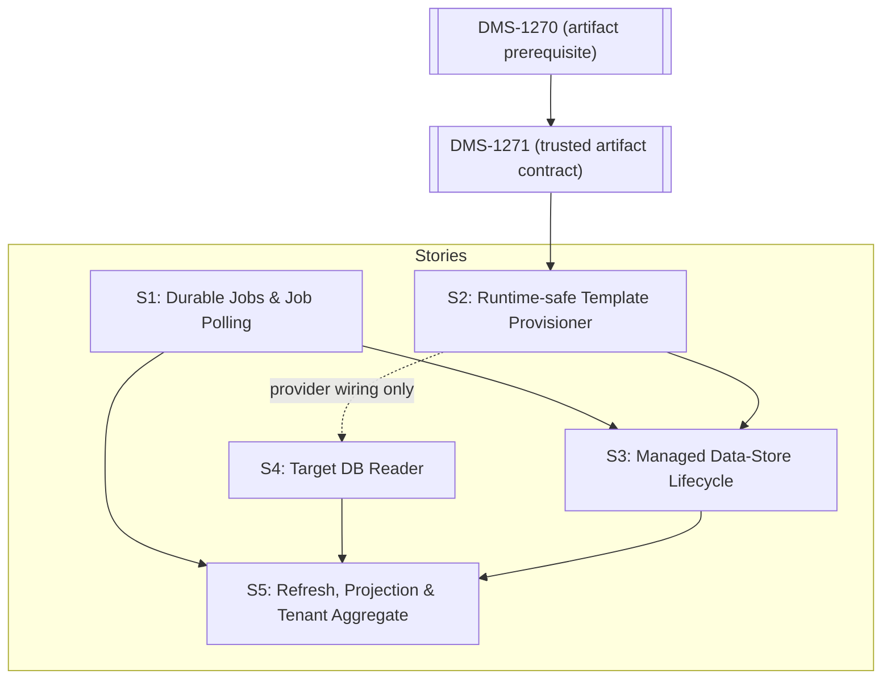

# DMS-1334 Data Store Lifecycle Documentation Spike

## Executive summary

DMS-1334 is a Management API v3 compatibility and architecture spike covering managed data-store creation and deletion, asynchronous job polling, and education-organization synchronization. The current CMS/DMS platform contains important pieces of each capability, but it does not contain an end-to-end managed lifecycle or education-organization projection.

The recommended design keeps every Management API runtime capability in CMS while treating DMS templates and relational storage as versioned integration contracts:

- CMS owns Management API routes, tenant-scoped lifecycle and job persistence, authorization, background orchestration, retries, ordinary `DataStore` registration, template restoration/deletion, direct target-database education-organization reads, and snapshots.
- CMS defines provider-neutral contracts in its existing backend project and implements PostgreSQL and SQL Server behavior in its existing provider projects. No CMS project/package reference to DMS and no Docker build-context change is introduced.
- DMS remains the Resources/Descriptors/Discovery API implementation. It owns template production and the versioned DMS database/artifact contracts consumed by CMS, but it does not host or package Management API runtime behavior.
- CMS should use a durable database-backed worker built on the existing hosted-service pattern. It should not copy Admin API's Quartz topology or add a message broker.
- CMS runtime provisioning should restore allowlisted DMS Minimal/Populated template packages. `databaseTemplate: "Sample"` is the v3 wire value for the DMS `Populated` package kind.
- CMS should query the four Management API core education-organization types directly through its provider adapters, using an explicitly versioned DMS database contract. It should neither reuse the DMS token-info pipeline nor call back into the DMS HTTP API.

Five candidate stories are required. This is the minimum cohesive decomposition because durable jobs, privileged template operations, and target-database reads have independently substantial risks, while lifecycle orchestration and education-organization synchronization have different API, persistence, and failure semantics. Open `DMS-1271` (and its DMS-1270 prerequisite) is a formal delivery blocker for S2's trusted package execution. S4 defines its minimal relational read contract and provider fixtures from the existing generated DMS DDL before implementing provider SQL.

The stories are refinement-ready only after the explicitly identified contract gates are resolved. In particular, the checked-in OpenAPI still describes refresh as `201 Created`, while the selected target behavior is `202 Accepted`; and the ticket key cited for removal of the per-data-store read could not be independently reconciled with the available public evidence. The stories preserve the spike's chosen behavior but prohibit implementation/conformance sign-off against an unpinned or contradictory contract.

No production code was changed, and no implementation, build, or test work was performed during this spike.

## Scope reviewed

The spike reviewed:

- `GET`, `POST`, and `DELETE` under `/v3/dataStores/manage`;
- `GET /v3/jobs/{jobId}`;
- all-data-store and single-data-store education-organization refresh operations;
- `GET /v3/tenants/{tenantName}/dataStores/edOrgs`;
- the original story's unscoped `GET /v3/dataStores/edOrgs`, which is absent from the authoritative v3 contract and superseded by the tenant aggregate;
- the planned removal of `GET /v3/dataStores/{dataStoreId}/edOrgs`;
- physical PostgreSQL and SQL Server data-store provisioning and deletion;
- template selection, tenant isolation, authorization, retries, crash recovery, failure reporting, and observability;
- how a successfully managed data store enters the existing CMS catalog and becomes discoverable by DMS.

The spike does not design Admin API changes, implement CMS/DMS code, run tests, or create Jira issues.

## Sources used

### Governing sources

- [DMS-1334 story](https://edfi.atlassian.net/browse/DMS-1334)
- Artifact `admin-api-v3-latest.yaml` OpenAPI specification from [ODS-Admin-API](https://github.com/Ed-Fi-Alliance-OSS/ODS-Admin-API)
- Current CMS/DMS repository source and tests

### Current Admin API v3 reference

Current Admin API source and design were inspected, including:

- [`AddDataStoreManage`](https://github.com/Ed-Fi-Alliance-OSS/ODS-Admin-API/blob/main/Application/EdFi.Ods.AdminApi.V3/Features/DataStores/Manage/AddDataStoreManage.cs)
- [`DeleteDataStoreManage`](https://github.com/Ed-Fi-Alliance-OSS/ODS-Admin-API/blob/main/Application/EdFi.Ods.AdminApi.V3/Features/DataStores/Manage/DeleteDataStoreManage.cs)
- [`CreateInstanceJob`](https://github.com/Ed-Fi-Alliance-OSS/ODS-Admin-API/blob/main/Application/EdFi.Ods.AdminApi.V3/Infrastructure/Services/Jobs/CreateInstanceJob.cs) and [`DeleteInstanceJob`](https://github.com/Ed-Fi-Alliance-OSS/ODS-Admin-API/blob/main/Application/EdFi.Ods.AdminApi.V3/Infrastructure/Services/Jobs/DeleteInstanceJob.cs)
- [`RefreshEducationOrganizations`](https://github.com/Ed-Fi-Alliance-OSS/ODS-Admin-API/blob/main/Application/EdFi.Ods.AdminApi.V3/Features/DataStores/RefreshEducationOrganizations.cs), [`RefreshEducationOrganizationsJob`](https://github.com/Ed-Fi-Alliance-OSS/ODS-Admin-API/blob/main/Application/EdFi.Ods.AdminApi.V3/Infrastructure/Services/Jobs/RefreshEducationOrganizationsJob.cs), and [`EducationOrganizationService`](https://github.com/Ed-Fi-Alliance-OSS/ODS-Admin-API/blob/main/Application/EdFi.Ods.AdminApi.V3/Infrastructure/Services/EducationOrganizationService/EducationOrganizationService.cs)
- [`QuartzJobScheduler`](https://github.com/Ed-Fi-Alliance-OSS/ODS-Admin-API/blob/main/Application/EdFi.Ods.AdminApi.Common/Infrastructure/Jobs/QuartzJobScheduler.cs), [`Program`](https://github.com/Ed-Fi-Alliance-OSS/ODS-Admin-API/blob/main/Application/EdFi.Ods.AdminApi/Program.cs), and the PostgreSQL/SQL Server [`JobStatuses`](https://github.com/Ed-Fi-Alliance-OSS/ODS-Admin-API/blob/main/Application/EdFi.Ods.AdminApi.V3/Artifacts/PgSql/Structure/Admin/00004-AddJobStatus.sql) migrations
- [`GetJobStatus`](https://github.com/Ed-Fi-Alliance-OSS/ODS-Admin-API/blob/main/Application/EdFi.Ods.AdminApi.V3/Features/Jobs/GetJobStatus.cs), [`ReadTenants`](https://github.com/Ed-Fi-Alliance-OSS/ODS-Admin-API/blob/main/Application/EdFi.Ods.AdminApi.V3/Features/Tenants/ReadTenants.cs), and [`TenantService`](https://github.com/Ed-Fi-Alliance-OSS/ODS-Admin-API/blob/main/Application/EdFi.Ods.AdminApi.V3/Infrastructure/Services/Tenants/TenantService.cs)
- [`INSTANCE-MANAGEMENT.md`](https://github.com/Ed-Fi-Alliance-OSS/ODS-Admin-API/blob/main/docs/design/INSTANCE-MANAGEMENT.md)
- [`Education-organization-Endpoints.md`](https://github.com/Ed-Fi-Alliance-OSS/ODS-Admin-API/blob/main/docs/design/Education-organization-Endpoints.md)
- [`2026-05-15-job-status-tracking-design.md`](https://github.com/Ed-Fi-Alliance-OSS/ODS-Admin-API/blob/main/docs/design/2026-05-15-job-status-tracking-design.md)
- [`2026-08-05-enable-datastore-management-flag.md`](https://github.com/Ed-Fi-Alliance-OSS/ODS-Admin-API/blob/main/docs/design/2026-08-05-enable-datastore-management-flag.md)

Current implementation was preferred over historical design prose whenever they differed.

### Jira and architectural decisions

- [DMS-1334](https://edfi.atlassian.net/browse/DMS-1334) — this spike
- [ADMINAPI-1344](https://edfi.atlassian.net/browse/ADMINAPI-1344) — completed Admin API instance management reference
- [ADMINAPI-1424](https://edfi.atlassian.net/browse/ADMINAPI-1424) — completed refresh job ID and polling work
- [ADMINAPI-1488](https://edfi.atlassian.net/browse/ADMINAPI-1488) — reported removal of per-instance/per-data-store education-organization reads; ticket key/provenance must be confirmed during refinement
- [ADMINAPI-1489](https://edfi.atlassian.net/browse/ADMINAPI-1489) — data-store management feature flag
- [ADMINAPI-1496](https://edfi.atlassian.net/browse/ADMINAPI-1496) — refresh endpoints return `202 Accepted` rather than `201 Created`
- [DMS-951](https://edfi.atlassian.net/browse/DMS-951) — completed create-only `ddl provision`
- [DMS-955](https://edfi.atlassian.net/browse/DMS-955) — obsolete descriptor-seeding proposal
- [DMS-1255](https://edfi.atlassian.net/browse/DMS-1255) — completed Minimal/Populated template-package parity
- [DMS-1271](https://edfi.atlassian.net/browse/DMS-1271) — open bootstrap template-restore work
- [Management API v3 POST semantics decision](https://edfi.atlassian.net/wiki/spaces/BD/pages/2639396868/Management+API+v3.0.0+Additional+Differences+-+Architectural+decision)
- [Admin API 2.3 and CMS gap analysis](https://edfi.atlassian.net/wiki/spaces/BD/pages/1789526018/Admin+API+2.3+and+CMS+Gap+Analysis)

## Relevant Admin API v3 contract

The contract below distinguishes the checked-in OpenAPI from spike-selected corrections. A correction is not an updated contract until the owning Admin API ticket is complete and a revision is pinned in the implementation story.

| Operation | Contract |
| --- | --- |
| `GET /v3/dataStores/manage` | Returns `dataStoreManageModel[]`; supports paging, sorting, `id`, and `name` filters. |
| `POST /v3/dataStores/manage` | Accepts `addDataStoreManageRequest` with `name` and `databaseTemplate`; returns `202 Accepted`. |
| `GET /v3/dataStores/manage/{id}` | Returns one `dataStoreManageModel` or `404`. |
| `DELETE /v3/dataStores/manage/{id}` | Returns `204` when deletion is accepted or `404` when absent. Current behavior also returns `400` for invalid lifecycle states. |
| `GET /v3/jobs/{jobId}` | Returns `jobId`, `status`, `createdAt`, nullable `finishedAt`, and nullable `errorMessage`; returns `404` when unknown. |
| `POST /v3/dataStores/edOrgs/refresh` | Checked-in OpenAPI/current source: `201 Created`. Selected target per `ADMINAPI-1496`: `202 Accepted`, a job-status `Location`, and `jobQueuedResult`. Implementation is contract-blocked until an updated revision is pinned. |
| `POST /v3/dataStores/{dataStoreId}/edOrgs/refresh` | Same `201`/selected-`202` delta for one data store; also returns `404` when the data store is absent. |
| `GET /v3/tenants/{tenantName}/dataStores/edOrgs` | Returns tenant identity plus data stores, management metadata, and education organizations. |
| `GET /v3/dataStores/edOrgs` | Appears only in the original story. It is absent from the authoritative local v3 OpenAPI and is superseded by the tenant aggregate; it must not be implemented. |
| `GET /v3/dataStores/{dataStoreId}/edOrgs` | Present in the checked-in OpenAPI/current source. The spike selects its removal and therefore does not implement it, but the owning ticket key and an updated pinned contract must be confirmed before Jira refinement is complete. |

`dataStoreManageModel` contains nullable management and linked-catalog fields: `id`, `name`, `dataStoreId`, `dataStoreName`, `status`, `databaseTemplate`, `databaseName`, `lastRefreshed`, and `lastModifiedDate`. Education-organization items contain an `int64` identifier, institution name, nullable short name, discriminator, and nullable `int64` parent ID.

The OpenAPI description incorrectly calls managed POST an upsert. Current Admin API rejects duplicates, CMS POST operations are create-oriented, and the cross-team architectural decision selects create-only/reject-on-duplicate behavior. Candidate acceptance criteria therefore use create-only semantics.

The two asynchronous response patterns are intentionally different:

- managed create returns `202` and a `Location` for the management resource; the caller polls its lifecycle `status`;
- education-organization refresh is selected to return `202`, a job body, and a `Location` for `/v3/jobs/{jobId}` after the `ADMINAPI-1496` contract delta is delivered and pinned.

## Admin API behavior observed in the cited external source

Admin API is a behavioral reference, not an architecture template.

The observations below were derived from the linked current Admin API source and design documents, which are not part of this repository. They should be reconfirmed against pinned Admin API revisions before parity behavior is converted into delivery acceptance criteria. Locally verified CMS/DMS facts are documented separately in the next section.

- Managed create validates `name`, accepts only the case-sensitive `Minimal` and `Sample` template names, rejects active management-name and ordinary data-store-name duplicates, writes `PendingCreate`, queues a create job, and returns `202` with the management-resource location and no body.
- The create job provisions a physical database before registering the ordinary data store and linking it to the management row. This proves that the managed resource and ordinary routing resource have separate lifecycles.
- Managed delete is accepted only for `Created`, writes `PendingDelete`, returns `204`, and later physically drops the database and removes the ordinary registration. Prior spike notes describing metadata-only deletion were disproved by current source.
- Lifecycle statuses are `PendingCreate`, `CreateInProgress`, `Created`, `CreateFailed`, `CreateError`, `PendingDelete`, `DeleteInProgress`, `Deleted`, `DeleteFailed`, and `DeleteError`.
- PostgreSQL copies a configured Minimal or Sample database using `CREATE DATABASE ... TEMPLATE`; SQL Server restores a configured Minimal or Sample backup. `databaseTemplate` therefore means a golden/template database choice, not descriptor seeding or an arbitrary DDL profile.
- Quartz schedules immediate workers and recurring retry dispatchers, while business state and job execution history are stored in the Admin database. Quartz itself is not configured as a persistent store.
- Dispatchers do not reclaim `CreateInProgress` or `DeleteInProgress`. The current design document identifies process-crash rows as permanently stuck until manually repaired. CMS should not copy this limitation.
- Refresh endpoints return a job ID and job-status location. The base job records execution state. Current source does not persist `Pending` before the job begins, despite the design document saying it does; an immediate poll can therefore race to `404`.
- Education-organization refresh connects directly to each ordinary target database, reads education organizations, and stores a projection in the Admin database. Per-store failures are logged and swallowed, so an all-store job can be `Completed` even when one or more stores failed. CMS should report that partial failure.
- `EnableDataStoreManagement`, defaulting to `true`, gates managed endpoints and create/delete dispatchers but does not gate education-organization refresh.

## Current CMS/DMS state

### Existing capabilities that should be reused

- CMS already exposes ordinary data-store registration CRUD in [`DataStoreModule`](../../../src/config/frontend/EdFi.DmsConfigurationService.Frontend.AspNetCore/Modules/DataStoreModule.cs). Mutations use the admin policy. Ordinary data-store reads use `MapLimitedAccess`, which additionally permits the authorization-metadata-read-only scope; that broader read policy must not be copied automatically to operational job, managed-lifecycle, or tenant-snapshot reads. Those new reads should use the existing `MapSecuredGet` read-only-or-admin policy from [`EndpointBuilderExtensions`](../../../src/config/frontend/EdFi.DmsConfigurationService.Frontend.AspNetCore/Infrastructure/Authorization/EndpointBuilderExtensions.cs).
- CMS PostgreSQL and SQL Server repositories already tenant-scope `DataStore` persistence and store encrypted connection strings. The existing `dmscs.DataStore` table is the routing catalog, not a managed-lifecycle aggregate.
- DMS already reads `GET v3/dataStores/` through [`ConfigurationServiceDataStoreProvider`](../../../src/dms/core/EdFi.DataManagementService.Core/Configuration/ConfigurationServiceDataStoreProvider.cs), decrypts the connection strings, and refreshes its per-tenant cache after a configurable TTL. A successful lifecycle job can therefore register through the existing CMS resource; no new CMS-to-DMS notification is needed.
- CMS now has an existing hosted-service precedent: [`TokenCleanupService`](../../../src/config/backend/EdFi.DmsConfigurationService.Backend.OpenIddict/Services/TokenCleanupService.cs) uses `BackgroundService` and `PeriodicTimer`. This disproves the premise that CMS has no background runtime, but it is not a durable, generalized job facility.
- [`DdlProvisionCommand`](../../../src/dms/clis/EdFi.DataManagementService.SchemaTools/Commands/DdlProvisionCommand.cs) can optionally create an empty database and apply generated DDL for PostgreSQL and SQL Server. Its reusable-looking helper, [`DdlCommandHelpers`](../../../src/dms/clis/EdFi.DataManagementService.SchemaTools/Commands/DdlCommandHelpers.cs), is internal to the CLI project. The command is create-only schema provisioning, not template restoration.
- [`eng/DatabaseTemplates`](../../../eng/DatabaseTemplates) builds and restores Minimal and Populated packages for both providers and supported Data Standard versions. [`Template-Management.psm1`](../../../eng/DatabaseTemplates/Template-Management.psm1) performs provider-specific restore and then reseeds `dms.DataStoreIdentity.SourceIdentity` with a newly generated UUID. This establishes that identity reseeding is a required post-restore step and shows where it occurs in the restore sequence. It does not implement S2's caller-supplied expected identity; selecting and assigning that pre-persisted value is new CMS-side behavior. The tooling disproves the premise that DMS lacks a golden/template concept, but the current PowerShell/Docker helper is operator tooling rather than a safe in-process runtime service.
- CMS already has the required project layering for both new target-database capabilities: provider-neutral contracts belong in [`EdFi.DmsConfigurationService.Backend`](../../../src/config/backend/EdFi.DmsConfigurationService.Backend/EdFi.DmsConfigurationService.Backend.csproj), while PostgreSQL and SQL Server implementations belong in the existing [`Backend.Postgresql`](../../../src/config/backend/EdFi.DmsConfigurationService.Backend.Postgresql/EdFi.DmsConfigurationService.Backend.Postgresql.csproj) and [`Backend.Mssql`](../../../src/config/backend/EdFi.DmsConfigurationService.Backend.Mssql/EdFi.DmsConfigurationService.Backend.Mssql.csproj) projects. The CMS frontend already references both provider projects, so no project reference or Docker build-context change is required.
- DMS has [`IRelationalTokenInfoEducationOrganizationLookup`](../../../src/dms/backend/EdFi.DataManagementService.Backend.External/IRelationalTokenInfoEducationOrganizationLookup.cs) and [`TokenInfoEducationOrganizationSqlCompiler`](../../../src/dms/backend/EdFi.DataManagementService.Backend.Plans/TokenInfoEducationOrganizationSqlCompiler.cs), but they are not an appropriate CMS reuse seam. They require DMS mapping/token inputs, return token-specific ancestry, and use internal discriminators such as `Ed-Fi:School`; the Management API requires a smaller core projection with values such as `edfi.School`.
- DMS builds its effective schema through internal application startup types such as [`LoadAndBuildEffectiveSchemaTask`](../../../src/dms/core/EdFi.DataManagementService.Core/Startup/LoadAndBuildEffectiveSchemaTask.cs). Their internal status and dependency graph confirm that CMS must not reference or package them. CMS instead validates the target's stable DMS database contract and required core tables/columns before direct reads.
- CMS stores application education-organization IDs, but it has no target-data-store education-organization projection, discovery API, or refresh workflow.

### Confirmed missing capabilities

- durable tenant-scoped job records, renewable fenced leases/recovery semantics, handler dispatch, and the v3 job-status endpoint;
- a safe typed runtime provisioner that restores the existing DMS template artifacts and deletes only databases proven to belong to the lifecycle record;
- separate managed data-store lifecycle persistence and `/v3/dataStores/manage` routes;
- a CMS-owned, provider-neutral target-database education-organization snapshot reader;
- CMS snapshot persistence, manual refresh, tenant aggregation, and durable scheduled refresh matching Admin API behavior.

## Gap matrix

| ID | Capability / API | Admin API v3 expectation | Existing CMS/DMS capability | Disposition | Owner | Story |
| --- | --- | --- | --- | --- | --- | --- |
| G01 | Ordinary `DataStore` registration | A created managed database becomes an ordinary routable data store. | CMS CRUD, encryption, tenancy, and DMS discovery already exist. | Already supported; reuse after physical provisioning. | CMS/DMS | None |
| G02 | Managed resource persistence | Separate management state survives asynchronous create/delete. | `dmscs.DataStore` has no template, database name, link, or lifecycle status. | Implementation gap. | CMS | S3 |
| G03 | `POST /v3/dataStores/manage` | Create-only request, `202`, management-resource `Location`. | No route or lifecycle aggregate. | Implementation gap. | CMS | S3 |
| G04 | Managed reads | Collection/by-ID return management and linked data-store state. | Ordinary data-store reads only. | Implementation gap. | CMS | S3 |
| G05 | Managed physical delete and catalog mutation guards | Managed `DELETE` queues physical drop and catalog cleanup; ordinary PUT/DELETE cannot mutate a linked managed row. | Ordinary CMS PUT changes name/type/connection and ordinary DELETE removes metadata only. | Implementation gap; both mutations need an atomic provider-repository guard and managed operations need one CMS transaction. | CMS | S3, using S2 |
| G06 | Template meaning | `Minimal` or `Sample` selects a golden database. | DMS Minimal/Populated artifacts exist; CLI DDL and obsolete descriptor seeding are not equivalent. | Partial; add a CMS runtime primitive and map `Sample` to `Populated`. | CMS, consuming DMS artifacts | S2 |
| G07 | Provider-neutral physical provisioning | PostgreSQL and SQL Server create/delete behind one contract. | DMS CLI/PowerShell tooling is not a CMS service-safe reusable layer; CMS provider projects already have the correct runtime boundary. | Implementation gap. | CMS | S2 |
| G08 | Durable job execution | Long operations survive restart and retry safely. | CMS has a hosted-service pattern but no job persistence, leases, or dispatch. | Implementation gap. | CMS | S1 |
| G09 | `GET /v3/jobs/{jobId}` | Tenant-scoped status, timestamps, error, and `404`. | No job resource. | Implementation gap. | CMS | S1 |
| G10 | Multi-instance concurrency/crash recovery | One active execution per target, renewable leases, stale-worker fencing, and recoverable interrupted work. | No CMS mechanism; Admin API has a documented stuck-in-progress limitation. | Implementation gap. | CMS | S1 |
| G11 | DMS discovery after create | Newly registered stores become routable. | Existing CMS provider and TTL refresh already perform this. | Already supported; document eventual visibility. | DMS | None |
| G12 | Versioned education-organization database contract and extraction | Define supported provider objects/columns/types/joins/version rules, then return ID, names, discriminator, and parent from each target database. | Generated DMS DDL and token-info lookup provide schema and relationship evidence, but CMS has no target-domain reader. | S4 defines the minimal relational read contract and provider fixtures from the existing generated DMS DDL, then implements the direct reader against them. | CMS | S4 |
| G13 | Education-organization projection | Persist tenant/data-store snapshots for management reads. | CMS stores only application assignment IDs. | Implementation gap. | CMS | S5 |
| G14 | Refresh all/one | Selected target is `202`, job body/location, async refresh, and single-store `404`; checked-in contract remains `201`. | No routes or handlers. | Implementation gap built on S1/S4; endpoint conformance is blocked on ADMINAPI-1496 and a pinned corrected contract. | CMS | S5 |
| G15 | Tenant aggregate read | Tenant data stores plus management metadata and snapshots. | Tenant CRUD exists; aggregate response does not. | Implementation gap. | CMS | S5 |
| G16 | Per-data-store education-organization read | Spike decision: route is removed; ticket key and updated contract are not yet verified. | Not present in CMS; present in checked-in Admin API OpenAPI/source. | Intentionally absent, with refinement blocked on confirming removal provenance and pinning the corrected contract. | Contract owner | None |
| G17 | Authorization | Mutations require administrative authority; reads allow read-only/admin. | Existing secured endpoint conventions already encode this split. | Already supported as a policy mechanism; apply it in S1/S3/S5. | CMS | No separate story |
| G18 | Multi-tenancy | Records and jobs cannot cross tenants; workers and tenant-path endpoints establish explicit tenant context. | Tenant-scoped repositories and request-scoped context exist, but background propagation is absent and current middleware deliberately bypasses `/v3/tenants...`. | Partial implementation gap; S5 must resolve the path tenant and install scoped context before repository access. | CMS | S1, consumed by S3/S5 |
| G19 | Feature disablement | Managed capability can be disabled without disabling refresh. | No managed feature exists or flag exists. | Implementation gap folded into lifecycle, not a separate capability. | CMS | S3 |
| G20 | Refresh failure truthfulness | Job status must let clients detect failure. | No CMS behavior; Admin API can mark partial failure completed. | Implementation gap; preserve successful snapshots but mark aggregate job `Error`. | CMS | S5 |
| G21 | Scheduled refresh | Current Admin API creates a recurring refresh schedule for each tenant from `EdOrgsRefreshIntervalInMins`, independently of the managed-lifecycle feature flag. | CMS has no refresh scheduler or durable refresh path. | Confirmed behavioral-parity gap; S1 supplies durable schedule/job persistence and S5 registers a tenant schedule that invokes the same handler as manual refresh. | CMS | S1, configured by S5 |
| G22 | Snapshot cleanup on data-store deletion | Tenant aggregation must not return projections for a deleted ordinary or managed data store. | CMS has no snapshot persistence or cleanup relationship. | Lifecycle-consistency gap; delete snapshots transactionally/cascade with ordinary catalog deletion. | CMS | S5, integrated with S3 |
| G23 | Preserve application boundaries | CMS must implement Management API behavior without referencing the DMS application or request pipeline. | CMS already has provider-neutral and provider-specific projects and its frontend already references both provider assemblies. | Already supported structurally; implement S2/S4 inside existing CMS projects and consume DMS artifacts/database contracts as data. | CMS | S2, S4; no separate story |
| G24 | Original unscoped all-store education-organization GET | The story named `GET /v3/dataStores/edOrgs`; the authoritative v3 contract exposes the tenant aggregate instead. | Neither route exists in CMS. | Superseded/out of scope; implement only `GET /v3/tenants/{tenantName}/dataStores/edOrgs`. | CMS | S5 for the replacement route; no unscoped route |

Every identified requirement is therefore already supported, intentionally excluded, or mapped to one candidate story. Shared prerequisite rows list both the primitive and its consuming story only where needed to express the dependency; the implementation gap itself has one primary owner.

## Architectural analysis

### Alternatives considered

#### A. Copy Admin API mechanically: Quartz, configured live template databases, and unversioned provider SQL

This is behaviorally proven but not recommended. CMS already has a hosted-service pattern and does not otherwise use Quartz. Adding Quartz would not remove the need for durable business state, tenant propagation, provider-specific persistence, idempotency, or crash recovery. Admin API's in-memory Quartz store and dispatcher model also leaves in-progress work stuck after a process crash. CMS direct target-database access is appropriate, but its query must be limited to the Management API's four core types, versioned as a DMS database integration contract, and validated before execution rather than copied as unguarded SQL.

#### B. CMS-owned Management API runtime using DMS artifact/database contracts — recommended

CMS persists jobs and lifecycle state in its existing provider-specific database, leases work from a hosted service, and invokes CMS-owned provisioning and snapshot-reader contracts. Provider-neutral contracts live in the existing CMS backend project; PostgreSQL and SQL Server implementations live in the existing CMS provider projects. DMS remains responsible for producing trusted templates and defining the database compatibility contract. CMS consumes those artifacts and database shapes without a DMS code/package reference. The design adds no service, broker, reverse HTTP dependency, shell execution, project reference, or Docker build-context dependency.

#### C. Execute lifecycle and refresh inside DMS through new internal HTTP or queue contracts

DMS already has active schema mappings, so this can look attractive for education-organization extraction. It would, however, put Management API behavior in the Resources API application and add CMS-to-DMS authentication or a distributed command/result protocol while DMS already depends on CMS for configuration. That introduces incorrect ownership, a service dependency cycle, and operational coordination that direct CMS database access avoids.

### Durable CMS jobs

Use a CMS-owned database table and provider-specific repository operations with an in-process `BackgroundService`. Persist an opaque unique job ID compatible with the pinned API representation, tenant, supported type, versioned target/payload identifiers, status, timestamps, bounded sanitized error, attempt count, next-attempt time, lease owner/expiry, and a monotonically increasing fencing token. Payloads are versioned and size-bounded, reference CMS IDs only, and accept only explicitly registered job types; unknown/invalid type or version values fail terminally before handler dispatch. Payloads must not contain connection strings or secrets.

The worker uses at-least-once execution with idempotent, cancellation-aware handlers. A database claim/reclaim increments the lease version. Lease renewal and every retry/terminal transition compare job ID, owner, and lease version using database UTC; a late worker that lost ownership cannot persist state or overwrite a newer result. Losing a lease cancels local execution. A transient failure increments attempts, returns the job to `Pending`, records `nextAttemptAt`, clears lease fields, and leaves `finishedAt` null; only terminal `Completed`/`Error` records `finishedAt`. Enqueue and the originating CMS control-plane state change occur in one CMS transaction so an accepted request never loses its work record.

Polling, lease/renewal, attempts, backoff, payload/error bounds, retention, and cleanup require documented startup-validated defaults selected during implementation refinement and operational review. Renewal must occur comfortably before lease expiry, and invalid combinations fail startup. Shutdown stops new claims, cancels active handlers, and either safely returns owned jobs to `Pending` or leaves them for expiry; fencing protects against any late completion.

This design intentionally improves on two Admin API behaviors: the job exists before a refresh response is returned, preventing immediate-poll `404`, and expired in-progress work is automatically reclaimable.

### Template-backed provisioning

`ddl provision` is useful evidence for provider-neutral database creation and DDL execution, but it does not implement `databaseTemplate`. The selected design restores existing template packages through a typed runtime contract. It never accepts a client-provided package path or arbitrary template string:

- `Minimal` resolves to the deployment's allowlisted Minimal package;
- `Sample` resolves to the equivalent DMS Populated package;
- package provider, Data Standard/effective schema, content profile, artifact hash, and producer trust must match deployment configuration;
- the PostgreSQL SQL dump and SQL Server backup are restored using implementations in the existing CMS provider projects behind a CMS backend contract;
- open `DMS-1271` owns the package manifest/trust contract. S2 is formally blocked by DMS-1271 for trusted package execution and must consume its delivered artifact contract without duplicating bootstrap orchestration.

The deployable restore mechanisms are explicit without prescribing incidental C# APIs. PostgreSQL uses a supported `psql` executable available in the CMS runtime; authentication/invocation cannot expose credentials in arguments or logs, cancellation terminates the restore, and temporary resources are protected and cleaned up. SQL Server uses provider-supported administrative restore commands against a verified backup staged in a private location visible to the SQL Server host; logical files and safe destinations are validated before restore. A deployment without server-visible SQL Server staging is unsupported in this story, and a generic remote-upload protocol is out of scope. Process APIs, credential handoff, SQL client selection, and restore-command sequencing remain implementation decisions as long as they satisfy the same security, validation, cancellation, redaction, and cleanup outcomes.

CMS configuration must identify the DMS target provider independently of CMS's own catalog provider. The two current deployment settings can differ, and ordinary `DataStoreType` is an environment classification rather than a database engine. S2 and S4 therefore use one validated target-provider setting (`postgresql` or `mssql`) for all target stores in that CMS deployment. `DmsDataStoreSettings.Provider` is a working implementation name, not a contractually required property name. Mixed target providers require future ordinary-data-store provider metadata and are out of scope.

Physical operations require administrative database credentials that are distinct from the encrypted ordinary data-store connection string.

Deletion and retry require more than database-name matching. The lifecycle record generates and persists the expected `dms.DataStoreIdentity.SourceIdentity` before provisioning, and the new CMS provisioner must assign that exact value after restore. Existing template tooling assigns a fresh random value instead, so it is sequencing precedent rather than reusable value-selection behavior. A retry accepts and reconciles an existing target only when source identity, trusted artifact identity/hash, provider, engine compatibility, content profile, and effective schema all match and validation is complete; it never replaces a target merely because source identity matches. Deletion may drop a target only after the source-identity ownership check succeeds. An absent/different identity or partial, incompatible, or unverifiable target fails safely for operator inspection. Provider system databases and configured CMS databases are always denied targets.

### Managed lifecycle

Store lifecycle records separately from `dmscs.DataStore`. The management record is the durable desired/observed state; the ordinary row remains the DMS routing catalog. It contains tenant, name, template, generated physical database name, expected source identity, nullable ordinary data-store link, lifecycle status, and timestamps.

Create and delete handlers are idempotent reconciliation steps because physical database changes and CMS persistence cannot share a transaction. Within CMS, each consistency boundary is atomic: enqueue create with `PendingCreate`; link the ordinary row and mark `Created`; enqueue delete with `PendingDelete`; and delete snapshot/ordinary row while retaining and marking the management tombstone `Deleted`. Existing repository calls with independent transaction scopes cannot be composed to claim atomicity. The physical restore/drop remains an external reconciliation boundary.

The existing ordinary `PUT /v3/dataStores/{id}` and `DELETE /v3/dataStores/{id}` must atomically reject a linked managed data store with `409 Conflict` and stable problem details containing the managed-resource location. Enforcing the guard in the provider repository/transaction, not only at the endpoint, prevents update/delete races from renaming a managed catalog row, changing its encrypted connection, or orphaning its physical database.

Managed names are trimmed, limited to 100 characters, and matched against `^[A-Za-z0-9 _]+$`; normalized uniqueness is evaluated on the trimmed value. Database names follow the pinned Admin API formatter: start with `EdFi_Ods`, convert spaces to underscores, trim underscores, strip repeated leading `edfi_ods` variants, append the case-sensitive template, and remain within the portable 63-character limit.

DMS will discover the new ordinary record using its existing tenant cache. The API should document that routability is eventually visible according to DMS cache configuration; no new callback is justified.

### Education-organization synchronization

Add a CMS-owned target-database reader behind a provider-neutral CMS backend contract, with implementations in the existing CMS PostgreSQL and SQL Server projects. The reader returns only the four current Management API core types: State Education Agency, Education Service Center, Local Education Agency, and School. For these types the discriminator is `edfi.<ResourceName>`, not DMS's internal `Ed-Fi:<ResourceName>` form, and direct-parent precedence is exactly school LEA, LEA parent LEA, LEA ESC, LEA SEA, then ESC SEA. Extension-defined education-organization types are out of scope because the Management API contract does not define their discriminator or parent behavior.

Before provider SQL is implemented, S4 defines and checks in a minimal relational read contract derived from the existing generated DMS PostgreSQL and SQL Server DDL. It covers supported Data Standard/effective-schema versions, `dms.EffectiveSchema` compatibility fields, required provider objects/columns/types/nullability, joins, hierarchy precedence, deterministic ordering, and representative provider fixtures for the four core types. Missing or incompatible shapes produce a typed non-transient failure. CMS does not load DMS schema packages, reference DMS mapping/compiler projects, or reuse token-info types.

Generating a new fixed database view was considered but not selected. It would leave already-registered create-only DMS databases without the view until DDL reprovisioning. A CMS provider adapter over the stable core database contract supports managed and existing ordinary data stores without changing DMS or adding a runtime service dependency.

CMS calls this typed reader with a decrypted target connection inside a refresh job and transactionally replaces that data store's tenant-scoped snapshot only after a complete successful read. A failed store retains its previous snapshot. A refresh-all job may commit successful stores, but if any store fails the aggregate job ends in `Error` with a sanitized summary so the client is not told the whole refresh succeeded.

Deleting an ordinary data store deletes its snapshot in the same CMS transaction, whether deletion is invoked directly for an unmanaged store or through S3 for a managed store. This prevents orphaned projection rows from appearing in tenant aggregation.

The tenant endpoint merges:

- ordinary CMS data stores and their snapshots;
- linked management metadata when present;
- default `Created`/null-management fields for unmanaged ordinary stores;
- pending or orphaned management records that do not yet have an ordinary data-store ID, with an empty education-organization list.

Current `TenantResolutionMiddleware` deliberately bypasses every `/v3/tenants...` route, leaving the scoped provider in `NotMultitenant`. In multi-tenant mode, the S5 endpoint first requires the `Tenant` header, returns the existing `400` for a missing or path-mismatched header without performing a tenant lookup, then resolves a matching path/header through the non-tenant-scoped tenant repository. Unknown matching tenants return `404`. Only after success does it install `TenantContext.Multitenant` and lazily resolve tenant-scoped aggregate dependencies; the exact DI technique is replaceable as long as tenant isolation and disposal are correct. In single-tenant mode, no header is required and context remains `NotMultitenant`; the canonical path value must be confirmed during contract/product refinement because CMS currently has no equivalent named setting, and the story must not invent one.

Configurable scheduled refresh is required behavioral parity even though it is not a distinct OpenAPI operation. Admin API stores job status in `JobStatuses` but recreates recurring Quartz triggers at startup; CMS preserves the same job/schedule separation with durable CMS `Jobs` and `Schedules` persistence instead of introducing Quartz. Multi-tenant mode maintains one stable schedule for each current tenant repository record and disables schedules when tenants are removed without deleting history. Single-tenant mode maintains one schedule for its canonical context; whether persistence uses a null/sentinel tenant key is an internal choice. Each uses `EdOrgsRefreshIntervalInMins` and enqueues the same S1 refresh-all job/handler as the manual endpoint. Schedule claiming, occurrence insertion, and next-run advancement are atomic, restart-safe, fenced, and safe across multiple CMS replicas. A unique schedule-occurrence identity prevents duplicate enqueue. Missed intervals are coalesced into at most one immediately due run, matching Admin API's start-now behavior without a catch-up burst. Scheduled refresh remains active when `EnableDataStoreManagement=false`, and at most one refresh may run for the same tenant/data-store target at a time.

### Authorization, configuration, and observability

- Use existing CMS policy conventions: admin for managed POST/DELETE and refresh POST; read-only-or-admin for managed GET, job GET, and tenant aggregate GET.
- Scope every record and lookup by tenant. A background handler creates a scope and explicitly sets the persisted tenant context before resolving repositories or connections.
- `EnableDataStoreManagement`, default `true` for Admin API parity, gates managed routes and managed job consumption/scheduling only. It does not gate education-organization refresh.
- Never expose administrative or decrypted connection strings in management, job, or tenant responses or logs.
- Emit structured logs and metrics for queue delay, attempts, lease recovery, duration, target type, outcome, and refresh failures. Job error text returned to clients is bounded and sanitized; detailed exception data stays in logs.

## Recommended approach

Implement the five stories in [candidate-implementation-stories.md](candidate-implementation-stories.md):

1. CMS durable jobs and v3 job polling.
2. CMS runtime-safe DMS-template provisioning.
3. CMS managed data-store lifecycle.
4. CMS target-database education-organization snapshot reader.
5. CMS education-organization refresh, projection, and tenant aggregation.

S1, S2, and S4 are separable prerequisites. S2 is formally blocked by the trusted artifact contract owned by open DMS-1271, transitively dependent on DMS-1270. S4 defines its minimal relational read contract and provider fixtures before implementing provider SQL; final shared target-provider-setting wiring depends on S2. S3 depends on S1 and S2. S5 depends on S1 and S4; its complete v3 aggregate also depends on S3 for managed and pending records, although refresh persistence for existing unmanaged stores can be developed before S3 lands.

### Delivery-team refinement

Story sizing and delivery estimates are intentionally outside this spike. The delivery team owns estimation after dependencies, external blockers, provider scope, and acceptance criteria are confirmed.

## Relevant existing and related tickets

| Ticket | Relevance and scope effect |
| --- | --- |
| `ADMINAPI-1344` | Behavioral reference for physical lifecycle, separate manage state, templates, and asynchronous execution. Does not require CMS to adopt Quartz. |
| `ADMINAPI-1424` | Establishes the refresh job response and polling behavior required by S1/S5. |
| `ADMINAPI-1488` | Reported as removing only the per-data-store education-organization GET. S5 follows that selected boundary, but refinement must verify the ticket key/provenance and pin the corrected contract because checked-in OpenAPI/source still expose the route. |
| `ADMINAPI-1489` | Current reference for a default-true management feature flag. Folded into S3. |
| `DMS-951` | Supplies create-only DDL behavior and some provider primitives, but not golden-template semantics. No duplicate story is proposed. |
| `DMS-955` | Obsolete; descriptor seeding is explicitly not a lifecycle dependency. |
| `DMS-1255` | Completed producer of Minimal/Populated PostgreSQL and SQL Server packages. S2 consumes rather than rebuilds these assets. |
| `DMS-1270` | Upstream prerequisite identified by the DMS-1271 restore design; track transitively so S2 is not scheduled on DMS-1271 alone. |
| `DMS-1271` | Formal blocker for S2 trusted package execution. S2 consumes the delivered artifact manifest/authentication contract but does not reference DMS runtime code or duplicate bootstrap sequencing. |
| `DMS-1207` | Evidence for DMS education-organization schema and hierarchy behavior. Its token-info implementation is not a CMS dependency or extension point. |
| `DMS-1354` | Demonstrates the current CMS hosted-service pattern reused by S1. |

## Risks

- Runtime create/drop requires highly privileged database credentials. Feature enablement, secret handling, target allowlists, reserved-name checks, and ownership verification are release blockers, not optional hardening.
- `DMS-1271` is open and formally blocks S2 trusted package execution. S2 cannot safely consume PostgreSQL SQL or SQL Server backups until its manifest and producer-authentication contract is delivered.
- DMS-1271 depends on DMS-1270; failure to track the transitive blocker can produce a false-ready S2 story.
- The selected refresh `202` response conflicts with the checked-in OpenAPI/current source `201`. S5 cannot enter contract/conformance implementation until ADMINAPI-1496 is delivered and the exact OpenAPI revision is pinned.
- The removal-ticket key for per-data-store education-organization GET is not independently verified. The selected exclusion remains, but Jira refinement must correct the reference and pin the updated contract.
- Package configuration can drift from the DMS effective schema. S2 must fail before target mutation when provider, Data Standard, extension inventory, or effective-schema metadata differs.
- Physical changes and CMS transactions are not atomic. Idempotent reconciliation and identity verification are required for every retry boundary.
- A new ordinary data store can take up to the configured DMS cache TTL to become routable; the current default is ten minutes.
- Snapshot data is intentionally eventually consistent. Failed refreshes must preserve prior data and clearly expose an error rather than erase a valid snapshot or report false success.
- CMS and DMS database-contract versions can drift. S4 must validate the target provider, effective-schema contract/version, and required core shape before projection SQL. No CMS-to-DMS code/package reference is allowed.
- SQL Server restore requires a server-visible staging path, while PostgreSQL requires `psql` in the CMS runtime image. Unsupported deployment topologies must fail startup validation rather than failing after an accepted lifecycle request.

## Resolved decisions and implementation refinements

Architecture ownership and decomposition are resolved. The following delivery gates remain explicit rather than being treated as implementation discretion:

- `DMS-1271`, transitively dependent on DMS-1270, is a formal Jira blocker for S2 trusted package execution. It is not an ownership choice or a CMS-to-DMS code dependency.
- S2 and S4 are CMS-owned and fit the existing CMS backend/provider projects. No DMS project/package reference, shared-library publication, or Docker build-context change is required.
- Scheduled refresh is required Admin API behavioral parity. CMS uses durable `Jobs` and `Schedules` persistence, one schedule per tenant, and the same refresh-all job/handler as the manual endpoint; it does not adopt Admin API's in-memory Quartz runtime.
- S4 first defines and checks in its minimal relational read contract and provider fixtures from the existing generated DMS DDL, then implements provider SQL against that contract.
- S5 targets `202` and excludes the per-store read, but both decisions require a pinned corrected Admin API contract and verified Jira provenance before implementation/conformance sign-off.

S1 requires operationally reviewed defaults and bounds before coding, without treating spike examples as product constants. S2 fixes the restore topology and safety outcomes while leaving replaceable invocation/credential APIs as non-binding implementation guidance. Neither distinction changes ownership, API scope, or decomposition.

## Explicit decisions and assumptions

1. `/v3/dataStores/manage` is the only managed route family; `/v3/dbDataStores` is obsolete.
2. Managed POST is create-only and rejects duplicates with `400`.
3. Managed POST returns `202` and an absolute management-resource `Location` with no required response body.
4. Refresh POST targets `202`, an absolute job-resource `Location`, and `jobQueuedResult`; this is a contract delta from checked-in `201` and is blocked on ADMINAPI-1496 plus a pinned updated OpenAPI revision.
5. `databaseTemplate` accepts `Minimal` and `Sample`; `Sample` maps to DMS `Populated` artifacts.
6. Successful managed delete physically deletes the owned database and removes its ordinary catalog row.
7. The per-data-store education-organization GET is not implemented by spike decision; its reported removal ticket key/provenance and the corrected contract must be verified during refinement.
8. CMS owns all Management API runtime behavior, including template restoration/deletion and direct education-organization database reads. DMS owns Resources/Descriptors/Discovery API behavior, template production, and versioned database/artifact contracts.
9. A database-backed CMS worker is selected over Quartz, a broker, or a new service.
10. A refresh-all job is `Error` if any target fails, even though successful target snapshots may be retained.
11. Mutations require admin scope; reads use the existing read-only-or-admin policy and remain tenant-scoped.
12. Current PostgreSQL and SQL Server support is required throughout.
13. Core education-organization discriminators use `edfi.<ResourceName>` and core direct-parent precedence matches current Admin API behavior; DMS's internal `Ed-Fi:<ResourceName>` value is not the Management API wire value.
14. Scheduled refresh is required Admin API behavioral parity, not a separate OpenAPI operation. CMS persists one durable schedule per repository tenant in multi-tenant mode or one schedule for the canonical context in single-tenant mode, uses `EdOrgsRefreshIntervalInMins`, enqueues the same S1 refresh-all job as manual refresh, coalesces missed intervals to one immediately due run, and remains independent of `EnableDataStoreManagement`.
15. Deleting an ordinary data store removes its CMS education-organization snapshot; managed deletion reaches the same cleanup through its ordinary catalog link.
16. The story's unscoped `GET /v3/dataStores/edOrgs` is superseded by the tenant aggregate and is not implemented.
17. CMS adds no project/package reference to DMS. S2/S4 use existing CMS backend/provider projects and consume DMS artifacts/database contracts as data.
18. CMS configures the DMS target provider independently of its own catalog provider; mixed target providers are out of scope until ordinary data stores carry provider metadata.
19. In single-tenant mode, tenant aggregate routes require a canonical `{tenantName}` confirmed during contract/product refinement; CMS must not invent a setting/default. In multi-tenant mode, header/path validation precedes tenant lookup and tenant-scoped repository resolution.
20. Linked managed ordinary data stores cannot be changed through ordinary PUT or DELETE; both fail atomically with `409` and a managed-resource location.

## Conclusion

The spike confirms real gaps, but it also identifies substantial reusable infrastructure. CMS does not need a new service, broker, reverse DMS API dependency, replacement data-store catalog, DMS code/package reference, or one story per endpoint. DMS does not need a new template-production pipeline, Management API runtime component, or second education-organization endpoint.

The minimum correct solution is five cohesive runtime stories consuming DMS templates and database contracts as versioned data. DMS-1270/DMS-1271 block S2 package execution, while corrected pinned Admin API contract evidence blocks S5 endpoint conformance. S4 is self-contained: it defines its minimal relational read contract and provider fixtures from the existing generated DMS DDL before implementing provider SQL. Once the remaining gates are resolved, the specified acceptance criteria and task sequences are sufficient for direct developer or AI-agent implementation. Scheduled refresh is resolved as required parity through durable CMS job/schedule persistence. This design preserves CMS/DMS product ownership while improving crash recovery, immediate job visibility, schedule durability, mutation/deletion safety, and partial-failure reporting over the reference implementation.
